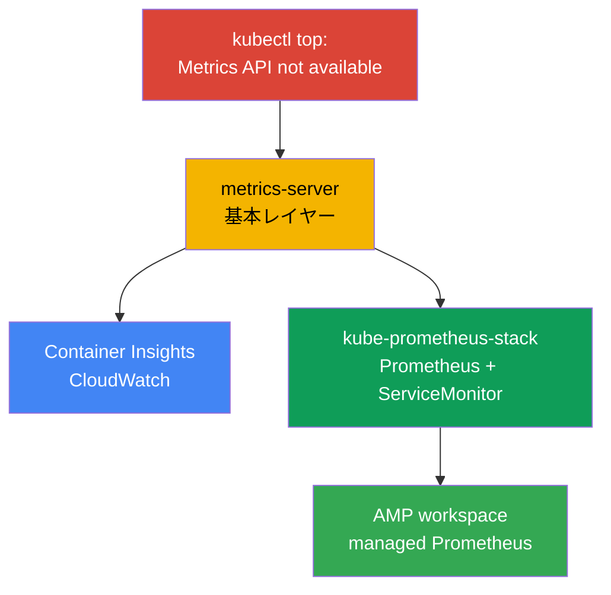
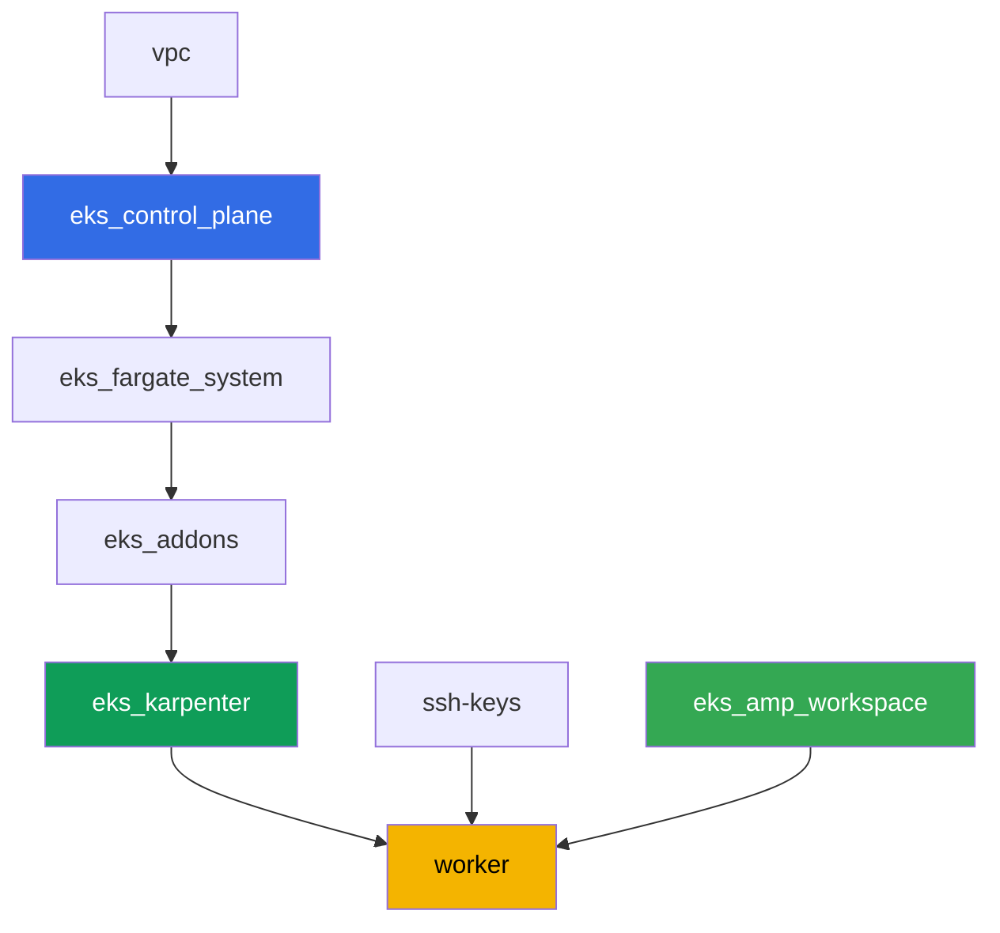

[Русская версия](README_RU.MD) · [Eng version](README.MD) · [Versión en español](README_ES.MD) · [Version française](README_FR.MD) · [Deutsche Version](README_DE.MD) · [ქართული ვერსია](README_GE.MD) · [繁體中文版](README_TW.MD)

# ラボ 114 - 可観測性:Container Insights と Managed Prometheus + Grafana

## 説明

クラスタをデプロイしたばかりで、当直エンジニアの最初の質問「ノードと Pod は今どれくらい
CPU とメモリを使っているのか」に答えられません。`kubectl top` は「Metrics API not
available」で失敗します。このラボでは、症状から実際に動く可観測性までの道筋をたどりま
す。まず基本レイヤー(metrics-server)を修復し、次に AWS-native な経路(管理型アドオン
経由の CloudWatch Container Insights)と Kubernetes-native な経路(ServiceMonitor 配下
の実アプリケーションを伴う kube-prometheus-stack)を立ち上げます。最後に、managed
Prometheus 互換のストレージ(Amazon Managed Prometheus)がすでにメトリクスを受け付ける
準備ができていることを確認します。

タスクは production スタイルで書かれています:短い課題文とアクセプタンス基準。検証は
`check_result` コマンドによって自動的に行われます。

## 目的

コースの以下の章の内容を定着させます:

- [第 33 章。メトリクス:Container Insights、Managed Prometheus、Grafana](../../course/33/ru.md)

## 作成するもの

ラボ 101 のクラスタはすでにデプロイされています。このラボでは、その上に 3 つの可観測性
レイヤーと、メトリクスを受け付ける準備ができた 1 つの managed バックエンドを追加します。

| オブジェクト | 何か | このラボでの目的 |
|--------|---------|-------------------|
| Namespace `eks-114` | ラボのワークロード用のクラスタ区画 | リソースを分離しておく |
| アーティファクト `2/kubectl_top_before.txt` | 空のクラスタでの `kubectl top nodes` の出力 | 「Metrics API not available」という症状を記録する |
| アドオン `metrics-server` | Metrics API の基本レイヤー | `kubectl top` を修復し HPA を支える |
| アーティファクト `3/kubectl_top_after.txt` | 修復後の `kubectl top nodes` の出力 | 基本レイヤーが動作していることを確認する |
| アドオン `amazon-cloudwatch-observability` | クラスタ内の CloudWatch agent | Container Insights:ノード/Pod のメトリクスを CloudWatch に送る |
| アーティファクト `4/cloudwatch_agent_pods.txt` | CloudWatch agent の Pod 一覧 | AWS-native な経路が展開されたことを確認する |
| kube-prometheus-stack(`monitoring`) | Prometheus、Grafana、kube-state-metrics | Kubernetes-native なメトリクス経路 |
| Deployment `ping-app` + `ServiceMonitor` | `/metrics` を持つアプリケーションとそのスクレイプ設定 | Operator の CRD を通じた実際のアプリケーションメトリクス収集 |
| アーティファクト `5/prom_query.txt` | PromQL クエリに対する Prometheus API の応答 | アプリケーションのメトリクスが Prometheus まで届いたことを確認する |
| AMP workspace(terraform) | managed Prometheus 互換のバックエンド | 第 3 の経路:自前のサーバーを持たない managed ストレージ |
| アーティファクト `6/amp_endpoint.txt` | `describe-workspace` の出力 | workspace が remote-write を受け付ける準備ができていることを確認する |

このラボでたどるメトリクスの 3 つの経路:



## インフラストラクチャ

環境はラボ 101 と同様に、Terragrunt によって AWS(`eu-central-1`)にデプロイされます。
ラボの各ディレクトリは 1 つのコンポーネントであり、それぞれ独自の `terragrunt.hcl` を
持ち、`terraform/modules/` の共有モジュールを参照し、`dependency` ブロックで依存関係
を宣言します。Terragrunt は依存関係グラフを構築し、正しい順序でコンポーネントを適用しま
す。このラボに固有のコンポーネントは AMP workspace だけです。可観測性のアドオンと
kube-prometheus-stack は、タスクの中でワーカーマシンから直接 Helm/AWS CLI で導入しま
す。

### モジュールと依存関係

| ディレクトリ(コンポーネント) | モジュール(`terraform/modules/`) | 依存先 | 作成されるもの |
|---------------------|-------------------------------|------------|-------------|
| `vpc` | `vpc_v3` | - | VPC `10.10.0.0/16`、2 つの AZ にあるサブネット、NAT |
| `ssh-keys` | `ssh-keys` | - | ワーカーマシンとノード用の SSH キーペア |
| `eks_control_plane` | `eks_v2_control_plane` | `vpc` | EKS control plane `1.36`、OIDC、security groups |
| `eks_fargate_system` | `eks_v2_fargate` | `vpc`、`eks_control_plane` | `kube-system` と `karpenter` 用の Fargate profile |
| `eks_addons` | `eks_v2_addons` | `eks_control_plane`、`eks_fargate_system` | coredns、kube-proxy、vpc-cni、pod-identity |
| `eks_karpenter` | `eks_v2_karpenter` | `vpc`、`eks_control_plane`、`eks_addons`、`eks_fargate_system` | Karpenter コントローラ、ノードの IAM ロール |
| `eks_karpenter_default_vng` | `eks_v2_karpenter_vng` | `vpc`、`eks_control_plane`、`eks_karpenter` | AL2023 上のデフォルト NodePool `default` |
| `eks_amp_workspace` | `eks_v2_amp_workspace` | - | Amazon Managed Prometheus の workspace |
| `worker` | `eks_v2_work_pc` | `ssh-keys`、`vpc`、`eks_control_plane`、`eks_karpenter`、`eks_amp_workspace` | kubectl、helm、テスト、`check_result` を備えたワーカーマシン |

`eks_amp_workspace` コンポーネントは、予測可能な alias `<prefix>-amp` を持つ AMP
workspace を作成するため、worker は terraform output を読まずにそれを見つけられます。

依存関係グラフ(先に適用されるものほど矢印の下側にある):



### どこで何が設定されるか

`env.hcl`(すべてのコンポーネントが読み込む共通の環境パラメータ):

| パラメータ | ラボでの値 | 影響範囲 |
|----------|-----------------|---------------|
| `region` | `eu-central-1` | AMP workspace を含む、すべてのリソースのリージョン |
| `prefix` | `eks-task114` | リソース名のプレフィックス。AMP workspace の alias にも使われる |
| `stack_name` | `eks114` | ここから `env_name`(クラスタ名)が組み立てられる |
| `k8_version` | `1.36.0` | ワーカーマシン上の kubectl のバージョン |
| `instance_type_worker` | `t3.medium` | ワーカーマシンのインスタンスタイプ |
| `ssh_password_enable`、`access_cidrs` | `true`、`0.0.0.0/0` | ワーカーマシンへの SSH アクセス |

各コンポーネントの `terragrunt.hcl` の `inputs`(モジュール固有のパラメータ)はラボ 101
と同じです:control plane とアドオンのバージョンは `1.36` 系、Karpenter コントローラは
`1.8.1`。違いは `eks_amp_workspace/terragrunt.hcl`(workspace だけを作成する新しいコン
ポーネント)と、`worker/terragrunt.hcl` の中でこのラボのファイルを指す
`test_url`/`task_script_url` です。

> ワーカーマシンの IAM 権限(`terraform/modules/eks_v2_work_pc/iam.tf`)には、追加の Sid
> `ObservabilityReadForMetricsLabs` が 1 つ加えられています:`cloudwatch:ListMetrics/
> GetMetricData/GetMetricStatistics/DescribeAlarms` と `aps:ListWorkspaces/
> DescribeWorkspace/ListRuleGroupsNamespaces/DescribeRuleGroupsNamespace` - 読み取り専用
> で書き込みはありません。これは(SSH アクセスを持つ人間である)worker の IAM ロールの
> 権限であり、CloudWatch agent のものではありません。CloudWatch agent は Karpenter の
> ノードロール上の `CloudWatchAgentServerPolicy` という自分自身のロールを持っています
> (タスク 4 を参照)。

## デプロイ

```bash
TASK=114 make run_eks_task
```

デプロイには約 15-20 分かかります。出力の中からワーカーマシンへの SSH 接続の行を見つけ
て接続してください。そこでは kubectl と helm はすでに設定されており、AMP workspace の
名前と alias はファイル `~/lab114_hints.txt` にあります。

ワーカーマシン上で使える便利なコマンド:

```bash
time_left       # 環境の残り時間
check_result    # 解答の確認
cat ~/lab114_hints.txt   # cluster_name、AMP workspace の alias と endpoint
```

> Helm インストールの所要時間について。kube-prometheus-stack のインストールは通常の
> Deployment より重く、Prometheus、Alertmanager、kube-state-metrics、node-exporter、
> operator が立ち上がるため、すべての Pod が準備完了になるまで約 3-5 分かかります。

> 検証環境のセキュリティについて。`env.hcl` では `ssh_password_enable = true` と
> `access_cidrs = ["0.0.0.0/0"]` が有効になっています。学習用環境としては便利ですが、
> 本番環境ではこのようにしてはいけません。コースの標準(第 0.2、2、19 章)によれば、
> ワーカーマシンへのアクセスは公開 SSH ポートを外に出さずに AWS SSM Session Manager を
> 経由して開き、`access_cidrs` は具体的なアドレスに絞り込みます。ここでは、セットアップ
> を簡単にするためだけに公開 SSH を残しています。

## タスク

---
|        **1**        | **ラボのワークロード用の Namespace**                             |
| :-----------------: | :---------------------------------------------------------- |
| やること          | `eks-114` という名前の namespace を作成してください。ラボのすべてのオブジェクトはこの中に作成されます。 |
| アクセプタンス基準    | - namespace `eks-114` が存在する。 |
---
|        **2**        | **症状:メトリクスがまったく取れない**                              |
| :-----------------: | :---------------------------------------------------------- |
| やること          | まだ何もしていないクラスタで `kubectl top nodes` と `kubectl top pods -A` を実行してください。両方のコマンドが「Metrics API not available」というエラーで失敗します。metrics-server がインストールされていないため、クラスタ内で Metrics API(`metrics.k8s.io`)がまだ登録されていません。両方のコマンドの完全な出力を `/var/work/tests/artifacts/2/kubectl_top_before.txt` に保存してください。 |
| アクセプタンス基準    | - ファイル `2/kubectl_top_before.txt` が空でない;<br/>- `Metrics API not available` を含む。 |
---
|        **3**        | **基本レイヤー:metrics-server アドオン**                      |
| :-----------------: | :---------------------------------------------------------- |
| やること          | managed アドオン `metrics-server` をインストールしてください:`aws eks create-addon --cluster-name <cluster> --addon-name metrics-server`。アドオンの状態が `ACTIVE`(`aws eks describe-addon ... --query addon.status`)になるまで待ち、`kubectl top nodes` が(「not available」の行なしに)使用率を返すようになったことを確認してください。`kubectl top nodes` の出力を `/var/work/tests/artifacts/3/kubectl_top_after.txt` に保存してください。 |
| アクセプタンス基準    | - アドオン `metrics-server` が `ACTIVE` 状態である;<br/>- ファイル `3/kubectl_top_after.txt` が空でなく、「not available」を含まない。 |
---
|        **4**        | **Container Insights:amazon-cloudwatch-observability アドオン** | 
| :-----------------: | :---------------------------------------------------------- |
| やること          | アドオンには CloudWatch にメトリクスを送信する権限が必要です。`-test-` を含む名前(例:`eks-task114-test-cw-agent`)の IAM ロールを作成し、trust policy はプリンシパル `pods.eks.amazonaws.com`(OIDC を使わない EKS Pod Identity)を信頼するようにし、managed policy `CloudWatchAgentServerPolicy` をアタッチしてください。このロールを使い、Pod Identity 経由で managed アドオンをインストールします:`aws eks create-addon --cluster-name <cluster> --addon-name amazon-cloudwatch-observability --pod-identity-associations serviceAccount=cloudwatch-agent,roleArn=<role-arn>`。このアドオンは CloudWatch Observability Operator と CloudWatch agent を namespace `amazon-cloudwatch` に展開します。アドオンの状態が `ACTIVE` になり、CloudWatch agent の Pod が `Running` 状態になるまで待ってください:`kubectl get pods -n amazon-cloudwatch`。この出力を `/var/work/tests/artifacts/4/cloudwatch_agent_pods.txt` に保存してください。 |
| アクセプタンス基準    | - アドオン `amazon-cloudwatch-observability` が `ACTIVE` 状態である;<br/>- label `app.kubernetes.io/name=cloudwatch-agent` を持つ `amazon-cloudwatch` 内の Pod が `Running` 状態である;<br/>- ファイル `4/cloudwatch_agent_pods.txt` が空でなく、`cloudwatch-agent` について言及している。 |
---
|        **5**        | **kube-prometheus-stack:アプリケーションメトリクスの実際の収集**  |
| :-----------------: | :---------------------------------------------------------- |
| やること          | Helm で `kube-prometheus-stack` を namespace `monitoring` にインストールしてください(リポジトリ `prometheus-community`)。values には `prometheus.prometheusSpec.serviceMonitorSelectorNilUsesHelmValues=false` を指定します(そうしないと Prometheus は自分の Helm リリースの ServiceMonitor しか見えません)。Prometheus の Pod が準備完了になるまで待ちます。`eks-114` に Deployment `ping-app`(イメージ `viktoruj/ping_pong:latest`、レプリカ `1`)と、ポート `metrics`(`9090` -> `9090`、アプリケーションはこのポートの `/metrics` で Prometheus メトリクスを返します)を公開する Service `ping-app` を作成してください。`eks-114` に `ServiceMonitor` `ping-app` を、`selector.matchLabels.app: ping-app`、`endpoints[0].port: metrics`、`path: /metrics` で作成してください。Prometheus がターゲットを取り込むまで待ち、`kubectl port-forward` でサービス `<リリース名>-prometheus` にポートを転送し、`curl`(`prometheus` コンテナのイメージにはシェルユーティリティがなく、`wget`/`curl` を使った `kubectl exec` は成功しません)で `/api/v1/query` に `query=requests_total` を指定してリクエストし、JSON レスポンスを `/var/work/tests/artifacts/5/prom_query.txt` に保存してください。 |
| アクセプタンス基準    | - `monitoring` の Prometheus の Pod が `Running` かつ `Ready` である;<br/>- `eks-114` に Deployment `ping-app`、イメージ `viktoruj/ping_pong`、`1` 個の Ready なレプリカ;<br/>- `endpoints[0].port: metrics` を持つ `ServiceMonitor` `ping-app`;<br/>- ファイル `5/prom_query.txt` が空でなく、`requests_total` と `"metric"` を含む。 |
---
|        **6**        | **Managed Prometheus:メトリクスを受け付ける準備ができた workspace**   |
| :-----------------: | :---------------------------------------------------------- |
| やること          | AMP workspace は terraform によってすでに作成されています(alias は `~/lab114_hints.txt` にあります)。その ID を調べ(`aws amp list-workspaces --alias <alias> --query 'workspaces[0].workspaceId' --output text`)、remote-write エンドポイントを取得してください(`aws amp describe-workspace --workspace-id <id> --query "workspace.prometheusEndpoint" --output text`)。`describe-workspace` の完全な出力を `/var/work/tests/artifacts/6/amp_endpoint.txt` に保存してください。完全な remote-write パイプライン(managed collector や ADOT)はこのラボの範囲には含まれません - managed Prometheus 互換のバックエンドが作成され、その endpoint が取得できることを示せば十分です。 |
| アクセプタンス基準    | - alias `<prefix>-amp` を持つ AMP workspace が存在する;<br/>- ファイル `6/amp_endpoint.txt` が空でなく、`aps-workspaces` を含む。 |
---

## 結果の確認

ワーカーマシン上で自動チェックを実行してください:

```bash
check_result
```

タスク 3-5 は、アドオンと Pod の準備完了を時間制限付きのループ(最大数分)で待つため、
`check_result` が通常より長くかかっても心配しないでください。

## 解答

参考解答:[worker/files/solutions/1_JP.MD](worker/files/solutions/1_JP.MD)

## クラスタとリソースの削除

このラボでは、複数のオブジェクトが terraform ではなく AWS CLI/Helm から直接作成されて
います:managed アドオン `metrics-server` と `amazon-cloudwatch-observability`、IAM
ロール `eks-task114-test-cw-agent`、そして Karpenter が CloudWatch agent の DaemonSet
と kube-prometheus-stack のために立ち上げた EC2 ノードです。Terraform はこれらのことを
知らないので削除しません - `destroy` を先に実行すると、取り残された EC2 ノードが ENI を
保持し続け、VPC/サブネットの削除をブロックします(ラボ 108、109、111 と同じパターンで
す)。`destroy` の前に、手動でこれらを片付けてください:

```bash
CLUSTER=$(aws eks list-clusters --query 'clusters[0]' --output text)

# 1. Karpenter が EC2 ノードを立ち上げる原因となったワークロードを外す
helm uninstall kube-prometheus-stack -n monitoring
kubectl delete namespace eks-114 monitoring amazon-cloudwatch

# 2. タスク 3、4 で手動でインストールした managed アドオンを削除する
aws eks delete-addon --cluster-name "$CLUSTER" --addon-name amazon-cloudwatch-observability
aws eks delete-addon --cluster-name "$CLUSTER" --addon-name metrics-server

# 3. タスク 4 で作成した CloudWatch agent の IAM ロールを削除する
aws iam detach-role-policy --role-name eks-task114-test-cw-agent \
  --policy-arn arn:aws:iam::aws:policy/CloudWatchAgentServerPolicy
aws iam delete-role --role-name eks-task114-test-cw-agent

# 4. Karpenter が自分自身で EC2 ノードを取り除くまで待つ(Node オブジェクトを削除するだ
#    けでなく EC2 インスタンス自体を終了させる) - 両方の出力が空になるはず
for i in $(seq 1 30); do
  nc=$(kubectl get nodeclaims --no-headers 2>/dev/null | wc -l)
  ec2=$(aws ec2 describe-instances \
    --filters "Name=tag:karpenter.sh/nodepool,Values=default" \
      "Name=instance-state-name,Values=running,pending,stopping,stopped" \
    --query 'Reservations[].Instances[]' --output text)
  echo "nodeclaims=$nc ec2_instances=[$ec2]"
  [[ "$nc" == "0" ]] && [[ -z "$ec2" ]] && break
  sleep 10
done
```

`nodeclaims=0` になり、EC2 インスタンスの一覧が空になったことを確認してから、terraform
リソースの削除を実行してください:

```bash
TASK=114 make delete_eks_task
```
