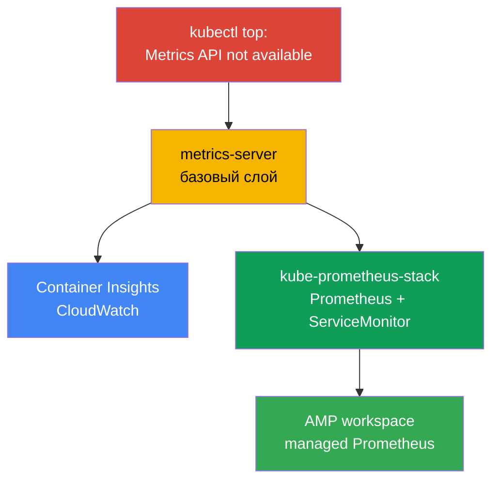
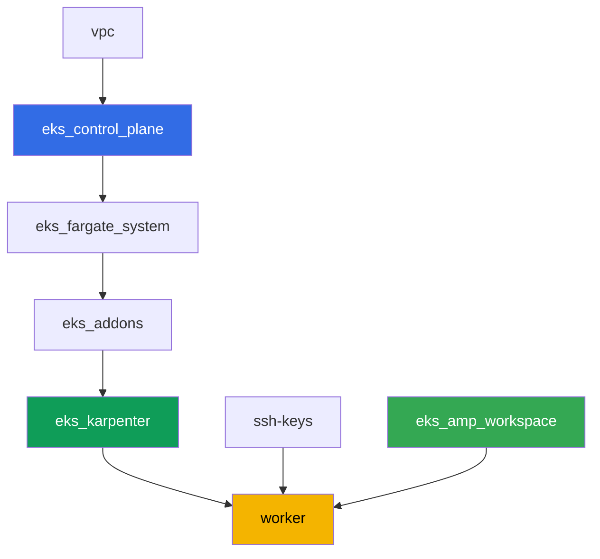

[Eng version](README.MD) · [Versión en español](README_ES.MD) · [Version française](README_FR.MD) · [Deutsche Version](README_DE.MD) · [ქართული ვერსია](README_GE.MD) · [繁體中文版](README_TW.MD) · [日本語版](README_JP.MD)

# Лаба 114 - Наблюдаемость: Container Insights и Managed Prometheus с Grafana

## Описание

Кластер только развёрнут, и первый же вопрос дежурного инженера - «а сколько CPU и памяти
сейчас едят ноды и поды» - остаётся без ответа: `kubectl top` падает с «Metrics API not
available». В этой лабе вы проходите путь от симптома к рабочей наблюдаемости: сначала
чините базовый слой (metrics-server), затем поднимаете AWS-native путь (CloudWatch
Container Insights через управляемый аддон) и Kubernetes-native путь
(kube-prometheus-stack с реальным приложением под ServiceMonitor). В конце убеждаетесь,
что managed Prometheus-совместимое хранилище (Amazon Managed Prometheus) уже готово
принимать метрики.

Задания в продакшн-стиле: короткая постановка плюс критерии приёмки. Проверка -
автоматическая, командой `check_result`.

## Цель

Закрепить материал главы курса:

- [Глава 33. Метрики: Container Insights, Managed Prometheus и Grafana](../../course/33/ru.md)

## Что мы создаём

Кластер из лабы 101 уже развёрнут. В этой лабе вы добавляете три слоя наблюдаемости
поверх него и один managed бэкенд, готовый принимать метрики.

| Объект | Что это | Зачем в этой лабе |
|--------|---------|-------------------|
| Namespace `eks-114` | раздел кластера под нагрузку лабы | держим ресурсы отдельно |
| Артефакт `2/kubectl_top_before.txt` | вывод `kubectl top nodes` на пустом кластере | фиксируем симптом «Metrics API not available» |
| Аддон `metrics-server` | базовый слой Metrics API | чинит `kubectl top` и питает HPA |
| Артефакт `3/kubectl_top_after.txt` | вывод `kubectl top nodes` после фикса | подтверждаем, что базовый слой работает |
| Аддон `amazon-cloudwatch-observability` | CloudWatch agent в кластере | Container Insights: метрики нод/подов в CloudWatch |
| Артефакт `4/cloudwatch_agent_pods.txt` | поды CloudWatch agent | подтверждаем, что AWS-native путь развернулся |
| kube-prometheus-stack (`monitoring`) | Prometheus, Grafana, kube-state-metrics | Kubernetes-native путь метрик |
| Deployment `ping-app` + `ServiceMonitor` | приложение с `/metrics` и его скрейп | реальный сбор метрик приложения через CRD Operator-а |
| Артефакт `5/prom_query.txt` | ответ Prometheus API на PromQL-запрос | подтверждаем, что метрика приложения долетела до Prometheus |
| AMP workspace (terraform) | managed Prometheus-совместимый бэкенд | третий путь: managed хранилище без своего сервера |
| Артефакт `6/amp_endpoint.txt` | вывод `describe-workspace` | подтверждаем готовность workspace принимать remote-write |

Три пути метрик, которые вы проходите в этой лабе:



## Инфраструктура

Окружение разворачивается в AWS (`eu-central-1`) через Terragrunt, как в лабе 101. Каждый
каталог лабы - это один компонент со своим `terragrunt.hcl`, который ссылается на общий
модуль в `terraform/modules/` и объявляет зависимости через блоки `dependency`. Terragrunt
строит граф зависимостей и применяет компоненты в правильном порядке. Специфический для
этой лабы компонент - только AMP workspace; аддоны наблюдаемости и kube-prometheus-stack
ставятся Helm/AWS CLI прямо с рабочей машины в рамках заданий.

### Модули и зависимости

| Каталог (компонент) | Модуль (`terraform/modules/`) | Зависит от | Что создаёт |
|---------------------|-------------------------------|------------|-------------|
| `vpc` | `vpc_v3` | - | VPC `10.10.0.0/16`, подсети в двух AZ, NAT |
| `ssh-keys` | `ssh-keys` | - | пара SSH-ключей для рабочей машины и нод |
| `eks_control_plane` | `eks_v2_control_plane` | `vpc` | control plane EKS `1.36`, OIDC, security groups |
| `eks_fargate_system` | `eks_v2_fargate` | `vpc`, `eks_control_plane` | Fargate-профиль для `kube-system` и `karpenter` |
| `eks_addons` | `eks_v2_addons` | `eks_control_plane`, `eks_fargate_system` | coredns, kube-proxy, vpc-cni, pod-identity |
| `eks_karpenter` | `eks_v2_karpenter` | `vpc`, `eks_control_plane`, `eks_addons`, `eks_fargate_system` | контроллер Karpenter, IAM-роль нод |
| `eks_karpenter_default_vng` | `eks_v2_karpenter_vng` | `vpc`, `eks_control_plane`, `eks_karpenter` | дефолтный NodePool `default` на AL2023 |
| `eks_amp_workspace` | `eks_v2_amp_workspace` | - | workspace Amazon Managed Prometheus |
| `worker` | `eks_v2_work_pc` | `ssh-keys`, `vpc`, `eks_control_plane`, `eks_karpenter`, `eks_amp_workspace` | рабочая машина с kubectl, helm, тестами и `check_result` |

Компонент `eks_amp_workspace` создаёт AMP workspace с предсказуемым alias
`<prefix>-amp`, поэтому worker находит его без чтения terraform output.

Граф зависимостей (что применяется раньше, то ниже по стрелке):



### Где что настраивается

`env.hcl` (общие параметры окружения, читаются всеми компонентами):

| Параметр | Значение в лабе | На что влияет |
|----------|-----------------|---------------|
| `region` | `eu-central-1` | регион всех ресурсов, включая AMP workspace |
| `prefix` | `eks-task114` | префикс имён ресурсов, в том числе alias AMP workspace |
| `stack_name` | `eks114` | из него собирается `env_name` - имя кластера |
| `k8_version` | `1.36.0` | версия kubectl на рабочей машине |
| `instance_type_worker` | `t3.medium` | тип инстанса рабочей машины |
| `ssh_password_enable`, `access_cidrs` | `true`, `0.0.0.0/0` | доступ по SSH к рабочей машине |

`inputs` в `terragrunt.hcl` каждого компонента (параметры конкретного модуля) совпадают с
лабой 101: версии control plane и аддонов под `1.36`, контроллер Karpenter `1.8.1`. Отличия:
`eks_amp_workspace/terragrunt.hcl` (новый компонент, создаёт только workspace) и
`test_url`/`task_script_url` в `worker/terragrunt.hcl`, указывающие на файлы этой лабы.

> Права IAM у рабочей машины (`terraform/modules/eks_v2_work_pc/iam.tf`) дополнены одним
> additive Sid `ObservabilityReadForMetricsLabs`: `cloudwatch:ListMetrics/GetMetricData/
> GetMetricStatistics/DescribeAlarms` и `aps:ListWorkspaces/DescribeWorkspace/
> ListRuleGroupsNamespaces/DescribeRuleGroupsNamespace` - только чтение, без записи. Это
> права уровня IAM-роли worker-а (человека с SSH-доступом), а не CloudWatch agent - у него
> своя роль через `CloudWatchAgentServerPolicy` на роли ноды Karpenter (см. задание 4).

## Развёртывание

```bash
TASK=114 make run_eks_task
```

Развёртывание занимает примерно 15-20 минут. В выводе найдите строку с SSH-подключением к
рабочей машине и подключитесь к ней. kubectl и helm там уже настроены, а имя и alias AMP
workspace - в файле `~/lab114_hints.txt`.

Полезные команды на рабочей машине:

```bash
time_left       # сколько осталось времени окружения
check_result    # проверить решение
cat ~/lab114_hints.txt   # cluster_name, alias и endpoint AMP workspace
```

> Время на Helm-установки. Установка kube-prometheus-stack тяжелее обычного Deployment:
> поднимаются Prometheus, Alertmanager, kube-state-metrics, node-exporter и operator, это
> занимает примерно 3-5 минут до готовности всех подов.

> Безопасность стенда. В `env.hcl` включены `ssh_password_enable = true` и
> `access_cidrs = ["0.0.0.0/0"]` - это удобно для учебного окружения, но так делать в
> продакшене нельзя. По стандартам курса (главы 0.2, 2, 19) доступ к рабочим машинам
> открывают через AWS SSM Session Manager без публичных SSH-портов наружу, а `access_cidrs`
> сужают до конкретных адресов. Здесь публичный SSH оставлен только ради простоты запуска.

## Задания

---
|        **1**        | **Namespace для нагрузки лабы**                             |
| :-----------------: | :---------------------------------------------------------- |
| Что делаем          | Создайте namespace с именем `eks-114`. Все объекты лабы создаются внутри него. |
| Критерии приёмки    | - namespace `eks-114` существует. |
---
|        **2**        | **Симптом: метрик нет вообще**                              |
| :-----------------: | :---------------------------------------------------------- |
| Что делаем          | На свежем кластере выполните `kubectl top nodes` и `kubectl top pods -A`. Обе команды падают с ошибкой «Metrics API not available» - Metrics API (`metrics.k8s.io`) в кластере ещё не зарегистрирован, потому что metrics-server не установлен. Сохраните полный вывод (обе команды) в `/var/work/tests/artifacts/2/kubectl_top_before.txt`. |
| Критерии приёмки    | - файл `2/kubectl_top_before.txt` не пуст;<br/>- содержит `Metrics API not available`. |
---
|        **3**        | **Базовый слой: аддон metrics-server**                      |
| :-----------------: | :---------------------------------------------------------- |
| Что делаем          | Установите managed-аддон `metrics-server`: `aws eks create-addon --cluster-name <cluster> --addon-name metrics-server`. Дождитесь состояния аддона `ACTIVE` (`aws eks describe-addon ... --query addon.status`) и убедитесь, что `kubectl top nodes` начал отдавать загрузку (без строки «not available»). Сохраните вывод `kubectl top nodes` в `/var/work/tests/artifacts/3/kubectl_top_after.txt`. |
| Критерии приёмки    | - аддон `metrics-server` в состоянии `ACTIVE`;<br/>- файл `3/kubectl_top_after.txt` не пуст и не содержит «not available». |
---
|        **4**        | **Container Insights: аддон amazon-cloudwatch-observability** |
| :-----------------: | :---------------------------------------------------------- |
| Что делаем          | Аддону нужны права на публикацию метрик в CloudWatch. Создайте IAM-роль с именем, содержащим `-test-` (например `eks-task114-test-cw-agent`), с trust policy на принципала `pods.eks.amazonaws.com` (EKS Pod Identity, без OIDC), и прикрепите к ней managed policy `CloudWatchAgentServerPolicy`. Установите managed-аддон с этой ролью через Pod Identity: `aws eks create-addon --cluster-name <cluster> --addon-name amazon-cloudwatch-observability --pod-identity-associations serviceAccount=cloudwatch-agent,roleArn=<role-arn>`. Аддон разворачивает CloudWatch Observability Operator и CloudWatch agent в namespace `amazon-cloudwatch`. Дождитесь состояния аддона `ACTIVE` и подов CloudWatch agent в статусе `Running`: `kubectl get pods -n amazon-cloudwatch`. Сохраните этот вывод в `/var/work/tests/artifacts/4/cloudwatch_agent_pods.txt`. |
| Критерии приёмки    | - аддон `amazon-cloudwatch-observability` в состоянии `ACTIVE`;<br/>- поды с label `app.kubernetes.io/name=cloudwatch-agent` в `amazon-cloudwatch` в статусе `Running`;<br/>- файл `4/cloudwatch_agent_pods.txt` не пуст и упоминает `cloudwatch-agent`. |
---
|        **5**        | **kube-prometheus-stack: реальный сбор метрик приложения**  |
| :-----------------: | :---------------------------------------------------------- |
| Что делаем          | Установите `kube-prometheus-stack` через Helm в namespace `monitoring` (репозиторий `prometheus-community`), с values `prometheus.prometheusSpec.serviceMonitorSelectorNilUsesHelmValues=false` (иначе Prometheus увидит только ServiceMonitor из своего Helm-релиза). Дождитесь готовности подов Prometheus. В `eks-114` создайте Deployment `ping-app` (образ `viktoruj/ping_pong:latest`, `1` реплика) и Service `ping-app`, публикующий порт `metrics` (`9090` -> `9090`, приложение отдаёт метрики Prometheus по `/metrics` на этом порту). Создайте `ServiceMonitor` `ping-app` в `eks-114` с `selector.matchLabels.app: ping-app`, `endpoints[0].port: metrics`, `path: /metrics`. Подождите, пока Prometheus подхватит таргет, затем через `kubectl port-forward` на сервис `<имя-релиза>-prometheus` и `curl` (образ контейнера `prometheus` без shell-утилит, `kubectl exec` с `wget`/`curl` не сработает) выполните запрос к `/api/v1/query` с `query=requests_total` и сохраните JSON-ответ в `/var/work/tests/artifacts/5/prom_query.txt`. |
| Критерии приёмки    | - поды Prometheus в `monitoring` `Running` и `Ready`;<br/>- Deployment `ping-app` в `eks-114`, образ `viktoruj/ping_pong`, `1` готовая реплика;<br/>- `ServiceMonitor` `ping-app` с `endpoints[0].port: metrics`;<br/>- файл `5/prom_query.txt` не пуст, содержит `requests_total` и `"metric"`. |
---
|        **6**        | **Managed Prometheus: workspace готов принимать метрики**   |
| :-----------------: | :---------------------------------------------------------- |
| Что делаем          | AMP workspace уже создан terraform-ом (alias в `~/lab114_hints.txt`). Найдите его ID (`aws amp list-workspaces --alias <alias> --query 'workspaces[0].workspaceId' --output text`) и получите remote-write endpoint (`aws amp describe-workspace --workspace-id <id> --query "workspace.prometheusEndpoint" --output text`). Сохраните полный вывод `describe-workspace` в `/var/work/tests/artifacts/6/amp_endpoint.txt`. Полноценный remote-write pipeline (managed collector или ADOT) в объём этой лабы не входит - достаточно показать, что managed Prometheus-совместимый бэкенд создан и его endpoint получен. |
| Критерии приёмки    | - AMP workspace с alias `<prefix>-amp` существует;<br/>- файл `6/amp_endpoint.txt` не пуст и содержит `aps-workspaces`. |
---

## Проверка результата

На рабочей машине запустите автоматическую проверку:

```bash
check_result
```

Тесты 3-5 ждут готовности аддонов и подов циклами с ограничением по времени (до нескольких
минут), поэтому не пугайтесь, если `check_result` выполняется дольше обычного.

## Решение

Эталонное решение: [worker/files/solutions/1_RU.MD](worker/files/solutions/1_RU.MD)

## Удаление кластера и ресурсов

В этой лабе несколько объектов созданы напрямую через AWS CLI/Helm, а не terraform-ом:
managed-аддоны `metrics-server` и `amazon-cloudwatch-observability`, IAM-роль
`eks-task114-test-cw-agent` и EC2-ноды, которые Karpenter поднял под DaemonSet CloudWatch
agent и под kube-prometheus-stack. Terraform не знает про них и не удалит - если начать
`destroy` раньше, осиротевшие EC2-ноды держат ENI и блокируют удаление VPC/подсетей (тот же
паттерн, что в лабах 108, 109, 111). Перед `destroy` почистите их вручную:

```bash
CLUSTER=$(aws eks list-clusters --query 'clusters[0]' --output text)

# 1. Снимаем нагрузку, из-за которой Karpenter поднял EC2-ноды
helm uninstall kube-prometheus-stack -n monitoring
kubectl delete namespace eks-114 monitoring amazon-cloudwatch

# 2. Удаляем managed-аддоны, поставленные вручную в заданиях 3 и 4
aws eks delete-addon --cluster-name "$CLUSTER" --addon-name amazon-cloudwatch-observability
aws eks delete-addon --cluster-name "$CLUSTER" --addon-name metrics-server

# 3. Удаляем IAM-роль CloudWatch agent, созданную в задании 4
aws iam detach-role-policy --role-name eks-task114-test-cw-agent \
  --policy-arn arn:aws:iam::aws:policy/CloudWatchAgentServerPolicy
aws iam delete-role --role-name eks-task114-test-cw-agent

# 4. Дожидаемся, пока Karpenter сам уберёт EC2-ноды (не просто удалит объект Node,
#    а завершит сам EC2-инстанс) - должно быть пусто в обоих выводах
for i in $(seq 1 30); do
  nc=$(kubectl get nodeclaims --no-headers 2>/dev/null | wc -l)
  ec2=$(aws ec2 describe-instances \
    --filters "Name=tag:karpenter.sh/nodepool,Values=default" \
      "Name=instance-state-name,Values=running,pending,stopping,stopped" \
    --query 'Reservations[].Instances[]' --output text)
  echo "nodeclaims=$nc ec2_instances=[$ec2]"
  [[ "$nc" == "0" ]] && [[ -z "$ec2" ]] && break
  sleep 10
done
```

Только после того как `nodeclaims=0` и список EC2-инстансов пуст, запускайте удаление
terraform-ресурсов:

```bash
TASK=114 make delete_eks_task
```
