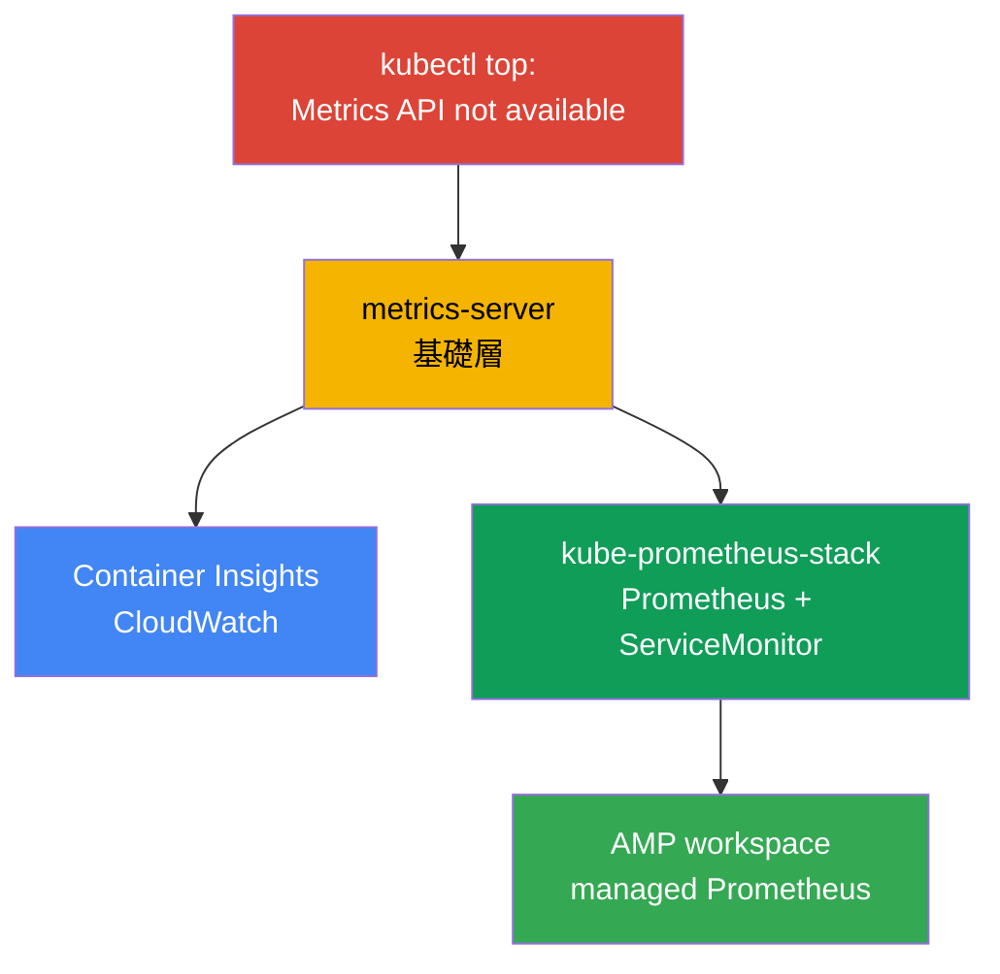
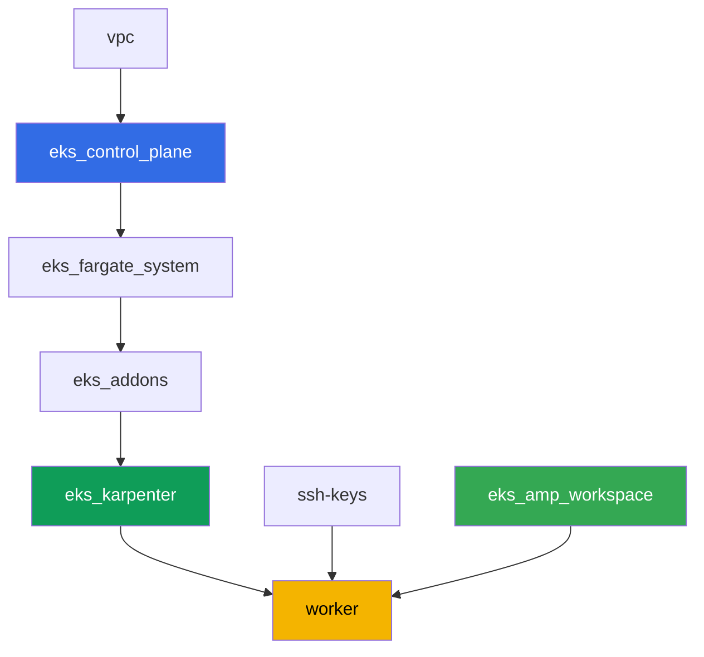

[Русская версия](README_RU.MD) · [Eng version](README.MD) · [Versión en español](README_ES.MD) · [Version française](README_FR.MD) · [Deutsche Version](README_DE.MD) · [ქართული ვერსია](README_GE.MD) · [日本語版](README_JP.MD)

# 實驗 114 - 可觀測性:Container Insights 與 Managed Prometheus + Grafana

## 說明

集群剛部署完成,值班工程師的第一個問題 -「節點和 Pod 現在吃了多少 CPU 和記憶體」- 就
得不到答案:`kubectl top` 會失敗,報「Metrics API not available」。在這個實驗中你會走完
從症狀到可用可觀測性的完整路徑:先修好基礎層(metrics-server),再搭建 AWS-native 路徑
(透過受管理附加元件的 CloudWatch Container Insights)和 Kubernetes-native 路徑
(帶有真實應用程式、由 ServiceMonitor 抓取的 kube-prometheus-stack)。最後你會確認
managed Prometheus 相容儲存(Amazon Managed Prometheus)已經準備好接收指標。

任務以生產風格編寫:簡短的任務描述加驗收標準。驗證是自動的,透過 `check_result` 命令
完成。

## 目標

鞏固以下課程章節的內容:

- [第 33 章。指標:Container Insights、Managed Prometheus 與 Grafana](../../course/33/ru.md)

## 我們要創建什麼

實驗 101 的集群已經部署完成。在這個實驗中,你會在其之上添加三層可觀測性,以及一個已
準備好接收指標的 managed 後端。

| 對象 | 這是什麼 | 在這個實驗中的作用 |
|--------|---------|-------------------|
| Namespace `eks-114` | 供實驗負載使用的集群區域 | 讓資源保持隔離 |
| 產物 `2/kubectl_top_before.txt` | 空集群上 `kubectl top nodes` 的輸出 | 記錄「Metrics API not available」這個症狀 |
| 附加元件 `metrics-server` | Metrics API 的基礎層 | 修復 `kubectl top` 並為 HPA 提供資料 |
| 產物 `3/kubectl_top_after.txt` | 修復後 `kubectl top nodes` 的輸出 | 確認基礎層已正常運作 |
| 附加元件 `amazon-cloudwatch-observability` | 集群中的 CloudWatch agent | Container Insights:節點/Pod 指標進入 CloudWatch |
| 產物 `4/cloudwatch_agent_pods.txt` | CloudWatch agent 的 Pod | 確認 AWS-native 路徑已部署 |
| kube-prometheus-stack(`monitoring`) | Prometheus、Grafana、kube-state-metrics | Kubernetes-native 指標路徑 |
| Deployment `ping-app` + `ServiceMonitor` | 帶有 `/metrics` 的應用程式及其抓取設定 | 透過 CRD Operator 真正收集應用程式指標 |
| 產物 `5/prom_query.txt` | Prometheus API 對 PromQL 查詢的回應 | 確認應用程式指標已抵達 Prometheus |
| AMP workspace(terraform) | managed Prometheus 相容後端 | 第三條路徑:無需自建伺服器的 managed 儲存 |
| 產物 `6/amp_endpoint.txt` | `describe-workspace` 的輸出 | 確認 workspace 已準備好接收 remote-write |

你在這個實驗中會走完的三條指標路徑:



## 基礎設施

環境透過 Terragrunt 部署在 AWS(`eu-central-1`),與實驗 101 相同。每個實驗目錄都是一
個組件,擁有自己的 `terragrunt.hcl`,它引用 `terraform/modules/` 中的共用模組,並透過
`dependency` 區塊聲明依賴關係。Terragrunt 會構建依賴關係圖並按正確的順序套用各個組
件。這個實驗特有的組件只有 AMP workspace;可觀測性附加元件和 kube-prometheus-stack 都
是在任務中直接從工作機透過 Helm/AWS CLI 安裝的。

### 模組與依賴關係

| 目錄(組件) | 模組(`terraform/modules/`) | 依賴於 | 創建了什麼 |
|---------------------|-------------------------------|------------|-------------|
| `vpc` | `vpc_v3` | - | VPC `10.10.0.0/16`,兩個 AZ 中的子網,NAT |
| `ssh-keys` | `ssh-keys` | - | 供工作機與節點使用的一對 SSH 金鑰 |
| `eks_control_plane` | `eks_v2_control_plane` | `vpc` | EKS control plane `1.36`、OIDC、security groups |
| `eks_fargate_system` | `eks_v2_fargate` | `vpc`、`eks_control_plane` | `kube-system` 與 `karpenter` 的 Fargate 配置檔 |
| `eks_addons` | `eks_v2_addons` | `eks_control_plane`、`eks_fargate_system` | coredns、kube-proxy、vpc-cni、pod-identity |
| `eks_karpenter` | `eks_v2_karpenter` | `vpc`、`eks_control_plane`、`eks_addons`、`eks_fargate_system` | Karpenter 控制器、節點 IAM 角色 |
| `eks_karpenter_default_vng` | `eks_v2_karpenter_vng` | `vpc`、`eks_control_plane`、`eks_karpenter` | 基於 AL2023 的預設 NodePool `default` |
| `eks_amp_workspace` | `eks_v2_amp_workspace` | - | Amazon Managed Prometheus 的 workspace |
| `worker` | `eks_v2_work_pc` | `ssh-keys`、`vpc`、`eks_control_plane`、`eks_karpenter`、`eks_amp_workspace` | 帶有 kubectl、helm、測試腳本和 `check_result` 的工作機 |

組件 `eks_amp_workspace` 創建的 AMP workspace 帶有可預測的 alias `<prefix>-amp`,因此
worker 可以直接找到它,而不需要讀取 terraform output。

依賴關係圖(較早套用的組件位於箭頭下方):



### 各項設定在哪裡配置

`env.hcl`(所有組件共用並讀取的環境參數):

| 參數 | 實驗中的值 | 影響什麼 |
|----------|-----------------|---------------|
| `region` | `eu-central-1` | 所有資源(包括 AMP workspace)的區域 |
| `prefix` | `eks-task114` | 資源名稱的前綴,包括 AMP workspace 的 alias |
| `stack_name` | `eks114` | 用於構建 `env_name` - 集群名稱 |
| `k8_version` | `1.36.0` | 工作機上 kubectl 的版本 |
| `instance_type_worker` | `t3.medium` | 工作機的 instance 類型 |
| `ssh_password_enable`、`access_cidrs` | `true`、`0.0.0.0/0` | 對工作機的 SSH 存取 |

每個組件 `terragrunt.hcl` 中的 `inputs`(該模組特定的參數)與實驗 101 相同:control
plane 與附加元件的版本對應 `1.36`,Karpenter 控制器 `1.8.1`。差異在於
`eks_amp_workspace/terragrunt.hcl`(新組件,僅創建 workspace)以及 `worker/terragrunt.hcl`
中指向這個實驗檔案的 `test_url`/`task_script_url`。

> 工作機的 IAM 權限(`terraform/modules/eks_v2_work_pc/iam.tf`)增加了一個 additive
> Sid `ObservabilityReadForMetricsLabs`:`cloudwatch:ListMetrics/GetMetricData/
> GetMetricStatistics/DescribeAlarms` 以及 `aps:ListWorkspaces/DescribeWorkspace/
> ListRuleGroupsNamespaces/DescribeRuleGroupsNamespace` - 僅限讀取,沒有寫入權限。這是
> worker(擁有 SSH 存取權的人)的 IAM 角色權限,而不是 CloudWatch agent 的 - agent 有
> 自己的角色,透過 `CloudWatchAgentServerPolicy` 綁定在 Karpenter 節點的角色上(見任務
> 4)。

## 部署

```bash
TASK=114 make run_eks_task
```

部署大約需要 15-20 分鐘。在輸出中找到連接工作機的 SSH 那一行並連接上去。kubectl 和
helm 在那裡已經配置好,AMP workspace 的名稱和 alias 在檔案 `~/lab114_hints.txt` 中。

工作機上的常用命令:

```bash
time_left       # 環境剩餘的時間
check_result    # 檢查解答
cat ~/lab114_hints.txt   # AMP workspace 的 cluster_name、alias 和 endpoint
```

> Helm 安裝所需的時間。安裝 kube-prometheus-stack 比一般的 Deployment 重得多:會啟動
> Prometheus、Alertmanager、kube-state-metrics、node-exporter 和 operator,所有 Pod 就
> 緒大約需要 3-5 分鐘。

> 測試環境的安全性。`env.hcl` 中啟用了 `ssh_password_enable = true` 和
> `access_cidrs = ["0.0.0.0/0"]` - 這對於學習環境很方便,但在生產環境中不應該這樣做。
> 依照課程標準(第 0.2、2、19 章),對工作機的存取應透過 AWS SSM Session Manager 進行,
> 不對外暴露公開的 SSH 端口,並將 `access_cidrs` 限制到具體的位址。這裡保留公開 SSH 只
> 是為了簡化啟動流程。

## 任務

---
|        **1**        | **供實驗負載使用的 Namespace**                             |
| :-----------------: | :---------------------------------------------------------- |
| 我們要做什麼          | 創建一個名為 `eks-114` 的 namespace。實驗中的所有對象都在其中創建。 |
| 驗收標準    | - namespace `eks-114` 存在。 |
---
|        **2**        | **症狀:完全沒有指標**                              |
| :-----------------: | :---------------------------------------------------------- |
| 我們要做什麼          | 在剛部署好的集群上執行 `kubectl top nodes` 和 `kubectl top pods -A`。兩個命令都會失敗,報「Metrics API not available」- 集群中還沒有註冊 Metrics API(`metrics.k8s.io`),因為 metrics-server 還沒安裝。將完整輸出(兩個命令)保存到 `/var/work/tests/artifacts/2/kubectl_top_before.txt`。 |
| 驗收標準    | - 檔案 `2/kubectl_top_before.txt` 不為空;<br/>- 包含 `Metrics API not available`。 |
---
|        **3**        | **基礎層:附加元件 metrics-server**                      |
| :-----------------: | :---------------------------------------------------------- |
| 我們要做什麼          | 安裝受管理附加元件 `metrics-server`:`aws eks create-addon --cluster-name <cluster> --addon-name metrics-server`。等待附加元件進入 `ACTIVE` 狀態(`aws eks describe-addon ... --query addon.status`),並確認 `kubectl top nodes` 已開始正常回傳負載資料(不再出現「not available」)。將 `kubectl top nodes` 的輸出保存到 `/var/work/tests/artifacts/3/kubectl_top_after.txt`。 |
| 驗收標準    | - 附加元件 `metrics-server` 處於 `ACTIVE` 狀態;<br/>- 檔案 `3/kubectl_top_after.txt` 不為空且不包含「not available」。 |
---
|        **4**        | **Container Insights:附加元件 amazon-cloudwatch-observability** |
| :-----------------: | :---------------------------------------------------------- |
| 我們要做什麼          | 附加元件需要向 CloudWatch 發佈指標的權限。創建一個名稱中包含 `-test-` 的 IAM 角色(例如 `eks-task114-test-cw-agent`),trust policy 信任 `pods.eks.amazonaws.com` 這個 principal(EKS Pod Identity,不使用 OIDC),並附加 managed policy `CloudWatchAgentServerPolicy`。透過 Pod Identity 安裝受管理附加元件:`aws eks create-addon --cluster-name <cluster> --addon-name amazon-cloudwatch-observability --pod-identity-associations serviceAccount=cloudwatch-agent,roleArn=<role-arn>`。這個附加元件會在 namespace `amazon-cloudwatch` 中部署 CloudWatch Observability Operator 和 CloudWatch agent。等待附加元件進入 `ACTIVE` 狀態,並等待 CloudWatch agent 的 Pod 進入 `Running` 狀態:`kubectl get pods -n amazon-cloudwatch`。將這個輸出保存到 `/var/work/tests/artifacts/4/cloudwatch_agent_pods.txt`。 |
| 驗收標準    | - 附加元件 `amazon-cloudwatch-observability` 處於 `ACTIVE` 狀態;<br/>- `amazon-cloudwatch` 中帶有 label `app.kubernetes.io/name=cloudwatch-agent` 的 Pod 處於 `Running` 狀態;<br/>- 檔案 `4/cloudwatch_agent_pods.txt` 不為空並提到 `cloudwatch-agent`。 |
---
|        **5**        | **kube-prometheus-stack:真正收集應用程式指標**  |
| :-----------------: | :---------------------------------------------------------- |
| 我們要做什麼          | 透過 Helm 在 namespace `monitoring` 中安裝 `kube-prometheus-stack`(倉庫 `prometheus-community`),values 設定 `prometheus.prometheusSpec.serviceMonitorSelectorNilUsesHelmValues=false`(否則 Prometheus 只會看到自己 Helm release 中的 ServiceMonitor)。等待 Prometheus 的 Pod 就緒。在 `eks-114` 中創建 Deployment `ping-app`(映像 `viktoruj/ping_pong:latest`,`1` 個副本)和 Service `ping-app`,對外公開 `metrics` 端口(`9090` -> `9090`,應用程式在這個端口上透過 `/metrics` 提供 Prometheus 指標)。在 `eks-114` 中創建 `ServiceMonitor` `ping-app`,設定 `selector.matchLabels.app: ping-app`、`endpoints[0].port: metrics`、`path: /metrics`。等待 Prometheus 抓取到這個目標,然後透過 `kubectl port-forward` 連到服務 `<release名稱>-prometheus`,再用 `curl`(容器 `prometheus` 的映像沒有 shell 工具,`kubectl exec` 配合 `wget`/`curl` 不會成功)向 `/api/v1/query` 發送請求,查詢 `query=requests_total`,並將 JSON 回應保存到 `/var/work/tests/artifacts/5/prom_query.txt`。 |
| 驗收標準    | - `monitoring` 中的 Prometheus Pod 處於 `Running` 且 `Ready`;<br/>- Deployment `ping-app` 在 `eks-114` 中,映像為 `viktoruj/ping_pong`,`1` 個就緒副本;<br/>- `ServiceMonitor` `ping-app` 的 `endpoints[0].port: metrics`;<br/>- 檔案 `5/prom_query.txt` 不為空,包含 `requests_total` 和 `"metric"`。 |
---
|        **6**        | **Managed Prometheus:workspace 已準備好接收指標**   |
| :-----------------: | :---------------------------------------------------------- |
| 我們要做什麼          | AMP workspace 已經由 terraform 創建好(alias 在 `~/lab114_hints.txt` 中)。找到它的 ID(`aws amp list-workspaces --alias <alias> --query 'workspaces[0].workspaceId' --output text`),並取得 remote-write endpoint(`aws amp describe-workspace --workspace-id <id> --query "workspace.prometheusEndpoint" --output text`)。將 `describe-workspace` 的完整輸出保存到 `/var/work/tests/artifacts/6/amp_endpoint.txt`。完整的 remote-write 管線(managed collector 或 ADOT)不在這個實驗的範圍內 - 只需要證明 managed Prometheus 相容後端已經創建,並且已取得其 endpoint。 |
| 驗收標準    | - alias 為 `<prefix>-amp` 的 AMP workspace 存在;<br/>- 檔案 `6/amp_endpoint.txt` 不為空並包含 `aps-workspaces`。 |
---

## 檢查結果

在工作機上執行自動檢查:

```bash
check_result
```

測試 3-5 會循環等待附加元件和 Pod 就緒,並帶有時間限制(最多幾分鐘),所以如果
`check_result` 執行得比平時久,不用擔心。

## 解決方案

參考解決方案:[worker/files/solutions/1_TW.MD](worker/files/solutions/1_TW.MD)

## 刪除集群與資源

在這個實驗中,有幾個對象是直接透過 AWS CLI/Helm 創建的,而不是透過 terraform:受管理
附加元件 `metrics-server` 和 `amazon-cloudwatch-observability`、IAM 角色
`eks-task114-test-cw-agent`,以及 Karpenter 為 CloudWatch agent 的 DaemonSet 和
kube-prometheus-stack 啟動的 EC2 節點。Terraform 不知道它們的存在,也不會刪除它們 - 如
果過早開始 `destroy`,孤立的 EC2 節點會佔用 ENI 並阻擋 VPC/子網的刪除(與實驗 108、
109、111 中相同的模式)。在 `destroy` 之前,先手動清理它們:

```bash
CLUSTER=$(aws eks list-clusters --query 'clusters[0]' --output text)

# 1. 移除導致 Karpenter 啟動 EC2 節點的負載
helm uninstall kube-prometheus-stack -n monitoring
kubectl delete namespace eks-114 monitoring amazon-cloudwatch

# 2. 刪除在任務 3 和 4 中手動安裝的受管理附加元件
aws eks delete-addon --cluster-name "$CLUSTER" --addon-name amazon-cloudwatch-observability
aws eks delete-addon --cluster-name "$CLUSTER" --addon-name metrics-server

# 3. 刪除在任務 4 中創建的 CloudWatch agent IAM 角色
aws iam detach-role-policy --role-name eks-task114-test-cw-agent \
  --policy-arn arn:aws:iam::aws:policy/CloudWatchAgentServerPolicy
aws iam delete-role --role-name eks-task114-test-cw-agent

# 4. 等待 Karpenter 自行移除 EC2 節點(不只是刪除 Node 對象,而是終止 EC2 instance
#    本身) - 下面兩個輸出都應該為空
for i in $(seq 1 30); do
  nc=$(kubectl get nodeclaims --no-headers 2>/dev/null | wc -l)
  ec2=$(aws ec2 describe-instances \
    --filters "Name=tag:karpenter.sh/nodepool,Values=default" \
      "Name=instance-state-name,Values=running,pending,stopping,stopped" \
    --query 'Reservations[].Instances[]' --output text)
  echo "nodeclaims=$nc ec2_instances=[$ec2]"
  [[ "$nc" == "0" ]] && [[ -z "$ec2" ]] && break
  sleep 10
done
```

只有在 `nodeclaims=0` 並且 EC2 instance 列表為空之後,才能開始刪除 terraform 資源:

```bash
TASK=114 make delete_eks_task
```
