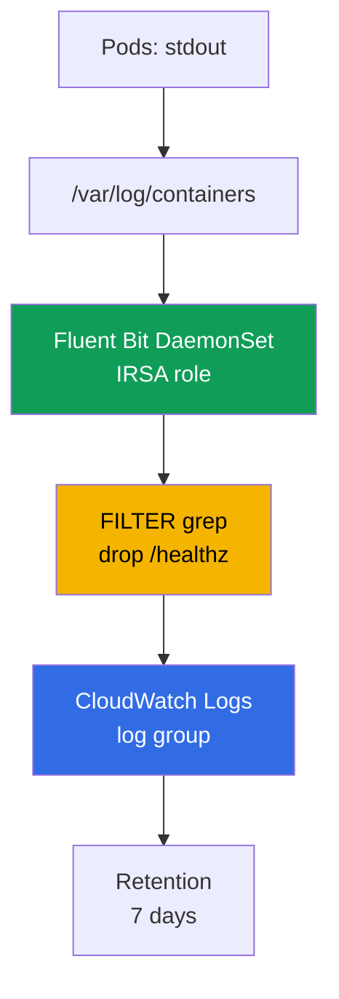
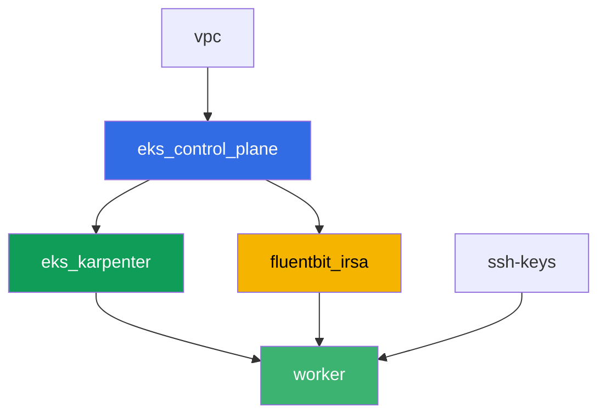

[Русская версия](README_RU.MD) · [Versión en español](README_ES.MD) · [Version française](README_FR.MD) · [Deutsche Version](README_DE.MD) · [ქართული ვერსია](README_GE.MD) · [繁體中文版](README_TW.MD) · [日本語版](README_JP.MD)

# Lab 115 - Logging: Fluent Bit to CloudWatch Logs, filtering and retention

## Description

A pod crashed overnight, the on-call engineer opens `kubectl logs` - and sees `NotFound`:
the Deployment has already recreated the pod under a new name, and the old pod's logs
disappeared with it. In this lab you first capture this loss as-is - without a log
collector, then close the gap: you install the Fluent Bit DaemonSet with permissions via
IRSA, which streams logs into CloudWatch Logs continuously, and you confirm that the same
situation (pod deleted, name different) no longer cuts off access to its logs. Next you cut
noise with a `grep` filter before ingestion, set a retention policy on the log group, and
verify that a multiline stack trace doesn't fall apart into separate records.

Tasks are written in a production style: a short statement plus acceptance criteria.
Checking is automatic, via the `check_result` command.

## Goal

Reinforce the material from this course chapter:

- [Chapter 34. Logs: Fluent Bit, CloudWatch Logs, OpenSearch, cost control](../../course/34/ru.md)

## What we're creating

Terraform pre-creates an IRSA role for Fluent Bit with a predictable name. You install
Fluent Bit itself via Helm, reproduce the log loss both without and with a collector, and
add a filter plus retention.

| Object | What it is | Why it's in this lab |
|--------|---------|-------------------|
| Namespace `eks-115` | a cluster section for the lab's workload | keeps resources separate from system ones |
| Component `fluentbit_irsa` | IRSA role for Fluent Bit | permissions on one specific log group, without cluster-wide roles |
| Deployment `flaky-before` + artifact | a pod without a log collector | captures log loss after pod recreation |
| Release `aws-for-fluent-bit` (Helm) | Fluent Bit DaemonSet with IRSA | INPUT-FILTER-OUTPUT pipeline into CloudWatch Logs |
| Deployment `flaky-after` + artifact | a pod with a working collector | logs are found in CloudWatch even though the pod is already deleted |
| FILTER `grep` in `values.yaml` | drops lines with `/healthz` before ingestion | noise never reaches CloudWatch, saving on ingestion |
| Pod `access-log-gen` | test line generator | verifies what got filtered and what didn't |
| Retention `7` days on the log group | `aws logs put-retention-policy` | storage duration instead of "forever" by default |
| Pod `stacktrace-app` + `multiline.parser` | simulates a multiline stack trace | one record in CloudWatch instead of four |

Log path from pod to CloudWatch:



## Infrastructure

The environment is deployed in AWS (`eu-central-1`) via Terragrunt. The base matches lab
101 (control plane, Fargate for system pods, Karpenter for workload), plus a separate
component for the Fluent Bit IRSA role.

### Modules and dependencies

| Directory (component) | Module (`terraform/modules/`) | Depends on | What it creates |
|---------------------|-------------------------------|------------|-------------|
| `vpc` | `vpc_v3` | - | VPC `10.10.0.0/16`, subnets in two AZs, NAT |
| `ssh-keys` | `ssh-keys` | - | an SSH key pair for the worker machine and nodes |
| `eks_control_plane` | `eks_v2_control_plane` | `vpc` | EKS control plane `1.36`, OIDC provider |
| `eks_fargate_system` | `eks_v2_fargate` | `vpc`, `eks_control_plane` | Fargate profile for `kube-system` and `karpenter` |
| `eks_addons` | `eks_v2_addons` | `eks_control_plane`, `eks_fargate_system` | coredns, kube-proxy, vpc-cni, pod-identity |
| `eks_karpenter` | `eks_v2_karpenter` | `vpc`, `eks_control_plane`, `eks_addons`, `eks_fargate_system` | Karpenter controller, node IAM role |
| `eks_karpenter_default_vng` | `eks_v2_karpenter_vng` | `vpc`, `eks_control_plane`, `eks_karpenter` | default NodePool `default` on AL2023 |
| `fluentbit_irsa` | `eks_v2_fluentbit_irsa` | `eks_control_plane` | Fluent Bit IRSA role, scoped to one log group |
| `worker` | `eks_v2_work_pc` | `ssh-keys`, `vpc`, `eks_control_plane`, `eks_karpenter`, `fluentbit_irsa` | worker machine with kubectl, tests, and `check_result` |

The `fluentbit_irsa` component creates an IRSA role with a trust policy bound exactly to the
SA `aws-for-fluent-bit` in namespace `amazon-cloudwatch` (the `sub` condition from chapter
16), and an inline policy with `logs:CreateLogGroup`/`CreateLogStream`/`PutLogEvents`/
`DescribeLogStreams`/`PutRetentionPolicy` on one predictable log group
`/aws/eks/<cluster>/application`, plus `logs:DescribeLogGroups` on `*` (AWS documents this
action as not supporting scoping to a single log group ARN). This is exactly the role you'll
attach to the Fluent Bit ServiceAccount during the Helm install.

Dependency graph (what gets applied earlier is lower down the arrow):



Components `eks_fargate_system`, `eks_addons` and `eks_karpenter_default_vng` are not shown
on the graph to keep it within the 8-node limit, but they actually sit between
`eks_control_plane` and `eks_karpenter` (see the table above).

### Worker permissions for `aws logs` commands

Fluent Bit writes logs and manages retention through its own IRSA role, but tasks 6-7 ask
the student to check the log group state directly from the worker machine (and `tests.bats`
does the same). The worker role (`eks_v2_work_pc/iam.tf`) received one additive `Sid`
`CloudWatchLogsReadForLoggingLabs` with `logs:DescribeLogGroups`,
`logs:PutRetentionPolicy`, `logs:FilterLogEvents`, `logs:GetLogEvents` on `*` - these are
read/describe operations plus setting retention, not destructive and not tied to a specific
lab prefix, so they were added without narrowing by tags (like `TestRoleManagement*` for
other labs). Nothing from the worker's existing permissions was removed.

### Predictable resource names

`fluentbit_irsa` builds names from `prefix`, so the worker finds them without reading
terraform output. All of them are available on login in the file `~/lab115_hints.txt`:

| Resource | Name |
|--------|-----|
| Fluent Bit IRSA role | `eks-task115-fluentbit-irsa-role` |
| Log group | `/aws/eks/<cluster>/application` |

## Deployment

```bash
TASK=115 make run_eks_task
```

Deployment takes roughly 15-20 minutes. In the output, find the line with the SSH connection
to the worker machine and connect to it. kubectl there is already configured for the right
cluster.

Useful commands on the worker machine:

```bash
time_left       # how much environment time is left
check_result    # check the solution
cat ~/lab115_hints.txt   # IRSA role name and log group
```

> Environment security. `env.hcl` has `ssh_password_enable = true` and
> `access_cidrs = ["0.0.0.0/0"]` enabled - convenient for a training environment, but this
> is not something to do in production. Per the course standards (chapters 0.2, 2, 19),
> access to worker machines should go through AWS SSM Session Manager without exposing
> public SSH ports, and `access_cidrs` should be narrowed down to specific addresses. Here
> public SSH is left in place only to keep the setup simple.

## Tasks

---
|        **1**        | **Namespace for the lab's workload**                             |
| :-----------------: | :---------------------------------------------------------- |
| What to do          | Create a namespace named `eks-115`. All objects in this lab are created inside it. |
| Acceptance criteria    | - namespace `eks-115` exists. |
---
|        **2**        | **Symptom: logs disappear without a collector**                      |
| :-----------------: | :---------------------------------------------------------- |
| What to do          | In `eks-115`, create Deployment `flaky-before` (image `busybox:1.36`, `1` replica), container with the command `sh -c 'echo BEFORE_MARKER_LAB115; sleep 5; exit 1'`. The pod will end up in `CrashLoopBackOff`, but the pod name stays the same across container restarts - confirm this via `kubectl logs <pod>` and `kubectl logs <pod> --previous`. Then write the pod name to a file as `OLD_POD_NAME=<name>` and run `kubectl delete pod <name>` - the Deployment will recreate the pod under a new name (analogous to a node replacement during Karpenter consolidation). Run `kubectl logs <old-name>` and confirm you now get `Error from server (NotFound)`. Save everything to `/var/work/tests/artifacts/2/before_symptom.txt`: the line `OLD_POD_NAME=...`, `BEFORE_MARKER_LAB115` and the error text `NotFound`. |
| Acceptance criteria    | - Deployment `flaky-before` in `eks-115` with `1` ready replica;<br/>- file `2/before_symptom.txt` contains `OLD_POD_NAME=`, `BEFORE_MARKER_LAB115` and `NotFound`;<br/>- the pod named in `OLD_POD_NAME` currently does not exist (indeed recreated). |
---
|        **3**        | **Fluent Bit DaemonSet with an IRSA role**                        |
| :-----------------: | :---------------------------------------------------------- |
| What to do          | Take `role_arn` and `log_group_name` from `~/lab115_hints.txt`. Add the repository `helm repo add eks https://aws.github.io/eks-charts` and install the chart `aws-for-fluent-bit` as a release named `aws-for-fluent-bit` in namespace `amazon-cloudwatch` (`--create-namespace`). In the values, set: the ServiceAccount annotation `eks.amazonaws.com/role-arn` to `role_arn`; `input.memBufLimit: 50MB` and `input.extraInputs` with the line `storage.type      filesystem` (OOM protection under backpressure, section 34.7); `service.extraService` with the added line `storage.path /var/fluent-bit/state/flb-storage/`; `cloudWatchLogs.enabled: true`, `region: eu-central-1`, `logGroupName: <log_group_name>`, `logStreamPrefix: "fluentbit-"`, `autoCreateGroup: true`. Save the values to a file `values.yaml` on the worker machine - you'll need it in tasks 5 and 7. Wait for the DaemonSet to become ready on all nodes. |
| Acceptance criteria    | - DaemonSet `aws-for-fluent-bit` in `amazon-cloudwatch`: `numberReady` equals `desiredNumberScheduled` and is `>= 1`;<br/>- ServiceAccount `aws-for-fluent-bit` carries the annotation `eks.amazonaws.com/role-arn` with a value containing `fluentbit-irsa-role`;<br/>- the release's ConfigMap contains `Mem_Buf_Limit` and `storage.type`. |
---
|        **4**        | **Fix proven: logs are found after pod deletion**    |
| :-----------------: | :---------------------------------------------------------- |
| What to do          | In `eks-115`, create Deployment `flaky-after` (image `busybox:1.36`, `1` replica), container with the command `sh -c 'echo AFTER_MARKER_LAB115; sleep 3600'` (no crash). Wait roughly `60` seconds so Fluent Bit has time to read and ship the line. Write the pod name to the artifact as `OLD_POD_NAME=<name>`, then run `kubectl delete pod <name>` - the pod will be recreated under a new name. Confirm that `kubectl logs <old-name>` is now `NotFound`. Find the line `AFTER_MARKER_LAB115` in CloudWatch Logs: `aws logs filter-log-events --log-group-name <log_group_name> --filter-pattern "AFTER_MARKER_LAB115"`. Save to `/var/work/tests/artifacts/4/after_fixed.txt` the line `OLD_POD_NAME=...`, the text `NotFound` and the record found in CloudWatch. |
| Acceptance criteria    | - Deployment `flaky-after` in `eks-115` with `1` ready replica;<br/>- file `4/after_fixed.txt` contains `OLD_POD_NAME=`, `NotFound` and `AFTER_MARKER_LAB115`;<br/>- `aws logs filter-log-events` against the log group with pattern `AFTER_MARKER_LAB115` finds at least one record, even though the original pod is already deleted. |
---
|        **5**        | **Filtering: cutting noise before shipping**                        |
| :-----------------: | :---------------------------------------------------------- |
| What to do          | In the `values.yaml` from task 3, add `additionalFilters` with a `[FILTER]` section `Name grep`, `Match kube.*`, `Exclude log /healthz`. Run `helm upgrade aws-for-fluent-bit eks/aws-for-fluent-bit -n amazon-cloudwatch -f values.yaml` and wait for the Fluent Bit pods to restart. Only after that create Pod `access-log-gen` (image `busybox:1.36`) with a command that prints a line with `/healthz` and, a couple of seconds later, a line with `NORMAL_MARKER_LAB115`, then sleeps. Wait for shipping and save to `/var/work/tests/artifacts/5/filter_check.txt` an explanation: what got dropped by the `grep` filter and why that's cheaper than cleaning up logs in CloudWatch after the fact (section 34.6). |
| Acceptance criteria    | - file `5/filter_check.txt` is not empty, contains `grep` and `healthz`;<br/>- CloudWatch Logs (the lab's log group) has not a single record with `/healthz`;<br/>- CloudWatch Logs has at least one record with `NORMAL_MARKER_LAB115`. |
---
|        **6**        | **Retention policy on the log group**                             |
| :-----------------: | :---------------------------------------------------------- |
| What to do          | By default, logs in CloudWatch are kept forever. Set a retention period of `7` days: `aws logs put-retention-policy --log-group-name <log_group_name> --retention-in-days 7`. Verify with `aws logs describe-log-groups --query "logGroups[].[logGroupName,retentionInDays]"`. Save the verification output to `/var/work/tests/artifacts/6/retention.txt`. |
| Acceptance criteria    | - `aws logs describe-log-groups` shows `retentionInDays` equal to `7` for the lab's log group;<br/>- file `6/retention.txt` is not empty and contains `7`. |
---
|        **7**        | **Multiline: a stack trace as one record, not four**    |
| :-----------------: | :---------------------------------------------------------- |
| What to do          | In `values.yaml`, add a `multiline` FILTER with the built-in `python` type (which merges a Traceback) - it must run in the pipeline before the `kubernetes` FILTER, because merged records are re-emitted at the start of the pipeline (otherwise `python` won't run at all if left as part of `input.multilineParser` together with `cri`: `cri` matches any CRI line as the first line, and `python` never gets a chance). Run `helm upgrade aws-for-fluent-bit eks/aws-for-fluent-bit -n amazon-cloudwatch -f values.yaml` and wait for the Fluent Bit pods to restart. Only after that create Pod `stacktrace-app` (image `busybox:1.36`), which prints four lines in a row: `Traceback (most recent call last):`, `  File "app.py", line 10, in <module>`, `    raise ValueError('CRASH_TRACE_LAB115')` and `ValueError: CRASH_TRACE_LAB115`, then sleeps. Wait for shipping and retrieve the record via `aws logs filter-log-events --filter-pattern "CRASH_TRACE_LAB115"`. Save to `/var/work/tests/artifacts/7/multiline.txt` the full found message and an explanation that `multiline.parser` merged the four lines into one CloudWatch record. |
| Acceptance criteria    | - file `7/multiline.txt` is not empty, contains `CRASH_TRACE_LAB115` and the word `multiline` or `Traceback`;<br/>- the CloudWatch Logs record with `CRASH_TRACE_LAB115` also contains, in the same message, the line `Traceback` (meaning all four lines were merged into one record, not split into four). |
---

## Checking the result

On the worker machine, run the automatic check:

```bash
check_result
```

The script will run the tests and show the percentage of completed tasks.

## Solution

Reference solution: [worker/files/solutions/1.MD](worker/files/solutions/1.MD)

## Deleting the cluster and resources

Fluent Bit in this lab was installed manually via Helm in `amazon-cloudwatch`, not by
terraform - its DaemonSet and the workload in `eks-115` caused Karpenter to bring up an EC2
node. Terraform doesn't know about it and won't delete it - if you start `destroy` too
early, the orphaned EC2 node holds an ENI and blocks deletion of the VPC/subnets (the same
pattern as in labs 108, 109, 111, 114). Before `destroy`, remove the workload and wait for
Karpenter to remove the EC2 instance itself:

```bash
# 1. Remove the workload that caused Karpenter to bring up the EC2 node
helm uninstall aws-for-fluent-bit -n amazon-cloudwatch
kubectl delete namespace eks-115 amazon-cloudwatch

# 2. Wait for Karpenter to remove the EC2 node itself (not just delete the Node
#    object, but actually terminate the EC2 instance) - both outputs should be empty
for i in $(seq 1 30); do
  nc=$(kubectl get nodeclaims --no-headers 2>/dev/null | wc -l)
  ec2=$(aws ec2 describe-instances \
    --filters "Name=tag:karpenter.sh/nodepool,Values=default" \
      "Name=instance-state-name,Values=running,pending,stopping,stopped" \
    --query 'Reservations[].Instances[]' --output text)
  echo "nodeclaims=$nc ec2_instances=[$ec2]"
  [[ "$nc" == "0" ]] && [[ -z "$ec2" ]] && break
  sleep 10
done
```

Only once `nodeclaims=0` and the EC2 instance list is empty, run the terraform resource
deletion:

```bash
TASK=115 make delete_eks_task
```
