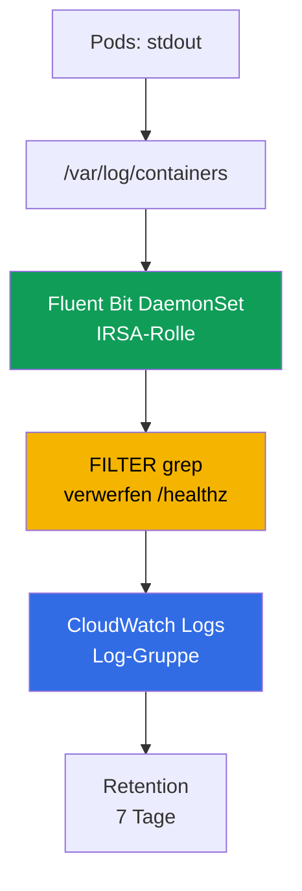
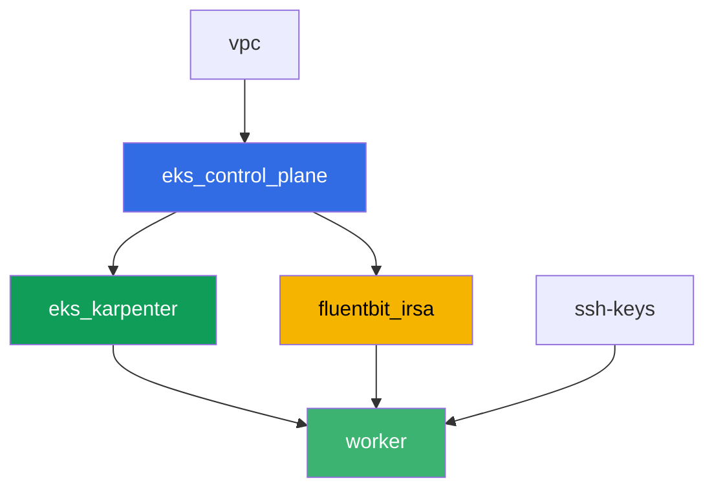

[Русская версия](README_RU.MD) · [Eng version](README.MD) · [Versión en español](README_ES.MD) · [Version française](README_FR.MD) · [ქართული ვერსია](README_GE.MD) · [繁體中文版](README_TW.MD) · [日本語版](README_JP.MD)

# Lab 115 - Logging: Fluent Bit zu CloudWatch Logs, Filterung und Retention

## Beschreibung

Ein Pod ist über Nacht abgestürzt, der On-Call-Ingenieur öffnet `kubectl logs` - und sieht
`NotFound`: das Deployment hat den Pod bereits unter einem neuen Namen neu erstellt, und die
Logs des alten Pods sind mit ihm verschwunden. In diesem Lab erfassen Sie zuerst diesen
Verlust so, wie er ist - ohne einen Log-Collector, und schließen dann die Lücke: Sie
installieren das Fluent Bit DaemonSet mit Berechtigungen über IRSA, das Logs kontinuierlich
in CloudWatch Logs streamt, und bestätigen, dass dieselbe Situation (Pod gelöscht, Name
anders) den Zugriff auf seine Logs nicht mehr abschneidet. Anschließend reduzieren Sie das
Rauschen mit einem `grep`-Filter vor der Ingestion, setzen eine Retention-Policy auf die
Log-Gruppe und prüfen, dass ein mehrzeiliger Stack-Trace nicht in separate Einträge
zerfällt.

Die Aufgaben sind im Produktionsstil geschrieben: eine kurze Aufgabenstellung plus
Abnahmekriterien. Die Prüfung erfolgt automatisch über den Befehl `check_result`.

## Ziel

Den Stoff dieses Kurskapitels vertiefen:

- [Kapitel 34. Logs: Fluent Bit, CloudWatch Logs, OpenSearch, Kostenkontrolle](../../course/34/de.md)

## Was wir erstellen

Terraform erstellt vorab eine IRSA-Rolle für Fluent Bit mit einem vorhersagbaren Namen. Sie
installieren Fluent Bit selbst über Helm, reproduzieren den Log-Verlust sowohl ohne als auch
mit einem Collector und fügen einen Filter plus Retention hinzu.

| Objekt | Was es ist | Wofür in diesem Lab |
|--------|---------|-------------------|
| Namespace `eks-115` | ein Cluster-Bereich für die Workload des Labs | hält Ressourcen getrennt von Systemressourcen |
| Komponente `fluentbit_irsa` | IRSA-Rolle für Fluent Bit | Berechtigungen auf eine bestimmte Log-Gruppe, ohne clusterweite Rollen |
| Deployment `flaky-before` + Artefakt | ein Pod ohne Log-Collector | erfasst den Log-Verlust nach der Pod-Neuerstellung |
| Release `aws-for-fluent-bit` (Helm) | Fluent Bit DaemonSet mit IRSA | INPUT-FILTER-OUTPUT-Pipeline in CloudWatch Logs |
| Deployment `flaky-after` + Artefakt | ein Pod mit funktionierendem Collector | Logs werden in CloudWatch gefunden, obwohl der Pod bereits gelöscht ist |
| FILTER `grep` in `values.yaml` | verwirft Zeilen mit `/healthz` vor der Ingestion | Rauschen erreicht CloudWatch nie, spart bei der Ingestion |
| Pod `access-log-gen` | Test-Zeilengenerator | prüft, was gefiltert wurde und was nicht |
| Retention `7` Tage auf der Log-Gruppe | `aws logs put-retention-policy` | Speicherdauer statt standardmäßig "für immer" |
| Pod `stacktrace-app` + `multiline.parser` | simuliert einen mehrzeiligen Stack-Trace | ein Eintrag in CloudWatch statt vier |

Log-Pfad vom Pod zu CloudWatch:



## Infrastruktur

Die Umgebung wird in AWS (`eu-central-1`) über Terragrunt deployt. Die Basis entspricht Lab
101 (Control Plane, Fargate für System-Pods, Karpenter für die Workload), plus eine separate
Komponente für die Fluent Bit IRSA-Rolle.

### Module und Abhängigkeiten

| Verzeichnis (Komponente) | Modul (`terraform/modules/`) | Abhängig von | Was es erstellt |
|---------------------|-------------------------------|------------|-------------|
| `vpc` | `vpc_v3` | - | VPC `10.10.0.0/16`, Subnetze in zwei AZ, NAT |
| `ssh-keys` | `ssh-keys` | - | ein SSH-Schlüsselpaar für die Worker-Maschine und die Nodes |
| `eks_control_plane` | `eks_v2_control_plane` | `vpc` | EKS Control Plane `1.36`, OIDC-Provider |
| `eks_fargate_system` | `eks_v2_fargate` | `vpc`, `eks_control_plane` | Fargate-Profil für `kube-system` und `karpenter` |
| `eks_addons` | `eks_v2_addons` | `eks_control_plane`, `eks_fargate_system` | coredns, kube-proxy, vpc-cni, pod-identity |
| `eks_karpenter` | `eks_v2_karpenter` | `vpc`, `eks_control_plane`, `eks_addons`, `eks_fargate_system` | Karpenter-Controller, IAM-Rolle der Nodes |
| `eks_karpenter_default_vng` | `eks_v2_karpenter_vng` | `vpc`, `eks_control_plane`, `eks_karpenter` | Standard-NodePool `default` auf AL2023 |
| `fluentbit_irsa` | `eks_v2_fluentbit_irsa` | `eks_control_plane` | Fluent Bit IRSA-Rolle, begrenzt auf eine Log-Gruppe |
| `worker` | `eks_v2_work_pc` | `ssh-keys`, `vpc`, `eks_control_plane`, `eks_karpenter`, `fluentbit_irsa` | Worker-Maschine mit kubectl, Tests und `check_result` |

Die Komponente `fluentbit_irsa` erstellt eine IRSA-Rolle mit einer Trust-Policy, die genau
an die SA `aws-for-fluent-bit` im Namespace `amazon-cloudwatch` gebunden ist (die
`sub`-Bedingung aus Kapitel 16), und eine Inline-Policy mit `logs:CreateLogGroup`/
`CreateLogStream`/`PutLogEvents`/`DescribeLogStreams`/`PutRetentionPolicy` auf eine
vorhersagbare Log-Gruppe `/aws/eks/<cluster>/application`, plus `logs:DescribeLogGroups` auf
`*` (AWS dokumentiert diese Aktion als nicht unterstützend für die Einschränkung auf eine
einzelne Log-Gruppen-ARN). Genau diese Rolle hängen Sie während der Helm-Installation an das
Fluent Bit ServiceAccount.

Abhängigkeitsgraph (was früher angewendet wird, steht weiter unten am Pfeil):



Die Komponenten `eks_fargate_system`, `eks_addons` und `eks_karpenter_default_vng` sind im
Graphen nicht dargestellt, um innerhalb des Limits von 8 Knoten zu bleiben, sitzen aber
tatsächlich zwischen `eks_control_plane` und `eks_karpenter` (siehe die Tabelle oben).

### Worker-Berechtigungen für `aws logs`-Befehle

Fluent Bit schreibt Logs und verwaltet die Retention über seine eigene IRSA-Rolle, aber die
Aufgaben 6-7 verlangen vom Studenten, den Zustand der Log-Gruppe direkt von der
Worker-Maschine aus zu prüfen (und `tests.bats` macht dasselbe). Die Worker-Rolle
(`eks_v2_work_pc/iam.tf`) erhielt eine zusätzliche `Sid`
`CloudWatchLogsReadForLoggingLabs` mit `logs:DescribeLogGroups`,
`logs:PutRetentionPolicy`, `logs:FilterLogEvents`, `logs:GetLogEvents` auf `*` - das sind
Lese-/Beschreibungsoperationen plus das Setzen der Retention, nicht destruktiv und nicht an
ein bestimmtes Lab-Präfix gebunden, daher wurden sie ohne Einschränkung durch Tags (wie
`TestRoleManagement*` bei anderen Labs) hinzugefügt. An den bestehenden Berechtigungen des
Workers wurde nichts entfernt.

### Vorhersagbare Ressourcennamen

`fluentbit_irsa` baut Namen aus `prefix` auf, sodass der Worker sie ohne das Lesen von
Terraform-Output findet. Alle sind beim Login in der Datei `~/lab115_hints.txt` verfügbar:

| Ressource | Name |
|--------|-----|
| Fluent Bit IRSA-Rolle | `eks-task115-fluentbit-irsa-role` |
| Log-Gruppe | `/aws/eks/<cluster>/application` |

## Deployment

```bash
TASK=115 make run_eks_task
```

Das Deployment dauert etwa 15-20 Minuten. Suchen Sie in der Ausgabe die Zeile mit der
SSH-Verbindung zur Worker-Maschine und verbinden Sie sich damit. kubectl ist dort bereits
für den richtigen Cluster konfiguriert.

Nützliche Befehle auf der Worker-Maschine:

```bash
time_left       # verbleibende Zeit der Umgebung
check_result    # Lösung prüfen
cat ~/lab115_hints.txt   # Name der IRSA-Rolle und der Log-Gruppe
```

> Sicherheit der Testumgebung. In `env.hcl` sind `ssh_password_enable = true` und
> `access_cidrs = ["0.0.0.0/0"]` aktiviert - praktisch für eine Lernumgebung, aber so sollte
> man es in Produktion nicht machen. Nach den Standards des Kurses (Kapitel 0.2, 2, 19)
> sollte der Zugriff auf Worker-Maschinen über AWS SSM Session Manager erfolgen, ohne
> öffentliche SSH-Ports nach außen, und `access_cidrs` sollte auf konkrete Adressen
> eingeschränkt werden. Hier bleibt öffentliches SSH nur der Einfachheit halber bestehen.

## Aufgaben

---
|        **1**        | **Namespace für die Workload des Labs**                             |
| :-----------------: | :---------------------------------------------------------- |
| Was wir tun          | Erstellen Sie einen Namespace mit dem Namen `eks-115`. Alle Objekte in diesem Lab werden darin erstellt. |
| Abnahmekriterien    | - Namespace `eks-115` existiert. |
---
|        **2**        | **Symptom: Logs verschwinden ohne Collector**                      |
| :-----------------: | :---------------------------------------------------------- |
| Was wir tun          | Erstellen Sie in `eks-115` das Deployment `flaky-before` (Image `busybox:1.36`, `1` Replica), Container mit dem Befehl `sh -c 'echo BEFORE_MARKER_LAB115; sleep 5; exit 1'`. Der Pod landet in `CrashLoopBackOff`, aber der Pod-Name bleibt über Container-Neustarts gleich - bestätigen Sie das über `kubectl logs <pod>` und `kubectl logs <pod> --previous`. Schreiben Sie dann den Pod-Namen in eine Datei als `OLD_POD_NAME=<name>` und führen Sie `kubectl delete pod <name>` aus - das Deployment erstellt den Pod unter einem neuen Namen neu (analog zu einem Node-Austausch während der Karpenter-Konsolidierung). Führen Sie `kubectl logs <old-name>` aus und bestätigen Sie, dass Sie jetzt `Error from server (NotFound)` erhalten. Speichern Sie alles in `/var/work/tests/artifacts/2/before_symptom.txt`: die Zeile `OLD_POD_NAME=...`, `BEFORE_MARKER_LAB115` und den Fehlertext `NotFound`. |
| Abnahmekriterien    | - Deployment `flaky-before` in `eks-115` mit `1` bereiter Replica;<br/>- Datei `2/before_symptom.txt` enthält `OLD_POD_NAME=`, `BEFORE_MARKER_LAB115` und `NotFound`;<br/>- der in `OLD_POD_NAME` genannte Pod existiert aktuell nicht (tatsächlich neu erstellt). |
---
|        **3**        | **Fluent Bit DaemonSet mit einer IRSA-Rolle**                        |
| :-----------------: | :---------------------------------------------------------- |
| Was wir tun          | Entnehmen Sie `role_arn` und `log_group_name` aus `~/lab115_hints.txt`. Fügen Sie das Repository `helm repo add eks https://aws.github.io/eks-charts` hinzu und installieren Sie das Chart `aws-for-fluent-bit` als Release mit dem Namen `aws-for-fluent-bit` im Namespace `amazon-cloudwatch` (`--create-namespace`). Setzen Sie in den values: die ServiceAccount-Annotation `eks.amazonaws.com/role-arn` auf `role_arn`; `input.memBufLimit: 50MB` und `input.extraInputs` mit der Zeile `storage.type      filesystem` (OOM-Schutz bei Backpressure, Abschnitt 34.7); `service.extraService` mit der hinzugefügten Zeile `storage.path /var/fluent-bit/state/flb-storage/`; `cloudWatchLogs.enabled: true`, `region: eu-central-1`, `logGroupName: <log_group_name>`, `logStreamPrefix: "fluentbit-"`, `autoCreateGroup: true`. Speichern Sie die values in einer Datei `values.yaml` auf der Worker-Maschine - Sie benötigen sie in den Aufgaben 5 und 7. Warten Sie, bis das DaemonSet auf allen Nodes bereit ist. |
| Abnahmekriterien    | - DaemonSet `aws-for-fluent-bit` in `amazon-cloudwatch`: `numberReady` entspricht `desiredNumberScheduled` und ist `>= 1`;<br/>- ServiceAccount `aws-for-fluent-bit` trägt die Annotation `eks.amazonaws.com/role-arn` mit einem Wert, der `fluentbit-irsa-role` enthält;<br/>- das ConfigMap des Releases enthält `Mem_Buf_Limit` und `storage.type`. |
---
|        **4**        | **Fix bestätigt: Logs werden nach Pod-Löschung gefunden**    |
| :-----------------: | :---------------------------------------------------------- |
| Was wir tun          | Erstellen Sie in `eks-115` das Deployment `flaky-after` (Image `busybox:1.36`, `1` Replica), Container mit dem Befehl `sh -c 'echo AFTER_MARKER_LAB115; sleep 3600'` (kein Absturz). Warten Sie etwa `60` Sekunden, damit Fluent Bit Zeit hat, die Zeile zu lesen und zu versenden. Schreiben Sie den Pod-Namen ins Artefakt als `OLD_POD_NAME=<name>`, führen Sie dann `kubectl delete pod <name>` aus - der Pod wird unter einem neuen Namen neu erstellt. Bestätigen Sie, dass `kubectl logs <old-name>` jetzt `NotFound` liefert. Finden Sie die Zeile `AFTER_MARKER_LAB115` in CloudWatch Logs: `aws logs filter-log-events --log-group-name <log_group_name> --filter-pattern "AFTER_MARKER_LAB115"`. Speichern Sie in `/var/work/tests/artifacts/4/after_fixed.txt` die Zeile `OLD_POD_NAME=...`, den Text `NotFound` und den in CloudWatch gefundenen Eintrag. |
| Abnahmekriterien    | - Deployment `flaky-after` in `eks-115` mit `1` bereiter Replica;<br/>- Datei `4/after_fixed.txt` enthält `OLD_POD_NAME=`, `NotFound` und `AFTER_MARKER_LAB115`;<br/>- `aws logs filter-log-events` gegen die Log-Gruppe mit dem Pattern `AFTER_MARKER_LAB115` findet mindestens einen Eintrag, obwohl der ursprüngliche Pod bereits gelöscht ist. |
---
|        **5**        | **Filterung: Rauschen vor dem Versand abschneiden**                        |
| :-----------------: | :---------------------------------------------------------- |
| Was wir tun          | Fügen Sie in `values.yaml` aus Aufgabe 3 `additionalFilters` mit einem `[FILTER]`-Abschnitt `Name grep`, `Match kube.*`, `Exclude log /healthz` hinzu. Führen Sie `helm upgrade aws-for-fluent-bit eks/aws-for-fluent-bit -n amazon-cloudwatch -f values.yaml` aus und warten Sie, bis die Fluent Bit Pods neu gestartet sind. Erst danach erstellen Sie Pod `access-log-gen` (Image `busybox:1.36`) mit einem Befehl, der eine Zeile mit `/healthz` und, ein paar Sekunden später, eine Zeile mit `NORMAL_MARKER_LAB115` ausgibt und dann schläft. Warten Sie auf den Versand und speichern Sie in `/var/work/tests/artifacts/5/filter_check.txt` eine Erklärung: was der `grep`-Filter verworfen hat und warum das günstiger ist als das nachträgliche Aufräumen von Logs in CloudWatch (Abschnitt 34.6). |
| Abnahmekriterien    | - Datei `5/filter_check.txt` ist nicht leer, enthält `grep` und `healthz`;<br/>- CloudWatch Logs (die Log-Gruppe des Labs) enthält keinen einzigen Eintrag mit `/healthz`;<br/>- CloudWatch Logs enthält mindestens einen Eintrag mit `NORMAL_MARKER_LAB115`. |
---
|        **6**        | **Retention-Policy auf der Log-Gruppe**                             |
| :-----------------: | :---------------------------------------------------------- |
| Was wir tun          | Standardmäßig werden Logs in CloudWatch für immer aufbewahrt. Setzen Sie eine Retention-Periode von `7` Tagen: `aws logs put-retention-policy --log-group-name <log_group_name> --retention-in-days 7`. Prüfen Sie mit `aws logs describe-log-groups --query "logGroups[].[logGroupName,retentionInDays]"`. Speichern Sie die Prüfungsausgabe in `/var/work/tests/artifacts/6/retention.txt`. |
| Abnahmekriterien    | - `aws logs describe-log-groups` zeigt `retentionInDays` gleich `7` für die Log-Gruppe des Labs;<br/>- Datei `6/retention.txt` ist nicht leer und enthält `7`. |
---
|        **7**        | **Multiline: ein Stack-Trace als ein Eintrag, nicht vier**    |
| :-----------------: | :---------------------------------------------------------- |
| Was wir tun          | Fügen Sie in `values.yaml` einen `multiline`-FILTER mit dem eingebauten Typ `python` hinzu (der einen Traceback zusammenführt) - er muss in der Pipeline vor dem `kubernetes`-FILTER laufen, weil zusammengeführte Einträge am Anfang der Pipeline erneut ausgegeben werden (andernfalls läuft `python` überhaupt nicht, wenn er als Teil von `input.multilineParser` zusammen mit `cri` belassen wird: `cri` passt als erste Zeile auf jede CRI-Zeile, und `python` kommt nie zum Zug). Führen Sie `helm upgrade aws-for-fluent-bit eks/aws-for-fluent-bit -n amazon-cloudwatch -f values.yaml` aus und warten Sie, bis die Fluent Bit Pods neu gestartet sind. Erst danach erstellen Sie Pod `stacktrace-app` (Image `busybox:1.36`), der vier Zeilen nacheinander ausgibt: `Traceback (most recent call last):`, `  File "app.py", line 10, in <module>`, `    raise ValueError('CRASH_TRACE_LAB115')` und `ValueError: CRASH_TRACE_LAB115`, und dann schläft. Warten Sie auf den Versand und holen Sie den Eintrag über `aws logs filter-log-events --filter-pattern "CRASH_TRACE_LAB115"` ab. Speichern Sie in `/var/work/tests/artifacts/7/multiline.txt` die vollständig gefundene Nachricht und eine Erklärung, dass `multiline.parser` die vier Zeilen zu einem CloudWatch-Eintrag zusammengeführt hat. |
| Abnahmekriterien    | - Datei `7/multiline.txt` ist nicht leer, enthält `CRASH_TRACE_LAB115` und das Wort `multiline` oder `Traceback`;<br/>- der CloudWatch Logs-Eintrag mit `CRASH_TRACE_LAB115` enthält in derselben Nachricht auch die Zeile `Traceback` (das heißt, alle vier Zeilen wurden zu einem Eintrag zusammengeführt, nicht in vier aufgeteilt). |
---

## Ergebnis prüfen

Führen Sie auf der Worker-Maschine die automatische Prüfung aus:

```bash
check_result
```

Das Skript führt die Tests aus und zeigt den Prozentsatz der erledigten Aufgaben.

## Lösung

Referenzlösung: [worker/files/solutions/1_DE.MD](worker/files/solutions/1_DE.MD)

## Cluster und Ressourcen löschen

Fluent Bit wurde in diesem Lab manuell über Helm in `amazon-cloudwatch` installiert, nicht
von terraform - sein DaemonSet und die Workload in `eks-115` haben dazu geführt, dass
Karpenter eine EC2-Node hochgefahren hat. Terraform weiß nichts davon und wird sie nicht
löschen - wenn Sie `destroy` zu früh starten, hält die verwaiste EC2-Node ein ENI und
blockiert das Löschen der VPC/Subnetze (dasselbe Muster wie in den Labs 108, 109, 111, 114).
Entfernen Sie vor `destroy` die Workload und warten Sie, bis Karpenter die EC2-Instanz
selbst entfernt:

```bash
# 1. Die Workload entfernen, die dazu führte, dass Karpenter die EC2-Node hochfuhr
helm uninstall aws-for-fluent-bit -n amazon-cloudwatch
kubectl delete namespace eks-115 amazon-cloudwatch

# 2. Warten, bis Karpenter die EC2-Node selbst entfernt (nicht nur das Node-Objekt
#    löscht, sondern die EC2-Instanz tatsächlich terminiert) - beide Ausgaben sollten leer sein
for i in $(seq 1 30); do
  nc=$(kubectl get nodeclaims --no-headers 2>/dev/null | wc -l)
  ec2=$(aws ec2 describe-instances \
    --filters "Name=tag:karpenter.sh/nodepool,Values=default" \
      "Name=instance-state-name,Values=running,pending,stopping,stopped" \
    --query 'Reservations[].Instances[]' --output text)
  echo "nodeclaims=$nc ec2_instances=[$ec2]"
  [[ "$nc" == "0" ]] && [[ -z "$ec2" ]] && break
  sleep 10
done
```

Erst wenn `nodeclaims=0` ist und die Liste der EC2-Instanzen leer ist, führen Sie die
Terraform-Ressourcenlöschung aus:

```bash
TASK=115 make delete_eks_task
```
