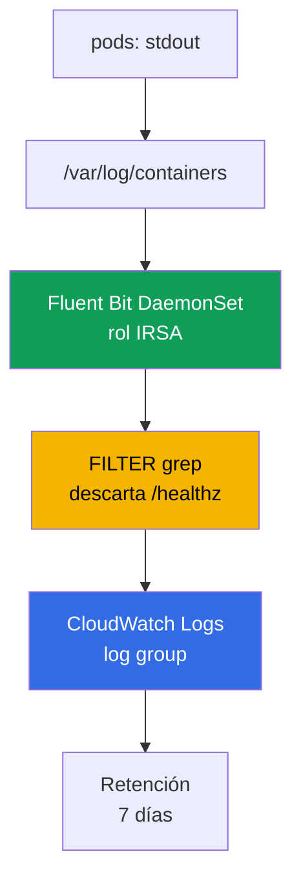
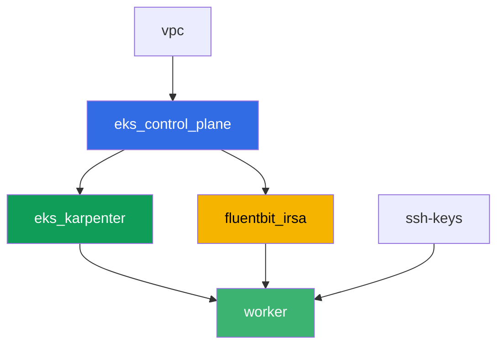

[Русская версия](README_RU.MD) · [Eng version](README.MD) · [Version française](README_FR.MD) · [Deutsche Version](README_DE.MD) · [ქართული ვერსია](README_GE.MD) · [繁體中文版](README_TW.MD) · [日本語版](README_JP.MD)

# Lab 115 - Logging: Fluent Bit hacia CloudWatch Logs, filtrado y retención

## Descripción

Un pod se cae durante la noche, el ingeniero de guardia abre `kubectl logs` - y ve
`NotFound`: el Deployment ya recreó el pod con otro nombre, y los logs del pod anterior
desaparecieron con él. En esta laba primero capturas esta pérdida tal cual es - sin
recolector de logs, luego cierras la brecha: instalas el DaemonSet de Fluent Bit con
permisos mediante IRSA, que envía logs a CloudWatch Logs de forma continua, y confirmas que
la misma situación (pod eliminado, nombre distinto) ya no corta el acceso a sus logs. Luego
reduces el ruido con un filtro `grep` antes de la ingesta, configuras una política de
retención en el log group, y verificas que un stack trace multilínea no se rompe en
registros separados.

Las tareas están escritas en estilo producción: un planteamiento breve más criterios de
aceptación. La verificación es automática, mediante el comando `check_result`.

## Objetivo

Consolidar el material del capítulo del curso:

- [Capítulo 34. Logs: Fluent Bit, CloudWatch Logs, OpenSearch, control de costos](../../course/34/ru.md)

## Qué vamos a crear

Terraform precrea un rol IRSA para Fluent Bit con un nombre predecible. Instalas Fluent Bit
mediante Helm, reproduces la pérdida de logs tanto sin como con recolector, y añades un
filtro más retención.

| Objeto | Qué es | Para qué sirve en esta laba |
|--------|---------|-------------------|
| Namespace `eks-115` | sección del clúster para la carga de la laba | mantiene los recursos separados de los del sistema |
| Componente `fluentbit_irsa` | rol IRSA para Fluent Bit | permisos sobre un log group concreto, sin roles de alcance de clúster |
| Deployment `flaky-before` + artefacto | un pod sin recolector de logs | captura la pérdida de logs tras recrear el pod |
| Release `aws-for-fluent-bit` (Helm) | DaemonSet de Fluent Bit con IRSA | pipeline INPUT-FILTER-OUTPUT hacia CloudWatch Logs |
| Deployment `flaky-after` + artefacto | un pod con un recolector funcionando | los logs se encuentran en CloudWatch aunque el pod ya esté eliminado |
| FILTER `grep` en `values.yaml` | descarta líneas con `/healthz` antes de la ingesta | el ruido nunca llega a CloudWatch, ahorrando en ingesta |
| Pod `access-log-gen` | generador de líneas de prueba | verifica qué se filtró y qué no |
| Retención `7` días en el log group | `aws logs put-retention-policy` | duración de almacenamiento en lugar de "para siempre" por defecto |
| Pod `stacktrace-app` + `multiline.parser` | simula un stack trace multilínea | un solo registro en CloudWatch en lugar de cuatro |

Ruta del log desde el pod hasta CloudWatch:



## Infraestructura

El entorno se despliega en AWS (`eu-central-1`) mediante Terragrunt. La base coincide con
la laba 101 (control plane, Fargate para pods del sistema, Karpenter para la carga), más un
componente separado para el rol IRSA de Fluent Bit.

### Módulos y dependencias

| Carpeta (componente) | Módulo (`terraform/modules/`) | Depende de | Qué crea |
|---------------------|-------------------------------|------------|-------------|
| `vpc` | `vpc_v3` | - | VPC `10.10.0.0/16`, subredes en dos AZ, NAT |
| `ssh-keys` | `ssh-keys` | - | par de claves SSH para la máquina de trabajo y los nodes |
| `eks_control_plane` | `eks_v2_control_plane` | `vpc` | control plane EKS `1.36`, proveedor OIDC |
| `eks_fargate_system` | `eks_v2_fargate` | `vpc`, `eks_control_plane` | perfil Fargate para `kube-system` y `karpenter` |
| `eks_addons` | `eks_v2_addons` | `eks_control_plane`, `eks_fargate_system` | coredns, kube-proxy, vpc-cni, pod-identity |
| `eks_karpenter` | `eks_v2_karpenter` | `vpc`, `eks_control_plane`, `eks_addons`, `eks_fargate_system` | controlador Karpenter, rol IAM de los nodes |
| `eks_karpenter_default_vng` | `eks_v2_karpenter_vng` | `vpc`, `eks_control_plane`, `eks_karpenter` | NodePool por defecto `default` en AL2023 |
| `fluentbit_irsa` | `eks_v2_fluentbit_irsa` | `eks_control_plane` | rol IRSA de Fluent Bit, acotado a un log group |
| `worker` | `eks_v2_work_pc` | `ssh-keys`, `vpc`, `eks_control_plane`, `eks_karpenter`, `fluentbit_irsa` | máquina de trabajo con kubectl, tests y `check_result` |

El componente `fluentbit_irsa` crea un rol IRSA con una trust policy vinculada exactamente
a la SA `aws-for-fluent-bit` en el namespace `amazon-cloudwatch` (la condición `sub` del
capítulo 16), y una política inline con `logs:CreateLogGroup`/`CreateLogStream`/
`PutLogEvents`/`DescribeLogStreams`/`PutRetentionPolicy` sobre un log group predecible
`/aws/eks/<cluster>/application`, más `logs:DescribeLogGroups` sobre `*` (AWS documenta esta
acción como no compatible con el acotamiento a un único ARN de log group). Este es
exactamente el rol que adjuntarás al ServiceAccount de Fluent Bit durante la instalación con
Helm.

Grafo de dependencias (lo que se aplica antes queda más abajo en la flecha):



Los componentes `eks_fargate_system`, `eks_addons` y `eks_karpenter_default_vng` no se
muestran en el grafo para mantenerlo dentro del límite de 8 nodes, pero en realidad se
ubican entre `eks_control_plane` y `eks_karpenter` (ver la tabla anterior).

### Permisos del worker para los comandos `aws logs`

Fluent Bit escribe logs y gestiona la retención mediante su propio rol IRSA, pero las
tareas 6-7 piden al estudiante verificar el estado del log group directamente desde la
máquina de trabajo (y `tests.bats` hace lo mismo). El rol del worker
(`eks_v2_work_pc/iam.tf`) recibió un `Sid` additivo `CloudWatchLogsReadForLoggingLabs` con
`logs:DescribeLogGroups`, `logs:PutRetentionPolicy`, `logs:FilterLogEvents`,
`logs:GetLogEvents` sobre `*` - son operaciones de lectura/descripción más la configuración
de retención, no destructivas y no ligadas a un prefijo de laba concreto, por eso se
añadieron sin acotarlas mediante tags (como `TestRoleManagement*` en otras labas). No se
quitó nada de los permisos existentes del worker.

### Nombres de recursos predecibles

`fluentbit_irsa` construye los nombres a partir de `prefix`, así que el worker los encuentra
sin leer el output de terraform. Todos están disponibles al iniciar sesión en el archivo
`~/lab115_hints.txt`:

| Recurso | Nombre |
|--------|-----|
| Rol IRSA de Fluent Bit | `eks-task115-fluentbit-irsa-role` |
| Log group | `/aws/eks/<cluster>/application` |

## Despliegue

```bash
TASK=115 make run_eks_task
```

El despliegue tarda aproximadamente 15-20 minutos. En la salida busca la línea con la
conexión SSH a la máquina de trabajo y conéctate a ella. kubectl ya está configurado ahí
para el clúster correcto.

Comandos útiles en la máquina de trabajo:

```bash
time_left       # cuánto tiempo queda del entorno
check_result    # verificar la solución
cat ~/lab115_hints.txt   # nombre del rol IRSA y log group
```

> Seguridad del entorno. En `env.hcl` están habilitados `ssh_password_enable = true` y
> `access_cidrs = ["0.0.0.0/0"]` - cómodo para un entorno de entrenamiento, pero esto no se
> debe hacer así en producción. Según los estándares del curso (capítulos 0.2, 2, 19), el
> acceso a las máquinas de trabajo debe pasar por AWS SSM Session Manager sin exponer
> puertos SSH públicos, y `access_cidrs` debe acotarse a direcciones concretas. Aquí se deja
> SSH público solo para mantener simple la configuración.

## Tareas

---
|        **1**        | **Namespace para la carga de la laba**                             |
| :-----------------: | :---------------------------------------------------------- |
| Qué hacemos          | Crea un namespace con el nombre `eks-115`. Todos los objetos de esta laba se crean dentro de él. |
| Criterios de aceptación    | - el namespace `eks-115` existe. |
---
|        **2**        | **Síntoma: los logs desaparecen sin recolector**                      |
| :-----------------: | :---------------------------------------------------------- |
| Qué hacemos          | En `eks-115`, crea el Deployment `flaky-before` (imagen `busybox:1.36`, `1` réplica), contenedor con el comando `sh -c 'echo BEFORE_MARKER_LAB115; sleep 5; exit 1'`. El pod terminará en `CrashLoopBackOff`, pero el nombre del pod se mantiene igual entre reinicios del contenedor - confírmalo mediante `kubectl logs <pod>` y `kubectl logs <pod> --previous`. Luego escribe el nombre del pod en un archivo como `OLD_POD_NAME=<name>` y ejecuta `kubectl delete pod <name>` - el Deployment recreará el pod con un nombre nuevo (análogo a un reemplazo de node durante la consolidación de Karpenter). Ejecuta `kubectl logs <old-name>` y confirma que ahora obtienes `Error from server (NotFound)`. Guarda todo en `/var/work/tests/artifacts/2/before_symptom.txt`: la línea `OLD_POD_NAME=...`, `BEFORE_MARKER_LAB115` y el texto del error `NotFound`. |
| Criterios de aceptación    | - Deployment `flaky-before` en `eks-115` con `1` réplica lista;<br/>- el archivo `2/before_symptom.txt` contiene `OLD_POD_NAME=`, `BEFORE_MARKER_LAB115` y `NotFound`;<br/>- el pod nombrado en `OLD_POD_NAME` actualmente no existe (efectivamente fue recreado). |
---
|        **3**        | **DaemonSet de Fluent Bit con un rol IRSA**                        |
| :-----------------: | :---------------------------------------------------------- |
| Qué hacemos          | Toma `role_arn` y `log_group_name` de `~/lab115_hints.txt`. Añade el repositorio `helm repo add eks https://aws.github.io/eks-charts` e instala el chart `aws-for-fluent-bit` como un release llamado `aws-for-fluent-bit` en el namespace `amazon-cloudwatch` (`--create-namespace`). En los values, configura: la anotación del ServiceAccount `eks.amazonaws.com/role-arn` con `role_arn`; `input.memBufLimit: 50MB` y `input.extraInputs` con la línea `storage.type      filesystem` (protección contra OOM bajo contrapresión, sección 34.7); `service.extraService` con la línea añadida `storage.path /var/fluent-bit/state/flb-storage/`; `cloudWatchLogs.enabled: true`, `region: eu-central-1`, `logGroupName: <log_group_name>`, `logStreamPrefix: "fluentbit-"`, `autoCreateGroup: true`. Guarda los values en un archivo `values.yaml` en la máquina de trabajo - lo necesitarás en las tareas 5 y 7. Espera a que el DaemonSet esté listo en todos los nodes. |
| Criterios de aceptación    | - DaemonSet `aws-for-fluent-bit` en `amazon-cloudwatch`: `numberReady` es igual a `desiredNumberScheduled` y es `>= 1`;<br/>- el ServiceAccount `aws-for-fluent-bit` lleva la anotación `eks.amazonaws.com/role-arn` con un valor que contiene `fluentbit-irsa-role`;<br/>- el ConfigMap del release contiene `Mem_Buf_Limit` y `storage.type`. |
---
|        **4**        | **Arreglo comprobado: los logs se encuentran tras eliminar el pod**    |
| :-----------------: | :---------------------------------------------------------- |
| Qué hacemos          | En `eks-115`, crea el Deployment `flaky-after` (imagen `busybox:1.36`, `1` réplica), contenedor con el comando `sh -c 'echo AFTER_MARKER_LAB115; sleep 3600'` (sin fallo). Espera aproximadamente `60` segundos para que Fluent Bit tenga tiempo de leer y enviar la línea. Escribe el nombre del pod en el artefacto como `OLD_POD_NAME=<name>`, luego ejecuta `kubectl delete pod <name>` - el pod se recreará con un nombre nuevo. Confirma que `kubectl logs <old-name>` ahora es `NotFound`. Encuentra la línea `AFTER_MARKER_LAB115` en CloudWatch Logs: `aws logs filter-log-events --log-group-name <log_group_name> --filter-pattern "AFTER_MARKER_LAB115"`. Guarda en `/var/work/tests/artifacts/4/after_fixed.txt` la línea `OLD_POD_NAME=...`, el texto `NotFound` y el registro encontrado en CloudWatch. |
| Criterios de aceptación    | - Deployment `flaky-after` en `eks-115` con `1` réplica lista;<br/>- el archivo `4/after_fixed.txt` contiene `OLD_POD_NAME=`, `NotFound` y `AFTER_MARKER_LAB115`;<br/>- `aws logs filter-log-events` contra el log group con el patrón `AFTER_MARKER_LAB115` encuentra al menos un registro, aunque el pod original ya esté eliminado. |
---
|        **5**        | **Filtrado: recortando el ruido antes del envío**                        |
| :-----------------: | :---------------------------------------------------------- |
| Qué hacemos          | En el `values.yaml` de la tarea 3, añade `additionalFilters` con una sección `[FILTER]` `Name grep`, `Match kube.*`, `Exclude log /healthz`. Ejecuta `helm upgrade aws-for-fluent-bit eks/aws-for-fluent-bit -n amazon-cloudwatch -f values.yaml` y espera a que los pods de Fluent Bit se reinicien. Solo después de eso crea el Pod `access-log-gen` (imagen `busybox:1.36`) con un comando que imprime una línea con `/healthz` y, un par de segundos después, una línea con `NORMAL_MARKER_LAB115`, y luego duerme. Espera al envío y guarda en `/var/work/tests/artifacts/5/filter_check.txt` una explicación: qué se descartó mediante el filtro `grep` y por qué eso es más económico que limpiar logs en CloudWatch después del hecho (sección 34.6). |
| Criterios de aceptación    | - el archivo `5/filter_check.txt` no está vacío, contiene `grep` y `healthz`;<br/>- CloudWatch Logs (el log group de la laba) no tiene ni un solo registro con `/healthz`;<br/>- CloudWatch Logs tiene al menos un registro con `NORMAL_MARKER_LAB115`. |
---
|        **6**        | **Política de retención en el log group**                             |
| :-----------------: | :---------------------------------------------------------- |
| Qué hacemos          | Por defecto, los logs en CloudWatch se conservan para siempre. Configura un período de retención de `7` días: `aws logs put-retention-policy --log-group-name <log_group_name> --retention-in-days 7`. Verifica con `aws logs describe-log-groups --query "logGroups[].[logGroupName,retentionInDays]"`. Guarda la salida de la verificación en `/var/work/tests/artifacts/6/retention.txt`. |
| Criterios de aceptación    | - `aws logs describe-log-groups` muestra `retentionInDays` igual a `7` para el log group de la laba;<br/>- el archivo `6/retention.txt` no está vacío y contiene `7`. |
---
|        **7**        | **Multiline: un stack trace como un solo registro, no cuatro**    |
| :-----------------: | :---------------------------------------------------------- |
| Qué hacemos          | En `values.yaml`, añade un FILTER `multiline` con el tipo incorporado `python` (que fusiona un Traceback) - debe ejecutarse en el pipeline antes del FILTER `kubernetes`, porque los registros fusionados se vuelven a emitir al inicio del pipeline (de lo contrario `python` no se ejecutará en absoluto si se deja como parte de `input.multilineParser` junto con `cri`: `cri` coincide con cualquier línea de CRI como primera línea, y `python` nunca tiene oportunidad). Ejecuta `helm upgrade aws-for-fluent-bit eks/aws-for-fluent-bit -n amazon-cloudwatch -f values.yaml` y espera a que los pods de Fluent Bit se reinicien. Solo después de eso crea el Pod `stacktrace-app` (imagen `busybox:1.36`), que imprime cuatro líneas seguidas: `Traceback (most recent call last):`, `  File "app.py", line 10, in <module>`, `    raise ValueError('CRASH_TRACE_LAB115')` y `ValueError: CRASH_TRACE_LAB115`, y luego duerme. Espera al envío y recupera el registro mediante `aws logs filter-log-events --filter-pattern "CRASH_TRACE_LAB115"`. Guarda en `/var/work/tests/artifacts/7/multiline.txt` el mensaje completo encontrado y una explicación de que `multiline.parser` fusionó las cuatro líneas en un solo registro de CloudWatch. |
| Criterios de aceptación    | - el archivo `7/multiline.txt` no está vacío, contiene `CRASH_TRACE_LAB115` y la palabra `multiline` o `Traceback`;<br/>- el registro de CloudWatch Logs con `CRASH_TRACE_LAB115` también contiene, en el mismo mensaje, la línea `Traceback` (es decir, las cuatro líneas se fusionaron en un solo registro, no se dividieron en cuatro). |
---

## Verificación del resultado

En la máquina de trabajo, ejecuta la verificación automática:

```bash
check_result
```

El script ejecutará los tests y mostrará el porcentaje de tareas completadas.

## Solución

Solución de referencia: [worker/files/solutions/1_ES.MD](worker/files/solutions/1_ES.MD)

## Eliminación del clúster y los recursos

Fluent Bit en esta laba se instaló manualmente mediante Helm en `amazon-cloudwatch`, no
mediante terraform - su DaemonSet y la carga en `eks-115` hicieron que Karpenter levantara
un node EC2. Terraform no sabe de él y no lo eliminará - si inicias `destroy` demasiado
pronto, el node EC2 huérfano retiene una ENI y bloquea la eliminación de la VPC/subredes (el
mismo patrón que en las labas 108, 109, 111, 114). Antes de `destroy`, elimina la carga y
espera a que Karpenter elimine el propio node EC2:

```bash
# 1. Eliminamos la carga que hizo que Karpenter levantara el node EC2
helm uninstall aws-for-fluent-bit -n amazon-cloudwatch
kubectl delete namespace eks-115 amazon-cloudwatch

# 2. Esperamos a que Karpenter elimine él mismo el node EC2 (no solo elimine el objeto
#    Node, sino que termine la propia instancia EC2) - ambas salidas deben quedar vacías
for i in $(seq 1 30); do
  nc=$(kubectl get nodeclaims --no-headers 2>/dev/null | wc -l)
  ec2=$(aws ec2 describe-instances \
    --filters "Name=tag:karpenter.sh/nodepool,Values=default" \
      "Name=instance-state-name,Values=running,pending,stopping,stopped" \
    --query 'Reservations[].Instances[]' --output text)
  echo "nodeclaims=$nc ec2_instances=[$ec2]"
  [[ "$nc" == "0" ]] && [[ -z "$ec2" ]] && break
  sleep 10
done
```

Solo después de que `nodeclaims=0` y la lista de instancias EC2 esté vacía, ejecuta la
eliminación de los recursos de terraform:

```bash
TASK=115 make delete_eks_task
```
