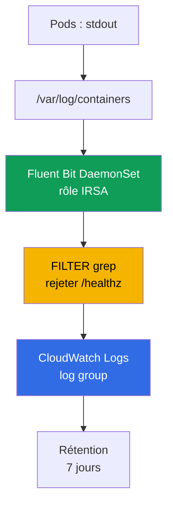
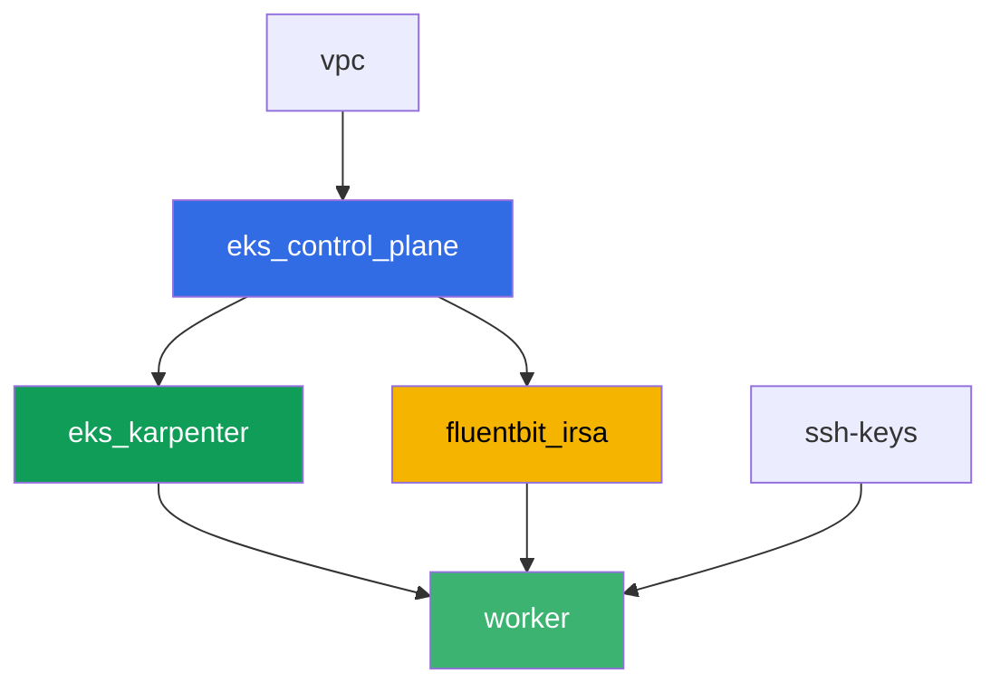

[Русская версия](README_RU.MD) · [Eng version](README.MD) · [Versión en español](README_ES.MD) · [Deutsche Version](README_DE.MD) · [ქართული ვერსია](README_GE.MD) · [繁體中文版](README_TW.MD) · [日本語版](README_JP.MD)

# Lab 115 - Logging : Fluent Bit vers CloudWatch Logs, filtrage et rétention

## Description

Un pod a crashé pendant la nuit, l'ingénieur de garde ouvre `kubectl logs` - et voit
`NotFound` : le Deployment a déjà recréé le pod sous un nouveau nom, et les logs de l'ancien
pod ont disparu avec lui. Dans cette lab, vous constatez d'abord cette perte telle qu'elle
est - sans collecteur de logs, puis vous comblez la lacune : vous installez le Fluent Bit
DaemonSet avec des permissions via IRSA, qui diffuse les logs en continu vers CloudWatch
Logs, et vous confirmez que la même situation (pod supprimé, nom différent) ne coupe plus
l'accès à ses logs. Ensuite vous réduisez le bruit avec un filtre `grep` avant l'ingestion,
définissez une politique de rétention sur le log group, et vérifiez qu'une stack trace
multiligne ne se disperse pas en plusieurs enregistrements séparés.

Les tâches sont écrites dans un style production : un énoncé court plus des critères
d'acceptation. La vérification est automatique, via la commande `check_result`.

## Objectif

Consolider la matière du chapitre du cours :

- [Chapitre 34. Logs : Fluent Bit, CloudWatch Logs, OpenSearch, contrôle des coûts](../../course/34/fr.md)

## Ce que nous créons

Terraform pré-crée un rôle IRSA pour Fluent Bit avec un nom prévisible. Vous installez
Fluent Bit lui-même via Helm, reproduisez la perte de logs avec et sans collecteur, puis
ajoutez un filtre et une rétention.

| Objet | Ce que c'est | Pourquoi dans cette lab |
|--------|---------|-------------------|
| Namespace `eks-115` | section du cluster pour la charge de la lab | garde les ressources séparées des ressources système |
| Composant `fluentbit_irsa` | rôle IRSA pour Fluent Bit | permissions sur un log group spécifique, sans rôles cluster-wide |
| Deployment `flaky-before` + artefact | un pod sans collecteur de logs | fixe la perte de logs après recréation du pod |
| Release `aws-for-fluent-bit` (Helm) | Fluent Bit DaemonSet avec IRSA | pipeline INPUT-FILTER-OUTPUT vers CloudWatch Logs |
| Deployment `flaky-after` + artefact | un pod avec un collecteur fonctionnel | les logs sont retrouvés dans CloudWatch même si le pod est déjà supprimé |
| FILTER `grep` dans `values.yaml` | rejette les lignes avec `/healthz` avant l'ingestion | le bruit n'atteint jamais CloudWatch, ce qui économise sur l'ingestion |
| Pod `access-log-gen` | générateur de lignes de test | vérifie ce qui a été filtré et ce qui ne l'a pas été |
| Rétention `7` jours sur le log group | `aws logs put-retention-policy` | durée de stockage au lieu de « pour toujours » par défaut |
| Pod `stacktrace-app` + `multiline.parser` | simule une stack trace multiligne | un enregistrement dans CloudWatch au lieu de quatre |

Chemin des logs depuis le pod jusqu'à CloudWatch :



## Infrastructure

L'environnement est déployé sur AWS (`eu-central-1`) via Terragrunt. La base correspond à
la lab 101 (control plane, Fargate pour les pods système, Karpenter pour la charge), plus un
composant séparé pour le rôle IRSA de Fluent Bit.

### Modules et dépendances

| Répertoire (composant) | Module (`terraform/modules/`) | Dépend de | Ce qu'il crée |
|---------------------|-------------------------------|------------|-------------|
| `vpc` | `vpc_v3` | - | VPC `10.10.0.0/16`, subnets dans deux AZ, NAT |
| `ssh-keys` | `ssh-keys` | - | paire de clés SSH pour la machine worker et les nodes |
| `eks_control_plane` | `eks_v2_control_plane` | `vpc` | control plane EKS `1.36`, fournisseur OIDC |
| `eks_fargate_system` | `eks_v2_fargate` | `vpc`, `eks_control_plane` | profil Fargate pour `kube-system` et `karpenter` |
| `eks_addons` | `eks_v2_addons` | `eks_control_plane`, `eks_fargate_system` | coredns, kube-proxy, vpc-cni, pod-identity |
| `eks_karpenter` | `eks_v2_karpenter` | `vpc`, `eks_control_plane`, `eks_addons`, `eks_fargate_system` | contrôleur Karpenter, rôle IAM des nodes |
| `eks_karpenter_default_vng` | `eks_v2_karpenter_vng` | `vpc`, `eks_control_plane`, `eks_karpenter` | NodePool par défaut `default` sur AL2023 |
| `fluentbit_irsa` | `eks_v2_fluentbit_irsa` | `eks_control_plane` | rôle IRSA de Fluent Bit, limité à un log group |
| `worker` | `eks_v2_work_pc` | `ssh-keys`, `vpc`, `eks_control_plane`, `eks_karpenter`, `fluentbit_irsa` | machine worker avec kubectl, les tests et `check_result` |

Le composant `fluentbit_irsa` crée un rôle IRSA avec une trust policy liée exactement au SA
`aws-for-fluent-bit` dans le namespace `amazon-cloudwatch` (la condition `sub` du chapitre
16), et une politique inline avec `logs:CreateLogGroup`/`CreateLogStream`/`PutLogEvents`/
`DescribeLogStreams`/`PutRetentionPolicy` sur un log group prévisible unique
`/aws/eks/<cluster>/application`, plus `logs:DescribeLogGroups` sur `*` (AWS documente que
cette action ne supporte pas la restriction à un ARN de log group unique). C'est exactement
le rôle que vous attacherez au ServiceAccount de Fluent Bit lors de l'installation Helm.

Graphe de dépendances (ce qui est appliqué en premier est plus bas dans la flèche) :



Les composants `eks_fargate_system`, `eks_addons` et `eks_karpenter_default_vng` ne sont pas
affichés sur le graphe pour rester dans la limite de 8 nodes, mais ils se trouvent en réalité
entre `eks_control_plane` et `eks_karpenter` (voir le tableau ci-dessus).

### Permissions de la machine worker pour les commandes `aws logs`

Fluent Bit écrit les logs et gère la rétention via son propre rôle IRSA, mais les tâches 6-7
demandent à l'étudiant de vérifier l'état du log group directement depuis la machine worker
(et `tests.bats` fait de même). Le rôle du worker (`eks_v2_work_pc/iam.tf`) a reçu un `Sid`
additif `CloudWatchLogsReadForLoggingLabs` avec `logs:DescribeLogGroups`,
`logs:PutRetentionPolicy`, `logs:FilterLogEvents`, `logs:GetLogEvents` sur `*` - ce sont des
opérations de lecture/description plus la définition de la rétention, ni destructives ni
liées à un préfixe de lab spécifique, donc elles ont été ajoutées sans restriction par tags
(comme `TestRoleManagement*` pour d'autres labs). Rien n'a été retiré des permissions
existantes du worker.

### Noms de ressources prévisibles

`fluentbit_irsa` construit les noms à partir de `prefix`, ce qui permet au worker de les
retrouver sans lire de terraform output. Tous sont disponibles à la connexion dans le
fichier `~/lab115_hints.txt` :

| Ressource | Nom |
|--------|-----|
| Rôle IRSA de Fluent Bit | `eks-task115-fluentbit-irsa-role` |
| Log group | `/aws/eks/<cluster>/application` |

## Déploiement

```bash
TASK=115 make run_eks_task
```

Le déploiement prend environ 15 à 20 minutes. Dans la sortie, trouvez la ligne de connexion
SSH à la machine worker et connectez-vous. kubectl y est déjà configuré pour le bon cluster.

Commandes utiles sur la machine worker :

```bash
time_left       # temps restant de l'environnement
check_result    # vérifier la solution
cat ~/lab115_hints.txt   # nom du rôle IRSA et log group
```

> Sécurité de l'environnement. `env.hcl` a `ssh_password_enable = true` et
> `access_cidrs = ["0.0.0.0/0"]` activés - pratique pour un environnement pédagogique, mais
> ce n'est pas à faire en production. Selon les standards du cours (chapitres 0.2, 2, 19),
> l'accès aux machines worker doit passer par AWS SSM Session Manager sans exposer de ports
> SSH publics, et `access_cidrs` doit être restreint à des adresses précises. Ici, le SSH
> public est laissé uniquement pour garder la mise en place simple.

## Tâches

---
|        **1**        | **Namespace pour la charge de la lab**                             |
| :-----------------: | :---------------------------------------------------------- |
| Ce qu'on fait          | Créez un namespace nommé `eks-115`. Tous les objets de cette lab sont créés à l'intérieur. |
| Critères d'acceptation    | - le namespace `eks-115` existe. |
---
|        **2**        | **Symptôme : les logs disparaissent sans collecteur**                      |
| :-----------------: | :---------------------------------------------------------- |
| Ce qu'on fait          | Dans `eks-115`, créez le Deployment `flaky-before` (image `busybox:1.36`, `1` réplica), conteneur avec la commande `sh -c 'echo BEFORE_MARKER_LAB115; sleep 5; exit 1'`. Le pod finira en `CrashLoopBackOff`, mais le nom du pod reste le même à travers les redémarrages du conteneur - confirmez-le via `kubectl logs <pod>` et `kubectl logs <pod> --previous`. Ensuite, écrivez le nom du pod dans un fichier sous la forme `OLD_POD_NAME=<name>` et exécutez `kubectl delete pod <name>` - le Deployment recréera le pod sous un nouveau nom (analogue à un remplacement de node lors d'une consolidation Karpenter). Exécutez `kubectl logs <old-name>` et confirmez que vous obtenez désormais `Error from server (NotFound)`. Sauvegardez tout dans `/var/work/tests/artifacts/2/before_symptom.txt` : la ligne `OLD_POD_NAME=...`, `BEFORE_MARKER_LAB115` et le texte d'erreur `NotFound`. |
| Critères d'acceptation    | - Deployment `flaky-before` dans `eks-115` avec `1` réplica prêt ;<br/>- le fichier `2/before_symptom.txt` contient `OLD_POD_NAME=`, `BEFORE_MARKER_LAB115` et `NotFound` ;<br/>- le pod nommé dans `OLD_POD_NAME` n'existe actuellement plus (bien recréé). |
---
|        **3**        | **Fluent Bit DaemonSet avec un rôle IRSA**                        |
| :-----------------: | :---------------------------------------------------------- |
| Ce qu'on fait          | Récupérez `role_arn` et `log_group_name` depuis `~/lab115_hints.txt`. Ajoutez le dépôt `helm repo add eks https://aws.github.io/eks-charts` et installez le chart `aws-for-fluent-bit` sous forme de release nommée `aws-for-fluent-bit` dans le namespace `amazon-cloudwatch` (`--create-namespace`). Dans les values, définissez : l'annotation du ServiceAccount `eks.amazonaws.com/role-arn` sur `role_arn` ; `input.memBufLimit: 50MB` et `input.extraInputs` avec la ligne `storage.type      filesystem` (protection OOM sous backpressure, section 34.7) ; `service.extraService` avec la ligne ajoutée `storage.path /var/fluent-bit/state/flb-storage/` ; `cloudWatchLogs.enabled: true`, `region: eu-central-1`, `logGroupName: <log_group_name>`, `logStreamPrefix: "fluentbit-"`, `autoCreateGroup: true`. Sauvegardez les values dans un fichier `values.yaml` sur la machine worker - vous en aurez besoin dans les tâches 5 et 7. Attendez que le DaemonSet soit prêt sur tous les nodes. |
| Critères d'acceptation    | - DaemonSet `aws-for-fluent-bit` dans `amazon-cloudwatch` : `numberReady` égal à `desiredNumberScheduled` et `>= 1` ;<br/>- le ServiceAccount `aws-for-fluent-bit` porte l'annotation `eks.amazonaws.com/role-arn` avec une valeur contenant `fluentbit-irsa-role` ;<br/>- la ConfigMap de la release contient `Mem_Buf_Limit` et `storage.type`. |
---
|        **4**        | **Correctif prouvé : les logs sont retrouvés après la suppression du pod**    |
| :-----------------: | :---------------------------------------------------------- |
| Ce qu'on fait          | Dans `eks-115`, créez le Deployment `flaky-after` (image `busybox:1.36`, `1` réplica), conteneur avec la commande `sh -c 'echo AFTER_MARKER_LAB115; sleep 3600'` (pas de crash). Attendez environ `60` secondes pour que Fluent Bit ait le temps de lire et d'expédier la ligne. Écrivez le nom du pod dans l'artefact sous la forme `OLD_POD_NAME=<name>`, puis exécutez `kubectl delete pod <name>` - le pod sera recréé sous un nouveau nom. Confirmez que `kubectl logs <old-name>` renvoie désormais `NotFound`. Trouvez la ligne `AFTER_MARKER_LAB115` dans CloudWatch Logs : `aws logs filter-log-events --log-group-name <log_group_name> --filter-pattern "AFTER_MARKER_LAB115"`. Sauvegardez dans `/var/work/tests/artifacts/4/after_fixed.txt` la ligne `OLD_POD_NAME=...`, le texte `NotFound` et l'enregistrement trouvé dans CloudWatch. |
| Critères d'acceptation    | - Deployment `flaky-after` dans `eks-115` avec `1` réplica prêt ;<br/>- le fichier `4/after_fixed.txt` contient `OLD_POD_NAME=`, `NotFound` et `AFTER_MARKER_LAB115` ;<br/>- `aws logs filter-log-events` sur le log group avec le motif `AFTER_MARKER_LAB115` trouve au moins un enregistrement, même si le pod d'origine est déjà supprimé. |
---
|        **5**        | **Filtrage : réduire le bruit avant l'expédition**                        |
| :-----------------: | :---------------------------------------------------------- |
| Ce qu'on fait          | Dans le `values.yaml` de la tâche 3, ajoutez `additionalFilters` avec une section `[FILTER]` `Name grep`, `Match kube.*`, `Exclude log /healthz`. Exécutez `helm upgrade aws-for-fluent-bit eks/aws-for-fluent-bit -n amazon-cloudwatch -f values.yaml` et attendez le redémarrage des pods Fluent Bit. Seulement après cela, créez le Pod `access-log-gen` (image `busybox:1.36`) avec une commande qui affiche une ligne avec `/healthz` puis, quelques secondes plus tard, une ligne avec `NORMAL_MARKER_LAB115`, puis se met en attente. Attendez l'expédition et sauvegardez dans `/var/work/tests/artifacts/5/filter_check.txt` une explication : ce qui a été rejeté par le filtre `grep` et pourquoi c'est moins coûteux que de nettoyer les logs dans CloudWatch après coup (section 34.6). |
| Critères d'acceptation    | - le fichier `5/filter_check.txt` n'est pas vide, contient `grep` et `healthz` ;<br/>- CloudWatch Logs (le log group de la lab) n'a pas un seul enregistrement avec `/healthz` ;<br/>- CloudWatch Logs a au moins un enregistrement avec `NORMAL_MARKER_LAB115`. |
---
|        **6**        | **Politique de rétention sur le log group**                             |
| :-----------------: | :---------------------------------------------------------- |
| Ce qu'on fait          | Par défaut, les logs dans CloudWatch sont conservés pour toujours. Définissez une période de rétention de `7` jours : `aws logs put-retention-policy --log-group-name <log_group_name> --retention-in-days 7`. Vérifiez avec `aws logs describe-log-groups --query "logGroups[].[logGroupName,retentionInDays]"`. Sauvegardez la sortie de vérification dans `/var/work/tests/artifacts/6/retention.txt`. |
| Critères d'acceptation    | - `aws logs describe-log-groups` montre `retentionInDays` égal à `7` pour le log group de la lab ;<br/>- le fichier `6/retention.txt` n'est pas vide et contient `7`. |
---
|        **7**        | **Multiligne : une stack trace comme un seul enregistrement, pas quatre**    |
| :-----------------: | :---------------------------------------------------------- |
| Ce qu'on fait          | Dans `values.yaml`, ajoutez un FILTER `multiline` avec le type intégré `python` (qui fusionne un Traceback) - il doit s'exécuter dans le pipeline avant le FILTER `kubernetes`, car les enregistrements fusionnés sont réémis au début du pipeline (sinon `python` ne s'exécuterait pas du tout s'il est laissé comme partie de `input.multilineParser` avec `cri` : `cri` correspond à n'importe quelle ligne CRI comme première ligne, et `python` n'a jamais l'occasion de s'exécuter). Exécutez `helm upgrade aws-for-fluent-bit eks/aws-for-fluent-bit -n amazon-cloudwatch -f values.yaml` et attendez le redémarrage des pods Fluent Bit. Seulement après cela, créez le Pod `stacktrace-app` (image `busybox:1.36`), qui affiche quatre lignes à la suite : `Traceback (most recent call last):`, `  File "app.py", line 10, in <module>`, `    raise ValueError('CRASH_TRACE_LAB115')` et `ValueError: CRASH_TRACE_LAB115`, puis se met en attente. Attendez l'expédition et récupérez l'enregistrement via `aws logs filter-log-events --filter-pattern "CRASH_TRACE_LAB115"`. Sauvegardez dans `/var/work/tests/artifacts/7/multiline.txt` le message complet trouvé et une explication indiquant que `multiline.parser` a fusionné les quatre lignes en un seul enregistrement CloudWatch. |
| Critères d'acceptation    | - le fichier `7/multiline.txt` n'est pas vide, contient `CRASH_TRACE_LAB115` et le mot `multiline` ou `Traceback` ;<br/>- l'enregistrement CloudWatch Logs avec `CRASH_TRACE_LAB115` contient aussi, dans le même message, la ligne `Traceback` (ce qui signifie que les quatre lignes ont été fusionnées en un seul enregistrement, et non séparées en quatre). |
---

## Vérification du résultat

Sur la machine worker, lancez la vérification automatique :

```bash
check_result
```

Le script exécutera les tests et affichera le pourcentage de tâches accomplies.

## Solution

Solution de référence : [worker/files/solutions/1_FR.MD](worker/files/solutions/1_FR.MD)

## Suppression du cluster et des ressources

Dans cette lab, Fluent Bit a été installé manuellement via Helm dans `amazon-cloudwatch`,
et non par terraform - son DaemonSet et la charge dans `eks-115` ont amené Karpenter à
lancer un node EC2. Terraform n'en a pas connaissance et ne le supprimera pas - si vous
lancez `destroy` trop tôt, le node EC2 orphelin retient une ENI et bloque la suppression du
VPC/des subnets (le même schéma que dans les labs 108, 109, 111, 114). Avant `destroy`,
retirez la charge et attendez que Karpenter retire lui-même l'instance EC2 :

```bash
# 1. On retire la charge à cause de laquelle Karpenter a lancé le node EC2
helm uninstall aws-for-fluent-bit -n amazon-cloudwatch
kubectl delete namespace eks-115 amazon-cloudwatch

# 2. On attend que Karpenter retire lui-même le node EC2 (pas seulement supprimer
#    l'objet Node, mais réellement terminer l'instance EC2) - les deux sorties doivent
#    être vides
for i in $(seq 1 30); do
  nc=$(kubectl get nodeclaims --no-headers 2>/dev/null | wc -l)
  ec2=$(aws ec2 describe-instances \
    --filters "Name=tag:karpenter.sh/nodepool,Values=default" \
      "Name=instance-state-name,Values=running,pending,stopping,stopped" \
    --query 'Reservations[].Instances[]' --output text)
  echo "nodeclaims=$nc ec2_instances=[$ec2]"
  [[ "$nc" == "0" ]] && [[ -z "$ec2" ]] && break
  sleep 10
done
```

Seulement après que `nodeclaims=0` et que la liste des instances EC2 soit vide, lancez la
suppression des ressources terraform :

```bash
TASK=115 make delete_eks_task
```
