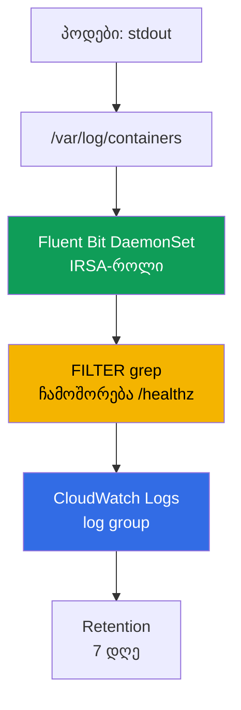
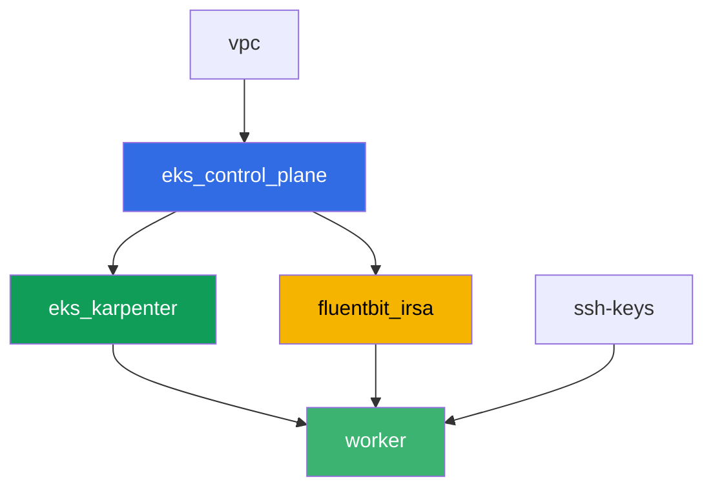

[Русская версия](README_RU.MD) · [Eng version](README.MD) · [Versión en español](README_ES.MD) · [Version française](README_FR.MD) · [Deutsche Version](README_DE.MD) · [繁體中文版](README_TW.MD) · [日本語版](README_JP.MD)

# ლაბა 115 - ლოგირება: Fluent Bit CloudWatch Logs-ში, ფილტრაცია და retention

## აღწერა

პოდი ღამით crash-ი მოხდა, on-call ინჟინერი ხსნის `kubectl logs`-ს - და ხედავს
`NotFound`-ს: Deployment-მა უკვე ხელახლა შექმნა პოდი ახალი სახელით, და ძველი პოდის
ლოგები მასთან ერთად გაქრა. ამ ლაბაში თქვენ ჯერ ფიქსირებთ ამ დანაკარგს ისეთივე ფორმით,
როგორიც არის - ლოგების collector-ის გარეშე, შემდეგ ხურავთ ხარვეზს: აყენებთ Fluent Bit
DaemonSet-ს IRSA-ის მეშვეობით უფლებებით, რომელიც ლოგებს უწყვეტად ატარებს CloudWatch
Logs-ში, და ადასტურებთ, რომ იგივე სიტუაცია (პოდი წაშლილია, სახელი სხვა) აღარ ჭრის
წვდომას მისი ლოგებისკენ. შემდეგ ხმაურს ვჭრით `grep` ფილტრით ჩატანის (ingestion) წინ,
ვაყალიბებთ retention-პოლიტიკას log group-ზე, და ვამოწმებთ, რომ multiline stack trace
ცალკეულ ჩანაწერებად არ იშლება.

დავალებები production-სტილში დაწერილია: მოკლე დავალება პლუს მიღების კრიტერიუმები.
შემოწმება ავტომატურია, ბრძანებით `check_result`.

## მიზანი

გავამყაროთ კურსის ამ თავის მასალა:

- [თავი 34. ლოგები: Fluent Bit, CloudWatch Logs, OpenSearch, ღირებულების კონტროლი](../../course/34/ru.md)

## რას ვქმნით

Terraform წინასწარ ქმნის IRSA-როლს Fluent Bit-ისთვის, პროგნოზირებადი სახელით. თქვენ
თავად აყენებთ Fluent Bit-ს Helm-ის მეშვეობით, ხელახლა ვიწვევთ ლოგების დანაკარგს collector-ის
გარეშე და მასთან ერთად, და ვამატებთ ფილტრს პლუს retention-ს.

| ობიექტი | რა არის ეს | რისთვის ამ ლაბაში |
|--------|---------|-------------------|
| Namespace `eks-115` | კლასტერის სექცია ლაბის დატვირთვისთვის | ვინახავთ რესურსებს განცალკევებულად სისტემურისგან |
| კომპონენტი `fluentbit_irsa` | IRSA-როლი Fluent Bit-ისთვის | უფლებები ერთ კონკრეტულ log group-ზე, კლასტერ-მასშტაბის როლების გარეშე |
| Deployment `flaky-before` + არტეფაქტი | პოდი ლოგების collector-ის გარეშე | ფიქსირებს ლოგების დანაკარგს პოდის ხელახლა შექმნის შემდეგ |
| Release `aws-for-fluent-bit` (Helm) | Fluent Bit DaemonSet IRSA-ით | INPUT-FILTER-OUTPUT pipeline CloudWatch Logs-ში |
| Deployment `flaky-after` + არტეფაქტი | პოდი მომუშავე collector-ით | ლოგები მოიძებნება CloudWatch-ში, მიუხედავად იმისა, რომ პოდი უკვე წაშლილია |
| FILTER `grep` `values.yaml`-ში | ჩამოშორებს ხაზებს `/healthz`-ით ჩატანის წინ | ხმაური არასდროს მიდის CloudWatch-ში, ვზოგავთ ingestion-ზე |
| Pod `access-log-gen` | ტესტური ხაზების გენერატორი | ამოწმებს, რა გაფილტრდა და რა არ გაფილტრდა |
| Retention `7` დღე log group-ზე | `aws logs put-retention-policy` | შენახვის ხანგრძლივობა "სამუდამოდ"-ის ნაცვლად ნაგულისხმევად |
| Pod `stacktrace-app` + `multiline.parser` | სიმულირებს multiline stack trace-ს | ერთი ჩანაწერი CloudWatch-ში ოთხის ნაცვლად |

ლოგის გზა პოდიდან CloudWatch-ისკენ:



## ინფრასტრუქტურა

გარემო დეპლოირდება AWS-ში (`eu-central-1`) Terragrunt-ის მეშვეობით. ბაზისი ემთხვევა
ლაბა 101-ს (control plane, Fargate სისტემური პოდებისთვის, Karpenter დატვირთვისთვის),
პლუს ცალკე კომპონენტი Fluent Bit-ის IRSA-როლისთვის.

### მოდულები და დამოკიდებულებები

| დირექტორია (კომპონენტი) | მოდული (`terraform/modules/`) | დამოკიდებულია | რას ქმნის |
|---------------------|-------------------------------|------------|-------------|
| `vpc` | `vpc_v3` | - | VPC `10.10.0.0/16`, ქვექსელები ორ AZ-ში, NAT |
| `ssh-keys` | `ssh-keys` | - | SSH-გასაღებების წყვილი სამუშაო მანქანისა და ნოუდებისთვის |
| `eks_control_plane` | `eks_v2_control_plane` | `vpc` | EKS control plane `1.36`, OIDC provider |
| `eks_fargate_system` | `eks_v2_fargate` | `vpc`, `eks_control_plane` | Fargate-პროფილი `kube-system`-ისთვის და `karpenter`-ისთვის |
| `eks_addons` | `eks_v2_addons` | `eks_control_plane`, `eks_fargate_system` | coredns, kube-proxy, vpc-cni, pod-identity |
| `eks_karpenter` | `eks_v2_karpenter` | `vpc`, `eks_control_plane`, `eks_addons`, `eks_fargate_system` | Karpenter-ის კონტროლერი, ნოუდების IAM-როლი |
| `eks_karpenter_default_vng` | `eks_v2_karpenter_vng` | `vpc`, `eks_control_plane`, `eks_karpenter` | ნაგულისხმევი NodePool `default` AL2023-ზე |
| `fluentbit_irsa` | `eks_v2_fluentbit_irsa` | `eks_control_plane` | Fluent Bit IRSA-როლი, დაფარგლული ერთ log group-ზე |
| `worker` | `eks_v2_work_pc` | `ssh-keys`, `vpc`, `eks_control_plane`, `eks_karpenter`, `fluentbit_irsa` | სამუშაო მანქანა kubectl-ით, ტესტებით და `check_result`-ით |

კომპონენტი `fluentbit_irsa` ქმნის IRSA-როლს trust policy-ით, მიბმულს ზუსტად SA
`aws-for-fluent-bit`-ზე namespace `amazon-cloudwatch`-ში (`sub`-პირობა თავი 16-დან), და
inline policy-ს `logs:CreateLogGroup`/`CreateLogStream`/`PutLogEvents`/
`DescribeLogStreams`/`PutRetentionPolicy`-ით ერთ პროგნოზირებად log group-ზე
`/aws/eks/<cluster>/application`, პლუს `logs:DescribeLogGroups`-ს `*`-ზე (AWS
დოკუმენტირებას ამ action-ს, როგორც ისეთს, რომელიც არ უჭერს მხარს დაფარგვას ერთ
log group ARN-ზე). ეს ზუსტად ის როლია, რომელსაც მიამაგრებთ Fluent Bit-ის
ServiceAccount-ზე Helm-ინსტალაციის დროს.

დამოკიდებულებების გრაფი (რაც უფრო ადრე აპლიცირდება, ის ხრიხისკენ ქვემოთაა):



კომპონენტები `eks_fargate_system`, `eks_addons` და `eks_karpenter_default_vng` არ არის
ნაჩვენები გრაფზე, რომ დავიცვათ 8-ნოუდის ლიმიტი, მაგრამ ისინი ფაქტობრივად მდებარეობენ
`eks_control_plane`-სა და `eks_karpenter`-ის შორის (იხილეთ ცხრილი ზემოთ).

### Worker-ის უფლებები `aws logs` ბრძანებებისთვის

Fluent Bit წერს ლოგებს და მართავს retention-ს საკუთარი IRSA-როლის მეშვეობით, მაგრამ
დავალებები 6-7 სთხოვს სტუდენტს, log group-ის მდგომარეობა შეამოწმოს პირდაპირ სამუშაო
მანქანიდან (და `tests.bats`-იც ასევე იქცევა). Worker-ის როლმა
(`eks_v2_work_pc/iam.tf`) მიიღო ერთი additive `Sid`
`CloudWatchLogsReadForLoggingLabs` `logs:DescribeLogGroups`-ით,
`logs:PutRetentionPolicy`-ით, `logs:FilterLogEvents`-ით, `logs:GetLogEvents`-ით `*`-ზე -
ესენი წაკითხვა/description-ოპერაციები არის პლუს retention-ის დაყალიბება, არადესტრუქციული
და არ დაკავშირებული კონკრეტულ ლაბ-პრეფიქსზე, ამიტომ ისინი დამატებულია დავიწროების
გარეშე ტეგებით (როგორც `TestRoleManagement*` სხვა ლაბებისთვის). Worker-ის არსებული
უფლებებიდან არაფერი წაშლილა.

### პროგნოზირებადი რესურსების სახელები

`fluentbit_irsa` აწყობს სახელებს `prefix`-იდან, ამიტომ worker პოულობს მათ terraform
output-ის წაკითხვის გარეშე. ყველა მათგანი ხელმისაწვდომია login-ისას ფაილში
`~/lab115_hints.txt`:

| რესურსი | სახელი |
|--------|-----|
| Fluent Bit IRSA-როლი | `eks-task115-fluentbit-irsa-role` |
| Log group | `/aws/eks/<cluster>/application` |

## განლაგება

```bash
TASK=115 make run_eks_task
```

განლაგება გრძელდება დაახლოებით 15-20 წუთი. output-ში მოძებნეთ ხაზი SSH-შეერთებით
სამუშაო მანქანასთან და დაუკავშირდით მას. kubectl იქ უკვე კონფიგურირებულია სწორ
კლასტერზე.

სასარგებლო ბრძანებები სამუშაო მანქანაზე:

```bash
time_left       # რამდენი დრო დარჩა გარემოს
check_result    # გადამოწმება
cat ~/lab115_hints.txt   # IRSA-როლის სახელი და log group
```

> სტენდის უსაფრთხოება. `env.hcl`-ში ჩართულია `ssh_password_enable = true` და
> `access_cidrs = ["0.0.0.0/0"]` - ეს მოსახერხებელია სასწავლო გარემოსთვის, მაგრამ ასე
> არ უნდა გავხადოთ production-ში. კურსის სტანდარტების მიხედვით (თავები 0.2, 2, 19)
> სამუშაო მანქანებზე წვდომა იხსნება AWS SSM Session Manager-ის მეშვეობით, საჯარო
> SSH-პორტების გარეთ გამოტანის გარეშე, ხოლო `access_cidrs` ვიწროვდება კონკრეტულ
> მისამართებზე. აქ საჯარო SSH დარჩენილია მხოლოდ გაშვების გასამარტივებლად.

## დავალებები

---
|        **1**        | **Namespace ლაბის დატვირთვისთვის**                             |
| :-----------------: | :---------------------------------------------------------- |
| რას ვაკეთებთ          | შექმენით namespace სახელით `eks-115`. ამ ლაბის ყველა ობიექტი შექმნილია მის შიგნით. |
| მიღების კრიტერიუმები    | - namespace `eks-115` არსებობს. |
---
|        **2**        | **სიმპტომი: ლოგები ქრება collector-ის გარეშე**                      |
| :-----------------: | :---------------------------------------------------------- |
| რას ვაკეთებთ          | `eks-115`-ში შექმენით Deployment `flaky-before` (image `busybox:1.36`, `1` რეპლიკა), კონტეინერით ბრძანებით `sh -c 'echo BEFORE_MARKER_LAB115; sleep 5; exit 1'`. პოდი აღმოჩნდება `CrashLoopBackOff`-ში, მაგრამ პოდის სახელი უცვლელი რჩება კონტეინერის რესტარტების განმავლობაში - დაადასტურეთ ეს `kubectl logs <pod>`-ითა და `kubectl logs <pod> --previous`-ით. შემდეგ ჩაწერეთ პოდის სახელი ფაილში, როგორც `OLD_POD_NAME=<name>`, და გაუშვით `kubectl delete pod <name>` - Deployment ხელახლა შექმნის პოდს ახალი სახელით (ანალოგიური ნოუდის ჩანაცვლებისა Karpenter-ის consolidation-ის დროს). გაუშვით `kubectl logs <old-name>` და დაადასტურეთ, რომ ახლა იღებთ `Error from server (NotFound)`-ს. შეინახეთ ყველაფერი `/var/work/tests/artifacts/2/before_symptom.txt`-ში: ხაზი `OLD_POD_NAME=...`, `BEFORE_MARKER_LAB115` და შეცდომის ტექსტი `NotFound`. |
| მიღების კრიტერიუმები    | - Deployment `flaky-before` `eks-115`-ში `1` მზა რეპლიკით;<br/>- ფაილი `2/before_symptom.txt` შეიცავს `OLD_POD_NAME=`, `BEFORE_MARKER_LAB115` და `NotFound`-ს;<br/>- პოდი, დასახელებული `OLD_POD_NAME`-ში, ამჟამად არ არსებობს (მართლაც ხელახლა შექმნილია). |
---
|        **3**        | **Fluent Bit DaemonSet IRSA-როლით**                        |
| :-----------------: | :---------------------------------------------------------- |
| რას ვაკეთებთ          | აიღეთ `role_arn` და `log_group_name` ფაილიდან `~/lab115_hints.txt`. დაამატეთ რეპოზიტორი `helm repo add eks https://aws.github.io/eks-charts` და დაყენეთ chart `aws-for-fluent-bit`, როგორც release სახელით `aws-for-fluent-bit` namespace `amazon-cloudwatch`-ში (`--create-namespace`). values-ში დააყალიბეთ: ServiceAccount-ის annotation `eks.amazonaws.com/role-arn` `role_arn`-ის ტოლი; `input.memBufLimit: 50MB` და `input.extraInputs` ხაზით `storage.type      filesystem` (OOM-დაცვა backpressure-ის ქვეშ, სექცია 34.7); `service.extraService` დამატებული ხაზით `storage.path /var/fluent-bit/state/flb-storage/`; `cloudWatchLogs.enabled: true`, `region: eu-central-1`, `logGroupName: <log_group_name>`, `logStreamPrefix: "fluentbit-"`, `autoCreateGroup: true`. შეინახეთ values ფაილში `values.yaml` სამუშაო მანქანაზე - ის დაგჭირდებათ დავალებებში 5 და 7. დაელოდეთ, სანამ DaemonSet მზადება ყველა ნოუდზე. |
| მიღების კრიტერიუმები    | - DaemonSet `aws-for-fluent-bit` `amazon-cloudwatch`-ში: `numberReady` ტოლია `desiredNumberScheduled`-ის და `>= 1`-ია;<br/>- ServiceAccount `aws-for-fluent-bit` ატარებს annotation-ს `eks.amazonaws.com/role-arn` მნიშვნელობით, რომელიც შეიცავს `fluentbit-irsa-role`-ს;<br/>- release-ის ConfigMap შეიცავს `Mem_Buf_Limit`-ს და `storage.type`-ს. |
---
|        **4**        | **ფიქსი დამტკიცებულია: ლოგები მოიძებნება პოდის წაშლის შემდეგ**    |
| :-----------------: | :---------------------------------------------------------- |
| რას ვაკეთებთ          | `eks-115`-ში შექმენით Deployment `flaky-after` (image `busybox:1.36`, `1` რეპლიკა), კონტეინერით ბრძანებით `sh -c 'echo AFTER_MARKER_LAB115; sleep 3600'` (crash-ის გარეშე). დაელოდეთ დაახლოებით `60` წამი, რომ Fluent Bit-ს ჰქონდეს დრო წაიკითხოს და გადაგზავნოს ხაზი. ჩაწერეთ პოდის სახელი არტეფაქტში, როგორც `OLD_POD_NAME=<name>`, შემდეგ გაუშვით `kubectl delete pod <name>` - პოდი ხელახლა შექმნილი იქნება ახალი სახელით. დაადასტურეთ, რომ `kubectl logs <old-name>` ახლა არის `NotFound`. მოძებნეთ ხაზი `AFTER_MARKER_LAB115` CloudWatch Logs-ში: `aws logs filter-log-events --log-group-name <log_group_name> --filter-pattern "AFTER_MARKER_LAB115"`. შეინახეთ `/var/work/tests/artifacts/4/after_fixed.txt`-ში ხაზი `OLD_POD_NAME=...`, ტექსტი `NotFound` და CloudWatch-ში ნაპოვნი ჩანაწერი. |
| მიღების კრიტერიუმები    | - Deployment `flaky-after` `eks-115`-ში `1` მზა რეპლიკით;<br/>- ფაილი `4/after_fixed.txt` შეიცავს `OLD_POD_NAME=`, `NotFound`-ს და `AFTER_MARKER_LAB115`-ს;<br/>- `aws logs filter-log-events` log group-ის მიმართ pattern-ით `AFTER_MARKER_LAB115` პოულობს სულ ცოტა ერთ ჩანაწერს, მიუხედავად იმისა, რომ თავდაპირველი პოდი უკვე წაშლილია. |
---
|        **5**        | **ფილტრაცია: ხმაურის ჩამოკვეთა ჩატანის წინ**                        |
| :-----------------: | :---------------------------------------------------------- |
| რას ვაკეთებთ          | `values.yaml`-ში დავალება 3-დან დაამატეთ `additionalFilters` `[FILTER]` სექციით `Name grep`, `Match kube.*`, `Exclude log /healthz`. გაუშვით `helm upgrade aws-for-fluent-bit eks/aws-for-fluent-bit -n amazon-cloudwatch -f values.yaml` და დაელოდეთ Fluent Bit-ის პოდების რესტარტს. მხოლოდ ამის შემდეგ შექმენით Pod `access-log-gen` (image `busybox:1.36`) ბრძანებით, რომელიც ბეჭდავს ხაზს `/healthz`-ით და, ორიოდე წამის შემდეგ, ხაზს `NORMAL_MARKER_LAB115`-ით, შემდეგ იძინებს. დაელოდეთ გადაგზავნას და შეინახეთ `/var/work/tests/artifacts/5/filter_check.txt`-ში განმარტება: რა ჩამოშორდა `grep` ფილტრით და რატომ არის ეს უფრო ეკონომიური, ვიდრე CloudWatch-ში ლოგების გასუფთავება ფაქტის შემდეგ (სექცია 34.6). |
| მიღების კრიტერიუმები    | - ფაილი `5/filter_check.txt` არ არის ცარიელი, შეიცავს `grep`-ს და `healthz`-ს;<br/>- CloudWatch Logs-ში (ლაბის log group) არ არსებობს ერთი ჩანაწერიც `/healthz`-ით;<br/>- CloudWatch Logs-ში არსებობს სულ ცოტა ერთი ჩანაწერი `NORMAL_MARKER_LAB115`-ით. |
---
|        **6**        | **Retention-პოლიტიკა log group-ზე**                             |
| :-----------------: | :---------------------------------------------------------- |
| რას ვაკეთებთ          | ნაგულისხმევად, ლოგები CloudWatch-ში ინახება სამუდამოდ. დააყალიბეთ retention-პერიოდი `7` დღით: `aws logs put-retention-policy --log-group-name <log_group_name> --retention-in-days 7`. შემოწმდეს `aws logs describe-log-groups --query "logGroups[].[logGroupName,retentionInDays]"`-ით. შეინახეთ შემოწმების output `/var/work/tests/artifacts/6/retention.txt`-ში. |
| მიღების კრიტერიუმები    | - `aws logs describe-log-groups` აჩვენებს `retentionInDays`-ს, ტოლს `7`-ის, ლაბის log group-ისთვის;<br/>- ფაილი `6/retention.txt` არ არის ცარიელი და შეიცავს `7`-ს. |
---
|        **7**        | **Multiline: stack trace ერთ ჩანაწერად, არა ოთხად**    |
| :-----------------: | :---------------------------------------------------------- |
| რას ვაკეთებთ          | `values.yaml`-ში დაამატეთ `multiline` FILTER ჩაშენებული `python` ტიპით (რომელიც აერთიანებს Traceback-ს) - ის უნდა გაეშვას pipeline-ში `kubernetes` FILTER-ის წინ, რადგან გაერთიანებული ჩანაწერები ხელახლა ემიტირდება pipeline-ის დასაწყისში (თუ არა, `python` საერთოდ არ გაეშვება, თუ დარჩა `input.multilineParser`-ის ნაწილად `cri`-სთან ერთად: `cri` ემთხვევა ნებისმიერ CRI-ხაზს, როგორც პირველ ხაზს, და `python`-ს არასდროს ეძლევა შანსი). გაუშვით `helm upgrade aws-for-fluent-bit eks/aws-for-fluent-bit -n amazon-cloudwatch -f values.yaml` და დაელოდეთ Fluent Bit-ის პოდების რესტარტს. მხოლოდ ამის შემდეგ შექმენით Pod `stacktrace-app` (image `busybox:1.36`), რომელიც ბეჭდავს ოთხ ხაზს ზედიზედ: `Traceback (most recent call last):`, `  File "app.py", line 10, in <module>`, `    raise ValueError('CRASH_TRACE_LAB115')` და `ValueError: CRASH_TRACE_LAB115`, შემდეგ იძინებს. დაელოდეთ გადაგზავნას და მიიღეთ ჩანაწერი `aws logs filter-log-events --filter-pattern "CRASH_TRACE_LAB115"`-ის მეშვეობით. შეინახეთ `/var/work/tests/artifacts/7/multiline.txt`-ში სრული ნაპოვნი message და განმარტება, რომ `multiline.parser`-მა გააერთიანა ოთხი ხაზი ერთ CloudWatch-ჩანაწერად. |
| მიღების კრიტერიუმები    | - ფაილი `7/multiline.txt` არ არის ცარიელი, შეიცავს `CRASH_TRACE_LAB115`-ს და სიტყვას `multiline` ან `Traceback`;<br/>- CloudWatch Logs-ის ჩანაწერი `CRASH_TRACE_LAB115`-ით ასევე შეიცავს, იმავე message-ში, ხაზს `Traceback` (ეს ნიშნავს, რომ ყველა ოთხი ხაზი გაერთიანდა ერთ ჩანაწერად, არა გაიყო ოთხად). |
---

## შედეგის შემოწმება

სამუშაო მანქანაზე გაუშვით ავტომატური შემოწმება:

```bash
check_result
```

სკრიპტი გაუშვებს ტესტებს და აჩვენებს დასრულებული დავალებების პროცენტს.

## გადაწყვეტა

ეტალონური გადაწყვეტა: [worker/files/solutions/1_GE.MD](worker/files/solutions/1_GE.MD)

## კლასტერისა და რესურსების წაშლა

Fluent Bit ამ ლაბაში დაყენებულია ხელით Helm-ის მეშვეობით `amazon-cloudwatch`-ში, არა
terraform-ით - მისმა DaemonSet-მა და დატვირთვამ `eks-115`-ში გამოიწვია Karpenter-ის მიერ
EC2-ნოუდის ამართვა. Terraform არ იცის მის შესახებ და არ წაშლის - თუ `destroy` ადრე
დაიწყება, მიტოვებული EC2-ნოუდი ინახავს ENI-ს და ბლოკავს VPC/ქვექსელების წაშლას (ის
იგივე პატერნი, რაც ლაბებში 108, 109, 111, 114). `destroy`-ის წინ ამოშალეთ დატვირთვა და
დაელოდეთ, სანამ Karpenter თავად მოაშორებს EC2-instance-ს:

```bash
# 1. ვხსნით დატვირთვას, რომლის გამო Karpenter-მა ავამართა EC2-ნოუდი
helm uninstall aws-for-fluent-bit -n amazon-cloudwatch
kubectl delete namespace eks-115 amazon-cloudwatch

# 2. ველოდებით, სანამ Karpenter თავადვე მოაშორებს EC2-ნოუდს (არა უბრალოდ წაშლის
#    Node ობიექტს, არამედ დაასრულებს თავად EC2-instance-ს) - ორივე output ცარიელი
#    უნდა იყოს
for i in $(seq 1 30); do
  nc=$(kubectl get nodeclaims --no-headers 2>/dev/null | wc -l)
  ec2=$(aws ec2 describe-instances \
    --filters "Name=tag:karpenter.sh/nodepool,Values=default" \
      "Name=instance-state-name,Values=running,pending,stopping,stopped" \
    --query 'Reservations[].Instances[]' --output text)
  echo "nodeclaims=$nc ec2_instances=[$ec2]"
  [[ "$nc" == "0" ]] && [[ -z "$ec2" ]] && break
  sleep 10
done
```

მხოლოდ მას შემდეგ, რაც `nodeclaims=0` და EC2-instance-ების სია ცარიელია, გაუშვით
terraform-რესურსების წაშლა:

```bash
TASK=115 make delete_eks_task
```
