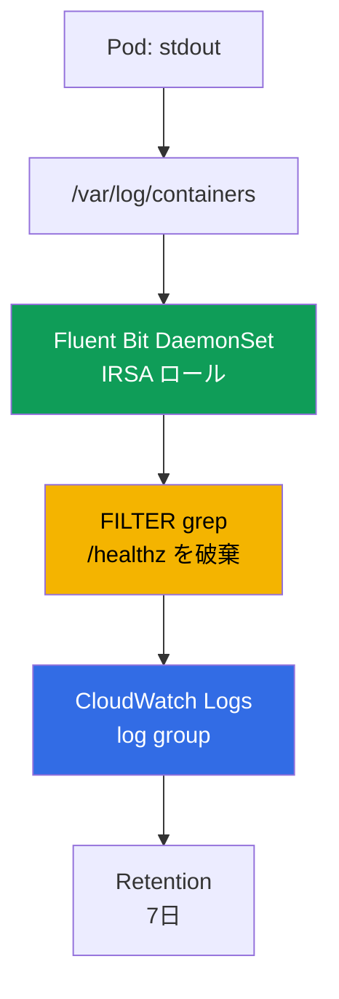
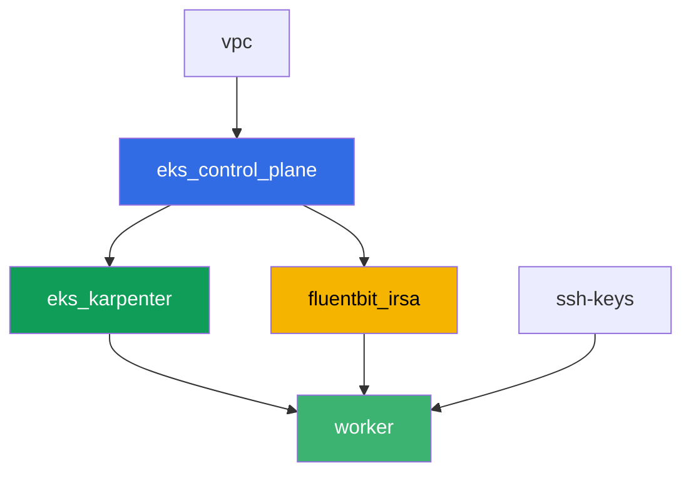

[Русская версия](README_RU.MD) · [Eng version](README.MD) · [Versión en español](README_ES.MD) · [Version française](README_FR.MD) · [Deutsche Version](README_DE.MD) · [ქართული ვერსია](README_GE.MD) · [繁體中文版](README_TW.MD)

# ラボ 115 - ロギング:Fluent Bit から CloudWatch Logs へ、フィルタリングとリテンション

## 説明

夜間に Pod がクラッシュし、当直エンジニアが `kubectl logs` を開くと `NotFound` が返っ
てきます。Deployment はすでに Pod を新しい名前で再作成しており、古い Pod のログはそれと
一緒に消えてしまいました。このラボでは、まずログ収集エージェントがない状態でこの損失を
そのまま再現し、次にそのギャップを塞ぎます:IRSA 経由の権限を持つ Fluent Bit DaemonSet
をインストールし、それがログを継続的に CloudWatch Logs にストリーミングすることで、同
じ状況(Pod が削除され、名前が変わる)がもはやそのログへのアクセスを断ち切らないことを
確認します。続いて、取り込み前に `grep` フィルタでノイズを削減し、ロググループにリテン
ションポリシーを設定し、multiline のスタックトレースが別々のレコードに分裂しないことを
検証します。

タスクは production スタイルで書かれています:短い課題文とアクセプタンス基準。検証は
`check_result` コマンドによって自動的に行われます。

## 目的

コースの以下の章の内容を定着させます:

- [第 34 章。ログ:Fluent Bit、CloudWatch Logs、OpenSearch、コスト管理](../../course/34/jp.md)

## 作成するもの

Terraform は予測可能な名前を持つ Fluent Bit 用の IRSA ロールを事前に作成します。Fluent
Bit 自体は Helm でインストールし、収集エージェントなしとありの両方でログ損失を再現し、
フィルタとリテンションを追加します。

| オブジェクト | 何か | このラボでの目的 |
|--------|---------|-------------------|
| Namespace `eks-115` | ラボのワークロード用のクラスタ区画 | システムのリソースから分離しておく |
| コンポーネント `fluentbit_irsa` | Fluent Bit 用の IRSA ロール | クラスタ全体のロールではなく、1 つの特定のロググループに対する権限 |
| Deployment `flaky-before` + アーティファクト | ログ収集エージェントがない Pod | Pod 再作成後のログ損失を記録する |
| リリース `aws-for-fluent-bit`(Helm) | IRSA 付きの Fluent Bit DaemonSet | CloudWatch Logs への INPUT-FILTER-OUTPUT パイプライン |
| Deployment `flaky-after` + アーティファクト | 動作する収集エージェントを持つ Pod | Pod がすでに削除されていても CloudWatch でログが見つかる |
| `values.yaml` 内の FILTER `grep` | 取り込み前に `/healthz` を含む行を破棄する | ノイズが CloudWatch に届かず、取り込みコストを節約する |
| Pod `access-log-gen` | テスト用の行ジェネレータ | 何がフィルタされ何がされなかったかを検証する |
| ロググループのリテンション `7` 日 | `aws logs put-retention-policy` | デフォルトの「永久」ではなく保存期間を設定する |
| Pod `stacktrace-app` + `multiline.parser` | multiline のスタックトレースを模擬する | CloudWatch で 4 件ではなく 1 件のレコードになる |

Pod から CloudWatch までのログの経路:



## インフラストラクチャ

環境は Terragrunt によって AWS(`eu-central-1`)にデプロイされます。基本構成はラボ 101
と同じ(control plane、システム Pod 用の Fargate、ワークロード用の Karpenter)で、それ
に Fluent Bit の IRSA ロール用の独立したコンポーネントが加わります。

### モジュールと依存関係

| ディレクトリ(コンポーネント) | モジュール(`terraform/modules/`) | 依存先 | 作成されるもの |
|---------------------|-------------------------------|------------|-------------|
| `vpc` | `vpc_v3` | - | VPC `10.10.0.0/16`、2 つの AZ にあるサブネット、NAT |
| `ssh-keys` | `ssh-keys` | - | ワーカーマシンとノード用の SSH キーペア |
| `eks_control_plane` | `eks_v2_control_plane` | `vpc` | EKS control plane `1.36`、OIDC プロバイダ |
| `eks_fargate_system` | `eks_v2_fargate` | `vpc`、`eks_control_plane` | `kube-system` と `karpenter` 用の Fargate profile |
| `eks_addons` | `eks_v2_addons` | `eks_control_plane`、`eks_fargate_system` | coredns、kube-proxy、vpc-cni、pod-identity |
| `eks_karpenter` | `eks_v2_karpenter` | `vpc`、`eks_control_plane`、`eks_addons`、`eks_fargate_system` | Karpenter コントローラ、ノードの IAM ロール |
| `eks_karpenter_default_vng` | `eks_v2_karpenter_vng` | `vpc`、`eks_control_plane`、`eks_karpenter` | AL2023 上のデフォルト NodePool `default` |
| `fluentbit_irsa` | `eks_v2_fluentbit_irsa` | `eks_control_plane` | 1 つのロググループに限定された Fluent Bit の IRSA ロール |
| `worker` | `eks_v2_work_pc` | `ssh-keys`、`vpc`、`eks_control_plane`、`eks_karpenter`、`fluentbit_irsa` | kubectl、テスト、`check_result` を備えたワーカーマシン |

`fluentbit_irsa` コンポーネントは、namespace `amazon-cloudwatch` の SA
`aws-for-fluent-bit` に厳密に紐付いた trust policy(第 16 章の `sub` 条件)を持つ IRSA
ロールを作成し、`logs:CreateLogGroup`/`CreateLogStream`/`PutLogEvents`/
`DescribeLogStreams`/`PutRetentionPolicy` を 1 つの予測可能なロググループ
`/aws/eks/<cluster>/application` に対して、加えて `logs:DescribeLogGroups` を `*` に対
して付与するインラインポリシーを持ちます(AWS のドキュメントでは、このアクションは単一
のロググループ ARN へのスコープ限定をサポートしないとされています)。これはまさに、
Helm インストール時に Fluent Bit の ServiceAccount にアタッチするロールです。

依存関係グラフ(先に適用されるものほど矢印の下側にある):



コンポーネント `eks_fargate_system`、`eks_addons`、`eks_karpenter_default_vng` は、8 ノー
ドの制限内に収めるためグラフには表示されていませんが、実際には `eks_control_plane` と
`eks_karpenter` の間に位置しています(上の表を参照)。

### `aws logs` コマンドのためのワーカー権限

Fluent Bit は自身の IRSA ロールを通じてログを書き込み、リテンションを管理しますが、タス
ク 6-7 ではワーカーマシンから直接ロググループの状態を確認するよう求められています(
`tests.bats` も同様のことをします)。ワーカーのロール(`eks_v2_work_pc/iam.tf`)には、
`logs:DescribeLogGroups`、`logs:PutRetentionPolicy`、`logs:FilterLogEvents`、
`logs:GetLogEvents` を `*` に対して許可する追加の 1 つの Sid
`CloudWatchLogsReadForLoggingLabs` が加えられています - これらは読み取り/参照操作とリ
テンションの設定であり、破壊的でもなく特定のラボのプレフィックスに紐付けられているわけ
でもないため、(他のラボの `TestRoleManagement*` のような)絞り込みなしで追加されまし
た。ワーカーの既存の権限からは何も削除されていません。

### 予測可能なリソース名

`fluentbit_irsa` は `prefix` から名前を組み立てるため、ワーカーは terraform output を
読まずにそれらを見つけられます。すべてログイン時にファイル `~/lab115_hints.txt` で確認
できます:

| リソース | 名前 |
|--------|-----|
| Fluent Bit IRSA ロール | `eks-task115-fluentbit-irsa-role` |
| ロググループ | `/aws/eks/<cluster>/application` |

## デプロイ

```bash
TASK=115 make run_eks_task
```

デプロイには約 15-20 分かかります。出力の中からワーカーマシンへの SSH 接続の行を見つけ
て接続してください。そこでは kubectl はすでに正しいクラスタ用に設定されています。

ワーカーマシン上で使える便利なコマンド:

```bash
time_left       # 環境の残り時間
check_result    # 解答の確認
cat ~/lab115_hints.txt   # IRSA ロール名とロググループ
```

> 検証環境のセキュリティについて。`env.hcl` では `ssh_password_enable = true` と
> `access_cidrs = ["0.0.0.0/0"]` が有効になっています - 学習用環境としては便利ですが、
> 本番環境ではこのようにしてはいけません。コースの標準(第 0.2、2、19 章)によれば、
> ワーカーマシンへのアクセスは公開 SSH ポートを外に出さずに AWS SSM Session Manager を
> 経由して開き、`access_cidrs` は具体的なアドレスに絞り込みます。ここでは、セットアップ
> を簡単にするためだけに公開 SSH を残しています。

## タスク

---
|        **1**        | **ラボのワークロード用の Namespace**                             |
| :-----------------: | :---------------------------------------------------------- |
| やること          | `eks-115` という名前の namespace を作成してください。このラボのすべてのオブジェクトはこの中に作成されます。 |
| アクセプタンス基準    | - namespace `eks-115` が存在する。 |
---
|        **2**        | **症状:収集エージェントがないとログが消える**                      |
| :-----------------: | :---------------------------------------------------------- |
| やること          | `eks-115` に Deployment `flaky-before`(イメージ `busybox:1.36`、レプリカ `1`)を作成し、コンテナのコマンドは `sh -c 'echo BEFORE_MARKER_LAB115; sleep 5; exit 1'` としてください。Pod は `CrashLoopBackOff` になりますが、コンテナの再起動をまたいで Pod 名は変わりません - `kubectl logs <pod>` と `kubectl logs <pod> --previous` でこれを確認してください。次に Pod 名をファイルに `OLD_POD_NAME=<name>` として書き込み、`kubectl delete pod <name>` を実行してください - Deployment は新しい名前で Pod を再作成します(Karpenter の consolidation によるノード交換に相当します)。`kubectl logs <old-name>` を実行し、今度は `Error from server (NotFound)` になることを確認してください。`/var/work/tests/artifacts/2/before_symptom.txt` に、`OLD_POD_NAME=...` の行、`BEFORE_MARKER_LAB115`、エラーテキスト `NotFound` を保存してください。 |
| アクセプタンス基準    | - `eks-115` の Deployment `flaky-before` が `1` 個の Ready なレプリカを持つ;<br/>- ファイル `2/before_symptom.txt` が `OLD_POD_NAME=`、`BEFORE_MARKER_LAB115`、`NotFound` を含む;<br/>- `OLD_POD_NAME` に記された名前の Pod が現在存在しない(実際に再作成されている)。 |
---
|        **3**        | **IRSA ロールを持つ Fluent Bit DaemonSet**                        |
| :-----------------: | :---------------------------------------------------------- |
| やること          | `~/lab115_hints.txt` から `role_arn` と `log_group_name` を取得してください。リポジトリ `helm repo add eks https://aws.github.io/eks-charts` を追加し、チャート `aws-for-fluent-bit` を namespace `amazon-cloudwatch`(`--create-namespace`)にリリース名 `aws-for-fluent-bit` としてインストールしてください。values では以下を設定します:ServiceAccount のアノテーション `eks.amazonaws.com/role-arn` に `role_arn`;`input.memBufLimit: 50MB` と、行 `storage.type      filesystem` を含む `input.extraInputs`(バックプレッシャー時の OOM 保護、34.7 節);行 `storage.path /var/fluent-bit/state/flb-storage/` を追加した `service.extraService`;`cloudWatchLogs.enabled: true`、`region: eu-central-1`、`logGroupName: <log_group_name>`、`logStreamPrefix: "fluentbit-"`、`autoCreateGroup: true`。values はワーカーマシン上のファイル `values.yaml` に保存してください - タスク 5 と 7 で必要になります。DaemonSet がすべてのノードで Ready になるまで待ってください。 |
| アクセプタンス基準    | - `amazon-cloudwatch` の DaemonSet `aws-for-fluent-bit`:`numberReady` が `desiredNumberScheduled` と等しく、かつ `>= 1`;<br/>- ServiceAccount `aws-for-fluent-bit` が、値に `fluentbit-irsa-role` を含むアノテーション `eks.amazonaws.com/role-arn` を持つ;<br/>- リリースの ConfigMap が `Mem_Buf_Limit` と `storage.type` を含む。 |
---
|        **4**        | **修正の確認:Pod 削除後もログが見つかる**    |
| :-----------------: | :---------------------------------------------------------- |
| やること          | `eks-115` に Deployment `flaky-after`(イメージ `busybox:1.36`、レプリカ `1`)を作成し、コンテナのコマンドは `sh -c 'echo AFTER_MARKER_LAB115; sleep 3600'`(クラッシュしない)としてください。Fluent Bit がこの行を読み取って送信する時間を確保するため、約 `60` 秒待ってください。Pod 名をアーティファクトに `OLD_POD_NAME=<name>` として書き込み、`kubectl delete pod <name>` を実行してください - Pod は新しい名前で再作成されます。`kubectl logs <old-name>` が今度は `NotFound` になることを確認してください。CloudWatch Logs 内で行 `AFTER_MARKER_LAB115` を見つけてください:`aws logs filter-log-events --log-group-name <log_group_name> --filter-pattern "AFTER_MARKER_LAB115"`。`/var/work/tests/artifacts/4/after_fixed.txt` に、`OLD_POD_NAME=...` の行、テキスト `NotFound`、CloudWatch で見つかったレコードを保存してください。 |
| アクセプタンス基準    | - `eks-115` の Deployment `flaky-after` が `1` 個の Ready なレプリカを持つ;<br/>- ファイル `4/after_fixed.txt` が `OLD_POD_NAME=`、`NotFound`、`AFTER_MARKER_LAB115` を含む;<br/>- ロググループに対する `aws logs filter-log-events` がパターン `AFTER_MARKER_LAB115` で少なくとも 1 件のレコードを見つける(元の Pod がすでに削除されているにもかかわらず)。 |
---
|        **5**        | **フィルタリング:送信前にノイズを削減する**                        |
| :-----------------: | :---------------------------------------------------------- |
| やること          | タスク 3 の `values.yaml` に、`Name grep`、`Match kube.*`、`Exclude log /healthz` を持つ `[FILTER]` セクションを含む `additionalFilters` を追加してください。`helm upgrade aws-for-fluent-bit eks/aws-for-fluent-bit -n amazon-cloudwatch -f values.yaml` を実行し、Fluent Bit の Pod が再起動するのを待ってください。その後にのみ、`/healthz` を含む行を出力し、数秒後に `NORMAL_MARKER_LAB115` を含む行を出力してから sleep するコマンドを持つ Pod `access-log-gen`(イメージ `busybox:1.36`)を作成してください。送信を待ち、`/var/work/tests/artifacts/5/filter_check.txt` に、`grep` フィルタによって何が破棄されたか、それがなぜ後から CloudWatch でログを整理するより安いのか(34.6 節)についての説明を保存してください。 |
| アクセプタンス基準    | - ファイル `5/filter_check.txt` が空でなく、`grep` と `healthz` を含む;<br/>- CloudWatch Logs(このラボのロググループ)に `/healthz` を含むレコードが 1 件も存在しない;<br/>- CloudWatch Logs に `NORMAL_MARKER_LAB115` を含むレコードが少なくとも 1 件存在する。 |
---
|        **6**        | **ロググループのリテンションポリシー**                             |
| :-----------------: | :---------------------------------------------------------- |
| やること          | デフォルトでは、CloudWatch のログは永久に保持されます。リテンション期間を `7` 日に設定してください:`aws logs put-retention-policy --log-group-name <log_group_name> --retention-in-days 7`。`aws logs describe-log-groups --query "logGroups[].[logGroupName,retentionInDays]"` で確認してください。確認結果を `/var/work/tests/artifacts/6/retention.txt` に保存してください。 |
| アクセプタンス基準    | - `aws logs describe-log-groups` が、このラボのロググループについて `retentionInDays` が `7` であることを示す;<br/>- ファイル `6/retention.txt` が空でなく、`7` を含む。 |
---
|        **7**        | **Multiline:4 件ではなく 1 件のレコードとしてのスタックトレース**    |
| :-----------------: | :---------------------------------------------------------- |
| やること          | `values.yaml` に、組み込みの `python` タイプ(Traceback を結合する)を持つ `multiline` FILTER を追加してください - これは `kubernetes` FILTER より前にパイプライン内で実行される必要があります。結合されたレコードはパイプラインの先頭から再度発行されるためです(そうしないと、`cri` と一緒に `input.multilineParser` の一部として残しておいた場合、`python` はまったく実行されません:`cri` は最初の行として任意の CRI 行にマッチしてしまい、`python` には機会が回ってきません)。`helm upgrade aws-for-fluent-bit eks/aws-for-fluent-bit -n amazon-cloudwatch -f values.yaml` を実行し、Fluent Bit の Pod が再起動するのを待ってください。その後にのみ、4 行を連続で出力する Pod `stacktrace-app`(イメージ `busybox:1.36`)を作成してください:`Traceback (most recent call last):`、`  File "app.py", line 10, in <module>`、`    raise ValueError('CRASH_TRACE_LAB115')`、`ValueError: CRASH_TRACE_LAB115`、その後 sleep します。送信を待ち、`aws logs filter-log-events --filter-pattern "CRASH_TRACE_LAB115"` でレコードを取得してください。`/var/work/tests/artifacts/7/multiline.txt` に、見つかった完全なメッセージと、`multiline.parser` が 4 行を 1 つの CloudWatch レコードに結合したという説明を保存してください。 |
| アクセプタンス基準    | - ファイル `7/multiline.txt` が空でなく、`CRASH_TRACE_LAB115` と単語 `multiline` または `Traceback` を含む;<br/>- `CRASH_TRACE_LAB115` を含む CloudWatch Logs のレコードが、同じメッセージ内に行 `Traceback` も含む(4 行すべてが 1 つのレコードに結合され、4 件に分裂していないことを意味する)。 |
---

## 結果の確認

ワーカーマシン上で自動チェックを実行してください:

```bash
check_result
```

スクリプトはテストを実行し、完了したタスクの割合を表示します。

## 解答

参考解答:[worker/files/solutions/1_JP.MD](worker/files/solutions/1_JP.MD)

## クラスタとリソースの削除

このラボでは Fluent Bit が terraform ではなく `amazon-cloudwatch` に Helm で手動インス
トールされています - その DaemonSet と `eks-115` のワークロードが原因で Karpenter が
EC2 ノードを立ち上げています。Terraform はこれについて知らないため削除しません - もし
`destroy` を先に実行すると、取り残された EC2 ノードが ENI を保持し続け、VPC/サブネット
の削除をブロックします(ラボ 108、109、111、114 と同じパターンです)。`destroy` の前
に、ワークロードを削除し、Karpenter が EC2 インスタンス自体を取り除くのを待ってくださ
い:

```bash
# 1. Karpenter が EC2 ノードを立ち上げる原因となったワークロードを削除する
helm uninstall aws-for-fluent-bit -n amazon-cloudwatch
kubectl delete namespace eks-115 amazon-cloudwatch

# 2. Karpenter が自分自身で EC2 ノードを取り除くまで待つ(Node オブジェクトを削除するだ
#    けでなく EC2 インスタンス自体を終了させる) - 両方の出力が空になるはず
for i in $(seq 1 30); do
  nc=$(kubectl get nodeclaims --no-headers 2>/dev/null | wc -l)
  ec2=$(aws ec2 describe-instances \
    --filters "Name=tag:karpenter.sh/nodepool,Values=default" \
      "Name=instance-state-name,Values=running,pending,stopping,stopped" \
    --query 'Reservations[].Instances[]' --output text)
  echo "nodeclaims=$nc ec2_instances=[$ec2]"
  [[ "$nc" == "0" ]] && [[ -z "$ec2" ]] && break
  sleep 10
done
```

`nodeclaims=0` になり、EC2 インスタンスの一覧が空になったことを確認してから、terraform
リソースの削除を実行してください:

```bash
TASK=115 make delete_eks_task
```
