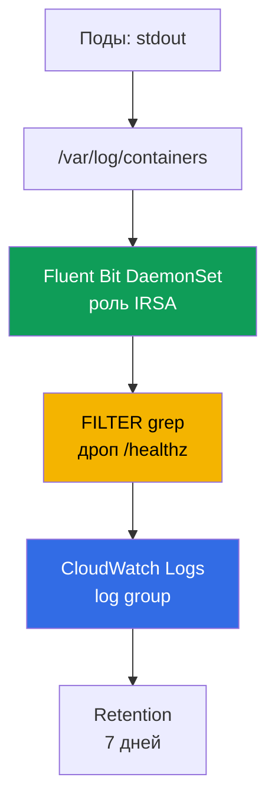
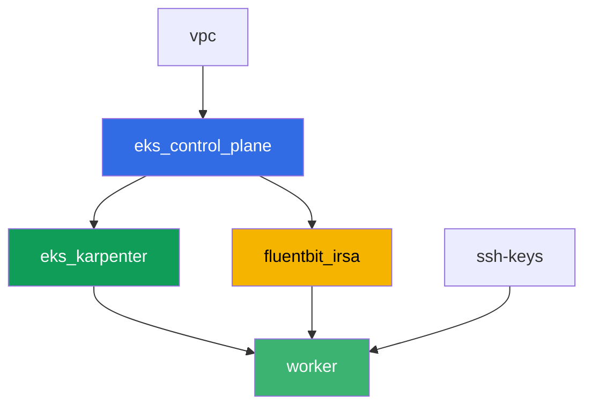

[Eng version](README.MD) · [Versión en español](README_ES.MD) · [Version française](README_FR.MD) · [Deutsche Version](README_DE.MD) · [ქართული ვერსია](README_GE.MD) · [繁體中文版](README_TW.MD) · [日本語版](README_JP.MD)

# Лаба 115 - Логирование: Fluent Bit в CloudWatch Logs, фильтрация и retention

## Описание

Под упал ночью, дежурный открывает `kubectl logs` - и видит `NotFound`: Deployment уже
пересоздал под под новым именем, а логи старого пода исчезли вместе с ним. В этой лабе вы
сначала фиксируете эту потерю как есть - без сборщика логов, а затем закрываете её: ставите
Fluent Bit DaemonSet с правами через IRSA, который льёт логи в CloudWatch Logs непрерывно, и
убеждаетесь, что теперь та же самая ситуация (под удалён, имя другое) не отменяет доступ к
его логам. Дальше вы режете шум фильтром `grep` до отправки, ставите retention policy на
log group и проверяете, что многострочный стектрейс не разваливается на отдельные записи.

Задания в продакшн-стиле: короткая постановка плюс критерии приёмки. Проверка -
автоматическая, командой `check_result`.

## Цель

Закрепить материал главы курса:

- [Глава 34. Логи: Fluent Bit, CloudWatch Logs, OpenSearch, контроль расходов](../../course/34/ru.md)

## Что мы создаём

Terraform заранее создаёт роль IRSA для Fluent Bit с предсказуемым именем. Вы ставите сам
Fluent Bit через Helm, воспроизводите потерю логов без сборщика и с ним, добавляете фильтр
и retention.

| Объект | Что это | Зачем в этой лабе |
|--------|---------|-------------------|
| Namespace `eks-115` | раздел кластера под нагрузку лабы | держим ресурсы отдельно от системных |
| Компонент `fluentbit_irsa` | роль IRSA для Fluent Bit | права на конкретную log group без ролей кластера |
| Deployment `flaky-before` + артефакт | под без сборщика логов | фиксируем потерю логов после пересоздания |
| Release `aws-for-fluent-bit` (Helm) | DaemonSet Fluent Bit с IRSA | конвейер INPUT-FILTER-OUTPUT в CloudWatch Logs |
| Deployment `flaky-after` + артефакт | под с работающим сборщиком | логи находятся в CloudWatch, хотя под уже удалён |
| FILTER `grep` в `values.yaml` | дроп строк с `/healthz` до отправки | шум не долетает до CloudWatch, экономия ingestion |
| Pod `access-log-gen` | генератор тестовых строк | проверяем, что отфильтровано, а что нет |
| Retention `7` дней на log group | `aws logs put-retention-policy` | хранение вместо «вечно» по умолчанию |
| Pod `stacktrace-app` + `multiline.parser` | имитация многострочного стектрейса | одна запись в CloudWatch, а не четыре |

Путь лога от пода до CloudWatch:



## Инфраструктура

Окружение разворачивается в AWS (`eu-central-1`) через Terragrunt. База совпадает с лабой
101 (control plane, Fargate под системные поды, Karpenter под нагрузку), плюс отдельный
компонент под роль IRSA Fluent Bit.

### Модули и зависимости

| Каталог (компонент) | Модуль (`terraform/modules/`) | Зависит от | Что создаёт |
|---------------------|-------------------------------|------------|-------------|
| `vpc` | `vpc_v3` | - | VPC `10.10.0.0/16`, подсети в двух AZ, NAT |
| `ssh-keys` | `ssh-keys` | - | пара SSH-ключей для рабочей машины и нод |
| `eks_control_plane` | `eks_v2_control_plane` | `vpc` | control plane EKS `1.36`, OIDC-провайдер |
| `eks_fargate_system` | `eks_v2_fargate` | `vpc`, `eks_control_plane` | Fargate-профиль для `kube-system` и `karpenter` |
| `eks_addons` | `eks_v2_addons` | `eks_control_plane`, `eks_fargate_system` | coredns, kube-proxy, vpc-cni, pod-identity |
| `eks_karpenter` | `eks_v2_karpenter` | `vpc`, `eks_control_plane`, `eks_addons`, `eks_fargate_system` | контроллер Karpenter, IAM-роль нод |
| `eks_karpenter_default_vng` | `eks_v2_karpenter_vng` | `vpc`, `eks_control_plane`, `eks_karpenter` | дефолтный NodePool `default` на AL2023 |
| `fluentbit_irsa` | `eks_v2_fluentbit_irsa` | `eks_control_plane` | роль IRSA Fluent Bit, скоуп на одну log group |
| `worker` | `eks_v2_work_pc` | `ssh-keys`, `vpc`, `eks_control_plane`, `eks_karpenter`, `fluentbit_irsa` | рабочая машина с kubectl, тестами и `check_result` |

Компонент `fluentbit_irsa` создаёт роль IRSA с trust policy, привязанной ровно к SA
`aws-for-fluent-bit` в namespace `amazon-cloudwatch` (условие `sub` из главы 16), и inline
policy с `logs:CreateLogGroup`/`CreateLogStream`/`PutLogEvents`/`DescribeLogStreams`/
`PutRetentionPolicy` на одну предсказуемую log group `/aws/eks/<cluster>/application`, плюс
`logs:DescribeLogGroups` на `*` (AWS документирует это действие как не поддерживающее скоуп
на один ARN log group). Именно эту роль вы прикрепите к ServiceAccount Fluent Bit при
установке через Helm.

Граф зависимостей (что применяется раньше, то ниже по стрелке):



Компоненты `eks_fargate_system`, `eks_addons` и `eks_karpenter_default_vng` на графе не
показаны ради лимита в 8 узлов, но по факту стоят между `eks_control_plane` и
`eks_karpenter` (см. таблицу выше).

### Права worker для команд `aws logs`

Fluent Bit пишет и управляет retention своей ролью IRSA, но задания 6-7 просят студента
проверять состояние log group непосредственно с рабочей машины (и то же самое делает
`tests.bats`). Роль worker (`eks_v2_work_pc/iam.tf`) получила один аддитивный `Sid`
`CloudWatchLogsReadForLoggingLabs` с правами `logs:DescribeLogGroups`,
`logs:PutRetentionPolicy`, `logs:FilterLogEvents`, `logs:GetLogEvents` на `*` - это
read/describe-операции и установка retention, не деструктивные и не привязанные к
конкретному префиксу лабы, поэтому расширены без сужения по тегам (как `TestRoleManagement*`
для других лаб). Ничего из существующих прав worker не убрано.

### Предсказуемые имена ресурсов

`fluentbit_irsa` собирает имена из `prefix`, поэтому worker находит их без чтения terraform
output. Все они на месте при загрузке в файле `~/lab115_hints.txt`:

| Ресурс | Имя |
|--------|-----|
| Роль IRSA Fluent Bit | `eks-task115-fluentbit-irsa-role` |
| Log group | `/aws/eks/<cluster>/application` |

## Развёртывание

```bash
TASK=115 make run_eks_task
```

Развёртывание занимает примерно 15-20 минут. В выводе найдите строку с SSH-подключением к
рабочей машине и подключитесь к ней. kubectl там уже настроен на нужный кластер.

Полезные команды на рабочей машине:

```bash
time_left       # сколько осталось времени окружения
check_result    # проверить решение
cat ~/lab115_hints.txt   # имя роли IRSA и log group
```

> Безопасность стенда. В `env.hcl` включены `ssh_password_enable = true` и
> `access_cidrs = ["0.0.0.0/0"]` - это удобно для учебного окружения, но так делать в
> продакшене нельзя. По стандартам курса (главы 0.2, 2, 19) доступ к рабочим машинам
> открывают через AWS SSM Session Manager без публичных SSH-портов наружу, а `access_cidrs`
> сужают до конкретных адресов. Здесь публичный SSH оставлен только ради простоты запуска.

## Задания

---
|        **1**        | **Namespace для нагрузки лабы**                             |
| :-----------------: | :---------------------------------------------------------- |
| Что делаем          | Создайте namespace с именем `eks-115`. Все объекты лабы создаются внутри него. |
| Критерии приёмки    | - namespace `eks-115` существует. |
---
|        **2**        | **Симптом: логи исчезают без сборщика**                      |
| :-----------------: | :---------------------------------------------------------- |
| Что делаем          | В `eks-115` создайте Deployment `flaky-before` (образ `busybox:1.36`, `1` реплика), контейнер с командой `sh -c 'echo BEFORE_MARKER_LAB115; sleep 5; exit 1'`. Под уйдёт в `CrashLoopBackOff`, но имя пода остаётся тем же между перезапусками контейнера - убедитесь в этом через `kubectl logs <pod>` и `kubectl logs <pod> --previous`. Затем запишите имя пода в файл строкой `OLD_POD_NAME=<имя>` и выполните `kubectl delete pod <имя>` - Deployment пересоздаст под под новым именем (аналог замены ноды при консолидации Karpenter). Выполните `kubectl logs <старое-имя>` и убедитесь, что теперь это `Error from server (NotFound)`. Сохраните всё в `/var/work/tests/artifacts/2/before_symptom.txt`: строку `OLD_POD_NAME=...`, `BEFORE_MARKER_LAB115` и текст ошибки `NotFound`. |
| Критерии приёмки    | - Deployment `flaky-before` в `eks-115` с `1` готовой репликой;<br/>- файл `2/before_symptom.txt` содержит `OLD_POD_NAME=`, `BEFORE_MARKER_LAB115` и `NotFound`;<br/>- под с именем из `OLD_POD_NAME` сейчас не существует (действительно пересоздан). |
---
|        **3**        | **Fluent Bit DaemonSet с ролью IRSA**                        |
| :-----------------: | :---------------------------------------------------------- |
| Что делаем          | Возьмите `role_arn` и `log_group_name` из `~/lab115_hints.txt`. Добавьте репозиторий `helm repo add eks https://aws.github.io/eks-charts` и установите чарт `aws-for-fluent-bit` релизом с именем `aws-for-fluent-bit` в namespace `amazon-cloudwatch` (`--create-namespace`). В values задайте: аннотацию ServiceAccount `eks.amazonaws.com/role-arn` на `role_arn`; `input.memBufLimit: 50MB` и `input.extraInputs` со строкой `storage.type      filesystem` (защита от OOM при backpressure, раздел 34.7); `service.extraService` с добавленной строкой `storage.path /var/fluent-bit/state/flb-storage/`; `cloudWatchLogs.enabled: true`, `region: eu-central-1`, `logGroupName: <log_group_name>`, `logStreamPrefix: "fluentbit-"`, `autoCreateGroup: true`. Сохраните values в файл `values.yaml` на рабочей машине - он вам понадобится в заданиях 5 и 7. Дождитесь, что DaemonSet готов на всех нодах. |
| Критерии приёмки    | - DaemonSet `aws-for-fluent-bit` в `amazon-cloudwatch`: `numberReady` равно `desiredNumberScheduled` и `>= 1`;<br/>- ServiceAccount `aws-for-fluent-bit` несёт аннотацию `eks.amazonaws.com/role-arn` со значением, содержащим `fluentbit-irsa-role`;<br/>- ConfigMap релиза содержит `Mem_Buf_Limit` и `storage.type`. |
---
|        **4**        | **Починка доказана: логи находятся после удаления пода**    |
| :-----------------: | :---------------------------------------------------------- |
| Что делаем          | В `eks-115` создайте Deployment `flaky-after` (образ `busybox:1.36`, `1` реплика), контейнер с командой `sh -c 'echo AFTER_MARKER_LAB115; sleep 3600'` (без падения). Подождите примерно `60` секунд, чтобы Fluent Bit успел вычитать и отправить строку. Запишите имя пода в артефакт строкой `OLD_POD_NAME=<имя>`, затем выполните `kubectl delete pod <имя>` - под пересоздастся под новым именем. Убедитесь, что `kubectl logs <старое-имя>` теперь `NotFound`. Найдите строку `AFTER_MARKER_LAB115` в CloudWatch Logs: `aws logs filter-log-events --log-group-name <log_group_name> --filter-pattern "AFTER_MARKER_LAB115"`. Сохраните в `/var/work/tests/artifacts/4/after_fixed.txt` строку `OLD_POD_NAME=...`, текст `NotFound` и найденную запись из CloudWatch. |
| Критерии приёмки    | - Deployment `flaky-after` в `eks-115` с `1` готовой репликой;<br/>- файл `4/after_fixed.txt` содержит `OLD_POD_NAME=`, `NotFound` и `AFTER_MARKER_LAB115`;<br/>- `aws logs filter-log-events` по log group с паттерном `AFTER_MARKER_LAB115` находит хотя бы одну запись, хотя исходный под уже удалён. |
---
|        **5**        | **Фильтрация: режем шум до отправки**                        |
| :-----------------: | :---------------------------------------------------------- |
| Что делаем          | В `values.yaml` из задания 3 добавьте `additionalFilters` с секцией `[FILTER]` `Name grep`, `Match kube.*`, `Exclude log /healthz`. Выполните `helm upgrade aws-for-fluent-bit eks/aws-for-fluent-bit -n amazon-cloudwatch -f values.yaml` и дождитесь перезапуска подов Fluent Bit. Только после этого создайте Pod `access-log-gen` (образ `busybox:1.36`) с командой, которая печатает строку со `/healthz` и, через пару секунд, строку с `NORMAL_MARKER_LAB115`, затем спит. Подождите отправки и сохраните в `/var/work/tests/artifacts/5/filter_check.txt` объяснение: что дропнули фильтром `grep` и почему это дешевле, чем чистить логи в CloudWatch постфактум (раздел 34.6). |
| Критерии приёмки    | - файл `5/filter_check.txt` не пуст, содержит `grep` и `healthz`;<br/>- в CloudWatch Logs (log group лабы) нет ни одной записи с `/healthz`;<br/>- в CloudWatch Logs есть хотя бы одна запись с `NORMAL_MARKER_LAB115`. |
---
|        **6**        | **Retention policy на log group**                             |
| :-----------------: | :---------------------------------------------------------- |
| Что делаем          | По умолчанию логи в CloudWatch хранятся вечно. Установите срок хранения `7` дней: `aws logs put-retention-policy --log-group-name <log_group_name> --retention-in-days 7`. Проверьте через `aws logs describe-log-groups --query "logGroups[].[logGroupName,retentionInDays]"`. Сохраните вывод проверки в `/var/work/tests/artifacts/6/retention.txt`. |
| Критерии приёмки    | - `aws logs describe-log-groups` показывает `retentionInDays` равным `7` для log group лабы;<br/>- файл `6/retention.txt` не пуст и содержит `7`. |
---
|        **7**        | **Многострочность: стектрейс - одна запись, а не четыре**    |
| :-----------------: | :---------------------------------------------------------- |
| Что делаем          | В `values.yaml` добавьте FILTER `multiline` со встроенным типом `python` (склеивает Traceback) - он должен идти в конвейере раньше FILTER `kubernetes`, потому что склеенные записи заново эмитятся в начало пайплайна (иначе `python` не запустится вообще, если оставить его частью `input.multilineParser` вместе с `cri`: `cri` матчит любую CRI-строку как первую линию, и `python` до неё не доходит). Выполните `helm upgrade aws-for-fluent-bit eks/aws-for-fluent-bit -n amazon-cloudwatch -f values.yaml` и дождитесь перезапуска подов Fluent Bit. Только после этого создайте Pod `stacktrace-app` (образ `busybox:1.36`), который печатает четыре строки подряд: `Traceback (most recent call last):`, `  File "app.py", line 10, in <module>`, `    raise ValueError('CRASH_TRACE_LAB115')` и `ValueError: CRASH_TRACE_LAB115`, затем спит. Подождите отправки и через `aws logs filter-log-events --filter-pattern "CRASH_TRACE_LAB115"` получите запись. Сохраните в `/var/work/tests/artifacts/7/multiline.txt` найденное сообщение целиком и объяснение, что `multiline.parser` склеил четыре строки в одну запись CloudWatch. |
| Критерии приёмки    | - файл `7/multiline.txt` не пуст, содержит `CRASH_TRACE_LAB115` и слово `multiline` или `Traceback`;<br/>- запись в CloudWatch Logs с `CRASH_TRACE_LAB115` содержит в том же сообщении и строку `Traceback` (то есть все четыре строки склеены в одну запись, а не разбиты на четыре). |
---

## Проверка результата

На рабочей машине запустите автоматическую проверку:

```bash
check_result
```

Скрипт прогонит тесты и покажет процент выполненных заданий.

## Решение

Эталонное решение: [worker/files/solutions/1_RU.MD](worker/files/solutions/1_RU.MD)

## Удаление кластера и ресурсов

Fluent Bit в этой лабе поставлен вручную через Helm в `amazon-cloudwatch`, а не
terraform-ом - под его DaemonSet и под нагрузку из `eks-115` Karpenter поднял EC2-ноду.
Terraform не знает про неё и не удалит - если начать `destroy` раньше, осиротевшая
EC2-нода держит ENI и блокирует удаление VPC/подсетей (тот же паттерн, что в лабах 108,
109, 111, 114). Перед `destroy` снимите нагрузку и дождитесь, что Karpenter сам убрал
EC2-инстанс:

```bash
# 1. Снимаем нагрузку, из-за которой Karpenter поднял EC2-ноду
helm uninstall aws-for-fluent-bit -n amazon-cloudwatch
kubectl delete namespace eks-115 amazon-cloudwatch

# 2. Дожидаемся, пока Karpenter сам уберёт EC2-ноду (не просто удалит объект Node,
#    а завершит сам EC2-инстанс) - должно быть пусто в обоих выводах
for i in $(seq 1 30); do
  nc=$(kubectl get nodeclaims --no-headers 2>/dev/null | wc -l)
  ec2=$(aws ec2 describe-instances \
    --filters "Name=tag:karpenter.sh/nodepool,Values=default" \
      "Name=instance-state-name,Values=running,pending,stopping,stopped" \
    --query 'Reservations[].Instances[]' --output text)
  echo "nodeclaims=$nc ec2_instances=[$ec2]"
  [[ "$nc" == "0" ]] && [[ -z "$ec2" ]] && break
  sleep 10
done
```

Только после того как `nodeclaims=0` и список EC2-инстансов пуст, запускайте удаление
terraform-ресурсов:

```bash
TASK=115 make delete_eks_task
```
