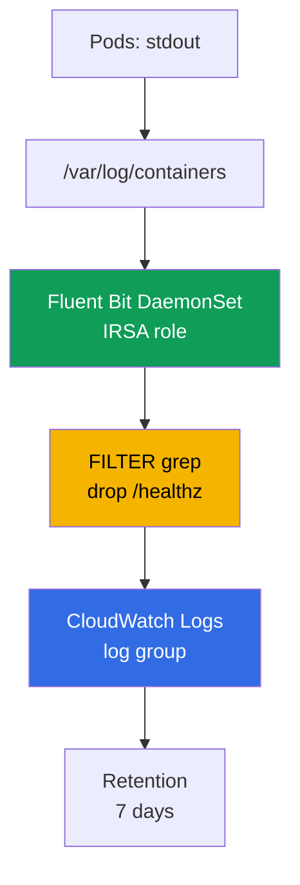
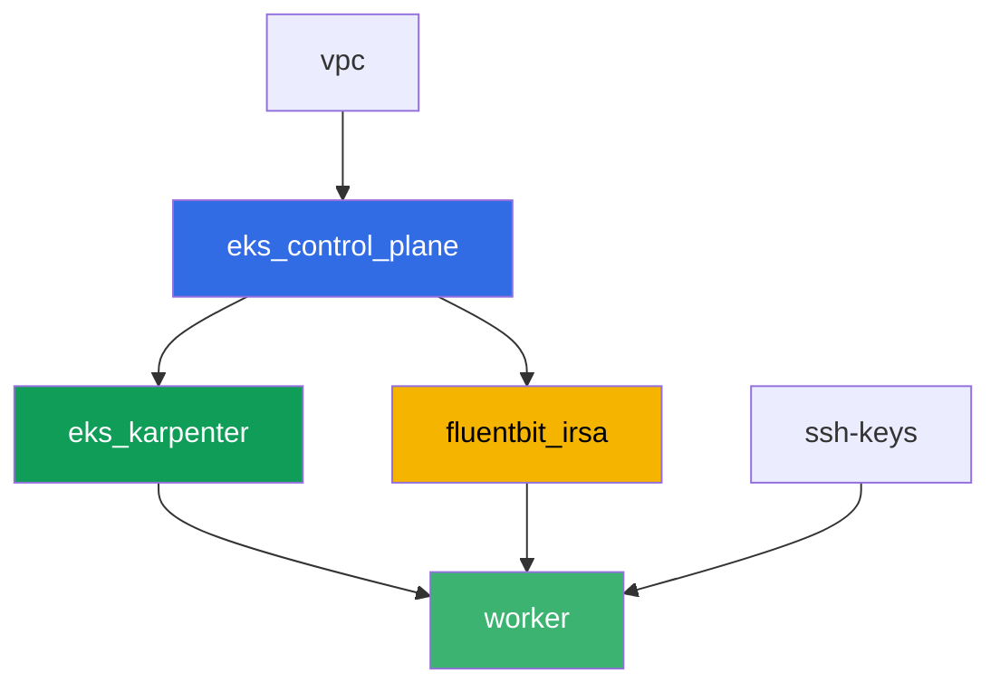

[Русская версия](README_RU.MD) · [Eng version](README.MD) · [Versión en español](README_ES.MD) · [Version française](README_FR.MD) · [Deutsche Version](README_DE.MD) · [ქართული ვერსია](README_GE.MD) · [日本語版](README_JP.MD)

# 實驗 115 - 日誌:Fluent Bit 到 CloudWatch Logs,過濾與保留

## 說明

一個 pod 在夜裡崩潰了,值班工程師打開 `kubectl logs` - 看到的是 `NotFound`:
Deployment 已經用新的名稱重新創建了這個 pod,舊 pod 的日誌也隨之消失。在這個實驗中,
你首先如實記錄下這個損失 - 在沒有日誌收集器的情況下,然後補上這個缺口:你安裝帶有
IRSA 權限的 Fluent Bit DaemonSet,它會持續把日誌串流到 CloudWatch Logs,並確認同樣的
情況(pod 被刪除、名稱不同)不會再導致無法存取它的日誌。接下來你會在寫入之前用
`grep` 過濾器削減噪音,為日誌組設定保留策略,並驗證一個多行的 stack trace 不會被拆散
成多筆獨立的記錄。

任務以生產風格編寫:簡短的任務描述加驗收標準。驗證是自動的,透過 `check_result` 命令
完成。

## 目標

鞏固以下課程章節的內容:

- [第 34 章。日誌:Fluent Bit、CloudWatch Logs、OpenSearch、成本控制](../../course/34/ru.md)

## 我們要創建什麼

Terraform 預先創建了一個名稱可預測的 Fluent Bit IRSA 角色。你透過 Helm 安裝 Fluent
Bit 本身,重現在沒有收集器和有收集器兩種情況下的日誌損失,並添加過濾器與保留策略。

| 對象 | 這是什麼 | 在這個實驗中的作用 |
|--------|---------|-------------------|
| Namespace `eks-115` | 供實驗負載使用的集群區域 | 讓資源與系統對象保持隔離 |
| 組件 `fluentbit_irsa` | Fluent Bit 的 IRSA 角色 | 只針對一個具體的日誌組的權限,而不是集群範圍的角色 |
| Deployment `flaky-before` + 產物 | 沒有日誌收集器的 pod | 記錄 pod 重新創建後的日誌損失 |
| Release `aws-for-fluent-bit`(Helm) | 帶有 IRSA 的 Fluent Bit DaemonSet | 進入 CloudWatch Logs 的 INPUT-FILTER-OUTPUT 管線 |
| Deployment `flaky-after` + 產物 | 帶有正常運作收集器的 pod | 即使 pod 已被刪除,日誌仍能在 CloudWatch 中找到 |
| `values.yaml` 中的 FILTER `grep` | 在寫入之前丟棄帶有 `/healthz` 的行 | 噪音永遠不會到達 CloudWatch,節省寫入成本 |
| Pod `access-log-gen` | 測試用的行生成器 | 驗證哪些被過濾掉了、哪些沒有 |
| 日誌組上 `7` 天的保留策略 | `aws logs put-retention-policy` | 存儲期限,而不是預設的「永久保留」 |
| Pod `stacktrace-app` + `multiline.parser` | 模擬一個多行的 stack trace | CloudWatch 中是一筆記錄,而不是四筆 |

從 pod 到 CloudWatch 的日誌路徑:



## 基礎設施

環境透過 Terragrunt 部署在 AWS(`eu-central-1`)。基礎部分與實驗 101 相同(control
plane、供系統 pod 使用的 Fargate、供工作負載使用的 Karpenter),再加上一個供 Fluent
Bit IRSA 角色使用的獨立組件。

### 模組與依賴關係

| 目錄(組件) | 模組(`terraform/modules/`) | 依賴於 | 創建了什麼 |
|---------------------|-------------------------------|------------|-------------|
| `vpc` | `vpc_v3` | - | VPC `10.10.0.0/16`,兩個 AZ 中的子網,NAT |
| `ssh-keys` | `ssh-keys` | - | 供工作機與節點使用的一對 SSH 金鑰 |
| `eks_control_plane` | `eks_v2_control_plane` | `vpc` | EKS control plane `1.36`、OIDC provider |
| `eks_fargate_system` | `eks_v2_fargate` | `vpc`、`eks_control_plane` | `kube-system` 與 `karpenter` 的 Fargate 配置檔 |
| `eks_addons` | `eks_v2_addons` | `eks_control_plane`、`eks_fargate_system` | coredns、kube-proxy、vpc-cni、pod-identity |
| `eks_karpenter` | `eks_v2_karpenter` | `vpc`、`eks_control_plane`、`eks_addons`、`eks_fargate_system` | Karpenter 控制器、節點 IAM 角色 |
| `eks_karpenter_default_vng` | `eks_v2_karpenter_vng` | `vpc`、`eks_control_plane`、`eks_karpenter` | 基於 AL2023 的預設 NodePool `default` |
| `fluentbit_irsa` | `eks_v2_fluentbit_irsa` | `eks_control_plane` | 限定在一個日誌組範圍內的 Fluent Bit IRSA 角色 |
| `worker` | `eks_v2_work_pc` | `ssh-keys`、`vpc`、`eks_control_plane`、`eks_karpenter`、`fluentbit_irsa` | 帶有 kubectl、測試腳本和 `check_result` 的工作機 |

組件 `fluentbit_irsa` 創建的 IRSA 角色,其 trust policy 精確綁定到 namespace
`amazon-cloudwatch` 中的 SA `aws-for-fluent-bit`(第 16 章中的 `sub` 條件),並帶有一
個 inline policy,在一個可預測的日誌組 `/aws/eks/<cluster>/application` 上授予
`logs:CreateLogGroup`/`CreateLogStream`/`PutLogEvents`/`DescribeLogStreams`/
`PutRetentionPolicy`,以及在 `*` 上的 `logs:DescribeLogGroups`(AWS 文件說明這個
action 不支援限定到單一日誌組的 ARN)。在 Helm 安裝過程中,你正是會把這個角色附加到
Fluent Bit 的 ServiceAccount 上。

依賴關係圖(較早套用的組件位於箭頭下方):



組件 `eks_fargate_system`、`eks_addons` 和 `eks_karpenter_default_vng` 沒有出現在這張
圖上,以便保持在 8 個節點的限制之內,但它們實際上位於 `eks_control_plane` 和
`eks_karpenter` 之間(見上表)。

### 工作機對 `aws logs` 命令的權限

Fluent Bit 透過自己的 IRSA 角色寫入日誌和管理保留策略,但任務 6-7 要求學員直接從工作
機檢查日誌組的狀態(`tests.bats` 也是這麼做的)。工作機角色
(`eks_v2_work_pc/iam.tf`)增加了一個 additive 的 `Sid`
`CloudWatchLogsReadForLoggingLabs`,包含在 `*` 上的
`logs:DescribeLogGroups`、`logs:PutRetentionPolicy`、`logs:FilterLogEvents`、
`logs:GetLogEvents` - 這些是讀取/查看操作加上設定保留策略,不具破壞性,也沒有綁定到
某個具體的實驗前綴,所以沒有像其他實驗那樣(例如 `TestRoleManagement*`)進行範圍縮
小。工作機原有的權限沒有被移除任何一項。

### 可預測的資源名稱

`fluentbit_irsa` 根據 `prefix` 構建名稱,因此工作機不需要讀取 terraform output 就能
找到它們。登入後,所有這些名稱都能在檔案 `~/lab115_hints.txt` 中找到:

| 資源 | 名稱 |
|--------|-----|
| Fluent Bit IRSA 角色 | `eks-task115-fluentbit-irsa-role` |
| 日誌組 | `/aws/eks/<cluster>/application` |

## 部署

```bash
TASK=115 make run_eks_task
```

部署大約需要 15-20 分鐘。在輸出中找到連接工作機的 SSH 那一行並連接上去。kubectl 在那
裡已經配置好正確的集群。

工作機上的常用命令:

```bash
time_left       # 環境剩餘的時間
check_result    # 檢查解答
cat ~/lab115_hints.txt   # IRSA 角色名稱和日誌組
```

> 測試環境的安全性。`env.hcl` 中啟用了 `ssh_password_enable = true` 和
> `access_cidrs = ["0.0.0.0/0"]` - 這對於學習環境很方便,但在生產環境中不應該這樣做。
> 依照課程標準(第 0.2、2、19 章),對工作機的存取應透過 AWS SSM Session Manager 進行,
> 不對外暴露公開的 SSH 端口,並將 `access_cidrs` 限制到具體的位址。這裡保留公開 SSH 只
> 是為了簡化啟動流程。

## 任務

---
|        **1**        | **供實驗負載使用的 Namespace**                             |
| :-----------------: | :---------------------------------------------------------- |
| 我們要做什麼          | 創建一個名為 `eks-115` 的 namespace。這個實驗中的所有對象都在其中創建。 |
| 驗收標準    | - namespace `eks-115` 存在。 |
---
|        **2**        | **症狀:沒有收集器時日誌會消失**                      |
| :-----------------: | :---------------------------------------------------------- |
| 我們要做什麼          | 在 `eks-115` 中創建 Deployment `flaky-before`(映像 `busybox:1.36`,`1` 個副本),容器執行命令 `sh -c 'echo BEFORE_MARKER_LAB115; sleep 5; exit 1'`。這個 pod 會進入 `CrashLoopBackOff`,但 pod 名稱在容器重啟過程中保持不變 - 透過 `kubectl logs <pod>` 和 `kubectl logs <pod> --previous` 確認這一點。然後把 pod 名稱以 `OLD_POD_NAME=<name>` 的格式寫入檔案,並執行 `kubectl delete pod <name>` - Deployment 會用新的名稱重新創建這個 pod(類似於 Karpenter consolidation 過程中的節點替換)。執行 `kubectl logs <old-name>` 並確認現在得到的是 `Error from server (NotFound)`。將 `OLD_POD_NAME=...` 這一行、`BEFORE_MARKER_LAB115` 以及錯誤文字 `NotFound` 都保存到 `/var/work/tests/artifacts/2/before_symptom.txt`。 |
| 驗收標準    | - `eks-115` 中的 Deployment `flaky-before` 有 `1` 個就緒副本;<br/>- 檔案 `2/before_symptom.txt` 包含 `OLD_POD_NAME=`、`BEFORE_MARKER_LAB115` 和 `NotFound`;<br/>- `OLD_POD_NAME` 中記錄的 pod 目前確實不存在(即已被重新創建)。 |
---
|        **3**        | **帶有 IRSA 角色的 Fluent Bit DaemonSet**                        |
| :-----------------: | :---------------------------------------------------------- |
| 我們要做什麼          | 從 `~/lab115_hints.txt` 取得 `role_arn` 和 `log_group_name`。添加倉庫 `helm repo add eks https://aws.github.io/eks-charts`,並在 namespace `amazon-cloudwatch` 中把 chart `aws-for-fluent-bit` 安裝為名為 `aws-for-fluent-bit` 的 release(`--create-namespace`)。在 values 中設定:ServiceAccount 的 annotation `eks.amazonaws.com/role-arn` 設為 `role_arn`;`input.memBufLimit: 50MB` 以及帶有一行 `storage.type      filesystem` 的 `input.extraInputs`(在反壓下的 OOM 防護,第 34.7 節);帶有新增一行 `storage.path /var/fluent-bit/state/flb-storage/` 的 `service.extraService`;`cloudWatchLogs.enabled: true`、`region: eu-central-1`、`logGroupName: <log_group_name>`、`logStreamPrefix: "fluentbit-"`、`autoCreateGroup: true`。把 values 保存到工作機上的檔案 `values.yaml` - 任務 5 和 7 會用到它。等待 DaemonSet 在所有節點上就緒。 |
| 驗收標準    | - `amazon-cloudwatch` 中的 DaemonSet `aws-for-fluent-bit`:`numberReady` 等於 `desiredNumberScheduled` 且 `>= 1`;<br/>- ServiceAccount `aws-for-fluent-bit` 帶有 annotation `eks.amazonaws.com/role-arn`,其值包含 `fluentbit-irsa-role`;<br/>- 這個 release 的 ConfigMap 包含 `Mem_Buf_Limit` 和 `storage.type`。 |
---
|        **4**        | **修復得到驗證:pod 刪除後仍能找到日誌**    |
| :-----------------: | :---------------------------------------------------------- |
| 我們要做什麼          | 在 `eks-115` 中創建 Deployment `flaky-after`(映像 `busybox:1.36`,`1` 個副本),容器執行命令 `sh -c 'echo AFTER_MARKER_LAB115; sleep 3600'`(不會崩潰)。等待大約 `60` 秒,讓 Fluent Bit 有時間讀取並發送這一行。把 pod 名稱以 `OLD_POD_NAME=<name>` 的格式寫入產物,然後執行 `kubectl delete pod <name>` - 這個 pod 會用新的名稱重新創建。確認現在 `kubectl logs <old-name>` 得到的是 `NotFound`。在 CloudWatch Logs 中找到 `AFTER_MARKER_LAB115` 這一行:`aws logs filter-log-events --log-group-name <log_group_name> --filter-pattern "AFTER_MARKER_LAB115"`。把 `OLD_POD_NAME=...` 這一行、文字 `NotFound` 以及在 CloudWatch 中找到的記錄保存到 `/var/work/tests/artifacts/4/after_fixed.txt`。 |
| 驗收標準    | - `eks-115` 中的 Deployment `flaky-after` 有 `1` 個就緒副本;<br/>- 檔案 `4/after_fixed.txt` 包含 `OLD_POD_NAME=`、`NotFound` 和 `AFTER_MARKER_LAB115`;<br/>- 針對日誌組執行的 `aws logs filter-log-events`,以 `AFTER_MARKER_LAB115` 為模式,能找到至少一筆記錄,即使原本的 pod 已經被刪除。 |
---
|        **5**        | **過濾:在發送之前削減噪音**                        |
| :-----------------: | :---------------------------------------------------------- |
| 我們要做什麼          | 在任務 3 的 `values.yaml` 中,添加帶有 `[FILTER]` 區段的 `additionalFilters`:`Name grep`、`Match kube.*`、`Exclude log /healthz`。執行 `helm upgrade aws-for-fluent-bit eks/aws-for-fluent-bit -n amazon-cloudwatch -f values.yaml`,並等待 Fluent Bit 的 pod 重啟。只有在那之後,才創建 Pod `access-log-gen`(映像 `busybox:1.36`),它先印出一行帶有 `/healthz` 的內容,幾秒鐘後再印出一行帶有 `NORMAL_MARKER_LAB115` 的內容,然後進入休眠。等待發送完成,並把說明保存到 `/var/work/tests/artifacts/5/filter_check.txt`:哪些內容被 `grep` 過濾器丟棄了,以及為什麼這比事後在 CloudWatch 中清理日誌更划算(第 34.6 節)。 |
| 驗收標準    | - 檔案 `5/filter_check.txt` 不為空,包含 `grep` 和 `healthz`;<br/>- CloudWatch Logs(這個實驗的日誌組)中沒有任何一筆帶有 `/healthz` 的記錄;<br/>- CloudWatch Logs 中至少有一筆帶有 `NORMAL_MARKER_LAB115` 的記錄。 |
---
|        **6**        | **日誌組上的保留策略**                             |
| :-----------------: | :---------------------------------------------------------- |
| 我們要做什麼          | 預設情況下,CloudWatch 中的日誌會永久保留。設定 `7` 天的保留期限:`aws logs put-retention-policy --log-group-name <log_group_name> --retention-in-days 7`。透過 `aws logs describe-log-groups --query "logGroups[].[logGroupName,retentionInDays]"` 驗證。把驗證結果的輸出保存到 `/var/work/tests/artifacts/6/retention.txt`。 |
| 驗收標準    | - `aws logs describe-log-groups` 顯示這個實驗的日誌組的 `retentionInDays` 等於 `7`;<br/>- 檔案 `6/retention.txt` 不為空且包含 `7`。 |
---
|        **7**        | **多行:一筆 stack trace 記錄,而不是四筆**    |
| :-----------------: | :---------------------------------------------------------- |
| 我們要做什麼          | 在 `values.yaml` 中,添加一個帶有內建 `python` 類型的 `multiline` FILTER(它會合併一個 Traceback) - 它必須在管線中運行在 `kubernetes` FILTER 之前,因為合併後的記錄會在管線起始處重新發送(否則如果把 `python` 留在 `input.multilineParser` 中和 `cri` 放在一起,`python` 根本不會運行:`cri` 會把任何一行 CRI 都當成起始行匹配,`python` 永遠沒有機會)。執行 `helm upgrade aws-for-fluent-bit eks/aws-for-fluent-bit -n amazon-cloudwatch -f values.yaml`,並等待 Fluent Bit 的 pod 重啟。只有在那之後,才創建 Pod `stacktrace-app`(映像 `busybox:1.36`),它連續印出四行:`Traceback (most recent call last):`、`  File "app.py", line 10, in <module>`、`    raise ValueError('CRASH_TRACE_LAB115')` 和 `ValueError: CRASH_TRACE_LAB115`,然後進入休眠。等待發送完成,並透過 `aws logs filter-log-events --filter-pattern "CRASH_TRACE_LAB115"` 取得這筆記錄。把找到的完整訊息以及 `multiline.parser` 把這四行合併成一筆 CloudWatch 記錄的說明保存到 `/var/work/tests/artifacts/7/multiline.txt`。 |
| 驗收標準    | - 檔案 `7/multiline.txt` 不為空,包含 `CRASH_TRACE_LAB115` 以及 `multiline` 或 `Traceback` 這個字;<br/>- 帶有 `CRASH_TRACE_LAB115` 的 CloudWatch Logs 記錄,在同一筆訊息中也包含 `Traceback` 這一行(意味著這四行都被合併成了一筆記錄,而不是拆成四筆)。 |
---

## 檢查結果

在工作機上執行自動檢查:

```bash
check_result
```

腳本會執行測試並顯示已完成任務的百分比。

## 解決方案

參考解決方案:[worker/files/solutions/1_TW.MD](worker/files/solutions/1_TW.MD)

## 刪除集群與資源

這個實驗中的 Fluent Bit 是透過 Helm 手動安裝在 `amazon-cloudwatch` 中的,而不是透過
terraform - 它的 DaemonSet 以及 `eks-115` 中的工作負載導致 Karpenter 啟動了一個 EC2
節點。Terraform 不知道它的存在,也不會刪除它 - 如果過早開始 `destroy`,孤立的 EC2 節
點會佔用 ENI 並阻擋 VPC/子網的刪除(與實驗 108、109、111、114 中相同的模式)。在
`destroy` 之前,先移除工作負載,並等待 Karpenter 自行移除這個 EC2 instance:

```bash
# 1. 移除導致 Karpenter 啟動 EC2 節點的工作負載
helm uninstall aws-for-fluent-bit -n amazon-cloudwatch
kubectl delete namespace eks-115 amazon-cloudwatch

# 2. 等待 Karpenter 自行移除 EC2 節點(不只是刪除 Node 對象,而是實際終止 EC2
#    instance) - 下面兩個輸出都應該為空
for i in $(seq 1 30); do
  nc=$(kubectl get nodeclaims --no-headers 2>/dev/null | wc -l)
  ec2=$(aws ec2 describe-instances \
    --filters "Name=tag:karpenter.sh/nodepool,Values=default" \
      "Name=instance-state-name,Values=running,pending,stopping,stopped" \
    --query 'Reservations[].Instances[]' --output text)
  echo "nodeclaims=$nc ec2_instances=[$ec2]"
  [[ "$nc" == "0" ]] && [[ -z "$ec2" ]] && break
  sleep 10
done
```

只有在 `nodeclaims=0` 並且 EC2 instance 列表為空之後,才能執行 terraform 資源的刪
除:

```bash
TASK=115 make delete_eks_task
```
