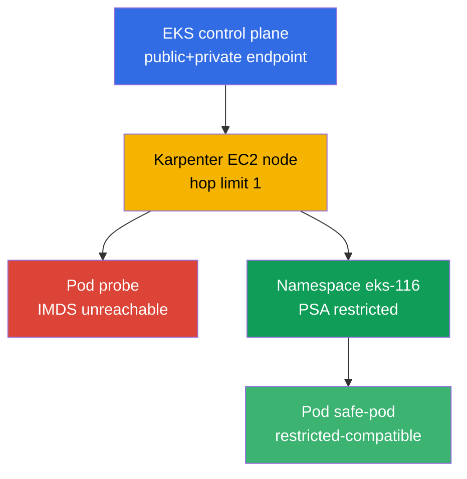
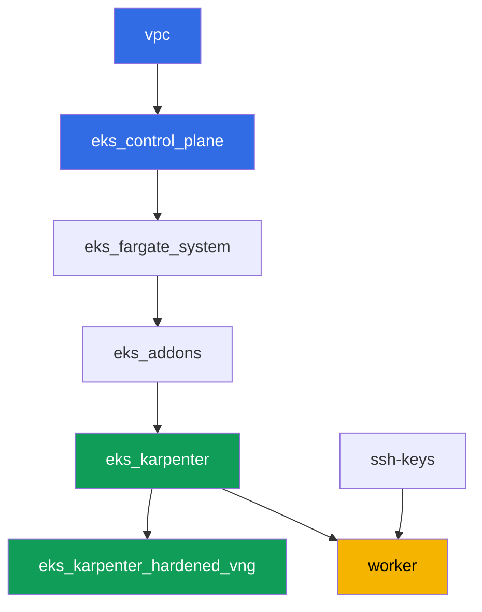

[Русская версия](README_RU.MD) · [Versión en español](README_ES.MD) · [Version française](README_FR.MD) · [Deutsche Version](README_DE.MD) · [ქართული ვერსია](README_GE.MD) · [繁體中文版](README_TW.MD) · [日本語版](README_JP.MD)

# Lab 116 - Hardening: IMDSv2 and hop limit, Pod Security Admission, private endpoint

## Description

A default cluster is more open than it looks. A pod on a regular EC2 node can almost
always reach the Instance Metadata Service and grab the node role's temporary
credentials, even if the application has its own role via IRSA. A namespace without
labels lets Pod Security Admission through a privileged pod without a single warning.
In this lab you close both paths: configure a Karpenter NodePool with hop limit 1,
observe the symptom (an IMDS request from the pod timing out) and explain it via the
AWS API, then enable Pod Security Admission on the namespace and check both the
rejection and the allowed path. A separate task confirms private access to the control
plane and works out which VPC endpoints are needed for a fully private cluster.

Tasks are written in a production style: a short statement plus acceptance criteria.
Verification is automated, via the `check_result` command.

## Goal

Reinforce the course chapter:

- [Chapter 19. Hardening: IMDSv2, PSA, private cluster](../../course/19/en.md) - layers
  of protection for the node, the pod and the network

## What we create

| Object | What it is | Why it's in this lab |
|--------|---------|-------------------|
| Namespace `eks-116` | the cluster section for the lab's workload | keeps resources separate, then we attach PSA |
| NodePool `hardened` | EC2NodeClass with `metadataOptions` | hop limit `1` and `httpTokens=required` on all nodes |
| Deployment `probe` (curlimages/curl) | a pod for checking IMDS | the "from the pod" symptom - the IMDS request times out |
| Artifact `imds.txt` | output of the IMDS request from the pod | records the timeout (hop limit blocked the path) |
| Artifact `metadata_options.txt` | output of `aws ec2 describe-instances` | confirms `HttpTokens=required`, hop limit `1` on the node |
| PSA labels on `eks-116` | `enforce=restricted` | enables Pod Security Standards on the namespace |
| Pod `priv-test` (rejected) + artifact `psa_reject.txt` | an attempt at a privileged pod | admission rejects it, with a rejection message |
| Pod `safe-pod` | a pod with a full restricted `securityContext` | shows the allowed path under the same PSA |
| Artifact `private_endpoint.txt` | `aws eks describe-cluster` + explanation | private control plane access and the needed VPC endpoints |

The overall picture:



## Infrastructure

The environment is deployed in AWS (`eu-central-1`) via Terragrunt. Each lab directory
is a single component with its own `terragrunt.hcl`, which references the shared module
in `terraform/modules/` and declares dependencies via `dependency` blocks. Terragrunt
builds the dependency graph and applies the components in the right order.

### Modules and dependencies

| Directory (component) | Module (`terraform/modules/`) | Depends on | What it creates |
|---------------------|-------------------------------|------------|-------------|
| `vpc` | `vpc_v3` | - | VPC `10.10.0.0/16`, public and private subnets in two AZs, NAT |
| `ssh-keys` | `ssh-keys` | - | an SSH key pair for the worker machine and the nodes |
| `eks_control_plane` | `eks_v2_control_plane` | `vpc` | EKS control plane `1.36` with public and private endpoint |
| `eks_fargate_system` | `eks_v2_fargate` | `vpc`, `eks_control_plane` | Fargate profile for `kube-system` and `karpenter` |
| `eks_addons` | `eks_v2_addons` | `eks_control_plane`, `eks_fargate_system` | coredns, kube-proxy, vpc-cni, pod-identity add-ons |
| `eks_karpenter` | `eks_v2_karpenter` | `vpc`, `eks_control_plane`, `eks_addons`, `eks_fargate_system` | the Karpenter controller, node IAM role |
| `eks_karpenter_hardened_vng` | `eks_v2_karpenter_vng` | `vpc`, `eks_control_plane`, `eks_karpenter` | NodePool `hardened` with `metadataOptions` (hop limit `1`) |
| `worker` | `eks_v2_work_pc` | `ssh-keys`, `vpc`, `eks_control_plane`, `eks_karpenter`, `eks_karpenter_hardened_vng` | the worker machine with kubectl, tests and `check_result` |

Dependency graph (what applies earlier is lower along the arrow):



In this lab there is a single NodePool - `hardened`, with no taint: all workload pods
land on it without tolerations. The difference from lab 101's default NodePool is the
`metadataOptions` block in `vng`, which the EC2NodeClass passes to the Karpenter node's
launch template:

```hcl
vng = {
  labels = { work_type = "hardened" }
  name     = "hardened"
  iam_role = dependency.eks_karpenter.outputs.karpenter_module.node_iam_role_name
  tags     = merge(local.vars.locals.tags, { "Name" = "${local.vars.locals.prefix}-eks-hardened" })
  metadataOptions = {
    httpEndpoint            = "enabled"
    httpProtocolIPv6        = "disabled"
    httpPutResponseHopLimit = 1
    httpTokens              = "required"
  }
}
```

### Where things are configured

`env.hcl` (shared environment parameters, read by all components):

| Parameter | Value in this lab | What it affects |
|----------|-----------------|---------------|
| `region` | `eu-central-1` | region for all resources |
| `vpc_default_cidr`, `subnets` | `10.10.0.0/16`, subnets per AZ | VPC addressing plan and subnet tags |
| `prefix` | `eks-task116` | prefix for resource names and tags |
| `stack_name` | `eks116` | used to build `env_name` - the cluster name |
| `k8_version` | `1.36.0` | kubectl version on the worker machine |
| `instance_type_worker` | `t3.medium` | worker machine instance type |
| `ssh_password_enable`, `access_cidrs` | `true`, `0.0.0.0/0` | SSH access to the worker machine |
| `root_volume` | `gp3`, `10` | worker machine root disk |

`inputs` in each component's `terragrunt.hcl` (settings for the specific module):

| File | Key settings |
|------|--------------------|
| `eks_control_plane/terragrunt.hcl` | `eks.version = "1.36"`; `endpoint_private_access` and `endpoint_public_access` enabled in the module |
| `eks_karpenter_hardened_vng/terragrunt.hcl` | `vng.metadataOptions`: `httpTokens=required`, `httpPutResponseHopLimit=1`, no taint |
| `worker/terragrunt.hcl` | `test_url` and `task_script_url` pointing to lab 116's files, `exam_time_minutes` |

## Deployment

```bash
TASK=116 make run_eks_task
```

Deployment takes roughly 15-20 minutes. In the output, find the line with the SSH
connection to the worker machine and connect to it. kubectl there is already configured
for the right cluster.

Useful commands on the worker machine:

```bash
time_left       # how much environment time is left
check_result    # check the solution
```

> Sandbox security. `env.hcl` enables `ssh_password_enable = true` and
> `access_cidrs = ["0.0.0.0/0"]` - convenient for a training environment, but this is
> not something to do in production. Per the course standards (chapters 0.2, 2, 19),
> access to worker machines is opened via AWS SSM Session Manager without public SSH
> ports facing outward, and `access_cidrs` is narrowed to specific addresses. Here,
> public SSH is left in place only for simplicity of launching.

## Tasks

---
|        **1**        | **Namespace for the lab's workload**                             |
| :-----------------: | :---------------------------------------------------------- |
| What to do          | Create a namespace named `eks-116`. All lab objects are created inside it. |
| Acceptance criteria    | - namespace `eks-116` exists. |
---
|        **2**        | **Symptom: IMDS is unreachable from the pod**                        |
| :-----------------: | :---------------------------------------------------------- |
| What to do          | In `eks-116` create a Deployment `probe`, image `curlimages/curl:latest`, `1` replica, a container with a sleeping `command` (e.g. `sleep 3600`) so you can `kubectl exec` into it. From the pod, run an IMDSv2 request: first `PUT` for a token (`http://169.254.169.254/latest/api/token`, header `X-aws-ec2-metadata-token-ttl-seconds: 21600`), then `GET` with the token against `.../meta-data/iam/security-credentials/`. Limit the request by time (`--max-time 5`) - the `hardened` NodePool keeps `httpPutResponseHopLimit=1`, so the request from the pod should time out. Save the output (including the fact of the timeout) to file `/var/work/tests/artifacts/2/imds.txt`. |
| Acceptance criteria    | - Deployment `probe` in `eks-116`, image `curlimages/curl`, `1` ready replica;<br/>- file `2/imds.txt` is not empty and mentions a timeout (`timeout`/`timed out`). |
---
|        **3**        | **Verification via the AWS API: hop limit and IMDSv2 on the node**       |
| :-----------------: | :---------------------------------------------------------- |
| What to do          | Determine the node of the `probe` pod (`kubectl get po ... -o jsonpath='{.items[0].spec.nodeName}'`), take its `providerID` (`kubectl get node <node> -o jsonpath='{.spec.providerID}'`) and extract the instance id (the last segment, of the form `i-...`). Run `aws ec2 describe-instances --instance-ids <id> --query 'Reservations[].Instances[].MetadataOptions' --output json` and save the output to `/var/work/tests/artifacts/3/metadata_options.txt`. Confirm in the output `HttpTokens: required` and `HttpPutResponseHopLimit: 1`. |
| Acceptance criteria    | - file `3/metadata_options.txt` is not empty;<br/>- contains `HttpPutResponseHopLimit` with value `1` and `HttpTokens` with value `required`. |
---
|        **4**        | **Pod Security Admission: rejecting a privileged pod**    |
| :-----------------: | :---------------------------------------------------------- |
| What to do          | Attach labels `pod-security.kubernetes.io/enforce=restricted` and `pod-security.kubernetes.io/enforce-version=latest` to the `eks-116` namespace. Try to create a Pod `priv-test` (image `busybox`) with `securityContext.privileged: true`. Admission should reject the pod creation (the pod does not appear in the cluster). Save the rejection message to file `/var/work/tests/artifacts/4/psa_reject.txt`. |
| Acceptance criteria    | - namespace `eks-116` has the label `enforce=restricted`;<br/>- pod `priv-test` is not created;<br/>- file `4/psa_reject.txt` is not empty and mentions `privileged` and `restricted`/`violat`. |
---
|        **5**        | **The allowed path: a pod compatible with restricted**          |
| :-----------------: | :---------------------------------------------------------- |
| What to do          | In `eks-116` create a Pod `safe-pod` that complies with the `restricted` profile: `securityContext.runAsNonRoot: true`, `runAsUser` set to any non-zero UID (the `busybox` image runs as root by default, and without an explicit `runAsUser` kubelet will refuse to start the container even after admission), `seccompProfile.type: RuntimeDefault` at the pod level, and at the container level `allowPrivilegeEscalation: false` and `capabilities.drop: ["ALL"]`. The pod should pass admission and reach `Running`. |
| Acceptance criteria    | - Pod `safe-pod` in `eks-116` in state `Running`;<br/>- `spec.securityContext.runAsNonRoot` equals `true`. |
---
|        **6**        | **Private control plane access and VPC endpoints**           |
| :-----------------: | :---------------------------------------------------------- |
| What to do          | Run `aws eks describe-cluster --name <cluster> --query 'cluster.resourcesVpcConfig' --output json` and confirm that `endpointPrivateAccess: true`. Save the output to file `/var/work/tests/artifacts/6/private_endpoint.txt`. Add an explanation to the file (3-4 sentences) of which VPC endpoints would be needed for a fully private cluster with no internet access (`ecr.api`, `ecr.dkr`, `s3`, `sts`, `ec2`, `logs`, `eks`) and why the S3 endpoint is required even with ECR endpoints in place (image layers live in S3). |
| Acceptance criteria    | - file `6/private_endpoint.txt` is not empty;<br/>- contains `true` (the value of `endpointPrivateAccess`) and mentions `s3` and `ecr`. |
---

## Checking the result

On the worker machine, run the automated check:

```bash
check_result
```

The script runs the tests and shows the percentage of completed tasks.

## Solution

Reference solution: [worker/files/solutions/1.MD](worker/files/solutions/1.MD)

## Deleting the cluster and resources

The workload from tasks 2-5 (`probe`, `priv-test`, `safe-pod`) in namespace `eks-116`
made Karpenter bring up the `hardened` EC2 node. Terraform doesn't know about it - if you
start `destroy` too early, the orphaned EC2 node holds an ENI and blocks the deletion of
the VPC/subnets (the same pattern as in labs 108, 109, 111, 114, 115). Before `destroy`,
remove the workload and wait until Karpenter itself removes the EC2 instance:

```bash
# 1. Remove the workload that made Karpenter bring up the EC2 node
kubectl delete namespace eks-116

# 2. Wait until Karpenter itself removes the EC2 node (not just deletes the Node
#    object, but terminates the actual EC2 instance) - both outputs should be empty
for i in $(seq 1 30); do
  nc=$(kubectl get nodeclaims --no-headers 2>/dev/null | wc -l)
  ec2=$(aws ec2 describe-instances \
    --filters "Name=tag:karpenter.sh/nodepool,Values=hardened" \
      "Name=instance-state-name,Values=running,pending,stopping,stopped" \
    --query 'Reservations[].Instances[]' --output text)
  echo "nodeclaims=$nc ec2_instances=[$ec2]"
  [[ "$nc" == "0" ]] && [[ -z "$ec2" ]] && break
  sleep 10
done
```

Only after `nodeclaims=0` and the list of EC2 instances is empty, start deleting the
terraform resources:

```bash
TASK=116 make delete_eks_task
```
