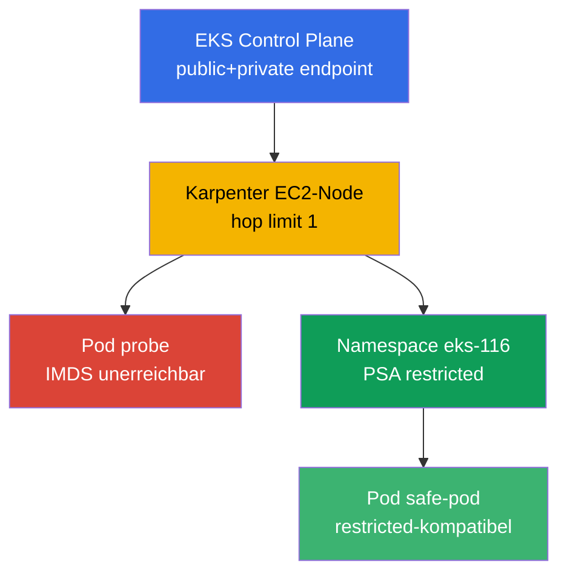
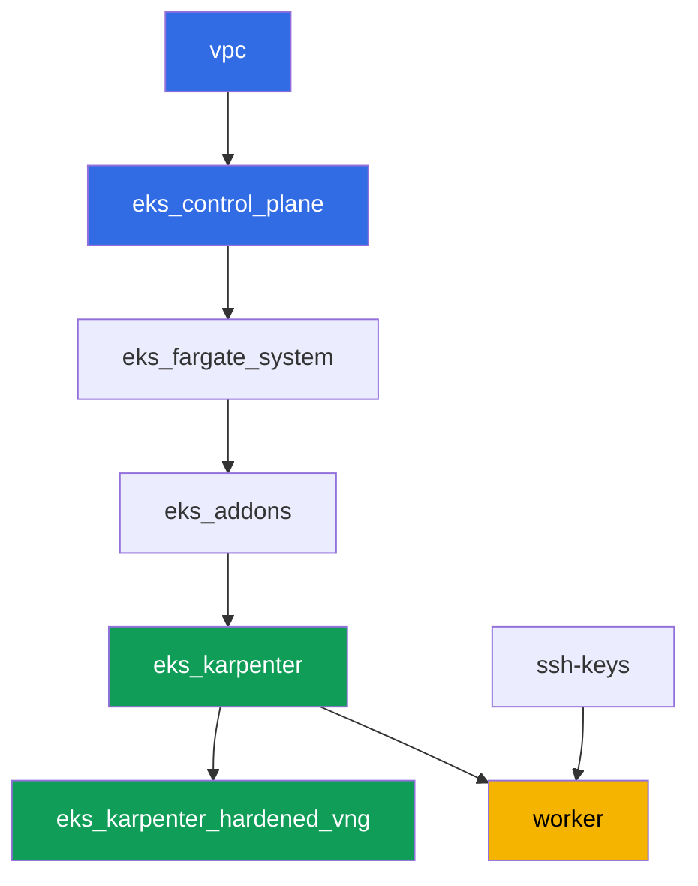

[Русская версия](README_RU.MD) · [Eng version](README.MD) · [Versión en español](README_ES.MD) · [Version française](README_FR.MD) · [ქართული ვერსია](README_GE.MD) · [繁體中文版](README_TW.MD) · [日本語版](README_JP.MD)

# Lab 116 - Hardening: IMDSv2 und hop limit, Pod Security Admission, privater Endpoint

## Beschreibung

Ein Standard-Cluster ist offener, als es aussieht. Ein Pod auf einem gewöhnlichen
EC2-Node kommt fast immer an den Instance Metadata Service heran und kann sich die
temporären Credentials der Node-Rolle holen, selbst wenn die Anwendung über IRSA eine
eigene Rolle hat. Ein Namespace ohne Labels lässt Pod Security Admission einen
privilegierten Pod ohne jede Warnung durch. In dieser Lab schließt ihr beide Wege: ihr
konfiguriert einen Karpenter NodePool mit hop limit 1, beobachtet das Symptom (eine
IMDS-Anfrage aus dem Pod, die ein Timeout erreicht) und erklärt es über die AWS API,
aktiviert dann Pod Security Admission auf dem Namespace und prüft sowohl die Ablehnung
als auch den erlaubten Weg. Eine separate Aufgabe bestätigt den privaten Zugriff auf die
Control Plane und klärt, welche VPC-Endpoints für einen vollständig privaten Cluster
nötig sind.

Die Aufgaben sind im Produktionsstil geschrieben: eine kurze Aufgabenstellung plus
Abnahmekriterien. Die Prüfung ist automatisiert, über den Befehl `check_result`.

## Ziel

Den Kursabschnitt vertiefen:

- [Kapitel 19. Hardening: IMDSv2, PSA, privater Cluster](../../course/19/de.md) -
  Schutzschichten für Node, Pod und Netzwerk

## Was wir erstellen

| Objekt | Was es ist | Warum es in dieser Lab vorkommt |
|--------|---------|-------------------|
| Namespace `eks-116` | der Cluster-Bereich für die Last dieser Lab | hält Ressourcen getrennt, dann hängen wir PSA daran |
| NodePool `hardened` | EC2NodeClass mit `metadataOptions` | hop limit `1` und `httpTokens=required` auf allen Nodes |
| Deployment `probe` (curlimages/curl) | ein Pod zur IMDS-Prüfung | das Symptom „vom Pod aus" - die IMDS-Anfrage erreicht ein Timeout |
| Artefakt `imds.txt` | Ausgabe der IMDS-Anfrage aus dem Pod | hält das Timeout fest (hop limit hat den Weg blockiert) |
| Artefakt `metadata_options.txt` | Ausgabe von `aws ec2 describe-instances` | bestätigt `HttpTokens=required`, hop limit `1` auf dem Node |
| PSA-Labels an `eks-116` | `enforce=restricted` | aktiviert die Pod Security Standards auf dem Namespace |
| Pod `priv-test` (abgelehnt) + Artefakt `psa_reject.txt` | ein Versuch mit einem privilegierten Pod | admission lehnt ihn ab, mit Ablehnungsmeldung |
| Pod `safe-pod` | ein Pod mit vollständigem restricted `securityContext` | zeigt den erlaubten Weg unter demselben PSA |
| Artefakt `private_endpoint.txt` | `aws eks describe-cluster` + Erklärung | privater Zugriff auf die Control Plane und die benötigten VPC-Endpoints |

Das Gesamtbild:



## Infrastruktur

Die Umgebung wird auf AWS (`eu-central-1`) via Terragrunt bereitgestellt. Jedes
Lab-Verzeichnis ist eine Komponente mit eigenem `terragrunt.hcl`, das auf das gemeinsame
Modul in `terraform/modules/` verweist und Abhängigkeiten über `dependency`-Blöcke
deklariert. Terragrunt baut den Abhängigkeitsgraphen und wendet die Komponenten in der
richtigen Reihenfolge an.

### Module und Abhängigkeiten

| Verzeichnis (Komponente) | Modul (`terraform/modules/`) | Abhängig von | Was erstellt wird |
|---------------------|-------------------------------|------------|-------------|
| `vpc` | `vpc_v3` | - | VPC `10.10.0.0/16`, öffentliche und private Subnets in zwei AZs, NAT |
| `ssh-keys` | `ssh-keys` | - | ein SSH-Schlüsselpaar für die Worker-Maschine und die Nodes |
| `eks_control_plane` | `eks_v2_control_plane` | `vpc` | EKS Control Plane `1.36` mit public und private Endpoint |
| `eks_fargate_system` | `eks_v2_fargate` | `vpc`, `eks_control_plane` | Fargate-Profil für `kube-system` und `karpenter` |
| `eks_addons` | `eks_v2_addons` | `eks_control_plane`, `eks_fargate_system` | Add-ons coredns, kube-proxy, vpc-cni, pod-identity |
| `eks_karpenter` | `eks_v2_karpenter` | `vpc`, `eks_control_plane`, `eks_addons`, `eks_fargate_system` | der Karpenter-Controller, Node-IAM-Rolle |
| `eks_karpenter_hardened_vng` | `eks_v2_karpenter_vng` | `vpc`, `eks_control_plane`, `eks_karpenter` | NodePool `hardened` mit `metadataOptions` (hop limit `1`) |
| `worker` | `eks_v2_work_pc` | `ssh-keys`, `vpc`, `eks_control_plane`, `eks_karpenter`, `eks_karpenter_hardened_vng` | die Worker-Maschine mit kubectl, Tests und `check_result` |

Abhängigkeitsgraph (was früher angewendet wird, steht weiter unten entlang des Pfeils):



In dieser Lab gibt es genau einen NodePool - `hardened`, ohne Taint: alle Last-Pods
landen ohne Tolerations darauf. Der Unterschied zum Standard-NodePool aus Lab 101 ist
der Block `metadataOptions` in `vng`, den die EC2NodeClass an das Launch Template des
Karpenter-Nodes weitergibt:

```hcl
vng = {
  labels = { work_type = "hardened" }
  name     = "hardened"
  iam_role = dependency.eks_karpenter.outputs.karpenter_module.node_iam_role_name
  tags     = merge(local.vars.locals.tags, { "Name" = "${local.vars.locals.prefix}-eks-hardened" })
  metadataOptions = {
    httpEndpoint            = "enabled"
    httpProtocolIPv6        = "disabled"
    httpPutResponseHopLimit = 1
    httpTokens              = "required"
  }
}
```

### Wo was konfiguriert wird

`env.hcl` (gemeinsame Umgebungsparameter, von allen Komponenten gelesen):

| Parameter | Wert in dieser Lab | Was er beeinflusst |
|----------|-----------------|---------------|
| `region` | `eu-central-1` | Region aller Ressourcen |
| `vpc_default_cidr`, `subnets` | `10.10.0.0/16`, Subnets pro AZ | Adressierungsplan der VPC und Subnet-Tags |
| `prefix` | `eks-task116` | Präfix für Ressourcennamen und Tags |
| `stack_name` | `eks116` | daraus wird `env_name` gebildet - der Cluster-Name |
| `k8_version` | `1.36.0` | kubectl-Version auf der Worker-Maschine |
| `instance_type_worker` | `t3.medium` | Instance-Typ der Worker-Maschine |
| `ssh_password_enable`, `access_cidrs` | `true`, `0.0.0.0/0` | SSH-Zugriff auf die Worker-Maschine |
| `root_volume` | `gp3`, `10` | Root-Disk der Worker-Maschine |

`inputs` im `terragrunt.hcl` jeder Komponente (Parameter des jeweiligen Moduls):

| Datei | Wichtige Einstellungen |
|------|--------------------|
| `eks_control_plane/terragrunt.hcl` | `eks.version = "1.36"`; `endpoint_private_access` und `endpoint_public_access` im Modul aktiviert |
| `eks_karpenter_hardened_vng/terragrunt.hcl` | `vng.metadataOptions`: `httpTokens=required`, `httpPutResponseHopLimit=1`, ohne Taint |
| `worker/terragrunt.hcl` | `test_url` und `task_script_url` zu den Dateien von Lab 116, `exam_time_minutes` |

## Bereitstellung

```bash
TASK=116 make run_eks_task
```

Die Bereitstellung dauert etwa 15-20 Minuten. Suchen Sie in der Ausgabe die Zeile mit
der SSH-Verbindung zur Worker-Maschine und verbinden Sie sich damit. kubectl ist dort
bereits für den richtigen Cluster konfiguriert.

Nützliche Befehle auf der Worker-Maschine:

```bash
time_left       # wie viel Umgebungszeit noch übrig ist
check_result    # die Lösung prüfen
```

> Sicherheit der Übungsumgebung. In `env.hcl` sind `ssh_password_enable = true` und
> `access_cidrs = ["0.0.0.0/0"]` aktiviert - praktisch für eine Lernumgebung, aber so
> sollte man es in der Produktion nicht machen. Nach den Kursstandards (Kapitel 0.2, 2,
> 19) wird der Zugriff auf Worker-Maschinen über AWS SSM Session Manager ohne öffentlich
> exponierte SSH-Ports geöffnet, und `access_cidrs` wird auf konkrete Adressen
> eingeschränkt. Hier bleibt öffentliches SSH nur der Einfachheit des Starts wegen
> erhalten.

## Aufgaben

---
|        **1**        | **Namespace für die Last der Lab**                             |
| :-----------------: | :---------------------------------------------------------- |
| Was zu tun ist          | Erstellen Sie einen Namespace mit dem Namen `eks-116`. Alle Objekte der Lab werden darin erstellt. |
| Abnahmekriterien    | - Namespace `eks-116` existiert. |
---
|        **2**        | **Symptom: IMDS ist vom Pod aus nicht erreichbar**                        |
| :-----------------: | :---------------------------------------------------------- |
| Was zu tun ist          | Erstellen Sie in `eks-116` ein Deployment `probe`, Image `curlimages/curl:latest`, `1` Replica, einen Container mit einer schlafenden `command` (z. B. `sleep 3600`), damit Sie per `kubectl exec` hineinkönnen. Führen Sie vom Pod aus eine IMDSv2-Anfrage durch: zuerst `PUT` für den Token (`http://169.254.169.254/latest/api/token`, Header `X-aws-ec2-metadata-token-ttl-seconds: 21600`), dann `GET` mit dem Token gegen `.../meta-data/iam/security-credentials/`. Begrenzen Sie die Anfrage zeitlich (`--max-time 5`) - der NodePool `hardened` hält `httpPutResponseHopLimit=1`, daher sollte die Anfrage vom Pod ein Timeout erreichen. Speichern Sie die Ausgabe (einschließlich der Tatsache des Timeouts) in der Datei `/var/work/tests/artifacts/2/imds.txt`. |
| Abnahmekriterien    | - Deployment `probe` in `eks-116`, Image `curlimages/curl`, `1` bereite Replica;<br/>- Datei `2/imds.txt` ist nicht leer und erwähnt ein Timeout (`timeout`/`timed out`). |
---
|        **3**        | **Prüfung über die AWS API: hop limit und IMDSv2 auf dem Node**       |
| :-----------------: | :---------------------------------------------------------- |
| Was zu tun ist          | Ermitteln Sie den Node des Pods `probe` (`kubectl get po ... -o jsonpath='{.items[0].spec.nodeName}'`), nehmen Sie dessen `providerID` (`kubectl get node <node> -o jsonpath='{.spec.providerID}'`) und extrahieren Sie die Instance-ID (das letzte Segment, in der Form `i-...`). Führen Sie `aws ec2 describe-instances --instance-ids <id> --query 'Reservations[].Instances[].MetadataOptions' --output json` aus und speichern Sie die Ausgabe in `/var/work/tests/artifacts/3/metadata_options.txt`. Bestätigen Sie in der Ausgabe `HttpTokens: required` und `HttpPutResponseHopLimit: 1`. |
| Abnahmekriterien    | - Datei `3/metadata_options.txt` ist nicht leer;<br/>- enthält `HttpPutResponseHopLimit` mit Wert `1` und `HttpTokens` mit Wert `required`. |
---
|        **4**        | **Pod Security Admission: Ablehnung eines privilegierten Pods**    |
| :-----------------: | :---------------------------------------------------------- |
| Was zu tun ist          | Fügen Sie dem Namespace `eks-116` die Labels `pod-security.kubernetes.io/enforce=restricted` und `pod-security.kubernetes.io/enforce-version=latest` hinzu. Versuchen Sie, einen Pod `priv-test` (Image `busybox`) mit `securityContext.privileged: true` zu erstellen. Admission muss die Erstellung des Pods ablehnen (der Pod erscheint nicht im Cluster). Speichern Sie die Ablehnungsmeldung in der Datei `/var/work/tests/artifacts/4/psa_reject.txt`. |
| Abnahmekriterien    | - Namespace `eks-116` hat das Label `enforce=restricted`;<br/>- Pod `priv-test` wird nicht erstellt;<br/>- Datei `4/psa_reject.txt` ist nicht leer und erwähnt `privileged` und `restricted`/`violat`. |
---
|        **5**        | **Der erlaubte Weg: ein zu restricted kompatibler Pod**          |
| :-----------------: | :---------------------------------------------------------- |
| Was zu tun ist          | Erstellen Sie in `eks-116` einen Pod `safe-pod`, der dem Profil `restricted` entspricht: `securityContext.runAsNonRoot: true`, `runAsUser` mit einer beliebigen UID ungleich null (das Image `busybox` läuft standardmäßig als root, und ohne expliziten `runAsUser` verweigert kubelet den Containerstart auch nach admission), `seccompProfile.type: RuntimeDefault` auf Pod-Ebene, und auf Container-Ebene `allowPrivilegeEscalation: false` und `capabilities.drop: ["ALL"]`. Der Pod muss admission bestehen und `Running` erreichen. |
| Abnahmekriterien    | - Pod `safe-pod` in `eks-116` im Zustand `Running`;<br/>- `spec.securityContext.runAsNonRoot` ist gleich `true`. |
---
|        **6**        | **Privater Zugriff auf die Control Plane und VPC-Endpoints**           |
| :-----------------: | :---------------------------------------------------------- |
| Was zu tun ist          | Führen Sie `aws eks describe-cluster --name <cluster> --query 'cluster.resourcesVpcConfig' --output json` aus und bestätigen Sie, dass `endpointPrivateAccess: true` ist. Speichern Sie die Ausgabe in der Datei `/var/work/tests/artifacts/6/private_endpoint.txt`. Ergänzen Sie die Datei um eine Erklärung (3-4 Sätze), welche VPC-Endpoints für einen vollständig privaten Cluster ohne Internetzugang benötigt würden (`ecr.api`, `ecr.dkr`, `s3`, `sts`, `ec2`, `logs`, `eks`) und warum der S3-Endpoint auch bei vorhandenen ECR-Endpoints erforderlich ist (die Image-Layer liegen in S3). |
| Abnahmekriterien    | - Datei `6/private_endpoint.txt` ist nicht leer;<br/>- enthält `true` (den Wert von `endpointPrivateAccess`) und erwähnt `s3` und `ecr`. |
---

## Prüfung des Ergebnisses

Führen Sie auf der Worker-Maschine die automatische Prüfung aus:

```bash
check_result
```

Das Skript lässt die Tests laufen und zeigt den Prozentsatz der abgeschlossenen
Aufgaben.

## Lösung

Musterlösung: [worker/files/solutions/1_DE.MD](worker/files/solutions/1_DE.MD)

## Löschen des Clusters und der Ressourcen

Die Last aus den Aufgaben 2-5 (`probe`, `priv-test`, `safe-pod`) im Namespace `eks-116`
hat dazu geführt, dass Karpenter den EC2-Node `hardened` hochgefahren hat. Terraform
weiß nichts davon - wenn Sie `destroy` zu früh starten, hält der verwaiste EC2-Node ein
ENI und blockiert das Löschen der VPC/Subnets (dasselbe Muster wie in den Labs 108, 109,
111, 114, 115). Entfernen Sie vor `destroy` die Last und warten Sie, bis Karpenter die
EC2-Instance selbst entfernt hat:

```bash
# 1. Wir entfernen die Last, die Karpenter zum Hochfahren des EC2-Nodes gebracht hat
kubectl delete namespace eks-116

# 2. Wir warten, bis Karpenter den EC2-Node selbst entfernt (nicht nur das Node-Objekt
#    löscht, sondern die EC2-Instance selbst beendet) - beide Ausgaben sollten leer sein
for i in $(seq 1 30); do
  nc=$(kubectl get nodeclaims --no-headers 2>/dev/null | wc -l)
  ec2=$(aws ec2 describe-instances \
    --filters "Name=tag:karpenter.sh/nodepool,Values=hardened" \
      "Name=instance-state-name,Values=running,pending,stopping,stopped" \
    --query 'Reservations[].Instances[]' --output text)
  echo "nodeclaims=$nc ec2_instances=[$ec2]"
  [[ "$nc" == "0" ]] && [[ -z "$ec2" ]] && break
  sleep 10
done
```

Erst nachdem `nodeclaims=0` ist und die Liste der EC2-Instances leer ist, starten Sie
das Löschen der Terraform-Ressourcen:

```bash
TASK=116 make delete_eks_task
```
