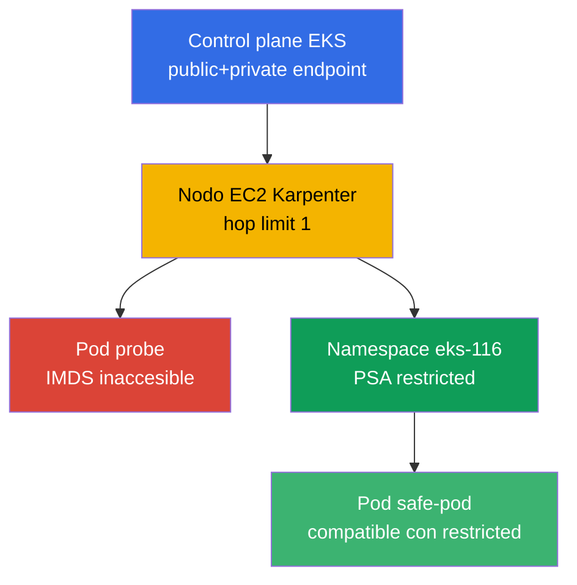
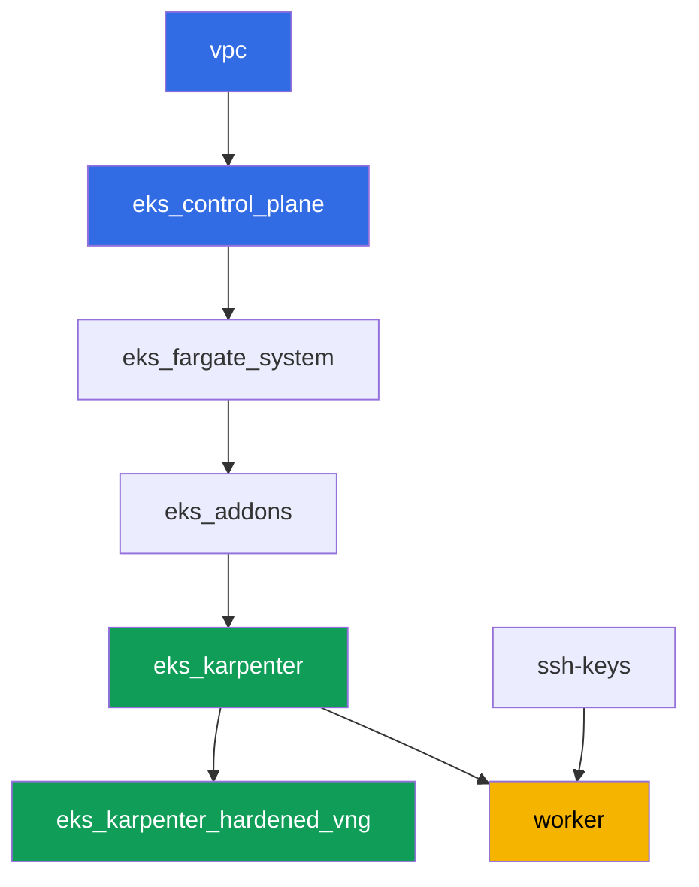

[Русская версия](README_RU.MD) · [Eng version](README.MD) · [Version française](README_FR.MD) · [Deutsche Version](README_DE.MD) · [ქართული ვერსია](README_GE.MD) · [繁體中文版](README_TW.MD) · [日本語版](README_JP.MD)

# Lab 116 - Hardening: IMDSv2 y hop limit, Pod Security Admission, endpoint privado

## Descripción

Un cluster por defecto está más abierto de lo que parece. Un pod en un nodo EC2 normal
casi siempre puede alcanzar el Instance Metadata Service y obtener las credenciales
temporales del rol del nodo, incluso si la aplicación tiene su propio rol vía IRSA. Un
namespace sin etiquetas permite que Pod Security Admission deje pasar un pod privilegiado
sin ninguna advertencia. En esta lab cerráis ambos caminos: configuráis un NodePool de
Karpenter con hop limit 1, observáis el síntoma (una petición a IMDS desde el pod que
agota el tiempo) y lo explicáis vía la API de AWS, luego activáis Pod Security Admission
en el namespace y comprobáis tanto el rechazo como el camino permitido. Una tarea aparte
confirma el acceso privado al control plane y analiza qué VPC endpoints se necesitan
para un cluster totalmente privado.

Las tareas están escritas en estilo de producción: un enunciado breve más criterios de
aceptación. La verificación es automática, con el comando `check_result`.

## Objetivo

Reforzar el material del capítulo del curso:

- [Capítulo 19. Hardening: IMDSv2, PSA, cluster privado](../../course/19/ru.md) - capas
  de protección del nodo, el pod y la red

## Qué creamos

| Objeto | Qué es | Por qué está en esta lab |
|--------|---------|-------------------|
| Namespace `eks-116` | la sección del cluster para la carga de la lab | mantiene los recursos separados, luego les añadimos PSA |
| NodePool `hardened` | EC2NodeClass con `metadataOptions` | hop limit `1` y `httpTokens=required` en todos los nodos |
| Deployment `probe` (curlimages/curl) | un pod para comprobar IMDS | el síntoma "desde el pod" - la petición a IMDS agota el tiempo |
| Artefacto `imds.txt` | salida de la petición a IMDS desde el pod | registra el timeout (el hop limit bloqueó el camino) |
| Artefacto `metadata_options.txt` | salida de `aws ec2 describe-instances` | confirma `HttpTokens=required`, hop limit `1` en el nodo |
| Etiquetas PSA en `eks-116` | `enforce=restricted` | activa los Pod Security Standards en el namespace |
| Pod `priv-test` (rechazado) + artefacto `psa_reject.txt` | un intento de pod privilegiado | admission lo rechaza, con mensaje de rechazo |
| Pod `safe-pod` | un pod con `securityContext` restricted completo | muestra el camino permitido bajo el mismo PSA |
| Artefacto `private_endpoint.txt` | `aws eks describe-cluster` + explicación | acceso privado al control plane y los VPC endpoints necesarios |

Panorama general:



## Infraestructura

El entorno se despliega en AWS (`eu-central-1`) vía Terragrunt. Cada directorio de lab es
un componente con su propio `terragrunt.hcl`, que referencia el módulo compartido en
`terraform/modules/` y declara dependencias mediante bloques `dependency`. Terragrunt
construye el grafo de dependencias y aplica los componentes en el orden correcto.

### Módulos y dependencias

| Directorio (componente) | Módulo (`terraform/modules/`) | Depende de | Qué crea |
|---------------------|-------------------------------|------------|-------------|
| `vpc` | `vpc_v3` | - | VPC `10.10.0.0/16`, subredes públicas y privadas en dos AZ, NAT |
| `ssh-keys` | `ssh-keys` | - | un par de claves SSH para la máquina worker y los nodos |
| `eks_control_plane` | `eks_v2_control_plane` | `vpc` | control plane EKS `1.36` con endpoint público y privado |
| `eks_fargate_system` | `eks_v2_fargate` | `vpc`, `eks_control_plane` | perfil Fargate para `kube-system` y `karpenter` |
| `eks_addons` | `eks_v2_addons` | `eks_control_plane`, `eks_fargate_system` | add-ons coredns, kube-proxy, vpc-cni, pod-identity |
| `eks_karpenter` | `eks_v2_karpenter` | `vpc`, `eks_control_plane`, `eks_addons`, `eks_fargate_system` | el controlador Karpenter, rol IAM de nodo |
| `eks_karpenter_hardened_vng` | `eks_v2_karpenter_vng` | `vpc`, `eks_control_plane`, `eks_karpenter` | NodePool `hardened` con `metadataOptions` (hop limit `1`) |
| `worker` | `eks_v2_work_pc` | `ssh-keys`, `vpc`, `eks_control_plane`, `eks_karpenter`, `eks_karpenter_hardened_vng` | la máquina worker con kubectl, tests y `check_result` |

Grafo de dependencias (lo que se aplica antes está más abajo en la flecha):



En esta lab hay un único NodePool - `hardened`, sin taint: todos los pods de carga caen
en él sin tolerations. La diferencia con el NodePool por defecto de la lab 101 es el
bloque `metadataOptions` en `vng`, que el EC2NodeClass pasa al launch template del nodo
de Karpenter:

```hcl
vng = {
  labels = { work_type = "hardened" }
  name     = "hardened"
  iam_role = dependency.eks_karpenter.outputs.karpenter_module.node_iam_role_name
  tags     = merge(local.vars.locals.tags, { "Name" = "${local.vars.locals.prefix}-eks-hardened" })
  metadataOptions = {
    httpEndpoint            = "enabled"
    httpProtocolIPv6        = "disabled"
    httpPutResponseHopLimit = 1
    httpTokens              = "required"
  }
}
```

### Dónde se configura cada cosa

`env.hcl` (parámetros compartidos del entorno, leídos por todos los componentes):

| Parámetro | Valor en esta lab | A qué afecta |
|----------|-----------------|---------------|
| `region` | `eu-central-1` | región de todos los recursos |
| `vpc_default_cidr`, `subnets` | `10.10.0.0/16`, subredes por AZ | plan de direccionamiento de la VPC y etiquetas de subredes |
| `prefix` | `eks-task116` | prefijo de nombres de recursos y etiquetas |
| `stack_name` | `eks116` | de él se construye `env_name` - el nombre del cluster |
| `k8_version` | `1.36.0` | versión de kubectl en la máquina worker |
| `instance_type_worker` | `t3.medium` | tipo de instancia de la máquina worker |
| `ssh_password_enable`, `access_cidrs` | `true`, `0.0.0.0/0` | acceso SSH a la máquina worker |
| `root_volume` | `gp3`, `10` | disco raíz de la máquina worker |

`inputs` en el `terragrunt.hcl` de cada componente (parámetros del módulo concreto):

| Archivo | Configuraciones clave |
|------|--------------------|
| `eks_control_plane/terragrunt.hcl` | `eks.version = "1.36"`; `endpoint_private_access` y `endpoint_public_access` activados en el módulo |
| `eks_karpenter_hardened_vng/terragrunt.hcl` | `vng.metadataOptions`: `httpTokens=required`, `httpPutResponseHopLimit=1`, sin taint |
| `worker/terragrunt.hcl` | `test_url` y `task_script_url` con los archivos de la lab 116, `exam_time_minutes` |

## Despliegue

```bash
TASK=116 make run_eks_task
```

El despliegue tarda aproximadamente 15-20 minutos. En la salida, busca la línea con la
conexión SSH a la máquina worker y conéctate a ella. kubectl ya está configurado allí
para el cluster correcto.

Comandos útiles en la máquina worker:

```bash
time_left       # cuánto tiempo de entorno queda
check_result    # comprobar la solución
```

> Seguridad del entorno de prácticas. En `env.hcl` están activados
> `ssh_password_enable = true` y `access_cidrs = ["0.0.0.0/0"]` - cómodo para un entorno
> de formación, pero esto no debe hacerse en producción. Según los estándares del curso
> (capítulos 0.2, 2, 19), el acceso a las máquinas worker se abre vía AWS SSM Session
> Manager sin puertos SSH públicos expuestos, y `access_cidrs` se restringe a direcciones
> concretas. Aquí se ha dejado SSH público solo por simplicidad de arranque.

## Tareas

---
|        **1**        | **Namespace para la carga de la lab**                             |
| :-----------------: | :---------------------------------------------------------- |
| Qué hacer          | Crea un namespace llamado `eks-116`. Todos los objetos de la lab se crean dentro de él. |
| Criterios de aceptación    | - el namespace `eks-116` existe. |
---
|        **2**        | **Síntoma: IMDS no es accesible desde el pod**                        |
| :-----------------: | :---------------------------------------------------------- |
| Qué hacer          | En `eks-116` crea un Deployment `probe`, imagen `curlimages/curl:latest`, `1` réplica, un contenedor con un `command` dormido (por ejemplo `sleep 3600`) para poder hacer `kubectl exec`. Desde el pod ejecuta una petición IMDSv2: primero `PUT` para el token (`http://169.254.169.254/latest/api/token`, cabecera `X-aws-ec2-metadata-token-ttl-seconds: 21600`), luego `GET` con el token contra `.../meta-data/iam/security-credentials/`. Limita la petición en el tiempo (`--max-time 5`) - el NodePool `hardened` mantiene `httpPutResponseHopLimit=1`, así que la petición desde el pod debe agotar el tiempo. Guarda la salida (incluyendo el hecho del timeout) en el archivo `/var/work/tests/artifacts/2/imds.txt`. |
| Criterios de aceptación    | - Deployment `probe` en `eks-116`, imagen `curlimages/curl`, `1` réplica lista;<br/>- el archivo `2/imds.txt` no está vacío y menciona un timeout (`timeout`/`timed out`). |
---
|        **3**        | **Verificación vía la API de AWS: hop limit e IMDSv2 en el nodo**       |
| :-----------------: | :---------------------------------------------------------- |
| Qué hacer          | Determina el nodo del pod `probe` (`kubectl get po ... -o jsonpath='{.items[0].spec.nodeName}'`), toma su `providerID` (`kubectl get node <node> -o jsonpath='{.spec.providerID}'`) y extrae el id de la instancia (el último segmento, con forma `i-...`). Ejecuta `aws ec2 describe-instances --instance-ids <id> --query 'Reservations[].Instances[].MetadataOptions' --output json` y guarda la salida en `/var/work/tests/artifacts/3/metadata_options.txt`. Confirma en la salida `HttpTokens: required` y `HttpPutResponseHopLimit: 1`. |
| Criterios de aceptación    | - el archivo `3/metadata_options.txt` no está vacío;<br/>- contiene `HttpPutResponseHopLimit` con valor `1` y `HttpTokens` con valor `required`. |
---
|        **4**        | **Pod Security Admission: rechazo de un pod privilegiado**    |
| :-----------------: | :---------------------------------------------------------- |
| Qué hacer          | Añade las etiquetas `pod-security.kubernetes.io/enforce=restricted` y `pod-security.kubernetes.io/enforce-version=latest` al namespace `eks-116`. Intenta crear un Pod `priv-test` (imagen `busybox`) con `securityContext.privileged: true`. Admission debe rechazar la creación del pod (el pod no aparece en el cluster). Guarda el mensaje de rechazo en el archivo `/var/work/tests/artifacts/4/psa_reject.txt`. |
| Criterios de aceptación    | - el namespace `eks-116` tiene la etiqueta `enforce=restricted`;<br/>- el pod `priv-test` no se crea;<br/>- el archivo `4/psa_reject.txt` no está vacío y menciona `privileged` y `restricted`/`violat`. |
---
|        **5**        | **El camino permitido: un pod compatible con restricted**          |
| :-----------------: | :---------------------------------------------------------- |
| Qué hacer          | En `eks-116` crea un Pod `safe-pod` que cumpla el perfil `restricted`: `securityContext.runAsNonRoot: true`, `runAsUser` con cualquier UID distinto de cero (la imagen `busybox` se ejecuta como root por defecto, y sin un `runAsUser` explícito kubelet se negará a iniciar el contenedor incluso tras pasar admission), `seccompProfile.type: RuntimeDefault` a nivel de pod, y a nivel de contenedor `allowPrivilegeEscalation: false` y `capabilities.drop: ["ALL"]`. El pod debe pasar admission y llegar a `Running`. |
| Criterios de aceptación    | - Pod `safe-pod` en `eks-116` en estado `Running`;<br/>- `spec.securityContext.runAsNonRoot` es igual a `true`. |
---
|        **6**        | **Acceso privado al control plane y VPC endpoints**           |
| :-----------------: | :---------------------------------------------------------- |
| Qué hacer          | Ejecuta `aws eks describe-cluster --name <cluster> --query 'cluster.resourcesVpcConfig' --output json` y confirma que `endpointPrivateAccess: true`. Guarda la salida en el archivo `/var/work/tests/artifacts/6/private_endpoint.txt`. Completa el archivo con una explicación (3-4 frases) de qué VPC endpoints se necesitarían para un cluster totalmente privado sin salida a internet (`ecr.api`, `ecr.dkr`, `s3`, `sts`, `ec2`, `logs`, `eks`) y por qué el endpoint de S3 es obligatorio incluso con los endpoints de ECR presentes (las capas de las imágenes residen en S3). |
| Criterios de aceptación    | - el archivo `6/private_endpoint.txt` no está vacío;<br/>- contiene `true` (el valor de `endpointPrivateAccess`) y menciona `s3` y `ecr`. |
---

## Comprobación del resultado

En la máquina worker, ejecuta la comprobación automática:

```bash
check_result
```

El script ejecuta los tests y muestra el porcentaje de tareas completadas.

## Solución

Solución de referencia: [worker/files/solutions/1_ES.MD](worker/files/solutions/1_ES.MD)

## Eliminación del cluster y los recursos

La carga de las tareas 2-5 (`probe`, `priv-test`, `safe-pod`) en el namespace `eks-116`
hizo que Karpenter levantara el nodo EC2 `hardened`. Terraform no sabe nada de él - si
empiezas `destroy` demasiado pronto, el nodo EC2 huérfano retiene un ENI y bloquea la
eliminación de la VPC/subredes (el mismo patrón que en las labs 108, 109, 111, 114, 115).
Antes de `destroy`, retira la carga y espera a que Karpenter elimine él mismo la
instancia EC2:

```bash
# 1. Retiramos la carga que hizo que Karpenter levantara el nodo EC2
kubectl delete namespace eks-116

# 2. Esperamos a que Karpenter elimine él mismo el nodo EC2 (no solo borre el objeto
#    Node, sino que termine la propia instancia EC2) - ambas salidas deben quedar vacías
for i in $(seq 1 30); do
  nc=$(kubectl get nodeclaims --no-headers 2>/dev/null | wc -l)
  ec2=$(aws ec2 describe-instances \
    --filters "Name=tag:karpenter.sh/nodepool,Values=hardened" \
      "Name=instance-state-name,Values=running,pending,stopping,stopped" \
    --query 'Reservations[].Instances[]' --output text)
  echo "nodeclaims=$nc ec2_instances=[$ec2]"
  [[ "$nc" == "0" ]] && [[ -z "$ec2" ]] && break
  sleep 10
done
```

Solo después de que `nodeclaims=0` y la lista de instancias EC2 esté vacía, lanza la
eliminación de los recursos de terraform:

```bash
TASK=116 make delete_eks_task
```
