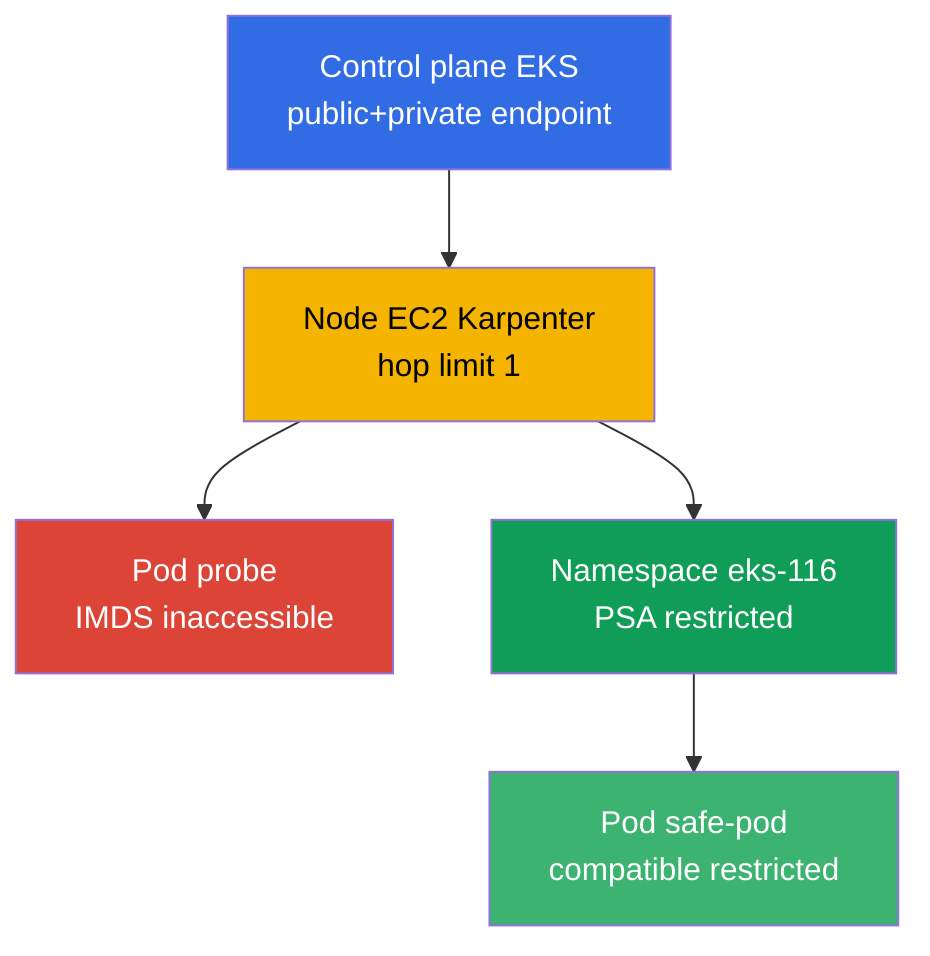
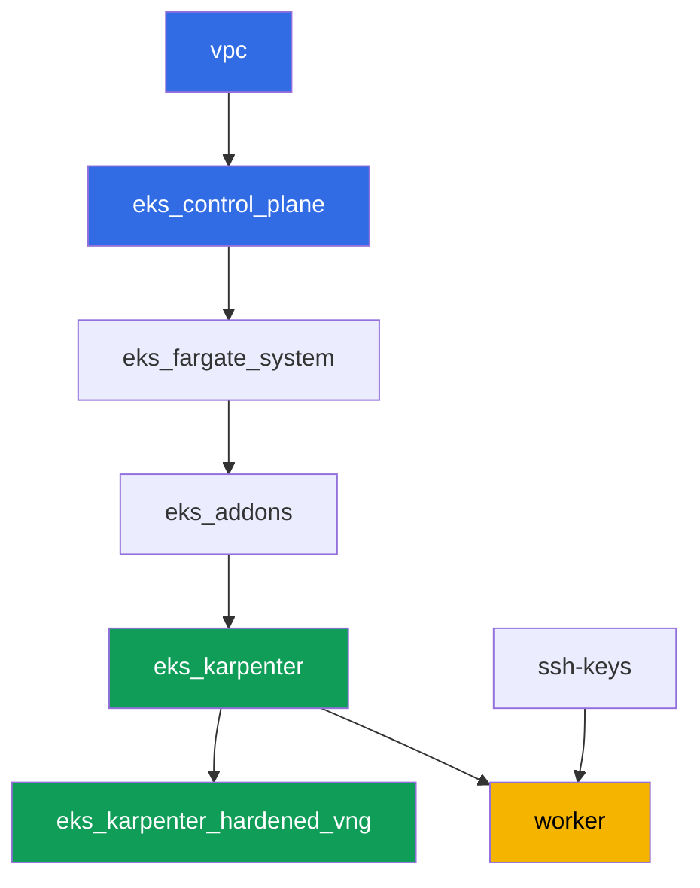

[Русская версия](README_RU.MD) · [Eng version](README.MD) · [Versión en español](README_ES.MD) · [Deutsche Version](README_DE.MD) · [ქართული ვერსია](README_GE.MD) · [繁體中文版](README_TW.MD) · [日本語版](README_JP.MD)

# Lab 116 - Hardening : IMDSv2 et hop limit, Pod Security Admission, endpoint privé

## Description

Un cluster par défaut est plus ouvert qu'il n'y paraît. Un pod sur un node EC2 classique
peut presque toujours atteindre l'Instance Metadata Service et récupérer les
identifiants temporaires du rôle du node, même si l'application a son propre rôle via
IRSA. Un namespace sans labels laisse passer un pod privilégié via Pod Security
Admission sans le moindre avertissement. Dans cette lab, vous fermez les deux chemins :
vous configurez un NodePool Karpenter avec un hop limit de 1, vous observez le symptôme
(une requête vers IMDS depuis le pod qui atteint le timeout) et vous l'expliquez via
l'API AWS, puis vous activez Pod Security Admission sur le namespace et vérifiez à la
fois le refus et le chemin autorisé. Une tâche séparée confirme l'accès privé au control
plane et détermine quels VPC endpoints sont nécessaires pour un cluster entièrement
privé.

Les tâches sont écrites dans un style production : un énoncé court plus des critères
d'acceptation. La vérification est automatique, via la commande `check_result`.

## Objectif

Renforcer le chapitre du cours :

- [Chapitre 19. Hardening : IMDSv2, PSA, cluster privé](../../course/19/fr.md) - couches
  de protection du node, du pod et du réseau

## Ce que nous créons

| Objet | Ce que c'est | Pourquoi dans cette lab |
|--------|---------|-------------------|
| Namespace `eks-116` | la section du cluster pour la charge de la lab | garde les ressources séparées, puis on y attache PSA |
| NodePool `hardened` | EC2NodeClass avec `metadataOptions` | hop limit `1` et `httpTokens=required` sur tous les nodes |
| Deployment `probe` (curlimages/curl) | un pod pour vérifier IMDS | le symptôme « depuis le pod » - la requête vers IMDS atteint le timeout |
| Artefact `imds.txt` | sortie de la requête vers IMDS depuis le pod | enregistre le timeout (le hop limit a bloqué le chemin) |
| Artefact `metadata_options.txt` | sortie de `aws ec2 describe-instances` | confirme `HttpTokens=required`, hop limit `1` sur le node |
| Labels PSA sur `eks-116` | `enforce=restricted` | active les Pod Security Standards sur le namespace |
| Pod `priv-test` (refusé) + artefact `psa_reject.txt` | une tentative de pod privilégié | admission le refuse, avec un message de refus |
| Pod `safe-pod` | un pod avec un `securityContext` restricted complet | montre le chemin autorisé sous le même PSA |
| Artefact `private_endpoint.txt` | `aws eks describe-cluster` + explication | accès privé au control plane et VPC endpoints nécessaires |

Vue d'ensemble :



## Infrastructure

L'environnement est déployé sur AWS (`eu-central-1`) via Terragrunt. Chaque répertoire
de lab est un composant avec son propre `terragrunt.hcl`, qui référence le module
partagé dans `terraform/modules/` et déclare des dépendances via des blocs
`dependency`. Terragrunt construit le graphe de dépendances et applique les composants
dans le bon ordre.

### Modules et dépendances

| Répertoire (composant) | Module (`terraform/modules/`) | Dépend de | Ce qu'il crée |
|---------------------|-------------------------------|------------|-------------|
| `vpc` | `vpc_v3` | - | VPC `10.10.0.0/16`, subnets publics et privés dans deux AZ, NAT |
| `ssh-keys` | `ssh-keys` | - | une paire de clés SSH pour la machine worker et les nodes |
| `eks_control_plane` | `eks_v2_control_plane` | `vpc` | control plane EKS `1.36` avec endpoint public et privé |
| `eks_fargate_system` | `eks_v2_fargate` | `vpc`, `eks_control_plane` | profil Fargate pour `kube-system` et `karpenter` |
| `eks_addons` | `eks_v2_addons` | `eks_control_plane`, `eks_fargate_system` | add-ons coredns, kube-proxy, vpc-cni, pod-identity |
| `eks_karpenter` | `eks_v2_karpenter` | `vpc`, `eks_control_plane`, `eks_addons`, `eks_fargate_system` | le contrôleur Karpenter, rôle IAM des nodes |
| `eks_karpenter_hardened_vng` | `eks_v2_karpenter_vng` | `vpc`, `eks_control_plane`, `eks_karpenter` | NodePool `hardened` avec `metadataOptions` (hop limit `1`) |
| `worker` | `eks_v2_work_pc` | `ssh-keys`, `vpc`, `eks_control_plane`, `eks_karpenter`, `eks_karpenter_hardened_vng` | la machine worker avec kubectl, les tests et `check_result` |

Graphe de dépendances (ce qui est appliqué en premier est plus bas le long de la
flèche) :



Dans cette lab il y a un seul NodePool - `hardened`, sans taint : tous les pods de
charge y atterrissent sans tolerations. La différence avec le NodePool par défaut de la
lab 101 est le bloc `metadataOptions` dans `vng`, que l'EC2NodeClass transmet au launch
template du node Karpenter :

```hcl
vng = {
  labels = { work_type = "hardened" }
  name     = "hardened"
  iam_role = dependency.eks_karpenter.outputs.karpenter_module.node_iam_role_name
  tags     = merge(local.vars.locals.tags, { "Name" = "${local.vars.locals.prefix}-eks-hardened" })
  metadataOptions = {
    httpEndpoint            = "enabled"
    httpProtocolIPv6        = "disabled"
    httpPutResponseHopLimit = 1
    httpTokens              = "required"
  }
}
```

### Où chaque chose est configurée

`env.hcl` (paramètres partagés de l'environnement, lus par tous les composants) :

| Paramètre | Valeur dans cette lab | Ce qu'il affecte |
|----------|-----------------|---------------|
| `region` | `eu-central-1` | région de toutes les ressources |
| `vpc_default_cidr`, `subnets` | `10.10.0.0/16`, subnets par AZ | plan d'adressage de la VPC et tags des subnets |
| `prefix` | `eks-task116` | préfixe des noms de ressources et des tags |
| `stack_name` | `eks116` | à partir duquel on construit `env_name` - le nom du cluster |
| `k8_version` | `1.36.0` | version de kubectl sur la machine worker |
| `instance_type_worker` | `t3.medium` | type d'instance de la machine worker |
| `ssh_password_enable`, `access_cidrs` | `true`, `0.0.0.0/0` | accès SSH à la machine worker |
| `root_volume` | `gp3`, `10` | disque racine de la machine worker |

`inputs` dans le `terragrunt.hcl` de chaque composant (paramètres du module concerné) :

| Fichier | Réglages clés |
|------|--------------------|
| `eks_control_plane/terragrunt.hcl` | `eks.version = "1.36"` ; `endpoint_private_access` et `endpoint_public_access` activés dans le module |
| `eks_karpenter_hardened_vng/terragrunt.hcl` | `vng.metadataOptions` : `httpTokens=required`, `httpPutResponseHopLimit=1`, sans taint |
| `worker/terragrunt.hcl` | `test_url` et `task_script_url` pointant vers les fichiers de la lab 116, `exam_time_minutes` |

## Déploiement

```bash
TASK=116 make run_eks_task
```

Le déploiement prend environ 15 à 20 minutes. Dans la sortie, trouvez la ligne avec la
connexion SSH à la machine worker et connectez-vous. kubectl y est déjà configuré pour
le bon cluster.

Commandes utiles sur la machine worker :

```bash
time_left       # temps d'environnement restant
check_result    # vérifier la solution
```

> Sécurité du bac à sable. Dans `env.hcl`, `ssh_password_enable = true` et
> `access_cidrs = ["0.0.0.0/0"]` sont activés - pratique pour un environnement de
> formation, mais à ne pas faire en production. Selon les standards du cours
> (chapitres 0.2, 2, 19), l'accès aux machines worker s'ouvre via AWS SSM Session
> Manager sans ports SSH publics exposés, et `access_cidrs` est restreint à des adresses
> précises. Ici, le SSH public n'est laissé que pour la simplicité du lancement.

## Tâches

---
|        **1**        | **Namespace pour la charge de la lab**                             |
| :-----------------: | :---------------------------------------------------------- |
| Ce qu'il faut faire          | Créez un namespace nommé `eks-116`. Tous les objets de la lab sont créés à l'intérieur. |
| Critères d'acceptation    | - le namespace `eks-116` existe. |
---
|        **2**        | **Symptôme : IMDS inaccessible depuis le pod**                        |
| :-----------------: | :---------------------------------------------------------- |
| Ce qu'il faut faire          | Dans `eks-116`, créez un Deployment `probe`, image `curlimages/curl:latest`, `1` réplica, un conteneur avec une `command` endormie (par exemple `sleep 3600`) pour pouvoir faire `kubectl exec`. Depuis le pod, exécutez une requête IMDSv2 : d'abord un `PUT` pour le token (`http://169.254.169.254/latest/api/token`, en-tête `X-aws-ec2-metadata-token-ttl-seconds: 21600`), puis un `GET` avec le token vers `.../meta-data/iam/security-credentials/`. Limitez la requête dans le temps (`--max-time 5`) - le NodePool `hardened` maintient `httpPutResponseHopLimit=1`, donc la requête depuis le pod doit atteindre le timeout. Enregistrez la sortie (y compris le fait du timeout) dans le fichier `/var/work/tests/artifacts/2/imds.txt`. |
| Critères d'acceptation    | - Deployment `probe` dans `eks-116`, image `curlimages/curl`, `1` réplica prête;<br/>- le fichier `2/imds.txt` n'est pas vide et mentionne un timeout (`timeout`/`timed out`). |
---
|        **3**        | **Vérification via l'API AWS : hop limit et IMDSv2 sur le node**       |
| :-----------------: | :---------------------------------------------------------- |
| Ce qu'il faut faire          | Déterminez le node du pod `probe` (`kubectl get po ... -o jsonpath='{.items[0].spec.nodeName}'`), récupérez son `providerID` (`kubectl get node <node> -o jsonpath='{.spec.providerID}'`) et extrayez l'id de l'instance (le dernier segment, de la forme `i-...`). Exécutez `aws ec2 describe-instances --instance-ids <id> --query 'Reservations[].Instances[].MetadataOptions' --output json` et enregistrez la sortie dans `/var/work/tests/artifacts/3/metadata_options.txt`. Confirmez dans la sortie `HttpTokens: required` et `HttpPutResponseHopLimit: 1`. |
| Critères d'acceptation    | - le fichier `3/metadata_options.txt` n'est pas vide;<br/>- contient `HttpPutResponseHopLimit` avec la valeur `1` et `HttpTokens` avec la valeur `required`. |
---
|        **4**        | **Pod Security Admission : refus d'un pod privilégié**    |
| :-----------------: | :---------------------------------------------------------- |
| Ce qu'il faut faire          | Ajoutez les labels `pod-security.kubernetes.io/enforce=restricted` et `pod-security.kubernetes.io/enforce-version=latest` au namespace `eks-116`. Essayez de créer un Pod `priv-test` (image `busybox`) avec `securityContext.privileged: true`. Admission doit refuser la création du pod (le pod n'apparaît pas dans le cluster). Enregistrez le message de refus dans le fichier `/var/work/tests/artifacts/4/psa_reject.txt`. |
| Critères d'acceptation    | - le namespace `eks-116` a le label `enforce=restricted`;<br/>- le pod `priv-test` n'est pas créé;<br/>- le fichier `4/psa_reject.txt` n'est pas vide et mentionne `privileged` et `restricted`/`violat`. |
---
|        **5**        | **Le chemin autorisé : un pod compatible avec restricted**          |
| :-----------------: | :---------------------------------------------------------- |
| Ce qu'il faut faire          | Dans `eks-116`, créez un Pod `safe-pod` conforme au profil `restricted` : `securityContext.runAsNonRoot: true`, `runAsUser` avec n'importe quel UID non nul (l'image `busybox` s'exécute en root par défaut, et sans `runAsUser` explicite kubelet refusera de démarrer le conteneur même après admission), `seccompProfile.type: RuntimeDefault` au niveau du pod, et au niveau du conteneur `allowPrivilegeEscalation: false` et `capabilities.drop: ["ALL"]`. Le pod doit passer admission et atteindre `Running`. |
| Critères d'acceptation    | - Pod `safe-pod` dans `eks-116` à l'état `Running`;<br/>- `spec.securityContext.runAsNonRoot` égal à `true`. |
---
|        **6**        | **Accès privé au control plane et VPC endpoints**           |
| :-----------------: | :---------------------------------------------------------- |
| Ce qu'il faut faire          | Exécutez `aws eks describe-cluster --name <cluster> --query 'cluster.resourcesVpcConfig' --output json` et confirmez que `endpointPrivateAccess: true`. Enregistrez la sortie dans le fichier `/var/work/tests/artifacts/6/private_endpoint.txt`. Complétez le fichier avec une explication (3-4 phrases) des VPC endpoints qui seraient nécessaires pour un cluster entièrement privé sans accès à internet (`ecr.api`, `ecr.dkr`, `s3`, `sts`, `ec2`, `logs`, `eks`) et pourquoi l'endpoint S3 est obligatoire même avec les endpoints ECR en place (les couches d'images résident dans S3). |
| Critères d'acceptation    | - le fichier `6/private_endpoint.txt` n'est pas vide;<br/>- contient `true` (la valeur de `endpointPrivateAccess`) et mentionne `s3` et `ecr`. |
---

## Vérification du résultat

Sur la machine worker, exécutez la vérification automatique :

```bash
check_result
```

Le script exécute les tests et affiche le pourcentage de tâches accomplies.

## Solution

Solution de référence : [worker/files/solutions/1_FR.MD](worker/files/solutions/1_FR.MD)

## Suppression du cluster et des ressources

La charge des tâches 2-5 (`probe`, `priv-test`, `safe-pod`) dans le namespace `eks-116` a
fait que Karpenter a levé le node EC2 `hardened`. Terraform ne le connaît pas - si vous
lancez `destroy` trop tôt, le node EC2 orphelin garde un ENI et bloque la suppression de
la VPC/des subnets (le même schéma que dans les labs 108, 109, 111, 114, 115). Avant
`destroy`, retirez la charge et attendez que Karpenter supprime lui-même l'instance
EC2 :

```bash
# 1. On retire la charge qui a fait lever le node EC2 par Karpenter
kubectl delete namespace eks-116

# 2. On attend que Karpenter supprime lui-même le node EC2 (pas seulement l'objet
#    Node, mais qu'il termine l'instance EC2 elle-même) - les deux sorties doivent être vides
for i in $(seq 1 30); do
  nc=$(kubectl get nodeclaims --no-headers 2>/dev/null | wc -l)
  ec2=$(aws ec2 describe-instances \
    --filters "Name=tag:karpenter.sh/nodepool,Values=hardened" \
      "Name=instance-state-name,Values=running,pending,stopping,stopped" \
    --query 'Reservations[].Instances[]' --output text)
  echo "nodeclaims=$nc ec2_instances=[$ec2]"
  [[ "$nc" == "0" ]] && [[ -z "$ec2" ]] && break
  sleep 10
done
```

Seulement après que `nodeclaims=0` et que la liste des instances EC2 soit vide, lancez
la suppression des ressources terraform :

```bash
TASK=116 make delete_eks_task
```
