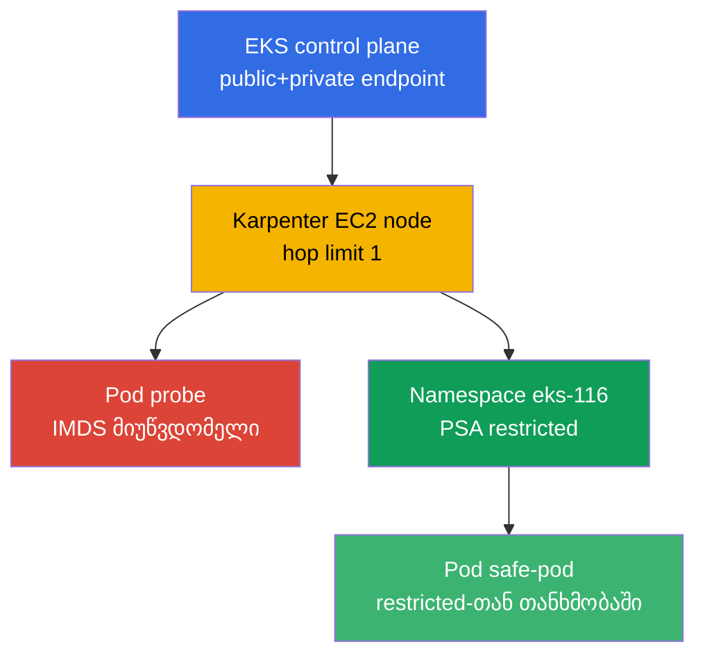
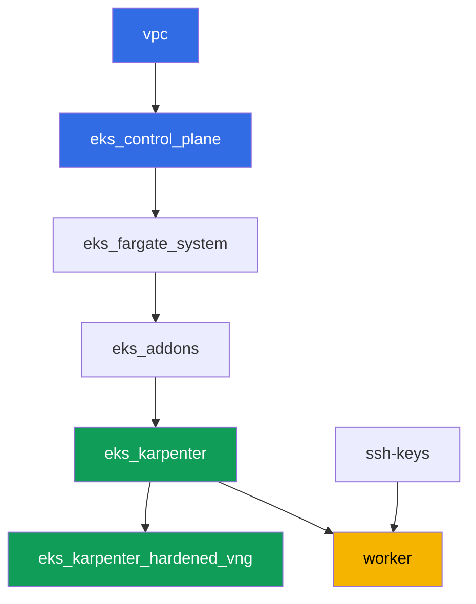

[Русская версия](README_RU.MD) · [Eng version](README.MD) · [Versión en español](README_ES.MD) · [Version française](README_FR.MD) · [Deutsche Version](README_DE.MD) · [繁體中文版](README_TW.MD) · [日本語版](README_JP.MD)

# ლაბა 116 - გამკვრივება: IMDSv2 და hop limit, Pod Security Admission, პრივატული endpoint

## აღწერა

ნაგულისხმევი კლასტერი უფრო ღიაა, ვიდრე ჩვეულებრივ ეჩვენება. Pod ჩვეულებრივ EC2 node-ზე
თითქმის ყოველთვის აღწევს Instance Metadata Service-ს და შეუძლია აიღოს node-ის role-ის
დროებითი credentials, თუნდაც აპლიკაციას ჰქონდეს საკუთარი role IRSA-ის მეშვეობით.
Namespace ლეიბლების გარეშე Pod Security Admission-ს ატარებინებს პრივილეგირებულ pod-ს
ერთი გაფრთხილების გარეშეც. ამ ლაბაში ორივე გზას ხურავთ: აყალიბებთ Karpenter NodePool-ს
hop limit 1-ით, აკვირდებით სიმპტომს (IMDS მოთხოვნის timeout pod-იდან) და ხსნით მას AWS
API-ის მეშვეობით, შემდეგ რთავთ Pod Security Admission-ს namespace-ზე და ამოწმებთ
როგორც უარყოფას, ისე დაშვებულ გზას. ცალკე დავალება ადასტურებს control plane-ის
პრივატულ წვდომას და აანალიზებთ, რომელი VPC endpoints არის საჭირო სრულად პრივატული
კლასტერისთვის.

დავალებები დაწერილია production-სტილში: მოკლე დებულება პლუს მიღების კრიტერიუმები.
შემოწმება ავტომატურია, ბრძანებით `check_result`.

## მიზანი

გავიმყაროთ კურსის თავის მასალა:

- [თავი 19. გამკვრივება: IMDSv2, PSA, პრივატული კლასტერი](../../course/19/ge.md) -
  node-ის, pod-ის და ქსელის დაცვის შრეები

## რას ვქმნით

| ობიექტი | რას წარმოადგენს | რატომ არის ამ ლაბაში |
|--------|---------|-------------------|
| Namespace `eks-116` | კლასტერის ნაწილი ლაბის დატვირთვისთვის | ვინახავთ რესურსებს ცალკე, შემდეგ ვამატებთ PSA-ს |
| NodePool `hardened` | EC2NodeClass `metadataOptions`-ით | hop limit `1` და `httpTokens=required` ყველა node-ზე |
| Deployment `probe` (curlimages/curl) | pod IMDS-ის შესამოწმებლად | სიმპტომი "pod-იდან" - IMDS მოთხოვნა timeout-ს იძლევა |
| არტეფაქტი `imds.txt` | IMDS მოთხოვნის გამონატანი pod-იდან | ფიქსირებს timeout-ს (hop limit-მა დახურა გზა) |
| არტეფაქტი `metadata_options.txt` | `aws ec2 describe-instances`-ის გამონატანი | ადასტურებს `HttpTokens=required`, hop limit `1` node-ზე |
| PSA ლეიბლები `eks-116`-ზე | `enforce=restricted` | რთავს Pod Security Standards-ს namespace-ზე |
| Pod `priv-test` (უარყოფილი) + არტეფაქტი `psa_reject.txt` | პრივილეგირებული pod-ის მცდელობა | admission უარყოფს, უარყოფის შეტყობინებით |
| Pod `safe-pod` | pod სრული restricted `securityContext`-ით | აჩვენებს დაშვებულ გზას იმავე PSA-ს ქვეშ |
| არტეფაქტი `private_endpoint.txt` | `aws eks describe-cluster` + განმარტება | control plane-ის პრივატული წვდომა და საჭირო VPC endpoints |

საერთო სურათი:



## ინფრასტრუქტურა

გარემო იშლება AWS-ში (`eu-central-1`) Terragrunt-ის მეშვეობით. ლაბის ყოველი დირექტორია
წარმოადგენს ერთ კომპონენტს, საკუთარი `terragrunt.hcl`-ით, რომელიც მიმართავს საერთო
მოდულს `terraform/modules/`-ში და აცხადებს დამოკიდებულებებს `dependency` ბლოკებით.
Terragrunt აგებს დამოკიდებულების გრაფს და გამოიყენებს კომპონენტებს სწორი
თანმიმდევრობით.

### მოდულები და დამოკიდებულებები

| დირექტორია (კომპონენტი) | მოდული (`terraform/modules/`) | დამოკიდებულია | რას ქმნის |
|---------------------|-------------------------------|------------|-------------|
| `vpc` | `vpc_v3` | - | VPC `10.10.0.0/16`, საჯარო და პრივატული subnets ორ AZ-ში, NAT |
| `ssh-keys` | `ssh-keys` | - | SSH-გასაღებების წყვილი worker მანქანისთვის და node-ებისთვის |
| `eks_control_plane` | `eks_v2_control_plane` | `vpc` | EKS control plane `1.36` საჯარო და პრივატული endpoint-ით |
| `eks_fargate_system` | `eks_v2_fargate` | `vpc`, `eks_control_plane` | Fargate profile `kube-system`-ისთვის და `karpenter`-ისთვის |
| `eks_addons` | `eks_v2_addons` | `eks_control_plane`, `eks_fargate_system` | add-on-ები coredns, kube-proxy, vpc-cni, pod-identity |
| `eks_karpenter` | `eks_v2_karpenter` | `vpc`, `eks_control_plane`, `eks_addons`, `eks_fargate_system` | Karpenter კონტროლერი, node-ის IAM role |
| `eks_karpenter_hardened_vng` | `eks_v2_karpenter_vng` | `vpc`, `eks_control_plane`, `eks_karpenter` | NodePool `hardened` `metadataOptions`-ით (hop limit `1`) |
| `worker` | `eks_v2_work_pc` | `ssh-keys`, `vpc`, `eks_control_plane`, `eks_karpenter`, `eks_karpenter_hardened_vng` | worker მანქანა kubectl-ით, ტესტებით და `check_result`-ით |

დამოკიდებულების გრაფი (რაც უფრო ადრე გამოიყენება, ისე უფრო დაბლაა ისარზე):



ამ ლაბაში მხოლოდ ერთი NodePool არსებობს - `hardened`, taint-ის გარეშე: ყველა
სამუშაო pod მასზე ხვდება tolerations-ის გარეშე. განსხვავება ლაბა 101-ის ნაგულისხმევ
NodePool-თან შედარებით არის `metadataOptions` ბლოკი `vng`-ში, რომელსაც EC2NodeClass
გადასცემს Karpenter node-ის launch template-ს:

```hcl
vng = {
  labels = { work_type = "hardened" }
  name     = "hardened"
  iam_role = dependency.eks_karpenter.outputs.karpenter_module.node_iam_role_name
  tags     = merge(local.vars.locals.tags, { "Name" = "${local.vars.locals.prefix}-eks-hardened" })
  metadataOptions = {
    httpEndpoint            = "enabled"
    httpProtocolIPv6        = "disabled"
    httpPutResponseHopLimit = 1
    httpTokens              = "required"
  }
}
```

### სად რა კონფიგურირდება

`env.hcl` (გარემოს საერთო პარამეტრები, იკითხება ყველა კომპონენტის მიერ):

| პარამეტრი | მნიშვნელობა ამ ლაბაში | რაზე მოქმედებს |
|----------|-----------------|---------------|
| `region` | `eu-central-1` | ყველა რესურსის რეგიონი |
| `vpc_default_cidr`, `subnets` | `10.10.0.0/16`, subnets AZ-ების მიხედვით | VPC-ის მისამართების გეგმა და subnet-ების ტეგები |
| `prefix` | `eks-task116` | რესურსების სახელების და ტეგების პრეფიქსი |
| `stack_name` | `eks116` | მისგან იგება `env_name` - კლასტერის სახელი |
| `k8_version` | `1.36.0` | kubectl-ის ვერსია worker მანქანაზე |
| `instance_type_worker` | `t3.medium` | worker მანქანის instance-ის ტიპი |
| `ssh_password_enable`, `access_cidrs` | `true`, `0.0.0.0/0` | SSH წვდომა worker მანქანაზე |
| `root_volume` | `gp3`, `10` | worker მანქანის root დისკი |

`inputs` ყოველი კომპონენტის `terragrunt.hcl`-ში (კონკრეტული მოდულის პარამეტრები):

| ფაილი | ძირითადი პარამეტრები |
|------|--------------------|
| `eks_control_plane/terragrunt.hcl` | `eks.version = "1.36"`; `endpoint_private_access` და `endpoint_public_access` ჩართული მოდულში |
| `eks_karpenter_hardened_vng/terragrunt.hcl` | `vng.metadataOptions`: `httpTokens=required`, `httpPutResponseHopLimit=1`, taint-ის გარეშე |
| `worker/terragrunt.hcl` | `test_url` და `task_script_url` ლაბა 116-ის ფაილებზე, `exam_time_minutes` |

## გაშლა

```bash
TASK=116 make run_eks_task
```

გაშლას სჭირდება დაახლოებით 15-20 წუთი. გამონატანში იპოვეთ სტრიქონი worker მანქანასთან
SSH-კავშირით და დაუკავშირდით მას. kubectl იქ უკვე კონფიგურირებულია სწორ კლასტერზე.

სასარგებლო ბრძანებები worker მანქანაზე:

```bash
time_left       # რამდენი დროა დარჩენილი გარემოს
check_result    # გადაწყვეტის შემოწმება
```

> სავარჯიშო სტენდის უსაფრთხოება. `env.hcl`-ში ჩართულია `ssh_password_enable = true`
> და `access_cidrs = ["0.0.0.0/0"]` - მოხერხებულია სასწავლო გარემოსთვის, მაგრამ ასე
> არ ღირს production-ში. კურსის სტანდარტების მიხედვით (თავები 0.2, 2, 19), worker
> მანქანებზე წვდომა იხსნება AWS SSM Session Manager-ის მეშვეობით საჯარო SSH პორტების
> გარეშე, ხოლო `access_cidrs` ვიწროვდება კონკრეტულ მისამართებზე. აქ საჯარო SSH
> დატანილია მხოლოდ გაშვების სიმარტივისთვის.

## დავალებები

---
|        **1**        | **Namespace ლაბის დატვირთვისთვის**                             |
| :-----------------: | :---------------------------------------------------------- |
| რას ვაკეთებთ          | შექმენით namespace სახელით `eks-116`. ლაბის ყველა ობიექტი ამის შიგნით იქმნება. |
| მიღების კრიტერიუმები    | - namespace `eks-116` არსებობს. |
---
|        **2**        | **სიმპტომი: IMDS მიუწვდომელია pod-იდან**                        |
| :-----------------: | :---------------------------------------------------------- |
| რას ვაკეთებთ          | `eks-116`-ში შექმენით Deployment `probe`, image `curlimages/curl:latest`, `1` replica, კონტეინერი დაძინებული `command`-ით (მაგალითად `sleep 3600`), რომ შესაძლებელი იყოს `kubectl exec`. pod-იდან გაუშვით IMDSv2 მოთხოვნა: თავიდან `PUT` token-ისთვის (`http://169.254.169.254/latest/api/token`, header `X-aws-ec2-metadata-token-ttl-seconds: 21600`), შემდეგ `GET` token-ით `.../meta-data/iam/security-credentials/`-ზე. შეზღუდეთ მოთხოვნა დროში (`--max-time 5`) - NodePool `hardened` ინახავს `httpPutResponseHopLimit=1`-ს, ამიტომ pod-იდან მოთხოვნას timeout უნდა მისცემდეს. შეინახეთ გამონატანი (timeout-ის ფაქტის ჩათვლით) ფაილში `/var/work/tests/artifacts/2/imds.txt`. |
| მიღების კრიტერიუმები    | - Deployment `probe` `eks-116`-ში, image `curlimages/curl`, `1` მზა replica;<br/>- ფაილი `2/imds.txt` არ არის ცარიელი და ახსენებს timeout-ს (`timeout`/`timed out`). |
---
|        **3**        | **შემოწმება AWS API-ის მეშვეობით: hop limit და IMDSv2 node-ზე**       |
| :-----------------: | :---------------------------------------------------------- |
| რას ვაკეთებთ          | დაადგინეთ pod `probe`-ის node (`kubectl get po ... -o jsonpath='{.items[0].spec.nodeName}'`), აღებთ მის `providerID`-ს (`kubectl get node <node> -o jsonpath='{.spec.providerID}'`) და გამოყოფთ instance-ის id-ს (ბოლო სეგმენტი, ფორმით `i-...`). გაუშვით `aws ec2 describe-instances --instance-ids <id> --query 'Reservations[].Instances[].MetadataOptions' --output json` და შეინახეთ გამონატანი `/var/work/tests/artifacts/3/metadata_options.txt`-ში. დაადასტურეთ გამონატანში `HttpTokens: required` და `HttpPutResponseHopLimit: 1`. |
| მიღების კრიტერიუმები    | - ფაილი `3/metadata_options.txt` არ არის ცარიელი;<br/>- შეიცავს `HttpPutResponseHopLimit`-ს მნიშვნელობით `1` და `HttpTokens`-ს მნიშვნელობით `required`. |
---
|        **4**        | **Pod Security Admission: პრივილეგირებული pod-ის უარყოფა**    |
| :-----------------: | :---------------------------------------------------------- |
| რას ვაკეთებთ          | დააკიდეთ namespace `eks-116`-ს ლეიბლები `pod-security.kubernetes.io/enforce=restricted` და `pod-security.kubernetes.io/enforce-version=latest`. სცადეთ შექმნათ Pod `priv-test` (image `busybox`) `securityContext.privileged: true`-ით. admission-მა უნდა უარყოს pod-ის შექმნა (pod არ გამოჩნდება კლასტერში). შეინახეთ უარყოფის შეტყობინება ფაილში `/var/work/tests/artifacts/4/psa_reject.txt`. |
| მიღების კრიტერიუმები    | - namespace `eks-116`-ს აქვს ლეიბლი `enforce=restricted`;<br/>- pod `priv-test` არ არის შექმნილი;<br/>- ფაილი `4/psa_reject.txt` არ არის ცარიელი და ახსენებს `privileged`-ს და `restricted`/`violat`-ს. |
---
|        **5**        | **დაშვებული გზა: restricted-თან თანხმობაში მყოფი pod**          |
| :-----------------: | :---------------------------------------------------------- |
| რას ვაკეთებთ          | `eks-116`-ში შექმენით Pod `safe-pod`, რომელიც შეესაბამება `restricted` პროფილს: `securityContext.runAsNonRoot: true`, `runAsUser` ნებისმიერი ნულის გარეშე UID-ით (image `busybox` ნაგულისხმევად გაშვებულია root-ად, და ცხადი `runAsUser`-ის გარეშე kubelet ხაზს გაუსვამს კონტეინერის გაშვების უარყოფას admission-ის შემდეგაც), `seccompProfile.type: RuntimeDefault` pod-ის დონეზე, ხოლო კონტეინერის დონეზე `allowPrivilegeEscalation: false` და `capabilities.drop: ["ALL"]`. pod-მა უნდა გადალახოს admission და მიაღწიოს `Running`-ს. |
| მიღების კრიტერიუმები    | - Pod `safe-pod` `eks-116`-ში მდგომარეობაში `Running`;<br/>- `spec.securityContext.runAsNonRoot` ტოლია `true`-ის. |
---
|        **6**        | **control plane-ის პრივატული წვდომა და VPC endpoints**           |
| :-----------------: | :---------------------------------------------------------- |
| რას ვაკეთებთ          | გაუშვით `aws eks describe-cluster --name <cluster> --query 'cluster.resourcesVpcConfig' --output json` და დაადასტურეთ, რომ `endpointPrivateAccess: true`. შეინახეთ გამონატანი ფაილში `/var/work/tests/artifacts/6/private_endpoint.txt`. დაამატეთ ფაილს განმარტება (3-4 წინადადება), თუ რომელი VPC endpoints იქნებოდა საჭირო სრულად პრივატული, ინტერნეტზე გასვლის გარეშე კლასტერისთვის (`ecr.api`, `ecr.dkr`, `s3`, `sts`, `ec2`, `logs`, `eks`) და რატომ არის S3 endpoint სავალდებულო ECR endpoints-ის არსებობის შემთხვევაშიც (image-ის ფენები ინახება S3-ში). |
| მიღების კრიტერიუმები    | - ფაილი `6/private_endpoint.txt` არ არის ცარიელი;<br/>- შეიცავს `true`-ს (`endpointPrivateAccess`-ის მნიშვნელობას) და ახსენებს `s3`-ს და `ecr`-ს. |
---

## შედეგის შემოწმება

worker მანქანაზე გაუშვით ავტომატური შემოწმება:

```bash
check_result
```

სკრიპტი გაუშვებს ტესტებს და აჩვენებს დასრულებული დავალებების პროცენტს.

## გადაწყვეტა

ეტალონური გადაწყვეტა: [worker/files/solutions/1_GE.MD](worker/files/solutions/1_GE.MD)

## კლასტერისა და რესურსების წაშლა

დავალებების 2-5-ის დატვირთვამ (`probe`, `priv-test`, `safe-pod`) namespace `eks-116`-ში
Karpenter-ს ააყრო EC2 node `hardened`. Terraform არ იცის მისი შესახებ - თუ `destroy`-ს
ადრეულად დაიწყებთ, ორფან EC2 node ინახავს ENI-ს და აბლოკავს VPC/subnets-ის წაშლას
(იგივე პატერნი, რაც ლაბებში 108, 109, 111, 114, 115). `destroy`-ის წინ მოხსენით
დატვირთვა და დაელოდეთ, სანამ Karpenter თავად არ მოხსნის EC2 instance-ს:

```bash
# 1. ვხსნით დატვირთვას, რომელმაც Karpenter-ს ააყრო EC2 node
kubectl delete namespace eks-116

# 2. ველოდებით, სანამ Karpenter თავად არ მოხსნის EC2 node-ს (არა უბრალოდ Node
#    ობიექტის წაშლა, არამედ EC2 instance-ის დამთავრება) - ორივე გამონატანი ცარიელი უნდა იყოს
for i in $(seq 1 30); do
  nc=$(kubectl get nodeclaims --no-headers 2>/dev/null | wc -l)
  ec2=$(aws ec2 describe-instances \
    --filters "Name=tag:karpenter.sh/nodepool,Values=hardened" \
      "Name=instance-state-name,Values=running,pending,stopping,stopped" \
    --query 'Reservations[].Instances[]' --output text)
  echo "nodeclaims=$nc ec2_instances=[$ec2]"
  [[ "$nc" == "0" ]] && [[ -z "$ec2" ]] && break
  sleep 10
done
```

მხოლოდ მას შემდეგ, რაც `nodeclaims=0` და EC2 instance-ების სია ცარიელია, გაუშვით
terraform რესურსების წაშლა:

```bash
TASK=116 make delete_eks_task
```
