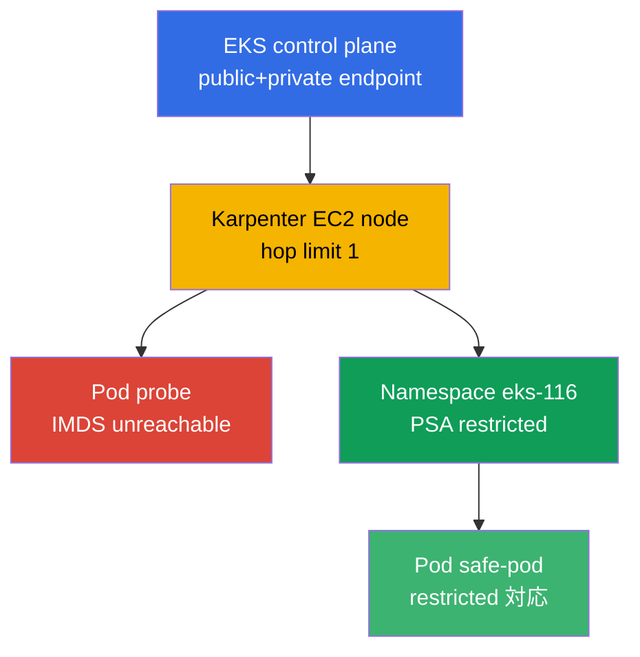
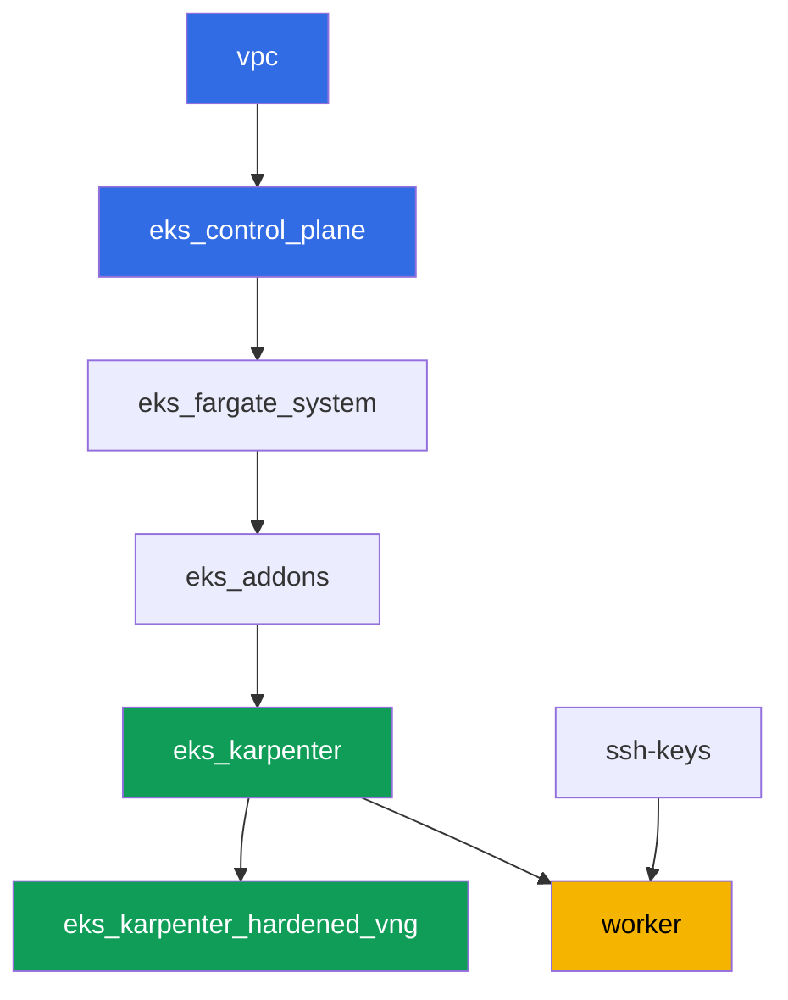

[Русская версия](README_RU.MD) · [Eng version](README.MD) · [Versión en español](README_ES.MD) · [Version française](README_FR.MD) · [Deutsche Version](README_DE.MD) · [ქართული ვერსია](README_GE.MD) · [繁體中文版](README_TW.MD)

# Lab 116 - ハードニング: IMDSv2 と hop limit、Pod Security Admission、プライベート endpoint

## 説明

デフォルトのクラスタは見た目より開放的です。通常の EC2 node 上の pod はほぼ常に
Instance Metadata Service に到達でき、アプリケーションが IRSA 経由で独自の role を
持っていても、node role の一時的な credentials を取得できてしまいます。ラベルの
ない namespace では、Pod Security Admission が警告すら出さずに privileged な pod を
通してしまいます。このラボでは両方の経路を塞ぎます: hop limit 1 の Karpenter
NodePool を設定し、症状 (pod からの IMDS リクエストがタイムアウトすること) を観察し、
AWS API を通じてそれを説明します。次に namespace 上で Pod Security Admission を有効
にし、拒否と許可される経路の両方を確認します。別のタスクでは control plane への
プライベートアクセスを確認し、完全にプライベートなクラスタに必要な VPC endpoints を
検討します。

タスクは本番スタイルで書かれています: 短い記述と受け入れ基準です。検証は
`check_result` コマンドで自動化されています。

## 目標

コースの章の内容を強化する:

- [第 19 章。ハードニング: IMDSv2、PSA、プライベートクラスタ](../../course/19/ru.md)
  - node、pod、ネットワークの防御レイヤー

## 作成するもの

| オブジェクト | それが何か | このラボにある理由 |
|--------|---------|-------------------|
| Namespace `eks-116` | ラボの負荷用のクラスタセクション | リソースを分離し、その後 PSA を付与する |
| NodePool `hardened` | `metadataOptions` を持つ EC2NodeClass | すべての node で hop limit `1` と `httpTokens=required` |
| Deployment `probe` (curlimages/curl) | IMDS を確認するための pod | 「pod から」の症状 - IMDS リクエストがタイムアウトする |
| アーティファクト `imds.txt` | pod からの IMDS リクエストの出力 | タイムアウトを記録する (hop limit が経路をブロックした) |
| アーティファクト `metadata_options.txt` | `aws ec2 describe-instances` の出力 | node 上の `HttpTokens=required`、hop limit `1` を確認する |
| `eks-116` の PSA ラベル | `enforce=restricted` | namespace 上で Pod Security Standards を有効化する |
| Pod `priv-test` (拒否される) + アーティファクト `psa_reject.txt` | privileged な pod の試行 | admission が拒否し、拒否メッセージが出る |
| Pod `safe-pod` | 完全な restricted `securityContext` を持つ pod | 同じ PSA の下で許可される経路を示す |
| アーティファクト `private_endpoint.txt` | `aws eks describe-cluster` + 説明 | control plane へのプライベートアクセスと必要な VPC endpoints |

全体像:



## インフラストラクチャ

この環境は Terragrunt を通じて AWS (`eu-central-1`) にデプロイされます。各ラボの
ディレクトリは独自の `terragrunt.hcl` を持つ 1 つのコンポーネントで、
`terraform/modules/` にある共有モジュールを参照し、`dependency` ブロックで依存関係を
宣言します。Terragrunt は依存関係グラフを構築し、コンポーネントを正しい順序で
apply します。

### モジュールと依存関係

| ディレクトリ (コンポーネント) | モジュール (`terraform/modules/`) | 依存先 | 作成されるもの |
|---------------------|-------------------------------|------------|-------------|
| `vpc` | `vpc_v3` | - | VPC `10.10.0.0/16`、2 つの AZ にあるパブリックとプライベート subnet、NAT |
| `ssh-keys` | `ssh-keys` | - | worker マシンと node 用の SSH 鍵ペア |
| `eks_control_plane` | `eks_v2_control_plane` | `vpc` | パブリックとプライベート endpoint を持つ EKS control plane `1.36` |
| `eks_fargate_system` | `eks_v2_fargate` | `vpc`, `eks_control_plane` | `kube-system` と `karpenter` 用の Fargate profile |
| `eks_addons` | `eks_v2_addons` | `eks_control_plane`, `eks_fargate_system` | coredns、kube-proxy、vpc-cni、pod-identity アドオン |
| `eks_karpenter` | `eks_v2_karpenter` | `vpc`, `eks_control_plane`, `eks_addons`, `eks_fargate_system` | Karpenter コントローラー、node の IAM role |
| `eks_karpenter_hardened_vng` | `eks_v2_karpenter_vng` | `vpc`, `eks_control_plane`, `eks_karpenter` | `metadataOptions` (hop limit `1`) を持つ NodePool `hardened` |
| `worker` | `eks_v2_work_pc` | `ssh-keys`, `vpc`, `eks_control_plane`, `eks_karpenter`, `eks_karpenter_hardened_vng` | kubectl、テスト、`check_result` を持つ worker マシン |

依存関係グラフ (先に apply されるものは矢印に沿って下側にあります):



このラボには NodePool が 1 つだけあります - `hardened`、taint なし: すべての負荷
pod はこの node に tolerations なしで配置されます。ラボ 101 のデフォルト NodePool
との違いは、`vng` にある `metadataOptions` ブロックで、EC2NodeClass がこれを
Karpenter node の launch template に渡します:

```hcl
vng = {
  labels = { work_type = "hardened" }
  name     = "hardened"
  iam_role = dependency.eks_karpenter.outputs.karpenter_module.node_iam_role_name
  tags     = merge(local.vars.locals.tags, { "Name" = "${local.vars.locals.prefix}-eks-hardened" })
  metadataOptions = {
    httpEndpoint            = "enabled"
    httpProtocolIPv6        = "disabled"
    httpPutResponseHopLimit = 1
    httpTokens              = "required"
  }
}
```

### どこで何を設定するか

`env.hcl` (すべてのコンポーネントが読む共有の環境パラメータ):

| パラメータ | このラボでの値 | 影響するもの |
|----------|-----------------|---------------|
| `region` | `eu-central-1` | すべてのリソースのリージョン |
| `vpc_default_cidr`, `subnets` | `10.10.0.0/16`、AZ ごとの subnet | VPC のアドレス計画と subnet のタグ |
| `prefix` | `eks-task116` | リソース名とタグのプレフィックス |
| `stack_name` | `eks116` | ここから `env_name` (クラスタ名) が組み立てられる |
| `k8_version` | `1.36.0` | worker マシン上の kubectl のバージョン |
| `instance_type_worker` | `t3.medium` | worker マシンの instance タイプ |
| `ssh_password_enable`, `access_cidrs` | `true`, `0.0.0.0/0` | worker マシンへの SSH アクセス |
| `root_volume` | `gp3`, `10` | worker マシンのルートディスク |

各コンポーネントの `terragrunt.hcl` にある `inputs` (個々のモジュールの設定):

| ファイル | 主要な設定 |
|------|--------------------|
| `eks_control_plane/terragrunt.hcl` | `eks.version = "1.36"`; モジュール内で `endpoint_private_access` と `endpoint_public_access` が有効 |
| `eks_karpenter_hardened_vng/terragrunt.hcl` | `vng.metadataOptions`: `httpTokens=required`、`httpPutResponseHopLimit=1`、taint なし |
| `worker/terragrunt.hcl` | ラボ 116 のファイルを指す `test_url` と `task_script_url`、`exam_time_minutes` |

## デプロイ

```bash
TASK=116 make run_eks_task
```

デプロイにはおおよそ 15-20 分かかります。出力の中から worker マシンへの SSH 接続の
行を見つけて接続してください。そこの kubectl はすでに正しいクラスタに向けて設定
済みです。

worker マシン上で使える便利なコマンド:

```bash
time_left       # 環境の残り時間
check_result    # 解答をチェックする
```

> 検証環境のセキュリティ。`env.hcl` では `ssh_password_enable = true` と
> `access_cidrs = ["0.0.0.0/0"]` が有効になっています - 学習環境には便利ですが、
> 本番環境ではこのようにしてはいけません。コースの基準 (第 0.2、2、19 章) に従えば、
> worker マシンへのアクセスは、外部に公開された SSH ポートを使わずに AWS SSM
> Session Manager 経由で開き、`access_cidrs` は特定のアドレスに絞り込みます。ここで
> は起動の簡便さのためだけに、公開の SSH をそのままにしています。

## タスク

---
|        **1**        | **ラボの負荷用の namespace**                             |
| :-----------------: | :---------------------------------------------------------- |
| やること          | `eks-116` という名前の namespace を作成してください。ラボのすべてのオブジェクトはこの中に作成されます。 |
| 受け入れ基準    | - namespace `eks-116` が存在する。 |
---
|        **2**        | **症状: pod から IMDS に到達できない**                        |
| :-----------------: | :---------------------------------------------------------- |
| やること          | `eks-116` に Deployment `probe` を作成してください。image は `curlimages/curl:latest`、replica は `1`、コンテナには `kubectl exec` できるようにスリープする `command` (例えば `sleep 3600`) を設定します。pod から IMDSv2 リクエストを実行してください: まず token を取得する `PUT` (`http://169.254.169.254/latest/api/token`、ヘッダー `X-aws-ec2-metadata-token-ttl-seconds: 21600`)、次に token を使った `GET` を `.../meta-data/iam/security-credentials/` に対して実行します。リクエストに時間制限を設定してください (`--max-time 5`) - NodePool `hardened` は `httpPutResponseHopLimit=1` を保持しているため、pod からのリクエストはタイムアウトするはずです。出力 (タイムアウトした事実を含む) をファイル `/var/work/tests/artifacts/2/imds.txt` に保存してください。 |
| 受け入れ基準    | - `eks-116` に Deployment `probe`、image `curlimages/curl`、`1` つの ready な replica;<br/>- ファイル `2/imds.txt` が空でなく、タイムアウト (`timeout`/`timed out`) について言及している。 |
---
|        **3**        | **AWS API による確認: node 上の hop limit と IMDSv2**       |
| :-----------------: | :---------------------------------------------------------- |
| やること          | `probe` pod が動いている node を特定し (`kubectl get po ... -o jsonpath='{.items[0].spec.nodeName}'`)、その `providerID` を取得し (`kubectl get node <node> -o jsonpath='{.spec.providerID}'`)、instance id (`i-...` 形式の最後のセグメント) を抜き出してください。`aws ec2 describe-instances --instance-ids <id> --query 'Reservations[].Instances[].MetadataOptions' --output json` を実行し、出力を `/var/work/tests/artifacts/3/metadata_options.txt` に保存してください。出力の中で `HttpTokens: required` と `HttpPutResponseHopLimit: 1` を確認してください。 |
| 受け入れ基準    | - ファイル `3/metadata_options.txt` が空でない;<br/>- 値が `1` の `HttpPutResponseHopLimit` と値が `required` の `HttpTokens` を含む。 |
---
|        **4**        | **Pod Security Admission: privileged な pod の拒否**    |
| :-----------------: | :---------------------------------------------------------- |
| やること          | `eks-116` namespace にラベル `pod-security.kubernetes.io/enforce=restricted` と `pod-security.kubernetes.io/enforce-version=latest` を付けてください。`securityContext.privileged: true` を持つ Pod `priv-test` (image `busybox`) の作成を試してください。admission は pod の作成を拒否するはずです (pod はクラスタに現れません)。拒否メッセージをファイル `/var/work/tests/artifacts/4/psa_reject.txt` に保存してください。 |
| 受け入れ基準    | - namespace `eks-116` にラベル `enforce=restricted` がある;<br/>- pod `priv-test` が作成されていない;<br/>- ファイル `4/psa_reject.txt` が空でなく、`privileged` と `restricted`/`violat` について言及している。 |
---
|        **5**        | **許可される経路: restricted に適合する pod**          |
| :-----------------: | :---------------------------------------------------------- |
| やること          | `eks-116` に `restricted` プロファイルに適合する Pod `safe-pod` を作成してください: `securityContext.runAsNonRoot: true`、`runAsUser` にはゼロでない任意の UID を設定します (image `busybox` はデフォルトで root として実行され、明示的な `runAsUser` がないと admission を通過した後でも kubelet がコンテナの起動を拒否します)、pod レベルの `seccompProfile.type: RuntimeDefault`、コンテナレベルの `allowPrivilegeEscalation: false` と `capabilities.drop: ["ALL"]`。この pod は admission を通過し、`Running` に達するはずです。 |
| 受け入れ基準    | - `eks-116` の Pod `safe-pod` が `Running` 状態である;<br/>- `spec.securityContext.runAsNonRoot` が `true` に等しい。 |
---
|        **6**        | **control plane へのプライベートアクセスと VPC endpoints**           |
| :-----------------: | :---------------------------------------------------------- |
| やること          | `aws eks describe-cluster --name <cluster> --query 'cluster.resourcesVpcConfig' --output json` を実行し、`endpointPrivateAccess: true` であることを確認してください。出力をファイル `/var/work/tests/artifacts/6/private_endpoint.txt` に保存してください。インターネットアクセスのない完全にプライベートなクラスタに必要な VPC endpoints (`ecr.api`、`ecr.dkr`、`s3`、`sts`、`ec2`、`logs`、`eks`) について、そして ECR endpoints があってもなぜ S3 endpoint が必須なのか (イメージのレイヤーは S3 に置かれている) について、説明 (3-4 文) をファイルに追記してください。 |
| 受け入れ基準    | - ファイル `6/private_endpoint.txt` が空でない;<br/>- `true` (`endpointPrivateAccess` の値) を含み、`s3` と `ecr` について言及している。 |
---

## 結果の確認

worker マシン上で自動チェックを実行してください:

```bash
check_result
```

スクリプトがテストを実行し、完了したタスクの割合を表示します。

## 解答

参考解答: [worker/files/solutions/1_JP.MD](worker/files/solutions/1_JP.MD)

## クラスタとリソースの削除

タスク 2-5 の負荷 (`probe`、`priv-test`、`safe-pod`) が namespace `eks-116` にあった
ことで、Karpenter は EC2 node `hardened` を立ち上げました。Terraform はこの node を
認識していません - 早すぎるタイミングで `destroy` を始めると、孤立した EC2 node が
ENI を保持し、VPC/subnet の削除をブロックします (ラボ 108、109、111、114、115 と
同じパターンです)。`destroy` の前に負荷を取り除き、Karpenter 自身が EC2 instance を
削除するのを待ってください:

```bash
# 1. Karpenter に EC2 node を立ち上げさせた負荷を取り除く
kubectl delete namespace eks-116

# 2. Karpenter 自身が EC2 node を削除する (Node オブジェクトを削除するだけでなく、
#    EC2 instance 自体を終了させる) のを待つ - 両方の出力が空になるはず
for i in $(seq 1 30); do
  nc=$(kubectl get nodeclaims --no-headers 2>/dev/null | wc -l)
  ec2=$(aws ec2 describe-instances \
    --filters "Name=tag:karpenter.sh/nodepool,Values=hardened" \
      "Name=instance-state-name,Values=running,pending,stopping,stopped" \
    --query 'Reservations[].Instances[]' --output text)
  echo "nodeclaims=$nc ec2_instances=[$ec2]"
  [[ "$nc" == "0" ]] && [[ -z "$ec2" ]] && break
  sleep 10
done
```

`nodeclaims=0` になり、EC2 instance の一覧が空になった後で初めて、terraform リソース
の削除を実行してください:

```bash
TASK=116 make delete_eks_task
```
