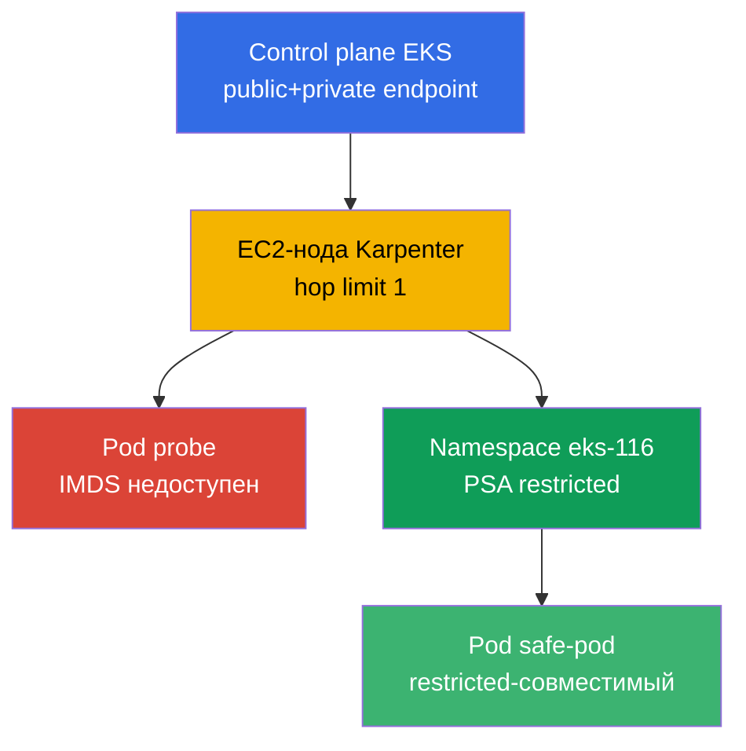
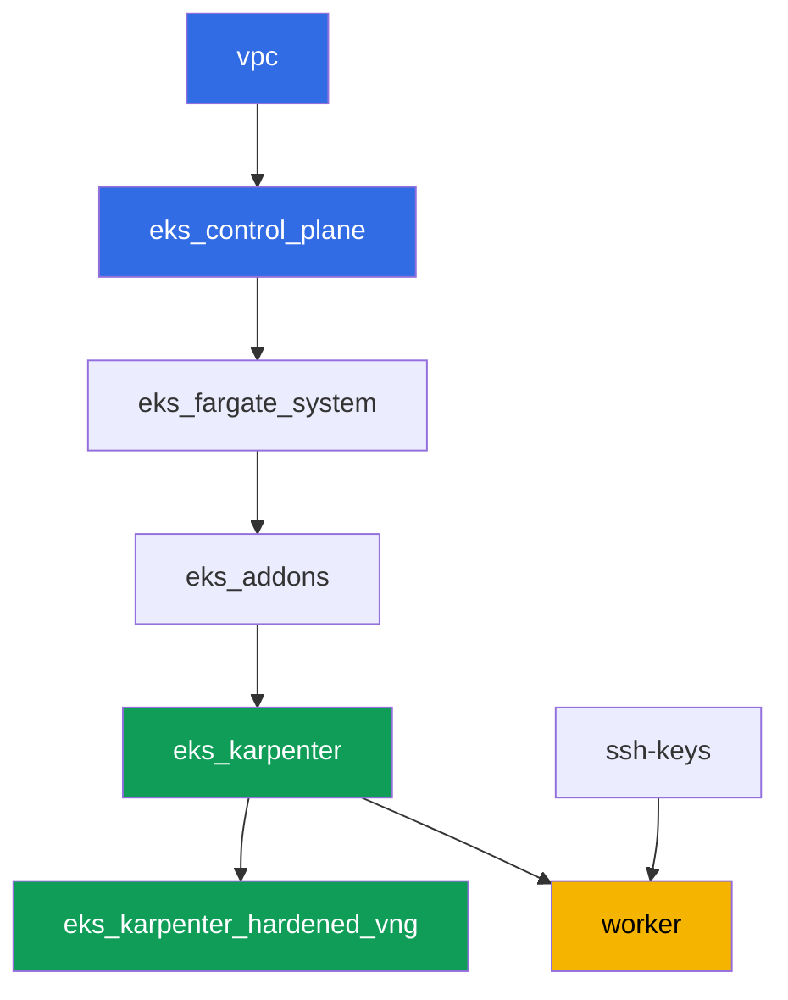

# Лаба 116 - Харденинг: IMDSv2 и hop limit, Pod Security Admission, приватный endpoint

## Описание

Кластер по умолчанию открыт шире, чем кажется. Под на обычной EC2-ноде почти всегда
достаёт до Instance Metadata Service и может забрать временные креды роли ноды, даже
если у приложения своя роль через IRSA. Namespace без лейблов Pod Security Admission
пропускает привилегированный под без единого предупреждения. В этой лабе вы закрываете
оба пути: настраиваете NodePool Karpenter с hop limit 1, наблюдаете симптом (таймаут
запроса к IMDS из пода) и объясняете его через AWS API, затем включаете Pod Security
Admission на namespace и проверяете отказ и разрешённый путь. Отдельным заданием
подтверждаете приватный доступ к control plane и разбираете, какие VPC endpoints нужны
для полностью приватного кластера.

Задания в продакшн-стиле: короткая постановка плюс критерии приёмки. Проверка -
автоматическая, командой `check_result`.

## Цель

Закрепить материал главы курса:

- [Глава 19. Харденинг: IMDSv2, PSA, приватный кластер](../../course/19/ru.md) - слои
  защиты узла, пода и сети

## Что мы создаём

| Объект | Что это | Зачем в этой лабе |
|--------|---------|-------------------|
| Namespace `eks-116` | раздел кластера под нагрузку лабы | держим ресурсы отдельно, потом навешиваем PSA |
| NodePool `hardened` | EC2NodeClass с `metadataOptions` | hop limit `1` и `httpTokens=required` на всех нодах |
| Deployment `probe` (curlimages/curl) | под для проверки IMDS | симптом «от пода» - запрос к IMDS падает по таймауту |
| Артефакт `imds.txt` | вывод запроса к IMDS из пода | фиксируем таймаут (hop limit закрыл путь) |
| Артефакт `metadata_options.txt` | вывод `aws ec2 describe-instances` | подтверждаем `HttpTokens=required`, hop limit `1` на ноде |
| Лейблы PSA на `eks-116` | `enforce=restricted` | включаем Pod Security Standards на namespace |
| Pod `priv-test` (отклонён) + артефакт `psa_reject.txt` | попытка привилегированного пода | admission отказывает, сообщение об отказе |
| Pod `safe-pod` | под с полным `securityContext` restricted | показывает разрешённый путь под тем же PSA |
| Артефакт `private_endpoint.txt` | `aws eks describe-cluster` + пояснение | приватный доступ control plane и нужные VPC endpoints |

Итоговая картина:



## Инфраструктура

Окружение разворачивается в AWS (`eu-central-1`) через Terragrunt. Каждый каталог лабы -
это один компонент со своим `terragrunt.hcl`, который ссылается на общий модуль в
`terraform/modules/` и объявляет зависимости через блоки `dependency`. Terragrunt строит
граф зависимостей и применяет компоненты в правильном порядке.

### Модули и зависимости

| Каталог (компонент) | Модуль (`terraform/modules/`) | Зависит от | Что создаёт |
|---------------------|-------------------------------|------------|-------------|
| `vpc` | `vpc_v3` | - | VPC `10.10.0.0/16`, публичные и приватные подсети в двух AZ, NAT |
| `ssh-keys` | `ssh-keys` | - | пара SSH-ключей для рабочей машины и нод |
| `eks_control_plane` | `eks_v2_control_plane` | `vpc` | control plane EKS `1.36` с public и private endpoint |
| `eks_fargate_system` | `eks_v2_fargate` | `vpc`, `eks_control_plane` | Fargate-профиль для `kube-system` и `karpenter` |
| `eks_addons` | `eks_v2_addons` | `eks_control_plane`, `eks_fargate_system` | аддоны coredns, kube-proxy, vpc-cni, pod-identity |
| `eks_karpenter` | `eks_v2_karpenter` | `vpc`, `eks_control_plane`, `eks_addons`, `eks_fargate_system` | контроллер Karpenter, IAM-роль нод |
| `eks_karpenter_hardened_vng` | `eks_v2_karpenter_vng` | `vpc`, `eks_control_plane`, `eks_karpenter` | NodePool `hardened` с `metadataOptions` (hop limit `1`) |
| `worker` | `eks_v2_work_pc` | `ssh-keys`, `vpc`, `eks_control_plane`, `eks_karpenter`, `eks_karpenter_hardened_vng` | рабочая машина с kubectl, тестами и `check_result` |

Граф зависимостей (что применяется раньше, то ниже по стрелке):



В этой лабе единственный NodePool - `hardened`, без taint: все рабочие поды попадают на
него без tolerations. Отличие от дефолтного NodePool лабы 101 - блок `metadataOptions`
в `vng`, который EC2NodeClass передаёт в launch template ноды Karpenter:

```hcl
vng = {
  labels = { work_type = "hardened" }
  name     = "hardened"
  iam_role = dependency.eks_karpenter.outputs.karpenter_module.node_iam_role_name
  tags     = merge(local.vars.locals.tags, { "Name" = "${local.vars.locals.prefix}-eks-hardened" })
  metadataOptions = {
    httpEndpoint            = "enabled"
    httpProtocolIPv6        = "disabled"
    httpPutResponseHopLimit = 1
    httpTokens              = "required"
  }
}
```

### Где что настраивается

`env.hcl` (общие параметры окружения, читаются всеми компонентами):

| Параметр | Значение в лабе | На что влияет |
|----------|-----------------|---------------|
| `region` | `eu-central-1` | регион всех ресурсов |
| `vpc_default_cidr`, `subnets` | `10.10.0.0/16`, подсети по AZ | адресный план VPC и теги подсетей |
| `prefix` | `eks-task116` | префикс имён ресурсов и тегов |
| `stack_name` | `eks116` | из него собирается `env_name` - имя кластера |
| `k8_version` | `1.36.0` | версия kubectl на рабочей машине |
| `instance_type_worker` | `t3.medium` | тип инстанса рабочей машины |
| `ssh_password_enable`, `access_cidrs` | `true`, `0.0.0.0/0` | доступ по SSH к рабочей машине |
| `root_volume` | `gp3`, `10` | корневой диск рабочей машины |

`inputs` в `terragrunt.hcl` каждого компонента (параметры конкретного модуля):

| Файл | Ключевые настройки |
|------|--------------------|
| `eks_control_plane/terragrunt.hcl` | `eks.version = "1.36"`; `endpoint_private_access` и `endpoint_public_access` включены в модуле |
| `eks_karpenter_hardened_vng/terragrunt.hcl` | `vng.metadataOptions`: `httpTokens=required`, `httpPutResponseHopLimit=1`, без taint |
| `worker/terragrunt.hcl` | `test_url` и `task_script_url` на файлы лабы 116, `exam_time_minutes` |

## Развёртывание

```bash
TASK=116 make run_eks_task
```

Развёртывание занимает примерно 15-20 минут. В выводе найдите строку с SSH-подключением к
рабочей машине и подключитесь к ней. kubectl там уже настроен на нужный кластер.

Полезные команды на рабочей машине:

```bash
time_left       # сколько осталось времени окружения
check_result    # проверить решение
```

> Безопасность стенда. В `env.hcl` включены `ssh_password_enable = true` и
> `access_cidrs = ["0.0.0.0/0"]` - это удобно для учебного окружения, но так делать в
> продакшене нельзя. По стандартам курса (главы 0.2, 2, 19) доступ к рабочим машинам
> открывают через AWS SSM Session Manager без публичных SSH-портов наружу, а `access_cidrs`
> сужают до конкретных адресов. Здесь публичный SSH оставлен только ради простоты запуска.

## Задания

---
|        **1**        | **Namespace для нагрузки лабы**                             |
| :-----------------: | :---------------------------------------------------------- |
| Что делаем          | Создайте namespace с именем `eks-116`. Все объекты лабы создаются внутри него. |
| Критерии приёмки    | - namespace `eks-116` существует. |
---
|        **2**        | **Симптом: IMDS недоступен из пода**                        |
| :-----------------: | :---------------------------------------------------------- |
| Что делаем          | В `eks-116` создайте Deployment `probe`, образ `curlimages/curl:latest`, `1` реплика, контейнер со спящим `command` (например `sleep 3600`), чтобы можно было `kubectl exec`. Из пода выполните запрос к IMDSv2: сначала `PUT` за токеном (`http://169.254.169.254/latest/api/token`, заголовок `X-aws-ec2-metadata-token-ttl-seconds: 21600`), затем `GET` с токеном на `.../meta-data/iam/security-credentials/`. Ограничьте запрос по времени (`--max-time 5`) - NodePool `hardened` держит `httpPutResponseHopLimit=1`, поэтому запрос из пода должен упасть по таймауту. Сохраните вывод (включая факт таймаута) в файл `/var/work/tests/artifacts/2/imds.txt`. |
| Критерии приёмки    | - Deployment `probe` в `eks-116`, образ `curlimages/curl`, `1` готовая реплика;<br/>- файл `2/imds.txt` не пуст и упоминает таймаут (`timeout`/`timed out`). |
---
|        **3**        | **Проверка через AWS API: hop limit и IMDSv2 на ноде**       |
| :-----------------: | :---------------------------------------------------------- |
| Что делаем          | Определите ноду пода `probe` (`kubectl get po ... -o jsonpath='{.items[0].spec.nodeName}'`), возьмите её `providerID` (`kubectl get node <node> -o jsonpath='{.spec.providerID}'`) и извлеките id инстанса (последний сегмент вида `i-...`). Выполните `aws ec2 describe-instances --instance-ids <id> --query 'Reservations[].Instances[].MetadataOptions' --output json` и сохраните вывод в `/var/work/tests/artifacts/3/metadata_options.txt`. Подтвердите в выводе `HttpTokens: required` и `HttpPutResponseHopLimit: 1`. |
| Критерии приёмки    | - файл `3/metadata_options.txt` не пуст;<br/>- содержит `HttpPutResponseHopLimit` со значением `1` и `HttpTokens` со значением `required`. |
---
|        **4**        | **Pod Security Admission: отказ привилегированному поду**    |
| :-----------------: | :---------------------------------------------------------- |
| Что делаем          | Навесьте на namespace `eks-116` лейблы `pod-security.kubernetes.io/enforce=restricted` и `pod-security.kubernetes.io/enforce-version=latest`. Попытайтесь создать Pod `priv-test` (образ `busybox`) с `securityContext.privileged: true`. Admission должен отклонить создание пода (под не появится в кластере). Сохраните сообщение об отказе в файл `/var/work/tests/artifacts/4/psa_reject.txt`. |
| Критерии приёмки    | - namespace `eks-116` имеет лейбл `enforce=restricted`;<br/>- pod `priv-test` не создан;<br/>- файл `4/psa_reject.txt` не пуст и упоминает `privileged` и `restricted`/`violat`. |
---
|        **5**        | **Разрешённый путь: под, совместимый с restricted**          |
| :-----------------: | :---------------------------------------------------------- |
| Что делаем          | В `eks-116` создайте Pod `safe-pod`, соответствующий профилю `restricted`: `securityContext.runAsNonRoot: true`, `seccompProfile.type: RuntimeDefault` на уровне пода, а на уровне контейнера `allowPrivilegeEscalation: false` и `capabilities.drop: ["ALL"]`. Под должен пройти admission и перейти в `Running`. |
| Критерии приёмки    | - Pod `safe-pod` в `eks-116` в состоянии `Running`;<br/>- `spec.securityContext.runAsNonRoot` равно `true`. |
---
|        **6**        | **Приватный доступ control plane и VPC endpoints**           |
| :-----------------: | :---------------------------------------------------------- |
| Что делаем          | Выполните `aws eks describe-cluster --name <cluster> --query 'cluster.resourcesVpcConfig' --output json` и подтвердите, что `endpointPrivateAccess: true`. Сохраните вывод в файл `/var/work/tests/artifacts/6/private_endpoint.txt`. Дополните файл объяснением (3-4 предложения), какие VPC endpoints понадобились бы для полностью приватного кластера без выхода в интернет (`ecr.api`, `ecr.dkr`, `s3`, `sts`, `ec2`, `logs`, `eks`) и почему S3 endpoint обязателен даже при наличии ECR endpoints (слои образов лежат в S3). |
| Критерии приёмки    | - файл `6/private_endpoint.txt` не пуст;<br/>- содержит `true` (значение `endpointPrivateAccess`) и упоминает `s3` и `ecr`. |
---

## Проверка результата

На рабочей машине запустите автоматическую проверку:

```bash
check_result
```

Скрипт прогонит тесты и покажет процент выполненных заданий.

## Решение

Эталонное решение: [worker/files/solutions/1.MD](worker/files/solutions/1.MD)

## Удаление кластера и ресурсов

```bash
TASK=116 make delete_eks_task
```
