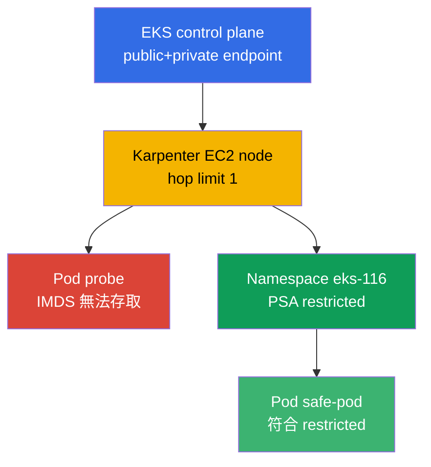
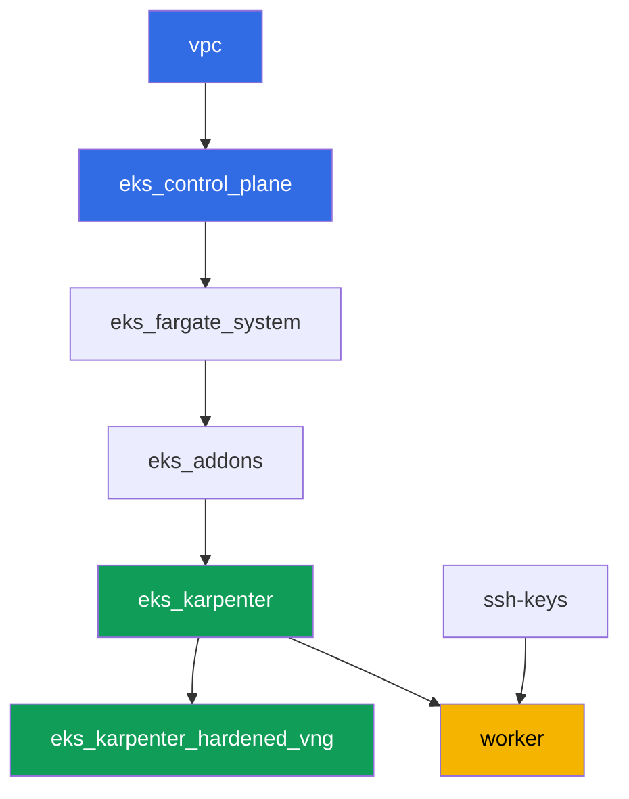

[Русская версия](README_RU.MD) · [Eng version](README.MD) · [Versión en español](README_ES.MD) · [Version française](README_FR.MD) · [Deutsche Version](README_DE.MD) · [ქართული ვერსია](README_GE.MD) · [日本語版](README_JP.MD)

# Lab 116 - 強化措施:IMDSv2 與 hop limit、Pod Security Admission、私有 endpoint

## 說明

預設的 cluster 比看起來更開放。一般 EC2 node 上的 pod 幾乎總是能存取 Instance
Metadata Service,即使應用程式透過 IRSA 擁有自己的 role,也能拿到 node role 的暫時
credentials。沒有標籤的 namespace 會讓 Pod Security Admission 毫無警告地放行
privileged pod。在這個 lab 裡,你會關閉這兩條路:設定 hop limit 為 1 的 Karpenter
NodePool,觀察症狀 (從 pod 發出的 IMDS 請求逾時),並透過 AWS API 解釋原因,接著在
namespace 上啟用 Pod Security Admission,並驗證拒絕與被允許的路徑。另外還有一項獨立
任務,用來確認 control plane 的私有存取,並分析完全私有 cluster 需要哪些 VPC
endpoints。

任務以正式環境的風格撰寫:簡短的說明加上驗收標準。驗證是自動的,透過 `check_result`
指令完成。

## 目標

鞏固課程章節內容:

- [第 19 章。強化措施:IMDSv2、PSA、私有 cluster](../../course/19/ru.md) - node、pod
  與網路的防護層

## 我們會建立什麼

| 物件 | 是什麼 | 為什麼在這個 lab 裡 |
|--------|---------|-------------------|
| Namespace `eks-116` | lab 負載所屬的 cluster 區段 | 讓資源保持獨立,之後再加上 PSA |
| NodePool `hardened` | 帶有 `metadataOptions` 的 EC2NodeClass | 所有 node 上的 hop limit `1` 和 `httpTokens=required` |
| Deployment `probe` (curlimages/curl) | 用來檢查 IMDS 的 pod | 「來自 pod」的症狀 - IMDS 請求逾時 |
| 產出物 `imds.txt` | 從 pod 發出 IMDS 請求的輸出 | 記錄逾時 (hop limit 阻斷了路徑) |
| 產出物 `metadata_options.txt` | `aws ec2 describe-instances` 的輸出 | 確認 node 上的 `HttpTokens=required`、hop limit `1` |
| `eks-116` 上的 PSA 標籤 | `enforce=restricted` | 在 namespace 上啟用 Pod Security Standards |
| Pod `priv-test` (被拒絕) + 產出物 `psa_reject.txt` | 嘗試建立 privileged pod | admission 拒絕建立,並附上拒絕訊息 |
| Pod `safe-pod` | 具備完整 restricted `securityContext` 的 pod | 展示同一個 PSA 下被允許的路徑 |
| 產出物 `private_endpoint.txt` | `aws eks describe-cluster` + 說明 | control plane 的私有存取和所需的 VPC endpoints |

整體架構:



## 基礎架構

此環境透過 Terragrunt 部署在 AWS (`eu-central-1`) 上。每個 lab 目錄都是一個獨立的
元件,擁有自己的 `terragrunt.hcl`,它會參照 `terraform/modules/` 裡的共用模組,並透過
`dependency` 區塊宣告依賴關係。Terragrunt 會建立依賴關係圖,並按正確順序套用各個
元件。

### 模組與依賴關係

| 目錄 (元件) | 模組 (`terraform/modules/`) | 依賴於 | 建立的內容 |
|---------------------|-------------------------------|------------|-------------|
| `vpc` | `vpc_v3` | - | VPC `10.10.0.0/16`,兩個 AZ 裡的公有和私有 subnet,NAT |
| `ssh-keys` | `ssh-keys` | - | worker 機器和 node 用的一組 SSH 金鑰 |
| `eks_control_plane` | `eks_v2_control_plane` | `vpc` | 帶有公有和私有 endpoint 的 EKS control plane `1.36` |
| `eks_fargate_system` | `eks_v2_fargate` | `vpc`, `eks_control_plane` | `kube-system` 和 `karpenter` 用的 Fargate profile |
| `eks_addons` | `eks_v2_addons` | `eks_control_plane`, `eks_fargate_system` | coredns、kube-proxy、vpc-cni、pod-identity 等 add-on |
| `eks_karpenter` | `eks_v2_karpenter` | `vpc`, `eks_control_plane`, `eks_addons`, `eks_fargate_system` | Karpenter controller,node 的 IAM role |
| `eks_karpenter_hardened_vng` | `eks_v2_karpenter_vng` | `vpc`, `eks_control_plane`, `eks_karpenter` | 帶有 `metadataOptions` (hop limit `1`) 的 NodePool `hardened` |
| `worker` | `eks_v2_work_pc` | `ssh-keys`, `vpc`, `eks_control_plane`, `eks_karpenter`, `eks_karpenter_hardened_vng` | 帶有 kubectl、測試和 `check_result` 的 worker 機器 |

依賴關係圖 (較早套用的元件在箭頭方向的較下方):



這個 lab 裡只有一個 NodePool - `hardened`,沒有 taint:所有負載 pod 都會落在它
上面,不需要 tolerations。與 lab 101 預設 NodePool 的差異在於 `vng` 裡的
`metadataOptions` 區塊,EC2NodeClass 會把它傳給 Karpenter node 的 launch template:

```hcl
vng = {
  labels = { work_type = "hardened" }
  name     = "hardened"
  iam_role = dependency.eks_karpenter.outputs.karpenter_module.node_iam_role_name
  tags     = merge(local.vars.locals.tags, { "Name" = "${local.vars.locals.prefix}-eks-hardened" })
  metadataOptions = {
    httpEndpoint            = "enabled"
    httpProtocolIPv6        = "disabled"
    httpPutResponseHopLimit = 1
    httpTokens              = "required"
  }
}
```

### 哪裡設定什麼

`env.hcl` (所有元件共用的環境參數):

| 參數 | 這個 lab 裡的值 | 影響什麼 |
|----------|-----------------|---------------|
| `region` | `eu-central-1` | 所有資源所在的區域 |
| `vpc_default_cidr`, `subnets` | `10.10.0.0/16`,依 AZ 劃分的 subnet | VPC 的定址規劃和 subnet 標籤 |
| `prefix` | `eks-task116` | 資源名稱和標籤的前綴 |
| `stack_name` | `eks116` | 用來組成 `env_name` - cluster 名稱 |
| `k8_version` | `1.36.0` | worker 機器上的 kubectl 版本 |
| `instance_type_worker` | `t3.medium` | worker 機器的 instance 類型 |
| `ssh_password_enable`, `access_cidrs` | `true`, `0.0.0.0/0` | 對 worker 機器的 SSH 存取 |
| `root_volume` | `gp3`, `10` | worker 機器的 root 磁碟 |

每個元件的 `terragrunt.hcl` 裡的 `inputs` (特定模組的設定):

| 檔案 | 主要設定 |
|------|--------------------|
| `eks_control_plane/terragrunt.hcl` | `eks.version = "1.36"`;模組中啟用 `endpoint_private_access` 和 `endpoint_public_access` |
| `eks_karpenter_hardened_vng/terragrunt.hcl` | `vng.metadataOptions`:`httpTokens=required`、`httpPutResponseHopLimit=1`,沒有 taint |
| `worker/terragrunt.hcl` | 指向 lab 116 檔案的 `test_url` 和 `task_script_url`、`exam_time_minutes` |

## 部署

```bash
TASK=116 make run_eks_task
```

部署大約需要 15-20 分鐘。在輸出裡找到連往 worker 機器的 SSH 連線那一行,然後連線
過去。那裡的 kubectl 已經配置好指向正確的 cluster。

worker 機器上的實用指令:

```bash
time_left       # 環境還剩多少時間
check_result    # 檢查解答
```

> 練習環境的安全性。`env.hcl` 裡啟用了 `ssh_password_enable = true` 和
> `access_cidrs = ["0.0.0.0/0"]` - 對訓練環境很方便,但在正式環境中不該這樣做。
> 依照課程標準 (第 0.2、2、19 章),對 worker 機器的存取應該透過 AWS SSM Session
> Manager 開放,不對外開放公有 SSH port,`access_cidrs` 也應該縮小到特定位址。這裡
> 保留公有 SSH 只是為了方便啟動。

## 任務

---
|        **1**        | **lab 負載用的 namespace**                             |
| :-----------------: | :---------------------------------------------------------- |
| 該做什麼          | 建立一個名為 `eks-116` 的 namespace。lab 所有的物件都會在裡面建立。 |
| 驗收標準    | - namespace `eks-116` 存在。 |
---
|        **2**        | **症狀:從 pod 無法存取 IMDS**                        |
| :-----------------: | :---------------------------------------------------------- |
| 該做什麼          | 在 `eks-116` 裡建立 Deployment `probe`,image 為 `curlimages/curl:latest`,`1` 個 replica,容器帶有休眠的 `command` (例如 `sleep 3600`),以便能夠 `kubectl exec`。從 pod 發出 IMDSv2 請求:先用 `PUT` 取得 token (`http://169.254.169.254/latest/api/token`,header `X-aws-ec2-metadata-token-ttl-seconds: 21600`),再用帶 token 的 `GET` 存取 `.../meta-data/iam/security-credentials/`。限制請求時間 (`--max-time 5`) - NodePool `hardened` 保持 `httpPutResponseHopLimit=1`,所以從 pod 發出的請求應該逾時。將輸出 (包含逾時的事實) 存到檔案 `/var/work/tests/artifacts/2/imds.txt`。 |
| 驗收標準    | - `eks-116` 裡有 Deployment `probe`,image 為 `curlimages/curl`,`1` 個就緒的 replica;<br/>- 檔案 `2/imds.txt` 不是空的,且提到逾時 (`timeout`/`timed out`)。 |
---
|        **3**        | **透過 AWS API 驗證:node 上的 hop limit 和 IMDSv2**       |
| :-----------------: | :---------------------------------------------------------- |
| 該做什麼          | 確定 `probe` pod 所在的 node (`kubectl get po ... -o jsonpath='{.items[0].spec.nodeName}'`),取得其 `providerID` (`kubectl get node <node> -o jsonpath='{.spec.providerID}'`),並提取 instance id (最後一段,格式為 `i-...`)。執行 `aws ec2 describe-instances --instance-ids <id> --query 'Reservations[].Instances[].MetadataOptions' --output json`,並將輸出存到 `/var/work/tests/artifacts/3/metadata_options.txt`。在輸出中確認 `HttpTokens: required` 和 `HttpPutResponseHopLimit: 1`。 |
| 驗收標準    | - 檔案 `3/metadata_options.txt` 不是空的;<br/>- 包含值為 `1` 的 `HttpPutResponseHopLimit` 和值為 `required` 的 `HttpTokens`。 |
---
|        **4**        | **Pod Security Admission:拒絕 privileged pod**    |
| :-----------------: | :---------------------------------------------------------- |
| 該做什麼          | 在 `eks-116` namespace 上加上標籤 `pod-security.kubernetes.io/enforce=restricted` 和 `pod-security.kubernetes.io/enforce-version=latest`。嘗試建立帶有 `securityContext.privileged: true` 的 Pod `priv-test` (image `busybox`)。admission 應該拒絕建立這個 pod (該 pod 不會出現在 cluster 裡)。將拒絕訊息存到檔案 `/var/work/tests/artifacts/4/psa_reject.txt`。 |
| 驗收標準    | - namespace `eks-116` 帶有標籤 `enforce=restricted`;<br/>- pod `priv-test` 沒有被建立;<br/>- 檔案 `4/psa_reject.txt` 不是空的,且提到 `privileged` 和 `restricted`/`violat`。 |
---
|        **5**        | **被允許的路徑:符合 restricted 的 pod**          |
| :-----------------: | :---------------------------------------------------------- |
| 該做什麼          | 在 `eks-116` 裡建立符合 `restricted` profile 的 Pod `safe-pod`:`securityContext.runAsNonRoot: true`,`runAsUser` 設為任何非零的 UID (image `busybox` 預設以 root 身份執行,若沒有明確的 `runAsUser`,kubelet 即使在 admission 之後也會拒絕啟動容器),pod 層級的 `seccompProfile.type: RuntimeDefault`,容器層級的 `allowPrivilegeEscalation: false` 和 `capabilities.drop: ["ALL"]`。這個 pod 應該通過 admission,並進入 `Running` 狀態。 |
| 驗收標準    | - `eks-116` 裡的 Pod `safe-pod` 處於 `Running` 狀態;<br/>- `spec.securityContext.runAsNonRoot` 等於 `true`。 |
---
|        **6**        | **control plane 的私有存取和 VPC endpoints**           |
| :-----------------: | :---------------------------------------------------------- |
| 該做什麼          | 執行 `aws eks describe-cluster --name <cluster> --query 'cluster.resourcesVpcConfig' --output json`,並確認 `endpointPrivateAccess: true`。將輸出存到檔案 `/var/work/tests/artifacts/6/private_endpoint.txt`。在檔案裡補上一段說明 (3-4 句),說明完全私有、沒有網際網路出口的 cluster 需要哪些 VPC endpoints (`ecr.api`、`ecr.dkr`、`s3`、`sts`、`ec2`、`logs`、`eks`),以及為什麼即使已經有 ECR endpoints,S3 endpoint 仍然是必要的 (image 的 layer 存放在 S3 裡)。 |
| 驗收標準    | - 檔案 `6/private_endpoint.txt` 不是空的;<br/>- 包含 `true` (`endpointPrivateAccess` 的值),並提到 `s3` 和 `ecr`。 |
---

## 檢查結果

在 worker 機器上執行自動檢查:

```bash
check_result
```

腳本會執行測試,並顯示已完成任務的百分比。

## 解答

參考解答:[worker/files/solutions/1_TW.MD](worker/files/solutions/1_TW.MD)

## 刪除 cluster 和資源

任務 2-5 的負載 (`probe`、`priv-test`、`safe-pod`) 在 namespace `eks-116` 裡讓
Karpenter 拉起了 `hardened` EC2 node。Terraform 並不知道這個 node 的存在 - 如果太早
開始 `destroy`,這個孤兒 EC2 node 會持有 ENI,阻礙 VPC/subnet 的刪除 (和 lab 108、
109、111、114、115 裡一樣的模式)。在 `destroy` 之前,先移除負載,並等待 Karpenter
自行移除該 EC2 instance:

```bash
# 1. 移除讓 Karpenter 拉起 EC2 node 的負載
kubectl delete namespace eks-116

# 2. 等待 Karpenter 自行移除 EC2 node (不只是刪除 Node 物件,而是終止 EC2 instance
#    本身) - 兩個輸出都應該是空的
for i in $(seq 1 30); do
  nc=$(kubectl get nodeclaims --no-headers 2>/dev/null | wc -l)
  ec2=$(aws ec2 describe-instances \
    --filters "Name=tag:karpenter.sh/nodepool,Values=hardened" \
      "Name=instance-state-name,Values=running,pending,stopping,stopped" \
    --query 'Reservations[].Instances[]' --output text)
  echo "nodeclaims=$nc ec2_instances=[$ec2]"
  [[ "$nc" == "0" ]] && [[ -z "$ec2" ]] && break
  sleep 10
done
```

只有在 `nodeclaims=0` 且 EC2 instance 清單為空之後,才能開始刪除 terraform 資源:

```bash
TASK=116 make delete_eks_task
```
