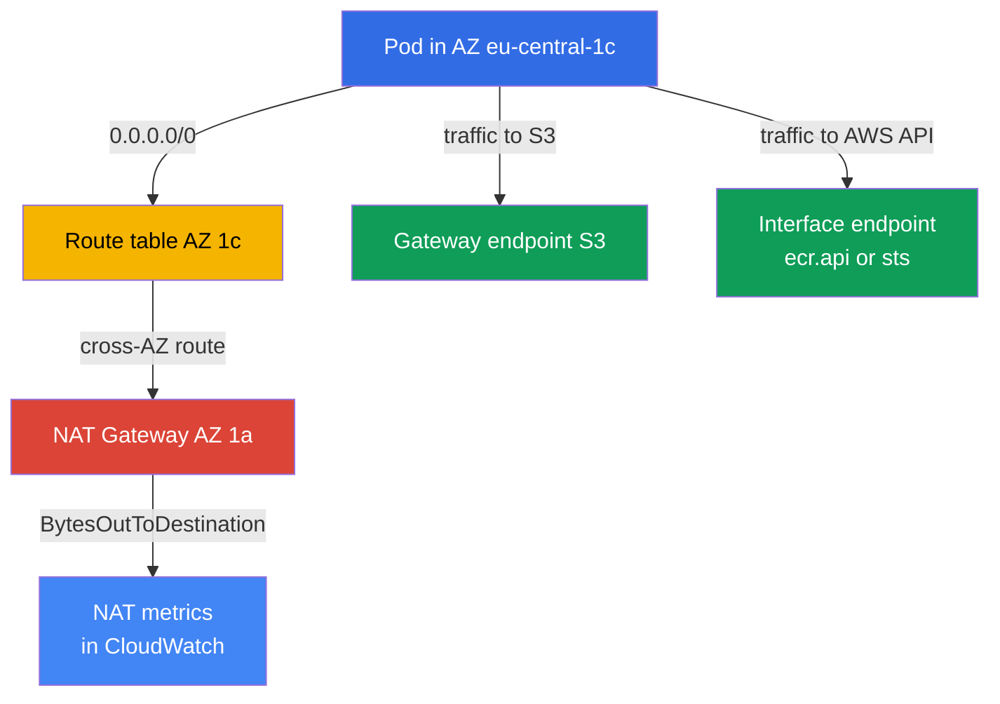
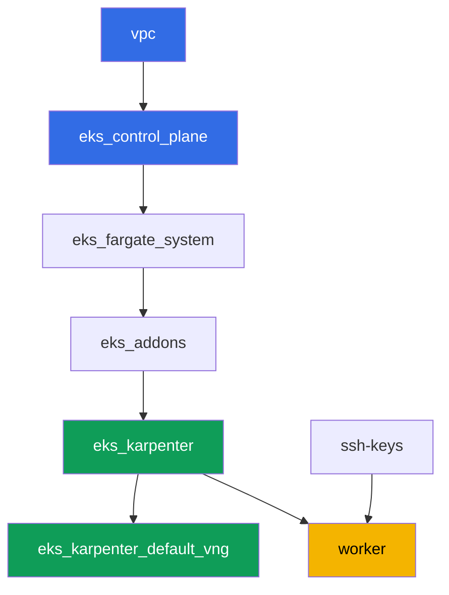

[Русская версия](README_RU.MD) · [Versión en español](README_ES.MD) · [Version française](README_FR.MD) · [Deutsche Version](README_DE.MD) · [ქართული ვერსია](README_GE.MD) · [繁體中文版](README_TW.MD) · [日本語版](README_JP.MD)

# Lab 117 - Traffic and cost: per-AZ NAT vs. a single NAT, VPC endpoints, cross-AZ

## Description

The cluster is already deployed as code (lab 101), and in this lab you dig into the least
visible line item on the EKS bill - egress traffic. The lab's network is deliberately
mixed: private subnets in two AZs already got one NAT Gateway each (the correct pattern),
while a third private subnet, in `eu-central-1c`, was left without a NAT at all. You start
by recording how many NAT Gateways exist and in which zones, then deliberately reproduce
the classic trap - you point the NAT-less subnet's route at a neighboring zone's gateway
and confirm that a node in that zone pushes traffic cross-AZ. After that you remove part of
the traffic from NAT altogether: you stand up a free gateway endpoint for S3 and a paid
interface endpoint for a high-traffic service, and at the end you read CloudWatch metrics
to see the traffic volume on each NAT with your own eyes.

Tasks are written in a production style: a short statement plus acceptance criteria.
Checking is automatic, via the `check_result` command.

## Goal

Reinforce the material from these course chapters:

- [Chapter 31. Egress and traffic cost: NAT, VPC endpoints,
  PrivateLink](../../course/31/en.md) - why a single NAT per cluster pays twice for
  cross-AZ traffic, and how gateway and interface endpoints fix that
- [Chapter 43. Cost: OpenCost and Kubecost, right-sizing, Savings Plans, spot mix,
  traffic](../../course/43/en.md) - how traffic and endpoints show up in Cost Explorer by
  usage type

## What we're creating

The cluster is already deployed as code (as in lab 101). This lab's network differs from
101/103: instead of a single NAT for the whole cluster, here each of two AZs has its own
NAT, while a third AZ is temporarily without one - you reproduce and explain the cross-AZ
trap yourself, then remove part of the traffic from NAT via VPC endpoints.

| Object | What it is | Why it's in this lab |
|--------|---------|-------------------|
| NAT Gateway in AZ `eu-central-1a` and `eu-central-1b` | already created by the `vpc_v3` module (`nat_gateway = "SUBNET"`, one private subnet per zone) | the correct pattern - one NAT per AZ, not one per cluster (chapter 31) |
| Private subnet `private-subnet-3` in `eu-central-1c` without a NAT | created without a `0.0.0.0/0` route | starting point for reproducing the cross-AZ NAT trap (chapter 31) |
| Route table `private-subnet-3` (edited by hand) | route to the neighboring AZ's NAT | the trap mechanism itself: traffic goes cross-AZ to someone else's NAT (chapter 31) |
| Deployment `crossaz` (image `curlimages/curl`, nodeSelector zone `eu-central-1c`) | a workload that forces Karpenter to place a node exactly in the problem AZ | makes cross-AZ traffic observable and reproducible, from the pod we check egress via `curl` (chapter 31) |
| Gateway VPC endpoint for `s3` | a route table entry, free of charge | the first optimization step - removes S3 traffic from NAT (chapters 31, 43) |
| Interface VPC endpoint (`ecr.api` or `sts`) | an ENI with PrivateLink | removes high-frequency service traffic from NAT (chapter 31) |
| Artifacts in `/var/work/tests/artifacts/*` | findings about NAT, routes, endpoints, metrics | record the analysis without dollar figures, just the traffic structure (chapters 31, 43) |



## Infrastructure

The environment is deployed in AWS (`eu-central-1`) via Terragrunt, as in lab 101. Each
lab directory is one component with its own `terragrunt.hcl`, which references a shared
module in `terraform/modules/` and declares dependencies through `dependency` blocks.

### Modules and dependencies

| Directory (component) | Module (`terraform/modules/`) | Depends on | What it creates |
|---------------------|-------------------------------|------------|-------------|
| `vpc` | `vpc_v3` | - | VPC `10.10.0.0/16`, public subnets in two AZs, private subnets in three AZs, NAT in two of them |
| `ssh-keys` | `ssh-keys` | - | an SSH key pair for the worker machine and nodes |
| `eks_control_plane` | `eks_v2_control_plane` | `vpc` | EKS control plane `1.36`, OIDC, security groups |
| `eks_fargate_system` | `eks_v2_fargate` | `vpc`, `eks_control_plane` | Fargate profile for `kube-system` and `karpenter` |
| `eks_addons` | `eks_v2_addons` | `eks_control_plane`, `eks_fargate_system` | coredns, kube-proxy, vpc-cni, pod-identity add-ons |
| `eks_karpenter` | `eks_v2_karpenter` | `vpc`, `eks_control_plane`, `eks_addons`, `eks_fargate_system` | Karpenter controller, node IAM role |
| `eks_karpenter_default_vng` | `eks_v2_karpenter_vng` | `vpc`, `eks_control_plane`, `eks_karpenter` | default NodePool `default` and EC2NodeClass on AL2023 |
| `worker` | `eks_v2_work_pc` | `ssh-keys`, `vpc`, `eks_control_plane`, `eks_karpenter` | worker machine with kubectl, tests, and `check_result` |

Dependency graph (what gets applied earlier is lower down the arrow), same as in lab 101:



All tasks in this lab are solved from the worker machine via the `aws` CLI and `kubectl`,
without any new terraform modules: the network already spreads subnets across three AZs
and creates NAT in only two of them, and routes, endpoints, and metrics are plain AWS CLI
operations run directly from the worker.

### This lab's network: where the correct pattern is, and where the trap is

Private subnets `private-subnet-1` (`eu-central-1a`) and `private-subnet-2`
(`eu-central-1b`) were created with `nat_gateway = "SUBNET"` - the `vpc_v3` module builds a
separate NAT Gateway for each such subnet, in the public subnet of the same zone. There is
exactly one private subnet per zone here, so "NAT per subnet" produces the same
infrastructure as "NAT per zone": one NAT Gateway each in `eu-central-1a` and
`eu-central-1b`. This is the correct pattern from chapter 31: a node's traffic reaches a
NAT in its own zone, without crossing an AZ boundary.

Subnet `private-subnet-3` (`eu-central-1c`) was created with `nat_gateway = "NONE"` - it
has its own route table, but that table has no `0.0.0.0/0` route. All three subnets carry
the `karpenter.sh/discovery` tag, so Karpenter can place nodes in them. In task 2 you add a
route to the neighboring AZ's NAT Gateway into this subnet's route table yourself - and get
exactly the trap chapter 31 warns about: a node in `eu-central-1c` sends traffic cross-AZ
to someone else's NAT, and that gets billed twice - once for inter-AZ traffic and once for
processing on the NAT itself.

### Worker permissions for routes, endpoints, and metrics

The worker role (`eks_v2_work_pc/iam.tf`) already had `eks:*`, some `ec2:Describe*`
(subnets, security groups, instances, ENIs), permission to change security group rules
(`ec2:AuthorizeSecurityGroupIngress`, `ec2:RevokeSecurityGroupIngress`), and read access to
CloudWatch metrics (`cloudwatch:GetMetricStatistics`, `cloudwatch:ListMetrics` from the
`Sid` `ObservabilityReadForMetricsLabs`). For tasks 1-4 of this lab, which need to read NAT
Gateways and route tables, change routes, and create VPC endpoints, one additional `Sid`
`TrafficAndEndpointsForLabs` was added to the policy with permissions `ec2:CreateRoute`,
`ec2:ReplaceRoute`, `ec2:DeleteRoute`, `ec2:CreateVpcEndpoint`, `ec2:DeleteVpcEndpoints`,
`ec2:ModifyVpcEndpoint`, `ec2:DescribeVpcEndpoints`, `ec2:DescribeNatGateways`,
`ec2:DescribeRouteTables`, `cloudwatch:GetMetricStatistics`, `cloudwatch:ListMetrics` -
following the pattern of the `Sid`s already present in this file, without changing the
rest of the policy.

## Deployment

```bash
TASK=117 make run_eks_task
```

Deployment takes roughly 15-20 minutes. In the output, find the line with the SSH
connection to the worker machine and connect to it. kubectl there is already configured
for the right cluster.

Useful commands on the worker machine:

```bash
time_left       # how much environment time is left
check_result    # check the solution
```

> Environment security. `env.hcl` has `ssh_password_enable = true` and
> `access_cidrs = ["0.0.0.0/0"]` enabled - convenient for a training environment, but this
> is not something to do in production. Per the course standards, access to worker
> machines should go through AWS SSM Session Manager without exposing public SSH ports,
> and `access_cidrs` should be narrowed down to specific addresses. Here public SSH is
> left in place only to keep the setup simple.

## Tasks

---
|        **1**        | **How many NAT Gateways, and in which zones**                |
| :-----------------: | :---------------------------------------------------------- |
| What to do          | Find the cluster's `vpc-id` (`aws eks describe-cluster --name <name> --query 'cluster.resourcesVpcConfig.vpcId'`). Find all NAT Gateways in this VPC: `aws ec2 describe-nat-gateways --filter "Name=vpc-id,Values=<vpc-id>" --query 'NatGateways[].[NatGatewayId,SubnetId,State]' --output table`. For each NAT, determine its subnet's AZ: `aws ec2 describe-subnets --subnet-ids <subnet-id> --query 'Subnets[0].AvailabilityZone'`. Save to `/var/work/tests/artifacts/1/natdiscovery.txt`, one `key=value` per line: `nat_count` (total number of NAT Gateways), `nat_1_id`, `nat_1_az`, `nat_2_id`, `nat_2_az` (for each NAT found), and `no_nat_az` - the zone where a private subnet exists but there's no NAT Gateway. |
| Acceptance criteria    | - the file is not empty;<br/>- `nat_count` equals the actual number of NAT Gateways in the VPC (`2`);<br/>- `nat_1_az`/`nat_2_az` are `eu-central-1a` and `eu-central-1b` (in any order);<br/>- `no_nat_az` equals `eu-central-1c`. |
---
|        **2**        | **Reproducing the cross-AZ trap**                        |
| :-----------------: | :---------------------------------------------------------- |
| What to do          | Find the route table of subnet `private-subnet-3`: `aws ec2 describe-route-tables --filters "Name=tag:Name,Values=private-subnet-3" --query 'RouteTables[0].RouteTableId'`. Add a route to one of the neighboring AZs' NAT Gateway (from task 1): `aws ec2 create-route --route-table-id <rtb-id> --destination-cidr-block 0.0.0.0/0 --nat-gateway-id <nat-id>`. In namespace `eks-117`, create Deployment `crossaz` (image `curlimages/curl:latest`, command `sleep 3600`, `1` replica) with `nodeSelector: topology.kubernetes.io/zone: eu-central-1c`, so that Karpenter brings up a node exactly in that zone. Wait for `Running` and check egress from inside the pod: `kubectl exec -n eks-117 <pod> -- curl -s -o /dev/null -w '%{http_code}' https://checkip.amazonaws.com`. Save to `/var/work/tests/artifacts/2/crossaz.txt`: `subnet_c_route_table_id`, `nat_gateway_id_used`, `nat_gateway_az_used`, `pod_node`, `pod_node_zone`, `egress_http_code`, and an explanation (at least one line) containing the word `cross-AZ`: why a node's traffic from `eu-central-1c` to a NAT in another zone is an inter-AZ (cross-AZ) hop billed separately, and what the correct pattern is - a NAT Gateway in every AZ that has nodes. |
| Acceptance criteria    | - route table `private-subnet-3` contains a `0.0.0.0/0` route to a NAT Gateway whose AZ is not `eu-central-1c`;<br/>- Deployment `crossaz` is ready (`1` replica), the pod physically on a node in zone `eu-central-1c`;<br/>- the file mentions `cross-AZ` and contains `egress_http_code=200`. |
---
|        **3**        | **Gateway VPC endpoint for S3 - a free route**         |
| :-----------------: | :---------------------------------------------------------- |
| What to do          | Create a gateway endpoint for S3, attaching it right away to all three private route tables (`private-subnet-1`, `private-subnet-2`, `private-subnet-3`): `aws ec2 create-vpc-endpoint --vpc-id <vpc-id> --vpc-endpoint-type Gateway --service-name com.amazonaws.eu-central-1.s3 --route-table-ids <rtb-1> <rtb-2> <rtb-3>`. Wait for the `available` state (`aws ec2 describe-vpc-endpoints --filters "Name=vpc-id,Values=<vpc-id>" "Name=vpc-endpoint-type,Values=Gateway" --query 'VpcEndpoints[].[VpcEndpointId,State,RouteTableIds]'`). Save the endpoint id, its state, and the list of route tables to `/var/work/tests/artifacts/3/s3endpoint.txt`, with an explanation that a gateway endpoint for S3 is not billed either hourly or for data (the word `free` in the explanation). |
| Acceptance criteria    | - gateway endpoint for `com.amazonaws.eu-central-1.s3` is in state `available`;<br/>- its `RouteTableIds` includes all three of the lab's private route tables;<br/>- the file mentions `available` and `free`. |
---
|        **4**        | **Interface VPC endpoint for a high-traffic service**   |
| :-----------------: | :---------------------------------------------------------- |
| What to do          | Choose one service - `ecr.api` (image registry authorization on every pull) or `sts` (exchanging an IRSA/Pod Identity token for temporary keys on every pod start) - and justify the choice in the artifact. Find the VPC's default security group (`aws ec2 describe-security-groups --filters "Name=vpc-id,Values=<vpc-id>" "Name=group-name,Values=default" --query 'SecurityGroups[0].GroupId'`). Allow inbound HTTPS from the VPC's CIDR in this security group, otherwise the endpoint will be unreachable: `aws ec2 authorize-security-group-ingress --group-id <sg-id> --protocol tcp --port 443 --cidr 10.10.0.0/16`. Create an interface endpoint: `aws ec2 create-vpc-endpoint --vpc-id <vpc-id> --vpc-endpoint-type Interface --service-name com.amazonaws.eu-central-1.<ecr.api\|sts> --subnet-ids <private-subnet-1-id> <private-subnet-2-id> --security-group-ids <sg-id> --private-dns-enabled`. Wait for `available`. Save to `/var/work/tests/artifacts/4/interfaceendpoint.txt`: `service_chosen`, `vpc_endpoint_id`, `state`, `private_dns_enabled`, and a justification for the choice (at least one line). |
| Acceptance criteria    | - interface endpoint for `com.amazonaws.eu-central-1.ecr.api` or `com.amazonaws.eu-central-1.sts` is in state `available`, with `PrivateDnsEnabled: true`;<br/>- the file mentions the chosen service and `available`. |

> Why the security group rule is mandatory. With `--private-dns-enabled` the endpoint
> intercepts the service's public name across the whole VPC: `sts.eu-central-1.amazonaws.com`
> starts resolving to the endpoint ENI's private addresses. If the endpoint's security
> group doesn't allow HTTPS from nodes and pods, requests to the service stop working
> across the entire VPC - the default security group's inbound rule only allows traffic
> from members of the same group, and Karpenter's nodes live in a different group. The
> symptom: `curl` to `https://sts.eu-central-1.amazonaws.com` from a pod returns code `000`
> and a timeout, and controllers using IRSA (Karpenter itself included) fail on their next
> credentials refresh. The `443` rule from the VPC CIDR resolves this; in production a
> dedicated security group with the same intent is used for the endpoint.

---
|        **5**        | **NAT metrics: how many bytes went through each gateway**       |
| :-----------------: | :---------------------------------------------------------- |
| What to do          | For both NAT Gateways from task 1, get the sum of `BytesOutToDestination` for the last few hours: `aws cloudwatch get-metric-statistics --namespace AWS/NATGateway --metric-name BytesOutToDestination --statistics Sum --period 3600 --dimensions Name=NatGatewayId,Value=<nat-id> --start-time <ISO> --end-time <ISO>` (for example, `--start-time $(date -u -d '3 hours ago' +%Y-%m-%dT%H:%M:%S) --end-time $(date -u +%Y-%m-%dT%H:%M:%S)`). Add up the sums across each NAT's data points. Save to `/var/work/tests/artifacts/5/natmetrics.txt`: `nat_a_id`, `nat_a_bytes_out_sum`, `nat_b_id`, `nat_b_bytes_out_sum`, `total_bytes_out_sum` (sum of the two previous values), and an explanation: which of the two NATs took on the cross-AZ node from task 2 (state its id) and why it is expected to have a larger volume, if the test workload generated traffic. |
| Acceptance criteria    | - the file contains all five numeric keys and mentions `BytesOutToDestination`;<br/>- `total_bytes_out_sum` equals the sum of `nat_a_bytes_out_sum` and `nat_b_bytes_out_sum`;<br/>- the file mentions the `nat_gateway_id_used` from task 2 (the same NAT Gateway id). |
---

## Checking the result

On the worker machine, run the automatic check:

```bash
check_result
```

The script will run the tests and show the percentage of completed tasks.

## Solution

Reference solution: [worker/files/solutions/1.MD](worker/files/solutions/1.MD)

## Deleting the cluster and resources

In this lab you manually created two VPC endpoints (a gateway endpoint for S3 and an
interface endpoint for `sts`/`ecr.api`), and task 2's workload made Karpenter bring up an
EC2 node in `eu-central-1c`. Neither one is in the terraform state, so an unprepared
`destroy` gets stuck: the interface endpoint's ENI holds the subnet, the endpoints
themselves hold the VPC, and the orphaned EC2 node holds the subnet and security group
(the same pattern as in labs 108, 109, 111, 114, 115, 116). Cleanup order - endpoints and
workload first, then terraform:

```bash
# 1. Delete both VPC endpoints created by hand in tasks 3 and 4
CLUSTER=$(aws eks list-clusters --query 'clusters[0]' --output text)
VPC=$(aws eks describe-cluster --name "$CLUSTER" \
  --query 'cluster.resourcesVpcConfig.vpcId' --output text)
EPS=$(aws ec2 describe-vpc-endpoints --filters "Name=vpc-id,Values=$VPC" \
  --query 'VpcEndpoints[].VpcEndpointId' --output text)
echo "endpoints to delete: $EPS"
aws ec2 delete-vpc-endpoints --vpc-endpoint-ids $EPS

# 2. Remove the workload that made Karpenter bring up an EC2 node
kubectl delete namespace eks-117

# 3. Wait for Karpenter to actually terminate the EC2 instance (not just delete the Node
#    object), and for the deleted interface endpoint's ENIs to disappear - every output
#    below should be empty
for i in $(seq 1 30); do
  nc=$(kubectl get nodeclaims --no-headers 2>/dev/null | wc -l)
  ec2=$(aws ec2 describe-instances \
    --filters "Name=tag:karpenter.sh/nodepool,Values=default" \
    "Name=instance-state-name,Values=running,pending,stopping,stopped" \
    --query 'Reservations[].Instances[].InstanceId' --output text)
  eps=$(aws ec2 describe-vpc-endpoints --filters "Name=vpc-id,Values=$VPC" \
    "Name=vpc-endpoint-state,Values=available,pending,deleting" \
    --query 'VpcEndpoints[].VpcEndpointId' --output text)
  echo "nodeclaims=$nc ec2_instances=[$ec2] endpoints=[$eps]"
  [[ "$nc" == "0" ]] && [[ -z "$ec2" ]] && [[ -z "$eps" ]] && break
  sleep 10
done
```

There's no need to separately remove the `0.0.0.0/0` route added by hand to
`private-subnet-3`'s route table, or the `443` rule in the default security group: the
route table and default security group get deleted together with the VPC, and the route
disappears together with its route table.

Only once `nodeclaims=0` and the EC2 instance and endpoint lists are empty, run the
terraform resource teardown:

```bash
TASK=117 make delete_eks_task
```
