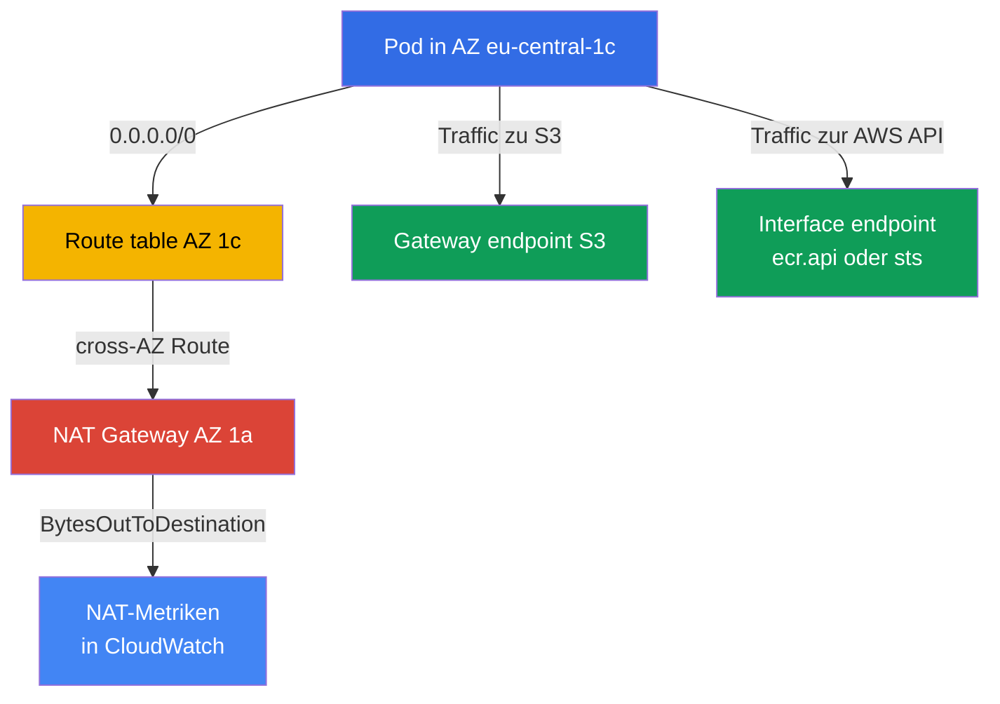
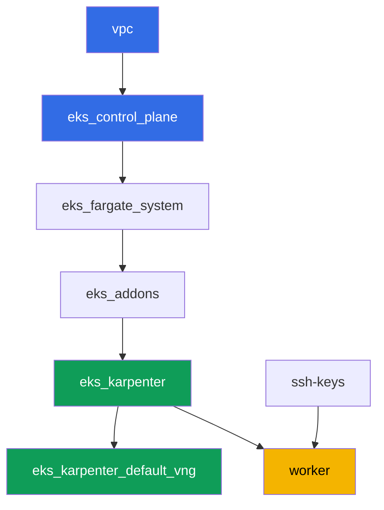

[Русская версия](README_RU.MD) · [Eng version](README.MD) · [Versión en español](README_ES.MD) · [Version française](README_FR.MD) · [ქართული ვერსია](README_GE.MD) · [繁體中文版](README_TW.MD) · [日本語版](README_JP.MD)

# Lab 117 - Traffic und Kosten: NAT pro AZ vs. ein einziges NAT, VPC endpoints, cross-AZ

## Beschreibung

Der Cluster ist bereits als Code bereitgestellt (Lab 101), und in dieser Lab beschäftigt
ihr euch mit dem am wenigsten sichtbaren Posten der EKS-Rechnung - dem Egress-Traffic.
Das Netzwerk dieser Lab ist bewusst gemischt: private Subnets in zwei AZs haben bereits
je ein NAT Gateway (das korrekte Muster), während ein drittes privates Subnet, in
`eu-central-1c`, ganz ohne NAT gelassen wurde. Ihr beginnt damit, festzuhalten, wie viele
NAT Gateways existieren und in welchen Zonen, und reproduziert dann bewusst die
klassische Falle - ihr richtet die Route des Subnets ohne NAT auf das Gateway einer
Nachbarzone und bestätigt, dass ein Node in dieser Zone Traffic cross-AZ schickt. Danach
entfernt ihr einen Teil des Traffics komplett von NAT: ihr richtet einen kostenlosen
Gateway-Endpoint für S3 und einen kostenpflichtigen Interface-Endpoint für einen
traffic-intensiven Service ein, und am Ende lest ihr CloudWatch-Metriken, um das
Traffic-Volumen jedes NAT mit eigenen Augen zu sehen.

Die Aufgaben sind im Produktionsstil geschrieben: eine kurze Aufgabenstellung plus
Abnahmekriterien. Die Prüfung ist automatisiert, über den Befehl `check_result`.

## Ziel

Den Stoff aus diesen Kurskapiteln vertiefen:

- [Kapitel 31. Egress und Traffic-Kosten: NAT, VPC endpoints,
  PrivateLink](../../course/31/ru.md) - warum ein einziges NAT pro Cluster den cross-AZ
  Traffic doppelt bezahlt, und wie Gateway- und Interface-Endpoints das beheben
- [Kapitel 43. Kosten: OpenCost und Kubecost, Right-Sizing, Savings Plans, Spot-Mix,
  Traffic](../../course/43/ru.md) - wie Traffic und Endpoints in Cost Explorer nach
  Usage-Type auftauchen

## Was wir erstellen

Der Cluster ist bereits als Code bereitgestellt (wie in Lab 101). Das Netzwerk dieser
Lab unterscheidet sich von 101/103: statt eines einzigen NAT für den ganzen Cluster hat
hier jede der zwei AZs ihr eigenes NAT, während eine dritte AZ vorübergehend ohne eines
ist - ihr reproduziert und erklärt die cross-AZ-Falle selbst, und entfernt danach einen
Teil des Traffics per VPC endpoints von NAT.

| Objekt | Was es ist | Warum es in dieser Lab vorkommt |
|--------|---------|-------------------|
| NAT Gateway in AZ `eu-central-1a` und `eu-central-1b` | bereits vom Modul `vpc_v3` erstellt (`nat_gateway = "SUBNET"`, ein privates Subnet pro Zone) | das korrekte Muster - ein NAT pro AZ, nicht eines pro Cluster (Kapitel 31) |
| Privates Subnet `private-subnet-3` in `eu-central-1c` ohne NAT | ohne `0.0.0.0/0`-Route erstellt | Ausgangspunkt, um die cross-AZ-NAT-Falle zu reproduzieren (Kapitel 31) |
| Route table `private-subnet-3` (von Hand bearbeitet) | Route zum NAT der Nachbarzone | der Mechanismus der Falle selbst: Traffic geht cross-AZ zu einem fremden NAT (Kapitel 31) |
| Deployment `crossaz` (Image `curlimages/curl`, nodeSelector Zone `eu-central-1c`) | eine Last, die Karpenter dazu zwingt, einen Node genau in der Problemzone hochzufahren | macht cross-AZ-Traffic beobachtbar und reproduzierbar, aus dem Pod prüfen wir Egress per `curl` (Kapitel 31) |
| Gateway VPC endpoint für `s3` | ein Eintrag in der Route table, kostenlos | der erste Optimierungsschritt - entfernt S3-Traffic von NAT (Kapitel 31, 43) |
| Interface VPC endpoint (`ecr.api` oder `sts`) | ein ENI mit PrivateLink | entfernt Traffic eines hochfrequenten Service von NAT (Kapitel 31) |
| Artefakte in `/var/work/tests/artifacts/*` | Erkenntnisse zu NAT, Routen, Endpoints, Metriken | halten die Analyse ohne Dollarbeträge fest, nur die Traffic-Struktur (Kapitel 31, 43) |



## Infrastruktur

Die Umgebung wird auf AWS (`eu-central-1`) via Terragrunt bereitgestellt, wie in Lab
101. Jedes Lab-Verzeichnis ist eine Komponente mit eigenem `terragrunt.hcl`, das auf ein
gemeinsames Modul in `terraform/modules/` verweist und Abhängigkeiten über
`dependency`-Blöcke deklariert.

### Module und Abhängigkeiten

| Verzeichnis (Komponente) | Modul (`terraform/modules/`) | Abhängig von | Was erstellt wird |
|---------------------|-------------------------------|------------|-------------|
| `vpc` | `vpc_v3` | - | VPC `10.10.0.0/16`, öffentliche Subnets in zwei AZs, private Subnets in drei AZs, NAT in zwei davon |
| `ssh-keys` | `ssh-keys` | - | ein SSH-Schlüsselpaar für die Worker-Maschine und die Nodes |
| `eks_control_plane` | `eks_v2_control_plane` | `vpc` | EKS Control Plane `1.36`, OIDC, Security Groups |
| `eks_fargate_system` | `eks_v2_fargate` | `vpc`, `eks_control_plane` | Fargate-Profil für `kube-system` und `karpenter` |
| `eks_addons` | `eks_v2_addons` | `eks_control_plane`, `eks_fargate_system` | Add-ons coredns, kube-proxy, vpc-cni, pod-identity |
| `eks_karpenter` | `eks_v2_karpenter` | `vpc`, `eks_control_plane`, `eks_addons`, `eks_fargate_system` | der Karpenter-Controller, Node-IAM-Rolle |
| `eks_karpenter_default_vng` | `eks_v2_karpenter_vng` | `vpc`, `eks_control_plane`, `eks_karpenter` | der Standard-NodePool `default` und die EC2NodeClass auf AL2023 |
| `worker` | `eks_v2_work_pc` | `ssh-keys`, `vpc`, `eks_control_plane`, `eks_karpenter` | die Worker-Maschine mit kubectl, Tests und `check_result` |

Abhängigkeitsgraph (was früher angewendet wird, steht weiter unten entlang des Pfeils), wie in Lab 101:



Alle Aufgaben dieser Lab werden von der Worker-Maschine aus über die `aws` CLI und
`kubectl` gelöst, ohne neue Terraform-Module: das Netzwerk verteilt Subnets bereits auf
drei AZs und erstellt NAT nur in zwei davon, und Routen, Endpoints und Metriken sind
reine AWS-CLI-Operationen, die direkt vom Worker aus ausgeführt werden.

### Das Netzwerk dieser Lab: wo das korrekte Muster liegt, und wo die Falle liegt

Die privaten Subnets `private-subnet-1` (`eu-central-1a`) und `private-subnet-2`
(`eu-central-1b`) wurden mit `nat_gateway = "SUBNET"` erstellt - das Modul `vpc_v3` baut
für jedes solche Subnet ein eigenes NAT Gateway, im öffentlichen Subnet derselben Zone.
Hier gibt es genau ein privates Subnet pro Zone, sodass „NAT pro Subnet" dieselbe
Infrastruktur ergibt wie „NAT pro Zone": je ein NAT Gateway in `eu-central-1a` und
`eu-central-1b`. Das ist das korrekte Muster aus Kapitel 31: der Traffic eines Nodes
erreicht ein NAT in seiner eigenen Zone, ohne eine AZ-Grenze zu überschreiten.

Das Subnet `private-subnet-3` (`eu-central-1c`) wurde mit `nat_gateway = "NONE"`
erstellt - es hat seine eigene Route table, aber diese Tabelle hat keine
`0.0.0.0/0`-Route. Alle drei Subnets tragen das Tag `karpenter.sh/discovery`, sodass
Karpenter Nodes darin platzieren kann. In Aufgabe 2 fügt ihr selbst eine Route zum NAT
Gateway der Nachbarzone in die Route table dieses Subnets ein - und erhaltet exakt die
Falle, vor der Kapitel 31 warnt: ein Node in `eu-central-1c` schickt Traffic cross-AZ zu
einem fremden NAT, und das wird doppelt abgerechnet - einmal für den Inter-AZ-Traffic und
einmal für die Verarbeitung auf dem NAT selbst.

### Worker-Berechtigungen für Routen, Endpoints und Metriken

Die Worker-Rolle (`eks_v2_work_pc/iam.tf`) hatte bereits `eks:*`, einige
`ec2:Describe*` (Subnets, Security Groups, Instances, ENIs), die Berechtigung, Security
Group-Regeln zu ändern (`ec2:AuthorizeSecurityGroupIngress`,
`ec2:RevokeSecurityGroupIngress`), und Lesezugriff auf CloudWatch-Metriken
(`cloudwatch:GetMetricStatistics`, `cloudwatch:ListMetrics` aus dem `Sid`
`ObservabilityReadForMetricsLabs`). Für die Aufgaben 1-4 dieser Lab, die NAT Gateways und
Route tables lesen, Routen ändern und VPC endpoints erstellen müssen, wurde der Policy
ein zusätzlicher `Sid` `TrafficAndEndpointsForLabs` mit den Berechtigungen
`ec2:CreateRoute`, `ec2:ReplaceRoute`, `ec2:DeleteRoute`, `ec2:CreateVpcEndpoint`,
`ec2:DeleteVpcEndpoints`, `ec2:ModifyVpcEndpoint`, `ec2:DescribeVpcEndpoints`,
`ec2:DescribeNatGateways`, `ec2:DescribeRouteTables`, `cloudwatch:GetMetricStatistics`,
`cloudwatch:ListMetrics` hinzugefügt - nach dem Muster der bereits in dieser Datei
vorhandenen `Sid`s, ohne den Rest der Policy zu ändern.

## Bereitstellung

```bash
TASK=117 make run_eks_task
```

Die Bereitstellung dauert etwa 15-20 Minuten. Suchen Sie in der Ausgabe die Zeile mit
der SSH-Verbindung zur Worker-Maschine und verbinden Sie sich damit. kubectl ist dort
bereits für den richtigen Cluster konfiguriert.

Nützliche Befehle auf der Worker-Maschine:

```bash
time_left       # wie viel Umgebungszeit noch übrig ist
check_result    # die Lösung prüfen
```

> Sicherheit der Übungsumgebung. In `env.hcl` sind `ssh_password_enable = true` und
> `access_cidrs = ["0.0.0.0/0"]` aktiviert - praktisch für eine Lernumgebung, aber so
> sollte man es in der Produktion nicht machen. Nach den Kursstandards sollte der
> Zugriff auf Worker-Maschinen über AWS SSM Session Manager erfolgen, ohne öffentlich
> exponierte SSH-Ports, und `access_cidrs` sollte auf konkrete Adressen eingeschränkt
> werden. Hier bleibt öffentliches SSH nur der Einfachheit des Aufbaus wegen erhalten.

## Aufgaben

---
|        **1**        | **Wie viele NAT Gateways, und in welchen Zonen**                |
| :-----------------: | :---------------------------------------------------------- |
| Was zu tun ist          | Finden Sie die `vpc-id` des Clusters (`aws eks describe-cluster --name <name> --query 'cluster.resourcesVpcConfig.vpcId'`). Finden Sie alle NAT Gateways in dieser VPC: `aws ec2 describe-nat-gateways --filter "Name=vpc-id,Values=<vpc-id>" --query 'NatGateways[].[NatGatewayId,SubnetId,State]' --output table`. Bestimmen Sie für jedes NAT die AZ seines Subnets: `aws ec2 describe-subnets --subnet-ids <subnet-id> --query 'Subnets[0].AvailabilityZone'`. Speichern Sie in `/var/work/tests/artifacts/1/natdiscovery.txt`, ein `key=value` pro Zeile: `nat_count` (Gesamtzahl der NAT Gateways), `nat_1_id`, `nat_1_az`, `nat_2_id`, `nat_2_az` (für jedes gefundene NAT), und `no_nat_az` - die Zone, in der ein privates Subnet existiert, aber kein NAT Gateway. |
| Abnahmekriterien    | - die Datei ist nicht leer;<br/>- `nat_count` entspricht der tatsächlichen Anzahl der NAT Gateways in der VPC (`2`);<br/>- `nat_1_az`/`nat_2_az` sind `eu-central-1a` und `eu-central-1b` (in beliebiger Reihenfolge);<br/>- `no_nat_az` entspricht `eu-central-1c`. |
---
|        **2**        | **Die cross-AZ-Falle reproduzieren**                        |
| :-----------------: | :---------------------------------------------------------- |
| Was zu tun ist          | Finden Sie die Route table des Subnets `private-subnet-3`: `aws ec2 describe-route-tables --filters "Name=tag:Name,Values=private-subnet-3" --query 'RouteTables[0].RouteTableId'`. Fügen Sie eine Route zum NAT Gateway einer der Nachbarzonen hinzu (aus Aufgabe 1): `aws ec2 create-route --route-table-id <rtb-id> --destination-cidr-block 0.0.0.0/0 --nat-gateway-id <nat-id>`. Erstellen Sie im Namespace `eks-117` das Deployment `crossaz` (Image `curlimages/curl:latest`, Befehl `sleep 3600`, `1` Replica) mit `nodeSelector: topology.kubernetes.io/zone: eu-central-1c`, damit Karpenter einen Node genau in dieser Zone hochfährt. Warten Sie auf `Running` und prüfen Sie Egress aus dem Pod: `kubectl exec -n eks-117 <pod> -- curl -s -o /dev/null -w '%{http_code}' https://checkip.amazonaws.com`. Speichern Sie in `/var/work/tests/artifacts/2/crossaz.txt`: `subnet_c_route_table_id`, `nat_gateway_id_used`, `nat_gateway_az_used`, `pod_node`, `pod_node_zone`, `egress_http_code`, und eine Erklärung (mindestens eine Zeile) mit dem Wort `cross-AZ`: warum der Traffic eines Nodes von `eu-central-1c` zu einem NAT in einer anderen Zone ein separat abgerechneter Inter-AZ-Sprung (cross-AZ) ist, und was das korrekte Muster ist - ein NAT Gateway in jeder AZ, die Nodes hat. |
| Abnahmekriterien    | - die Route table `private-subnet-3` enthält eine `0.0.0.0/0`-Route zu einem NAT Gateway, dessen AZ nicht `eu-central-1c` ist;<br/>- das Deployment `crossaz` ist bereit (`1` Replica), der Pod physisch auf einem Node in Zone `eu-central-1c`;<br/>- die Datei erwähnt `cross-AZ` und enthält `egress_http_code=200`. |
---
|        **3**        | **Gateway VPC endpoint für S3 - eine kostenlose Route**         |
| :-----------------: | :---------------------------------------------------------- |
| Was zu tun ist          | Erstellen Sie einen Gateway-Endpoint für S3 und hängen Sie ihn sofort an alle drei privaten Route tables (`private-subnet-1`, `private-subnet-2`, `private-subnet-3`): `aws ec2 create-vpc-endpoint --vpc-id <vpc-id> --vpc-endpoint-type Gateway --service-name com.amazonaws.eu-central-1.s3 --route-table-ids <rtb-1> <rtb-2> <rtb-3>`. Warten Sie auf den Zustand `available` (`aws ec2 describe-vpc-endpoints --filters "Name=vpc-id,Values=<vpc-id>" "Name=vpc-endpoint-type,Values=Gateway" --query 'VpcEndpoints[].[VpcEndpointId,State,RouteTableIds]'`). Speichern Sie die Endpoint-ID, ihren Zustand und die Liste der Route tables in `/var/work/tests/artifacts/3/s3endpoint.txt`, mit einer Erklärung, dass ein Gateway-Endpoint für S3 weder stündlich noch für Daten abgerechnet wird (das Wort `бесплат` in der Erklärung). |
| Abnahmekriterien    | - der Gateway-Endpoint für `com.amazonaws.eu-central-1.s3` ist im Zustand `available`;<br/>- seine `RouteTableIds` enthalten alle drei privaten Route tables dieser Lab;<br/>- die Datei erwähnt `available` und `бесплат`. |
---
|        **4**        | **Interface VPC endpoint für einen traffic-intensiven Service**   |
| :-----------------: | :---------------------------------------------------------- |
| Was zu tun ist          | Wählen Sie einen Service - `ecr.api` (Autorisierung der Image-Registry bei jedem Pull) oder `sts` (Austausch eines IRSA-/Pod-Identity-Tokens gegen temporäre Schlüssel bei jedem Pod-Start) - und begründen Sie die Wahl im Artefakt. Finden Sie die Default-Security-Group der VPC (`aws ec2 describe-security-groups --filters "Name=vpc-id,Values=<vpc-id>" "Name=group-name,Values=default" --query 'SecurityGroups[0].GroupId'`). Erlauben Sie in dieser Security Group eingehendes HTTPS von der CIDR der VPC, sonst ist der Endpoint nicht erreichbar: `aws ec2 authorize-security-group-ingress --group-id <sg-id> --protocol tcp --port 443 --cidr 10.10.0.0/16`. Erstellen Sie einen Interface-Endpoint: `aws ec2 create-vpc-endpoint --vpc-id <vpc-id> --vpc-endpoint-type Interface --service-name com.amazonaws.eu-central-1.<ecr.api\|sts> --subnet-ids <private-subnet-1-id> <private-subnet-2-id> --security-group-ids <sg-id> --private-dns-enabled`. Warten Sie auf `available`. Speichern Sie in `/var/work/tests/artifacts/4/interfaceendpoint.txt`: `service_chosen`, `vpc_endpoint_id`, `state`, `private_dns_enabled`, und eine Begründung der Wahl (mindestens eine Zeile). |
| Abnahmekriterien    | - der Interface-Endpoint für `com.amazonaws.eu-central-1.ecr.api` oder `com.amazonaws.eu-central-1.sts` ist im Zustand `available`, mit `PrivateDnsEnabled: true`;<br/>- die Datei erwähnt den gewählten Service und `available`. |

> Warum die Security-Group-Regel zwingend ist. Mit `--private-dns-enabled` fängt der
> Endpoint den öffentlichen Namen des Service in der gesamten VPC ab:
> `sts.eu-central-1.amazonaws.com` beginnt, zu den privaten Adressen des Endpoint-ENIs
> aufzulösen. Wenn die Security Group des Endpoints kein HTTPS von Nodes und Pods
> erlaubt, funktionieren Anfragen an den Service in der gesamten VPC nicht mehr - die
> eingehende Regel der Default-Security-Group erlaubt nur Traffic von Mitgliedern
> derselben Gruppe, und Karpenters Nodes leben in einer anderen Gruppe. Das Symptom:
> `curl` gegen `https://sts.eu-central-1.amazonaws.com` aus einem Pod liefert den Code
> `000` und einen Timeout, und Controller, die IRSA verwenden (einschließlich Karpenter
> selbst), scheitern beim nächsten Credentials-Refresh. Die Regel `443` von der VPC-CIDR
> löst das; in der Produktion wird für den Endpoint eine dedizierte Security Group mit
> derselben Absicht verwendet.

---
|        **5**        | **NAT-Metriken: wie viele Bytes über jedes Gateway liefen**       |
| :-----------------: | :---------------------------------------------------------- |
| Was zu tun ist          | Ermitteln Sie für beide NAT Gateways aus Aufgabe 1 die Summe von `BytesOutToDestination` der letzten paar Stunden: `aws cloudwatch get-metric-statistics --namespace AWS/NATGateway --metric-name BytesOutToDestination --statistics Sum --period 3600 --dimensions Name=NatGatewayId,Value=<nat-id> --start-time <ISO> --end-time <ISO>` (zum Beispiel `--start-time $(date -u -d '3 hours ago' +%Y-%m-%dT%H:%M:%S) --end-time $(date -u +%Y-%m-%dT%H:%M:%S)`). Summieren Sie die Werte über die Datenpunkte jedes NAT. Speichern Sie in `/var/work/tests/artifacts/5/natmetrics.txt`: `nat_a_id`, `nat_a_bytes_out_sum`, `nat_b_id`, `nat_b_bytes_out_sum`, `total_bytes_out_sum` (Summe der beiden vorherigen Werte), und eine Erklärung: welches der beiden NATs den cross-AZ-Node aus Aufgabe 2 übernommen hat (nennen Sie seine ID) und warum dort ein größeres Volumen zu erwarten ist, falls die Testlast Traffic erzeugt hat. |
| Abnahmekriterien    | - die Datei enthält alle fünf numerischen Schlüssel und erwähnt `BytesOutToDestination`;<br/>- `total_bytes_out_sum` entspricht der Summe von `nat_a_bytes_out_sum` und `nat_b_bytes_out_sum`;<br/>- die Datei erwähnt die `nat_gateway_id_used` aus Aufgabe 2 (dieselbe NAT-Gateway-ID). |
---

## Prüfung des Ergebnisses

Führen Sie auf der Worker-Maschine die automatische Prüfung aus:

```bash
check_result
```

Das Skript lässt die Tests laufen und zeigt den Prozentsatz der abgeschlossenen
Aufgaben.

## Lösung

Musterlösung: [worker/files/solutions/1_DE.MD](worker/files/solutions/1_DE.MD)

## Löschen des Clusters und der Ressourcen

In dieser Lab haben Sie manuell zwei VPC endpoints erstellt (einen Gateway-Endpoint für
S3 und einen Interface-Endpoint für `sts`/`ecr.api`), und die Last aus Aufgabe 2 hat
Karpenter dazu gebracht, einen EC2-Node in `eu-central-1c` hochzufahren. Keines von
beiden steht im Terraform-State, sodass ein unvorbereitetes `destroy` hängen bleibt: das
ENI des Interface-Endpoints hält das Subnet, die Endpoints selbst halten die VPC, und
der verwaiste EC2-Node hält Subnet und Security Group (dasselbe Muster wie in den Labs
108, 109, 111, 114, 115, 116). Reihenfolge beim Aufräumen - zuerst Endpoints und Last,
dann Terraform:

```bash
# 1. Beide von Hand in den Aufgaben 3 und 4 erstellten VPC endpoints löschen
CLUSTER=$(aws eks list-clusters --query 'clusters[0]' --output text)
VPC=$(aws eks describe-cluster --name "$CLUSTER" \
  --query 'cluster.resourcesVpcConfig.vpcId' --output text)
EPS=$(aws ec2 describe-vpc-endpoints --filters "Name=vpc-id,Values=$VPC" \
  --query 'VpcEndpoints[].VpcEndpointId' --output text)
echo "endpoints to delete: $EPS"
aws ec2 delete-vpc-endpoints --vpc-endpoint-ids $EPS

# 2. Die Last entfernen, die Karpenter zum Hochfahren eines EC2-Nodes gebracht hat
kubectl delete namespace eks-117

# 3. Warten, bis Karpenter die EC2-Instance tatsächlich beendet (nicht nur das
#    Node-Objekt löscht), und bis die ENIs des gelöschten Interface-Endpoints
#    verschwinden - jede Ausgabe unten sollte leer sein
for i in $(seq 1 30); do
  nc=$(kubectl get nodeclaims --no-headers 2>/dev/null | wc -l)
  ec2=$(aws ec2 describe-instances \
    --filters "Name=tag:karpenter.sh/nodepool,Values=default" \
    "Name=instance-state-name,Values=running,pending,stopping,stopped" \
    --query 'Reservations[].Instances[].InstanceId' --output text)
  eps=$(aws ec2 describe-vpc-endpoints --filters "Name=vpc-id,Values=$VPC" \
    "Name=vpc-endpoint-state,Values=available,pending,deleting" \
    --query 'VpcEndpoints[].VpcEndpointId' --output text)
  echo "nodeclaims=$nc ec2_instances=[$ec2] endpoints=[$eps]"
  [[ "$nc" == "0" ]] && [[ -z "$ec2" ]] && [[ -z "$eps" ]] && break
  sleep 10
done
```

Es ist nicht nötig, die von Hand hinzugefügte `0.0.0.0/0`-Route in der Route table von
`private-subnet-3` oder die `443`-Regel in der Default-Security-Group separat zu
entfernen: die Route table und die Default-Security-Group werden zusammen mit der VPC
gelöscht, und die Route verschwindet zusammen mit ihrer Route table.

Erst wenn `nodeclaims=0` ist und die Listen der EC2-Instance und der Endpoints leer
sind, starten Sie den Abbau der Terraform-Ressourcen:

```bash
TASK=117 make delete_eks_task
```
