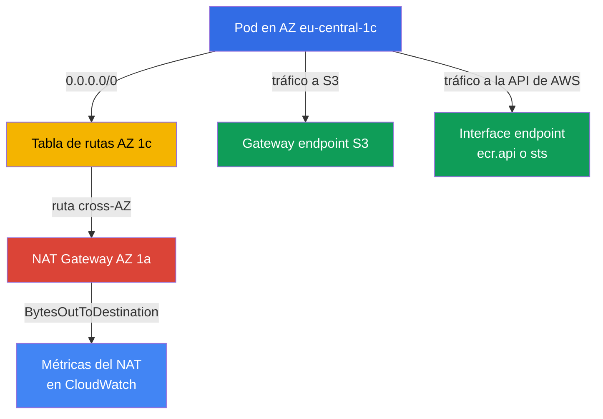
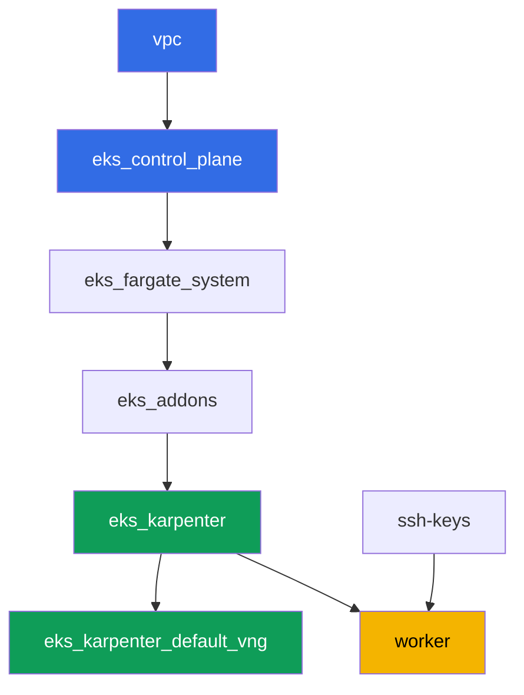

[Русская версия](README_RU.MD) · [Eng version](README.MD) · [Version française](README_FR.MD) · [Deutsche Version](README_DE.MD) · [ქართული ვერსია](README_GE.MD) · [繁體中文版](README_TW.MD) · [日本語版](README_JP.MD)

# Laboratorio 117 - Tráfico y coste: NAT por AZ frente a un único NAT, VPC endpoints, cross-AZ

## Descripción

El cluster ya está desplegado como código (lab 101), y en este lab profundizas en la
partida menos visible de la factura de EKS - el tráfico de salida (egress). La red del
lab está deliberadamente mixta: las subredes privadas de dos AZ ya tienen su propio NAT
Gateway (el patrón correcto), mientras que una tercera subred privada, en
`eu-central-1c`, se dejó sin ningún NAT. Empiezas registrando cuántos NAT Gateways
existen y en qué zonas, y luego reproduces deliberadamente la trampa clásica: apuntas la
ruta de la subred sin NAT hacia el gateway de una zona vecina y confirmas que un node en
esa zona envía tráfico cross-AZ. Después quitas parte del tráfico del NAT por completo:
levantas un gateway endpoint gratuito para S3 y un interface endpoint de pago para un
servicio de alto tráfico, y al final lees las métricas de CloudWatch para ver con tus
propios ojos el volumen de tráfico en cada NAT.

Las tareas están escritas en un estilo de producción: un enunciado breve más criterios
de aceptación. La comprobación es automática, mediante el comando `check_result`.

## Objetivo

Reforzar el material de estos capítulos del curso:

- [Capítulo 31. Egress y coste del tráfico: NAT, VPC endpoints,
  PrivateLink](../../course/31/ru.md) - por qué un único NAT para todo el cluster paga
  dos veces el tráfico cross-AZ, y cómo lo solucionan los gateway e interface endpoints
- [Capítulo 43. Coste: OpenCost y Kubecost, right-sizing, Savings Plans, mezcla de spot,
  tráfico](../../course/43/ru.md) - cómo aparecen el tráfico y los endpoints en Cost
  Explorer por tipo de uso

## Qué vamos a crear

El cluster ya está desplegado como código (igual que en el lab 101). La red de este lab
se diferencia de 101/103: en lugar de un único NAT para todo el cluster, aquí cada una de
dos AZ tiene su propio NAT, mientras que una tercera AZ se queda temporalmente sin él - tú
mismo reproduces y explicas la trampa cross-AZ, y luego quitas parte del tráfico del NAT
mediante VPC endpoints.

| Objeto | Qué es | Por qué está en este lab |
|--------|---------|-------------------|
| NAT Gateway en las AZ `eu-central-1a` y `eu-central-1b` | ya creado por el módulo `vpc_v3` (`nat_gateway = "SUBNET"`, una subred privada por zona) | el patrón correcto - un NAT por AZ, no uno por cluster (capítulo 31) |
| Subred privada `private-subnet-3` en `eu-central-1c` sin NAT | creada sin ruta `0.0.0.0/0` | punto de partida para reproducir la trampa del NAT cross-AZ (capítulo 31) |
| Tabla de rutas `private-subnet-3` (editada a mano) | ruta hacia el NAT de la AZ vecina | el propio mecanismo de la trampa: el tráfico va cross-AZ hacia el NAT de otro (capítulo 31) |
| Deployment `crossaz` (imagen `curlimages/curl`, nodeSelector zone `eu-central-1c`) | una carga de trabajo que fuerza a Karpenter a colocar un node exactamente en la AZ problemática | hace observable y reproducible el tráfico cross-AZ, desde el pod comprobamos el egress con `curl` (capítulo 31) |
| Gateway VPC endpoint para `s3` | una entrada en la tabla de rutas, sin coste alguno | el primer paso de optimización - saca el tráfico de S3 del NAT (capítulos 31, 43) |
| Interface VPC endpoint (`ecr.api` o `sts`) | un ENI con PrivateLink | saca del NAT el tráfico de un servicio de alta frecuencia (capítulo 31) |
| Artefactos en `/var/work/tests/artifacts/*` | hallazgos sobre NAT, rutas, endpoints, métricas | registran el análisis sin cifras en dólares, solo la estructura del tráfico (capítulos 31, 43) |



## Infraestructura

El entorno se despliega en AWS (`eu-central-1`) mediante Terragrunt, igual que en el lab
101. Cada directorio de lab es un componente con su propio `terragrunt.hcl`, que hace
referencia a un módulo compartido en `terraform/modules/` y declara dependencias
mediante bloques `dependency`.

### Módulos y dependencias

| Directorio (componente) | Módulo (`terraform/modules/`) | Depende de | Qué crea |
|---------------------|-------------------------------|------------|-------------|
| `vpc` | `vpc_v3` | - | VPC `10.10.0.0/16`, subredes públicas en dos AZ, subredes privadas en tres AZ, NAT en dos de ellas |
| `ssh-keys` | `ssh-keys` | - | un par de claves SSH para la máquina worker y los nodes |
| `eks_control_plane` | `eks_v2_control_plane` | `vpc` | control plane de EKS `1.36`, OIDC, security groups |
| `eks_fargate_system` | `eks_v2_fargate` | `vpc`, `eks_control_plane` | perfil Fargate para `kube-system` y `karpenter` |
| `eks_addons` | `eks_v2_addons` | `eks_control_plane`, `eks_fargate_system` | add-ons coredns, kube-proxy, vpc-cni, pod-identity |
| `eks_karpenter` | `eks_v2_karpenter` | `vpc`, `eks_control_plane`, `eks_addons`, `eks_fargate_system` | controlador de Karpenter, rol IAM de node |
| `eks_karpenter_default_vng` | `eks_v2_karpenter_vng` | `vpc`, `eks_control_plane`, `eks_karpenter` | NodePool `default` y EC2NodeClass por defecto sobre AL2023 |
| `worker` | `eks_v2_work_pc` | `ssh-keys`, `vpc`, `eks_control_plane`, `eks_karpenter` | máquina worker con kubectl, tests y `check_result` |

Grafo de dependencias (lo que se aplica antes está más abajo en la flecha), igual que en
el lab 101:



Todas las tareas de este lab se resuelven desde la máquina worker mediante la CLI de
`aws` y `kubectl`, sin ningún módulo terraform nuevo: la red ya reparte las subredes en
tres AZ y crea NAT solo en dos de ellas, y las rutas, endpoints y métricas son
operaciones de la CLI de AWS ejecutadas directamente desde el worker.

### La red de este lab: dónde está el patrón correcto y dónde está la trampa

Las subredes privadas `private-subnet-1` (`eu-central-1a`) y `private-subnet-2`
(`eu-central-1b`) se crearon con `nat_gateway = "SUBNET"` - el módulo `vpc_v3` construye
un NAT Gateway independiente para cada una de esas subredes, en la subred pública de la
misma zona. Aquí hay exactamente una subred privada por zona, así que "NAT por subred"
produce la misma infraestructura que "NAT por zona": un NAT Gateway cada uno en
`eu-central-1a` y `eu-central-1b`. Este es el patrón correcto del capítulo 31: el tráfico
de un node llega a un NAT de su propia zona, sin cruzar el límite de la AZ.

La subred `private-subnet-3` (`eu-central-1c`) se creó con `nat_gateway = "NONE"` - tiene
su propia tabla de rutas, pero esa tabla no tiene ruta `0.0.0.0/0`. Las tres subredes
llevan la etiqueta `karpenter.sh/discovery`, así que Karpenter puede colocar nodes en
ellas. En la tarea 2 añades tú mismo una ruta hacia el NAT Gateway de la AZ vecina en la
tabla de rutas de esta subred - y obtienes exactamente la trampa contra la que advierte el
capítulo 31: un node en `eu-central-1c` envía tráfico cross-AZ hacia el NAT de otra zona,
y eso se factura dos veces - una por el tráfico inter-AZ y otra por el procesamiento en
el propio NAT.

### Permisos del worker para rutas, endpoints y métricas

El rol del worker (`eks_v2_work_pc/iam.tf`) ya tenía `eks:*`, algunos `ec2:Describe*`
(subredes, security groups, instancias, ENIs), permiso para cambiar reglas de security
group (`ec2:AuthorizeSecurityGroupIngress`, `ec2:RevokeSecurityGroupIngress`), y acceso de
lectura a las métricas de CloudWatch (`cloudwatch:GetMetricStatistics`,
`cloudwatch:ListMetrics` desde el `Sid` `ObservabilityReadForMetricsLabs`). Para las
tareas 1-4 de este lab, que necesitan leer NAT Gateways y tablas de rutas, cambiar rutas
y crear VPC endpoints, se añadió a la política un `Sid` adicional
`TrafficAndEndpointsForLabs` con los permisos `ec2:CreateRoute`, `ec2:ReplaceRoute`,
`ec2:DeleteRoute`, `ec2:CreateVpcEndpoint`, `ec2:DeleteVpcEndpoints`,
`ec2:ModifyVpcEndpoint`, `ec2:DescribeVpcEndpoints`, `ec2:DescribeNatGateways`,
`ec2:DescribeRouteTables`, `cloudwatch:GetMetricStatistics`, `cloudwatch:ListMetrics` -
siguiendo el patrón de los `Sid` ya presentes en este archivo, sin cambiar el resto de la
política.

## Despliegue

```bash
TASK=117 make run_eks_task
```

El despliegue tarda aproximadamente 15-20 minutos. En la salida, busca la línea con la
conexión SSH a la máquina worker y conéctate a ella. kubectl ya está configurado allí
para el cluster correcto.

Comandos útiles en la máquina worker:

```bash
time_left       # cuánto tiempo de entorno queda
check_result    # comprobar la solución
```

> Seguridad del entorno. `env.hcl` tiene habilitados `ssh_password_enable = true` y
> `access_cidrs = ["0.0.0.0/0"]` - cómodo para un entorno de formación, pero no es algo
> que se deba hacer en producción. Según los estándares del curso, el acceso a las
> máquinas worker debería pasar por AWS SSM Session Manager sin exponer puertos SSH
> públicos, y `access_cidrs` debería restringirse a direcciones concretas. Aquí se deja
> el SSH público solo para mantener la configuración simple.

## Tareas

---
|        **1**        | **Cuántos NAT Gateways hay, y en qué zonas**                |
| :-----------------: | :---------------------------------------------------------- |
| Qué hacer          | Encuentra el `vpc-id` del cluster (`aws eks describe-cluster --name <name> --query 'cluster.resourcesVpcConfig.vpcId'`). Encuentra todos los NAT Gateways de este VPC: `aws ec2 describe-nat-gateways --filter "Name=vpc-id,Values=<vpc-id>" --query 'NatGateways[].[NatGatewayId,SubnetId,State]' --output table`. Para cada NAT, determina la AZ de su subred: `aws ec2 describe-subnets --subnet-ids <subnet-id> --query 'Subnets[0].AvailabilityZone'`. Guarda en `/var/work/tests/artifacts/1/natdiscovery.txt`, un `key=value` por línea: `nat_count` (número total de NAT Gateways), `nat_1_id`, `nat_1_az`, `nat_2_id`, `nat_2_az` (para cada NAT encontrado), y `no_nat_az` - la zona donde existe una subred privada pero no hay NAT Gateway. |
| Criterios de aceptación    | - el archivo no está vacío;<br/>- `nat_count` es igual al número real de NAT Gateways del VPC (`2`);<br/>- `nat_1_az`/`nat_2_az` son `eu-central-1a` y `eu-central-1b` (en cualquier orden);<br/>- `no_nat_az` es igual a `eu-central-1c`. |
---
|        **2**        | **Reproduciendo la trampa cross-AZ**                        |
| :-----------------: | :---------------------------------------------------------- |
| Qué hacer          | Encuentra la tabla de rutas de la subred `private-subnet-3`: `aws ec2 describe-route-tables --filters "Name=tag:Name,Values=private-subnet-3" --query 'RouteTables[0].RouteTableId'`. Añade una ruta hacia el NAT Gateway de una de las AZ vecinas (de la tarea 1): `aws ec2 create-route --route-table-id <rtb-id> --destination-cidr-block 0.0.0.0/0 --nat-gateway-id <nat-id>`. En el namespace `eks-117`, crea el Deployment `crossaz` (imagen `curlimages/curl:latest`, comando `sleep 3600`, `1` réplica) con `nodeSelector: topology.kubernetes.io/zone: eu-central-1c`, para que Karpenter levante un node exactamente en esa zona. Espera a `Running` y comprueba el egress desde dentro del pod: `kubectl exec -n eks-117 <pod> -- curl -s -o /dev/null -w '%{http_code}' https://checkip.amazonaws.com`. Guarda en `/var/work/tests/artifacts/2/crossaz.txt`: `subnet_c_route_table_id`, `nat_gateway_id_used`, `nat_gateway_az_used`, `pod_node`, `pod_node_zone`, `egress_http_code`, y una explicación (al menos una línea) que contenga la palabra `cross-AZ`: por qué el tráfico de un node desde `eu-central-1c` hacia un NAT de otra zona es un salto inter-AZ (cross-AZ) que se factura por separado, y cuál es el patrón correcto - un NAT Gateway en cada AZ que tenga nodes. |
| Criterios de aceptación    | - la tabla de rutas `private-subnet-3` contiene una ruta `0.0.0.0/0` hacia un NAT Gateway cuya AZ no es `eu-central-1c`;<br/>- el Deployment `crossaz` está ready (`1` réplica), el pod físicamente en un node de la zona `eu-central-1c`;<br/>- el archivo menciona `cross-AZ` y contiene `egress_http_code=200`. |
---
|        **3**        | **Gateway VPC endpoint para S3 - una ruta gratuita**         |
| :-----------------: | :---------------------------------------------------------- |
| Qué hacer          | Crea un gateway endpoint para S3, adjuntándolo de inmediato a las tres tablas de rutas privadas (`private-subnet-1`, `private-subnet-2`, `private-subnet-3`): `aws ec2 create-vpc-endpoint --vpc-id <vpc-id> --vpc-endpoint-type Gateway --service-name com.amazonaws.eu-central-1.s3 --route-table-ids <rtb-1> <rtb-2> <rtb-3>`. Espera al estado `available` (`aws ec2 describe-vpc-endpoints --filters "Name=vpc-id,Values=<vpc-id>" "Name=vpc-endpoint-type,Values=Gateway" --query 'VpcEndpoints[].[VpcEndpointId,State,RouteTableIds]'`). Guarda el id del endpoint, su estado y la lista de tablas de rutas en `/var/work/tests/artifacts/3/s3endpoint.txt`, con una explicación de que un gateway endpoint para S3 no se factura ni por hora ni por datos (la palabra `free` en la explicación). |
| Criterios de aceptación    | - el gateway endpoint para `com.amazonaws.eu-central-1.s3` está en estado `available`;<br/>- su `RouteTableIds` incluye las tres tablas de rutas privadas del lab;<br/>- el archivo menciona `available` y `free`. |
---
|        **4**        | **Interface VPC endpoint para un servicio de alto tráfico**   |
| :-----------------: | :---------------------------------------------------------- |
| Qué hacer          | Elige un servicio - `ecr.api` (autorización del registro de imágenes en cada pull) o `sts` (intercambio de un token IRSA/Pod Identity por claves temporales en cada arranque de pod) - y justifica la elección en el artefacto. Encuentra el security group por defecto del VPC (`aws ec2 describe-security-groups --filters "Name=vpc-id,Values=<vpc-id>" "Name=group-name,Values=default" --query 'SecurityGroups[0].GroupId'`). Permite el tráfico entrante HTTPS desde el CIDR del VPC en este security group, de lo contrario el endpoint quedará inalcanzable: `aws ec2 authorize-security-group-ingress --group-id <sg-id> --protocol tcp --port 443 --cidr 10.10.0.0/16`. Crea un interface endpoint: `aws ec2 create-vpc-endpoint --vpc-id <vpc-id> --vpc-endpoint-type Interface --service-name com.amazonaws.eu-central-1.<ecr.api\|sts> --subnet-ids <private-subnet-1-id> <private-subnet-2-id> --security-group-ids <sg-id> --private-dns-enabled`. Espera a `available`. Guarda en `/var/work/tests/artifacts/4/interfaceendpoint.txt`: `service_chosen`, `vpc_endpoint_id`, `state`, `private_dns_enabled`, y una justificación de la elección (al menos una línea). |
| Criterios de aceptación    | - el interface endpoint para `com.amazonaws.eu-central-1.ecr.api` o `com.amazonaws.eu-central-1.sts` está en estado `available`, con `PrivateDnsEnabled: true`;<br/>- el archivo menciona el servicio elegido y `available`. |

> Por qué la regla del security group es obligatoria. Con `--private-dns-enabled` el
> endpoint intercepta el nombre público del servicio en todo el VPC:
> `sts.eu-central-1.amazonaws.com` empieza a resolverse hacia las direcciones privadas
> del ENI del endpoint. Si el security group del endpoint no permite HTTPS desde los
> nodes y los pods, las peticiones al servicio dejan de funcionar en todo el VPC - la
> regla de entrada del security group por defecto solo permite tráfico de miembros del
> mismo grupo, y los nodes de Karpenter viven en otro grupo. El síntoma: `curl` a
> `https://sts.eu-central-1.amazonaws.com` desde un pod devuelve el código `000` y un
> timeout, y los controladores que usan IRSA (incluido el propio Karpenter) fallan en su
> siguiente renovación de credenciales. La regla `443` desde el CIDR del VPC resuelve
> esto; en producción se usa para el endpoint un security group dedicado con la misma
> intención.

---
|        **5**        | **Métricas del NAT: cuántos bytes pasaron por cada gateway**       |
| :-----------------: | :---------------------------------------------------------- |
| Qué hacer          | Para ambos NAT Gateways de la tarea 1, obtén la suma de `BytesOutToDestination` de las últimas horas: `aws cloudwatch get-metric-statistics --namespace AWS/NATGateway --metric-name BytesOutToDestination --statistics Sum --period 3600 --dimensions Name=NatGatewayId,Value=<nat-id> --start-time <ISO> --end-time <ISO>` (por ejemplo, `--start-time $(date -u -d '3 hours ago' +%Y-%m-%dT%H:%M:%S) --end-time $(date -u +%Y-%m-%dT%H:%M:%S)`). Suma los totales entre los puntos de datos de cada NAT. Guarda en `/var/work/tests/artifacts/5/natmetrics.txt`: `nat_a_id`, `nat_a_bytes_out_sum`, `nat_b_id`, `nat_b_bytes_out_sum`, `total_bytes_out_sum` (suma de los dos valores anteriores), y una explicación: cuál de los dos NAT asumió el node cross-AZ de la tarea 2 (indica su id) y por qué se espera que tenga un volumen mayor, si la carga de prueba generó tráfico. |
| Criterios de aceptación    | - el archivo contiene las cinco claves numéricas y menciona `BytesOutToDestination`;<br/>- `total_bytes_out_sum` es igual a la suma de `nat_a_bytes_out_sum` y `nat_b_bytes_out_sum`;<br/>- el archivo menciona el `nat_gateway_id_used` de la tarea 2 (el mismo id de NAT Gateway). |
---

## Comprobación del resultado

En la máquina worker, ejecuta la comprobación automática:

```bash
check_result
```

El script ejecutará los tests y mostrará el porcentaje de tareas completadas.

## Solución

Solución de referencia: [worker/files/solutions/1_ES.MD](worker/files/solutions/1_ES.MD)

## Eliminación del cluster y los recursos

En este lab creaste manualmente dos VPC endpoints (un gateway endpoint para S3 y un
interface endpoint para `sts`/`ecr.api`), y la carga de trabajo de la tarea 2 hizo que
Karpenter levantara un node EC2 en `eu-central-1c`. Ninguno de los dos está en el state de
terraform, así que un `destroy` sin preparación se queda atascado: el ENI del interface
endpoint retiene la subred, los propios endpoints retienen el VPC, y el node EC2 huérfano
retiene la subred y el security group (el mismo patrón que en los labs 108, 109, 111, 114,
115, 116). Orden de limpieza - primero endpoints y carga de trabajo, luego terraform:

```bash
# 1. Eliminar ambos VPC endpoints creados a mano en las tareas 3 y 4
CLUSTER=$(aws eks list-clusters --query 'clusters[0]' --output text)
VPC=$(aws eks describe-cluster --name "$CLUSTER" \
  --query 'cluster.resourcesVpcConfig.vpcId' --output text)
EPS=$(aws ec2 describe-vpc-endpoints --filters "Name=vpc-id,Values=$VPC" \
  --query 'VpcEndpoints[].VpcEndpointId' --output text)
echo "endpoints to delete: $EPS"
aws ec2 delete-vpc-endpoints --vpc-endpoint-ids $EPS

# 2. Eliminar la carga de trabajo que hizo que Karpenter levantara un node EC2
kubectl delete namespace eks-117

# 3. Esperar a que Karpenter realmente termine la instancia EC2 (no solo elimine el
#    objeto Node), y a que desaparezcan los ENIs del interface endpoint eliminado -
#    cada salida de abajo debería quedar vacía
for i in $(seq 1 30); do
  nc=$(kubectl get nodeclaims --no-headers 2>/dev/null | wc -l)
  ec2=$(aws ec2 describe-instances \
    --filters "Name=tag:karpenter.sh/nodepool,Values=default" \
    "Name=instance-state-name,Values=running,pending,stopping,stopped" \
    --query 'Reservations[].Instances[].InstanceId' --output text)
  eps=$(aws ec2 describe-vpc-endpoints --filters "Name=vpc-id,Values=$VPC" \
    "Name=vpc-endpoint-state,Values=available,pending,deleting" \
    --query 'VpcEndpoints[].VpcEndpointId' --output text)
  echo "nodeclaims=$nc ec2_instances=[$ec2] endpoints=[$eps]"
  [[ "$nc" == "0" ]] && [[ -z "$ec2" ]] && [[ -z "$eps" ]] && break
  sleep 10
done
```

No es necesario eliminar por separado la ruta `0.0.0.0/0` añadida a mano a la tabla de
rutas de `private-subnet-3`, ni la regla `443` en el security group por defecto: la tabla
de rutas y el security group por defecto se eliminan junto con el VPC, y la ruta
desaparece junto con su tabla de rutas.

Solo una vez que `nodeclaims=0` y las listas de instancias EC2 y endpoints estén vacías,
ejecuta el desmontaje de recursos de terraform:

```bash
TASK=117 make delete_eks_task
```
