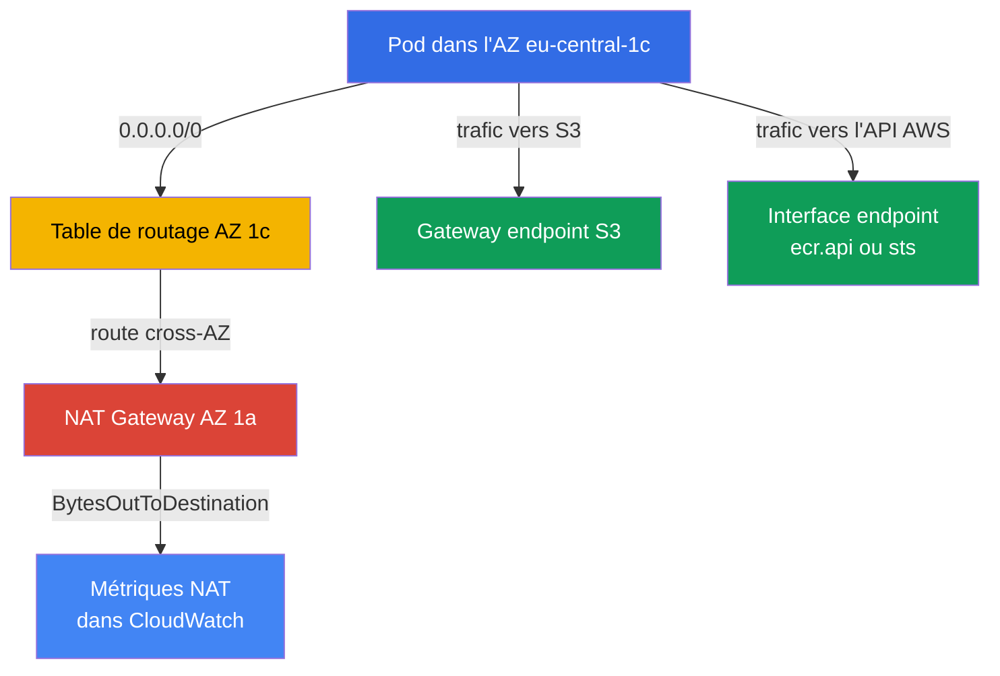
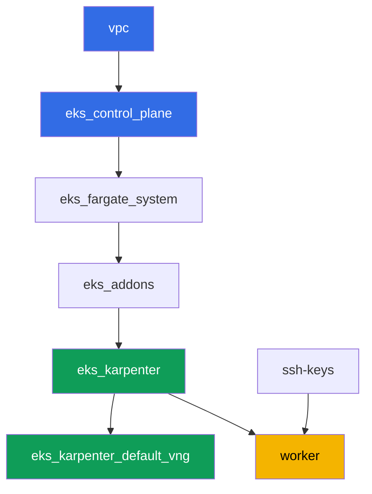

[Русская версия](README_RU.MD) · [Eng version](README.MD) · [Versión en español](README_ES.MD) · [Deutsche Version](README_DE.MD) · [ქართული ვერსია](README_GE.MD) · [繁體中文版](README_TW.MD) · [日本語版](README_JP.MD)

# Labo 117 - Trafic et coûts : NAT par AZ vs. un NAT unique, VPC endpoints, cross-AZ

## Description

Le cluster est déjà déployé en tant que code (labo 101), et dans ce labo vous plongez
dans la ligne la moins visible de la facture EKS - le trafic egress. Le réseau du labo
est volontairement mixte : les subnets privés de deux AZ possèdent déjà chacun leur
propre NAT Gateway (le bon schéma), tandis qu'un troisième subnet privé, dans
`eu-central-1c`, a été laissé sans aucun NAT. Vous commencez par constater combien de
NAT Gateways existent et dans quelles zones, puis vous reproduisez délibérément le piège
classique - vous pointez la route du subnet sans NAT vers le gateway d'une zone voisine
et vous confirmez qu'un node de cette zone pousse son trafic en cross-AZ. Ensuite vous
retirez une partie du trafic de NAT : vous créez un gateway endpoint gratuit pour S3 et
un interface endpoint payant pour un service à fort trafic, puis pour finir vous lisez
les métriques CloudWatch afin de constater vous-même le volume de trafic sur chaque NAT.

Les tâches sont écrites dans un style production : un énoncé court plus des critères
d'acceptation. La vérification est automatique, via la commande `check_result`.

## Objectif

Renforcer les chapitres du cours suivants :

- [Chapitre 31. Egress et coût du trafic : NAT, VPC endpoints,
  PrivateLink](../../course/31/ru.md) - pourquoi un NAT unique par cluster fait payer
  deux fois le trafic cross-AZ, et comment les gateway et interface endpoints
  corrigent cela
- [Chapitre 43. Coût : OpenCost et Kubecost, right-sizing, Savings Plans, mix spot,
  trafic](../../course/43/ru.md) - comment le trafic et les endpoints apparaissent dans
  Cost Explorer par type d'usage

## Ce que nous créons

Le cluster est déjà déployé en tant que code (comme dans le labo 101). Le réseau de ce
labo diffère de celui des labos 101/103 : au lieu d'un NAT unique pour tout le cluster,
chacune de deux AZ dispose ici de son propre NAT, tandis qu'une troisième AZ en est
temporairement dépourvue - vous reproduisez et expliquez vous-même le piège cross-AZ,
puis vous retirez une partie du trafic de NAT via des VPC endpoints.

| Objet | Ce que c'est | Pourquoi dans ce labo |
|--------|---------|-------------------|
| NAT Gateway dans les AZ `eu-central-1a` et `eu-central-1b` | déjà créés par le module `vpc_v3` (`nat_gateway = "SUBNET"`, un subnet privé par zone) | le bon schéma - un NAT par AZ, pas un par cluster (chapitre 31) |
| Subnet privé `private-subnet-3` dans `eu-central-1c` sans NAT | créé sans route `0.0.0.0/0` | point de départ pour reproduire le piège NAT cross-AZ (chapitre 31) |
| Table de routage `private-subnet-3` (modifiée à la main) | route vers le NAT de l'AZ voisine | le mécanisme même du piège : le trafic part en cross-AZ vers le NAT d'une autre zone (chapitre 31) |
| Deployment `crossaz` (image `curlimages/curl`, nodeSelector zone `eu-central-1c`) | une charge qui force Karpenter à placer un node exactement dans l'AZ problématique | rend le trafic cross-AZ observable et reproductible, depuis le pod on vérifie l'egress via `curl` (chapitre 31) |
| Gateway VPC endpoint pour `s3` | une entrée de table de routage, gratuite | la première étape d'optimisation - retire le trafic S3 de NAT (chapitres 31, 43) |
| Interface VPC endpoint (`ecr.api` ou `sts`) | un ENI avec PrivateLink | retire le trafic d'un service à haute fréquence de NAT (chapitre 31) |
| Artefacts dans `/var/work/tests/artifacts/*` | constats sur NAT, routes, endpoints, métriques | consignent l'analyse sans chiffres en dollars, juste la structure du trafic (chapitres 31, 43) |



## Infrastructure

L'environnement est déployé sur AWS (`eu-central-1`) via Terragrunt, comme dans le labo
101. Chaque répertoire de labo est un composant avec son propre `terragrunt.hcl`, qui
référence un module partagé dans `terraform/modules/` et déclare des dépendances via des
blocs `dependency`.

### Modules et dépendances

| Répertoire (composant) | Module (`terraform/modules/`) | Dépend de | Ce qu'il crée |
|---------------------|-------------------------------|------------|-------------|
| `vpc` | `vpc_v3` | - | VPC `10.10.0.0/16`, subnets publics dans deux AZ, subnets privés dans trois AZ, NAT dans deux d'entre elles |
| `ssh-keys` | `ssh-keys` | - | une paire de clés SSH pour la machine worker et les nodes |
| `eks_control_plane` | `eks_v2_control_plane` | `vpc` | control plane EKS `1.36`, OIDC, security groups |
| `eks_fargate_system` | `eks_v2_fargate` | `vpc`, `eks_control_plane` | profil Fargate pour `kube-system` et `karpenter` |
| `eks_addons` | `eks_v2_addons` | `eks_control_plane`, `eks_fargate_system` | add-ons coredns, kube-proxy, vpc-cni, pod-identity |
| `eks_karpenter` | `eks_v2_karpenter` | `vpc`, `eks_control_plane`, `eks_addons`, `eks_fargate_system` | le contrôleur Karpenter, rôle IAM des nodes |
| `eks_karpenter_default_vng` | `eks_v2_karpenter_vng` | `vpc`, `eks_control_plane`, `eks_karpenter` | NodePool `default` par défaut et EC2NodeClass sur AL2023 |
| `worker` | `eks_v2_work_pc` | `ssh-keys`, `vpc`, `eks_control_plane`, `eks_karpenter` | la machine worker avec kubectl, les tests et `check_result` |

Graphe de dépendances (ce qui est appliqué en premier est plus bas le long de la
flèche), comme dans le labo 101 :



Toutes les tâches de ce labo se résolvent depuis la machine worker via la CLI `aws` et
`kubectl`, sans aucun nouveau module terraform : le réseau répartit déjà les subnets sur
trois AZ et ne crée un NAT que dans deux d'entre elles, et les routes, endpoints et
métriques sont de simples opérations AWS CLI exécutées directement depuis la worker.

### Le réseau de ce labo : où se trouve le bon schéma, et où se trouve le piège

Les subnets privés `private-subnet-1` (`eu-central-1a`) et `private-subnet-2`
(`eu-central-1b`) ont été créés avec `nat_gateway = "SUBNET"` - le module `vpc_v3`
construit un NAT Gateway séparé pour chacun de ces subnets, dans le subnet public de la
même zone. Il n'y a ici qu'un seul subnet privé par zone, donc « un NAT par subnet »
produit la même infrastructure que « un NAT par zone » : un NAT Gateway chacun dans
`eu-central-1a` et `eu-central-1b`. C'est le bon schéma du chapitre 31 : le trafic d'un
node atteint un NAT dans sa propre zone, sans traverser de frontière d'AZ.

Le subnet `private-subnet-3` (`eu-central-1c`) a été créé avec `nat_gateway = "NONE"` -
il a sa propre table de routage, mais cette table n'a pas de route `0.0.0.0/0`. Les
trois subnets portent le tag `karpenter.sh/discovery`, donc Karpenter peut y placer des
nodes. Dans la tâche 2 vous ajoutez vous-même une route vers le NAT Gateway de l'AZ
voisine dans la table de routage de ce subnet - et vous obtenez exactement le piège dont
le chapitre 31 met en garde : un node dans `eu-central-1c` envoie son trafic en cross-AZ
vers le NAT d'une autre zone, et cela est facturé deux fois - une fois pour le trafic
inter-AZ et une fois pour le traitement sur le NAT lui-même.

### Permissions de la worker pour les routes, endpoints et métriques

Le rôle de la worker (`eks_v2_work_pc/iam.tf`) disposait déjà de `eks:*`, de quelques
`ec2:Describe*` (subnets, security groups, instances, ENI), de la permission de modifier
les règles de security group (`ec2:AuthorizeSecurityGroupIngress`,
`ec2:RevokeSecurityGroupIngress`), et d'un accès en lecture aux métriques CloudWatch
(`cloudwatch:GetMetricStatistics`, `cloudwatch:ListMetrics` depuis le `Sid`
`ObservabilityReadForMetricsLabs`). Pour les tâches 1 à 4 de ce labo, qui nécessitent de
lire les NAT Gateways et les tables de routage, de modifier des routes et de créer des
VPC endpoints, un `Sid` supplémentaire `TrafficAndEndpointsForLabs` a été ajouté à la
policy avec les permissions `ec2:CreateRoute`, `ec2:ReplaceRoute`, `ec2:DeleteRoute`,
`ec2:CreateVpcEndpoint`, `ec2:DeleteVpcEndpoints`, `ec2:ModifyVpcEndpoint`,
`ec2:DescribeVpcEndpoints`, `ec2:DescribeNatGateways`, `ec2:DescribeRouteTables`,
`cloudwatch:GetMetricStatistics`, `cloudwatch:ListMetrics` - en suivant le schéma des
`Sid` déjà présents dans ce fichier, sans modifier le reste de la policy.

## Déploiement

```bash
TASK=117 make run_eks_task
```

Le déploiement prend environ 15 à 20 minutes. Dans la sortie, trouvez la ligne avec la
connexion SSH à la machine worker et connectez-vous. kubectl y est déjà configuré pour
le bon cluster.

Commandes utiles sur la machine worker :

```bash
time_left       # temps d'environnement restant
check_result    # vérifier la solution
```

> Sécurité de l'environnement. `env.hcl` a `ssh_password_enable = true` et
> `access_cidrs = ["0.0.0.0/0"]` activés - pratique pour un environnement de
> formation, mais à ne pas faire en production. Selon les standards du cours, l'accès
> aux machines worker devrait passer par AWS SSM Session Manager sans exposer de ports
> SSH publics, et `access_cidrs` devrait être restreint à des adresses précises. Ici, le
> SSH public n'est laissé que pour garder le montage simple.

## Tâches

---
|        **1**        | **Combien de NAT Gateways, et dans quelles zones**                |
| :-----------------: | :---------------------------------------------------------- |
| Ce qu'il faut faire          | Trouvez le `vpc-id` du cluster (`aws eks describe-cluster --name <name> --query 'cluster.resourcesVpcConfig.vpcId'`). Trouvez tous les NAT Gateways dans cette VPC : `aws ec2 describe-nat-gateways --filter "Name=vpc-id,Values=<vpc-id>" --query 'NatGateways[].[NatGatewayId,SubnetId,State]' --output table`. Pour chaque NAT, déterminez l'AZ de son subnet : `aws ec2 describe-subnets --subnet-ids <subnet-id> --query 'Subnets[0].AvailabilityZone'`. Enregistrez dans `/var/work/tests/artifacts/1/natdiscovery.txt`, un `key=value` par ligne : `nat_count` (nombre total de NAT Gateways), `nat_1_id`, `nat_1_az`, `nat_2_id`, `nat_2_az` (pour chaque NAT trouvé), et `no_nat_az` - la zone où un subnet privé existe mais où il n'y a pas de NAT Gateway. |
| Critères d'acceptation    | - le fichier n'est pas vide;<br/>- `nat_count` égale le nombre réel de NAT Gateways dans la VPC (`2`);<br/>- `nat_1_az`/`nat_2_az` sont `eu-central-1a` et `eu-central-1b` (dans n'importe quel ordre);<br/>- `no_nat_az` égale `eu-central-1c`. |
---
|        **2**        | **Reproduire le piège cross-AZ**                        |
| :-----------------: | :---------------------------------------------------------- |
| Ce qu'il faut faire          | Trouvez la table de routage du subnet `private-subnet-3` : `aws ec2 describe-route-tables --filters "Name=tag:Name,Values=private-subnet-3" --query 'RouteTables[0].RouteTableId'`. Ajoutez une route vers le NAT Gateway d'une des AZ voisines (issue de la tâche 1) : `aws ec2 create-route --route-table-id <rtb-id> --destination-cidr-block 0.0.0.0/0 --nat-gateway-id <nat-id>`. Dans le namespace `eks-117`, créez le Deployment `crossaz` (image `curlimages/curl:latest`, commande `sleep 3600`, `1` réplica) avec `nodeSelector: topology.kubernetes.io/zone: eu-central-1c`, pour que Karpenter lève un node exactement dans cette zone. Attendez `Running` et vérifiez l'egress depuis le pod : `kubectl exec -n eks-117 <pod> -- curl -s -o /dev/null -w '%{http_code}' https://checkip.amazonaws.com`. Enregistrez dans `/var/work/tests/artifacts/2/crossaz.txt` : `subnet_c_route_table_id`, `nat_gateway_id_used`, `nat_gateway_az_used`, `pod_node`, `pod_node_zone`, `egress_http_code`, et une explication (au moins une ligne) contenant le mot `cross-AZ` : pourquoi le trafic d'un node de `eu-central-1c` vers un NAT d'une autre zone constitue un saut inter-AZ (cross-AZ) facturé séparément, et quel est le bon schéma - un NAT Gateway dans chaque AZ qui a des nodes. |
| Critères d'acceptation    | - la table de routage `private-subnet-3` contient une route `0.0.0.0/0` vers un NAT Gateway dont l'AZ n'est pas `eu-central-1c`;<br/>- le Deployment `crossaz` est prêt (`1` réplica), le pod physiquement sur un node de la zone `eu-central-1c`;<br/>- le fichier mentionne `cross-AZ` et contient `egress_http_code=200`. |
---
|        **3**        | **Gateway VPC endpoint pour S3 - une route gratuite**         |
| :-----------------: | :---------------------------------------------------------- |
| Ce qu'il faut faire          | Créez un gateway endpoint pour S3, en l'attachant tout de suite aux trois tables de routage privées (`private-subnet-1`, `private-subnet-2`, `private-subnet-3`) : `aws ec2 create-vpc-endpoint --vpc-id <vpc-id> --vpc-endpoint-type Gateway --service-name com.amazonaws.eu-central-1.s3 --route-table-ids <rtb-1> <rtb-2> <rtb-3>`. Attendez l'état `available` (`aws ec2 describe-vpc-endpoints --filters "Name=vpc-id,Values=<vpc-id>" "Name=vpc-endpoint-type,Values=Gateway" --query 'VpcEndpoints[].[VpcEndpointId,State,RouteTableIds]'`). Enregistrez l'id de l'endpoint, son état et la liste des tables de routage dans `/var/work/tests/artifacts/3/s3endpoint.txt`, avec une explication indiquant qu'un gateway endpoint pour S3 n'est facturé ni à l'heure ni pour les données (le mot `free` dans l'explication). |
| Critères d'acceptation    | - le gateway endpoint pour `com.amazonaws.eu-central-1.s3` est à l'état `available`;<br/>- ses `RouteTableIds` incluent les trois tables de routage privées du labo;<br/>- le fichier mentionne `available` et `free`. |
---
|        **4**        | **Interface VPC endpoint pour un service à fort trafic**   |
| :-----------------: | :---------------------------------------------------------- |
| Ce qu'il faut faire          | Choisissez un service - `ecr.api` (autorisation du registre d'images à chaque pull) ou `sts` (échange d'un token IRSA/Pod Identity contre des identifiants temporaires à chaque démarrage de pod) - et justifiez le choix dans l'artefact. Trouvez le security group par défaut de la VPC (`aws ec2 describe-security-groups --filters "Name=vpc-id,Values=<vpc-id>" "Name=group-name,Values=default" --query 'SecurityGroups[0].GroupId'`). Autorisez l'entrée HTTPS depuis le CIDR de la VPC dans ce security group, sinon l'endpoint sera inaccessible : `aws ec2 authorize-security-group-ingress --group-id <sg-id> --protocol tcp --port 443 --cidr 10.10.0.0/16`. Créez un interface endpoint : `aws ec2 create-vpc-endpoint --vpc-id <vpc-id> --vpc-endpoint-type Interface --service-name com.amazonaws.eu-central-1.<ecr.api\|sts> --subnet-ids <private-subnet-1-id> <private-subnet-2-id> --security-group-ids <sg-id> --private-dns-enabled`. Attendez `available`. Enregistrez dans `/var/work/tests/artifacts/4/interfaceendpoint.txt` : `service_chosen`, `vpc_endpoint_id`, `state`, `private_dns_enabled`, et une justification du choix (au moins une ligne). |
| Critères d'acceptation    | - l'interface endpoint pour `com.amazonaws.eu-central-1.ecr.api` ou `com.amazonaws.eu-central-1.sts` est à l'état `available`, avec `PrivateDnsEnabled: true`;<br/>- le fichier mentionne le service choisi et `available`. |

> Pourquoi la règle de security group est obligatoire. Avec `--private-dns-enabled`
> l'endpoint intercepte le nom public du service dans toute la VPC :
> `sts.eu-central-1.amazonaws.com` commence à résoudre vers les adresses privées de
> l'ENI de l'endpoint. Si le security group de l'endpoint n'autorise pas HTTPS depuis
> les nodes et les pods, les requêtes vers le service s'arrêtent dans toute la VPC - la
> règle d'entrée du security group par défaut n'autorise que le trafic venant des
> membres du même groupe, et les nodes de Karpenter vivent dans un autre groupe. Le
> symptôme : `curl` vers `https://sts.eu-central-1.amazonaws.com` depuis un pod renvoie
> le code `000` et un timeout, et les contrôleurs utilisant IRSA (Karpenter lui-même
> inclus) échouent à leur prochain renouvellement d'identifiants. La règle `443` depuis
> le CIDR de la VPC résout cela; en production un security group dédié avec la même
> intention est utilisé pour l'endpoint.

---
|        **5**        | **Métriques NAT : combien d'octets sont passés par chaque gateway**       |
| :-----------------: | :---------------------------------------------------------- |
| Ce qu'il faut faire          | Pour les deux NAT Gateways de la tâche 1, récupérez la somme de `BytesOutToDestination` sur les dernières heures : `aws cloudwatch get-metric-statistics --namespace AWS/NATGateway --metric-name BytesOutToDestination --statistics Sum --period 3600 --dimensions Name=NatGatewayId,Value=<nat-id> --start-time <ISO> --end-time <ISO>` (par exemple, `--start-time $(date -u -d '3 hours ago' +%Y-%m-%dT%H:%M:%S) --end-time $(date -u +%Y-%m-%dT%H:%M:%S)`). Additionnez les sommes sur les points de données de chaque NAT. Enregistrez dans `/var/work/tests/artifacts/5/natmetrics.txt` : `nat_a_id`, `nat_a_bytes_out_sum`, `nat_b_id`, `nat_b_bytes_out_sum`, `total_bytes_out_sum` (somme des deux valeurs précédentes), et une explication : lequel des deux NAT a pris en charge le node cross-AZ de la tâche 2 (indiquez son id) et pourquoi on attend de lui un volume plus grand, si la charge de test a généré du trafic. |
| Critères d'acceptation    | - le fichier contient les cinq clés numériques et mentionne `BytesOutToDestination`;<br/>- `total_bytes_out_sum` égale la somme de `nat_a_bytes_out_sum` et `nat_b_bytes_out_sum`;<br/>- le fichier mentionne le `nat_gateway_id_used` de la tâche 2 (le même id de NAT Gateway). |
---

## Vérification du résultat

Sur la machine worker, exécutez la vérification automatique :

```bash
check_result
```

Le script exécute les tests et affiche le pourcentage de tâches accomplies.

## Solution

Solution de référence : [worker/files/solutions/1_FR.MD](worker/files/solutions/1_FR.MD)

## Suppression du cluster et des ressources

Dans ce labo vous avez créé à la main deux VPC endpoints (un gateway endpoint pour S3 et
un interface endpoint pour `sts`/`ecr.api`), et la charge de la tâche 2 a fait que
Karpenter a levé un node EC2 dans `eu-central-1c`. Aucun des deux n'est dans le state
terraform, donc un `destroy` non préparé se bloque : l'ENI de l'interface endpoint
retient le subnet, les endpoints eux-mêmes retiennent la VPC, et le node EC2 orphelin
retient le subnet et le security group (le même schéma que dans les labos 108, 109, 111,
114, 115, 116). Ordre de nettoyage - endpoints et charge d'abord, puis terraform :

```bash
# 1. On supprime les deux VPC endpoints créés à la main dans les tâches 3 et 4
CLUSTER=$(aws eks list-clusters --query 'clusters[0]' --output text)
VPC=$(aws eks describe-cluster --name "$CLUSTER" \
  --query 'cluster.resourcesVpcConfig.vpcId' --output text)
EPS=$(aws ec2 describe-vpc-endpoints --filters "Name=vpc-id,Values=$VPC" \
  --query 'VpcEndpoints[].VpcEndpointId' --output text)
echo "endpoints à supprimer : $EPS"
aws ec2 delete-vpc-endpoints --vpc-endpoint-ids $EPS

# 2. On retire la charge qui a fait lever le node EC2 par Karpenter
kubectl delete namespace eks-117

# 3. On attend que Karpenter termine réellement l'instance EC2 (pas seulement l'objet
#    Node), et que les ENI de l'interface endpoint supprimé disparaissent - chaque
#    sortie ci-dessous doit être vide
for i in $(seq 1 30); do
  nc=$(kubectl get nodeclaims --no-headers 2>/dev/null | wc -l)
  ec2=$(aws ec2 describe-instances \
    --filters "Name=tag:karpenter.sh/nodepool,Values=default" \
    "Name=instance-state-name,Values=running,pending,stopping,stopped" \
    --query 'Reservations[].Instances[].InstanceId' --output text)
  eps=$(aws ec2 describe-vpc-endpoints --filters "Name=vpc-id,Values=$VPC" \
    "Name=vpc-endpoint-state,Values=available,pending,deleting" \
    --query 'VpcEndpoints[].VpcEndpointId' --output text)
  echo "nodeclaims=$nc ec2_instances=[$ec2] endpoints=[$eps]"
  [[ "$nc" == "0" ]] && [[ -z "$ec2" ]] && [[ -z "$eps" ]] && break
  sleep 10
done
```

Il n'est pas nécessaire de retirer séparément la route `0.0.0.0/0` ajoutée à la main
dans la table de routage de `private-subnet-3`, ni la règle `443` du security group par
défaut : la table de routage et le security group par défaut sont supprimés avec la VPC,
et la route disparaît avec sa table de routage.

Seulement une fois que `nodeclaims=0` et que les listes d'instances EC2 et d'endpoints
sont vides, lancez la suppression des ressources terraform :

```bash
TASK=117 make delete_eks_task
```
