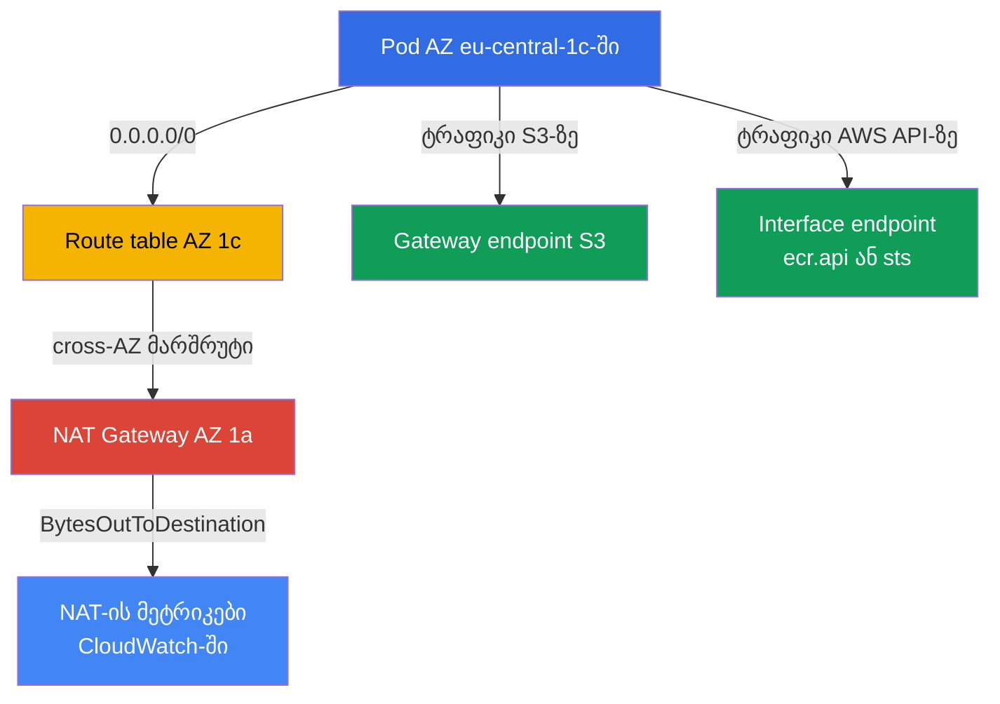
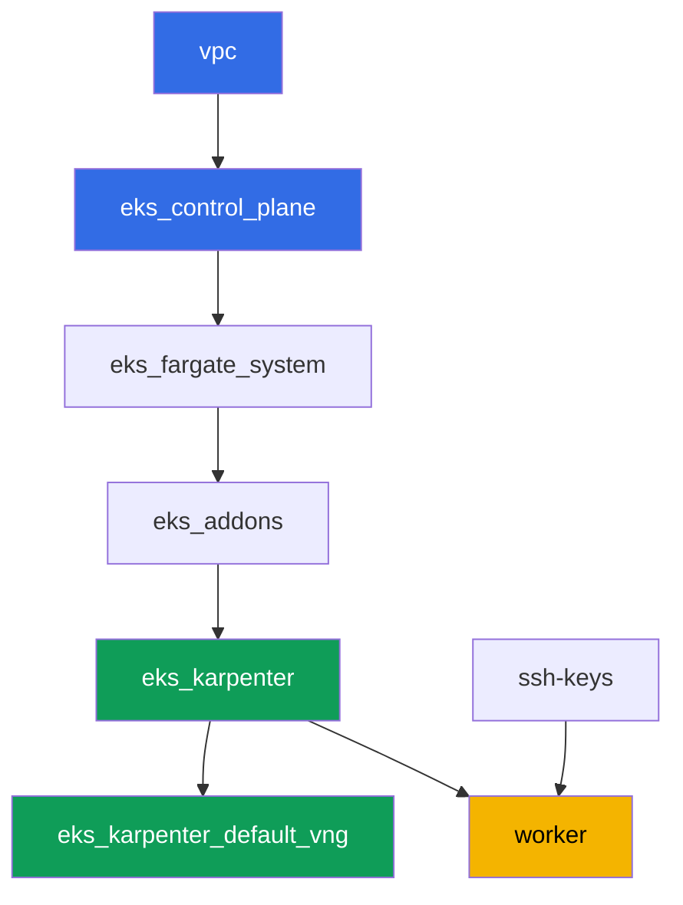

[Русская версия](README_RU.MD) · [Eng version](README.MD) · [Versión en español](README_ES.MD) · [Version française](README_FR.MD) · [Deutsche Version](README_DE.MD) · [繁體中文版](README_TW.MD) · [日本語版](README_JP.MD)

# ლაბა 117 - ტრაფიკი და ღირებულება: NAT ზონების მიხედვით ერთი NAT-ის წინააღმდეგ, VPC endpoints, cross-AZ

## აღწერა

კლასტერი უკვე გაშლილია კოდის სახით (ლაბა 101), და ამ ლაბაში ჩაუღრმავდებით EKS-ის
ხარჯებში ყველაზე ნაკლებად შესამჩნევ პუნქტს - egress-ტრაფიკს. ლაბის ქსელი განზრახ
შერეულია: პრივატულ subnets ორ AZ-ში უკვე ჰყავს თითო NAT Gateway (სწორი პატერნი), ხოლო
მესამე პრივატულ subnet-ს, `eu-central-1c`-ში, საერთოდ არ ჰყავს NAT. თავიდან ფიქსირებთ,
რამდენი NAT Gateway არსებობს და რომელ ზონებში, შემდეგ განზრახ იმეორებთ კლასიკურ
ხაფანგს - NAT-ის არმქონე subnet-ის route-ს მიმართავთ მეზობელი ზონის gateway-ზე და
ადასტურებთ, რომ იმ ზონის node-ი ტრაფიკს cross-AZ გზავნის. ამის შემდეგ ტრაფიკის ნაწილს
საერთოდ ხსნით NAT-იდან: აყალიბებთ უფასო gateway endpoint-ს S3-სთვის და ფასიან interface
endpoint-ს მაღალტრაფიკიანი სერვისისთვის, ხოლო ბოლოს კითხულობთ CloudWatch-ის მეტრიკებს,
რომ საკუთარი თვალით დაინახოთ ტრაფიკის მოცულობა თითო NAT-ზე.

დავალებები დაწერილია production-სტილში: მოკლე დებულება პლუს მიღების კრიტერიუმები.
შემოწმება ავტომატურია, ბრძანებით `check_result`.

## მიზანი

გავიმყაროთ კურსის თავების მასალა:

- [თავი 31. Egress და ტრაფიკის ღირებულება: NAT, VPC endpoints,
  PrivateLink](../../course/31/ru.md) - რატომ იხდის ერთი NAT კლასტერზე ორმაგად cross-AZ
  ტრაფიკისთვის და როგორ ასწორებენ ამას gateway და interface endpoints
- [თავი 43. ღირებულება: OpenCost და Kubecost, right-sizing, Savings Plans, spot-მიქსი,
  ტრაფიკი](../../course/43/ru.md) - როგორ ჩანს ტრაფიკი და endpoints Cost Explorer-ში
  usage type-ის მიხედვით

## რას ვქმნით

კლასტერი უკვე გაშლილია კოდის სახით (როგორც ლაბა 101-ში). ამ ლაბის ქსელი განსხვავდება
101/103-ისგან: მთელი კლასტერისთვის ერთი NAT-ის ნაცვლად, აქ ორივე AZ-ს ჰყავს საკუთარი
NAT, ხოლო მესამე AZ დროებით NAT-ის გარეშეა - თავად იმეორებთ და ხსნით cross-AZ ხაფანგს,
შემდეგ ხსნით ტრაფიკის ნაწილს NAT-იდან VPC endpoints-ის მეშვეობით.

| ობიექტი | რას წარმოადგენს | რატომ არის ამ ლაბაში |
|--------|---------|-------------------|
| NAT Gateway AZ `eu-central-1a`-ში და `eu-central-1b`-ში | უკვე შექმნილია მოდულით `vpc_v3` (`nat_gateway = "SUBNET"`, თითო პრივატული subnet თითო ზონაზე) | სწორი პატერნი - თითო NAT თითო AZ-ზე, არა ერთი კლასტერზე (თავი 31) |
| პრივატული subnet `private-subnet-3` `eu-central-1c`-ში, NAT-ის გარეშე | შექმნილია `0.0.0.0/0` route-ის გარეშე | საწყისი წერტილი cross-AZ NAT ხაფანგის გასამეორებლად (თავი 31) |
| Route table `private-subnet-3` (ხელით რედაქტირებული) | route მეზობელი AZ-ის NAT-ზე | ხაფანგის თავადი მექანიზმი: ტრაფიკი cross-AZ გზავნის სხვისი NAT-ისკენ (თავი 31) |
| Deployment `crossaz` (image `curlimages/curl`, nodeSelector ზონა `eu-central-1c`) | დატვირთვა, რომელიც Karpenter-ს აიძულებს ზუსტად პრობლემურ AZ-ში node-ის დაყენებას | cross-AZ ტრაფიკს ხდის დაკვირვებადს და გამეორებადს, pod-იდან ვამოწმებთ egress-ს `curl`-ით (თავი 31) |
| Gateway VPC endpoint `s3`-სთვის | ჩანაწერი route table-ში, უფასოდ | ოპტიმიზაციის პირველი ნაბიჯი - ხსნის S3-ის ტრაფიკს NAT-იდან (თავები 31, 43) |
| Interface VPC endpoint (`ecr.api` ან `sts`) | ENI PrivateLink-ით | ხსნის მაღალსიხშირული სერვისის ტრაფიკს NAT-იდან (თავი 31) |
| არტეფაქტები `/var/work/tests/artifacts/*`-ში | დასკვნები NAT-ის, route-ების, endpoints-ის, მეტრიკების შესახებ | ფიქსირებენ ანალიზს დოლარებში ციფრების გარეშე, მხოლოდ ტრაფიკის სტრუქტურას (თავები 31, 43) |



## ინფრასტრუქტურა

გარემო იშლება AWS-ში (`eu-central-1`) Terragrunt-ის მეშვეობით, როგორც ლაბა 101-ში.
ლაბის ყოველი დირექტორია წარმოადგენს ერთ კომპონენტს, საკუთარი `terragrunt.hcl`-ით,
რომელიც მიმართავს საერთო მოდულს `terraform/modules/`-ში და აცხადებს დამოკიდებულებებს
`dependency` ბლოკებით.

### მოდულები და დამოკიდებულებები

| დირექტორია (კომპონენტი) | მოდული (`terraform/modules/`) | დამოკიდებულია | რას ქმნის |
|---------------------|-------------------------------|------------|-------------|
| `vpc` | `vpc_v3` | - | VPC `10.10.0.0/16`, საჯარო subnets ორ AZ-ში, პრივატული subnets სამ AZ-ში, NAT ორში მათგანში |
| `ssh-keys` | `ssh-keys` | - | SSH-გასაღებების წყვილი worker მანქანისთვის და node-ებისთვის |
| `eks_control_plane` | `eks_v2_control_plane` | `vpc` | EKS control plane `1.36`, OIDC, security groups |
| `eks_fargate_system` | `eks_v2_fargate` | `vpc`, `eks_control_plane` | Fargate profile `kube-system`-ისთვის და `karpenter`-ისთვის |
| `eks_addons` | `eks_v2_addons` | `eks_control_plane`, `eks_fargate_system` | add-on-ები coredns, kube-proxy, vpc-cni, pod-identity |
| `eks_karpenter` | `eks_v2_karpenter` | `vpc`, `eks_control_plane`, `eks_addons`, `eks_fargate_system` | Karpenter კონტროლერი, node-ის IAM role |
| `eks_karpenter_default_vng` | `eks_v2_karpenter_vng` | `vpc`, `eks_control_plane`, `eks_karpenter` | ნაგულისხმევი NodePool `default` და EC2NodeClass AL2023-ზე |
| `worker` | `eks_v2_work_pc` | `ssh-keys`, `vpc`, `eks_control_plane`, `eks_karpenter` | worker მანქანა kubectl-ით, ტესტებით და `check_result`-ით |

დამოკიდებულების გრაფი (რაც უფრო ადრე გამოიყენება, ისე უფრო დაბლაა ისარზე), ისეთივე,
როგორც ლაბა 101-ში:



ამ ლაბის ყველა დავალება წყდება worker მანქანიდან `aws` CLI-ისა და `kubectl`-ის
მეშვეობით, ახალი terraform-მოდულების გარეშე: ქსელი უკვე ანაწილებს subnets სამ AZ-ში და
ქმნის NAT მხოლოდ ორში მათგანში, ხოლო route-ები, endpoints და მეტრიკები ეს არის AWS
CLI-ის ჩვეულებრივი ოპერაციები, გაშვებული პირდაპირ worker-იდან.

### ამ ლაბის ქსელი: სად არის სწორი პატერნი და სად ხაფანგი

პრივატული subnets `private-subnet-1` (`eu-central-1a`) და `private-subnet-2`
(`eu-central-1b`) შექმნილია `nat_gateway = "SUBNET"`-ით - მოდული `vpc_v3` აგებს
ცალკე NAT Gateway-ს ყოველი ასეთი subnet-ისთვის, იმავე ზონის საჯარო subnet-ში. აქ
ზუსტად ერთი პრივატული subnet არის თითო ზონაზე, ამიტომ "NAT თითო subnet-ზე" აწარმოებს
იმავე ინფრასტრუქტურას, რაც "NAT თითო ზონაზე": თითო NAT Gateway `eu-central-1a`-ში და
`eu-central-1b`-ში. ეს არის თავი 31-ის სწორი პატერნი: node-ის ტრაფიკი აღწევს NAT-ს
საკუთარ ზონაში, AZ-ის საზღვრის გადაკვეთის გარეშე.

Subnet `private-subnet-3` (`eu-central-1c`) შექმნილია `nat_gateway = "NONE"`-ით - მას
აქვს საკუთარი route table, მაგრამ ამ table-ს არ აქვს `0.0.0.0/0` route. სამივე subnet
ატარებს ტეგს `karpenter.sh/discovery`, ამიტომ Karpenter-ს შეუძლია მათში node-ების
დაყენება. დავალება 2-ში თავად ამატებთ ამ subnet-ის route table-ს route-ს მეზობელი
AZ-ის NAT Gateway-ზე - და ზუსტად იმ ხაფანგს იღებთ, რომლის შესახებაც აფრთხილებს
თავი 31: node-ი `eu-central-1c`-ში ტრაფიკს cross-AZ გზავნის სხვისი NAT-ისკენ, და ეს
ორმაგად ტარიფირდება - ერთხელ AZ-შორისი ტრაფიკისთვის და ერთხელ NAT-ზე თავადვე
დამუშავებისთვის.

### Worker-ის უფლებები route-ებისთვის, endpoints-ისთვის და მეტრიკებისთვის

Worker-ის role-ს (`eks_v2_work_pc/iam.tf`) უკვე ჰქონდა `eks:*`, ნაწილი `ec2:Describe*`
(subnets, security groups, instances, ENI), security group-ის წესების შეცვლის
უფლება (`ec2:AuthorizeSecurityGroupIngress`, `ec2:RevokeSecurityGroupIngress`) და
CloudWatch-ის მეტრიკების წაკითხვის უფლება (`cloudwatch:GetMetricStatistics`,
`cloudwatch:ListMetrics` `Sid`-იდან `ObservabilityReadForMetricsLabs`). ამ ლაბის
დავალებებისთვის 1-4, სადაც საჭიროა NAT Gateway-ებისა და route tables-ის წაკითხვა,
route-ების შეცვლა და VPC endpoints-ის შექმნა, policy-ს დაემატა ერთი დამატებითი `Sid`
`TrafficAndEndpointsForLabs` უფლებებით `ec2:CreateRoute`, `ec2:ReplaceRoute`,
`ec2:DeleteRoute`, `ec2:CreateVpcEndpoint`, `ec2:DeleteVpcEndpoints`,
`ec2:ModifyVpcEndpoint`, `ec2:DescribeVpcEndpoints`, `ec2:DescribeNatGateways`,
`ec2:DescribeRouteTables`, `cloudwatch:GetMetricStatistics`, `cloudwatch:ListMetrics` -
ამ ფაილში უკვე არსებული `Sid`-ების პატერნის მიმდევრობით, დანარჩენი policy-ის
შეცვლის გარეშე.

## გაშლა

```bash
TASK=117 make run_eks_task
```

გაშლას სჭირდება დაახლოებით 15-20 წუთი. გამონატანში იპოვეთ სტრიქონი worker მანქანასთან
SSH-კავშირით და დაუკავშირდით მას. kubectl იქ უკვე კონფიგურირებულია სწორ კლასტერზე.

სასარგებლო ბრძანებები worker მანქანაზე:

```bash
time_left       # რამდენი დროა დარჩენილი გარემოს
check_result    # გადაწყვეტის შემოწმება
```

> სავარჯიშო სტენდის უსაფრთხოება. `env.hcl`-ში ჩართულია `ssh_password_enable = true`
> და `access_cidrs = ["0.0.0.0/0"]` - მოხერხებულია სასწავლო გარემოსთვის, მაგრამ ასე
> არ ღირს production-ში. კურსის სტანდარტების მიხედვით, worker მანქანებზე წვდომა
> იხსნება AWS SSM Session Manager-ის მეშვეობით საჯარო SSH პორტების გარეშე, ხოლო
> `access_cidrs` ვიწროვდება კონკრეტულ მისამართებზე. აქ საჯარო SSH დატანილია მხოლოდ
> გაშვების სიმარტივისთვის.

## დავალებები

---
|        **1**        | **რამდენი NAT Gateway და რომელ ზონებში**                |
| :-----------------: | :---------------------------------------------------------- |
| რას ვაკეთებთ          | დაადგინეთ კლასტერის `vpc-id` (`aws eks describe-cluster --name <name> --query 'cluster.resourcesVpcConfig.vpcId'`). იპოვეთ ამ VPC-ის ყველა NAT Gateway: `aws ec2 describe-nat-gateways --filter "Name=vpc-id,Values=<vpc-id>" --query 'NatGateways[].[NatGatewayId,SubnetId,State]' --output table`. თითოეული NAT-ისთვის დაადგინეთ მისი subnet-ის AZ: `aws ec2 describe-subnets --subnet-ids <subnet-id> --query 'Subnets[0].AvailabilityZone'`. შეინახეთ `/var/work/tests/artifacts/1/natdiscovery.txt`-ში, თითო `key=value` თითო სტრიქონზე: `nat_count` (NAT Gateway-ების საერთო რაოდენობა), `nat_1_id`, `nat_1_az`, `nat_2_id`, `nat_2_az` (თითოეული ნაპოვნი NAT-ისთვის) და `no_nat_az` - ზონა, სადაც პრივატული subnet არსებობს, მაგრამ NAT Gateway არ არის. |
| მიღების კრიტერიუმები    | - ფაილი არ არის ცარიელი;<br/>- `nat_count` ტოლია VPC-ში NAT Gateway-ების ფაქტობრივი რაოდენობის (`2`);<br/>- `nat_1_az`/`nat_2_az` არის `eu-central-1a` და `eu-central-1b` (ნებისმიერი თანმიმდევრობით);<br/>- `no_nat_az` ტოლია `eu-central-1c`-ის. |
---
|        **2**        | **cross-AZ ხაფანგის გამეორება**                        |
| :-----------------: | :---------------------------------------------------------- |
| რას ვაკეთებთ          | იპოვეთ subnet `private-subnet-3`-ის route table: `aws ec2 describe-route-tables --filters "Name=tag:Name,Values=private-subnet-3" --query 'RouteTables[0].RouteTableId'`. დაამატეთ route ერთი მეზობელი AZ-ის NAT Gateway-ზე (დავალება 1-იდან): `aws ec2 create-route --route-table-id <rtb-id> --destination-cidr-block 0.0.0.0/0 --nat-gateway-id <nat-id>`. Namespace `eks-117`-ში შექმენით Deployment `crossaz` (image `curlimages/curl:latest`, ბრძანება `sleep 3600`, `1` replica) `nodeSelector: topology.kubernetes.io/zone: eu-central-1c`-ით, რომ Karpenter-მა ზუსტად იმ ზონაში ააგოს node. დაელოდეთ `Running`-ს და შეამოწმეთ egress pod-ის შიგნიდან: `kubectl exec -n eks-117 <pod> -- curl -s -o /dev/null -w '%{http_code}' https://checkip.amazonaws.com`. შეინახეთ `/var/work/tests/artifacts/2/crossaz.txt`-ში: `subnet_c_route_table_id`, `nat_gateway_id_used`, `nat_gateway_az_used`, `pod_node`, `pod_node_zone`, `egress_http_code`, და განმარტება (მინიმუმ ერთი სტრიქონი) სიტყვით `cross-AZ`: რატომ არის node-ის ტრაფიკი `eu-central-1c`-იდან სხვა ზონაში მდებარე NAT-ზე AZ-შორისი (cross-AZ) გადასვლა, რომელიც ცალკე ტარიფირდება, და როგორია სწორი პატერნი - NAT Gateway ყველა AZ-ში, სადაც node-ები არსებობს. |
| მიღების კრიტერიუმები    | - route table `private-subnet-3` შეიცავს `0.0.0.0/0` route-ს NAT Gateway-ზე, რომლის AZ არ არის `eu-central-1c`;<br/>- Deployment `crossaz` მზადაა (`1` replica), pod ფიზიკურად node-ზეა ზონაში `eu-central-1c`;<br/>- ფაილი ახსენებს `cross-AZ`-ს და შეიცავს `egress_http_code=200`-ს. |
---
|        **3**        | **Gateway VPC endpoint S3-სთვის - უფასო route**         |
| :-----------------: | :---------------------------------------------------------- |
| რას ვაკეთებთ          | შექმენით gateway endpoint S3-სთვის, პირდაპირ მიაბრათ ის სამივე პრივატულ route table-ს (`private-subnet-1`, `private-subnet-2`, `private-subnet-3`): `aws ec2 create-vpc-endpoint --vpc-id <vpc-id> --vpc-endpoint-type Gateway --service-name com.amazonaws.eu-central-1.s3 --route-table-ids <rtb-1> <rtb-2> <rtb-3>`. დაელოდეთ `available` სტატუსს (`aws ec2 describe-vpc-endpoints --filters "Name=vpc-id,Values=<vpc-id>" "Name=vpc-endpoint-type,Values=Gateway" --query 'VpcEndpoints[].[VpcEndpointId,State,RouteTableIds]'`). შეინახეთ endpoint-ის id, მისი state და route tables-ის სია `/var/work/tests/artifacts/3/s3endpoint.txt`-ში, განმარტებით, რომ S3-ის gateway endpoint არ ტარიფირდება არც საათობრივად, არც მონაცემებზე (სიტყვა `free` განმარტებაში). |
| მიღების კრიტერიუმები    | - gateway endpoint `com.amazonaws.eu-central-1.s3`-სთვის არის state `available`-ში;<br/>- მისი `RouteTableIds` მოიცავს ლაბის სამივე პრივატულ route table-ს;<br/>- ფაილი ახსენებს `available`-ს და `free`-ს. |
---
|        **4**        | **Interface VPC endpoint მაღალტრაფიკიანი სერვისისთვის**   |
| :-----------------: | :---------------------------------------------------------- |
| რას ვაკეთებთ          | აირჩიეთ ერთი სერვისი - `ecr.api` (image registry-ის ავტორიზაცია ყოველ pull-ზე) ან `sts` (IRSA/Pod Identity token-ის დროებით key-ებზე გაცვლა ყოველ pod-ის სტარტზე) - და დაასაბუთეთ არჩევანი არტეფაქტში. იპოვეთ VPC-ის default security group (`aws ec2 describe-security-groups --filters "Name=vpc-id,Values=<vpc-id>" "Name=group-name,Values=default" --query 'SecurityGroups[0].GroupId'`). დაუშვით ამ security group-ში შემავალი HTTPS VPC-ის CIDR-იდან, სხვანაირად endpoint მიუწვდომელი იქნება: `aws ec2 authorize-security-group-ingress --group-id <sg-id> --protocol tcp --port 443 --cidr 10.10.0.0/16`. შექმენით interface endpoint: `aws ec2 create-vpc-endpoint --vpc-id <vpc-id> --vpc-endpoint-type Interface --service-name com.amazonaws.eu-central-1.<ecr.api\|sts> --subnet-ids <private-subnet-1-id> <private-subnet-2-id> --security-group-ids <sg-id> --private-dns-enabled`. დაელოდეთ `available`-ს. შეინახეთ `/var/work/tests/artifacts/4/interfaceendpoint.txt`-ში: `service_chosen`, `vpc_endpoint_id`, `state`, `private_dns_enabled`, და არჩევანის დასაბუთება (მინიმუმ ერთი სტრიქონი). |
| მიღების კრიტერიუმები    | - interface endpoint `com.amazonaws.eu-central-1.ecr.api`-სთვის ან `com.amazonaws.eu-central-1.sts`-სთვის არის state `available`-ში, `PrivateDnsEnabled: true`-ით;<br/>- ფაილი ახსენებს არჩეულ სერვისს და `available`-ს. |

> რატომ არის security group-ის წესი სავალდებულო. `--private-dns-enabled`-ით
> endpoint-ი გადამწვდომობს სერვისის საჯარო სახელს მთელ VPC-ში:
> `sts.eu-central-1.amazonaws.com` იწყებს რეზოლვირებას endpoint-ის ENI-ის
> პრივატულ მისამართებზე. თუ endpoint-ის security group არ უშვებს HTTPS-ს
> node-ებიდან და pod-ებიდან, სერვისზე მოთხოვნები წყდება მთელ VPC-ში - default
> security group-ის შემავალი წესი უშვებს ტრაფიკს მხოლოდ იმავე group-ის წევრებისგან,
> ხოლო Karpenter-ის node-ები სხვა group-ში ცხოვრობენ. სიმპტომი: `curl`
> `https://sts.eu-central-1.amazonaws.com`-ზე pod-იდან აბრუნებს კოდს `000` და
> timeout-ს, ხოლო IRSA-ის მომხმარებელი კონტროლერები (Karpenter-ის ჩათვლით)
> ხვდებიან შემდეგ credentials refresh-ზე. წესი `443` VPC CIDR-იდან ხსნის ამ
> საკითხს; production-ში endpoint-ისთვის ცალკე security group იქმნება იმავე
> მიზნით.

---
|        **5**        | **NAT-ის მეტრიკები: რამდენი ბაიტი გავიდა თითო gateway-ზე**       |
| :-----------------: | :---------------------------------------------------------- |
| რას ვაკეთებთ          | ორივე NAT Gateway-ისთვის დავალება 1-იდან, აღებთ `BytesOutToDestination`-ის ჯამს ბოლო რამდენიმე საათისთვის: `aws cloudwatch get-metric-statistics --namespace AWS/NATGateway --metric-name BytesOutToDestination --statistics Sum --period 3600 --dimensions Name=NatGatewayId,Value=<nat-id> --start-time <ISO> --end-time <ISO>` (მაგალითად, `--start-time $(date -u -d '3 hours ago' +%Y-%m-%dT%H:%M:%S) --end-time $(date -u +%Y-%m-%dT%H:%M:%S)`). დააჯამეთ ჯამები თითოეული NAT-ის data points-ის მიხედვით. შეინახეთ `/var/work/tests/artifacts/5/natmetrics.txt`-ში: `nat_a_id`, `nat_a_bytes_out_sum`, `nat_b_id`, `nat_b_bytes_out_sum`, `total_bytes_out_sum` (ორი წინა მნიშვნელობის ჯამი), და განმარტება: ორი NAT-იდან რომელმა აიტანა cross-AZ node დავალება 2-იდან (მიუთითეთ მისი id) და რატომ არის მოსალოდნელი, რომ მას ჰქონდეს უფრო დიდი მოცულობა, თუ ტესტის დატვირთვამ გენერირა ტრაფიკი. |
| მიღების კრიტერიუმები    | - ფაილი შეიცავს ყველა ხუთ რიცხვით key-ს და ახსენებს `BytesOutToDestination`-ს;<br/>- `total_bytes_out_sum` ტოლია `nat_a_bytes_out_sum`-ისა და `nat_b_bytes_out_sum`-ის ჯამის;<br/>- ფაილი ახსენებს `nat_gateway_id_used`-ს დავალება 2-იდან (იმავე NAT Gateway-ის id). |
---

## შედეგის შემოწმება

worker მანქანაზე გაუშვით ავტომატური შემოწმება:

```bash
check_result
```

სკრიპტი გაუშვებს ტესტებს და აჩვენებს დასრულებული დავალებების პროცენტს.

## გადაწყვეტა

ეტალონური გადაწყვეტა: [worker/files/solutions/1_GE.MD](worker/files/solutions/1_GE.MD)

## კლასტერისა და რესურსების წაშლა

ამ ლაბაში ხელით შექმენით ორი VPC endpoint (gateway endpoint S3-სთვის და interface
endpoint `sts`/`ecr.api`-სთვის), ხოლო დავალება 2-ის დატვირთვამ Karpenter-ს ააყრო EC2
node `eu-central-1c`-ში. არც ერთი მათგანი არ არის terraform state-ში, ამიტომ
მოუმზადებელი `destroy` ჩაერჭობა: interface endpoint-ის ENI ინახავს subnet-ს, თავად
endpoints ინახავენ VPC-ს, ხოლო ორფან EC2 node ინახავს subnet-ს და security group-ს
(იგივე პატერნი, რაც ლაბებში 108, 109, 111, 114, 115, 116). დასუფთავების
თანმიმდევრობა - ჯერ endpoints და დატვირთვა, შემდეგ terraform:

```bash
# 1. წავშალოთ ორივე VPC endpoint, ხელით შექმნილი დავალებებში 3 და 4
CLUSTER=$(aws eks list-clusters --query 'clusters[0]' --output text)
VPC=$(aws eks describe-cluster --name "$CLUSTER" \
  --query 'cluster.resourcesVpcConfig.vpcId' --output text)
EPS=$(aws ec2 describe-vpc-endpoints --filters "Name=vpc-id,Values=$VPC" \
  --query 'VpcEndpoints[].VpcEndpointId' --output text)
echo "endpoints to delete: $EPS"
aws ec2 delete-vpc-endpoints --vpc-endpoint-ids $EPS

# 2. ვხსნით დატვირთვას, რომელმაც Karpenter-ს ააყრო EC2 node
kubectl delete namespace eks-117

# 3. ველოდებით, სანამ Karpenter თავად არ დაასრულებს EC2-ინსტანსს (არა უბრალოდ Node
#    ობიექტის წაშლა), და სანამ არ გაქრება წაშლილი interface endpoint-ის ENI-ები -
#    ყველა გამონატანი ქვემოთ უნდა იყოს ცარიელი
for i in $(seq 1 30); do
  nc=$(kubectl get nodeclaims --no-headers 2>/dev/null | wc -l)
  ec2=$(aws ec2 describe-instances \
    --filters "Name=tag:karpenter.sh/nodepool,Values=default" \
    "Name=instance-state-name,Values=running,pending,stopping,stopped" \
    --query 'Reservations[].Instances[].InstanceId' --output text)
  eps=$(aws ec2 describe-vpc-endpoints --filters "Name=vpc-id,Values=$VPC" \
    "Name=vpc-endpoint-state,Values=available,pending,deleting" \
    --query 'VpcEndpoints[].VpcEndpointId' --output text)
  echo "nodeclaims=$nc ec2_instances=[$ec2] endpoints=[$eps]"
  [[ "$nc" == "0" ]] && [[ -z "$ec2" ]] && [[ -z "$eps" ]] && break
  sleep 10
done
```

ცალკე მოხსნა არ სჭირდება `0.0.0.0/0` route-ს, ხელით დამატებულს
`private-subnet-3`-ის route table-ში, ან `443` წესს default security group-ში:
route table და default security group წაშლილი იქნება VPC-სთან ერთად, ხოლო route
გაქრება თავად route table-თან ერთად.

მხოლოდ მას შემდეგ, რაც `nodeclaims=0` და EC2-ინსტანსებისა და endpoints-ის სია
ცარიელია, გაუშვით terraform რესურსების წაშლა:

```bash
TASK=117 make delete_eks_task
```
