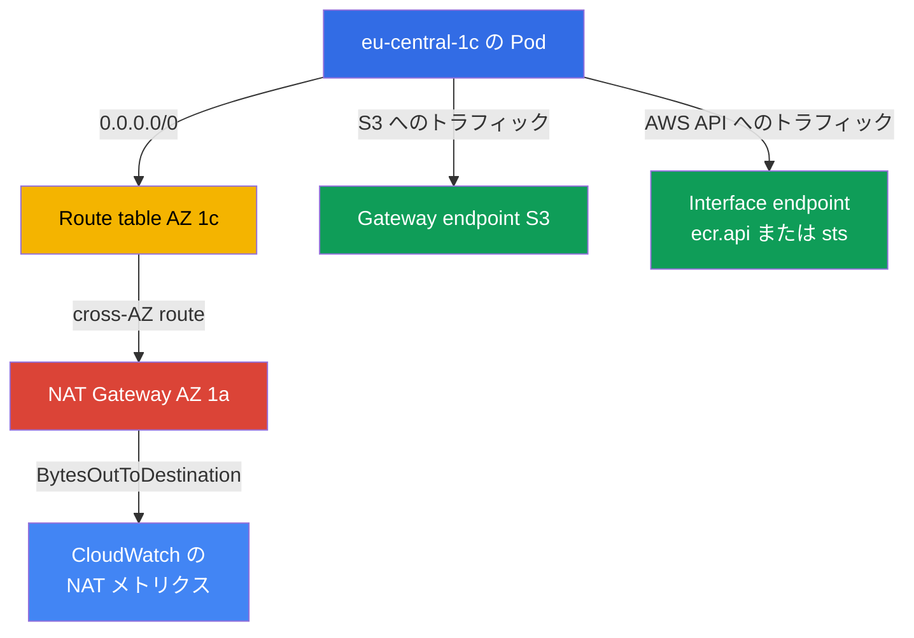
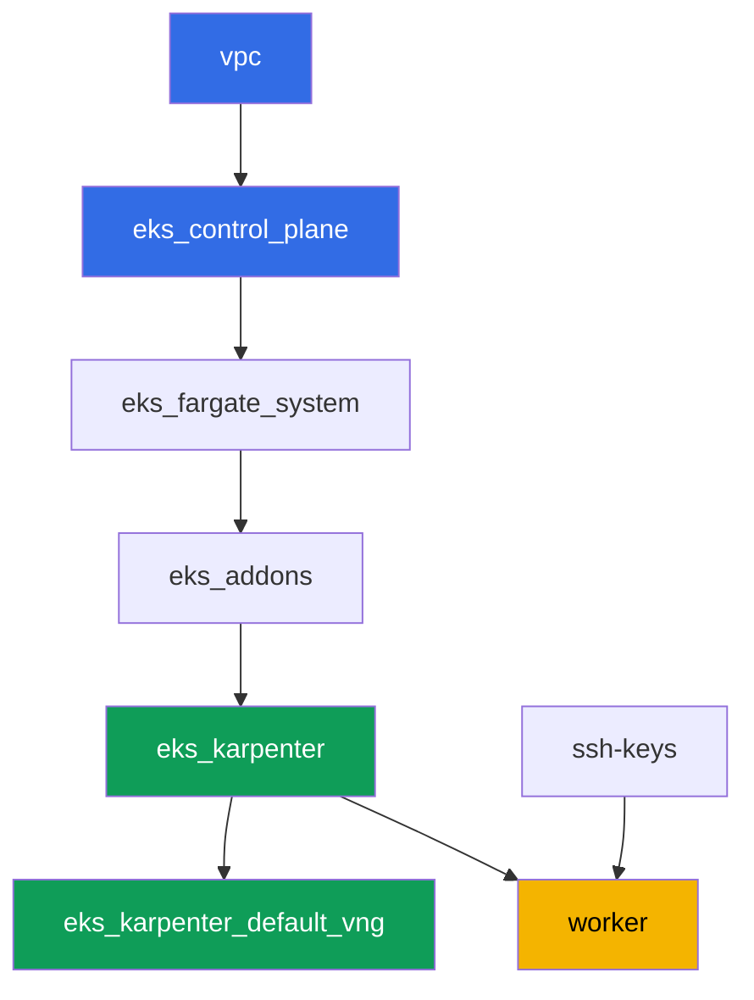

[Русская версия](README_RU.MD) · [Eng version](README.MD) · [Versión en español](README_ES.MD) · [Version française](README_FR.MD) · [Deutsche Version](README_DE.MD) · [ქართული ვერსია](README_GE.MD) · [繁體中文版](README_TW.MD)

# ラボ 117 - トラフィックとコスト:AZ ごとの NAT と単一 NAT、VPC endpoint、cross-AZ

## 説明

クラスタはすでにコードとしてデプロイされており(ラボ 101)、このラボでは EKS の請求書
の中でも最も目に見えにくい項目 - egress トラフィック - を掘り下げます。このラボのネッ
トワークはあえて混在させてあります:2 つの AZ にある private subnet にはすでにそれぞれ
1 つの NAT Gateway が用意されている(正しいパターン)一方、`eu-central-1c` にある 3 つ目
の private subnet には NAT がまったくありません。まず、NAT Gateway がいくつ存在し、ど
の zone にあるかを記録します。次に、あえて典型的な罠を再現します - NAT のない subnet の
route を隣接 zone の gateway に向け、その zone のノードがトラフィックを cross-AZ で送り
出すことを確認します。その後、トラフィックの一部を NAT から完全に取り除きます:S3 用の
無料の gateway endpoint と、高頻度サービス用の有料の interface endpoint を立ち上げ、最
後に CloudWatch のメトリクスを読んで、各 NAT を通ったトラフィック量を自分の目で確認しま
す。

タスクは production スタイルで書かれています:短い課題文とアクセプタンス基準。検証は
`check_result` コマンドによって自動的に行われます。

## 目的

コースの以下の章の内容を定着させます:

- [第 31 章。Egress とトラフィックコスト:NAT、VPC endpoint、
  PrivateLink](../../course/31/ru.md) - クラスタ全体で単一の NAT を使うと cross-AZ トラ
  フィックに二重に課金される理由、そして gateway endpoint と interface endpoint がそれ
  をどう解決するか
- [第 43 章。コスト:OpenCost と Kubecost、right-sizing、Savings Plans、spot mix、
  トラフィック](../../course/43/ru.md) - トラフィックと endpoint が使用タイプ別に Cost
  Explorer にどう現れるか

## 作成するもの

クラスタはすでにコードとしてデプロイされています(ラボ 101 と同様)。このラボのネット
ワークは 101/103 とは異なります:クラスタ全体で単一の NAT を使うのではなく、2 つの AZ
それぞれが自分専用の NAT を持ち、3 つ目の AZ には一時的に NAT がありません - あなた自身
が cross-AZ の罠を再現・説明し、その後 VPC endpoint によってトラフィックの一部を NAT か
ら取り除きます。

| オブジェクト | 何か | このラボでの目的 |
|--------|---------|-------------------|
| AZ `eu-central-1a` と `eu-central-1b` の NAT Gateway | `vpc_v3` モジュールによってすでに作成済み(`nat_gateway = "SUBNET"`、zone ごとに 1 つの private subnet) | 正しいパターン - クラスタごとに 1 つではなく、AZ ごとに 1 つの NAT(第 31 章) |
| `eu-central-1c` の NAT のない private subnet `private-subnet-3` | `0.0.0.0/0` の route なしで作成済み | cross-AZ NAT の罠を再現するための出発点(第 31 章) |
| Route table `private-subnet-3`(手動で編集) | 隣接 AZ の NAT への route | 罠そのものの仕組み:トラフィックが他人の NAT へ cross-AZ で流れる(第 31 章) |
| Deployment `crossaz`(イメージ `curlimages/curl`、nodeSelector zone `eu-central-1c`) | Karpenter に問題の AZ にノードを配置させるワークロード | cross-AZ トラフィックを観測・再現可能にし、Pod から `curl` で egress を確認する(第 31 章) |
| `s3` 用の gateway VPC endpoint | route table のエントリで、無料 | 最初の最適化ステップ - S3 トラフィックを NAT から取り除く(第 31、43 章) |
| interface VPC endpoint(`ecr.api` または `sts`) | PrivateLink を持つ ENI | 高頻度サービスのトラフィックを NAT から取り除く(第 31 章) |
| `/var/work/tests/artifacts/*` のアーティファクト | NAT、route、endpoint、メトリクスに関する調査結果 | ドル金額なしで、トラフィックの構造だけを分析結果として記録する(第 31、43 章) |



## インフラストラクチャ

環境はラボ 101 と同様に、Terragrunt によって AWS(`eu-central-1`)にデプロイされます。
ラボの各ディレクトリは 1 つのコンポーネントであり、それぞれ独自の `terragrunt.hcl` を
持ち、`terraform/modules/` の共有モジュールを参照し、`dependency` ブロックで依存関係を
宣言します。

### モジュールと依存関係

| ディレクトリ(コンポーネント) | モジュール(`terraform/modules/`) | 依存先 | 作成されるもの |
|---------------------|-------------------------------|------------|-------------|
| `vpc` | `vpc_v3` | - | VPC `10.10.0.0/16`、2 つの AZ にある public subnet、3 つの AZ にある private subnet、そのうち 2 つに NAT |
| `ssh-keys` | `ssh-keys` | - | ワーカーマシンとノード用の SSH キーペア |
| `eks_control_plane` | `eks_v2_control_plane` | `vpc` | EKS control plane `1.36`、OIDC、security groups |
| `eks_fargate_system` | `eks_v2_fargate` | `vpc`、`eks_control_plane` | `kube-system` と `karpenter` 用の Fargate profile |
| `eks_addons` | `eks_v2_addons` | `eks_control_plane`、`eks_fargate_system` | coredns、kube-proxy、vpc-cni、pod-identity アドオン |
| `eks_karpenter` | `eks_v2_karpenter` | `vpc`、`eks_control_plane`、`eks_addons`、`eks_fargate_system` | Karpenter コントローラ、ノードの IAM ロール |
| `eks_karpenter_default_vng` | `eks_v2_karpenter_vng` | `vpc`、`eks_control_plane`、`eks_karpenter` | AL2023 上のデフォルト NodePool `default` と EC2NodeClass |
| `worker` | `eks_v2_work_pc` | `ssh-keys`、`vpc`、`eks_control_plane`、`eks_karpenter` | kubectl、テスト、`check_result` を備えたワーカーマシン |

依存関係グラフ(先に適用されるものほど矢印の下側にある)、ラボ 101 と同じ:



このラボのすべてのタスクは、ワーカーマシンから `aws` CLI と `kubectl` を使って解決さ
れ、新しい terraform モジュールは一切使いません:ネットワークはすでに 3 つの AZ に
subnet を分散させ、そのうち 2 つにだけ NAT を作成しており、route、endpoint、メトリクス
はワーカーから直接実行する単純な AWS CLI 操作です。

### このラボのネットワーク:正しいパターンはどこにあり、罠はどこにあるか

Private subnet `private-subnet-1`(`eu-central-1a`)と `private-subnet-2`
(`eu-central-1b`)は `nat_gateway = "SUBNET"` で作成されました - `vpc_v3` モジュール
は、このような subnet ごとに、同じ zone の public subnet に個別の NAT Gateway を構築し
ます。ここでは zone ごとに private subnet が正確に 1 つしかないため、「subnet ごとに
NAT」は「zone ごとに NAT」と同じインフラを生み出します:`eu-central-1a` と
`eu-central-1b` にそれぞれ 1 つの NAT Gateway。これは第 31 章の正しいパターンです:ノ
ードのトラフィックは AZ の境界を越えずに、自分の zone の NAT に到達します。

Subnet `private-subnet-3`(`eu-central-1c`)は `nat_gateway = "NONE"` で作成されました
- 独自の route table を持っていますが、そのテーブルには `0.0.0.0/0` の route がありませ
ん。3 つの subnet すべてに `karpenter.sh/discovery` タグが付いているため、Karpenter は
それらにノードを配置できます。タスク 2 では、この subnet の route table に隣接 AZ の
NAT Gateway への route を自分で追加します - そうすると、第 31 章が警告している罠がまさ
に発生します:`eu-central-1c` のノードがトラフィックを cross-AZ で他人の NAT に送り、そ
れは二重に課金されます - inter-AZ トラフィックとして 1 回、そして NAT 自体での処理とし
てもう 1 回です。

### route、endpoint、メトリクスに対するワーカーの権限

ワーカーのロール(`eks_v2_work_pc/iam.tf`)には、すでに `eks:*`、いくつかの
`ec2:Describe*`(subnet、security group、instance、ENI)、security group の rule を変
更する権限(`ec2:AuthorizeSecurityGroupIngress`、`ec2:RevokeSecurityGroupIngress`)、
そして CloudWatch メトリクスへの読み取りアクセス(`Sid` `ObservabilityReadForMetricsLabs`
からの `cloudwatch:GetMetricStatistics`、`cloudwatch:ListMetrics`)がありました。この
ラボのタスク 1-4 では、NAT Gateway と route table を読み取り、route を変更し、VPC
endpoint を作成する必要があるため、ポリシーに追加の `Sid`
`TrafficAndEndpointsForLabs` を、`ec2:CreateRoute`、`ec2:ReplaceRoute`、
`ec2:DeleteRoute`、`ec2:CreateVpcEndpoint`、`ec2:DeleteVpcEndpoints`、
`ec2:ModifyVpcEndpoint`、`ec2:DescribeVpcEndpoints`、`ec2:DescribeNatGateways`、
`ec2:DescribeRouteTables`、`cloudwatch:GetMetricStatistics`、`cloudwatch:ListMetrics`
という権限で追加しました - このファイルに既存の `Sid` のパターンに従い、ポリシーの残り
の部分は変更していません。

## デプロイ

```bash
TASK=117 make run_eks_task
```

デプロイには約 15-20 分かかります。出力の中からワーカーマシンへの SSH 接続の行を見つけ
て接続してください。そこでは kubectl はすでに正しいクラスタ用に設定されています。

ワーカーマシン上で使える便利なコマンド:

```bash
time_left       # 環境の残り時間
check_result    # 解答の確認
```

> 検証環境のセキュリティについて。`env.hcl` では `ssh_password_enable = true` と
> `access_cidrs = ["0.0.0.0/0"]` が有効になっています - 学習用環境としては便利ですが、
> 本番環境ではこのようにしてはいけません。コースの標準によれば、ワーカーマシンへのアク
> セスは公開 SSH ポートを外に出さずに AWS SSM Session Manager を経由して開き、
> `access_cidrs` は具体的なアドレスに絞り込みます。ここでは、セットアップを簡単にする
> ためだけに公開 SSH を残しています。

## タスク

---
|        **1**        | **NAT Gateway はいくつあり、どの zone にあるか**                |
| :-----------------: | :---------------------------------------------------------- |
| やること          | クラスタの `vpc-id` を調べてください(`aws eks describe-cluster --name <name> --query 'cluster.resourcesVpcConfig.vpcId'`)。この VPC 内の NAT Gateway をすべて調べてください:`aws ec2 describe-nat-gateways --filter "Name=vpc-id,Values=<vpc-id>" --query 'NatGateways[].[NatGatewayId,SubnetId,State]' --output table`。各 NAT について、その subnet の AZ を調べてください:`aws ec2 describe-subnets --subnet-ids <subnet-id> --query 'Subnets[0].AvailabilityZone'`。`/var/work/tests/artifacts/1/natdiscovery.txt` に、1 行につき 1 つの `key=value` として保存してください:`nat_count`(NAT Gateway の総数)、`nat_1_id`、`nat_1_az`、`nat_2_id`、`nat_2_az`(見つかった各 NAT について)、そして `no_nat_az` - private subnet は存在するが NAT Gateway がない zone。 |
| アクセプタンス基準    | - ファイルが空でない;<br/>- `nat_count` が VPC 内の実際の NAT Gateway 数(`2`)と一致する;<br/>- `nat_1_az`/`nat_2_az` が `eu-central-1a` と `eu-central-1b`(順不同)である;<br/>- `no_nat_az` が `eu-central-1c` と一致する。 |
---
|        **2**        | **cross-AZ の罠を再現する**                        |
| :-----------------: | :---------------------------------------------------------- |
| やること          | subnet `private-subnet-3` の route table を調べてください:`aws ec2 describe-route-tables --filters "Name=tag:Name,Values=private-subnet-3" --query 'RouteTables[0].RouteTableId'`。隣接 AZ のいずれかの NAT Gateway(タスク 1 のもの)への route を追加してください:`aws ec2 create-route --route-table-id <rtb-id> --destination-cidr-block 0.0.0.0/0 --nat-gateway-id <nat-id>`。namespace `eks-117` に、Deployment `crossaz`(イメージ `curlimages/curl:latest`、command `sleep 3600`、レプリカ `1`)を `nodeSelector: topology.kubernetes.io/zone: eu-central-1c` 付きで作成し、Karpenter がまさにその zone にノードを立ち上げるようにしてください。`Running` になるまで待ち、Pod の内側から egress を確認してください:`kubectl exec -n eks-117 <pod> -- curl -s -o /dev/null -w '%{http_code}' https://checkip.amazonaws.com`。`/var/work/tests/artifacts/2/crossaz.txt` に保存してください:`subnet_c_route_table_id`、`nat_gateway_id_used`、`nat_gateway_az_used`、`pod_node`、`pod_node_zone`、`egress_http_code`、そして `cross-AZ` という単語を含む説明(少なくとも 1 行) - `eu-central-1c` のノードから別の zone の NAT へのトラフィックがなぜ別料金の inter-AZ(cross-AZ)ホップになるのか、そして正しいパターンは何か - ノードがある AZ それぞれに NAT Gateway を用意すること。 |
| アクセプタンス基準    | - route table `private-subnet-3` に、AZ が `eu-central-1c` ではない NAT Gateway への `0.0.0.0/0` route が存在する;<br/>- Deployment `crossaz` が ready(レプリカ `1`)で、Pod が物理的に zone `eu-central-1c` のノード上にある;<br/>- ファイルが `cross-AZ` に言及し、`egress_http_code=200` を含む。 |
---
|        **3**        | **S3 用の gateway VPC endpoint - 無料の route**         |
| :-----------------: | :---------------------------------------------------------- |
| やること          | S3 用の gateway endpoint を作成し、すぐに 3 つすべての private route table(`private-subnet-1`、`private-subnet-2`、`private-subnet-3`)にアタッチしてください:`aws ec2 create-vpc-endpoint --vpc-id <vpc-id> --vpc-endpoint-type Gateway --service-name com.amazonaws.eu-central-1.s3 --route-table-ids <rtb-1> <rtb-2> <rtb-3>`。`available` 状態になるまで待ってください(`aws ec2 describe-vpc-endpoints --filters "Name=vpc-id,Values=<vpc-id>" "Name=vpc-endpoint-type,Values=Gateway" --query 'VpcEndpoints[].[VpcEndpointId,State,RouteTableIds]'`)。endpoint の id、状態、route table の一覧を `/var/work/tests/artifacts/3/s3endpoint.txt` に保存し、gateway endpoint for S3 は時間単位でもデータ量単位でも課金されない(説明の中に `бесплат` という単語)という説明を付けてください。 |
| アクセプタンス基準    | - `com.amazonaws.eu-central-1.s3` 用の gateway endpoint が `available` 状態である;<br/>- その `RouteTableIds` にラボの 3 つの private route table すべてが含まれる;<br/>- ファイルが `available` と `бесплат` に言及している。 |
---
|        **4**        | **高頻度サービス用の interface VPC endpoint**   |
| :-----------------: | :---------------------------------------------------------- |
| やること          | サービスを 1 つ選んでください - `ecr.api`(pull ごとの image registry authorization)または `sts`(pod 起動ごとの IRSA/Pod Identity トークン交換) - そしてアーティファクトの中でその選択を正当化してください。VPC のデフォルト security group を調べてください(`aws ec2 describe-security-groups --filters "Name=vpc-id,Values=<vpc-id>" "Name=group-name,Values=default" --query 'SecurityGroups[0].GroupId'`)。この security group で VPC の CIDR からの inbound HTTPS を許可してください、そうしないと endpoint に到達できません:`aws ec2 authorize-security-group-ingress --group-id <sg-id> --protocol tcp --port 443 --cidr 10.10.0.0/16`。interface endpoint を作成してください:`aws ec2 create-vpc-endpoint --vpc-id <vpc-id> --vpc-endpoint-type Interface --service-name com.amazonaws.eu-central-1.<ecr.api\|sts> --subnet-ids <private-subnet-1-id> <private-subnet-2-id> --security-group-ids <sg-id> --private-dns-enabled`。`available` になるまで待ってください。`/var/work/tests/artifacts/4/interfaceendpoint.txt` に保存してください:`service_chosen`、`vpc_endpoint_id`、`state`、`private_dns_enabled`、そしてその選択の正当化(少なくとも 1 行)。 |
| アクセプタンス基準    | - `com.amazonaws.eu-central-1.ecr.api` または `com.amazonaws.eu-central-1.sts` 用の interface endpoint が `available` 状態で、`PrivateDnsEnabled: true` である;<br/>- ファイルが選択したサービスと `available` に言及している。 |

> security group の rule が必須である理由。`--private-dns-enabled` を付けると、endpoint
> は VPC 全体でそのサービスの公開名を横取りします:`sts.eu-central-1.amazonaws.com` が
> endpoint の ENI のプライベートアドレスに解決されるようになります。endpoint の
> security group がノードや Pod からの HTTPS を許可していない場合、そのサービースへの
> リクエストは VPC 全体で機能しなくなります - デフォルトの security group の inbound
> rule は同じグループのメンバーからのトラフィックしか許可せず、Karpenter のノードは別
> のグループにあります。症状:Pod から `https://sts.eu-central-1.amazonaws.com` への
> `curl` がコード `000` とタイムアウトを返し、IRSA を使うコントローラ(Karpenter 自身も
> 含む)が次の credentials リフレッシュで失敗します。VPC CIDR からの `443` rule がこれ
> を解決します。本番環境では、同じ意図を持つ専用の security group を endpoint に使いま
> す。

---
|        **5**        | **NAT メトリクス:各 gateway を通過したバイト数**       |
| :-----------------: | :---------------------------------------------------------- |
| やること          | タスク 1 の両方の NAT Gateway について、直近数時間の `BytesOutToDestination` の合計を取得してください:`aws cloudwatch get-metric-statistics --namespace AWS/NATGateway --metric-name BytesOutToDestination --statistics Sum --period 3600 --dimensions Name=NatGatewayId,Value=<nat-id> --start-time <ISO> --end-time <ISO>`(例:`--start-time $(date -u -d '3 hours ago' +%Y-%m-%dT%H:%M:%S) --end-time $(date -u +%Y-%m-%dT%H:%M:%S)`)。各 NAT のデータポイントの合計を足し合わせてください。`/var/work/tests/artifacts/5/natmetrics.txt` に保存してください:`nat_a_id`、`nat_a_bytes_out_sum`、`nat_b_id`、`nat_b_bytes_out_sum`、`total_bytes_out_sum`(前の 2 つの値の合計)、そして説明:2 つの NAT のうちどちらがタスク 2 の cross-AZ ノードを引き受けたか(その id を明記)、そしてテストワークロードがトラフィックを発生させた場合、なぜより大きな量になると予想されるか。 |
| アクセプタンス基準    | - ファイルが 5 つの数値キーすべてを含み、`BytesOutToDestination` に言及している;<br/>- `total_bytes_out_sum` が `nat_a_bytes_out_sum` と `nat_b_bytes_out_sum` の合計と一致する;<br/>- ファイルがタスク 2 の `nat_gateway_id_used`(同じ NAT Gateway の id)に言及している。 |
---

## 結果の確認

ワーカーマシン上で自動チェックを実行してください:

```bash
check_result
```

スクリプトはテストを実行し、完了したタスクの割合を表示します。

## 解決策

参考解答:[worker/files/solutions/1_JP.MD](worker/files/solutions/1_JP.MD)

## クラスタとリソースの削除

このラボでは、2 つの VPC endpoint(S3 用の gateway endpoint と `sts`/`ecr.api` 用の
interface endpoint)を手動で作成し、タスク 2 のワークロードは Karpenter に
`eu-central-1c` で EC2 ノードを立ち上げさせました。どちらも terraform の state には存
在しないため、準備なしで `destroy` を実行すると詰まります:interface endpoint の ENI
が subnet を保持し、endpoint 自体が VPC を保持し、取り残された EC2 ノードが subnet と
security group を保持します(ラボ 108、109、111、114、115、116 と同じパターンで
す)。クリーンアップの順序 - まず endpoint とワークロード、その後 terraform:

```bash
# 1. タスク 3、4 で手動で作成した両方の VPC endpoint を削除する
CLUSTER=$(aws eks list-clusters --query 'clusters[0]' --output text)
VPC=$(aws eks describe-cluster --name "$CLUSTER" \
  --query 'cluster.resourcesVpcConfig.vpcId' --output text)
EPS=$(aws ec2 describe-vpc-endpoints --filters "Name=vpc-id,Values=$VPC" \
  --query 'VpcEndpoints[].VpcEndpointId' --output text)
echo "endpoints to delete: $EPS"
aws ec2 delete-vpc-endpoints --vpc-endpoint-ids $EPS

# 2. Karpenter が EC2 ノードを立ち上げる原因となったワークロードを外す
kubectl delete namespace eks-117

# 3. Karpenter が実際に EC2 インスタンスを終了させるまで待つ(Node オブジェクトを削除
#    するだけでなく)、そして削除した interface endpoint の ENI が消えるまで待つ - 以下
#    の出力はすべて空になるはず
for i in $(seq 1 30); do
  nc=$(kubectl get nodeclaims --no-headers 2>/dev/null | wc -l)
  ec2=$(aws ec2 describe-instances \
    --filters "Name=tag:karpenter.sh/nodepool,Values=default" \
    "Name=instance-state-name,Values=running,pending,stopping,stopped" \
    --query 'Reservations[].Instances[].InstanceId' --output text)
  eps=$(aws ec2 describe-vpc-endpoints --filters "Name=vpc-id,Values=$VPC" \
    "Name=vpc-endpoint-state,Values=available,pending,deleting" \
    --query 'VpcEndpoints[].VpcEndpointId' --output text)
  echo "nodeclaims=$nc ec2_instances=[$ec2] endpoints=[$eps]"
  [[ "$nc" == "0" ]] && [[ -z "$ec2" ]] && [[ -z "$eps" ]] && break
  sleep 10
done
```

`private-subnet-3` の route table に手動で追加した `0.0.0.0/0` route や、デフォルト
security group の `443` rule を個別に取り除く必要はありません:route table とデフォルト
security group は VPC と一緒に削除され、route はその route table と一緒に消えます。

`nodeclaims=0` になり、EC2 インスタンスと endpoint の一覧が空になったことを確認してか
ら、terraform リソースの削除を実行してください:

```bash
TASK=117 make delete_eks_task
```
