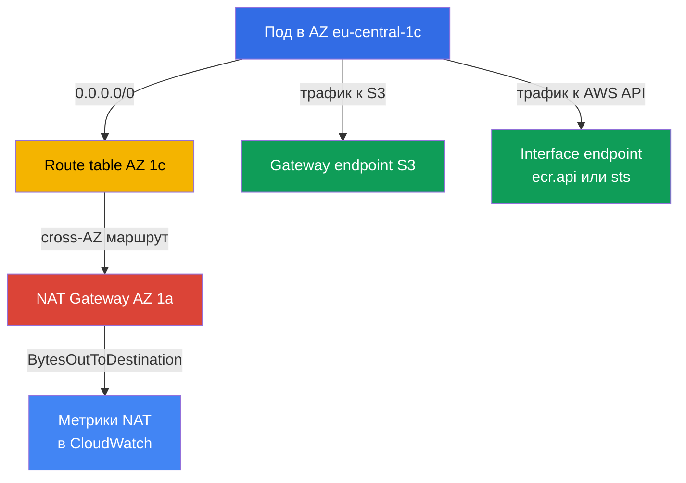
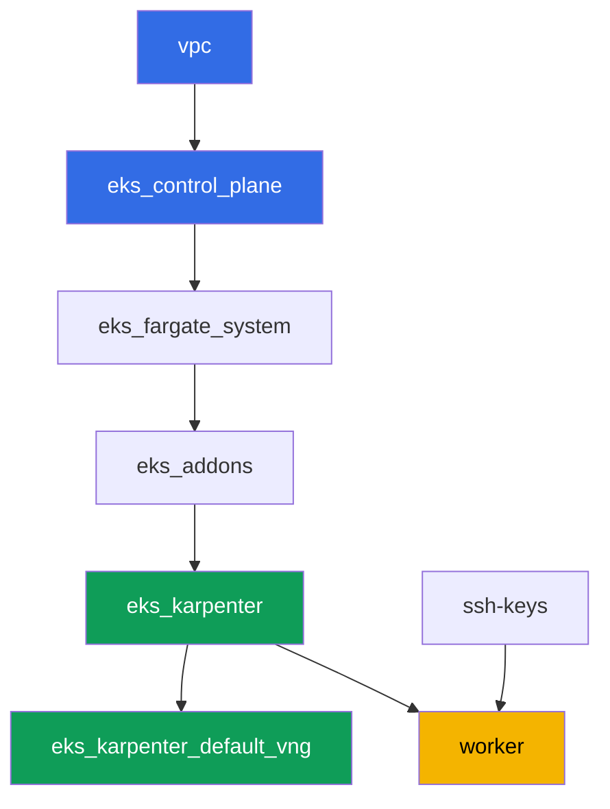

# Лаба 117 - Трафик и стоимость: NAT по зонам против одного NAT, VPC endpoints, cross-AZ

## Описание

Кластер уже развёрнут как код (лаба 101), а в этой лабе вы разбираете, во что превращается
самая незаметная статья счёта EKS - egress-трафик. Сеть лабы намеренно смешанная: приватные
подсети в двух AZ уже получили по одному NAT Gateway каждая (правильная схема), а третья
приватная подсеть, в eu-central-1c, осталась без NAT вовсе. Вы сначала фиксируете, сколько
NAT Gateway есть и в каких зонах, затем сознательно воспроизводите классическую ловушку -
направляете маршрут подсети без NAT на шлюз соседней зоны и убеждаетесь, что нода в этой
зоне гоняет трафик cross-AZ. После этого вы убираете часть трафика с NAT вообще: поднимаете
бесплатный gateway endpoint для S3 и платный interface endpoint для сервиса с высоким
трафиком, и в конце читаете метрики CloudWatch, чтобы увидеть объём трафика на каждом NAT
своими глазами.

Задания в продакшн-стиле: короткая постановка плюс критерии приёмки. Проверка -
автоматическая, командой `check_result`.

## Цель

Закрепить материал глав курса:

- [Глава 31. Egress и стоимость трафика: NAT, VPC endpoints,
  PrivateLink](../../course/31/ru.md) - почему один NAT на кластер платит дважды за
  cross-AZ трафик и как это лечат gateway и interface endpoints
- [Глава 43. Стоимость: OpenCost и Kubecost, right-sizing, Savings Plans, спот-микс,
  трафик](../../course/43/ru.md) - как трафик и endpoints видны в Cost Explorer по
  usage type

## Что мы создаём

Кластер уже развёрнут как код (как в лабе 101). Сеть лабы отличается от 101/103: вместо
одного NAT на весь кластер здесь по одному NAT в каждой из двух AZ, а третья AZ временно
без NAT - вы сами воспроизводите и объясняете cross-AZ ловушку, а затем снимаете часть
трафика с NAT через VPC endpoints.

| Объект | Что это | Зачем в этой лабе |
|--------|---------|-------------------|
| NAT Gateway в AZ `eu-central-1a` и `eu-central-1b` | уже создан модулем `vpc_v3` (`nat_gateway = "SUBNET"`, по одной приватной подсети на зону) | правильная схема - по одному NAT на AZ, а не один на кластер (глава 31) |
| Приватная подсеть `private-subnet-3` в `eu-central-1c` без NAT | создана без маршрута `0.0.0.0/0` | стартовая точка для воспроизведения ловушки cross-AZ NAT (глава 31) |
| Route table `private-subnet-3` (правите руками) | маршрут на NAT соседней AZ | сам механизм ловушки: трафик идёт cross-AZ до чужого NAT (глава 31) |
| Deployment `crossaz` (образ `curlimages/curl`, nodeSelector зоны `eu-central-1c`) | нагрузка, вынуждающая Karpenter поставить ноду именно в проблемной AZ | делает cross-AZ трафик наблюдаемым и воспроизводимым, из пода проверяем egress через `curl` (глава 31) |
| Gateway VPC endpoint для `s3` | запись в route table, бесплатно | первый шаг оптимизации - снимает трафик к S3 с NAT (главы 31, 43) |
| Interface VPC endpoint (`ecr.api` или `sts`) | ENI с PrivateLink | снимает с NAT трафик сервиса с высокой частотой обращений (глава 31) |
| Артефакты в `/var/work/tests/artifacts/*` | находки по NAT, маршрутам, endpoints, метрикам | фиксируют разбор без цифр в долларах, только структуру трафика (главы 31, 43) |



## Инфраструктура

Окружение разворачивается в AWS (`eu-central-1`) через Terragrunt, как в лабе 101. Каждый
каталог лабы - это один компонент со своим `terragrunt.hcl`, который ссылается на общий
модуль в `terraform/modules/` и объявляет зависимости через блоки `dependency`.

### Модули и зависимости

| Каталог (компонент) | Модуль (`terraform/modules/`) | Зависит от | Что создаёт |
|---------------------|-------------------------------|------------|-------------|
| `vpc` | `vpc_v3` | - | VPC `10.10.0.0/16`, публичные подсети в двух AZ, приватные подсети в трёх AZ, NAT в двух из них |
| `ssh-keys` | `ssh-keys` | - | пара SSH-ключей для рабочей машины и нод |
| `eks_control_plane` | `eks_v2_control_plane` | `vpc` | control plane EKS `1.36`, OIDC, security groups |
| `eks_fargate_system` | `eks_v2_fargate` | `vpc`, `eks_control_plane` | Fargate-профиль для `kube-system` и `karpenter` |
| `eks_addons` | `eks_v2_addons` | `eks_control_plane`, `eks_fargate_system` | аддоны coredns, kube-proxy, vpc-cni, pod-identity |
| `eks_karpenter` | `eks_v2_karpenter` | `vpc`, `eks_control_plane`, `eks_addons`, `eks_fargate_system` | контроллер Karpenter, IAM-роль нод |
| `eks_karpenter_default_vng` | `eks_v2_karpenter_vng` | `vpc`, `eks_control_plane`, `eks_karpenter` | дефолтный NodePool `default` и EC2NodeClass на AL2023 |
| `worker` | `eks_v2_work_pc` | `ssh-keys`, `vpc`, `eks_control_plane`, `eks_karpenter` | рабочая машина с kubectl, тестами и `check_result` |

Граф зависимостей (что применяется раньше, то ниже по стрелке), такой же, как в лабе 101:



Все задания лабы решаются с рабочей машины через `aws` CLI и `kubectl`, без новых
terraform-модулей: сеть уже раскладывает подсети по трём AZ и создаёт NAT только в двух
из них, а маршруты, endpoints и метрики - это операции AWS CLI прямо с worker.

### Сеть этой лабы: где правильная схема, а где ловушка

Приватные подсети `private-subnet-1` (`eu-central-1a`) и `private-subnet-2`
(`eu-central-1b`) созданы с `nat_gateway = "SUBNET"` - модуль `vpc_v3` строит отдельный
NAT Gateway для каждой такой подсети, в публичной подсети её же зоны. Приватная подсеть
здесь ровно одна на зону, поэтому «NAT на подсеть» даёт ту же инфраструктуру, что и «NAT
на зону»: по одному NAT Gateway в `eu-central-1a` и `eu-central-1b`. Это и есть правильная
схема из главы 31: трафик ноды идёт до NAT в своей же зоне, без пересечения границы AZ.

Подсеть `private-subnet-3` (`eu-central-1c`) создана с `nat_gateway = "NONE"` - у неё есть
своя route table, но в ней нет маршрута `0.0.0.0/0`. Все три подсети размечены тегом
`karpenter.sh/discovery`, поэтому Karpenter умеет ставить в них ноды. В задании 2 вы сами
добавляете в route table этой подсети маршрут на NAT Gateway соседней AZ - и получаете
именно ту ловушку, о которой предупреждает глава 31: нода в `eu-central-1c` шлёт трафик
cross-AZ до чужого NAT, и это тарифицируется дважды - платой за межзонный трафик и платой
за обработку на самом NAT.

### Права worker для маршрутов, endpoints и метрик

Роль worker (`eks_v2_work_pc/iam.tf`) уже имела `eks:*`, часть `ec2:Describe*` (подсети,
security groups, инстансы, ENI), права на изменение правил security group
(`ec2:AuthorizeSecurityGroupIngress`, `ec2:RevokeSecurityGroupIngress`) и чтение метрик
CloudWatch (`cloudwatch:GetMetricStatistics`, `cloudwatch:ListMetrics` из `Sid`
`ObservabilityReadForMetricsLabs`). Для заданий 1-4 этой лабы, где нужно читать NAT
Gateway и route table, менять маршруты и создавать VPC endpoints, в политику добавлен один
дополнительный `Sid` `TrafficAndEndpointsForLabs` с правами `ec2:CreateRoute`,
`ec2:ReplaceRoute`, `ec2:DeleteRoute`, `ec2:CreateVpcEndpoint`, `ec2:DeleteVpcEndpoints`,
`ec2:ModifyVpcEndpoint`, `ec2:DescribeVpcEndpoints`, `ec2:DescribeNatGateways`,
`ec2:DescribeRouteTables`, `cloudwatch:GetMetricStatistics`, `cloudwatch:ListMetrics` - по
аналогии с уже существующими `Sid` в этом файле, без изменения остальной политики.

## Развёртывание

```bash
TASK=117 make run_eks_task
```

Развёртывание занимает примерно 15-20 минут. В выводе найдите строку с SSH-подключением к
рабочей машине и подключитесь к ней. kubectl там уже настроен на нужный кластер.

Полезные команды на рабочей машине:

```bash
time_left       # сколько осталось времени окружения
check_result    # проверить решение
```

> Безопасность стенда. В `env.hcl` включены `ssh_password_enable = true` и
> `access_cidrs = ["0.0.0.0/0"]` - это удобно для учебного окружения, но так делать в
> продакшене нельзя. По стандартам курса доступ к рабочим машинам открывают через AWS SSM
> Session Manager без публичных SSH-портов наружу, а `access_cidrs` сужают до конкретных
> адресов. Здесь публичный SSH оставлен только ради простоты запуска.

## Задания

---
|        **1**        | **Сколько NAT Gateway и в каких зонах**                     |
| :-----------------: | :---------------------------------------------------------- |
| Что делаем          | Узнайте `vpc-id` кластера (`aws eks describe-cluster --name <name> --query 'cluster.resourcesVpcConfig.vpcId'`). Найдите все NAT Gateway этой VPC: `aws ec2 describe-nat-gateways --filter "Name=vpc-id,Values=<vpc-id>" --query 'NatGateways[].[NatGatewayId,SubnetId,State]' --output table`. Для каждого NAT определите AZ его подсети: `aws ec2 describe-subnets --subnet-ids <subnet-id> --query 'Subnets[0].AvailabilityZone'`. Сохраните в `/var/work/tests/artifacts/1/natdiscovery.txt` построчно в виде `ключ=значение`: `nat_count` (сколько всего NAT Gateway), `nat_1_id`, `nat_1_az`, `nat_2_id`, `nat_2_az` (для каждого найденного NAT) и `no_nat_az` - зона, в которой приватная подсеть есть, а NAT Gateway нет. |
| Критерии приёмки    | - файл не пуст;<br/>- `nat_count` равен фактическому числу NAT Gateway в VPC (`2`);<br/>- `nat_1_az`/`nat_2_az` - это `eu-central-1a` и `eu-central-1b` (в любом порядке);<br/>- `no_nat_az` равен `eu-central-1c`. |
---
|        **2**        | **Воспроизведение cross-AZ ловушки**                        |
| :-----------------: | :---------------------------------------------------------- |
| Что делаем          | Найдите route table подсети `private-subnet-3`: `aws ec2 describe-route-tables --filters "Name=tag:Name,Values=private-subnet-3" --query 'RouteTables[0].RouteTableId'`. Добавьте в неё маршрут на NAT Gateway одной из соседних AZ (из задания 1): `aws ec2 create-route --route-table-id <rtb-id> --destination-cidr-block 0.0.0.0/0 --nat-gateway-id <nat-id>`. В namespace `eks-117` создайте Deployment `crossaz` (образ `curlimages/curl:latest`, команда `sleep 3600`, `1` реплика) с `nodeSelector: topology.kubernetes.io/zone: eu-central-1c`, чтобы Karpenter поднял ноду именно в этой зоне. Дождитесь `Running` и проверьте egress изнутри пода: `kubectl exec -n eks-117 <pod> -- curl -s -o /dev/null -w '%{http_code}' https://checkip.amazonaws.com`. Сохраните в `/var/work/tests/artifacts/2/crossaz.txt`: `subnet_c_route_table_id`, `nat_gateway_id_used`, `nat_gateway_az_used`, `pod_node`, `pod_node_zone`, `egress_http_code`, и объяснение (минимум одна строка) со словом `cross-AZ`: почему трафик ноды из `eu-central-1c` до NAT в другой зоне - это межзонный (cross-AZ) переход, тарифицируемый отдельно, и как правильно - NAT Gateway в каждой AZ, где есть ноды. |
| Критерии приёмки    | - route table `private-subnet-3` содержит маршрут `0.0.0.0/0` на NAT Gateway, чья AZ не `eu-central-1c`;<br/>- Deployment `crossaz` готов (`1` реплика), под физически на ноде в зоне `eu-central-1c`;<br/>- файл упоминает `cross-AZ` и содержит `egress_http_code=200`. |
---
|        **3**        | **Gateway VPC endpoint для S3 - бесплатный маршрут**         |
| :-----------------: | :---------------------------------------------------------- |
| Что делаем          | Создайте gateway endpoint для S3, привязав его сразу ко всем трём приватным route table (`private-subnet-1`, `private-subnet-2`, `private-subnet-3`): `aws ec2 create-vpc-endpoint --vpc-id <vpc-id> --vpc-endpoint-type Gateway --service-name com.amazonaws.eu-central-1.s3 --route-table-ids <rtb-1> <rtb-2> <rtb-3>`. Дождитесь состояния `available` (`aws ec2 describe-vpc-endpoints --filters "Name=vpc-id,Values=<vpc-id>" "Name=vpc-endpoint-type,Values=Gateway" --query 'VpcEndpoints[].[VpcEndpointId,State,RouteTableIds]'`). Сохраните id endpoint, его состояние и список route table в `/var/work/tests/artifacts/3/s3endpoint.txt`, с пояснением, что gateway endpoint для S3 не тарифицируется ни почасово, ни за данные (слово `бесплат` в объяснении). |
| Критерии приёмки    | - gateway endpoint для `com.amazonaws.eu-central-1.s3` в состоянии `available`;<br/>- его `RouteTableIds` включает все три приватные route table лабы;<br/>- файл упоминает `available` и `бесплат`. |
---
|        **4**        | **Interface VPC endpoint для сервиса с высоким трафиком**   |
| :-----------------: | :---------------------------------------------------------- |
| Что делаем          | Выберите один сервис - `ecr.api` (авторизация в реестр образов при каждом pull) или `sts` (обмен токена IRSA/Pod Identity на временные ключи при каждом старте пода) - и обоснуйте выбор в артефакте. Найдите security group по умолчанию VPC (`aws ec2 describe-security-groups --filters "Name=vpc-id,Values=<vpc-id>" "Name=group-name,Values=default" --query 'SecurityGroups[0].GroupId'`). Разрешите в этой security group входящий HTTPS из CIDR VPC, иначе endpoint будет недоступен: `aws ec2 authorize-security-group-ingress --group-id <sg-id> --protocol tcp --port 443 --cidr 10.10.0.0/16`. Создайте interface endpoint: `aws ec2 create-vpc-endpoint --vpc-id <vpc-id> --vpc-endpoint-type Interface --service-name com.amazonaws.eu-central-1.<ecr.api\|sts> --subnet-ids <private-subnet-1-id> <private-subnet-2-id> --security-group-ids <sg-id> --private-dns-enabled`. Дождитесь `available`. Сохраните в `/var/work/tests/artifacts/4/interfaceendpoint.txt`: `service_chosen`, `vpc_endpoint_id`, `state`, `private_dns_enabled`, и обоснование выбора (минимум одна строка). |
| Критерии приёмки    | - interface endpoint для `com.amazonaws.eu-central-1.ecr.api` либо `com.amazonaws.eu-central-1.sts` в состоянии `available`, с `PrivateDnsEnabled: true`;<br/>- файл упоминает выбранный сервис и `available`. |

> Почему правило в security group обязательно. С `--private-dns-enabled` endpoint
> перехватывает публичное имя сервиса внутри всей VPC: `sts.eu-central-1.amazonaws.com`
> начинает резолвиться в приватные адреса ENI endpoint. Если security group endpoint не
> пускает HTTPS от нод и подов, запросы к сервису перестают проходить по всей VPC - у
> дефолтной security group входящее правило разрешает трафик только участникам этой же
> группы, а ноды Karpenter живут в собственной группе. Симптом: `curl` к
> `https://sts.eu-central-1.amazonaws.com` из пода отдаёт код `000` и таймаут, а
> контроллеры с IRSA (тот же Karpenter) отваливаются при следующем обновлении
> credentials. Правило `443` из CIDR VPC закрывает вопрос, в проде для endpoint делают
> отдельную security group с тем же смыслом.

---
|        **5**        | **Метрики NAT: сколько байт прошло через каждый шлюз**       |
| :-----------------: | :---------------------------------------------------------- |
| Что делаем          | Для обоих NAT Gateway из задания 1 получите сумму `BytesOutToDestination` за последние несколько часов: `aws cloudwatch get-metric-statistics --namespace AWS/NATGateway --metric-name BytesOutToDestination --statistics Sum --period 3600 --dimensions Name=NatGatewayId,Value=<nat-id> --start-time <ISO> --end-time <ISO>` (например, `--start-time $(date -u -d '3 hours ago' +%Y-%m-%dT%H:%M:%S) --end-time $(date -u +%Y-%m-%dT%H:%M:%S)`). Сложите суммы по точкам данных каждого NAT. Сохраните в `/var/work/tests/artifacts/5/natmetrics.txt`: `nat_a_id`, `nat_a_bytes_out_sum`, `nat_b_id`, `nat_b_bytes_out_sum`, `total_bytes_out_sum` (сумма двух предыдущих), и объяснение: какой из двух NAT принял cross-AZ ноду из задания 2 (укажите его id) и почему у него ожидается больший объём, если тестовая нагрузка генерировала трафик. |
| Критерии приёмки    | - файл содержит все пять числовых ключей и упоминает `BytesOutToDestination`;<br/>- `total_bytes_out_sum` равен сумме `nat_a_bytes_out_sum` и `nat_b_bytes_out_sum`;<br/>- файл упоминает `nat_gateway_id_used` из задания 2 (тот же id NAT Gateway). |
---

## Проверка результата

На рабочей машине запустите автоматическую проверку:

```bash
check_result
```

Скрипт прогонит тесты и покажет процент выполненных заданий.

## Решение

Эталонное решение: [worker/files/solutions/1.MD](worker/files/solutions/1.MD)

## Удаление кластера и ресурсов

В этой лабе вы руками создали два VPC endpoint (gateway для S3 и interface для
`sts`/`ecr.api`), а нагрузка задания 2 заставила Karpenter поднять EC2-ноду в
`eu-central-1c`. Ни того, ни другого нет в terraform state, поэтому `destroy` без
подготовки застревает: ENI interface endpoint держит подсеть, сами endpoints держат VPC, а
осиротевшая EC2-нода держит подсеть и security group (тот же паттерн, что в лабах 108, 109,
111, 114, 115, 116). Порядок уборки - endpoints и нагрузка, потом terraform:

```bash
# 1. Удаляем оба VPC endpoint, созданных вручную в заданиях 3 и 4
CLUSTER=$(aws eks list-clusters --query 'clusters[0]' --output text)
VPC=$(aws eks describe-cluster --name "$CLUSTER" \
  --query 'cluster.resourcesVpcConfig.vpcId' --output text)
EPS=$(aws ec2 describe-vpc-endpoints --filters "Name=vpc-id,Values=$VPC" \
  --query 'VpcEndpoints[].VpcEndpointId' --output text)
echo "endpoints to delete: $EPS"
aws ec2 delete-vpc-endpoints --vpc-endpoint-ids $EPS

# 2. Снимаем нагрузку, из-за которой Karpenter поднял EC2-ноду
kubectl delete namespace eks-117

# 3. Дожидаемся, пока Karpenter сам завершит EC2-инстанс (а не просто удалит объект Node)
#    и пока исчезнут ENI удалённого interface endpoint - должно быть пусто во всех выводах
for i in $(seq 1 30); do
  nc=$(kubectl get nodeclaims --no-headers 2>/dev/null | wc -l)
  ec2=$(aws ec2 describe-instances \
    --filters "Name=tag:karpenter.sh/nodepool,Values=default" \
    "Name=instance-state-name,Values=running,pending,stopping,stopped" \
    --query 'Reservations[].Instances[].InstanceId' --output text)
  eps=$(aws ec2 describe-vpc-endpoints --filters "Name=vpc-id,Values=$VPC" \
    "Name=vpc-endpoint-state,Values=available,pending,deleting" \
    --query 'VpcEndpoints[].VpcEndpointId' --output text)
  echo "nodeclaims=$nc ec2_instances=[$ec2] endpoints=[$eps]"
  [[ "$nc" == "0" ]] && [[ -z "$ec2" ]] && [[ -z "$eps" ]] && break
  sleep 10
done
```

Маршрут `0.0.0.0/0`, добавленный руками в route table `private-subnet-3`, и правило `443`
в default security group отдельно убирать не нужно: route table и default security group
удаляются вместе с VPC, а маршрут внутри route table - вместе с ней.

Только после того как `nodeclaims=0`, а списки EC2-инстансов и endpoints пусты, запускайте
удаление terraform-ресурсов:

```bash
TASK=117 make delete_eks_task
```
