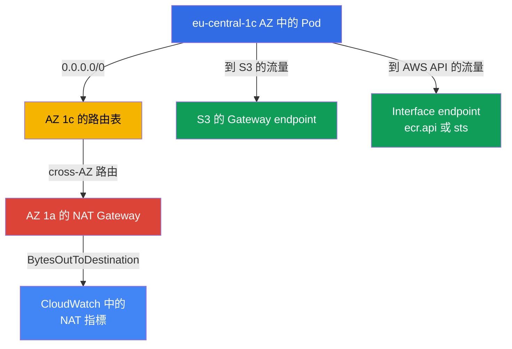
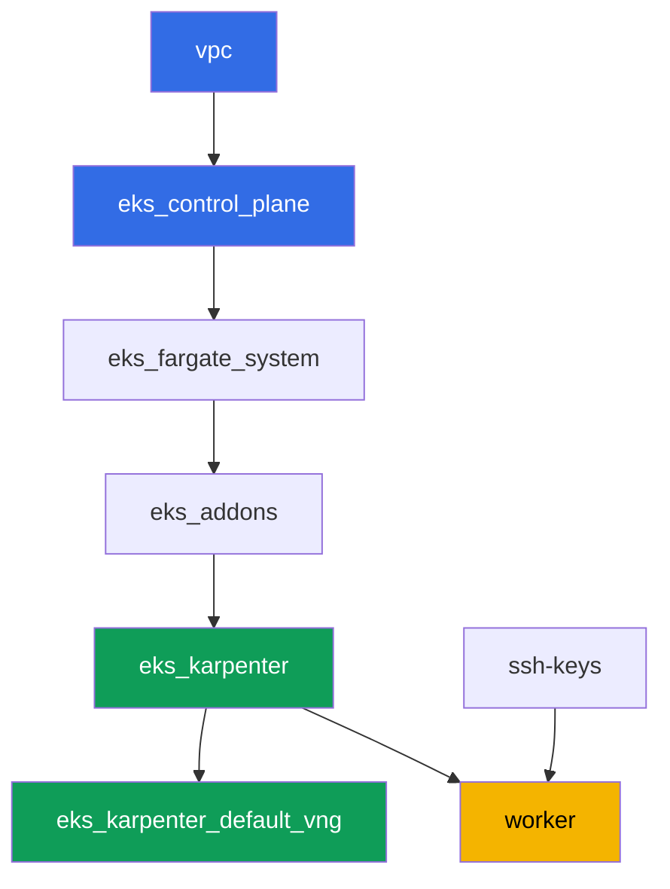

[Русская версия](README_RU.MD) · [Eng version](README.MD) · [Versión en español](README_ES.MD) · [Version française](README_FR.MD) · [Deutsche Version](README_DE.MD) · [ქართული ვერსია](README_GE.MD) · [日本語版](README_JP.MD)

# 實驗 117 - 流量與成本:每個 AZ 一個 NAT 對比單一 NAT、VPC endpoint、cross-AZ

## 說明

集群已經以程式碼形式部署完成(實驗 101),在這個實驗中你會深入研究 EKS 帳單上最不起
眼的一項 - egress 流量。這個實驗的網路刻意混搭:兩個 AZ 中的私有子網已經各自擁有一個
NAT Gateway(正確的模式),而第三個私有子網,在 `eu-central-1c`,則完全沒有 NAT。你先
記錄現有多少個 NAT Gateway、分別在哪些 zone,然後刻意重現這個經典陷阱 - 把沒有 NAT
的子網的路由指向鄰近 zone 的 gateway,並確認該 zone 中的節點會把流量推向 cross-AZ。之
後你會從 NAT 身上移走一部分流量:搭建一個免費的 S3 gateway endpoint,以及一個給高流
量服務用的收費 interface endpoint,最後你會親眼查看 CloudWatch 指標,看看每個 NAT 上
的流量大小。

任務以生產風格編寫:簡短的任務描述加驗收標準。驗證是自動的,透過 `check_result` 命令
完成。

## 目標

鞏固以下課程章節的內容:

- [第 31 章。Egress 與流量成本:NAT、VPC endpoint、
  PrivateLink](../../course/31/ru.md) - 為什麼整個集群共用一個 NAT 會為 cross-AZ 流量
  付兩次錢,以及 gateway 和 interface endpoint 如何解決這個問題
- [第 43 章。成本:OpenCost 與 Kubecost、right-sizing、Savings Plans、spot
  mix、流量](../../course/43/ru.md) - 流量和 endpoint 在 Cost Explorer 中依 usage type
  呈現的方式

## 我們要創建什麼

集群已經以程式碼形式部署完成(如實驗 101)。這個實驗的網路和 101/103 不同:這裡不是整
個集群共用一個 NAT,而是兩個 AZ 各自擁有自己的 NAT,第三個 AZ 暫時沒有 - 你要自己重現
並解釋 cross-AZ 陷阱,然後透過 VPC endpoint 從 NAT 身上移走一部分流量。

| 對象 | 這是什麼 | 在這個實驗中的作用 |
|--------|---------|-------------------|
| `eu-central-1a` 和 `eu-central-1b` 中的 NAT Gateway | 已由 `vpc_v3` 模組創建(`nat_gateway = "SUBNET"`,每個 zone 一個私有子網) | 正確的模式 - 每個 AZ 一個 NAT,而不是整個集群一個(第 31 章) |
| `eu-central-1c` 中沒有 NAT 的私有子網 `private-subnet-3` | 創建時沒有 `0.0.0.0/0` 路由 | 重現 cross-AZ NAT 陷阱的起點(第 31 章) |
| 路由表 `private-subnet-3`(手動編輯) | 指向鄰近 AZ 的 NAT 的路由 | 陷阱本身的機制:流量透過 cross-AZ 走到別人的 NAT(第 31 章) |
| Deployment `crossaz`(映像 `curlimages/curl`,nodeSelector zone `eu-central-1c`) | 強迫 Karpenter 把節點準確放到問題 AZ 中的負載 | 讓 cross-AZ 流量可被觀察與重現,從 pod 中透過 `curl` 檢查 egress(第 31 章) |
| `s3` 的 Gateway VPC endpoint | 一條路由表條目,完全免費 | 第一個優化步驟 - 把 S3 流量從 NAT 中移走(第 31、43 章) |
| Interface VPC endpoint(`ecr.api` 或 `sts`) | 帶有 PrivateLink 的 ENI | 把高頻服務的流量從 NAT 中移走(第 31 章) |
| `/var/work/tests/artifacts/*` 中的產物 | 關於 NAT、路由、endpoint、指標的發現 | 記錄分析結果,不涉及具體金額,只看流量結構(第 31、43 章) |



## 基礎設施

環境透過 Terragrunt 部署在 AWS(`eu-central-1`),與實驗 101 相同。每個實驗目錄都是一
個組件,擁有自己的 `terragrunt.hcl`,它引用 `terraform/modules/` 中的共用模組,並透過
`dependency` 區塊聲明依賴關係。

### 模組與依賴關係

| 目錄(組件) | 模組(`terraform/modules/`) | 依賴於 | 創建了什麼 |
|---------------------|-------------------------------|------------|-------------|
| `vpc` | `vpc_v3` | - | VPC `10.10.0.0/16`,兩個 AZ 中的公共子網,三個 AZ 中的私有子網,其中兩個帶有 NAT |
| `ssh-keys` | `ssh-keys` | - | 供工作機與節點使用的一對 SSH 金鑰 |
| `eks_control_plane` | `eks_v2_control_plane` | `vpc` | EKS control plane `1.36`、OIDC、security groups |
| `eks_fargate_system` | `eks_v2_fargate` | `vpc`、`eks_control_plane` | `kube-system` 與 `karpenter` 的 Fargate 配置檔 |
| `eks_addons` | `eks_v2_addons` | `eks_control_plane`、`eks_fargate_system` | coredns、kube-proxy、vpc-cni、pod-identity 附加元件 |
| `eks_karpenter` | `eks_v2_karpenter` | `vpc`、`eks_control_plane`、`eks_addons`、`eks_fargate_system` | Karpenter 控制器、節點 IAM 角色 |
| `eks_karpenter_default_vng` | `eks_v2_karpenter_vng` | `vpc`、`eks_control_plane`、`eks_karpenter` | 基於 AL2023 的預設 NodePool `default` 與 EC2NodeClass |
| `worker` | `eks_v2_work_pc` | `ssh-keys`、`vpc`、`eks_control_plane`、`eks_karpenter` | 帶有 kubectl、測試腳本和 `check_result` 的工作機 |

依賴關係圖(較早套用的組件位於箭頭下方),與實驗 101 相同:



這個實驗中的所有任務都是從工作機透過 `aws` CLI 和 `kubectl` 完成的,不需要任何新的
terraform 模組:網路已經跨三個 AZ 分佈子網,並只在其中兩個創建 NAT,而路由、endpoint
和指標都是直接從工作機執行的普通 AWS CLI 操作。

### 這個實驗的網路:正確模式在哪裡,陷阱在哪裡

私有子網 `private-subnet-1`(`eu-central-1a`)和 `private-subnet-2`
(`eu-central-1b`)是以 `nat_gateway = "SUBNET"` 創建的 - `vpc_v3` 模組會為每個這樣的
子網,在同一個 zone 的公共子網中,建一個獨立的 NAT Gateway。這裡每個 zone 恰好只有一
個私有子網,所以「每個子網一個 NAT」和「每個 zone 一個 NAT」產生的是同一套基礎設施:
`eu-central-1a` 和 `eu-central-1b` 各自一個 NAT Gateway。這正是第 31 章中的正確模式:
節點的流量在不跨越 AZ 邊界的情況下抵達本 zone 的 NAT。

子網 `private-subnet-3`(`eu-central-1c`)是以 `nat_gateway = "NONE"` 創建的 - 它有自
己的路由表,但這張表沒有 `0.0.0.0/0` 路由。三個子網都帶有 `karpenter.sh/discovery`
標籤,所以 Karpenter 可以把節點放進去。在任務 2 中,你會親手在這個子網的路由表裡添加
一條指向鄰近 AZ 的 NAT Gateway 的路由 - 這正好就是第 31 章警告過的陷阱:
`eu-central-1c` 中的節點把流量透過 cross-AZ 發送到別人的 NAT,而這會被計費兩次 - 一次
是跨 AZ 流量,一次是 NAT 本身的處理費。

### 路由、endpoint 和指標所需的 worker 權限

worker 角色(`eks_v2_work_pc/iam.tf`)本來就有 `eks:*`、部分 `ec2:Describe*`(子網、
security group、instance、ENI)、修改 security group 規則的權限
(`ec2:AuthorizeSecurityGroupIngress`、`ec2:RevokeSecurityGroupIngress`),以及讀取
CloudWatch 指標的權限(`cloudwatch:GetMetricStatistics`、`cloudwatch:ListMetrics`,來
自 `Sid` `ObservabilityReadForMetricsLabs`)。對於這個實驗中需要讀取 NAT Gateway 和路
由表、修改路由、創建 VPC endpoint 的任務 1-4,策略中新增了一個額外的 `Sid`
`TrafficAndEndpointsForLabs`,權限包括 `ec2:CreateRoute`、`ec2:ReplaceRoute`、
`ec2:DeleteRoute`、`ec2:CreateVpcEndpoint`、`ec2:DeleteVpcEndpoints`、
`ec2:ModifyVpcEndpoint`、`ec2:DescribeVpcEndpoints`、`ec2:DescribeNatGateways`、
`ec2:DescribeRouteTables`、`cloudwatch:GetMetricStatistics`、`cloudwatch:ListMetrics` -
遵循這個檔案中已有 `Sid` 的模式,不改動策略的其他部分。

## 部署

```bash
TASK=117 make run_eks_task
```

部署大約需要 15-20 分鐘。在輸出中找到連接工作機的 SSH 那一行並連接上去。那裡的
kubectl 已經配置好正確的集群。

工作機上的常用命令:

```bash
time_left       # 環境剩餘的時間
check_result    # 檢查解答
```

> 環境安全性。`env.hcl` 中啟用了 `ssh_password_enable = true` 和
> `access_cidrs = ["0.0.0.0/0"]` - 這對於學習環境很方便,但在生產環境中不應該這樣做。
> 依照課程標準,對工作機的存取應透過 AWS SSM Session Manager 進行,不對外暴露公開的
> SSH 端口,並將 `access_cidrs` 限制到具體的位址。這裡保留公開 SSH 只是為了簡化啟動
> 流程。

## 任務

---
|        **1**        | **有多少個 NAT Gateway,分別在哪些 zone**                |
| :-----------------: | :---------------------------------------------------------- |
| 我們要做什麼          | 找到集群的 `vpc-id`(`aws eks describe-cluster --name <name> --query 'cluster.resourcesVpcConfig.vpcId'`)。找到這個 VPC 中的所有 NAT Gateway:`aws ec2 describe-nat-gateways --filter "Name=vpc-id,Values=<vpc-id>" --query 'NatGateways[].[NatGatewayId,SubnetId,State]' --output table`。對每個 NAT,確定其子網所在的 AZ:`aws ec2 describe-subnets --subnet-ids <subnet-id> --query 'Subnets[0].AvailabilityZone'`。保存到 `/var/work/tests/artifacts/1/natdiscovery.txt`,每行一個 `key=value`:`nat_count`(NAT Gateway 總數)、`nat_1_id`、`nat_1_az`、`nat_2_id`、`nat_2_az`(對每個找到的 NAT),以及 `no_nat_az` - 存在私有子網但沒有 NAT Gateway 的 zone。 |
| 驗收標準    | - 檔案不為空;<br/>- `nat_count` 等於 VPC 中實際的 NAT Gateway 數量(`2`);<br/>- `nat_1_az`/`nat_2_az` 是 `eu-central-1a` 和 `eu-central-1b`(順序不限);<br/>- `no_nat_az` 等於 `eu-central-1c`。 |
---
|        **2**        | **重現 cross-AZ 陷阱**                        |
| :-----------------: | :---------------------------------------------------------- |
| 我們要做什麼          | 找到子網 `private-subnet-3` 的路由表:`aws ec2 describe-route-tables --filters "Name=tag:Name,Values=private-subnet-3" --query 'RouteTables[0].RouteTableId'`。添加一條指向鄰近 AZ 之一的 NAT Gateway(來自任務 1)的路由:`aws ec2 create-route --route-table-id <rtb-id> --destination-cidr-block 0.0.0.0/0 --nat-gateway-id <nat-id>`。在 namespace `eks-117` 中創建 Deployment `crossaz`(映像 `curlimages/curl:latest`,命令 `sleep 3600`,`1` 個副本),帶有 `nodeSelector: topology.kubernetes.io/zone: eu-central-1c`,讓 Karpenter 準確地在這個 zone 中拉起一個節點。等待進入 `Running`,並從 pod 內部檢查 egress:`kubectl exec -n eks-117 <pod> -- curl -s -o /dev/null -w '%{http_code}' https://checkip.amazonaws.com`。保存到 `/var/work/tests/artifacts/2/crossaz.txt`:`subnet_c_route_table_id`、`nat_gateway_id_used`、`nat_gateway_az_used`、`pod_node`、`pod_node_zone`、`egress_http_code`,以及一段解釋(至少一行),其中包含單字 `cross-AZ`:為什麼從 `eu-central-1c` 到另一個 zone 的 NAT 的節點流量是一次單獨計費的跨 AZ(cross-AZ)跳躍,以及正確的模式是什麼 - 每個有節點的 AZ 都要有一個 NAT Gateway。 |
| 驗收標準    | - 路由表 `private-subnet-3` 包含一條 `0.0.0.0/0` 路由,指向一個 AZ 不是 `eu-central-1c` 的 NAT Gateway;<br/>- Deployment `crossaz` 已就緒(`1` 個副本),pod 實際運行在 `eu-central-1c` zone 中的節點上;<br/>- 檔案中提到 `cross-AZ` 並包含 `egress_http_code=200`。 |
---
|        **3**        | **S3 的 Gateway VPC endpoint - 一條免費路由**         |
| :-----------------: | :---------------------------------------------------------- |
| 我們要做什麼          | 為 S3 創建一個 gateway endpoint,立即把它掛接到全部三個私有路由表(`private-subnet-1`、`private-subnet-2`、`private-subnet-3`)上:`aws ec2 create-vpc-endpoint --vpc-id <vpc-id> --vpc-endpoint-type Gateway --service-name com.amazonaws.eu-central-1.s3 --route-table-ids <rtb-1> <rtb-2> <rtb-3>`。等待進入 `available` 狀態(`aws ec2 describe-vpc-endpoints --filters "Name=vpc-id,Values=<vpc-id>" "Name=vpc-endpoint-type,Values=Gateway" --query 'VpcEndpoints[].[VpcEndpointId,State,RouteTableIds]'`)。將 endpoint id、其狀態,以及路由表列表保存到 `/var/work/tests/artifacts/3/s3endpoint.txt`,並附上一段解釋,說明 S3 的 gateway endpoint 既不按小時計費也不按資料量計費(解釋中要包含單字 `free`)。 |
| 驗收標準    | - `com.amazonaws.eu-central-1.s3` 的 gateway endpoint 處於 `available` 狀態;<br/>- 其 `RouteTableIds` 包含這個實驗全部三個私有路由表;<br/>- 檔案中提到 `available` 和 `free`。 |
---
|        **4**        | **高流量服務的 Interface VPC endpoint**   |
| :-----------------: | :---------------------------------------------------------- |
| 我們要做什麼          | 選擇一個服務 - `ecr.api`(每次 pull 都要做映像倉庫授權)或 `sts`(每次 pod 啟動時都用 IRSA/Pod Identity 的 token 換取臨時金鑰) - 並在產物中說明選擇理由。找到這個 VPC 的預設 security group(`aws ec2 describe-security-groups --filters "Name=vpc-id,Values=<vpc-id>" "Name=group-name,Values=default" --query 'SecurityGroups[0].GroupId'`)。在這個 security group 中放行來自 VPC CIDR 的 inbound HTTPS,否則 endpoint 會創建成功但無法連通:`aws ec2 authorize-security-group-ingress --group-id <sg-id> --protocol tcp --port 443 --cidr 10.10.0.0/16`。創建一個 interface endpoint:`aws ec2 create-vpc-endpoint --vpc-id <vpc-id> --vpc-endpoint-type Interface --service-name com.amazonaws.eu-central-1.<ecr.api\|sts> --subnet-ids <private-subnet-1-id> <private-subnet-2-id> --security-group-ids <sg-id> --private-dns-enabled`。等待進入 `available`。保存到 `/var/work/tests/artifacts/4/interfaceendpoint.txt`:`service_chosen`、`vpc_endpoint_id`、`state`、`private_dns_enabled`,以及選擇理由(至少一行)。 |
| 驗收標準    | - `com.amazonaws.eu-central-1.ecr.api` 或 `com.amazonaws.eu-central-1.sts` 的 interface endpoint 處於 `available` 狀態,且 `PrivateDnsEnabled: true`;<br/>- 檔案中提到所選擇的服務和 `available`。 |

> 為什麼 security group 規則是必須的。加上 `--private-dns-enabled` 之後,endpoint 會
> 在整個 VPC 範圍內接管這個服務的公開名稱:`sts.eu-central-1.amazonaws.com` 開始解析
> 到 endpoint ENI 的私有位址。如果 endpoint 的 security group 不允許來自節點和 pod
> 的 HTTPS,整個 VPC 中對這個服務的請求都會停止工作 - 預設 security group 的 inbound
> 規則只允許來自同一個 group 成員的流量,而 Karpenter 的節點在另一個 group 中。症狀:
> 從 pod 對 `https://sts.eu-central-1.amazonaws.com` 執行 `curl` 會回傳代碼 `000` 並
> 超時,使用 IRSA 的控制器(包括 Karpenter 自身)在下一次刷新憑證時就會失敗。從 VPC
> CIDR 放行的 `443` 規則解決了這個問題;在生產環境中,通常會為 endpoint 使用一個帶有
> 相同意圖的專用 security group。

---
|        **5**        | **NAT 指標:每個 gateway 通過了多少位元組**       |
| :-----------------: | :---------------------------------------------------------- |
| 我們要做什麼          | 對任務 1 中的兩個 NAT Gateway,取得最近幾小時的 `BytesOutToDestination` 總和:`aws cloudwatch get-metric-statistics --namespace AWS/NATGateway --metric-name BytesOutToDestination --statistics Sum --period 3600 --dimensions Name=NatGatewayId,Value=<nat-id> --start-time <ISO> --end-time <ISO>`(例如 `--start-time $(date -u -d '3 hours ago' +%Y-%m-%dT%H:%M:%S) --end-time $(date -u +%Y-%m-%dT%H:%M:%S)`)。把每個 NAT 各個資料點的總和相加。保存到 `/var/work/tests/artifacts/5/natmetrics.txt`:`nat_a_id`、`nat_a_bytes_out_sum`、`nat_b_id`、`nat_b_bytes_out_sum`、`total_bytes_out_sum`(前兩個值的總和),以及一段解釋:任務 2 中的 cross-AZ 節點被哪個 NAT 接手了(說明其 id),以及如果測試負載產生了流量,為什麼預期它的流量會更大。 |
| 驗收標準    | - 檔案包含全部五個數值 key,並提到 `BytesOutToDestination`;<br/>- `total_bytes_out_sum` 等於 `nat_a_bytes_out_sum` 與 `nat_b_bytes_out_sum` 之和;<br/>- 檔案中提到任務 2 的 `nat_gateway_id_used`(同一個 NAT Gateway id)。 |
---

## 檢查結果

在工作機上執行自動檢查:

```bash
check_result
```

腳本會執行測試並顯示已完成任務的百分比。

## 解決方案

參考解決方案:[worker/files/solutions/1_TW.MD](worker/files/solutions/1_TW.MD)

## 刪除集群與資源

在這個實驗中,你手動創建了兩個 VPC endpoint(S3 的 gateway endpoint 和
`sts`/`ecr.api` 的 interface endpoint),而任務 2 的負載讓 Karpenter 在
`eu-central-1c` 拉起了一個 EC2 節點。這兩者都不在 terraform state 中,所以未經準備的
`destroy` 會卡住:interface endpoint 的 ENI 佔用著子網,endpoint 本身佔用著 VPC,而孤
立的 EC2 節點佔用著子網和 security group(與實驗 108、109、111、114、115、116 中相同
的模式)。清理順序 - 先 endpoint 和負載,再 terraform:

```bash
# 1. 刪除任務 3 和 4 中手動創建的兩個 VPC endpoint
CLUSTER=$(aws eks list-clusters --query 'clusters[0]' --output text)
VPC=$(aws eks describe-cluster --name "$CLUSTER" \
  --query 'cluster.resourcesVpcConfig.vpcId' --output text)
EPS=$(aws ec2 describe-vpc-endpoints --filters "Name=vpc-id,Values=$VPC" \
  --query 'VpcEndpoints[].VpcEndpointId' --output text)
echo "endpoints to delete: $EPS"
aws ec2 delete-vpc-endpoints --vpc-endpoint-ids $EPS

# 2. 移除導致 Karpenter 拉起 EC2 節點的負載
kubectl delete namespace eks-117

# 3. 等待 Karpenter 真正終止 EC2 instance(不只是刪除 Node 對象),並等待已刪除的
#    interface endpoint 的 ENI 消失 - 下面每個輸出都應該為空
for i in $(seq 1 30); do
  nc=$(kubectl get nodeclaims --no-headers 2>/dev/null | wc -l)
  ec2=$(aws ec2 describe-instances \
    --filters "Name=tag:karpenter.sh/nodepool,Values=default" \
    "Name=instance-state-name,Values=running,pending,stopping,stopped" \
    --query 'Reservations[].Instances[].InstanceId' --output text)
  eps=$(aws ec2 describe-vpc-endpoints --filters "Name=vpc-id,Values=$VPC" \
    "Name=vpc-endpoint-state,Values=available,pending,deleting" \
    --query 'VpcEndpoints[].VpcEndpointId' --output text)
  echo "nodeclaims=$nc ec2_instances=[$ec2] endpoints=[$eps]"
  [[ "$nc" == "0" ]] && [[ -z "$ec2" ]] && [[ -z "$eps" ]] && break
  sleep 10
done
```

不需要單獨移除手動添加到 `private-subnet-3` 路由表的 `0.0.0.0/0` 路由,也不需要移除
預設 security group 中的 `443` 規則:路由表和預設 security group 會隨著 VPC 一起刪
除,路由也會隨著它所在的路由表一起消失。

只有在 `nodeclaims=0` 並且 EC2 instance 和 endpoint 列表都為空之後,才能執行
terraform 資源的拆除:

```bash
TASK=117 make delete_eks_task
```
