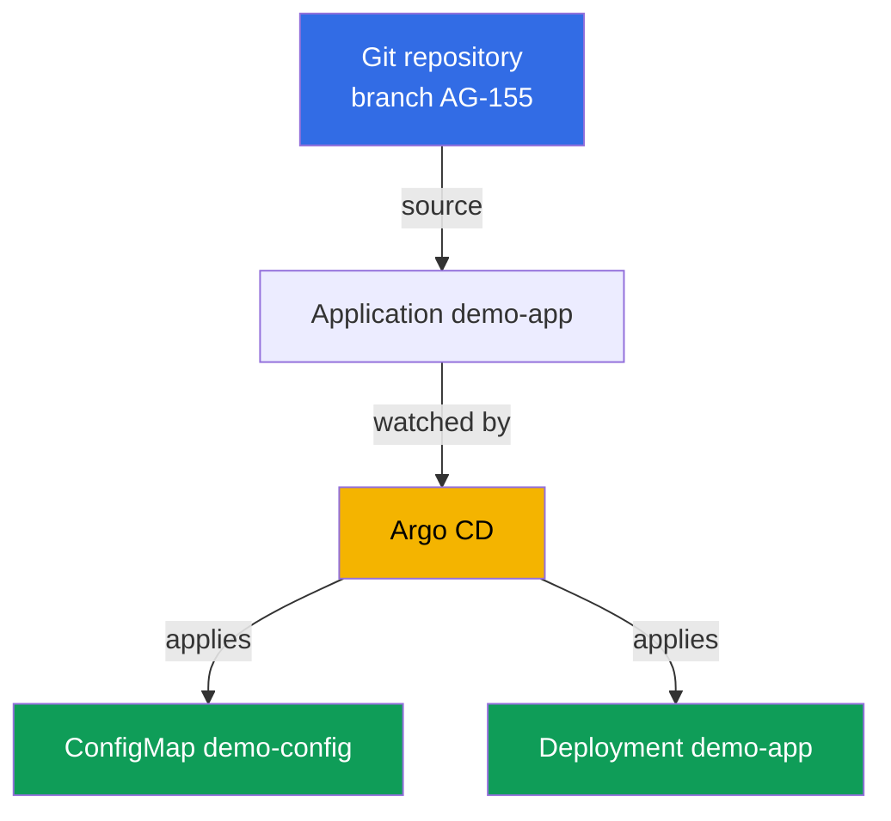
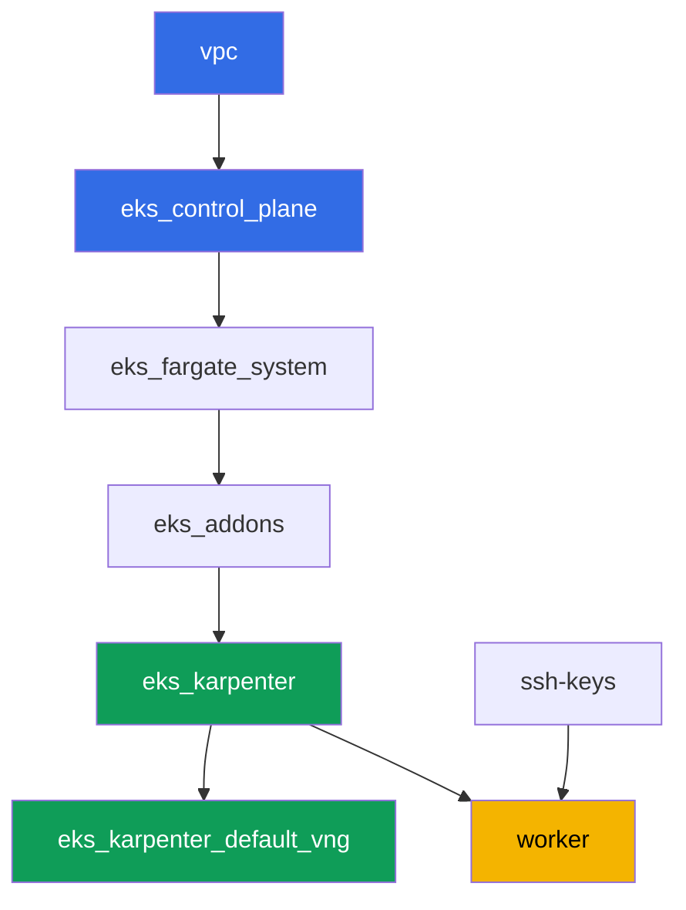

[Русская версия](README_RU.MD) · [Versión en español](README_ES.MD) · [Version française](README_FR.MD) · [Deutsche Version](README_DE.MD) · [ქართული ვერსია](README_GE.MD) · [繁體中文版](README_TW.MD) · [日本語版](README_JP.MD)

# Lab 118 - GitOps: Argo CD, drift and self-heal, sync waves

## Description

In this lab you install Argo CD into an already deployed cluster and hand off control of
part of the workload to it through an `Application` object. Instead of manual `kubectl
apply`, Git becomes the source of truth: the agent pulls the manifests itself, applies
them, and watches the live state. You'll see the difference between two independent
`Application` statuses - sync (does the live state match Git) and health (is the resource
actually healthy), reproduce drift by manually editing the cluster and watch self-heal roll
it back, and also check the order in which objects are applied via sync wave.

Tasks are written in a production style: a short statement plus acceptance criteria.
Checking is automatic, via the `check_result` command.

## Goal

Reinforce the material from the course chapter:

- [Chapter 44. GitOps and delivery: Argo CD and Flux, managing a fleet of
  clusters](../../course/44/ru.md) - Git as the source of truth, sync and health, self-heal

## What we're creating

The cluster is already deployed as code (control plane, Fargate for system pods,
Karpenter for the workload). You install Argo CD and point it at demo manifests that live
right in this repository, in the `gitops-demo/` directory next to this README.

| Object | What it is | Why it's in this lab |
|--------|---------|-------------------|
| Namespace `argocd` | a cluster section for the GitOps agent itself | Argo CD is installed here via Helm |
| Namespace `eks-118` | the lab's target workload namespace | Argo CD rolls out the demo app here |
| Application `demo-app` | CRD `argoproj.io/v1alpha1`, links Git and the cluster | source on `gitops-demo/`, destination on `eks-118`, `selfHeal`, `prune` |
| Deployment `demo-app` (2 replicas) | the ping_pong application from `gitops-demo/deployment.yaml` | shows that Argo CD, not the student, applied the object from Git |
| ConfigMap `demo-config` | config from `gitops-demo/configmap.yaml` | shows several objects in one `Application` and sync wave `0` |
| Artifacts `drift.txt`, `prune.txt`, `health.txt` | status snapshots and explanations | capture drift, self-heal, the boundaries of prune, and the sync/health difference |

The resulting GitOps flow:



The manifests `gitops-demo/deployment.yaml` and `gitops-demo/configmap.yaml` are not
cluster infrastructure, just ordinary YAML files for the demo application that the
`Application` is pointed at. Terragrunt doesn't touch them: Argo CD reads them straight
from Git over HTTPS.

## Infrastructure

The environment is deployed in AWS (`eu-central-1`) via Terragrunt. Each lab directory is
one component with its own `terragrunt.hcl`, which references a shared module in
`terraform/modules/` and declares dependencies through `dependency` blocks. This lab adds
no new terraform modules: Argo CD is installed manually via Helm from the worker machine,
and the worker machine's permissions (`eks:*`, `ec2:Describe*`) are already enough,
because Argo CD only operates inside the cluster through Kubernetes RBAC, with no new AWS
IAM permissions needed.

### Modules and dependencies

| Directory (component) | Module (`terraform/modules/`) | Depends on | What it creates |
|---------------------|-------------------------------|------------|-------------|
| `vpc` | `vpc_v3` | - | VPC `10.10.0.0/16`, public and private subnets in two AZs, NAT |
| `ssh-keys` | `ssh-keys` | - | an SSH key pair for the worker machine and nodes |
| `eks_control_plane` | `eks_v2_control_plane` | `vpc` | EKS control plane `1.36`, OIDC, security groups |
| `eks_fargate_system` | `eks_v2_fargate` | `vpc`, `eks_control_plane` | Fargate profile for `kube-system` and `karpenter` |
| `eks_addons` | `eks_v2_addons` | `eks_control_plane`, `eks_fargate_system` | coredns, kube-proxy, vpc-cni, pod-identity add-ons |
| `eks_karpenter` | `eks_v2_karpenter` | `vpc`, `eks_control_plane`, `eks_addons`, `eks_fargate_system` | Karpenter controller, node IAM role |
| `eks_karpenter_default_vng` | `eks_v2_karpenter_vng` | `vpc`, `eks_control_plane`, `eks_karpenter` | default NodePool `default` and EC2NodeClass on AL2023 |
| `worker` | `eks_v2_work_pc` | `ssh-keys`, `vpc`, `eks_control_plane`, `eks_karpenter` | worker machine with kubectl, helm, tests, and `check_result` |

Dependency graph (what gets applied earlier is lower down the arrow):



The set of components is the same as in lab 101: system pods on Fargate, worker nodes
brought up by Karpenter. Argo CD is not a separate terraform component but a Helm chart
that the student installs by hand on the worker machine in task 1, just like the AWS Load
Balancer Controller in lab 108.

### Where things are configured

`env.hcl` (shared environment parameters, read by all components):

| Parameter | Value in the lab | What it affects |
|----------|-----------------|---------------|
| `region` | `eu-central-1` | region for all resources |
| `vpc_default_cidr`, `subnets` | `10.10.0.0/16`, subnets per AZ | VPC address plan and subnet tags |
| `prefix` | `eks-task118` | prefix for resource names and tags |
| `stack_name` | `eks118` | used to build `env_name` - the cluster name |
| `k8_version` | `1.36.0` | kubectl version on the worker machine |
| `instance_type_worker` | `t3.medium` | worker machine instance type |
| `ssh_password_enable`, `access_cidrs` | `true`, `0.0.0.0/0` | SSH access to the worker machine |
| `root_volume` | `gp3`, `10` | worker machine root disk |

`inputs` in each component's `terragrunt.hcl` (settings specific to that module):

| File | Key settings |
|------|--------------------|
| `eks_control_plane/terragrunt.hcl` | `eks.version = "1.36"`, private subnets for nodes |
| `eks_addons/terragrunt.hcl` | add-on versions for 1.36: kube-proxy, coredns, vpc-cni, pod-identity |
| `eks_karpenter_default_vng/terragrunt.hcl` | NodePool `requirements`, `limits`, `disruption` |
| `worker/terragrunt.hcl` | `test_url` and `task_script_url` for the lab 118 files |

## Deployment

```bash
TASK=118 make run_eks_task
```

Deployment takes roughly 15-20 minutes. In the output, find the line with the SSH connection
to the worker machine and connect to it. kubectl and helm there are already configured.

Useful commands on the worker machine:

```bash
time_left       # how much environment time is left
check_result    # check the solution
```

> Environment security. `env.hcl` has `ssh_password_enable = true` and
> `access_cidrs = ["0.0.0.0/0"]` enabled - convenient for a training environment, but this
> is not something to do in production. Per the course standards (chapters 0.2, 2, 19),
> access to worker machines should go through AWS SSM Session Manager without exposing
> public SSH ports, and `access_cidrs` should be narrowed down to specific addresses. Here
> public SSH is left in place only to keep the setup simple.

## Tasks

---
|        **1**        | **Installing Argo CD via Helm**                            |
| :-----------------: | :---------------------------------------------------------- |
| What to do          | Create namespace `argocd`. Install Argo CD via Helm (repository `https://argoproj.github.io/argo-helm`, chart `argo-cd`) into this namespace with the default command, without overriding `values`. Wait until Deployment `argocd-server` in `argocd` becomes `Running` (at least one ready replica). |
| Acceptance criteria    | - namespace `argocd` exists;<br/>- Deployment `argocd-server` in `argocd` has at least one ready replica. |
---
|        **2**        | **Application: source, destination, self-heal, prune**      |
| :-----------------: | :---------------------------------------------------------- |
| What to do          | Create namespace `eks-118`. Create an `Application` object (`apiVersion: argoproj.io/v1alpha1`) named `demo-app` in namespace `argocd`: `spec.source.repoURL = https://github.com/ViktorUJ/cks.git`, `spec.source.targetRevision = AG-155`, `spec.source.path = tasks/eks/labs/118/gitops-demo`, `spec.destination.server = https://kubernetes.default.svc`, `spec.destination.namespace = eks-118`, `spec.syncPolicy.automated.selfHeal = true`, `spec.syncPolicy.automated.prune = true`. Wait until `.status.sync.status` becomes `Synced` and `.status.health.status` becomes `Healthy`. |
| Acceptance criteria    | - Application `demo-app` in `argocd` with the specified source/destination;<br/>- `selfHeal` and `prune` enabled (`true`);<br/>- `.status.sync.status = Synced`, `.status.health.status = Healthy`. |
---
|        **3**        | **Checking that the manifests were actually applied**                |
| :-----------------: | :---------------------------------------------------------- |
| What to do          | Make sure Argo CD actually applied the objects from `gitops-demo/` into `eks-118`: Deployment `demo-app` (image `viktoruj/ping_pong`, `2` replicas Ready) and ConfigMap `demo-config` with a `greeting` key. Check with the commands `kubectl get deployment demo-app -n eks-118` and `kubectl get configmap demo-config -n eks-118`. |
| Acceptance criteria    | - Deployment `demo-app` in `eks-118`, image `viktoruj/ping_pong`, `2` ready replicas;<br/>- ConfigMap `demo-config` in `eks-118` with a non-empty `greeting` key. |
---
|        **4**        | **Reproducing drift and self-heal**                      |
| :-----------------: | :---------------------------------------------------------- |
| What to do          | Important detail: with `selfHeal` enabled, the controller rolls back drift within seconds, and catching `OutOfSync` with your own eyes is practically impossible. So drift is shown in two steps. First disable only self-healing: `selfHeal: false` (leave `prune` as `true`). Then change the live state bypassing Git - `kubectl scale deployment demo-app -n eks-118 --replicas=5` - and confirm that the Application went into `OutOfSync` and stays there (without self-heal, drift isn't healed). Capture this moment. Then set `selfHeal: true` back and wait for self-heal to roll replicas back to `2` on its own, with the Application becoming `Synced` again. Capture the second moment. Save both snapshots (`sync`/`health` and the final `spec.replicas`) into the file `/var/work/tests/artifacts/4/drift.txt`. |
| Acceptance criteria    | - the file `drift.txt` contains both `OutOfSync` and `Synced`;<br/>- Deployment `demo-app` ends up back at `2` replicas (`spec.replicas`). |
---
|        **5**        | **Sync wave: the order objects are applied in**                  |
| :-----------------: | :---------------------------------------------------------- |
| What to do          | The lab's manifests already carry `argocd.argoproj.io/sync-wave` annotations: `0` on `gitops-demo/configmap.yaml`, `1` on `gitops-demo/deployment.yaml` - the lower number is applied first. Check both annotations via `kubectl get ... -o jsonpath='{.metadata.annotations.argocd\.argoproj\.io/sync-wave}'` and confirm that the Application is still `Synced` (both objects from different waves are synced). |
| Acceptance criteria    | - ConfigMap `demo-config` has annotation `sync-wave: "0"`;<br/>- Deployment `demo-app` has annotation `sync-wave: "1"`;<br/>- `.status.sync.status = Synced`. |
---
|        **6**        | **What prune removes and what it doesn't: resource ownership**         |
| :-----------------: | :---------------------------------------------------------- |
| What to do          | Manually create ConfigMap `manual-extra` in `eks-118`, which doesn't exist in `gitops-demo/`: `kubectl create configmap manual-extra -n eks-118 --from-literal=note=manual`. Force a refresh (`kubectl patch application demo-app -n argocd --type=merge -p '{"metadata":{"annotations":{"argocd.argoproj.io/refresh":"hard"}}}'`) and observe something unexpected: `prune=true` is enabled, but `manual-extra` is **not removed**, while the Application stays `Synced`. The reason: Argo CD only owns objects that are marked as belonging to the application (in version 3.x this is the `argocd.argoproj.io/tracking-id` annotation - check it on `demo-config`); an object created by hand is a stranger to it (orphaned) and doesn't fall under prune. Now mark it as belonging to the application: `kubectl annotate configmap manual-extra -n eks-118 'argocd.argoproj.io/tracking-id=demo-app:/ConfigMap:eks-118/manual-extra' --overwrite`, force a refresh again - now the object is tracked, it's absent from Git, and prune removes it. Write both observations into the file `/var/work/tests/artifacts/6/prune.txt` (not removed without tracking, removed with tracking) and explain in words that prune only removes tracked resources missing from Git, which is why `demo-app` and `demo-config` stay in place. |
| Acceptance criteria    | - the file `prune.txt` is not empty, mentions `manual-extra` and the word `prune`;<br/>- ConfigMap `manual-extra` in `eks-118` is eventually absent;<br/>- ConfigMap `demo-config` and Deployment `demo-app` stay in place. |
---
|        **7**        | **Diagnostics: sync status versus health status**           |
| :-----------------: | :---------------------------------------------------------- |
| What to do          | Temporarily disable `syncPolicy.automated` on the `Application` (otherwise self-heal will immediately roll back the next step). Add a deliberately broken `readinessProbe` to Deployment `demo-app`. Careful: the training image `ping_pong` responds `200` on any path, so a probe on a "nonexistent URL" will pass fine - point the probe at a **closed port** instead, for example `httpGet` on port `9999`. Then new pods fail readiness. Confirm that `.status.health.status` becomes `Progressing` (and, once `progressDeadlineSeconds` elapses, the Deployment becomes `Degraded`), while `.status.sync.status` stays `Synced`. Notice why: `replicas` is described in Git, so its manual edit produced `OutOfSync` (task 4), while `readinessProbe` isn't in the Git manifest, so the added field doesn't count toward the diff. Explain in the file `/var/work/tests/artifacts/7/health.txt` why `Synced` and `Degraded`/`Progressing` can happen at the same time: sync status compares the live state against Git, health status is the resource's actual readiness - these are two independent axes. At the end, set `syncPolicy.automated` (`selfHeal`, `prune`) back and remove the probe **by hand** (`kubectl patch ... --type=json` with a `remove` operation): verify for yourself that self-heal doesn't fix this breakage, because for Argo CD there's no diff from Git (`Synced`) - fields absent from the manifest remain the operator's responsibility. |
| Acceptance criteria    | - the file `health.txt` is not empty, contains the words `sync`, `health`, `Synced` and `Degraded`/`Progressing`;<br/>- explicitly explains that sync and health are different, independent statuses. |
---

## Checking the result

On the worker machine, run the automatic check:

```bash
check_result
```

The script will run the tests and show the percentage of completed tasks.

## Solution

Reference solution: [worker/files/solutions/1.MD](worker/files/solutions/1.MD)

## Deleting the cluster and resources

> **First disable `selfHeal`, then remove the objects, otherwise Argo CD will restore them
> on its own.** While Application `demo-app` is synced with `selfHeal: true`, deleting
> Deployment `demo-app` or ConfigMap `demo-config` by hand (or by deleting namespace
> `eks-118`) will be rolled back by the controller within seconds - that's exactly the
> behavior you exercised in task 4. This lab doesn't create AWS resources, so there's no
> risk from an orphaned ENI here, but Argo CD was installed manually via Helm, and
> `TASK=118 make delete_eks_task` doesn't know about it.

```bash
# 1. Disable autosync on the Application, otherwise removing the objects below will roll back on its own
kubectl patch application demo-app -n argocd --type=merge \
  -p '{"spec":{"syncPolicy":{"automated":null}}}'

# 2. Remove the Application (after this Argo CD no longer watches demo-app and demo-config)
kubectl delete application demo-app -n argocd --ignore-not-found

# 3. Remove Argo CD itself and both of the lab's workloads
helm uninstall argocd -n argocd
kubectl delete namespace argocd eks-118 --ignore-not-found

# 4. Wait for Karpenter to remove the NodeClaim and EC2 node (only fargate-* should remain)
while kubectl get nodeclaims --no-headers 2>/dev/null | grep -q .; do
  echo "NodeClaim still alive, waiting..."; sleep 15
done
kubectl get nodes | grep -v fargate
```

Only after that, tear down the stack:

```bash
TASK=118 make delete_eks_task
```

If `destroy` gets stuck on the node security group, an orphaned ENI is left behind. Find
and delete it:

```bash
aws ec2 describe-network-interfaces --filters Name=status,Values=available \
  --query 'NetworkInterfaces[?Tags[?Key==`eks:eni:owner`]].[NetworkInterfaceId,Description]' \
  --output table
aws ec2 delete-network-interface --network-interface-id <eni-id>
```
