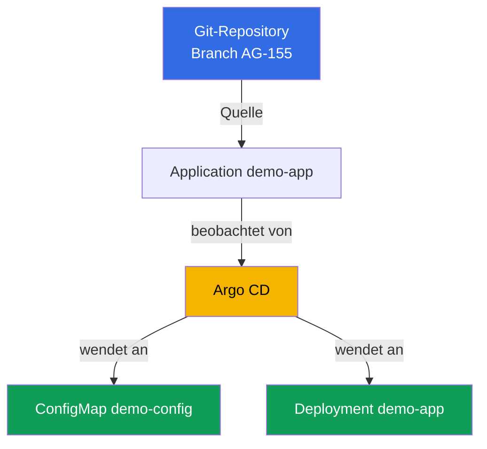
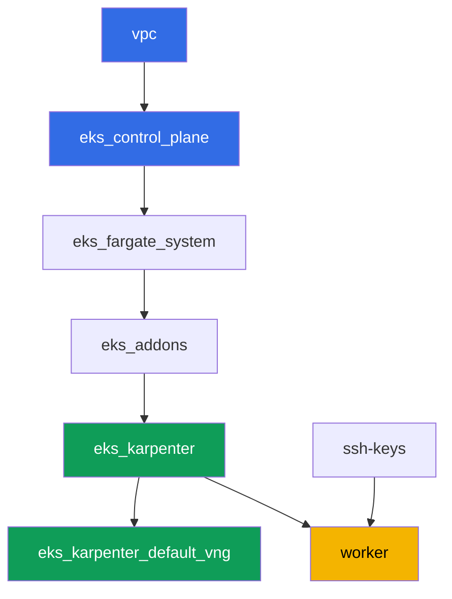

[Русская версия](README_RU.MD) · [Eng version](README.MD) · [Versión en español](README_ES.MD) · [Version française](README_FR.MD) · [ქართული ვერსია](README_GE.MD) · [繁體中文版](README_TW.MD) · [日本語版](README_JP.MD)

# Labor 118 - GitOps: Argo CD, Drift und Self-Heal, Sync Waves

## Beschreibung

In diesem Labor installierst du Argo CD in einem bereits bereitgestellten Cluster und
übergibst ihm die Kontrolle über einen Teil der Workload mittels eines
`Application`-Objekts. Statt manuellem `kubectl apply` wird Git zur Quelle der Wahrheit:
der Agent zieht die Manifeste selbst, wendet sie an und beobachtet den Live-Zustand. Du
siehst den Unterschied zwischen zwei unabhängigen `Application`-Statuswerten - sync
(stimmt der Live-Zustand mit Git überein) und health (ist die Ressource tatsächlich
gesund), reproduzierst Drift durch manuelle Änderungen im Cluster und beobachtest, wie
self-heal ihn zurückrollt, und prüfst außerdem die Reihenfolge der Anwendung von
Objekten über sync wave.

Die Aufgaben sind im Produktionsstil geschrieben: eine kurze Aufgabenstellung plus
Abnahmekriterien. Die Prüfung erfolgt automatisch über den Befehl `check_result`.

## Ziel

Den Stoff aus dem Kurskapitel vertiefen:

- [Kapitel 44. GitOps und Delivery: Argo CD und Flux, Verwaltung einer Cluster-
  Flotte](../../course/44/ru.md) - Git als Quelle der Wahrheit, sync und health,
  self-heal

## Was wir erstellen

Der Cluster ist bereits als Code bereitgestellt (Control Plane, Fargate für
System-Pods, Karpenter für die Workload). Du installierst Argo CD und konfigurierst es
auf Demo-Manifeste, die direkt in diesem Repository liegen, im Verzeichnis
`gitops-demo/` neben dieser README.

| Objekt | Was es ist | Warum es in diesem Labor gebraucht wird |
|--------|---------|-------------------|
| Namespace `argocd` | ein Clusterbereich für den GitOps-Agenten selbst | Argo CD wird hier per Helm installiert |
| Namespace `eks-118` | der Ziel-Namespace der Labor-Workload | hierhin rollt Argo CD die Demo-Anwendung aus |
| Application `demo-app` | CRD `argoproj.io/v1alpha1`, verbindet Git und den Cluster | source auf `gitops-demo/`, destination auf `eks-118`, `selfHeal`, `prune` |
| Deployment `demo-app` (2 Replicas) | die ping_pong-Anwendung aus `gitops-demo/deployment.yaml` | zeigt, dass Argo CD, nicht der Student, das Objekt aus Git angewendet hat |
| ConfigMap `demo-config` | Konfiguration aus `gitops-demo/configmap.yaml` | zeigt mehrere Objekte in einer `Application` und sync wave `0` |
| Artefakte `drift.txt`, `prune.txt`, `health.txt` | Statusschnappschüsse und Erklärungen | halten Drift, Self-Heal, die Grenzen von Prune und den Unterschied sync/health fest |

Der resultierende GitOps-Ablauf:



Die Manifeste `gitops-demo/deployment.yaml` und `gitops-demo/configmap.yaml` sind keine
Cluster-Infrastruktur, sondern gewöhnliche YAML-Dateien der Demo-Anwendung, auf die
`Application` konfiguriert wird. Terragrunt fasst sie nicht an: Argo CD liest sie
direkt aus Git über HTTPS.

## Infrastruktur

Die Umgebung wird in AWS (`eu-central-1`) über Terragrunt bereitgestellt. Jedes
Laborverzeichnis ist eine Komponente mit eigener `terragrunt.hcl`, die auf ein
gemeinsames Modul in `terraform/modules/` verweist und Abhängigkeiten über
`dependency`-Blöcke deklariert. Dieses Labor fügt keine neuen Terraform-Module hinzu:
Argo CD wird manuell über Helm von der Worker-Maschine aus installiert, und die
Berechtigungen der Worker-Maschine (`eks:*`, `ec2:Describe*`) reichen bereits aus, da
Argo CD nur innerhalb des Clusters über Kubernetes RBAC arbeitet, ohne neue AWS-IAM-
Rechte.

### Module und Abhängigkeiten

| Verzeichnis (Komponente) | Modul (`terraform/modules/`) | Abhängig von | Was es erstellt |
|---------------------|-------------------------------|------------|-------------|
| `vpc` | `vpc_v3` | - | VPC `10.10.0.0/16`, öffentliche und private Subnetze in zwei AZs, NAT |
| `ssh-keys` | `ssh-keys` | - | ein SSH-Schlüsselpaar für die Worker-Maschine und die Nodes |
| `eks_control_plane` | `eks_v2_control_plane` | `vpc` | EKS-Control-Plane `1.36`, OIDC, Security Groups |
| `eks_fargate_system` | `eks_v2_fargate` | `vpc`, `eks_control_plane` | Fargate-Profil für `kube-system` und `karpenter` |
| `eks_addons` | `eks_v2_addons` | `eks_control_plane`, `eks_fargate_system` | Add-ons coredns, kube-proxy, vpc-cni, pod-identity |
| `eks_karpenter` | `eks_v2_karpenter` | `vpc`, `eks_control_plane`, `eks_addons`, `eks_fargate_system` | Karpenter-Controller, IAM-Rolle der Nodes |
| `eks_karpenter_default_vng` | `eks_v2_karpenter_vng` | `vpc`, `eks_control_plane`, `eks_karpenter` | Standard-NodePool `default` und EC2NodeClass auf AL2023 |
| `worker` | `eks_v2_work_pc` | `ssh-keys`, `vpc`, `eks_control_plane`, `eks_karpenter` | Worker-Maschine mit kubectl, helm, Tests und `check_result` |

Abhängigkeitsgraph (was früher angewendet wird, steht weiter unten am Pfeil):



Die Komponentenauswahl ist die gleiche wie in Labor 101: System-Pods auf Fargate,
Worker-Nodes werden von Karpenter hochgefahren. Argo CD ist keine eigenständige
Terraform-Komponente, sondern ein Helm-Chart, das der Student in Aufgabe 1 selbst auf
der Worker-Maschine installiert, ähnlich wie den AWS Load Balancer Controller in Labor
108.

### Wo was konfiguriert wird

`env.hcl` (gemeinsame Umgebungsparameter, von allen Komponenten gelesen):

| Parameter | Wert im Labor | Was er beeinflusst |
|----------|-----------------|---------------|
| `region` | `eu-central-1` | Region aller Ressourcen |
| `vpc_default_cidr`, `subnets` | `10.10.0.0/16`, Subnetze pro AZ | Adressplan der VPC und Subnetz-Tags |
| `prefix` | `eks-task118` | Präfix für Ressourcennamen und Tags |
| `stack_name` | `eks118` | daraus wird `env_name` gebildet - der Clustername |
| `k8_version` | `1.36.0` | kubectl-Version auf der Worker-Maschine |
| `instance_type_worker` | `t3.medium` | Instanztyp der Worker-Maschine |
| `ssh_password_enable`, `access_cidrs` | `true`, `0.0.0.0/0` | SSH-Zugriff auf die Worker-Maschine |
| `root_volume` | `gp3`, `10` | Root-Datenträger der Worker-Maschine |

`inputs` in der `terragrunt.hcl` jeder Komponente (Einstellungen des jeweiligen
Moduls):

| Datei | Wichtige Einstellungen |
|------|--------------------|
| `eks_control_plane/terragrunt.hcl` | `eks.version = "1.36"`, private Subnetze für die Nodes |
| `eks_addons/terragrunt.hcl` | Add-on-Versionen für 1.36: kube-proxy, coredns, vpc-cni, pod-identity |
| `eks_karpenter_default_vng/terragrunt.hcl` | `requirements` des NodePool, `limits`, `disruption` |
| `worker/terragrunt.hcl` | `test_url` und `task_script_url` für die Dateien von Labor 118 |

## Bereitstellung

```bash
TASK=118 make run_eks_task
```

Die Bereitstellung dauert etwa 15-20 Minuten. Suche in der Ausgabe die Zeile mit der
SSH-Verbindung zur Worker-Maschine und verbinde dich damit. kubectl und helm sind dort
bereits konfiguriert.

Nützliche Befehle auf der Worker-Maschine:

```bash
time_left       # wie viel Umgebungszeit noch übrig ist
check_result    # die Lösung prüfen
```

> Sicherheit der Umgebung. In `env.hcl` sind `ssh_password_enable = true` und
> `access_cidrs = ["0.0.0.0/0"]` aktiviert - praktisch für eine Lernumgebung, aber in
> der Produktion nicht angebracht. Nach den Kursstandards (Kapitel 0.2, 2, 19) sollte
> der Zugriff auf Worker-Maschinen über AWS SSM Session Manager erfolgen, ohne
> öffentliche SSH-Ports offenzulegen, und `access_cidrs` sollte auf konkrete Adressen
> eingeschränkt werden. Hier bleibt öffentliches SSH nur der Einfachheit halber
> bestehen.

## Aufgaben

---
|        **1**        | **Installation von Argo CD über Helm**                            |
| :-----------------: | :---------------------------------------------------------- |
| Was zu tun ist      | Erstelle den Namespace `argocd`. Installiere Argo CD über Helm (Repository `https://argoproj.github.io/argo-helm`, Chart `argo-cd`) in diesen Namespace mit dem Standardbefehl, ohne `values` zu überschreiben. Warte, bis das Deployment `argocd-server` in `argocd` `Running` wird (mindestens eine bereite Replica). |
| Abnahmekriterien    | - Namespace `argocd` existiert;<br/>- das Deployment `argocd-server` in `argocd` hat mindestens eine bereite Replica. |
---
|        **2**        | **Application: source, destination, self-heal, prune**      |
| :-----------------: | :---------------------------------------------------------- |
| Was zu tun ist      | Erstelle den Namespace `eks-118`. Erstelle ein `Application`-Objekt (`apiVersion: argoproj.io/v1alpha1`) mit dem Namen `demo-app` im Namespace `argocd`: `spec.source.repoURL = https://github.com/ViktorUJ/cks.git`, `spec.source.targetRevision = AG-155`, `spec.source.path = tasks/eks/labs/118/gitops-demo`, `spec.destination.server = https://kubernetes.default.svc`, `spec.destination.namespace = eks-118`, `spec.syncPolicy.automated.selfHeal = true`, `spec.syncPolicy.automated.prune = true`. Warte, bis `.status.sync.status` `Synced` und `.status.health.status` `Healthy` wird. |
| Abnahmekriterien    | - Application `demo-app` in `argocd` mit den angegebenen source/destination;<br/>- `selfHeal` und `prune` aktiviert (`true`);<br/>- `.status.sync.status = Synced`, `.status.health.status = Healthy`. |
---
|        **3**        | **Prüfung, ob die Manifeste tatsächlich angewendet wurden**                |
| :-----------------: | :---------------------------------------------------------- |
| Was zu tun ist      | Stelle sicher, dass Argo CD die Objekte aus `gitops-demo/` tatsächlich in `eks-118` angewendet hat: Deployment `demo-app` (Image `viktoruj/ping_pong`, `2` Replicas Ready) und ConfigMap `demo-config` mit dem Schlüssel `greeting`. Prüfe mit den Befehlen `kubectl get deployment demo-app -n eks-118` und `kubectl get configmap demo-config -n eks-118`. |
| Abnahmekriterien    | - Deployment `demo-app` in `eks-118`, Image `viktoruj/ping_pong`, `2` bereite Replicas;<br/>- ConfigMap `demo-config` in `eks-118` mit nicht leerem Schlüssel `greeting`. |
---
|        **4**        | **Drift und Self-Heal reproduzieren**                      |
| :-----------------: | :---------------------------------------------------------- |
| Was zu tun ist      | Wichtiges Detail: bei aktiviertem `selfHeal` rollt der Controller Drift innerhalb von Sekunden zurück, und `OutOfSync` mit eigenen Augen zu erfassen ist praktisch unmöglich. Deshalb wird Drift in zwei Schritten gezeigt. Deaktiviere zuerst nur die Selbstheilung: `selfHeal: false` (lasse `prune` auf `true`). Ändere dann den Live-Zustand unter Umgehung von Git - `kubectl scale deployment demo-app -n eks-118 --replicas=5` - und bestätige, dass die Application in `OutOfSync` übergeht und dort bleibt (ohne self-heal wird Drift nicht behoben). Halte diesen Moment fest. Setze dann `selfHeal: true` zurück und warte, bis self-heal die Replicas selbst auf `2` zurückrollt und die Application wieder `Synced` wird. Halte den zweiten Moment fest. Speichere beide Schnappschüsse (`sync`/`health` und das finale `spec.replicas`) in der Datei `/var/work/tests/artifacts/4/drift.txt`. |
| Abnahmekriterien    | - die Datei `drift.txt` enthält sowohl `OutOfSync` als auch `Synced`;<br/>- das Deployment `demo-app` hat am Ende wieder `2` Replicas (`spec.replicas`). |
---
|        **5**        | **Sync Wave: Reihenfolge der Objektanwendung**                  |
| :-----------------: | :---------------------------------------------------------- |
| Was zu tun ist      | Die Laborsmanifeste tragen bereits die Annotationen `argocd.argoproj.io/sync-wave`: `0` bei `gitops-demo/configmap.yaml`, `1` bei `gitops-demo/deployment.yaml` - die kleinere Nummer wird zuerst angewendet. Prüfe beide Annotationen über `kubectl get ... -o jsonpath='{.metadata.annotations.argocd\.argoproj\.io/sync-wave}'` und bestätige, dass die Application dabei weiterhin `Synced` ist (beide Objekte aus verschiedenen Wellen sind synchronisiert). |
| Abnahmekriterien    | - ConfigMap `demo-config` hat die Annotation `sync-wave: "0"`;<br/>- Deployment `demo-app` hat die Annotation `sync-wave: "1"`;<br/>- `.status.sync.status = Synced`. |
---
|        **6**        | **Was prune löscht und was nicht: Ressourcen-Eigentum**         |
| :-----------------: | :---------------------------------------------------------- |
| Was zu tun ist      | Erstelle manuell in `eks-118` die ConfigMap `manual-extra`, die es in `gitops-demo/` nicht gibt: `kubectl create configmap manual-extra -n eks-118 --from-literal=note=manual`. Erzwinge einen Refresh (`kubectl patch application demo-app -n argocd --type=merge -p '{"metadata":{"annotations":{"argocd.argoproj.io/refresh":"hard"}}}'`) und beobachte etwas Unerwartetes: `prune=true` ist aktiviert, aber `manual-extra` wird **nicht gelöscht**, und die Application bleibt `Synced`. Der Grund: Argo CD besitzt nur Objekte, die als zur Anwendung gehörend markiert sind (in Version 3.x die Annotation `argocd.argoproj.io/tracking-id` - sieh sie dir bei `demo-config` an); ein manuell erstelltes Objekt ist für Argo CD fremd (orphaned) und fällt nicht unter den Prune-Bereich. Markiere es nun als zur Anwendung gehörend: `kubectl annotate configmap manual-extra -n eks-118 'argocd.argoproj.io/tracking-id=demo-app:/ConfigMap:eks-118/manual-extra' --overwrite`, erzwinge erneut einen Refresh - jetzt wird das Objekt verfolgt, es ist nicht in Git, und prune löscht es. Trage in der Datei `/var/work/tests/artifacts/6/prune.txt` beide Beobachtungen ein (nicht gelöscht ohne Tracking, gelöscht mit Tracking) und erkläre in Worten, dass prune nur verfolgte Ressourcen entfernt, die in Git fehlen, weshalb `demo-app` und `demo-config` an ihrem Platz bleiben. |
| Abnahmekriterien    | - die Datei `prune.txt` ist nicht leer, erwähnt `manual-extra` und das Wort `prune`;<br/>- die ConfigMap `manual-extra` in `eks-118` ist am Ende nicht mehr vorhanden;<br/>- ConfigMap `demo-config` und Deployment `demo-app` bleiben an ihrem Platz. |
---
|        **7**        | **Diagnose: sync status gegen health status**           |
| :-----------------: | :---------------------------------------------------------- |
| Was zu tun ist      | Deaktiviere vorübergehend `syncPolicy.automated` bei der `Application` (sonst rollt self-heal den nächsten Schritt sofort zurück). Füge dem Deployment `demo-app` eine bewusst defekte `readinessProbe` hinzu. Achtung: das Übungsimage `ping_pong` antwortet mit `200` auf jeden Pfad, sodass eine Probe auf eine „nicht existierende URL“ problemlos besteht - richte die Probe stattdessen auf einen **geschlossenen Port**, zum Beispiel `httpGet` auf Port `9999`. Dann bestehen neue Pods die Readiness nicht. Bestätige, dass `.status.health.status` zu `Progressing` wird (und nach Ablauf von `progressDeadlineSeconds` das Deployment zu `Degraded` wird), während `.status.sync.status` `Synced` bleibt. Achte darauf, warum: `replicas` ist in Git beschrieben, daher ergab die manuelle Änderung `OutOfSync` (Aufgabe 4), während `readinessProbe` nicht im Git-Manifest steht und das hinzugefügte Feld nicht in die Abweichung eingeht. Erkläre in der Datei `/var/work/tests/artifacts/7/health.txt`, warum `Synced` und `Degraded`/`Progressing` gleichzeitig möglich sind: sync status vergleicht den Live-Zustand mit Git, health status ist die tatsächliche Bereitschaft der Ressource - das sind zwei unabhängige Achsen. Setze am Ende `syncPolicy.automated` (`selfHeal`, `prune`) zurück und entferne die Probe **manuell** (`kubectl patch ... --type=json` mit einer `remove`-Operation): prüfe selbst, dass self-heal diesen Defekt nicht behebt, da für Argo CD keine Abweichung von Git besteht (`Synced`) - Felder, die nicht im Manifest stehen, bleiben in der Verantwortung des Operators. |
| Abnahmekriterien    | - die Datei `health.txt` ist nicht leer, enthält die Wörter `sync`, `health`, `Synced` und `Degraded`/`Progressing`;<br/>- erklärt explizit, dass sync und health unterschiedliche, unabhängige Statuswerte sind. |
---

## Ergebnisprüfung

Führe auf der Worker-Maschine die automatische Prüfung aus:

```bash
check_result
```

Das Skript führt die Tests aus und zeigt den Prozentsatz der erledigten Aufgaben an.

## Lösung

Referenzlösung: [worker/files/solutions/1_DE.MD](worker/files/solutions/1_DE.MD)

## Löschen des Clusters und der Ressourcen

> **Deaktiviere zuerst `selfHeal`, entferne dann die Objekte, sonst stellt Argo CD sie
> selbst wieder her.** Solange die Application `demo-app` mit `selfHeal: true`
> synchronisiert ist, wird das manuelle Löschen von Deployment `demo-app` oder
> ConfigMap `demo-config` (oder durch Löschen des Namespace `eks-118`) vom Controller
> innerhalb von Sekunden rückgängig gemacht - genau dieses Verhalten hast du in Aufgabe
> 4 geübt. Dieses Labor erstellt keine AWS-Ressourcen, es besteht also kein Risiko
> durch ein verwaistes ENI, aber Argo CD wurde manuell über Helm installiert, und
> `TASK=118 make delete_eks_task` weiß davon nichts.

```bash
# 1. Autosync der Application deaktivieren, sonst rollt das Entfernen der Objekte unten selbst zurück
kubectl patch application demo-app -n argocd --type=merge \
  -p '{"spec":{"syncPolicy":{"automated":null}}}'

# 2. Application entfernen (danach überwacht Argo CD demo-app und demo-config nicht mehr)
kubectl delete application demo-app -n argocd --ignore-not-found

# 3. Argo CD selbst und beide Labor-Workloads entfernen
helm uninstall argocd -n argocd
kubectl delete namespace argocd eks-118 --ignore-not-found

# 4. Warten, bis Karpenter den NodeClaim und die EC2-Node entfernt (nur fargate-* sollten übrig bleiben)
while kubectl get nodeclaims --no-headers 2>/dev/null | grep -q .; do
  echo "NodeClaim noch aktiv, warte..."; sleep 15
done
kubectl get nodes | grep -v fargate
```

Erst danach den Stack abbauen:

```bash
TASK=118 make delete_eks_task
```

Wenn `destroy` an der Security Group der Nodes hängen bleibt, bedeutet das, dass ein
verwaistes ENI übrig geblieben ist. Finde und lösche es:

```bash
aws ec2 describe-network-interfaces --filters Name=status,Values=available \
  --query 'NetworkInterfaces[?Tags[?Key==`eks:eni:owner`]].[NetworkInterfaceId,Description]' \
  --output table
aws ec2 delete-network-interface --network-interface-id <eni-id>
```
