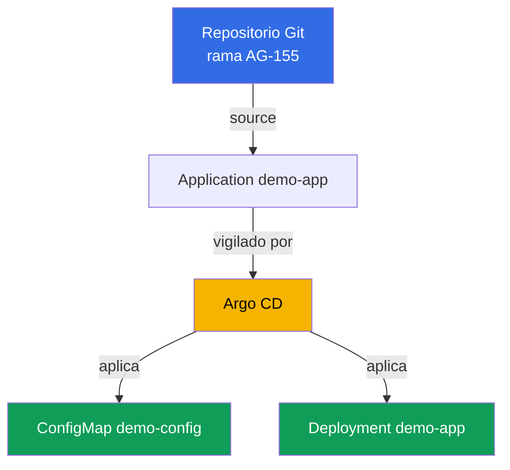
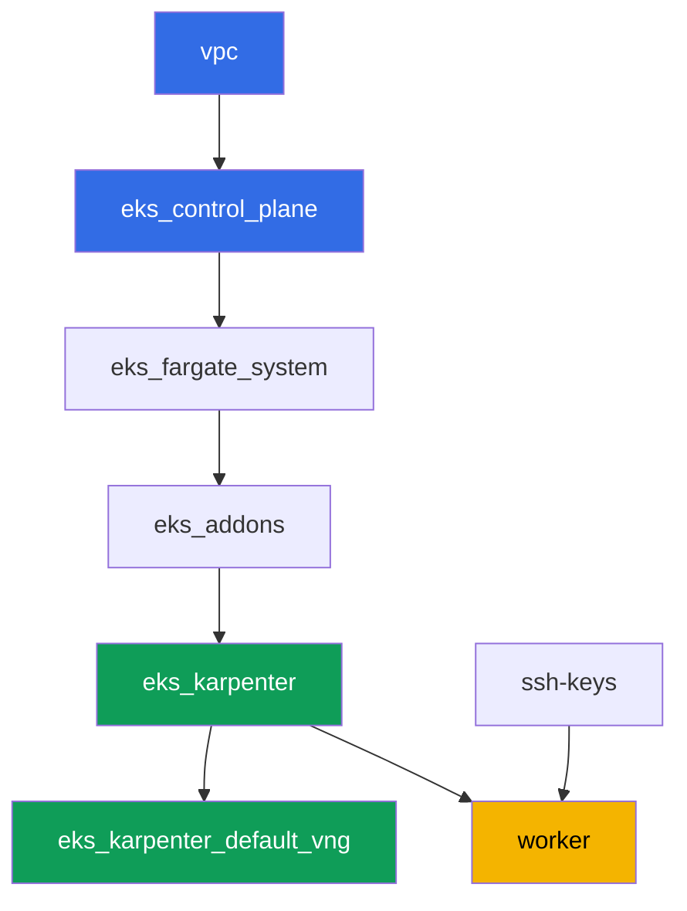

[Русская версия](README_RU.MD) · [Eng version](README.MD) · [Version française](README_FR.MD) · [Deutsche Version](README_DE.MD) · [ქართული ვერსია](README_GE.MD) · [繁體中文版](README_TW.MD) · [日本語版](README_JP.MD)

# Laboratorio 118 - GitOps: Argo CD, drift y self-heal, sync waves

## Descripción

En este laboratorio instalas Argo CD en un clúster ya desplegado y le entregas el control
de parte de la carga de trabajo mediante un objeto `Application`. En lugar de un `kubectl
apply` manual, Git se convierte en la fuente de verdad: el agente obtiene los manifiestos
por sí mismo, los aplica y vigila el estado en vivo. Verás la diferencia entre dos estados
independientes de `Application` - sync (si el estado en vivo coincide con Git) y health
(si el recurso está realmente saludable), reproducirás un drift editando manualmente el
clúster y observarás cómo self-heal lo revierte, y también comprobarás el orden de
aplicación de los objetos mediante sync wave.

Las tareas están escritas en estilo de producción: un enunciado breve más criterios de
aceptación. La verificación es automática, con el comando `check_result`.

## Objetivo

Reforzar el material del capítulo del curso:

- [Capítulo 44. GitOps y entrega: Argo CD y Flux, gestión de una flota de
  clústeres](../../course/44/es.md) - Git como fuente de verdad, sync y health, self-heal

## Qué vamos a crear

El clúster ya está desplegado como código (control plane, Fargate para los pods de
sistema, Karpenter para la carga de trabajo). Instalas Argo CD y lo configuras contra
manifiestos de demostración que están directamente en este repositorio, en el directorio
`gitops-demo/` junto a este README.

| Objeto | Qué es | Por qué está en este laboratorio |
|--------|---------|-------------------|
| Namespace `argocd` | una sección del clúster para el propio agente GitOps | Argo CD se instala aquí mediante Helm |
| Namespace `eks-118` | el namespace de destino de la carga de trabajo del laboratorio | aquí Argo CD despliega la aplicación de demostración |
| Application `demo-app` | CRD `argoproj.io/v1alpha1`, vincula Git y el clúster | source en `gitops-demo/`, destination en `eks-118`, `selfHeal`, `prune` |
| Deployment `demo-app` (2 réplicas) | la aplicación ping_pong de `gitops-demo/deployment.yaml` | muestra que Argo CD, y no el estudiante, aplicó el objeto desde Git |
| ConfigMap `demo-config` | configuración de `gitops-demo/configmap.yaml` | muestra varios objetos en una sola `Application` y sync wave `0` |
| Artefactos `drift.txt`, `prune.txt`, `health.txt` | capturas de estados y explicaciones | registran el drift, el self-heal, los límites de prune y la diferencia sync/health |

El flujo de GitOps resultante:



Los manifiestos `gitops-demo/deployment.yaml` y `gitops-demo/configmap.yaml` no son
infraestructura del clúster, sino simples archivos YAML de la aplicación de demostración
a los que apunta `Application`. Terragrunt no los toca: Argo CD los lee directamente
desde Git por HTTPS.

## Infraestructura

El entorno se despliega en AWS (`eu-central-1`) mediante Terragrunt. Cada directorio del
laboratorio es un componente con su propio `terragrunt.hcl`, que referencia un módulo
compartido en `terraform/modules/` y declara dependencias mediante bloques `dependency`.
Este laboratorio no añade nuevos módulos de terraform: Argo CD se instala manualmente
mediante Helm desde la máquina de trabajo, y los permisos de la máquina de trabajo
(`eks:*`, `ec2:Describe*`) ya son suficientes, porque Argo CD solo opera dentro del
clúster mediante Kubernetes RBAC, sin nuevos permisos de AWS IAM.

### Módulos y dependencias

| Directorio (componente) | Módulo (`terraform/modules/`) | Depende de | Qué crea |
|---------------------|-------------------------------|------------|-------------|
| `vpc` | `vpc_v3` | - | VPC `10.10.0.0/16`, subredes públicas y privadas en dos AZ, NAT |
| `ssh-keys` | `ssh-keys` | - | un par de claves SSH para la máquina de trabajo y los nodos |
| `eks_control_plane` | `eks_v2_control_plane` | `vpc` | control plane de EKS `1.36`, OIDC, security groups |
| `eks_fargate_system` | `eks_v2_fargate` | `vpc`, `eks_control_plane` | perfil de Fargate para `kube-system` y `karpenter` |
| `eks_addons` | `eks_v2_addons` | `eks_control_plane`, `eks_fargate_system` | add-ons coredns, kube-proxy, vpc-cni, pod-identity |
| `eks_karpenter` | `eks_v2_karpenter` | `vpc`, `eks_control_plane`, `eks_addons`, `eks_fargate_system` | controlador de Karpenter, rol IAM de los nodos |
| `eks_karpenter_default_vng` | `eks_v2_karpenter_vng` | `vpc`, `eks_control_plane`, `eks_karpenter` | NodePool `default` predeterminado y EC2NodeClass sobre AL2023 |
| `worker` | `eks_v2_work_pc` | `ssh-keys`, `vpc`, `eks_control_plane`, `eks_karpenter` | máquina de trabajo con kubectl, helm, tests y `check_result` |

Grafo de dependencias (lo que se aplica antes está más abajo en la flecha):



El conjunto de componentes es el mismo que en el laboratorio 101: pods de sistema en
Fargate, nodos de trabajo levantados por Karpenter. Argo CD no es un componente de
terraform independiente, sino un chart de Helm que el estudiante instala por sí mismo en
la máquina de trabajo en la tarea 1, igual que el AWS Load Balancer Controller en el
laboratorio 108.

### Dónde se configura cada cosa

`env.hcl` (parámetros compartidos del entorno, leídos por todos los componentes):

| Parámetro | Valor en el laboratorio | Qué afecta |
|----------|-----------------|---------------|
| `region` | `eu-central-1` | región de todos los recursos |
| `vpc_default_cidr`, `subnets` | `10.10.0.0/16`, subredes por AZ | plan de direcciones de la VPC y etiquetas de las subredes |
| `prefix` | `eks-task118` | prefijo de nombres de recursos y etiquetas |
| `stack_name` | `eks118` | se usa para construir `env_name` - el nombre del clúster |
| `k8_version` | `1.36.0` | versión de kubectl en la máquina de trabajo |
| `instance_type_worker` | `t3.medium` | tipo de instancia de la máquina de trabajo |
| `ssh_password_enable`, `access_cidrs` | `true`, `0.0.0.0/0` | acceso SSH a la máquina de trabajo |
| `root_volume` | `gp3`, `10` | disco raíz de la máquina de trabajo |

`inputs` en el `terragrunt.hcl` de cada componente (ajustes específicos de ese módulo):

| Archivo | Ajustes clave |
|------|--------------------|
| `eks_control_plane/terragrunt.hcl` | `eks.version = "1.36"`, subredes privadas para los nodos |
| `eks_addons/terragrunt.hcl` | versiones de add-ons para 1.36: kube-proxy, coredns, vpc-cni, pod-identity |
| `eks_karpenter_default_vng/terragrunt.hcl` | `requirements` del NodePool, `limits`, `disruption` |
| `worker/terragrunt.hcl` | `test_url` y `task_script_url` para los archivos del laboratorio 118 |

## Despliegue

```bash
TASK=118 make run_eks_task
```

El despliegue tarda aproximadamente 15-20 minutos. En la salida, busca la línea con la
conexión SSH a la máquina de trabajo y conéctate a ella. kubectl y helm ya están
configurados allí.

Comandos útiles en la máquina de trabajo:

```bash
time_left       # cuánto tiempo queda del entorno
check_result    # comprobar la solución
```

> Seguridad del entorno. En `env.hcl` están habilitados `ssh_password_enable = true` y
> `access_cidrs = ["0.0.0.0/0"]` - cómodo para un entorno de aprendizaje, pero eso no debe
> hacerse en producción. Según los estándares del curso (capítulos 0.2, 2, 19), el acceso
> a las máquinas de trabajo debe pasar por AWS SSM Session Manager sin exponer puertos SSH
> públicos, y `access_cidrs` debe reducirse a direcciones concretas. Aquí se deja SSH
> público solo para simplificar el despliegue.

## Tareas

---
|        **1**        | **Instalación de Argo CD mediante Helm**                            |
| :-----------------: | :---------------------------------------------------------- |
| Qué hacer          | Crea el namespace `argocd`. Instala Argo CD mediante Helm (repositorio `https://argoproj.github.io/argo-helm`, chart `argo-cd`) en este namespace con el comando por defecto, sin sobrescribir `values`. Espera hasta que el Deployment `argocd-server` en `argocd` esté `Running` (al menos una réplica lista). |
| Criterios de aceptación    | - el namespace `argocd` existe;<br/>- el Deployment `argocd-server` en `argocd` tiene al menos una réplica lista. |
---
|        **2**        | **Application: source, destination, self-heal, prune**      |
| :-----------------: | :---------------------------------------------------------- |
| Qué hacer          | Crea el namespace `eks-118`. Crea un objeto `Application` (`apiVersion: argoproj.io/v1alpha1`) llamado `demo-app` en el namespace `argocd`: `spec.source.repoURL = https://github.com/ViktorUJ/cks.git`, `spec.source.targetRevision = AG-155`, `spec.source.path = tasks/eks/labs/118/gitops-demo`, `spec.destination.server = https://kubernetes.default.svc`, `spec.destination.namespace = eks-118`, `spec.syncPolicy.automated.selfHeal = true`, `spec.syncPolicy.automated.prune = true`. Espera hasta que `.status.sync.status` sea `Synced` y `.status.health.status` sea `Healthy`. |
| Criterios de aceptación    | - Application `demo-app` en `argocd` con el source/destination indicados;<br/>- `selfHeal` y `prune` habilitados (`true`);<br/>- `.status.sync.status = Synced`, `.status.health.status = Healthy`. |
---
|        **3**        | **Comprobación de que los manifiestos se aplicaron realmente**                |
| :-----------------: | :---------------------------------------------------------- |
| Qué hacer          | Comprueba que Argo CD realmente aplicó los objetos de `gitops-demo/` en `eks-118`: Deployment `demo-app` (imagen `viktoruj/ping_pong`, `2` réplicas Ready) y ConfigMap `demo-config` con la clave `greeting`. Compruébalo con los comandos `kubectl get deployment demo-app -n eks-118` y `kubectl get configmap demo-config -n eks-118`. |
| Criterios de aceptación    | - Deployment `demo-app` en `eks-118`, imagen `viktoruj/ping_pong`, `2` réplicas listas;<br/>- ConfigMap `demo-config` en `eks-118` con la clave `greeting` no vacía. |
---
|        **4**        | **Reproducción del drift y del self-heal**                      |
| :-----------------: | :---------------------------------------------------------- |
| Qué hacer          | Detalle importante: con `selfHeal` habilitado, el controlador revierte el drift en segundos, y es prácticamente imposible ver `OutOfSync` a simple vista. Por eso el drift se muestra en dos pasos. Primero desactiva solo la autocuración: `selfHeal: false` (deja `prune` en `true`). Luego cambia el estado en vivo saltándote Git - `kubectl scale deployment demo-app -n eks-118 --replicas=5` - y confirma que la Application pasó a `OutOfSync` y se queda ahí (sin self-heal el drift no se cura). Captura este momento. Después vuelve a poner `selfHeal: true` y espera a que self-heal revierta las réplicas a `2` por sí mismo, con la Application volviendo a `Synced`. Captura el segundo momento. Guarda ambas capturas (`sync`/`health` y el `spec.replicas` final) en el archivo `/var/work/tests/artifacts/4/drift.txt`. |
| Criterios de aceptación    | - el archivo `drift.txt` contiene tanto `OutOfSync` como `Synced`;<br/>- el Deployment `demo-app` termina de nuevo con `2` réplicas (`spec.replicas`). |
---
|        **5**        | **Sync wave: el orden en que se aplican los objetos**                  |
| :-----------------: | :---------------------------------------------------------- |
| Qué hacer          | Los manifiestos del laboratorio ya tienen las anotaciones `argocd.argoproj.io/sync-wave`: `0` en `gitops-demo/configmap.yaml`, `1` en `gitops-demo/deployment.yaml` - el número más bajo se aplica antes. Comprueba ambas anotaciones con `kubectl get ... -o jsonpath='{.metadata.annotations.argocd\.argoproj\.io/sync-wave}'` y confirma que la Application sigue estando `Synced` (ambos objetos de olas distintas están sincronizados). |
| Criterios de aceptación    | - ConfigMap `demo-config` tiene la anotación `sync-wave: "0"`;<br/>- Deployment `demo-app` tiene la anotación `sync-wave: "1"`;<br/>- `.status.sync.status = Synced`. |
---
|        **6**        | **Qué elimina prune y qué no: propiedad de los recursos**         |
| :-----------------: | :---------------------------------------------------------- |
| Qué hacer          | Crea manualmente en `eks-118` el ConfigMap `manual-extra`, que no existe en `gitops-demo/`: `kubectl create configmap manual-extra -n eks-118 --from-literal=note=manual`. Fuerza una sincronización (`kubectl patch application demo-app -n argocd --type=merge -p '{"metadata":{"annotations":{"argocd.argoproj.io/refresh":"hard"}}}'`) y observa algo inesperado: `prune=true` está habilitado, pero `manual-extra` **no se elimina**, y la Application sigue `Synced`. La razón: Argo CD solo posee los objetos que están marcados como pertenecientes a la aplicación (en la versión 3.x, la anotación `argocd.argoproj.io/tracking-id`; míralo en `demo-config`); el objeto creado a mano le es ajeno (orphaned) y no entra en el alcance de prune. Ahora márcalo como perteneciente a la aplicación: `kubectl annotate configmap manual-extra -n eks-118 'argocd.argoproj.io/tracking-id=demo-app:/ConfigMap:eks-118/manual-extra' --overwrite`, fuerza de nuevo la sincronización - ahora el objeto está rastreado, no está en Git, y prune lo elimina. En el archivo `/var/work/tests/artifacts/6/prune.txt` anota ambas observaciones (no eliminado sin tracking, eliminado con tracking) y explica con palabras que prune solo elimina recursos rastreados que faltan en Git, por lo que `demo-app` y `demo-config` permanecen en su sitio. |
| Criterios de aceptación    | - el archivo `prune.txt` no está vacío, menciona `manual-extra` y la palabra `prune`;<br/>- el ConfigMap `manual-extra` en `eks-118` termina ausente;<br/>- el ConfigMap `demo-config` y el Deployment `demo-app` permanecen en su sitio. |
---
|        **7**        | **Diagnóstico: sync status frente a health status**           |
| :-----------------: | :---------------------------------------------------------- |
| Qué hacer          | Desactiva temporalmente `syncPolicy.automated` en la `Application` (de lo contrario self-heal revertirá de inmediato el siguiente paso). Añade al Deployment `demo-app` un `readinessProbe` deliberadamente roto. Atención: la imagen de entrenamiento `ping_pong` responde `200` en cualquier ruta, así que una prueba sobre una "URL inexistente" pasará sin problema - dirige la prueba a un **puerto cerrado**, por ejemplo `httpGet` en el puerto `9999`. Entonces los pods nuevos no pasan el readiness. Confirma que `.status.health.status` pasa a `Progressing` (y, tras agotarse `progressDeadlineSeconds`, el Deployment pasa a `Degraded`), mientras que `.status.sync.status` sigue `Synced`. Fíjate por qué: `replicas` está descrito en Git, así que su edición manual dio `OutOfSync` (tarea 4), mientras que `readinessProbe` no está en el manifiesto de Git, y el campo añadido no cuenta en la diferencia. Explica en el archivo `/var/work/tests/artifacts/7/health.txt` por qué `Synced` y `Degraded`/`Progressing` pueden darse a la vez: sync status compara el estado en vivo con Git, health status es la disponibilidad real del recurso - son dos ejes independientes. Al final, devuelve `syncPolicy.automated` (`selfHeal`, `prune`) y elimina la prueba **a mano** (`kubectl patch ... --type=json` con una operación `remove`): comprueba tú mismo que self-heal no arregla esta rotura, porque para Argo CD no hay diferencia con Git (`Synced`) - los campos que no están en el manifiesto siguen siendo responsabilidad del operador. |
| Criterios de aceptación    | - el archivo `health.txt` no está vacío, contiene las palabras `sync`, `health`, `Synced` y `Degraded`/`Progressing`;<br/>- explica explícitamente que sync y health son estados diferentes e independientes. |
---

## Comprobación del resultado

En la máquina de trabajo, ejecuta la comprobación automática:

```bash
check_result
```

El script ejecutará las pruebas y mostrará el porcentaje de tareas completadas.

## Solución

Solución de referencia: [worker/files/solutions/1_ES.MD](worker/files/solutions/1_ES.MD)

## Eliminación del clúster y los recursos

> **Primero desactiva `selfHeal`, luego elimina los objetos, de lo contrario Argo CD los
> restaurará por sí mismo.** Mientras la Application `demo-app` esté sincronizada con
> `selfHeal: true`, eliminar el Deployment `demo-app` o el ConfigMap `demo-config` a mano
> (o eliminando el namespace `eks-118`) será revertido por el controlador en segundos -
> exactamente el comportamiento que practicaste en la tarea 4. Este laboratorio no crea
> recursos de AWS, así que no hay riesgo de ENI huérfana aquí, pero Argo CD se instaló
> manualmente mediante Helm, y `TASK=118 make delete_eks_task` no sabe nada de él.

```bash
# 1. Desactivar el autosync de la Application, de lo contrario eliminar los objetos de abajo se revertirá solo
kubectl patch application demo-app -n argocd --type=merge \
  -p '{"spec":{"syncPolicy":{"automated":null}}}'

# 2. Eliminar la Application (a partir de aquí Argo CD ya no vigila demo-app ni demo-config)
kubectl delete application demo-app -n argocd --ignore-not-found

# 3. Eliminar el propio Argo CD y ambas cargas de trabajo del laboratorio
helm uninstall argocd -n argocd
kubectl delete namespace argocd eks-118 --ignore-not-found

# 4. Esperar a que Karpenter elimine el NodeClaim y el nodo EC2 (solo deben quedar fargate-*)
while kubectl get nodeclaims --no-headers 2>/dev/null | grep -q .; do
  echo "El NodeClaim sigue vivo, esperando..."; sleep 15
done
kubectl get nodes | grep -v fargate
```

Solo después de esto, elimina el entorno:

```bash
TASK=118 make delete_eks_task
```

Si `destroy` se queda atascado en el security group de los nodos, significa que quedó
una ENI huérfana. Búscala y elimínala:

```bash
aws ec2 describe-network-interfaces --filters Name=status,Values=available \
  --query 'NetworkInterfaces[?Tags[?Key==`eks:eni:owner`]].[NetworkInterfaceId,Description]' \
  --output table
aws ec2 delete-network-interface --network-interface-id <eni-id>
```
