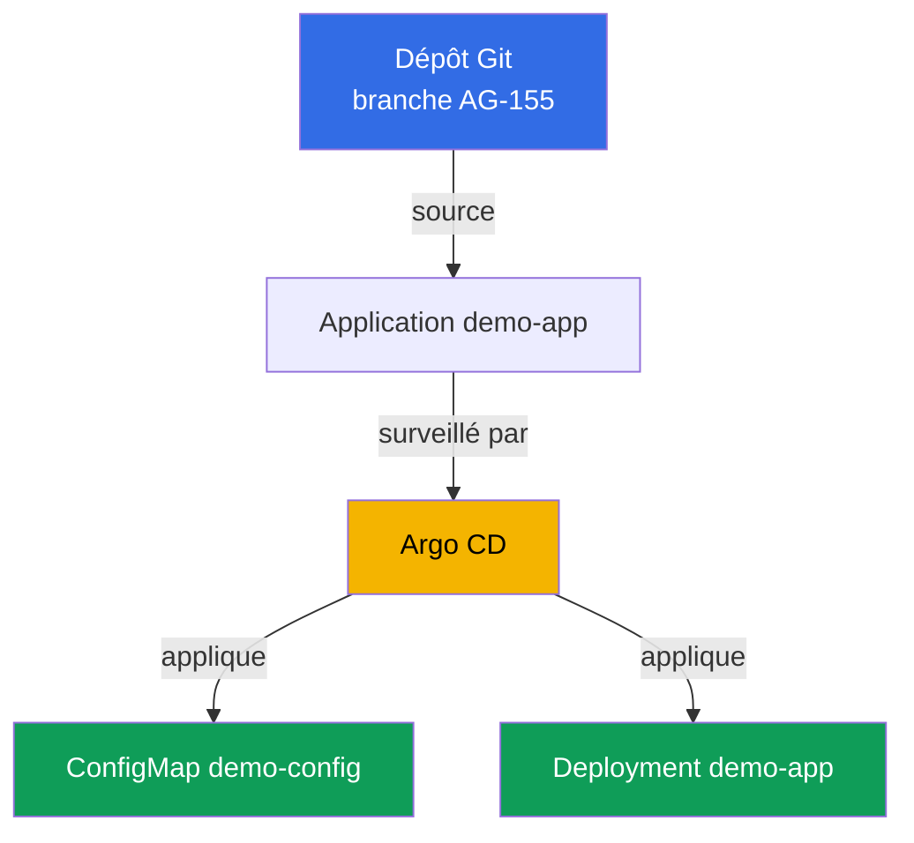
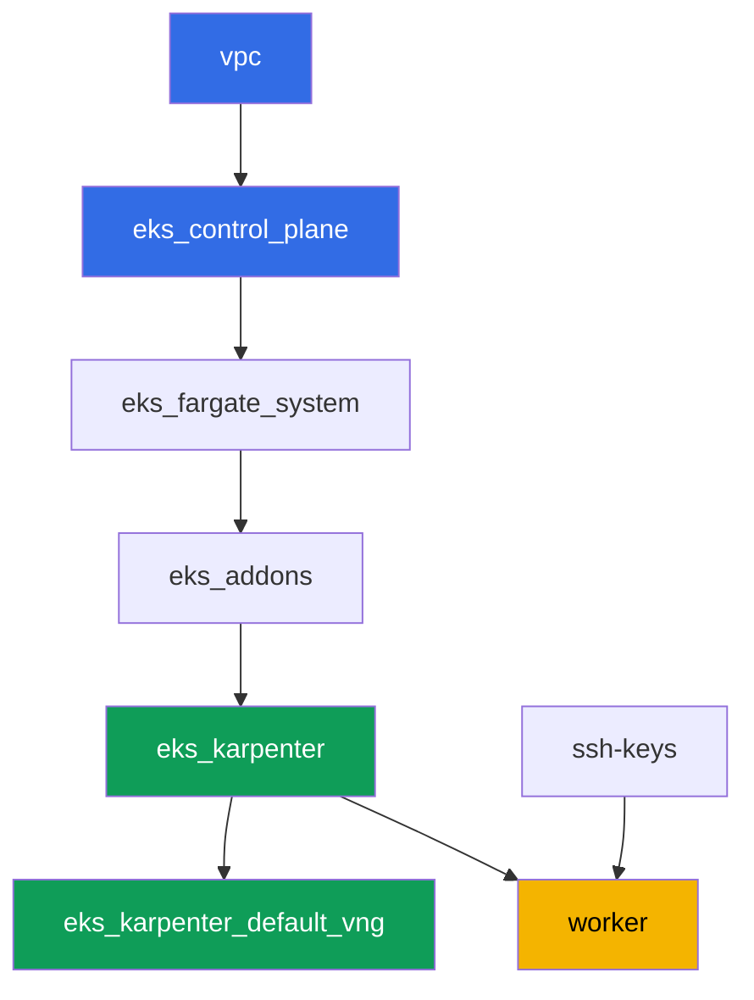

[Русская версия](README_RU.MD) · [Eng version](README.MD) · [Versión en español](README_ES.MD) · [Deutsche Version](README_DE.MD) · [ქართული ვერსია](README_GE.MD) · [繁體中文版](README_TW.MD) · [日本語版](README_JP.MD)

# Labo 118 - GitOps : Argo CD, drift et self-heal, sync waves

## Description

Dans ce labo, vous installez Argo CD dans un cluster déjà déployé et lui confiez le
contrôle d'une partie de la charge de travail via un objet `Application`. Au lieu d'un
`kubectl apply` manuel, Git devient la source de vérité : l'agent récupère lui-même les
manifestes, les applique et surveille l'état en direct. Vous verrez la différence entre
deux statuts indépendants de `Application` - sync (l'état en direct correspond-il à Git)
et health (la ressource est-elle réellement saine), vous reproduirez un drift en
modifiant manuellement le cluster et observerez comment self-heal l'annule, et vous
vérifierez aussi l'ordre d'application des objets via sync wave.

Les tâches sont écrites dans un style production : un énoncé court plus des critères
d'acceptation. La vérification est automatique, via la commande `check_result`.

## Objectif

Consolider la matière du chapitre du cours :

- [Chapitre 44. GitOps et livraison : Argo CD et Flux, gestion d'une flotte de
  clusters](../../course/44/ru.md) - Git comme source de vérité, sync et health, self-heal

## Ce que nous créons

Le cluster est déjà déployé en tant que code (control plane, Fargate pour les pods
système, Karpenter pour la charge de travail). Vous installez Argo CD et le configurez
sur des manifestes de démonstration qui se trouvent directement dans ce dépôt, dans le
répertoire `gitops-demo/` à côté de ce README.

| Objet | Ce que c'est | Pourquoi dans ce labo |
|--------|---------|-------------------|
| Namespace `argocd` | une section du cluster pour l'agent GitOps lui-même | Argo CD y est installé via Helm |
| Namespace `eks-118` | le namespace cible de la charge de travail du labo | Argo CD y déploie l'application de démonstration |
| Application `demo-app` | CRD `argoproj.io/v1alpha1`, relie Git et le cluster | source sur `gitops-demo/`, destination sur `eks-118`, `selfHeal`, `prune` |
| Deployment `demo-app` (2 réplicas) | l'application ping_pong issue de `gitops-demo/deployment.yaml` | montre que c'est Argo CD, pas l'étudiant, qui a appliqué l'objet depuis Git |
| ConfigMap `demo-config` | configuration issue de `gitops-demo/configmap.yaml` | montre plusieurs objets dans une seule `Application` et la sync wave `0` |
| Artefacts `drift.txt`, `prune.txt`, `health.txt` | instantanés d'état et explications | consignent le drift, le self-heal, les limites de prune et la différence sync/health |

Le flux GitOps résultant :



Les manifestes `gitops-demo/deployment.yaml` et `gitops-demo/configmap.yaml` ne sont pas
de l'infrastructure de cluster, mais de simples fichiers YAML de l'application de
démonstration, ciblés par `Application`. Terragrunt ne les touche pas : Argo CD les lit
directement depuis Git via HTTPS.

## Infrastructure

L'environnement est déployé sur AWS (`eu-central-1`) via Terragrunt. Chaque répertoire
de labo est un composant avec son propre `terragrunt.hcl`, qui référence un module
partagé dans `terraform/modules/` et déclare des dépendances via des blocs
`dependency`. Ce labo n'ajoute aucun nouveau module terraform : Argo CD est installé
manuellement via Helm depuis la machine de travail, et les permissions de la machine de
travail (`eks:*`, `ec2:Describe*`) sont déjà suffisantes, car Argo CD n'opère qu'à
l'intérieur du cluster via le RBAC Kubernetes, sans nouvelles permissions AWS IAM.

### Modules et dépendances

| Répertoire (composant) | Module (`terraform/modules/`) | Dépend de | Ce qu'il crée |
|---------------------|-------------------------------|------------|-------------|
| `vpc` | `vpc_v3` | - | VPC `10.10.0.0/16`, sous-réseaux publics et privés dans deux AZ, NAT |
| `ssh-keys` | `ssh-keys` | - | une paire de clés SSH pour la machine de travail et les nœuds |
| `eks_control_plane` | `eks_v2_control_plane` | `vpc` | control plane EKS `1.36`, OIDC, security groups |
| `eks_fargate_system` | `eks_v2_fargate` | `vpc`, `eks_control_plane` | profil Fargate pour `kube-system` et `karpenter` |
| `eks_addons` | `eks_v2_addons` | `eks_control_plane`, `eks_fargate_system` | add-ons coredns, kube-proxy, vpc-cni, pod-identity |
| `eks_karpenter` | `eks_v2_karpenter` | `vpc`, `eks_control_plane`, `eks_addons`, `eks_fargate_system` | contrôleur Karpenter, rôle IAM des nœuds |
| `eks_karpenter_default_vng` | `eks_v2_karpenter_vng` | `vpc`, `eks_control_plane`, `eks_karpenter` | NodePool `default` par défaut et EC2NodeClass sur AL2023 |
| `worker` | `eks_v2_work_pc` | `ssh-keys`, `vpc`, `eks_control_plane`, `eks_karpenter` | machine de travail avec kubectl, helm, tests et `check_result` |

Graphe de dépendances (ce qui est appliqué en premier est plus bas dans la flèche) :



L'ensemble des composants est le même que dans le labo 101 : pods système sur Fargate,
nœuds de travail levés par Karpenter. Argo CD n'est pas un composant terraform séparé,
mais un chart Helm que l'étudiant installe lui-même sur la machine de travail dans la
tâche 1, comme l'AWS Load Balancer Controller dans le labo 108.

### Où chaque chose est configurée

`env.hcl` (paramètres d'environnement partagés, lus par tous les composants) :

| Paramètre | Valeur dans le labo | Ce qu'il affecte |
|----------|-----------------|---------------|
| `region` | `eu-central-1` | région de toutes les ressources |
| `vpc_default_cidr`, `subnets` | `10.10.0.0/16`, sous-réseaux par AZ | plan d'adressage de la VPC et tags des sous-réseaux |
| `prefix` | `eks-task118` | préfixe des noms de ressources et des tags |
| `stack_name` | `eks118` | utilisé pour construire `env_name` - le nom du cluster |
| `k8_version` | `1.36.0` | version de kubectl sur la machine de travail |
| `instance_type_worker` | `t3.medium` | type d'instance de la machine de travail |
| `ssh_password_enable`, `access_cidrs` | `true`, `0.0.0.0/0` | accès SSH à la machine de travail |
| `root_volume` | `gp3`, `10` | disque racine de la machine de travail |

`inputs` dans le `terragrunt.hcl` de chaque composant (réglages spécifiques à ce
module) :

| Fichier | Réglages clés |
|------|--------------------|
| `eks_control_plane/terragrunt.hcl` | `eks.version = "1.36"`, sous-réseaux privés pour les nœuds |
| `eks_addons/terragrunt.hcl` | versions des add-ons pour 1.36 : kube-proxy, coredns, vpc-cni, pod-identity |
| `eks_karpenter_default_vng/terragrunt.hcl` | `requirements` du NodePool, `limits`, `disruption` |
| `worker/terragrunt.hcl` | `test_url` et `task_script_url` pour les fichiers du labo 118 |

## Déploiement

```bash
TASK=118 make run_eks_task
```

Le déploiement prend environ 15 à 20 minutes. Dans la sortie, trouvez la ligne avec la
connexion SSH à la machine de travail et connectez-vous. kubectl et helm y sont déjà
configurés.

Commandes utiles sur la machine de travail :

```bash
time_left       # temps restant de l'environnement
check_result    # vérifier la solution
```

> Sécurité de l'environnement. Dans `env.hcl`, `ssh_password_enable = true` et
> `access_cidrs = ["0.0.0.0/0"]` sont activés - pratique pour un environnement de
> formation, mais à ne pas faire en production. Selon les standards du cours (chapitres
> 0.2, 2, 19), l'accès aux machines de travail doit passer par AWS SSM Session Manager
> sans exposer de ports SSH publics, et `access_cidrs` doit être restreint à des adresses
> précises. Ici, le SSH public est laissé uniquement pour simplifier le déploiement.

## Tâches

---
|        **1**        | **Installation d'Argo CD via Helm**                            |
| :-----------------: | :---------------------------------------------------------- |
| Ce qu'il faut faire | Créez le namespace `argocd`. Installez Argo CD via Helm (dépôt `https://argoproj.github.io/argo-helm`, chart `argo-cd`) dans ce namespace avec la commande par défaut, sans surcharger `values`. Attendez que le Deployment `argocd-server` dans `argocd` devienne `Running` (au moins une réplica prête). |
| Critères d'acceptation | - le namespace `argocd` existe ;<br/>- le Deployment `argocd-server` dans `argocd` a au moins une réplica prête. |
---
|        **2**        | **Application : source, destination, self-heal, prune**      |
| :-----------------: | :---------------------------------------------------------- |
| Ce qu'il faut faire | Créez le namespace `eks-118`. Créez un objet `Application` (`apiVersion: argoproj.io/v1alpha1`) nommé `demo-app` dans le namespace `argocd` : `spec.source.repoURL = https://github.com/ViktorUJ/cks.git`, `spec.source.targetRevision = AG-155`, `spec.source.path = tasks/eks/labs/118/gitops-demo`, `spec.destination.server = https://kubernetes.default.svc`, `spec.destination.namespace = eks-118`, `spec.syncPolicy.automated.selfHeal = true`, `spec.syncPolicy.automated.prune = true`. Attendez que `.status.sync.status` devienne `Synced` et `.status.health.status` devienne `Healthy`. |
| Critères d'acceptation | - Application `demo-app` dans `argocd` avec le source/destination indiqués ;<br/>- `selfHeal` et `prune` activés (`true`) ;<br/>- `.status.sync.status = Synced`, `.status.health.status = Healthy`. |
---
|        **3**        | **Vérification que les manifestes ont bien été appliqués**                |
| :-----------------: | :---------------------------------------------------------- |
| Ce qu'il faut faire | Assurez-vous qu'Argo CD a bien appliqué les objets de `gitops-demo/` dans `eks-118` : Deployment `demo-app` (image `viktoruj/ping_pong`, `2` réplicas Ready) et ConfigMap `demo-config` avec une clé `greeting`. Vérifiez avec les commandes `kubectl get deployment demo-app -n eks-118` et `kubectl get configmap demo-config -n eks-118`. |
| Critères d'acceptation | - Deployment `demo-app` dans `eks-118`, image `viktoruj/ping_pong`, `2` réplicas prêtes ;<br/>- ConfigMap `demo-config` dans `eks-118` avec une clé `greeting` non vide. |
---
|        **4**        | **Reproduction du drift et du self-heal**                      |
| :-----------------: | :---------------------------------------------------------- |
| Ce qu'il faut faire | Détail important : avec `selfHeal` activé, le contrôleur annule le drift en quelques secondes, et il est pratiquement impossible d'observer `OutOfSync` à l'œil. C'est pourquoi le drift est montré en deux étapes. Désactivez d'abord uniquement l'auto-guérison : `selfHeal: false` (laissez `prune` à `true`). Puis modifiez l'état en direct en contournant Git - `kubectl scale deployment demo-app -n eks-118 --replicas=5` - et vérifiez que l'Application est passée en `OutOfSync` et y reste (sans self-heal, le drift n'est pas corrigé). Capturez ce moment. Ensuite remettez `selfHeal: true` et attendez que self-heal ramène les réplicas à `2` de lui-même, l'Application redevenant `Synced`. Capturez le second moment. Enregistrez les deux instantanés (`sync`/`health` et le `spec.replicas` final) dans le fichier `/var/work/tests/artifacts/4/drift.txt`. |
| Critères d'acceptation | - le fichier `drift.txt` contient à la fois `OutOfSync` et `Synced` ;<br/>- le Deployment `demo-app` finit par revenir à `2` réplicas (`spec.replicas`). |
---
|        **5**        | **Sync wave : l'ordre d'application des objets**                  |
| :-----------------: | :---------------------------------------------------------- |
| Ce qu'il faut faire | Les manifestes du labo portent déjà les annotations `argocd.argoproj.io/sync-wave` : `0` sur `gitops-demo/configmap.yaml`, `1` sur `gitops-demo/deployment.yaml` - le numéro le plus bas est appliqué en premier. Vérifiez les deux annotations via `kubectl get ... -o jsonpath='{.metadata.annotations.argocd\.argoproj\.io/sync-wave}'` et confirmez que l'Application reste `Synced` (les deux objets de vagues différentes sont synchronisés). |
| Critères d'acceptation | - ConfigMap `demo-config` a l'annotation `sync-wave: "0"` ;<br/>- Deployment `demo-app` a l'annotation `sync-wave: "1"` ;<br/>- `.status.sync.status = Synced`. |
---
|        **6**        | **Ce que prune supprime et ce qu'il ne supprime pas : propriété des ressources**         |
| :-----------------: | :---------------------------------------------------------- |
| Ce qu'il faut faire | Créez manuellement dans `eks-118` le ConfigMap `manual-extra`, qui n'existe pas dans `gitops-demo/` : `kubectl create configmap manual-extra -n eks-118 --from-literal=note=manual`. Forcez un refresh (`kubectl patch application demo-app -n argocd --type=merge -p '{"metadata":{"annotations":{"argocd.argoproj.io/refresh":"hard"}}}'`) et observez quelque chose d'inattendu : `prune=true` est activé, mais `manual-extra` **n'est pas supprimé**, et l'Application reste `Synced`. La raison : Argo CD ne possède que les objets marqués comme appartenant à l'application (dans la version 3.x, l'annotation `argocd.argoproj.io/tracking-id` - regardez-la sur `demo-config`) ; l'objet créé à la main lui est étranger (orphaned) et n'entre pas dans le périmètre de prune. Marquez-le maintenant comme appartenant à l'application : `kubectl annotate configmap manual-extra -n eks-118 'argocd.argoproj.io/tracking-id=demo-app:/ConfigMap:eks-118/manual-extra' --overwrite`, forcez de nouveau le refresh - maintenant l'objet est suivi, il n'est pas dans Git, et prune le supprime. Dans le fichier `/var/work/tests/artifacts/6/prune.txt`, notez les deux observations (non supprimé sans tracking, supprimé avec tracking) et expliquez avec des mots que prune ne retire que les ressources suivies absentes de Git, c'est pourquoi `demo-app` et `demo-config` restent en place. |
| Critères d'acceptation | - le fichier `prune.txt` n'est pas vide, mentionne `manual-extra` et le mot `prune` ;<br/>- le ConfigMap `manual-extra` dans `eks-118` finit absent ;<br/>- le ConfigMap `demo-config` et le Deployment `demo-app` restent en place. |
---
|        **7**        | **Diagnostic : sync status contre health status**           |
| :-----------------: | :---------------------------------------------------------- |
| Ce qu'il faut faire | Désactivez temporairement `syncPolicy.automated` sur l'`Application` (sinon self-heal annulera immédiatement l'étape suivante). Ajoutez au Deployment `demo-app` un `readinessProbe` délibérément cassé. Attention : l'image pédagogique `ping_pong` répond `200` sur n'importe quel chemin, donc une sonde sur une « URL inexistante » réussira sans problème - dirigez plutôt la sonde vers un **port fermé**, par exemple `httpGet` sur le port `9999`. Les nouveaux pods ne passeront alors plus le readiness. Vérifiez que `.status.health.status` devient `Progressing` (et, une fois `progressDeadlineSeconds` écoulé, le Deployment devient `Degraded`), tandis que `.status.sync.status` reste `Synced`. Observez pourquoi : `replicas` est décrit dans Git, donc son édition manuelle a donné `OutOfSync` (tâche 4), tandis que `readinessProbe` n'est pas dans le manifeste Git, et le champ ajouté ne compte pas dans l'écart. Expliquez dans le fichier `/var/work/tests/artifacts/7/health.txt` pourquoi `Synced` et `Degraded`/`Progressing` peuvent coexister : sync status compare l'état en direct à Git, health status est la disponibilité réelle de la ressource - ce sont deux axes indépendants. À la fin, remettez `syncPolicy.automated` (`selfHeal`, `prune`) et retirez la sonde **à la main** (`kubectl patch ... --type=json` avec une opération `remove`) : vérifiez vous-même que self-heal ne corrige pas cette casse, car pour Argo CD il n'y a pas d'écart avec Git (`Synced`) - les champs absents du manifeste restent sous la responsabilité de l'opérateur. |
| Critères d'acceptation | - le fichier `health.txt` n'est pas vide, contient les mots `sync`, `health`, `Synced` et `Degraded`/`Progressing` ;<br/>- explique explicitement que sync et health sont des statuts différents et indépendants. |
---

## Vérification du résultat

Sur la machine de travail, lancez la vérification automatique :

```bash
check_result
```

Le script exécutera les tests et affichera le pourcentage de tâches réalisées.

## Solution

Solution de référence : [worker/files/solutions/1_FR.MD](worker/files/solutions/1_FR.MD)

## Suppression du cluster et des ressources

> **Désactivez d'abord `selfHeal`, puis retirez les objets, sinon Argo CD les
> restaurera de lui-même.** Tant que l'Application `demo-app` est synchronisée avec
> `selfHeal: true`, supprimer le Deployment `demo-app` ou le ConfigMap `demo-config` à
> la main (ou en supprimant le namespace `eks-118`) sera annulé par le contrôleur en
> quelques secondes - exactement le comportement que vous avez pratiqué dans la tâche 4.
> Ce labo ne crée pas de ressources AWS, il n'y a donc aucun risque d'ENI orpheline ici,
> mais Argo CD a été installé manuellement via Helm, et `TASK=118 make delete_eks_task`
> n'en a pas connaissance.

```bash
# 1. Désactiver l'autosync de l'Application, sinon retirer les objets ci-dessous s'annulera seul
kubectl patch application demo-app -n argocd --type=merge \
  -p '{"spec":{"syncPolicy":{"automated":null}}}'

# 2. Retirer l'Application (dès lors, Argo CD ne surveille plus demo-app ni demo-config)
kubectl delete application demo-app -n argocd --ignore-not-found

# 3. Retirer Argo CD lui-même et les deux charges de travail du labo
helm uninstall argocd -n argocd
kubectl delete namespace argocd eks-118 --ignore-not-found

# 4. Attendre que Karpenter retire le NodeClaim et le nœud EC2 (seuls les fargate-* doivent rester)
while kubectl get nodeclaims --no-headers 2>/dev/null | grep -q .; do
  echo "NodeClaim encore présent, on attend..."; sleep 15
done
kubectl get nodes | grep -v fargate
```

Ce n'est qu'après cela qu'il faut détruire l'environnement :

```bash
TASK=118 make delete_eks_task
```

Si `destroy` reste bloqué sur le security group des nœuds, c'est qu'une ENI orpheline
subsiste. Trouvez-la et supprimez-la :

```bash
aws ec2 describe-network-interfaces --filters Name=status,Values=available \
  --query 'NetworkInterfaces[?Tags[?Key==`eks:eni:owner`]].[NetworkInterfaceId,Description]' \
  --output table
aws ec2 delete-network-interface --network-interface-id <eni-id>
```
