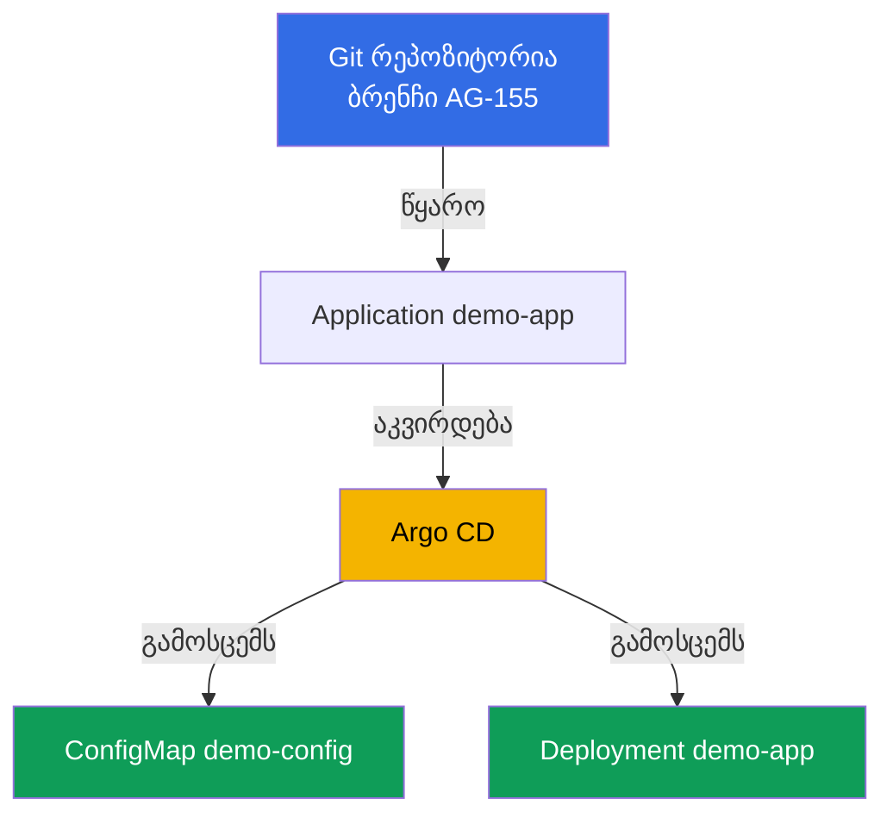
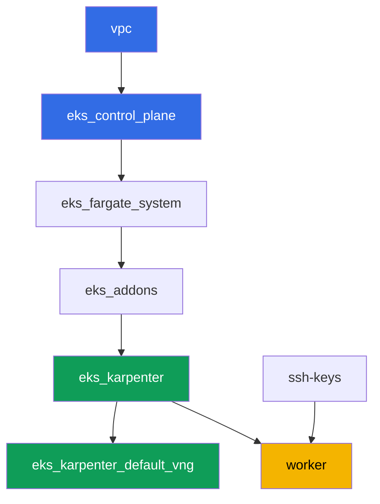

[Русская версия](README_RU.MD) · [Eng version](README.MD) · [Versión en español](README_ES.MD) · [Version française](README_FR.MD) · [Deutsche Version](README_DE.MD) · [繁體中文版](README_TW.MD) · [日本語版](README_JP.MD)

# ლაბა 118 - GitOps: Argo CD, drift და self-heal, sync waves

## აღწერა

ამ ლაბაში აყენებ Argo CD-ს უკვე დაშენებულ კლასტერში და გადასცემ მას ნაწილი
დატვირთვის მართვას `Application` ობიექტის მეშვეობით. ხელით `kubectl apply`-ის
ნაცვლად, Git ხდება ჭეშმარიტების წყარო: აგენტი თავად წამოიღებს მანიფესტებს,
გამოსცემს მათ და აკვირდება ცოცხალ მდგომარეობას. დაინახავ განსხვავებას ორ
დამოუკიდებელ `Application`-ის სტატუსს შორის - sync (ემთხვევა თუ არა ცოცხალი
მდგომარეობა Git-ს) და health (ჯანმრთელია თუ არა რესურსი რეალურად), აღადგენ
drift-ს კლასტერში ხელით რედაქტირებით და დააკვირდები, როგორ აბრუნებს self-heal
მას უკან, ასევე გადავამოწმებ ობიექტების გამოცემის რიგითობას sync wave-ის
საშუალებით.

დავალებები დაწერილია production სტილში: მოკლე დავალება პლუს მიღების
კრიტერიუმები. შემოწმება ავტომატურია, `check_result` ბრძანებით.

## მიზანი

კურსის თავის მასალის გამოწერა:

- [თავი 44. GitOps და მიწოდება: Argo CD და Flux, კლასტერების ფლოტის
  მართვა](../../course/44/ru.md) - Git როგორც ჭეშმარიტების წყარო, sync და
  health, self-heal

## რას ვქმნით

კლასტერი უკვე დაშენებულია როგორც კოდი (control plane, Fargate სისტემური
პოდებისთვის, Karpenter დატვირთვისთვის). აყენებ Argo CD-ს და აკონფიგურირებ მას
დემო-მანიფესტებზე, რომლებიც პირდაპირ ამ რეპოზიტორიაშია, `gitops-demo/`
დირექტორიაში, ამ README-ს გვერდით.

| ობიექტი | რა არის | რატომ არის ამ ლაბაში |
|--------|---------|-------------------|
| Namespace `argocd` | კლასტერის სექცია თვითონ GitOps-აგენტისთვის | Argo CD დგება აქ Helm-ის მეშვეობით |
| Namespace `eks-118` | ლაბის დატვირთვის სამიზნე namespace | აქ Argo CD ავრცელებს დემო-აპლიკაციას |
| Application `demo-app` | CRD `argoproj.io/v1alpha1`, აკავშირებს Git-ს და კლასტერს | source `gitops-demo/`-ზე, destination `eks-118`-ზე, `selfHeal`, `prune` |
| Deployment `demo-app` (2 რეპლიკა) | ping_pong აპლიკაცია `gitops-demo/deployment.yaml`-იდან | ჩვენებს, რომ Argo CD-მ, არა სტუდენტმა, გამოსცა ობიექტი Git-იდან |
| ConfigMap `demo-config` | კონფიგურაცია `gitops-demo/configmap.yaml`-იდან | ჩვენებს რამდენიმე ობიექტს ერთ `Application`-ში და sync wave `0` |
| არტეფაქტები `drift.txt`, `prune.txt`, `health.txt` | სტატუსების ანაბეჭდები და განმარტებები | აღწერენ drift-ს, self-heal-ს, prune-ის ფარგლებს და sync/health-ის განსხვავებას |

GitOps-ის საბოლოო ნაკადი:



მანიფესტები `gitops-demo/deployment.yaml` და `gitops-demo/configmap.yaml` არ
წარმოადგენს კლასტერის ინფრასტრუქტურას, უბრალო YAML-ფაილებია დემო-აპლიკაციისთვის,
რომელზეც კონფიგურირდება `Application`. Terragrunt არ ეხება მათ: Argo CD კითხავს
მათ პირდაპირ Git-იდან HTTPS-ის მეშვეობით.

## ინფრასტრუქტურა

გარემო დაშენებულია AWS-ში (`eu-central-1`) Terragrunt-ის მეშვეობით. ლაბის
ყოველი დირექტორია არის ერთი კომპონენტი საკუთარი `terragrunt.hcl`-ით, რომელიც
მიუთითებს საერთო მოდულზე `terraform/modules/`-ში და აცხადებს დამოკიდებულებებს
`dependency` ბლოკებით. ეს ლაბა არ ამატებს ახალ terraform-მოდულებს: Argo CD
დგება ხელით Helm-ის მეშვეობით worker-მანქანიდან, და worker-მანქანის უფლებები
(`eks:*`, `ec2:Describe*`) უკვე საკმარისია, რადგან Argo CD მუშაობს მხოლოდ
კლასტერის შიგნით Kubernetes RBAC-ის მეშვეობით, ახალი AWS IAM უფლებების გარეშე.

### მოდულები და დამოკიდებულებები

| დირექტორია (კომპონენტი) | მოდული (`terraform/modules/`) | დამოკიდებული | რას ქმნის |
|---------------------|-------------------------------|------------|-------------|
| `vpc` | `vpc_v3` | - | VPC `10.10.0.0/16`, საჯარო და პრივატული ქვექსელები ორ AZ-ში, NAT |
| `ssh-keys` | `ssh-keys` | - | SSH-გასაღებების წყვილი worker-მანქანისა და ნოდებისთვის |
| `eks_control_plane` | `eks_v2_control_plane` | `vpc` | EKS control plane `1.36`, OIDC, security groups |
| `eks_fargate_system` | `eks_v2_fargate` | `vpc`, `eks_control_plane` | Fargate-პროფილი `kube-system`-ისთვის და `karpenter`-ისთვის |
| `eks_addons` | `eks_v2_addons` | `eks_control_plane`, `eks_fargate_system` | დანამატები coredns, kube-proxy, vpc-cni, pod-identity |
| `eks_karpenter` | `eks_v2_karpenter` | `vpc`, `eks_control_plane`, `eks_addons`, `eks_fargate_system` | Karpenter-კონტროლერი, ნოდების IAM-როლი |
| `eks_karpenter_default_vng` | `eks_v2_karpenter_vng` | `vpc`, `eks_control_plane`, `eks_karpenter` | ნაგულისხმევი NodePool `default` და EC2NodeClass AL2023-ზე |
| `worker` | `eks_v2_work_pc` | `ssh-keys`, `vpc`, `eks_control_plane`, `eks_karpenter` | worker-მანქანა kubectl-ით, helm-ით, ტესტებით და `check_result`-ით |

დამოკიდებულებების გრაფი (რაც უფრო ადრე გამოიცემა, ის ისრის ბოლოშია):



კომპონენტების ნაკრები ისეთივეა, როგორც ლაბაში 101: სისტემური პოდები Fargate-ზე,
worker-ნოდებს ამწევს Karpenter. Argo CD არ არის ცალკე terraform-კომპონენტი, ეს
Helm-ჩარტია, რომელსაც სტუდენტი თავად აყენებს worker-მანქანაზე დავალება 1-ში,
როგორც AWS Load Balancer Controller ლაბაში 108.

### სად რა კონფიგურირდება

`env.hcl` (გარემოს საერთო პარამეტრები, კითხავს ყველა კომპონენტი):

| პარამეტრი | მნიშვნელობა ლაბაში | რაზე მოქმედებს |
|----------|-----------------|---------------|
| `region` | `eu-central-1` | ყველა რესურსის რეგიონი |
| `vpc_default_cidr`, `subnets` | `10.10.0.0/16`, ქვექსელები AZ-ის მიხედვით | VPC-ის მისამართების გეგმა და ქვექსელების ტეგები |
| `prefix` | `eks-task118` | რესურსების სახელების და ტეგების პრეფიქსი |
| `stack_name` | `eks118` | მისგან იქმნება `env_name` - კლასტერის სახელი |
| `k8_version` | `1.36.0` | kubectl-ის ვერსია worker-მანქანაზე |
| `instance_type_worker` | `t3.medium` | worker-მანქანის instance-ტიპი |
| `ssh_password_enable`, `access_cidrs` | `true`, `0.0.0.0/0` | SSH-წვდომა worker-მანქანასთან |
| `root_volume` | `gp3`, `10` | worker-მანქანის root-დისკი |

`inputs` თითოეული კომპონენტის `terragrunt.hcl`-ში (კონკრეტული მოდულის
პარამეტრები):

| ფაილი | ძირითადი პარამეტრები |
|------|--------------------|
| `eks_control_plane/terragrunt.hcl` | `eks.version = "1.36"`, პრივატული ქვექსელები ნოდებისთვის |
| `eks_addons/terragrunt.hcl` | დანამატების ვერსიები 1.36-ისთვის: kube-proxy, coredns, vpc-cni, pod-identity |
| `eks_karpenter_default_vng/terragrunt.hcl` | NodePool-ის `requirements`, `limits`, `disruption` |
| `worker/terragrunt.hcl` | `test_url` და `task_script_url` ლაბა 118-ის ფაილებისთვის |

## გაშენება

```bash
TASK=118 make run_eks_task
```

გაშენება წარმოადგენს დაახლოებით 15-20 წუთს. გამოსავალში ნახე სტრიქონი
worker-მანქანასთან SSH-კავშირით და დაუკავშირდი მას. kubectl და helm უკვე
კონფიგურირებულია იქ.

სასარგებლო ბრძანებები worker-მანქანაზე:

```bash
time_left       # რამდენი დრო დარჩა გარემოს
check_result    # გადამოწმება გადაწყვეტისა
```

> გარემოს უსაფრთხოება. `env.hcl`-ში ჩართულია `ssh_password_enable = true` და
> `access_cidrs = ["0.0.0.0/0"]` - მოხერხებულია სასწავლო გარემოსთვის, მაგრამ
> ასე არ უნდა გაკეთდეს production-ში. კურსის სტანდარტების მიხედვით (თავები
> 0.2, 2, 19), წვდომა worker-მანქანებთან უნდა გავიდეს AWS SSM Session
> Manager-ის მეშვეობით, საჯარო SSH-პორტების გარეშე, ხოლო `access_cidrs`
> უნდა შემცირდეს კონკრეტულ მისამართებზე. აქ საჯარო SSH დარჩენილია მხოლოდ
> გაშენების გასამარტივებლად.

## დავალებები

---
|        **1**        | **Argo CD-ის დაყენება Helm-ის მეშვეობით**                            |
| :-----------------: | :---------------------------------------------------------- |
| რას ვაკეთებთ          | შექმენი namespace `argocd`. დააყენე Argo CD Helm-ის მეშვეობით (რეპოზიტორია `https://argoproj.github.io/argo-helm`, ჩარტი `argo-cd`) ამ namespace-ში ნაგულისხმევი ბრძანებით, `values`-ის გადაფარვის გარეშე. დაელოდე, სანამ Deployment `argocd-server` `argocd`-ში გახდება `Running` (მინიმუმ ერთი მზა რეპლიკა). |
| მიღების კრიტერიუმები    | - namespace `argocd` არსებობს;<br/>- Deployment `argocd-server` `argocd`-ში ჰყავს მინიმუმ ერთი მზა რეპლიკა. |
---
|        **2**        | **Application: source, destination, self-heal, prune**      |
| :-----------------: | :---------------------------------------------------------- |
| რას ვაკეთებთ          | შექმენი namespace `eks-118`. შექმენი `Application` ობიექტი (`apiVersion: argoproj.io/v1alpha1`) სახელით `demo-app` namespace `argocd`-ში: `spec.source.repoURL = https://github.com/ViktorUJ/cks.git`, `spec.source.targetRevision = AG-155`, `spec.source.path = tasks/eks/labs/118/gitops-demo`, `spec.destination.server = https://kubernetes.default.svc`, `spec.destination.namespace = eks-118`, `spec.syncPolicy.automated.selfHeal = true`, `spec.syncPolicy.automated.prune = true`. დაელოდე, სანამ `.status.sync.status` გახდება `Synced` და `.status.health.status` გახდება `Healthy`. |
| მიღების კრიტერიუმები    | - Application `demo-app` `argocd`-ში მითითებული source/destination-ით;<br/>- `selfHeal` და `prune` ჩართული (`true`);<br/>- `.status.sync.status = Synced`, `.status.health.status = Healthy`. |
---
|        **3**        | **მანიფესტების ნამდვილად გამოცემის შემოწმება**                |
| :-----------------: | :---------------------------------------------------------- |
| რას ვაკეთებთ          | დარწმუნდი, რომ Argo CD-მ ნამდვილად გამოსცა ობიექტები `gitops-demo/`-იდან `eks-118`-ში: Deployment `demo-app` (image `viktoruj/ping_pong`, `2` რეპლიკა Ready) და ConfigMap `demo-config` `greeting` გასაღებით. გადაამოწმე ბრძანებებით `kubectl get deployment demo-app -n eks-118` და `kubectl get configmap demo-config -n eks-118`. |
| მიღების კრიტერიუმები    | - Deployment `demo-app` `eks-118`-ში, image `viktoruj/ping_pong`, `2` მზა რეპლიკა;<br/>- ConfigMap `demo-config` `eks-118`-ში არა-ცარიელი `greeting` გასაღებით. |
---
|        **4**        | **Drift-ის და self-heal-ის აღდგენა**                      |
| :-----------------: | :---------------------------------------------------------- |
| რას ვაკეთებთ          | მნიშვნელოვანი დეტალი: ჩართული `selfHeal`-ის შემთხვევაში კონტროლერი აბრუნებს drift-ს წამებში, და `OutOfSync`-ის თვალით დანახვა პრაქტიკულად შეუძლებელია. ამიტომ drift ჩვენდება ორ ეტაპში. თავდაპირველად გამორთე მხოლოდ self-healing: `selfHeal: false` (`prune` დატოვე `true`-ზე). შემდეგ შეცვალე ცოცხალი მდგომარეობა Git-ის გავლის გარეშე - `kubectl scale deployment demo-app -n eks-118 --replicas=5` - და დარწმუნდი, რომ Application გადავიდა `OutOfSync`-ში და ისე დარჩა (self-heal-ის გარეშე drift არ განიკურნება). დააფიქსირე ეს მომენტი. შემდეგ დააბრუნე `selfHeal: true` და დაელოდე, სანამ self-heal თავად აბრუნებს რეპლიკებს `2`-ზე, და Application ისევ გახდება `Synced`. დააფიქსირე მეორე მომენტი. ორივე ანაბეჭდი (`sync`/`health` და საბოლოო `spec.replicas`) შეინახე ფაილში `/var/work/tests/artifacts/4/drift.txt`. |
| მიღების კრიტერიუმები    | - ფაილი `drift.txt` შეიცავს ორივეს, `OutOfSync`-ს და `Synced`-ს;<br/>- Deployment `demo-app` საბოლოოდ ისევ `2` რეპლიკაზეა (`spec.replicas`). |
---
|        **5**        | **Sync wave: ობიექტების გამოცემის რიგითობა**                  |
| :-----------------: | :---------------------------------------------------------- |
| რას ვაკეთებთ          | ლაბის მანიფესტებზე უკვე დაცემულია ანოტაციები `argocd.argoproj.io/sync-wave`: `0` `gitops-demo/configmap.yaml`-ზე, `1` `gitops-demo/deployment.yaml`-ზე - პატარა ნომერი გამოიცემა უფრო ადრე. გადაამოწმე ორივე ანოტაცია ბრძანებით `kubectl get ... -o jsonpath='{.metadata.annotations.argocd\.argoproj\.io/sync-wave}'` და დარწმუნდი, რომ Application ისევ `Synced`-ია (ორივე ობიექტი სხვადასხვა ტალღიდან სინქრონიზებულია). |
| მიღების კრიტერიუმები    | - ConfigMap `demo-config`-ს ჰყავს ანოტაცია `sync-wave: "0"`;<br/>- Deployment `demo-app`-ს ჰყავს ანოტაცია `sync-wave: "1"`;<br/>- `.status.sync.status = Synced`. |
---
|        **6**        | **რას შლის prune და რას არა: რესურსის მფლობელობა**         |
| :-----------------: | :---------------------------------------------------------- |
| რას ვაკეთებთ          | შექმენი ხელით `eks-118`-ში ConfigMap `manual-extra`, რომელიც არ არსებობს `gitops-demo/`-ში: `kubectl create configmap manual-extra -n eks-118 --from-literal=note=manual`. აიძულე refresh (`kubectl patch application demo-app -n argocd --type=merge -p '{"metadata":{"annotations":{"argocd.argoproj.io/refresh":"hard"}}}'`) და დააკვირდი მოულოდნელს: `prune=true` ჩართულია, მაგრამ `manual-extra` **არ იშლება**, ხოლო Application რჩება `Synced`-ად. მიზეზი: Argo CD მართავს მხოლოდ ობიექტებს, რომლებიც მონიშნულია აპლიკაციის კუთვნილებად (ვერსია 3.x-ში - ანოტაცია `argocd.argoproj.io/tracking-id`, ნახე ის `demo-config`-ზე); ხელით შექმნილი ობიექტი მისთვის უცხოა (orphaned) და prune-ის ფარგლებში არ ხდება. ახლა მონიშნე ის, როგორც აპლიკაციის კუთვნილი: `kubectl annotate configmap manual-extra -n eks-118 'argocd.argoproj.io/tracking-id=demo-app:/ConfigMap:eks-118/manual-extra' --overwrite`, ისევ აიძულე refresh - ახლა ობიექტი ტრეკირდება, Git-ში ის არ არსებობს, და prune შლის მას. ფაილში `/var/work/tests/artifacts/6/prune.txt` ჩაწერე ორივე დაკვირვება (არ წაშლილი tracking-ის გარეშე, წაშლილი tracking-ით) და სიტყვებით ახსენი, რომ prune შლის მხოლოდ ტრეკირებულ რესურსებს, რომლებიც არ არსებობს Git-ში, ამიტომ `demo-app` და `demo-config` თავიანთ ადგილზე რჩება. |
| მიღების კრიტერიუმები    | - ფაილი `prune.txt` არ არის ცარიელი, ახსენებს `manual-extra`-ს და სიტყვას `prune`;<br/>- ConfigMap `manual-extra` `eks-118`-ში საბოლოოდ არ არსებობს;<br/>- ConfigMap `demo-config` და Deployment `demo-app` თავიანთ ადგილზე რჩება. |
---
|        **7**        | **დიაგნოსტიკა: sync status health status-ის წინააღმდეგ**           |
| :-----------------: | :---------------------------------------------------------- |
| რას ვაკეთებთ          | დროებით გამორთე `syncPolicy.automated` `Application`-ზე (თუ არა, self-heal მაშინვე დააბრუნებს შემდეგ ნაბიჯს). დაუმატე Deployment `demo-app`-ს განზრახ გაუმართავი `readinessProbe`. ყურადღება: სასწავლო image `ping_pong` პასუხობს `200`-ს ნებისმიერ path-ზე, ამიტომ პრობი "არარსებულ URL"-ზე წარმატებით გავლის - მიმართე პრობი **დახურულ პორტს**, მაგალითად, `httpGet` პორტ `9999`-ზე. მაშინ ახალი პოდები readiness-ს ვერ გაივლიან. დარწმუნდი, რომ `.status.health.status` გახდა `Progressing` (და `progressDeadlineSeconds`-ის ამოწურვის შემდეგ Deployment გახდება `Degraded`), ხოლო `.status.sync.status` რჩება `Synced`-ად. დააკვირდი, რატომ: `replicas` აღწერილია Git-ში, ამიტომ მისი ხელით რედაქტირება `OutOfSync`-ს გვაძლევდა (დავალება 4), ხოლო `readinessProbe` Git-მანიფესტში არ არსებობს, და დამატებული ველი განსხვავებაში არ ხდება. ახსენი ფაილში `/var/work/tests/artifacts/7/health.txt`, რატომ არის `Synced` და `Degraded`/`Progressing` ერთდროულად შესაძლებელი: sync status ადარებს ცოცხალ მდგომარეობას Git-ს, health status არის რესურსის ნამდვილი მზაობა - ესენი ორი დამოუკიდებელი ღერძია. ბოლოს დააბრუნე `syncPolicy.automated` (`selfHeal`, `prune`) და ამოღე პრობი **ხელით** (`kubectl patch ... --type=json` `remove` ოპერაციით): თავად გადამოწმე, რომ self-heal ამ ავარიას არ განკურნავს, რადგან Argo CD-სთვის Git-თან განსხვავება არ არსებობს (`Synced`) - ველები, რომლებიც არ არსებობს მანიფესტში, ოპერატორის პასუხისმგებლობად რჩება. |
| მიღების კრიტერიუმები    | - ფაილი `health.txt` არ არის ცარიელი, შეიცავს სიტყვებს `sync`, `health`, `Synced` და `Degraded`/`Progressing`;<br/>- ცალსახად ხსნის, რომ sync და health სხვადასხვა, დამოუკიდებელი სტატუსია. |
---

## შედეგის შემოწმება

worker-მანქანაზე გაუშვი ავტომატური შემოწმება:

```bash
check_result
```

სკრიპტი გაუშვებს ტესტებს და გამოაჩენს დასრულებული დავალებების პროცენტს.

## გადაწყვეტა

ეტალონური გადაწყვეტა: [worker/files/solutions/1_GE.MD](worker/files/solutions/1_GE.MD)

## კლასტერისა და რესურსების წაშლა

> **პირველად გამორთე `selfHeal`, შემდეგ მოაშორე ობიექტები, თუ არა Argo CD
> თავად აღადგენს მათ.** სანამ Application `demo-app` სინქრონიზებულია
> `selfHeal: true`-ით, Deployment `demo-app`-ის ან ConfigMap `demo-config`-ის
> ხელით წაშლა (ან namespace `eks-118`-ის წაშლით) კონტროლერი წამებში
> დააბრუნებს - ზუსტად ეს ქცევა ივარჯიშე დავალება 4-ში. ეს ლაბა AWS-რესურსებს
> არ ქმნის, ამიტომ ოსირებული ENI-ის რისკი აქ არ არსებობს, მაგრამ Argo CD
> დაყენებული იქნა ხელით Helm-ის მეშვეობით, და `TASK=118 make
> delete_eks_task`-ს მასზე არაფერი იცის.

```bash
# 1. გამორთე Application-ის autosync, თუ არა ქვემოთ ობიექტების მოშორება თავად დაბრუნდება
kubectl patch application demo-app -n argocd --type=merge \
  -p '{"spec":{"syncPolicy":{"automated":null}}}'

# 2. მოაშორე Application (ამის შემდეგ Argo CD უკვე არ აკვირდება demo-app-სა და demo-config-ს)
kubectl delete application demo-app -n argocd --ignore-not-found

# 3. მოაშორე თვითონ Argo CD და ლაბის ორივე დატვირთვა
helm uninstall argocd -n argocd
kubectl delete namespace argocd eks-118 --ignore-not-found

# 4. დაელოდე, სანამ Karpenter მოაშორებს NodeClaim-ს და EC2-ნოდს (უნდა დარჩეს მხოლოდ fargate-*)
while kubectl get nodeclaims --no-headers 2>/dev/null | grep -q .; do
  echo "NodeClaim ჯერ ცოცხალია, ველოდებით..."; sleep 15
done
kubectl get nodes | grep -v fargate
```

მხოლოდ ამის შემდეგ დაანგრიე გარემო:

```bash
TASK=118 make delete_eks_task
```

თუ `destroy` ჩერდება ნოდების security group-ზე, ეს ნიშნავს, რომ დარჩენილია
ოსირებული ENI. მოიძიე და წაშალე ის:

```bash
aws ec2 describe-network-interfaces --filters Name=status,Values=available \
  --query 'NetworkInterfaces[?Tags[?Key==`eks:eni:owner`]].[NetworkInterfaceId,Description]' \
  --output table
aws ec2 delete-network-interface --network-interface-id <eni-id>
```
