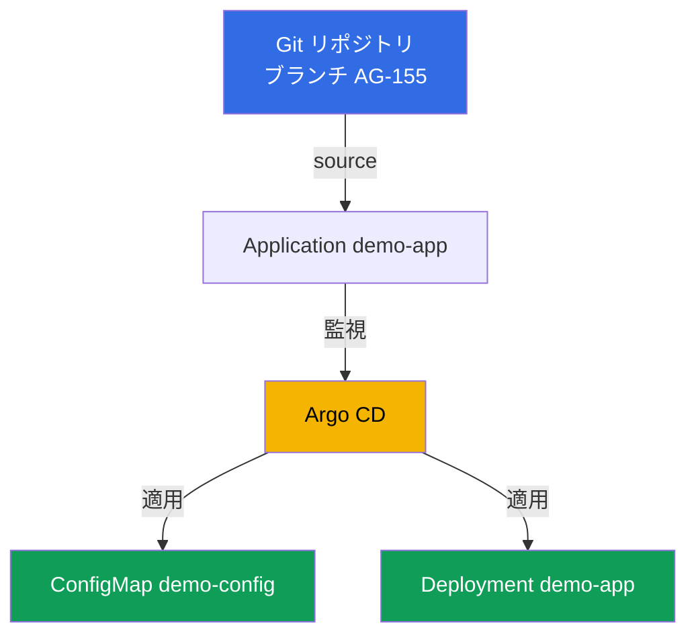
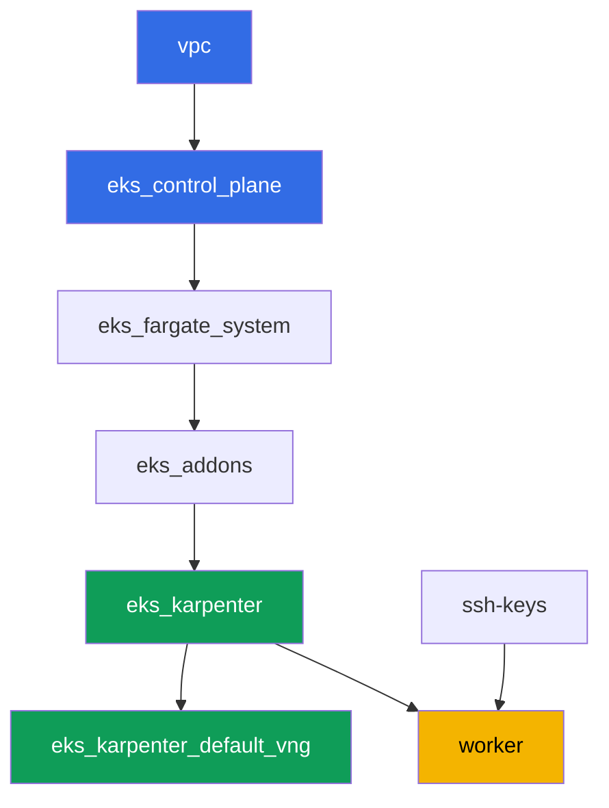

[Русская версия](README_RU.MD) · [Eng version](README.MD) · [Versión en español](README_ES.MD) · [Version française](README_FR.MD) · [Deutsche Version](README_DE.MD) · [ქართული ვერსია](README_GE.MD) · [繁體中文版](README_TW.MD)

# Lab 118 - GitOps: Argo CD、drift と self-heal、sync waves

## 概要

この lab では、すでにデプロイされたクラスターに Argo CD をインストールし、
`Application` オブジェクトを通じてワークロードの一部の管理をそれに委ねます。
手動の `kubectl apply` の代わりに、Git が信頼できる唯一の情報源になります。
エージェントが自分でマニフェストを取得し、適用し、実際の状態を監視します。
`Application` の二つの独立したステータス - sync（実際の状態が Git と一致し
ているか）と health（リソースが実際に健全かどうか）の違いを確認し、クラスター
を手動で編集して drift を再現し、self-heal がそれをロールバックする様子を
観察します。また、sync wave を使ってオブジェクトが適用される順序も確認します。

タスクは production スタイルで書かれています。短い説明と受け入れ基準です。
チェックは `check_result` コマンドで自動的に行われます。

## 目標

コースの章の内容を定着させます:

- [第 44 章。GitOps とデリバリー: Argo CD と Flux、クラスター群の
  管理](../../course/44/jp.md) - 信頼できる情報源としての Git、sync と
  health、self-heal

## 何を作るか

クラスターはすでにコードとしてデプロイ済みです（control plane、システム pod
用の Fargate、ワークロード用の Karpenter）。あなたは Argo CD をインストール
し、この README の隣にある `gitops-demo/` ディレクトリ内、まさにこの
リポジトリに置かれているデモ用マニフェストを対象に設定します。

| オブジェクト | これは何か | この lab で必要な理由 |
|--------|---------|-------------------|
| Namespace `argocd` | GitOps エージェント自体のためのクラスターの区画 | ここに Helm で Argo CD がインストールされる |
| Namespace `eks-118` | この lab のワークロードの対象 namespace | Argo CD がここにデモアプリケーションを展開する |
| Application `demo-app` | CRD `argoproj.io/v1alpha1`、Git とクラスターを結びつける | source は `gitops-demo/`、destination は `eks-118`、`selfHeal`、`prune` |
| Deployment `demo-app`（2 レプリカ） | `gitops-demo/deployment.yaml` の ping_pong アプリケーション | 学生ではなく Argo CD が Git からオブジェクトを適用したことを示す |
| ConfigMap `demo-config` | `gitops-demo/configmap.yaml` の設定 | 一つの `Application` に複数のオブジェクトがあることと sync wave `0` を示す |
| アーティファクト `drift.txt`、`prune.txt`、`health.txt` | ステータスのスナップショットと説明 | drift、self-heal、prune の境界、sync/health の違いを記録する |

最終的な GitOps のフロー:



マニフェスト `gitops-demo/deployment.yaml` と `gitops-demo/configmap.yaml`
はクラスターのインフラではなく、`Application` が指し示す先にある、デモ
アプリケーションの普通の YAML ファイルです。Terragrunt はこれらに手を
触れません。Argo CD が HTTPS 経由で Git から直接読み込みます。

## インフラ

環境は Terragrunt を通じて AWS（`eu-central-1`）にデプロイされます。各 lab
のディレクトリは、独自の `terragrunt.hcl` を持つ一つのコンポーネントで、
`terraform/modules/` の共有モジュールを参照し、`dependency` ブロックで
依存関係を宣言します。この lab では新しい terraform モジュールは追加され
ません。Argo CD は worker マシンから Helm で手動インストールされ、worker
マシンの権限（`eks:*`、`ec2:Describe*`）はすでに十分です。というのも、
Argo CD はクラスター内部で Kubernetes RBAC を通じて動作するだけで、新しい
AWS IAM 権限は必要ないからです。

### モジュールと依存関係

| ディレクトリ（コンポーネント） | モジュール（`terraform/modules/`） | 依存先 | 作成するもの |
|---------------------|-------------------------------|------------|-------------|
| `vpc` | `vpc_v3` | - | VPC `10.10.0.0/16`、二つの AZ にあるパブリックとプライベートサブネット、NAT |
| `ssh-keys` | `ssh-keys` | - | worker マシンとノード用の SSH キーペア |
| `eks_control_plane` | `eks_v2_control_plane` | `vpc` | EKS control plane `1.36`、OIDC、security groups |
| `eks_fargate_system` | `eks_v2_fargate` | `vpc`, `eks_control_plane` | `kube-system` と `karpenter` 用の Fargate プロファイル |
| `eks_addons` | `eks_v2_addons` | `eks_control_plane`, `eks_fargate_system` | coredns、kube-proxy、vpc-cni、pod-identity アドオン |
| `eks_karpenter` | `eks_v2_karpenter` | `vpc`, `eks_control_plane`, `eks_addons`, `eks_fargate_system` | Karpenter コントローラー、ノードの IAM ロール |
| `eks_karpenter_default_vng` | `eks_v2_karpenter_vng` | `vpc`, `eks_control_plane`, `eks_karpenter` | デフォルトの NodePool `default` と AL2023 上の EC2NodeClass |
| `worker` | `eks_v2_work_pc` | `ssh-keys`, `vpc`, `eks_control_plane`, `eks_karpenter` | kubectl、helm、テスト、`check_result` を持つ worker マシン |

依存関係グラフ（先に適用されるものほど矢印の下側にある）:



コンポーネントの構成は lab 101 と同じです。システム pod は Fargate 上に、
worker ノードは Karpenter によって立ち上げられます。Argo CD は独立した
terraform コンポーネントではなく、Helm チャートであり、学生が task 1 で
worker マシン上に自分でインストールします。lab 108 の AWS Load Balancer
Controller と同じような形です。

### どこで何が設定されているか

`env.hcl`（すべてのコンポーネントが読み込む共有の環境パラメータ）:

| パラメータ | lab での値 | 何に影響するか |
|----------|-----------------|---------------|
| `region` | `eu-central-1` | すべてのリソースのリージョン |
| `vpc_default_cidr`, `subnets` | `10.10.0.0/16`、AZ ごとのサブネット | VPC のアドレス計画とサブネットのタグ |
| `prefix` | `eks-task118` | リソース名とタグのプレフィックス |
| `stack_name` | `eks118` | これから `env_name` - クラスター名が組み立てられる |
| `k8_version` | `1.36.0` | worker マシン上の kubectl のバージョン |
| `instance_type_worker` | `t3.medium` | worker マシンのインスタンスタイプ |
| `ssh_password_enable`, `access_cidrs` | `true`, `0.0.0.0/0` | worker マシンへの SSH アクセス |
| `root_volume` | `gp3`, `10` | worker マシンのルートディスク |

各コンポーネントの `terragrunt.hcl` の `inputs`（そのモジュール固有の設定）:

| ファイル | 主な設定 |
|------|--------------------|
| `eks_control_plane/terragrunt.hcl` | `eks.version = "1.36"`、ノード用のプライベートサブネット |
| `eks_addons/terragrunt.hcl` | 1.36 用のアドオンバージョン: kube-proxy、coredns、vpc-cni、pod-identity |
| `eks_karpenter_default_vng/terragrunt.hcl` | NodePool の `requirements`、`limits`、`disruption` |
| `worker/terragrunt.hcl` | lab 118 のファイル用の `test_url` と `task_script_url` |

## デプロイ

```bash
TASK=118 make run_eks_task
```

デプロイにはおよそ 15-20 分かかります。出力の中から worker マシンへの SSH
接続の行を見つけて接続してください。kubectl と helm はそこですでに設定
済みです。

worker マシン上で使える便利なコマンド:

```bash
time_left       # 環境の残り時間
check_result    # 解答を確認する
```

> 環境のセキュリティについて。`env.hcl` では `ssh_password_enable = true`
> と `access_cidrs = ["0.0.0.0/0"]` が有効になっています。学習用環境として
> は便利ですが、本番環境ではこうしてはいけません。コースの標準（第 0.2、2、
> 19 章）によれば、worker マシンへのアクセスは公開 SSH ポートを晒さずに
> AWS SSM Session Manager 経由で行い、`access_cidrs` は特定のアドレスに
> 絞るべきです。ここでは設定を簡単にするためだけに公開 SSH を残しています。

## タスク

---
|        **1**        | **Helm による Argo CD のインストール**                            |
| :-----------------: | :---------------------------------------------------------- |
| やること          | namespace `argocd` を作成してください。この namespace に、リポジトリ `https://argoproj.github.io/argo-helm`、チャート `argo-cd` を使い、`values` を上書きせずデフォルトのコマンドで Argo CD を Helm でインストールしてください。`argocd` の Deployment `argocd-server` が `Running`（少なくとも 1 つの準備完了レプリカ）になるまで待ってください。 |
| 受け入れ基準    | - namespace `argocd` が存在する;<br/>- `argocd` の Deployment `argocd-server` が少なくとも 1 つの準備完了レプリカを持つ。 |
---
|        **2**        | **Application: source、destination、self-heal、prune**      |
| :-----------------: | :---------------------------------------------------------- |
| やること          | namespace `eks-118` を作成してください。namespace `argocd` に `demo-app` という名前の `Application` オブジェクト（`apiVersion: argoproj.io/v1alpha1`）を作成してください: `spec.source.repoURL = https://github.com/ViktorUJ/cks.git`、`spec.source.targetRevision = AG-155`、`spec.source.path = tasks/eks/labs/118/gitops-demo`、`spec.destination.server = https://kubernetes.default.svc`、`spec.destination.namespace = eks-118`、`spec.syncPolicy.automated.selfHeal = true`、`spec.syncPolicy.automated.prune = true`。`.status.sync.status` が `Synced` に、`.status.health.status` が `Healthy` になるまで待ってください。 |
| 受け入れ基準    | - `argocd` に指定した source/destination を持つ Application `demo-app` が存在する;<br/>- `selfHeal` と `prune` が有効（`true`）になっている;<br/>- `.status.sync.status = Synced`、`.status.health.status = Healthy`。 |
---
|        **3**        | **マニフェストが実際に適用されたことの確認**                |
| :-----------------: | :---------------------------------------------------------- |
| やること          | Argo CD が `gitops-demo/` のオブジェクトを実際に `eks-118` に適用したことを確認してください: Deployment `demo-app`（image `viktoruj/ping_pong`、`2` レプリカ Ready）と、キー `greeting` を持つ ConfigMap `demo-config` です。`kubectl get deployment demo-app -n eks-118` と `kubectl get configmap demo-config -n eks-118` コマンドで確認してください。 |
| 受け入れ基準    | - `eks-118` の Deployment `demo-app`、image `viktoruj/ping_pong`、`2` 個の準備完了レプリカ;<br/>- `eks-118` の ConfigMap `demo-config` に空でない `greeting` キーがある。 |
---
|        **4**        | **drift と self-heal の再現**                      |
| :-----------------: | :---------------------------------------------------------- |
| やること          | 重要な点: `selfHeal` が有効な状態では、コントローラーが数秒で drift をロールバックしてしまうため、`OutOfSync` を目で捉えることは実質的に不可能です。そのため drift は二段階で示します。まず自己修復だけを無効にします: `selfHeal: false`（`prune` は `true` のままにしてください）。次に Git を経由せずに実際の状態を変更します - `kubectl scale deployment demo-app -n eks-118 --replicas=5` - そして Application が `OutOfSync` になり、そのままそこに留まることを確認してください（self-heal がなければ drift は修復されません）。この瞬間を記録してください。それから `selfHeal: true` に戻し、self-heal が自分でレプリカを `2` に戻し、Application が再び `Synced` になるまで待ってください。二回目の瞬間を記録してください。両方のスナップショット（`sync`/`health` と最終的な `spec.replicas`）をファイル `/var/work/tests/artifacts/4/drift.txt` に保存してください。 |
| 受け入れ基準    | - ファイル `drift.txt` に `OutOfSync` と `Synced` の両方が含まれている;<br/>- Deployment `demo-app` が最終的に再び `2` レプリカに戻っている（`spec.replicas`）。 |
---
|        **5**        | **Sync wave: オブジェクトが適用される順序**                  |
| :-----------------: | :---------------------------------------------------------- |
| やること          | lab のマニフェストにはすでに `argocd.argoproj.io/sync-wave` アノテーションが付けられています: `gitops-demo/configmap.yaml` には `0`、`gitops-demo/deployment.yaml` には `1` - 小さい番号のほうが先に適用されます。両方のアノテーションを `kubectl get ... -o jsonpath='{.metadata.annotations.argocd\.argoproj\.io/sync-wave}'` で確認し、それでも Application が `Synced` のままであること（異なる wave の両方のオブジェクトが同期されていること）を確かめてください。 |
| 受け入れ基準    | - ConfigMap `demo-config` にアノテーション `sync-wave: "0"` がある;<br/>- Deployment `demo-app` にアノテーション `sync-wave: "1"` がある;<br/>- `.status.sync.status = Synced`。 |
---
|        **6**        | **prune が削除するものとしないもの: リソースの所有権**         |
| :-----------------: | :---------------------------------------------------------- |
| やること          | `eks-118` に、`gitops-demo/` には存在しない ConfigMap `manual-extra` を手動で作成してください: `kubectl create configmap manual-extra -n eks-118 --from-literal=note=manual`。強制的にリフレッシュを行い（`kubectl patch application demo-app -n argocd --type=merge -p '{"metadata":{"annotations":{"argocd.argoproj.io/refresh":"hard"}}}'`）、予想外のことを観察してください: `prune=true` が有効なのに、`manual-extra` は **削除されず**、Application は `Synced` のままです。理由は、Argo CD がアプリケーションに属していると印付けられたオブジェクトだけを所有しているからです（3.x では `argocd.argoproj.io/tracking-id` アノテーションです。`demo-config` でこれを確認してください）。手動で作成したオブジェクトはそれに対して無関係（orphaned）であり、prune の対象範囲に入りません。今度はそれをアプリケーションに属するものとして印付けてください: `kubectl annotate configmap manual-extra -n eks-118 'argocd.argoproj.io/tracking-id=demo-app:/ConfigMap:eks-118/manual-extra' --overwrite`、再度リフレッシュを強制してください - これでこのオブジェクトは追跡されるようになり、Git には存在しないので、prune がそれを削除します。ファイル `/var/work/tests/artifacts/6/prune.txt` に両方の観察結果（tracking なしでは削除されない、tracking ありでは削除される）を記録し、prune は Git に存在しない追跡対象のリソースだけを取り除くこと、そのため `demo-app` と `demo-config` はそのまま残ることを言葉で説明してください。 |
| 受け入れ基準    | - ファイル `prune.txt` が空でなく、`manual-extra` と `prune` という単語に言及している;<br/>- `eks-118` の ConfigMap `manual-extra` が最終的に存在しない;<br/>- ConfigMap `demo-config` と Deployment `demo-app` はそのまま残っている。 |
---
|        **7**        | **診断: sync status と health status**           |
| :-----------------: | :---------------------------------------------------------- |
| やること          | `Application` の `syncPolicy.automated` を一時的に無効にしてください（そうしないと self-heal がすぐに次のステップをロールバックしてしまいます）。Deployment `demo-app` に、意図的に壊れた `readinessProbe` を追加してください。注意: 学習用イメージ `ping_pong` はどんなパスにも `200` を返すため、「存在しない URL」への probe は問題なく通過してしまい、症状が出ません - 代わりに probe を**閉じたポート**、たとえば port `9999` への `httpGet` に向けてください。すると新しい pod は readiness を通過しなくなります。`.status.health.status` が `Progressing` になり（`progressDeadlineSeconds` が過ぎると Deployment は `Degraded` になります）、その間 `.status.sync.status` は `Synced` のままであることを確認してください。なぜそうなるかに注意してください: `replicas` は Git に記述されているため、その手動変更は `OutOfSync`（task 4）になりましたが、`readinessProbe` は Git のマニフェストにはなく、追加されたフィールドは差分にはカウントされません。ファイル `/var/work/tests/artifacts/7/health.txt` に、なぜ `Synced` と `Degraded`/`Progressing` が同時に起こり得るのかを説明してください: sync status は実際の状態と Git を比較し、health status はリソースの実際の準備状況です - これは二つの独立した軸です。最後に `syncPolicy.automated`（`selfHeal`、`prune`）を元に戻し、probe を**手動で**取り除いてください（`remove` 操作を伴う `kubectl patch ... --type=json`）。self-heal がこの故障を修復しないことを自分で確認してください。Argo CD にとって Git との差分がない（`Synced`）ため、修復すべきものがないのです。マニフェストにないフィールドは運用者の責任のままです。 |
| 受け入れ基準    | - ファイル `health.txt` が空でなく、`sync`、`health`、`Synced`、`Degraded`/`Progressing` という単語を含んでいる;<br/>- sync と health が異なる、独立したステータスであることを明確に説明している。 |
---

## 結果の確認

worker マシン上で自動チェックを実行してください:

```bash
check_result
```

スクリプトがテストを実行し、完了したタスクの割合を表示します。

## 解答

参考解答: [worker/files/solutions/1_JP.MD](worker/files/solutions/1_JP.MD)

## クラスターとリソースの削除

> **まず `selfHeal` を無効にしてから、オブジェクトを取り除いてください。
> そうしないと Argo CD が自分でそれらを復元してしまいます。** Application
> `demo-app` が `selfHeal: true` で同期している間は、Deployment `demo-app`
> や ConfigMap `demo-config` を手動で削除しても（あるいは namespace
> `eks-118` を削除しても）、コントローラーが数秒でロールバックします -
> これはまさに task 4 で練習した挙動です。この lab は AWS リソースを作成
> しないため、孤立した ENI のリスクはここにはありませんが、Argo CD は
> Helm で手動インストールされたため、`TASK=118 make delete_eks_task` は
> それについて何も知りません。

```bash
# 1. Application の autosync を無効にする。そうしないと以下のオブジェクトの削除が自動的にロールバックしてしまう
kubectl patch application demo-app -n argocd --type=merge \
  -p '{"spec":{"syncPolicy":{"automated":null}}}'

# 2. Application を削除する（これ以降 Argo CD は demo-app と demo-config を監視しない）
kubectl delete application demo-app -n argocd --ignore-not-found

# 3. Argo CD 自体とこの lab の両方のワークロードを削除する
helm uninstall argocd -n argocd
kubectl delete namespace argocd eks-118 --ignore-not-found

# 4. Karpenter が NodeClaim と EC2 ノードを削除するまで待つ（fargate-* だけが残るはず）
while kubectl get nodeclaims --no-headers 2>/dev/null | grep -q .; do
  echo "NodeClaim はまだ生きています、待機中..."; sleep 15
done
kubectl get nodes | grep -v fargate
```

これが終わってからだけ、環境を破棄してください:

```bash
TASK=118 make delete_eks_task
```

`destroy` がノードの security group で止まる場合、孤立した ENI が残って
いるということです。それを見つけて削除してください:

```bash
aws ec2 describe-network-interfaces --filters Name=status,Values=available \
  --query 'NetworkInterfaces[?Tags[?Key==`eks:eni:owner`]].[NetworkInterfaceId,Description]' \
  --output table
aws ec2 delete-network-interface --network-interface-id <eni-id>
```
