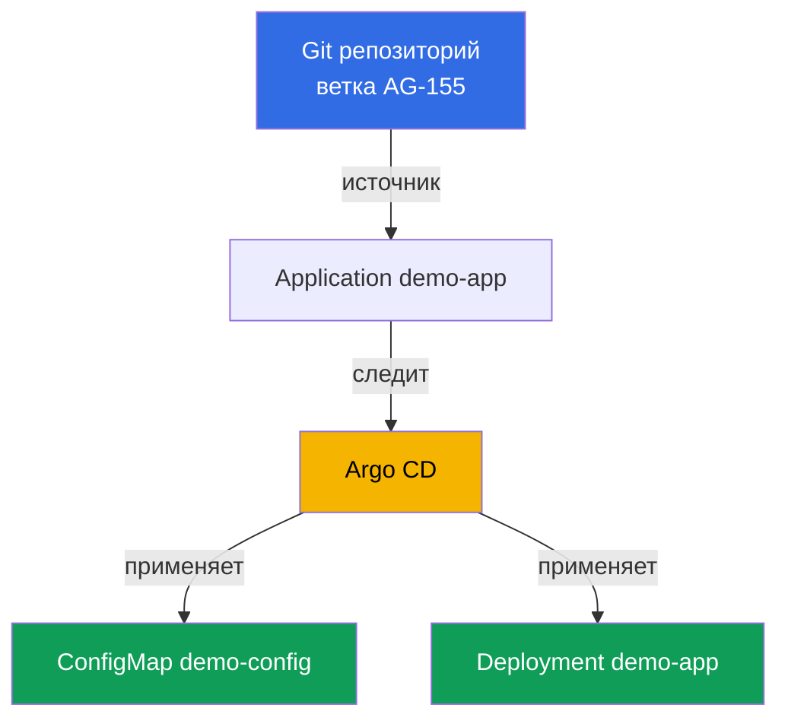
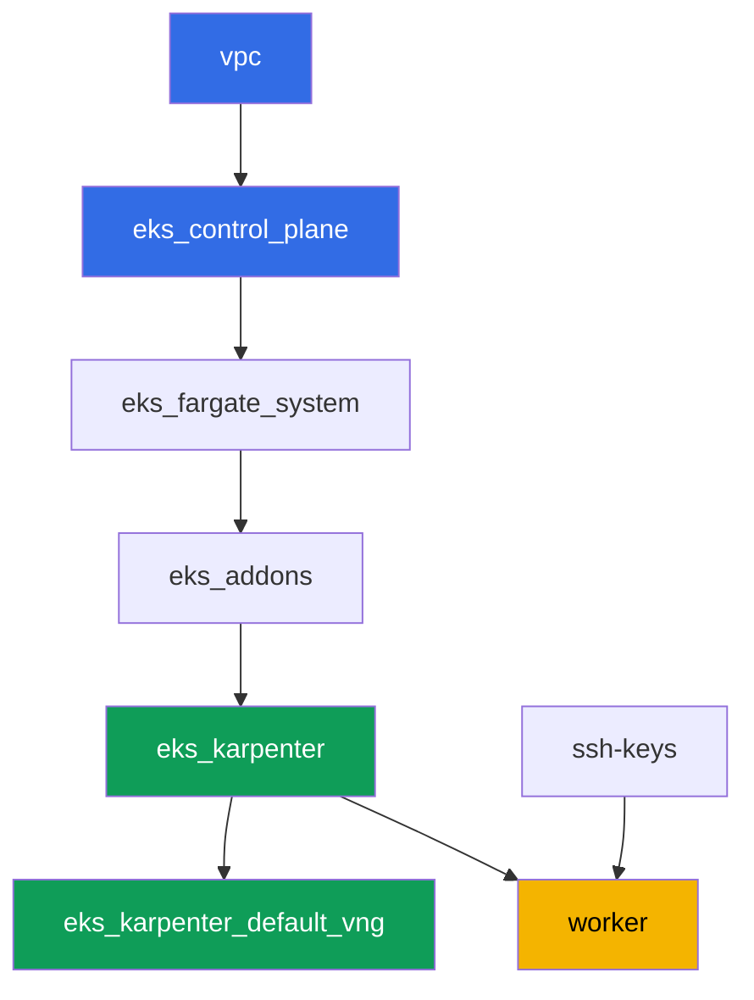

# Лаба 118 - GitOps: Argo CD, drift и self-heal, sync waves

## Описание

В этой лабе вы ставите Argo CD в уже развёрнутый кластер и передаёте ему управление
частью нагрузки через объект `Application`. Вместо ручного `kubectl apply` источником
истины становится Git: агент сам подтягивает манифесты, применяет их и следит за живым
состоянием. Вы увидите разницу между двумя независимыми статусами `Application` - sync
(совпадает ли живое состояние с Git) и health (реально ли ресурс здоров), воспроизведёте
дрейф ручной правкой в кластере и наблюдёте, как self-heal откатывает её обратно, а
также проверите порядок применения объектов через sync wave.

Задания в продакшн-стиле: короткая постановка плюс критерии приёмки. Проверка -
автоматическая, командой `check_result`.

## Цель

Закрепить материал главы курса:

- [Глава 44. GitOps и доставка: Argo CD и Flux, управление парком
  кластеров](../../course/44/ru.md) - Git как источник истины, sync и health, self-heal

## Что мы создаём

Кластер уже развёрнут как код (control plane, Fargate под системные поды, Karpenter под
нагрузку). Вы ставите Argo CD и настраиваете его на демонстрационные манифесты, которые
лежат прямо в этом репозитории, в директории `gitops-demo/` рядом с этим README.

| Объект | Что это | Зачем в этой лабе |
|--------|---------|-------------------|
| Namespace `argocd` | раздел кластера под сам GitOps-агент | Argo CD ставится сюда через Helm |
| Namespace `eks-118` | целевой namespace нагрузки лабы | сюда Argo CD раскатывает демо-приложение |
| Application `demo-app` | CRD `argoproj.io/v1alpha1`, связывает Git и кластер | source на `gitops-demo/`, destination на `eks-118`, `selfHeal`, `prune` |
| Deployment `demo-app` (2 реплики) | приложение ping_pong из `gitops-demo/deployment.yaml` | видим, что Argo CD, а не студент, применил объект из Git |
| ConfigMap `demo-config` | конфиг из `gitops-demo/configmap.yaml` | показывает несколько объектов в одном `Application` и sync wave `0` |
| Артефакты `drift.txt`, `prune.txt`, `health.txt` | снимки статусов и объяснения | фиксируем дрейф, self-heal, границы prune и разницу sync/health |

Итоговая картина потока GitOps:



Манифесты `gitops-demo/deployment.yaml` и `gitops-demo/configmap.yaml` - это не
инфраструктура кластера, а обычные YAML-файлы демо-приложения, на которые настраивается
`Application`. Terragrunt их не трогает: они читаются Argo CD прямо из Git по HTTPS.

## Инфраструктура

Окружение разворачивается в AWS (`eu-central-1`) через Terragrunt. Каждый каталог лабы -
это один компонент со своим `terragrunt.hcl`, который ссылается на общий модуль в
`terraform/modules/` и объявляет зависимости через блоки `dependency`. Новых terraform-
модулей эта лаба не добавляет: Argo CD ставится вручную через Helm с рабочей машины,
права рабочей машины (`eks:*`, `ec2:Describe*`) уже достаточны, потому что Argo CD
работает только внутри кластера через Kubernetes RBAC, без новых AWS IAM прав.

### Модули и зависимости

| Каталог (компонент) | Модуль (`terraform/modules/`) | Зависит от | Что создаёт |
|---------------------|-------------------------------|------------|-------------|
| `vpc` | `vpc_v3` | - | VPC `10.10.0.0/16`, публичные и приватные подсети в двух AZ, NAT |
| `ssh-keys` | `ssh-keys` | - | пара SSH-ключей для рабочей машины и нод |
| `eks_control_plane` | `eks_v2_control_plane` | `vpc` | control plane EKS `1.36`, OIDC, security groups |
| `eks_fargate_system` | `eks_v2_fargate` | `vpc`, `eks_control_plane` | Fargate-профиль для `kube-system` и `karpenter` |
| `eks_addons` | `eks_v2_addons` | `eks_control_plane`, `eks_fargate_system` | аддоны coredns, kube-proxy, vpc-cni, pod-identity |
| `eks_karpenter` | `eks_v2_karpenter` | `vpc`, `eks_control_plane`, `eks_addons`, `eks_fargate_system` | контроллер Karpenter, IAM-роль нод |
| `eks_karpenter_default_vng` | `eks_v2_karpenter_vng` | `vpc`, `eks_control_plane`, `eks_karpenter` | дефолтный NodePool `default` и EC2NodeClass на AL2023 |
| `worker` | `eks_v2_work_pc` | `ssh-keys`, `vpc`, `eks_control_plane`, `eks_karpenter` | рабочая машина с kubectl, helm, тестами и `check_result` |

Граф зависимостей (что применяется раньше, то ниже по стрелке):



Набор компонентов такой же, как в лабе 101: системные поды на Fargate, рабочие ноды
поднимает Karpenter. Argo CD - это не отдельный terraform-компонент, а Helm-чарт, который
студент ставит сам на рабочей машине в задании 1, как AWS Load Balancer Controller в
лабе 108.

### Где что настраивается

`env.hcl` (общие параметры окружения, читаются всеми компонентами):

| Параметр | Значение в лабе | На что влияет |
|----------|-----------------|---------------|
| `region` | `eu-central-1` | регион всех ресурсов |
| `vpc_default_cidr`, `subnets` | `10.10.0.0/16`, подсети по AZ | адресный план VPC и теги подсетей |
| `prefix` | `eks-task118` | префикс имён ресурсов и тегов |
| `stack_name` | `eks118` | из него собирается `env_name` - имя кластера |
| `k8_version` | `1.36.0` | версия kubectl на рабочей машине |
| `instance_type_worker` | `t3.medium` | тип инстанса рабочей машины |
| `ssh_password_enable`, `access_cidrs` | `true`, `0.0.0.0/0` | доступ по SSH к рабочей машине |
| `root_volume` | `gp3`, `10` | корневой диск рабочей машины |

`inputs` в `terragrunt.hcl` каждого компонента (параметры конкретного модуля):

| Файл | Ключевые настройки |
|------|--------------------|
| `eks_control_plane/terragrunt.hcl` | `eks.version = "1.36"`, приватные подсети под ноды |
| `eks_addons/terragrunt.hcl` | версии аддонов под 1.36: kube-proxy, coredns, vpc-cni, pod-identity |
| `eks_karpenter_default_vng/terragrunt.hcl` | `requirements` NodePool, `limits`, `disruption` |
| `worker/terragrunt.hcl` | `test_url` и `task_script_url` на файлы лабы 118 |

## Развёртывание

```bash
TASK=118 make run_eks_task
```

Развёртывание занимает примерно 15-20 минут. В выводе найдите строку с SSH-подключением к
рабочей машине и подключитесь к ней. kubectl и helm там уже настроены.

Полезные команды на рабочей машине:

```bash
time_left       # сколько осталось времени окружения
check_result    # проверить решение
```

> Безопасность стенда. В `env.hcl` включены `ssh_password_enable = true` и
> `access_cidrs = ["0.0.0.0/0"]` - это удобно для учебного окружения, но так делать в
> продакшене нельзя. По стандартам курса (главы 0.2, 2, 19) доступ к рабочим машинам
> открывают через AWS SSM Session Manager без публичных SSH-портов наружу, а `access_cidrs`
> сужают до конкретных адресов. Здесь публичный SSH оставлен только ради простоты запуска.

## Задания

---
|        **1**        | **Установка Argo CD через Helm**                            |
| :-----------------: | :---------------------------------------------------------- |
| Что делаем          | Создайте namespace `argocd`. Поставьте Argo CD через Helm (репозиторий `https://argoproj.github.io/argo-helm`, чарт `argo-cd`) в этот namespace командой по умолчанию, без переопределения `values`. Дождитесь, пока Deployment `argocd-server` в `argocd` станет `Running` (хотя бы одна готовая реплика). |
| Критерии приёмки    | - namespace `argocd` существует;<br/>- Deployment `argocd-server` в `argocd` имеет хотя бы одну готовую реплику. |
---
|        **2**        | **Application: source, destination, self-heal, prune**      |
| :-----------------: | :---------------------------------------------------------- |
| Что делаем          | Создайте namespace `eks-118`. Создайте объект `Application` (`apiVersion: argoproj.io/v1alpha1`) с именем `demo-app` в namespace `argocd`: `spec.source.repoURL = https://github.com/ViktorUJ/cks.git`, `spec.source.targetRevision = AG-155`, `spec.source.path = tasks/eks/labs/118/gitops-demo`, `spec.destination.server = https://kubernetes.default.svc`, `spec.destination.namespace = eks-118`, `spec.syncPolicy.automated.selfHeal = true`, `spec.syncPolicy.automated.prune = true`. Дождитесь, пока `.status.sync.status` станет `Synced` и `.status.health.status` станет `Healthy`. |
| Критерии приёмки    | - Application `demo-app` в `argocd` с указанными source/destination;<br/>- `selfHeal` и `prune` включены (`true`);<br/>- `.status.sync.status = Synced`, `.status.health.status = Healthy`. |
---
|        **3**        | **Проверка реального применения манифестов**                |
| :-----------------: | :---------------------------------------------------------- |
| Что делаем          | Убедитесь, что Argo CD реально применил объекты из `gitops-demo/` в `eks-118`: Deployment `demo-app` (образ `viktoruj/ping_pong`, `2` реплики Ready) и ConfigMap `demo-config` с ключом `greeting`. Проверьте командами `kubectl get deployment demo-app -n eks-118` и `kubectl get configmap demo-config -n eks-118`. |
| Критерии приёмки    | - Deployment `demo-app` в `eks-118`, образ `viktoruj/ping_pong`, `2` готовые реплики;<br/>- ConfigMap `demo-config` в `eks-118` с непустым ключом `greeting`. |
---
|        **4**        | **Воспроизведение дрейфа и self-heal**                      |
| :-----------------: | :---------------------------------------------------------- |
| Что делаем          | Вручную поменяйте живое состояние в обход Git: выполните `kubectl scale deployment demo-app -n eks-118 --replicas=5`. Дождитесь, пока Application перейдёт в `OutOfSync` (дрейф зафиксирован), а затем self-heal автоматически откатит изменение обратно к `2` репликам и Application снова станет `Synced`. Сохраните оба момента (снимок `sync`/`health` сразу после правки и снимок после возврата к `2` репликам) в файл `/var/work/tests/artifacts/4/drift.txt`. |
| Критерии приёмки    | - файл `drift.txt` содержит и `OutOfSync`, и `Synced`;<br/>- Deployment `demo-app` в итоге снова имеет `2` реплики (`spec.replicas`). |
---
|        **5**        | **Sync wave: порядок применения объектов**                  |
| :-----------------: | :---------------------------------------------------------- |
| Что делаем          | В манифестах лабы уже расставлены аннотации `argocd.argoproj.io/sync-wave`: `0` у `gitops-demo/configmap.yaml`, `1` у `gitops-demo/deployment.yaml` - меньший номер применяется раньше. Проверьте обе аннотации через `kubectl get ... -o jsonpath='{.metadata.annotations.argocd\.argoproj\.io/sync-wave}'` и убедитесь, что при этом Application всё равно `Synced` (оба объекта из разных волн синхронизированы). |
| Критерии приёмки    | - ConfigMap `demo-config` имеет аннотацию `sync-wave: "0"`;<br/>- Deployment `demo-app` имеет аннотацию `sync-wave: "1"`;<br/>- `.status.sync.status = Synced`. |
---
|        **6**        | **Демонстрация prune: лишний ресурс, которого нет в Git**   |
| :-----------------: | :---------------------------------------------------------- |
| Что делаем          | Создайте в `eks-118` руками ConfigMap `manual-extra`, которого нет в `gitops-demo/` (`kubectl create configmap manual-extra -n eks-118 --from-literal=note=manual`). Так как `prune=true` уже включён в задании 2, при следующей синхронизации Argo CD увидит объект, которого нет в Git, и удалит его сам. Дождитесь, пока `manual-extra` пропадёт (по умолчанию auto-sync опрашивает Git раз в несколько минут, при необходимости ускорьте через `argocd app sync demo-app` или `kubectl patch application demo-app -n argocd --type=merge -p '{"metadata":{"annotations":{"argocd.argoproj.io/refresh":"hard"}}}'`). Зафиксируйте в файле `/var/work/tests/artifacts/6/prune.txt` снимок до удаления (ConfigMap существует) и факт, что после синхронизации `manual-extra` больше нет, и объясните словами, что `prune` убирает из кластера только то, что реально отсутствует в Git, а не всё подряд - демо-объекты `demo-app` и `demo-config` при этом не трогает, потому что они в Git есть. |
| Критерии приёмки    | - файл `prune.txt` не пуст, упоминает `manual-extra` и слово `prune`;<br/>- ConfigMap `manual-extra` в `eks-118` в итоге отсутствует;<br/>- ConfigMap `demo-config` и Deployment `demo-app` остаются на месте. |
---
|        **7**        | **Диагностика: sync status против health status**           |
| :-----------------: | :---------------------------------------------------------- |
| Что делаем          | Временно отключите `syncPolicy.automated` у `Application` (иначе self-heal сразу откатит следующий шаг). Добавьте Deployment `demo-app` заведомо неработающий `readinessProbe` (запрос на несуществующий путь, например `/does-not-exist-drift-probe`), чтобы поды перестали быть готовы. Убедитесь, что `.status.health.status` стал `Degraded` или `Progressing`, при этом объясните в файле `/var/work/tests/artifacts/7/health.txt`, почему это возможно одновременно с `Synced`: sync status сравнивает живое состояние с Git, health status - это реальная готовность ресурса, это две независимые оси. В конце верните `syncPolicy.automated` (`selfHeal`, `prune`) обратно, чтобы self-heal откатил поломку. |
| Критерии приёмки    | - файл `health.txt` не пуст, содержит слова `sync`, `health`, `Synced` и `Degraded`/`Progressing`;<br/>- явно объясняет, что sync и health - разные, независимые статусы. |
---

## Проверка результата

На рабочей машине запустите автоматическую проверку:

```bash
check_result
```

Скрипт прогонит тесты и покажет процент выполненных заданий.

## Решение

Эталонное решение: [worker/files/solutions/1.MD](worker/files/solutions/1.MD)

## Удаление кластера и ресурсов

```bash
TASK=118 make delete_eks_task
```
