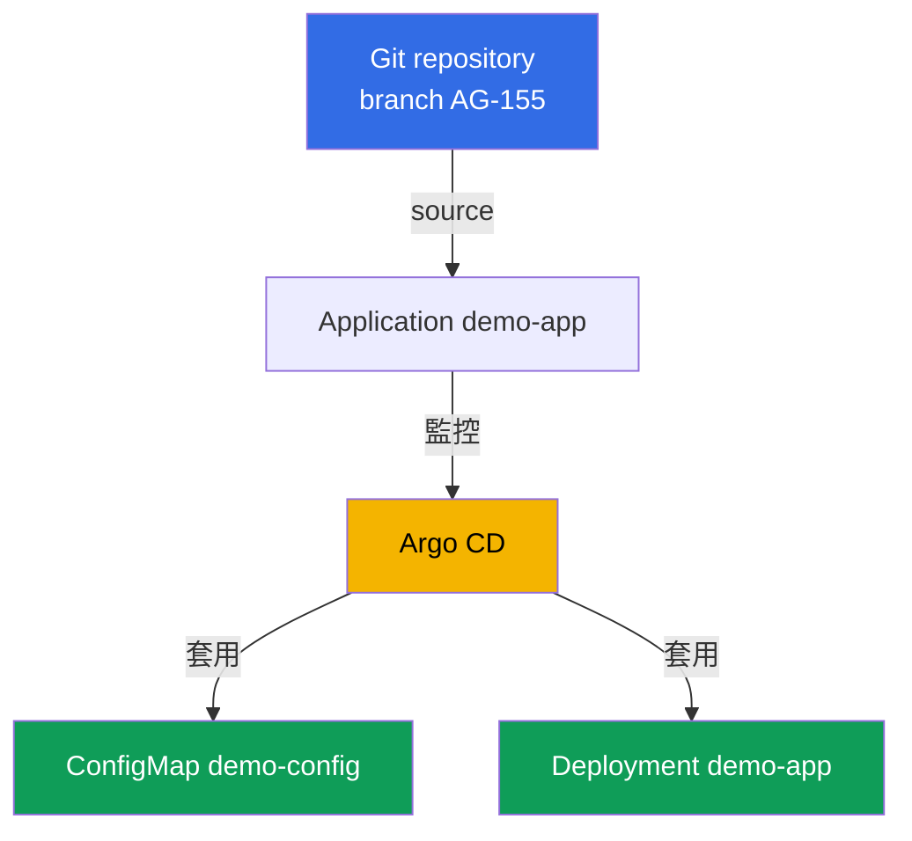
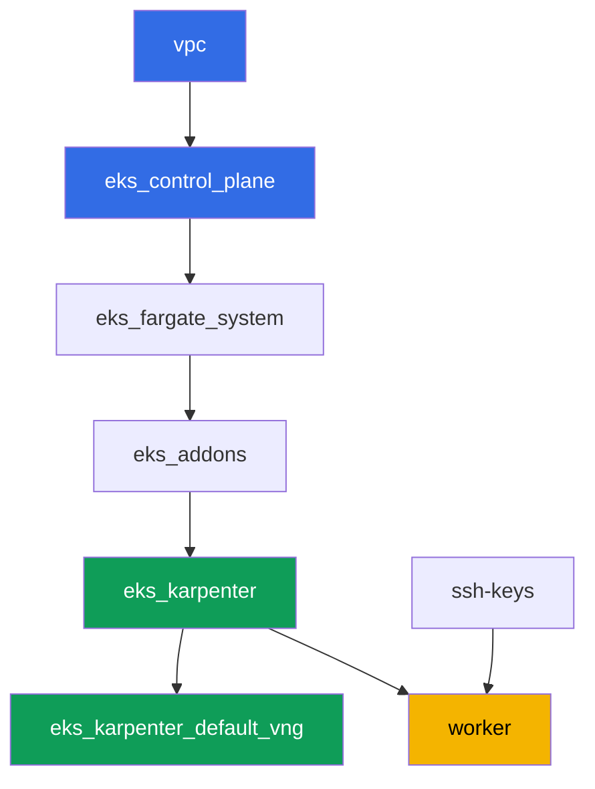

[Русская версия](README_RU.MD) · [Eng version](README.MD) · [Versión en español](README_ES.MD) · [Version française](README_FR.MD) · [Deutsche Version](README_DE.MD) · [ქართული ვერსია](README_GE.MD) · [日本語版](README_JP.MD)

# Lab 118 - GitOps：Argo CD、drift 與 self-heal、sync waves

## 說明

在這個 lab 中，你會在已經部署好的 cluster 上安裝 Argo CD，並透過 `Application`
物件把一部分工作負載的控制權交給它。不再手動執行 `kubectl apply`，Git 變成了
唯一真實來源：agent 會自己拉取 manifest、套用它們，並持續觀察即時狀態。你會看到
`Application` 兩個獨立狀態之間的差異 - sync（即時狀態是否與 Git 一致）和
health（資源是否真的健康），透過手動編輯 cluster 重現 drift，並觀察 self-heal
如何把它復原，同時也會透過 sync wave 檢查物件套用的順序。

任務以 production 風格撰寫：簡短的描述加上驗收標準。檢查是自動的，透過
`check_result` 指令執行。

## 目標

鞏固課程章節的內容：

- [第 44 章。GitOps 與交付：Argo CD 與 Flux，管理一組
  cluster](../../course/44/ru.md) - Git 作為唯一真實來源、sync 與 health、
  self-heal

## 我們要建立什麼

Cluster 已經以程式碼形式部署好了（control plane、Fargate 承載系統 pod、
Karpenter 承載工作負載）。你會安裝 Argo CD，並將它指向就放在這個 repository
裡的示範 manifest，位於這份 README 旁邊的 `gitops-demo/` 目錄。

| 物件 | 這是什麼 | 為什麼在這個 lab 中需要 |
|--------|---------|-------------------|
| Namespace `argocd` | 給 GitOps agent 本身用的 cluster 區段 | Argo CD 透過 Helm 安裝在這裡 |
| Namespace `eks-118` | 這個 lab 工作負載的目標 namespace | Argo CD 在這裡部署示範應用程式 |
| Application `demo-app` | CRD `argoproj.io/v1alpha1`，連結 Git 和 cluster | source 指向 `gitops-demo/`，destination 指向 `eks-118`，`selfHeal`、`prune` |
| Deployment `demo-app`（2 個 replica） | 來自 `gitops-demo/deployment.yaml` 的 ping_pong 應用程式 | 顯示這個物件是 Argo CD 從 Git 套用的，不是學員自己套用的 |
| ConfigMap `demo-config` | 來自 `gitops-demo/configmap.yaml` 的設定 | 展示一個 `Application` 中有多個物件，以及 sync wave `0` |
| Artifact `drift.txt`、`prune.txt`、`health.txt` | 狀態快照與說明 | 記錄 drift、self-heal、prune 的邊界，以及 sync/health 的差異 |

最終的 GitOps 流程：



Manifest `gitops-demo/deployment.yaml` 和 `gitops-demo/configmap.yaml` 不是
cluster 的基礎架構，只是示範應用程式的一般 YAML 檔案，`Application` 會指向
它們。Terragrunt 不會碰它們：Argo CD 是直接透過 HTTPS 從 Git 讀取的。

## 基礎架構

環境是透過 Terragrunt 部署在 AWS（`eu-central-1`）上的。每個 lab 目錄都是一個
元件，有自己的 `terragrunt.hcl`，它會參考 `terraform/modules/` 中的共用模組，
並透過 `dependency` 區塊宣告依賴關係。這個 lab 不會新增任何 terraform 模組：
Argo CD 是從 worker 機器手動透過 Helm 安裝的，而 worker 機器的權限
（`eks:*`、`ec2:Describe*`）已經足夠了，因為 Argo CD 只在 cluster 內部透過
Kubernetes RBAC 運作，不需要新的 AWS IAM 權限。

### 模組與依賴關係

| 目錄（元件） | 模組（`terraform/modules/`） | 依賴於 | 建立什麼 |
|---------------------|-------------------------------|------------|-------------|
| `vpc` | `vpc_v3` | - | VPC `10.10.0.0/16`，兩個 AZ 中的公有與私有子網路，NAT |
| `ssh-keys` | `ssh-keys` | - | worker 機器和節點用的 SSH 金鑰對 |
| `eks_control_plane` | `eks_v2_control_plane` | `vpc` | EKS control plane `1.36`、OIDC、security groups |
| `eks_fargate_system` | `eks_v2_fargate` | `vpc`, `eks_control_plane` | `kube-system` 和 `karpenter` 的 Fargate profile |
| `eks_addons` | `eks_v2_addons` | `eks_control_plane`, `eks_fargate_system` | coredns、kube-proxy、vpc-cni、pod-identity add-on |
| `eks_karpenter` | `eks_v2_karpenter` | `vpc`, `eks_control_plane`, `eks_addons`, `eks_fargate_system` | Karpenter controller、節點的 IAM role |
| `eks_karpenter_default_vng` | `eks_v2_karpenter_vng` | `vpc`, `eks_control_plane`, `eks_karpenter` | 預設的 NodePool `default` 和基於 AL2023 的 EC2NodeClass |
| `worker` | `eks_v2_work_pc` | `ssh-keys`, `vpc`, `eks_control_plane`, `eks_karpenter` | 裝有 kubectl、helm、測試和 `check_result` 的 worker 機器 |

依賴關係圖（先套用的元件在箭頭較下方）：



元件的組合和 lab 101 一樣：系統 pod 在 Fargate 上，worker 節點由 Karpenter
建立。Argo CD 不是一個獨立的 terraform 元件，而是一個 Helm chart，學員會在
任務 1 中自己在 worker 機器上安裝它，就像 lab 108 中的 AWS Load Balancer
Controller 一樣。

### 設定的位置

`env.hcl`（所有元件共用的環境參數，所有元件都會讀取）：

| 參數 | Lab 中的值 | 影響什麼 |
|----------|-----------------|---------------|
| `region` | `eu-central-1` | 所有資源的 region |
| `vpc_default_cidr`, `subnets` | `10.10.0.0/16`，每個 AZ 的子網路 | VPC 的位址規劃和子網路標籤 |
| `prefix` | `eks-task118` | 資源名稱和標籤的前綴 |
| `stack_name` | `eks118` | 用來組成 `env_name` - cluster 名稱 |
| `k8_version` | `1.36.0` | worker 機器上的 kubectl 版本 |
| `instance_type_worker` | `t3.medium` | worker 機器的 instance 類型 |
| `ssh_password_enable`, `access_cidrs` | `true`, `0.0.0.0/0` | 對 worker 機器的 SSH 存取 |
| `root_volume` | `gp3`, `10` | worker 機器的 root 磁碟 |

每個元件 `terragrunt.hcl` 中的 `inputs`（該模組專屬的設定）：

| 檔案 | 主要設定 |
|------|--------------------|
| `eks_control_plane/terragrunt.hcl` | `eks.version = "1.36"`，節點用的私有子網路 |
| `eks_addons/terragrunt.hcl` | 適用於 1.36 的 add-on 版本：kube-proxy、coredns、vpc-cni、pod-identity |
| `eks_karpenter_default_vng/terragrunt.hcl` | NodePool 的 `requirements`、`limits`、`disruption` |
| `worker/terragrunt.hcl` | lab 118 檔案用的 `test_url` 和 `task_script_url` |

## 部署

```bash
TASK=118 make run_eks_task
```

部署大約需要 15-20 分鐘。在輸出中找到 worker 機器 SSH 連線的那一行，然後連上
它。kubectl 和 helm 在那裡已經設定好了。

worker 機器上有用的指令：

```bash
time_left       # 環境還剩多少時間
check_result    # 檢查解答
```

> 環境安全性。`env.hcl` 中啟用了 `ssh_password_enable = true` 和
> `access_cidrs = ["0.0.0.0/0"]` - 對訓練環境來說很方便，但在正式環境中不應該
> 這樣做。依照課程標準（第 0.2、2、19 章），存取 worker 機器應該透過 AWS SSM
> Session Manager，不對外開放公開的 SSH port，並且 `access_cidrs` 應該縮小到
> 特定的位址。這裡保留公開 SSH 只是為了簡化部署流程。

## 任務

---
|        **1**        | **透過 Helm 安裝 Argo CD**                            |
| :-----------------: | :---------------------------------------------------------- |
| 要做什麼          | 建立 namespace `argocd`。透過 Helm（repository `https://argoproj.github.io/argo-helm`，chart `argo-cd`）以預設指令將 Argo CD 安裝到這個 namespace，不要覆寫 `values`。等到 `argocd` 中的 Deployment `argocd-server` 變成 `Running`（至少一個 replica 就緒）。 |
| 驗收標準    | - namespace `argocd` 存在；<br/>- `argocd` 中的 Deployment `argocd-server` 至少有一個就緒的 replica。 |
---
|        **2**        | **Application：source、destination、self-heal、prune**      |
| :-----------------: | :---------------------------------------------------------- |
| 要做什麼          | 建立 namespace `eks-118`。在 namespace `argocd` 中建立一個名為 `demo-app` 的 `Application` 物件（`apiVersion: argoproj.io/v1alpha1`）：`spec.source.repoURL = https://github.com/ViktorUJ/cks.git`、`spec.source.targetRevision = AG-155`、`spec.source.path = tasks/eks/labs/118/gitops-demo`、`spec.destination.server = https://kubernetes.default.svc`、`spec.destination.namespace = eks-118`、`spec.syncPolicy.automated.selfHeal = true`、`spec.syncPolicy.automated.prune = true`。等到 `.status.sync.status` 變成 `Synced` 且 `.status.health.status` 變成 `Healthy`。 |
| 驗收標準    | - `argocd` 中的 Application `demo-app` 具有指定的 source/destination；<br/>- `selfHeal` 和 `prune` 都已啟用（`true`）；<br/>- `.status.sync.status = Synced`，`.status.health.status = Healthy`。 |
---
|        **3**        | **確認 manifest 確實被套用了**                |
| :-----------------: | :---------------------------------------------------------- |
| 要做什麼          | 確認 Argo CD 確實把 `gitops-demo/` 中的物件套用到 `eks-118`：Deployment `demo-app`（image `viktoruj/ping_pong`，`2` 個 replica Ready）和帶有 `greeting` key 的 ConfigMap `demo-config`。用 `kubectl get deployment demo-app -n eks-118` 和 `kubectl get configmap demo-config -n eks-118` 檢查。 |
| 驗收標準    | - `eks-118` 中的 Deployment `demo-app`，image `viktoruj/ping_pong`，`2` 個就緒的 replica；<br/>- `eks-118` 中的 ConfigMap `demo-config` 有非空的 `greeting` key。 |
---
|        **4**        | **重現 drift 和 self-heal**                      |
| :-----------------: | :---------------------------------------------------------- |
| 要做什麼          | 重要細節：當 `selfHeal` 啟用時，controller 會在幾秒內把 drift 復原，用肉眼幾乎不可能捕捉到 `OutOfSync`。因此 drift 會分兩步展示。首先只關閉自我修復：`selfHeal: false`（`prune` 保持 `true`）。然後在不經過 Git 的情況下改變即時狀態 - `kubectl scale deployment demo-app -n eks-118 --replicas=5` - 並確認 Application 進入 `OutOfSync` 並停留在那裡（沒有 self-heal，drift 不會被修復）。記錄這一刻。然後把 `selfHeal` 改回 `true`，等待 self-heal 自動把 replica 復原到 `2`，Application 再次變成 `Synced`。記錄第二個時刻。把兩次快照（`sync`/`health` 和最終的 `spec.replicas`）都存到檔案 `/var/work/tests/artifacts/4/drift.txt` 中。 |
| 驗收標準    | - 檔案 `drift.txt` 同時包含 `OutOfSync` 和 `Synced`；<br/>- Deployment `demo-app` 最終又回到 `2` 個 replica（`spec.replicas`）。 |
---
|        **5**        | **Sync wave：物件套用的順序**                  |
| :-----------------: | :---------------------------------------------------------- |
| 要做什麼          | Lab 的 manifest 已經帶有 `argocd.argoproj.io/sync-wave` annotation：`gitops-demo/configmap.yaml` 上是 `0`，`gitops-demo/deployment.yaml` 上是 `1` - 較小的數字會先被套用。用 `kubectl get ... -o jsonpath='{.metadata.annotations.argocd\.argoproj\.io/sync-wave}'` 檢查兩個 annotation，並確認 Application 仍然是 `Synced`（來自不同 wave 的兩個物件都已同步）。 |
| 驗收標準    | - ConfigMap `demo-config` 有 annotation `sync-wave: "0"`；<br/>- Deployment `demo-app` 有 annotation `sync-wave: "1"`；<br/>- `.status.sync.status = Synced`。 |
---
|        **6**        | **prune 會刪除什麼、不會刪除什麼：資源的所有權**         |
| :-----------------: | :---------------------------------------------------------- |
| 要做什麼          | 在 `eks-118` 中手動建立一個 `gitops-demo/` 裡沒有的 ConfigMap `manual-extra`：`kubectl create configmap manual-extra -n eks-118 --from-literal=note=manual`。強制刷新（`kubectl patch application demo-app -n argocd --type=merge -p '{"metadata":{"annotations":{"argocd.argoproj.io/refresh":"hard"}}}'`），並觀察一個意外的現象：`prune=true` 已啟用，但 `manual-extra` **沒有被刪除**，而 Application 依然是 `Synced`。原因：Argo CD 只擁有那些被標記為屬於該 application 的物件（在 3.x 版本中，就是 `argocd.argoproj.io/tracking-id` annotation - 看看 `demo-config` 上是怎麼標記的）；手動建立的物件對它來說是陌生的（orphaned），不會落入 prune 的範圍。現在把它標記為屬於這個 application：`kubectl annotate configmap manual-extra -n eks-118 'argocd.argoproj.io/tracking-id=demo-app:/ConfigMap:eks-118/manual-extra' --overwrite`，再次強制刷新 - 現在這個物件被追蹤了，它不在 Git 中，因此 prune 會把它刪除。在檔案 `/var/work/tests/artifacts/6/prune.txt` 中記錄這兩個觀察結果（沒有 tracking 時不刪除，有 tracking 時刪除），並用文字解釋 prune 只會移除 Git 中缺失且被追蹤的資源，這就是為什麼 `demo-app` 和 `demo-config` 會保持原樣。 |
| 驗收標準    | - 檔案 `prune.txt` 不是空的，提到了 `manual-extra` 和 `prune` 這個詞；<br/>- `eks-118` 中的 ConfigMap `manual-extra` 最終不存在；<br/>- ConfigMap `demo-config` 和 Deployment `demo-app` 保持原樣。 |
---
|        **7**        | **診斷：sync status 對比 health status**           |
| :-----------------: | :---------------------------------------------------------- |
| 要做什麼          | 暫時停用 `Application` 上的 `syncPolicy.automated`（否則 self-heal 會馬上把下一步復原）。給 Deployment `demo-app` 加上一個故意壞掉的 `readinessProbe`。注意：訓練用 image `ping_pong` 對任何路徑都會回應 `200`，所以指向「不存在的 URL」的 probe 會順利通過，不會產生任何症狀 - 改把 probe 指向一個**已關閉的 port**，例如 `httpGet` 指向 port `9999`。這樣新的 pod 就無法通過 readiness。確認 `.status.health.status` 變成 `Progressing`（等 `progressDeadlineSeconds` 到期後，Deployment 會變成 `Degraded`），而 `.status.sync.status` 仍然是 `Synced`。注意原因：`replicas` 在 Git 中有描述，所以手動修改它會產生 `OutOfSync`（任務 4），而 `readinessProbe` 不在 Git manifest 中，新加的欄位不會被算進差異裡。在檔案 `/var/work/tests/artifacts/7/health.txt` 中解釋為什麼 `Synced` 和 `Degraded`/`Progressing` 可以同時發生：sync status 比較即時狀態和 Git，health status 是資源真正的可用性 - 這是兩個獨立的軸。最後把 `syncPolicy.automated`（`selfHeal`、`prune`）改回去，並**手動**移除 probe（`kubectl patch ... --type=json` 加上 `remove` 操作）：自己確認一下 self-heal 不會修復這個故障，因為對 Argo CD 來說跟 Git 之間沒有差異（`Synced`）- manifest 中不存在的欄位仍然是操作者的責任。 |
| 驗收標準    | - 檔案 `health.txt` 不是空的，包含 `sync`、`health`、`Synced` 和 `Degraded`/`Progressing` 這些詞；<br/>- 明確解釋了 sync 和 health 是不同、獨立的狀態。 |
---

## 檢查結果

在 worker 機器上，執行自動檢查：

```bash
check_result
```

腳本會執行測試，並顯示已完成任務的百分比。

## 解答

參考解答：[worker/files/solutions/1_TW.MD](worker/files/solutions/1_TW.MD)

## 刪除 cluster 和資源

> **先關閉 `selfHeal`，然後再移除物件，否則 Argo CD 會自己把它們恢復回來。**
> 只要 Application `demo-app` 在 `selfHeal: true` 的情況下處於同步狀態，
> 手動刪除 Deployment `demo-app` 或 ConfigMap `demo-config`（或透過刪除
> namespace `eks-118`）都會在幾秒內被 controller 復原 - 這正是你在任務 4
> 中實作過的行為。這個 lab 不會建立任何 AWS 資源，所以這裡沒有孤兒 ENI 的
> 風險，但 Argo CD 是手動透過 Helm 安裝的，`TASK=118 make delete_eks_task`
> 不知道它的存在。

```bash
# 1. 關閉 Application 的 autosync，否則移除下面的物件會自動復原
kubectl patch application demo-app -n argocd --type=merge \
  -p '{"spec":{"syncPolicy":{"automated":null}}}'

# 2. 移除 Application（之後 Argo CD 就不再監控 demo-app 和 demo-config）
kubectl delete application demo-app -n argocd --ignore-not-found

# 3. 移除 Argo CD 本身以及這個 lab 的兩個工作負載
helm uninstall argocd -n argocd
kubectl delete namespace argocd eks-118 --ignore-not-found

# 4. 等待 Karpenter 移除 NodeClaim 和 EC2 節點（只應該剩下 fargate-*）
while kubectl get nodeclaims --no-headers 2>/dev/null | grep -q .; do
  echo "NodeClaim 還活著，等待中..."; sleep 15
done
kubectl get nodes | grep -v fargate
```

只有做完這些之後，才能拆除整個環境：

```bash
TASK=118 make delete_eks_task
```

如果 `destroy` 卡在節點的 security group 上，就代表留下了孤兒 ENI。找到並
刪除它：

```bash
aws ec2 describe-network-interfaces --filters Name=status,Values=available \
  --query 'NetworkInterfaces[?Tags[?Key==`eks:eni:owner`]].[NetworkInterfaceId,Description]' \
  --output table
aws ec2 delete-network-interface --network-interface-id <eni-id>
```
