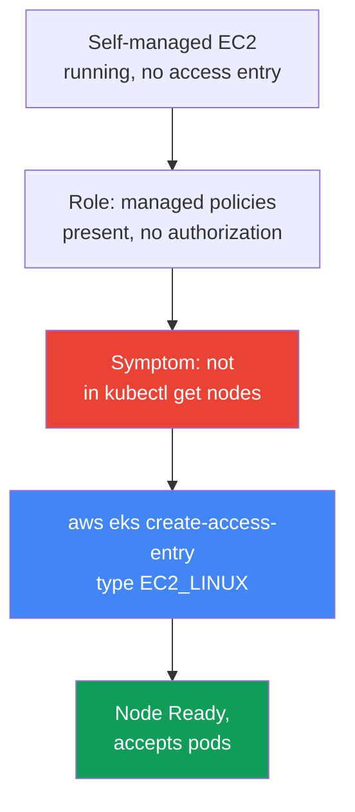
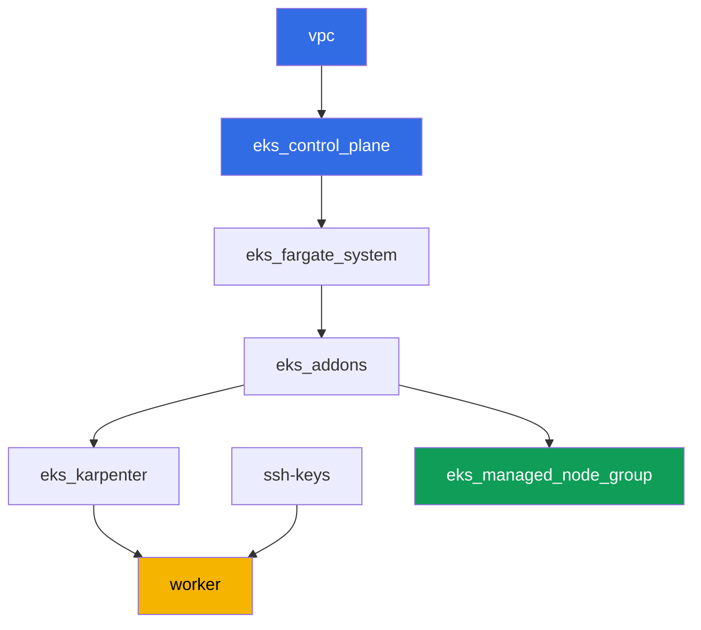

[Русская версия](README_RU.MD) · [Versión en español](README_ES.MD) · [Version française](README_FR.MD) · [Deutsche Version](README_DE.MD) · [ქართული ვერსია](README_GE.MD) · [繁體中文版](README_TW.MD) · [日本語版](README_JP.MD)

# Lab 119 - Troubleshooting: node not reaching Ready (IAM, SG, user data, kubelet)

## Description

In this lab you work through the most common EKS launch incident: an EC2 instance comes
up, but there is no node in the cluster. The topic is a diagnostic runbook, not a single
scenario with a hard-broken infrastructure. The lab's managed node group stays healthy
the whole time - it is your baseline of normal. You reproduce the symptom separately:
you bring up one self-managed EC2 instance with a deliberately incomplete setup (no
access entry in the cluster) and observe the exact same empty `kubectl get nodes` while
the instance is `running` in EC2. Then you fix it via `aws eks create-access-entry` and
confirm the node actually accepts pods, not just sits in `Ready` status.

The tasks are written in production style: a short statement plus acceptance criteria.
Checking is automatic, via the `check_result` command.

## Goal

Reinforce the course chapter:

- [Chapter 45. Node did not join the cluster](../../course/45/en.md) - IAM, SG,
  user data, bootstrap, kubelet, systematic layer-by-layer diagnostics

## What we create

The cluster is already deployed as code (like in lab 101), and on top of Karpenter it
has a healthy managed node group - a baseline of normal for comparison. You create a
test role and one self-managed instance, reproduce the symptom, and fix it.

| Object | What it is | Why it is in this lab |
|--------|---------|-------------------|
| Namespace `eks-119` | a cluster section for the lab's workload | keeps the lab's objects separate |
| Managed node group `healthy` | a healthy node with automatic authorization | baseline of normal: `describe-nodegroup` without issues |
| Test IAM role | the self-managed instance's role | carries the same three managed policies as the healthy node's role, but without an access entry |
| Self-managed EC2 instance on AL2023 | an instance with nodeadm/NodeConfig, without an access entry | source of the symptom: `running`, but not in `kubectl get nodes` |
| Access entry `EC2_LINUX` | manual authorization of the role in the cluster | fixes the symptom, the node reaches `Ready` |
| Pod `probe` | a pod pinned to the fixed node | confirms the node actually accepts workload |



## Infrastructure

The environment is deployed in AWS (`eu-central-1`) via Terragrunt, like in lab 101,
plus one extra component - a healthy managed node group for the inventory in task 2. The
self-managed EC2 instance from tasks 3-9 is NOT described in terraform: the student
brings it up manually from the worker machine via the AWS CLI - that is the whole point
of this lab.

### Modules and dependencies

| Directory (component) | Module (`terraform/modules/`) | Depends on | What it creates |
|---------------------|-------------------------------|------------|-------------|
| `vpc` | `vpc_v3` | - | VPC `10.10.0.0/16`, public and private subnets in two AZs, NAT |
| `ssh-keys` | `ssh-keys` | - | an SSH key pair for the worker machine and nodes |
| `eks_control_plane` | `eks_v2_control_plane` | `vpc` | EKS control plane `1.36`, OIDC, security groups |
| `eks_fargate_system` | `eks_v2_fargate` | `vpc`, `eks_control_plane` | Fargate profile for `kube-system` and `karpenter` |
| `eks_addons` | `eks_v2_addons` | `eks_control_plane`, `eks_fargate_system` | coredns, kube-proxy, vpc-cni, pod-identity addons |
| `eks_karpenter` | `eks_v2_karpenter` | `vpc`, `eks_control_plane`, `eks_addons`, `eks_fargate_system` | Karpenter controller, node IAM role |
| `eks_karpenter_default_vng` | `eks_v2_karpenter_vng` | `vpc`, `eks_control_plane`, `eks_karpenter` | the default NodePool `default` and EC2NodeClass on AL2023 |
| `eks_managed_node_group` | `eks_v2_mng_healthy` | `vpc`, `eks_control_plane`, `eks_addons` | the healthy managed node group `healthy` - baseline of normal |
| `worker` | `eks_v2_work_pc` | `ssh-keys`, `vpc`, `eks_control_plane`, `eks_karpenter` | the worker machine with kubectl, tests, and `check_result` |

Dependency graph (applied earlier means lower in the arrow):



### Managed node group as the baseline of normal

`eks_managed_node_group` (module `eks_v2_mng_healthy`) creates a separate node IAM role
with `AmazonEKSWorkerNodePolicy`, `AmazonEC2ContainerRegistryReadOnly`, and
`AmazonEKS_CNI_Policy`, and a managed node group on that role. For a managed node group,
EKS itself creates an access entry of type `EC2_LINUX` - which is why such a node always
reaches `Ready`, and `aws eks describe-nodegroup ... health.issues` in task 2 returns an
empty list. Karpenter (`eks_karpenter_default_vng`) in this lab stays functional for
system pods, but the tasks are focused on the managed node group and on the
self-managed instance, not on Karpenter.

The test role from task 3 gets the same set of three managed policies, because exactly
one thing must be broken in this lab - the missing access entry. In particular,
`AmazonEKS_CNI_Policy` is mandatory: the `vpc-cni` addon in this lab runs without its own
IRSA role (`serviceAccountRoleArn` is empty), so `aws-node` takes credentials from the
node's role. Without this policy, IPAM cannot hand the pod an address, the node stays
`NotReady` with the message `container runtime network not ready: cni plugin not
initialized`, and the symptom from task 5 becomes indistinguishable from a completely
different failure.

### Worker permissions for the self-managed scenario

The worker role (`eks_v2_work_pc/iam.tf`) already could manage test IAM roles
(`arn:...role/*-test-*`) for other labs. For this lab, targeted permissions were added
on top of the same `-test-` scheme:

- `iam:AttachRolePolicy`/`DetachRolePolicy`/`ListAttachedRolePolicies` on `*-test-*`
  roles - to attach managed policies to the test node role;
- `iam:PassRole` on `*-test-*` roles with the condition
  `iam:PassedToService=ec2.amazonaws.com` - to pass the role to the instance;
- `iam:CreateInstanceProfile`/`DeleteInstanceProfile`/`GetInstanceProfile`/
  `AddRoleToInstanceProfile`/`RemoveRoleFromInstanceProfile`/`TagInstanceProfile` on the
  `*-test-*` instance profile;
- `ec2:RunInstances`/`TerminateInstances`/`CreateTags`, restricted by the tag
  `Name=*-test-*` on resources of type `instance` and `volume` (the worker got the AMI
  image, subnet, SG, and key-pair without a tag condition - AWS does not support
  `RequestTag` on these resource types, see `ExamplePolicies_EC2` in the AWS
  documentation).

The permissions are additive: nothing was removed from the worker's existing policies,
new `Sid` entries were added to the already-working
`TestRoleManagementForLabs`/`SelfManagedNode*` policy.

## Deployment

```bash
TASK=119 make run_eks_task
```

Deployment takes roughly 15-20 minutes. In the output, find the line with the SSH
connection to the worker machine and connect to it. kubectl and the `aws` CLI are already
configured there for the right cluster and region.

Useful commands on the worker machine:

```bash
time_left       # how much time is left in the environment
check_result    # check the solution
```

> Environment security. `env.hcl` has `ssh_password_enable = true` and
> `access_cidrs = ["0.0.0.0/0"]` enabled - this is convenient for a training environment,
> but must not be done in production. Per the course standards, access to worker
> machines is opened via AWS SSM Session Manager without public SSH ports facing out,
> and `access_cidrs` is narrowed to specific addresses. Here public SSH is left only for
> simplicity of launching.

## Tasks

---
|        **1**        | **Namespace for the lab's workload**                              |
| :-----------------: | :----------------------------------------------------------- |
| What to do          | Create a namespace named `eks-119`. The test pod from task 8 is created inside it. |
| Acceptance criteria    | - namespace `eks-119` exists. |
---
|        **2**        | **Inventory: a healthy managed node group as the norm**   |
| :-----------------: | :----------------------------------------------------------- |
| What to do          | Save to the file `/var/work/tests/artifacts/2/nodegroup_health.txt` the output of `aws eks describe-nodegroup --query 'nodegroup.health.issues'` for this lab's managed node group and the output of `kubectl get nodes -o wide`. Make sure `health.issues` is an empty list, and the node list has at least one `Ready`. |
| Acceptance criteria    | - the file is not empty;<br/>- `health.issues` is empty;<br/>- the file has a line with the `Ready` status. |
---
|        **3**        | **Test IAM role for the self-managed instance**              |
| :-----------------: | :----------------------------------------------------------- |
| What to do          | Create an IAM role (name containing `-test-`, e.g. `eks-task119-test-node`) with a trust policy for `ec2.amazonaws.com`, attach `AmazonEKSWorkerNodePolicy`, `AmazonEC2ContainerRegistryReadOnly`, and `AmazonEKS_CNI_Policy`, create an instance profile with the same role. Save the role's ARN to the file `/var/work/tests/artifacts/3/test_role_arn.txt`. Do NOT create an access entry at this step - this is the deliberately incomplete setup. |
| Acceptance criteria    | - the file is not empty, contains the role's ARN with `test` in the name;<br/>- the role exists (`aws iam get-role`). |
---
|        **4**        | **Self-managed EC2 instance on AL2023**                       |
| :-----------------: | :----------------------------------------------------------- |
| What to do          | Get the EKS-optimized AL2023 AMI for version `1.36` via SSM (`/aws/service/eks/optimized-ami/1.36/amazon-linux-2023/x86_64/standard/recommended/image_id`). Launch one EC2 instance on this AMI in the cluster's private subnet with the nodes' security group, the instance profile from task 3, and a `Name` tag containing `-test-`. Provide the tag in two `--tag-specifications` sections - both for `ResourceType=instance` and for `ResourceType=volume`: the worker's policy allows `RunInstances` on the `aws:RequestTag/Name` condition, and the instance launch also creates a root volume, so without a tag on the volume the launch is rejected with `UnauthorizedOperation`. In the user data, pass a `NodeConfig` for `nodeadm` with `apiServerEndpoint`, `certificateAuthority`, and service `cidr` from `aws eks describe-cluster`. Save the instance ID to the file `/var/work/tests/artifacts/4/instance_id.txt`. |
| Acceptance criteria    | - the file is not empty and contains a valid `i-...` instance ID. |
---
|        **5**        | **Symptom: `running` in EC2, but not in `kubectl get nodes`**   |
| :-----------------: | :----------------------------------------------------------- |
| What to do          | Wait 3-5 minutes after launching the instance. Save to the file `/var/work/tests/artifacts/5/no_join_symptom.txt` the instance state from `aws ec2 describe-instances` (should be `running`) and the output of `kubectl get nodes`, in which this instance is absent. |
| Acceptance criteria    | - the file is not empty, mentions the instance ID, `running`, and `get nodes`. |
---
|        **6**        | **Diagnosis: what the role is missing**                        |
| :-----------------: | :----------------------------------------------------------- |
| What to do          | Run `aws eks list-access-entries` and confirm that the role's ARN from task 3 is absent from the list. Save to the file `/var/work/tests/artifacts/6/why_no_access_entry.txt` an explanation: the role has managed policies, but no access entry, so kubelet does not pass authorization in the cluster. The text must contain the words `access entry`, `EC2_LINUX`, and the role's own ARN. |
| Acceptance criteria    | - the file is not empty, contains `access entry`, `EC2_LINUX`, and the role's ARN. |
---
|        **7**        | **Fix: an access entry of type `EC2_LINUX`**                   |
| :-----------------: | :----------------------------------------------------------- |
| What to do          | Run `aws eks create-access-entry --cluster-name <cluster> --principal-arn <role-arn> --type EC2_LINUX`. Wait for the node to register and transition to `Ready` (usually 1-2 minutes). The node's name in the cluster is the instance's private DNS name. Record the result in the file `/var/work/tests/artifacts/7/node_ready.txt` line by line as `key=value`: `node_name` (private DNS name) and `node_status` (`Ready`). |
| Acceptance criteria    | - `aws eks describe-access-entry` for the role from task 3 returns `type=EC2_LINUX`;<br/>- the file `7/node_ready.txt` contains the `node_name` of the fixed instance and `node_status=Ready`, and while the node is alive its live status in the cluster is also `Ready`. |
---
|        **8**        | **Verification: the node actually accepts pods**                    |
| :-----------------: | :----------------------------------------------------------- |
| What to do          | `Ready` is not proof that the node is functional. In the namespace `eks-119`, create a Pod `probe` (image `viktoruj/ping_pong:latest`) with a `nodeSelector` on `kubernetes.io/hostname`, equal to the private DNS name of the fixed instance. Wait until the pod transitions to `Running`, and record the result in the file `/var/work/tests/artifacts/8/probe.txt` line by line as `key=value`: `pod_phase` (`Running`) and `pod_node` (the same node name as in task 7). |
| Acceptance criteria    | - the file `8/probe.txt` contains `pod_phase=Running` and `pod_node` equal to the `node_name` from task 7;<br/>- while the pod is alive, its live `status.phase` and `spec.nodeName` match the recorded ones. |
---
|        **9**        | **Cleanup: terminate the self-managed instance**                |
| :-----------------: | :----------------------------------------------------------- |
| What to do          | This EC2 instance is not part of the lab's terraform state, `make delete_eks_task` will not touch it. Terminate the instance from task 4 via `aws ec2 terminate-instances` and save the fact to the file `/var/work/tests/artifacts/9/terminated.txt`. |
| Acceptance criteria    | - the file is not empty;<br/>- the instance state is `terminated` or `shutting-down`, or the instance is already gone from `describe-instances` - AWS stops showing terminated instances after some time, while a running one is always shown. |

> Why tasks 7 and 8 require artifacts. Terminating the instance takes down both the Node
> object and the `probe` pod, and `describe-instances` for a terminated instance returns
> an empty `PrivateDnsName`. In other words, after task 9 there is no live state left,
> and the check relies on what you recorded at the moment of observation. This is exactly
> what is done during incidents: capturing evidence before it disappears.

---

## Checking the result

On the worker machine, run the automatic check:

```bash
check_result
```

The script runs the tests and shows the percentage of completed tasks.

## Solution

Reference solution: [worker/files/solutions/1.MD](worker/files/solutions/1.MD)

## Cleanup

```bash
TASK=119 make delete_eks_task
```

Important: the self-managed EC2 instance, the test IAM role, and the instance profile
from tasks 3-9 were created manually via the AWS CLI and are NOT part of this lab's
terraform state. `make delete_eks_task` will only remove the components from the lab's
directories (VPC, cluster, managed node group, and so on). The instance is handled by
task 9, but the role and instance profile need to be removed before or after destroy on
your own - unlike the instance, they do not cost money, but their name is static
(`eks-task119-test-node`), so they stay in the account permanently and get in the way of
the next run of this same lab. The access entry goes away together with the cluster, but
it must be removed before the role, otherwise the entry is left hanging on a
non-existent principal:

```bash
CLUSTER=$(aws eks list-clusters --query 'clusters[0]' --output text)
ROLE_ARN=$(cat /var/work/tests/artifacts/3/test_role_arn.txt)
aws eks delete-access-entry --cluster-name "$CLUSTER" --principal-arn "$ROLE_ARN"
aws iam remove-role-from-instance-profile --instance-profile-name eks-task119-test-node \
  --role-name eks-task119-test-node
aws iam delete-instance-profile --instance-profile-name eks-task119-test-node
for p in AmazonEKSWorkerNodePolicy AmazonEC2ContainerRegistryReadOnly AmazonEKS_CNI_Policy; do
  aws iam detach-role-policy --role-name eks-task119-test-node \
    --policy-arn arn:aws:iam::aws:policy/$p
done
aws iam delete-role --role-name eks-task119-test-node
```
