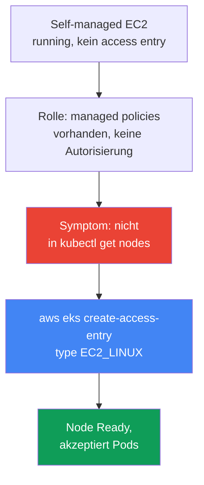
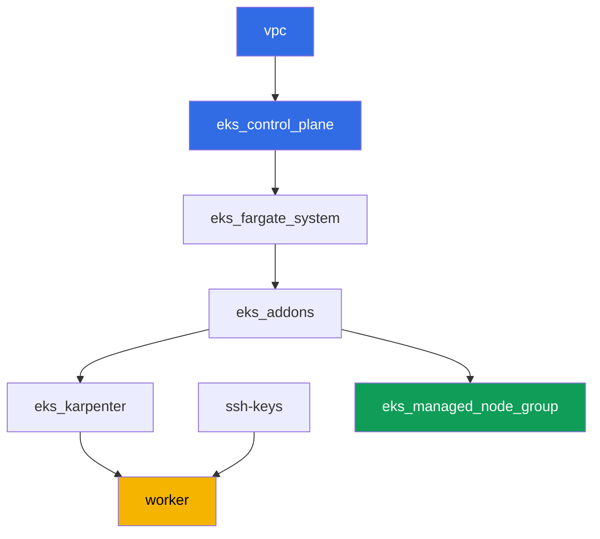

[Русская версия](README_RU.MD) · [Eng version](README.MD) · [Versión en español](README_ES.MD) · [Version française](README_FR.MD) · [ქართული ვერსია](README_GE.MD) · [繁體中文版](README_TW.MD) · [日本語版](README_JP.MD)

# Lab 119 - Troubleshooting: Node erreicht Ready nicht (IAM, SG, user data, kubelet)

## Beschreibung

In dieser Lab arbeiten Sie den häufigsten EKS-Startvorfall durch: eine EC2-Instance
kommt hoch, aber es gibt keine Node im Cluster. Das Thema ist ein diagnostisches
Runbook, kein einzelnes Szenario mit fest kaputter Infrastruktur. Die managed node
group der Lab bleibt die ganze Zeit gesund - das ist Ihre Baseline der Normalität. Das
Symptom reproduzieren Sie separat: Sie bringen eine self-managed EC2-Instance mit
absichtlich unvollständigem Setup hoch (kein access entry im Cluster) und beobachten
genau dasselbe leere `kubectl get nodes`, während die Instance in EC2 `running` ist.
Dann reparieren Sie es über `aws eks create-access-entry` und bestätigen, dass die Node
tatsächlich Pods akzeptiert, nicht nur im Status `Ready` hängt.

Die Aufgaben sind im Produktionsstil geschrieben: eine kurze Aufgabenstellung plus
Abnahmekriterien. Die Prüfung ist automatisch, über den Befehl `check_result`.

## Ziel

Das Kapitel des Kurses vertiefen:

- [Kapitel 45. Node ist dem Cluster nicht beigetreten](../../course/45/de.md) - IAM, SG,
  user data, bootstrap, kubelet, systematische schichtweise Diagnostik

## Was wir erstellen

Der Cluster ist bereits als Code deployt (wie in Lab 101), und zusätzlich zu Karpenter
gibt es darin eine gesunde managed node group - eine Baseline der Normalität für den
Vergleich. Sie erstellen eine Test-Rolle und eine self-managed Instance, reproduzieren
das Symptom und reparieren es.

| Objekt | Was es ist | Warum es in dieser Lab ist |
|--------|---------|-------------------|
| Namespace `eks-119` | ein Cluster-Bereich für die Workload der Lab | hält die Objekte der Lab getrennt |
| Managed node group `healthy` | eine gesunde Node mit automatischer Autorisierung | Baseline der Normalität: `describe-nodegroup` ohne Issues |
| Test-IAM-Rolle | die Rolle der self-managed Instance | trägt dieselben drei managed policies wie die Rolle der gesunden Node, aber ohne access entry |
| Self-managed EC2-Instance auf AL2023 | eine Instance mit nodeadm/NodeConfig, ohne access entry | Quelle des Symptoms: `running`, aber nicht in `kubectl get nodes` |
| Access entry `EC2_LINUX` | manuelle Autorisierung der Rolle im Cluster | behebt das Symptom, die Node erreicht `Ready` |
| Pod `probe` | ein Pod, der auf der reparierten Node fixiert ist | bestätigt, dass die Node tatsächlich Workload akzeptiert |



## Infrastruktur

Die Umgebung wird in AWS (`eu-central-1`) über Terragrunt deployt, wie in Lab 101, plus
eine zusätzliche Komponente - eine gesunde managed node group für die Inventarisierung
in Aufgabe 2. Die self-managed EC2-Instance aus den Aufgaben 3-9 ist NICHT in terraform
beschrieben: der Student bringt sie manuell von der Worker-Maschine über die AWS CLI
hoch - das ist der ganze Sinn dieser Lab.

### Module und Abhängigkeiten

| Verzeichnis (Komponente) | Modul (`terraform/modules/`) | Abhängig von | Was es erstellt |
|---------------------|-------------------------------|------------|-------------|
| `vpc` | `vpc_v3` | - | VPC `10.10.0.0/16`, öffentliche und private Subnets in zwei AZs, NAT |
| `ssh-keys` | `ssh-keys` | - | ein SSH-Schlüsselpaar für die Worker-Maschine und Nodes |
| `eks_control_plane` | `eks_v2_control_plane` | `vpc` | EKS control plane `1.36`, OIDC, security groups |
| `eks_fargate_system` | `eks_v2_fargate` | `vpc`, `eks_control_plane` | Fargate-Profil für `kube-system` und `karpenter` |
| `eks_addons` | `eks_v2_addons` | `eks_control_plane`, `eks_fargate_system` | Addons coredns, kube-proxy, vpc-cni, pod-identity |
| `eks_karpenter` | `eks_v2_karpenter` | `vpc`, `eks_control_plane`, `eks_addons`, `eks_fargate_system` | Karpenter-Controller, IAM-Rolle der Nodes |
| `eks_karpenter_default_vng` | `eks_v2_karpenter_vng` | `vpc`, `eks_control_plane`, `eks_karpenter` | der Standard-NodePool `default` und EC2NodeClass auf AL2023 |
| `eks_managed_node_group` | `eks_v2_mng_healthy` | `vpc`, `eks_control_plane`, `eks_addons` | die gesunde managed node group `healthy` - Baseline der Normalität |
| `worker` | `eks_v2_work_pc` | `ssh-keys`, `vpc`, `eks_control_plane`, `eks_karpenter` | die Worker-Maschine mit kubectl, Tests und `check_result` |

Abhängigkeitsgraph (früher angewendet bedeutet weiter unten im Pfeil):



### Managed node group als Baseline der Normalität

`eks_managed_node_group` (Modul `eks_v2_mng_healthy`) erstellt eine separate IAM-Rolle
der Node mit `AmazonEKSWorkerNodePolicy`, `AmazonEC2ContainerRegistryReadOnly` und
`AmazonEKS_CNI_Policy`, und eine managed node group auf dieser Rolle. Für eine managed
node group erstellt EKS selbst einen access entry vom Typ `EC2_LINUX` - deshalb erreicht
eine solche Node immer `Ready`, und `aws eks describe-nodegroup ... health.issues` in
Aufgabe 2 gibt eine leere Liste zurück. Karpenter (`eks_karpenter_default_vng`) bleibt
in dieser Lab für System-Pods funktionsfähig, aber die Aufgaben konzentrieren sich auf
die managed node group und auf die self-managed Instance, nicht auf Karpenter.

Die Test-Rolle aus Aufgabe 3 erhält denselben Satz von drei managed policies, weil in
dieser Lab genau eine Sache kaputt sein muss - der fehlende access entry. Insbesondere
ist `AmazonEKS_CNI_Policy` obligatorisch: das Addon `vpc-cni` läuft in dieser Lab ohne
eigene IRSA-Rolle (`serviceAccountRoleArn` ist leer), deshalb nimmt `aws-node`
Credentials aus der Rolle der Node. Ohne diese Policy kann IPAM dem Pod keine Adresse
geben, die Node bleibt `NotReady` mit der Meldung `container runtime network not ready:
cni plugin not initialized`, und das Symptom aus Aufgabe 5 wird von einem völlig
anderen Fehler ununterscheidbar.

### Worker-Berechtigungen für das self-managed Szenario

Die Rolle des Workers (`eks_v2_work_pc/iam.tf`) konnte bereits Test-IAM-Rollen
(`arn:...role/*-test-*`) für andere Labs verwalten. Für diese Lab wurden gezielte
Berechtigungen zusätzlich zu demselben `-test-`-Schema hinzugefügt:

- `iam:AttachRolePolicy`/`DetachRolePolicy`/`ListAttachedRolePolicies` auf `*-test-*`
  Rollen - um managed policies an die Test-Node-Rolle anzuhängen;
- `iam:PassRole` auf `*-test-*` Rollen mit der Bedingung
  `iam:PassedToService=ec2.amazonaws.com` - um die Rolle an die Instance zu übergeben;
- `iam:CreateInstanceProfile`/`DeleteInstanceProfile`/`GetInstanceProfile`/
  `AddRoleToInstanceProfile`/`RemoveRoleFromInstanceProfile`/`TagInstanceProfile` auf
  dem `*-test-*` Instance Profile;
- `ec2:RunInstances`/`TerminateInstances`/`CreateTags`, eingeschränkt durch den Tag
  `Name=*-test-*` auf Ressourcen vom Typ `instance` und `volume` (das AMI-Image, das
  Subnet, die SG und das Key-Pair erhielt der Worker ohne Tag-Bedingung - AWS
  unterstützt `RequestTag` auf diesen Ressourcentypen nicht, siehe
  `ExamplePolicies_EC2` in der AWS-Dokumentation).

Die Berechtigungen sind additiv: nichts wurde aus den bestehenden Policies des Workers
entfernt, neue `Sid`-Einträge wurden zur bereits funktionierenden Policy
`TestRoleManagementForLabs`/`SelfManagedNode*` hinzugefügt.

## Deployment

```bash
TASK=119 make run_eks_task
```

Das Deployment dauert etwa 15-20 Minuten. Finden Sie in der Ausgabe die Zeile mit der
SSH-Verbindung zur Worker-Maschine und verbinden Sie sich damit. kubectl und die `aws`
CLI sind dort bereits für den richtigen Cluster und die richtige Region konfiguriert.

Nützliche Befehle auf der Worker-Maschine:

```bash
time_left       # wie viel Zeit in der Umgebung übrig ist
check_result    # die Lösung prüfen
```

> Sicherheit der Umgebung. In `env.hcl` sind `ssh_password_enable = true` und
> `access_cidrs = ["0.0.0.0/0"]` aktiviert - das ist bequem für eine Lernumgebung, darf
> aber in der Produktion nicht so gemacht werden. Nach den Standards des Kurses wird der
> Zugriff auf Worker-Maschinen über AWS SSM Session Manager geöffnet, ohne öffentliche
> SSH-Ports nach außen, und `access_cidrs` wird auf bestimmte Adressen eingeschränkt.
> Hier bleibt öffentliches SSH nur der Einfachheit des Starts halber bestehen.

## Aufgaben

---
|        **1**        | **Namespace für die Workload der Lab**                              |
| :-----------------: | :----------------------------------------------------------- |
| Was zu tun ist          | Erstellen Sie einen Namespace mit dem Namen `eks-119`. Der Test-Pod aus Aufgabe 8 wird darin erstellt. |
| Abnahmekriterien    | - Namespace `eks-119` existiert. |
---
|        **2**        | **Inventar: eine gesunde managed node group als Norm**   |
| :-----------------: | :----------------------------------------------------------- |
| Was zu tun ist          | Speichern Sie in der Datei `/var/work/tests/artifacts/2/nodegroup_health.txt` die Ausgabe von `aws eks describe-nodegroup --query 'nodegroup.health.issues'` für die managed node group dieser Lab und die Ausgabe von `kubectl get nodes -o wide`. Stellen Sie sicher, dass `health.issues` eine leere Liste ist und die Node-Liste mindestens eine `Ready` enthält. |
| Abnahmekriterien    | - die Datei ist nicht leer;<br/>- `health.issues` ist leer;<br/>- die Datei hat eine Zeile mit dem Status `Ready`. |
---
|        **3**        | **Test-IAM-Rolle für die self-managed Instance**              |
| :-----------------: | :----------------------------------------------------------- |
| Was zu tun ist          | Erstellen Sie eine IAM-Rolle (Name mit `-test-`, z. B. `eks-task119-test-node`) mit einer trust policy für `ec2.amazonaws.com`, hängen Sie `AmazonEKSWorkerNodePolicy`, `AmazonEC2ContainerRegistryReadOnly` und `AmazonEKS_CNI_Policy` an, erstellen Sie ein Instance Profile mit derselben Rolle. Speichern Sie den ARN der Rolle in der Datei `/var/work/tests/artifacts/3/test_role_arn.txt`. Erstellen Sie in diesem Schritt KEINEN access entry - das ist das absichtlich unvollständige Setup. |
| Abnahmekriterien    | - die Datei ist nicht leer, enthält den ARN der Rolle mit `test` im Namen;<br/>- die Rolle existiert (`aws iam get-role`). |
---
|        **4**        | **Self-managed EC2-Instance auf AL2023**                       |
| :-----------------: | :----------------------------------------------------------- |
| Was zu tun ist          | Holen Sie die EKS-optimierte AL2023-AMI für Version `1.36` über SSM (`/aws/service/eks/optimized-ami/1.36/amazon-linux-2023/x86_64/standard/recommended/image_id`). Starten Sie eine EC2-Instance auf dieser AMI im privaten Subnet des Clusters mit der security group der Nodes, dem Instance Profile aus Aufgabe 3 und einem `Name`-Tag, der `-test-` enthält. Geben Sie den Tag in zwei `--tag-specifications`-Abschnitten an - sowohl für `ResourceType=instance` als auch für `ResourceType=volume`: die Policy des Workers erlaubt `RunInstances` unter der Bedingung `aws:RequestTag/Name`, und der Start der Instance erstellt auch ein Root-Volume, sodass der Start ohne Tag auf dem Volume mit `UnauthorizedOperation` abgelehnt wird. Übergeben Sie in den user data eine `NodeConfig` für `nodeadm` mit `apiServerEndpoint`, `certificateAuthority` und Service-`cidr` aus `aws eks describe-cluster`. Speichern Sie die Instance-ID in der Datei `/var/work/tests/artifacts/4/instance_id.txt`. |
| Abnahmekriterien    | - die Datei ist nicht leer und enthält eine gültige `i-...` Instance-ID. |
---
|        **5**        | **Symptom: `running` in EC2, aber nicht in `kubectl get nodes`**   |
| :-----------------: | :----------------------------------------------------------- |
| Was zu tun ist          | Warten Sie 3-5 Minuten nach dem Start der Instance. Speichern Sie in der Datei `/var/work/tests/artifacts/5/no_join_symptom.txt` den Instance-Zustand aus `aws ec2 describe-instances` (sollte `running` sein) und die Ausgabe von `kubectl get nodes`, in der diese Instance fehlt. |
| Abnahmekriterien    | - die Datei ist nicht leer, erwähnt die Instance-ID, `running` und `get nodes`. |
---
|        **6**        | **Diagnose: was der Rolle fehlt**                        |
| :-----------------: | :----------------------------------------------------------- |
| Was zu tun ist          | Führen Sie `aws eks list-access-entries` aus und bestätigen Sie, dass der ARN der Rolle aus Aufgabe 3 in der Liste fehlt. Speichern Sie in der Datei `/var/work/tests/artifacts/6/why_no_access_entry.txt` eine Erklärung: die Rolle hat managed policies, aber keinen access entry, deshalb kommt kubelet nicht durch die Autorisierung im Cluster. Der Text muss die Wörter `access entry`, `EC2_LINUX` und den eigenen ARN der Rolle enthalten. |
| Abnahmekriterien    | - die Datei ist nicht leer, enthält `access entry`, `EC2_LINUX` und den ARN der Rolle. |
---
|        **7**        | **Fix: ein access entry vom Typ `EC2_LINUX`**                   |
| :-----------------: | :----------------------------------------------------------- |
| Was zu tun ist          | Führen Sie `aws eks create-access-entry --cluster-name <cluster> --principal-arn <role-arn> --type EC2_LINUX` aus. Warten Sie, bis die Node sich registriert und in `Ready` übergeht (normalerweise 1-2 Minuten). Der Name der Node im Cluster ist der private DNS-Name der Instance. Halten Sie das Ergebnis in der Datei `/var/work/tests/artifacts/7/node_ready.txt` zeilenweise als `key=value` fest: `node_name` (privater DNS-Name) und `node_status` (`Ready`). |
| Abnahmekriterien    | - `aws eks describe-access-entry` für die Rolle aus Aufgabe 3 gibt `type=EC2_LINUX` zurück;<br/>- die Datei `7/node_ready.txt` enthält den `node_name` der reparierten Instance und `node_status=Ready`, und solange die Node lebt, ist ihr Live-Status im Cluster ebenfalls `Ready`. |
---
|        **8**        | **Verifikation: die Node akzeptiert tatsächlich Pods**                    |
| :-----------------: | :----------------------------------------------------------- |
| Was zu tun ist          | `Ready` ist kein Beweis, dass die Node funktioniert. Erstellen Sie im Namespace `eks-119` einen Pod `probe` (Image `viktoruj/ping_pong:latest`) mit einem `nodeSelector` auf `kubernetes.io/hostname`, gleich dem privaten DNS-Namen der reparierten Instance. Warten Sie, bis der Pod in `Running` übergeht, und halten Sie das Ergebnis in der Datei `/var/work/tests/artifacts/8/probe.txt` zeilenweise als `key=value` fest: `pod_phase` (`Running`) und `pod_node` (derselbe Node-Name wie in Aufgabe 7). |
| Abnahmekriterien    | - die Datei `8/probe.txt` enthält `pod_phase=Running` und `pod_node` gleich dem `node_name` aus Aufgabe 7;<br/>- solange der Pod lebt, stimmen sein Live-`status.phase` und `spec.nodeName` mit den aufgezeichneten überein. |
---
|        **9**        | **Aufräumen: die self-managed Instance terminieren**                |
| :-----------------: | :----------------------------------------------------------- |
| Was zu tun ist          | Diese EC2-Instance ist nicht Teil des terraform-Zustands der Lab, `make delete_eks_task` rührt sie nicht an. Terminieren Sie die Instance aus Aufgabe 4 über `aws ec2 terminate-instances` und speichern Sie den Fakt in der Datei `/var/work/tests/artifacts/9/terminated.txt`. |
| Abnahmekriterien    | - die Datei ist nicht leer;<br/>- der Instance-Zustand ist `terminated` oder `shutting-down`, oder die Instance ist bereits aus `describe-instances` verschwunden - AWS zeigt terminierte Instances nach einiger Zeit nicht mehr an, während eine laufende immer angezeigt wird. |

> Warum die Aufgaben 7 und 8 Artefakte erfordern. Das Terminieren der Instance nimmt
> sowohl das Node-Objekt als auch den `probe`-Pod mit, und `describe-instances` gibt
> für eine terminierte Instance einen leeren `PrivateDnsName` zurück. Mit anderen
> Worten, nach Aufgabe 9 gibt es keinen Live-Zustand mehr, und die Prüfung stützt sich
> auf das, was Sie zum Zeitpunkt der Beobachtung aufgezeichnet haben. Das ist genau
> das, was man bei Vorfällen tut: Beweise sichern, bevor sie verschwinden.

---

## Prüfung des Ergebnisses

Führen Sie auf der Worker-Maschine die automatische Prüfung aus:

```bash
check_result
```

Das Skript führt die Tests aus und zeigt den Prozentsatz der erledigten Aufgaben.

## Lösung

Referenzlösung: [worker/files/solutions/1_DE.MD](worker/files/solutions/1_DE.MD)

## Löschen

```bash
TASK=119 make delete_eks_task
```

Wichtig: die self-managed EC2-Instance, die Test-IAM-Rolle und das Instance Profile aus
den Aufgaben 3-9 wurden manuell über die AWS CLI erstellt und sind NICHT Teil des
terraform-Zustands dieser Lab. `make delete_eks_task` entfernt nur die Komponenten aus
den Verzeichnissen der Lab (VPC, Cluster, managed node group und so weiter). Die
Instance wird durch Aufgabe 9 behandelt, aber die Rolle und das Instance Profile müssen
vor oder nach dem destroy selbst entfernt werden - im Gegensatz zur Instance kosten sie
kein Geld, aber ihr Name ist statisch (`eks-task119-test-node`), deshalb bleiben sie
dauerhaft im Account und stehen dem nächsten Lauf derselben Lab im Weg. Der access
entry verschwindet zusammen mit dem Cluster, muss aber vor der Rolle entfernt werden,
sonst bleibt der Eintrag an einem nicht existierenden Principal hängen:

```bash
CLUSTER=$(aws eks list-clusters --query 'clusters[0]' --output text)
ROLE_ARN=$(cat /var/work/tests/artifacts/3/test_role_arn.txt)
aws eks delete-access-entry --cluster-name "$CLUSTER" --principal-arn "$ROLE_ARN"
aws iam remove-role-from-instance-profile --instance-profile-name eks-task119-test-node \
  --role-name eks-task119-test-node
aws iam delete-instance-profile --instance-profile-name eks-task119-test-node
for p in AmazonEKSWorkerNodePolicy AmazonEC2ContainerRegistryReadOnly AmazonEKS_CNI_Policy; do
  aws iam detach-role-policy --role-name eks-task119-test-node \
    --policy-arn arn:aws:iam::aws:policy/$p
done
aws iam delete-role --role-name eks-task119-test-node
```
