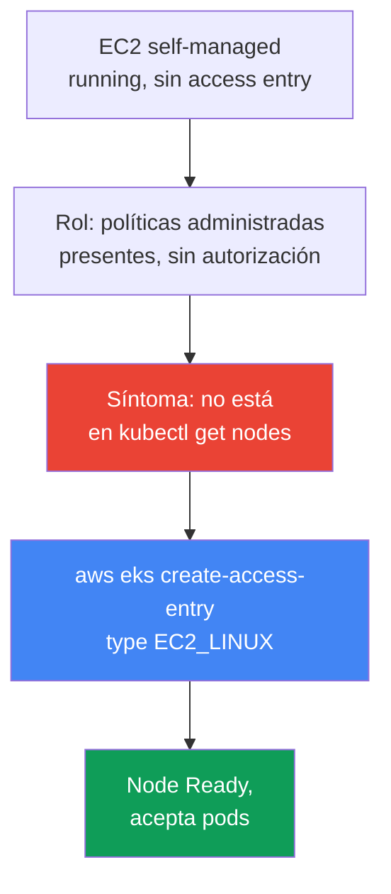
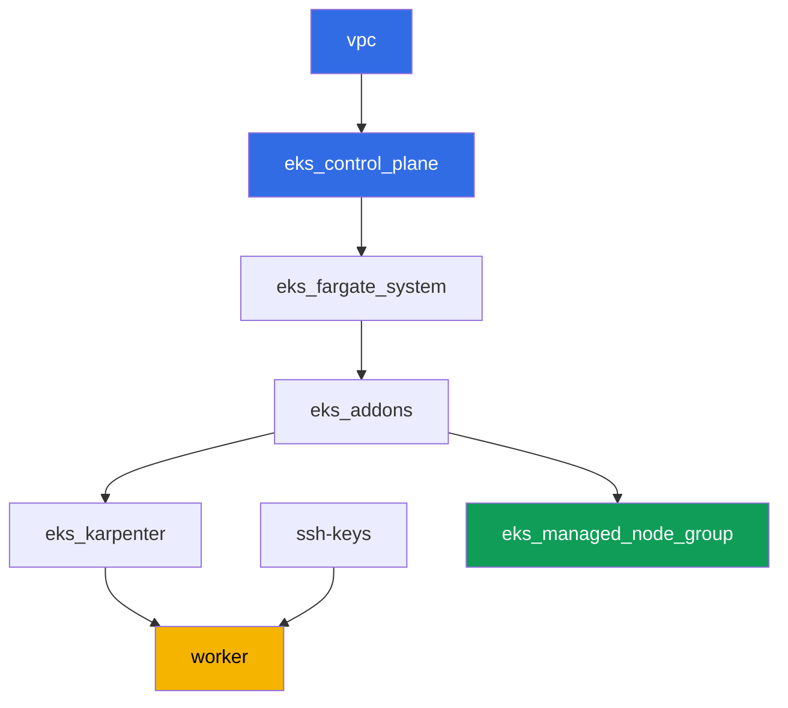

[Русская версия](README_RU.MD) · [Eng version](README.MD) · [Version française](README_FR.MD) · [Deutsche Version](README_DE.MD) · [ქართული ვერსია](README_GE.MD) · [繁體中文版](README_TW.MD) · [日本語版](README_JP.MD)

# Lab 119 - Solución de problemas: el node no alcanza Ready (IAM, SG, user data, kubelet)

## Descripción

En esta lab trabajas en el incidente más común de arranque de EKS: una instancia EC2 se
levanta, pero no hay ningún node en el cluster. El tema es un runbook de diagnóstico, no
un escenario único con infraestructura deliberadamente rota. El managed node group de la
lab permanece healthy todo el tiempo - es tu línea base de normalidad. Reproduces el
síntoma por separado: levantas una instancia EC2 self-managed con una configuración
deliberadamente incompleta (sin access entry en el cluster) y observas el mismo
`kubectl get nodes` vacío mientras la instancia está `running` en EC2. Luego lo arreglas
con `aws eks create-access-entry` y confirmas que el node realmente acepta pods, no que
simplemente queda en estado `Ready`.

Las tareas están escritas en estilo de producción: un enunciado breve más criterios de
aceptación. La verificación es automática, mediante el comando `check_result`.

## Objetivo

Reforzar el capítulo del curso:

- [Capítulo 45. El node no se unió al cluster](../../course/45/es.md) - IAM, SG,
  user data, bootstrap, kubelet, diagnóstico sistemático por capas

## Qué creamos

El cluster ya está desplegado como código (como en la lab 101), y además de Karpenter
tiene un managed node group healthy - una línea base de normalidad para comparar. Creas
un rol de prueba y una instancia self-managed, reproduces el síntoma y lo arreglas.

| Objeto | Qué es | Por qué está en esta lab |
|--------|---------|-------------------|
| Namespace `eks-119` | una sección del cluster para la carga de trabajo de la lab | mantiene los objetos de la lab separados |
| Managed node group `healthy` | un node healthy con autorización automática | línea base de normalidad: `describe-nodegroup` sin issues |
| Rol IAM de prueba | el rol de la instancia self-managed | lleva las mismas tres políticas administradas que el rol del node healthy, pero sin access entry |
| Instancia EC2 self-managed en AL2023 | una instancia con nodeadm/NodeConfig, sin access entry | origen del síntoma: `running`, pero no en `kubectl get nodes` |
| Access entry `EC2_LINUX` | autorización manual del rol en el cluster | arregla el síntoma, el node alcanza `Ready` |
| Pod `probe` | un pod fijado al node arreglado | confirma que el node realmente acepta carga de trabajo |



## Infraestructura

El entorno se despliega en AWS (`eu-central-1`) mediante Terragrunt, como en la lab 101,
más un componente adicional - un managed node group healthy para el inventario de la
tarea 2. La instancia EC2 self-managed de las tareas 3-9 NO está descrita en terraform:
el estudiante la levanta manualmente desde la máquina worker mediante la AWS CLI - ese
es precisamente el sentido de esta lab.

### Módulos y dependencias

| Directorio (componente) | Módulo (`terraform/modules/`) | Depende de | Qué crea |
|---------------------|-------------------------------|------------|-------------|
| `vpc` | `vpc_v3` | - | VPC `10.10.0.0/16`, subredes públicas y privadas en dos AZ, NAT |
| `ssh-keys` | `ssh-keys` | - | un par de claves SSH para la máquina worker y los nodes |
| `eks_control_plane` | `eks_v2_control_plane` | `vpc` | control plane de EKS `1.36`, OIDC, security groups |
| `eks_fargate_system` | `eks_v2_fargate` | `vpc`, `eks_control_plane` | perfil Fargate para `kube-system` y `karpenter` |
| `eks_addons` | `eks_v2_addons` | `eks_control_plane`, `eks_fargate_system` | addons coredns, kube-proxy, vpc-cni, pod-identity |
| `eks_karpenter` | `eks_v2_karpenter` | `vpc`, `eks_control_plane`, `eks_addons`, `eks_fargate_system` | controlador Karpenter, rol IAM de los nodes |
| `eks_karpenter_default_vng` | `eks_v2_karpenter_vng` | `vpc`, `eks_control_plane`, `eks_karpenter` | el NodePool `default` por defecto y EC2NodeClass en AL2023 |
| `eks_managed_node_group` | `eks_v2_mng_healthy` | `vpc`, `eks_control_plane`, `eks_addons` | el managed node group healthy `healthy` - línea base de normalidad |
| `worker` | `eks_v2_work_pc` | `ssh-keys`, `vpc`, `eks_control_plane`, `eks_karpenter` | la máquina worker con kubectl, tests y `check_result` |

Grafo de dependencias (lo que se aplica antes queda más abajo en la flecha):



### El managed node group como línea base de normalidad

`eks_managed_node_group` (módulo `eks_v2_mng_healthy`) crea un rol IAM de node separado
con `AmazonEKSWorkerNodePolicy`, `AmazonEC2ContainerRegistryReadOnly` y
`AmazonEKS_CNI_Policy`, y un managed node group sobre ese rol. Para un managed node
group, EKS mismo crea un access entry de tipo `EC2_LINUX` - por eso ese node siempre
alcanza `Ready`, y `aws eks describe-nodegroup ... health.issues` en la tarea 2 devuelve
una lista vacía. Karpenter (`eks_karpenter_default_vng`) en esta lab permanece funcional
para los pods del sistema, pero las tareas están enfocadas en el managed node group y en
la instancia self-managed, no en Karpenter.

El rol de prueba de la tarea 3 recibe el mismo conjunto de tres políticas administradas,
porque exactamente una cosa debe estar rota en esta lab - el access entry ausente. En
particular, `AmazonEKS_CNI_Policy` es obligatoria: el addon `vpc-cni` en esta lab se
ejecuta sin su propio rol IRSA (`serviceAccountRoleArn` está vacío), así que `aws-node`
toma las credenciales del rol del node. Sin esta política, IPAM no puede asignarle una
dirección al pod, el node permanece `NotReady` con el mensaje `container runtime network
not ready: cni plugin not initialized`, y el síntoma de la tarea 5 se vuelve
indistinguible de una falla completamente distinta.

### Permisos del worker para el escenario self-managed

El rol del worker (`eks_v2_work_pc/iam.tf`) ya sabía gestionar roles IAM de prueba
(`arn:...role/*-test-*`) para otras labs. Para esta lab se añadieron permisos puntuales
sobre el mismo esquema con `-test-`:

- `iam:AttachRolePolicy`/`DetachRolePolicy`/`ListAttachedRolePolicies` en roles
  `*-test-*` - para adjuntar políticas administradas al rol de prueba del node;
- `iam:PassRole` en roles `*-test-*` con la condición
  `iam:PassedToService=ec2.amazonaws.com` - para pasar el rol a la instancia;
- `iam:CreateInstanceProfile`/`DeleteInstanceProfile`/`GetInstanceProfile`/
  `AddRoleToInstanceProfile`/`RemoveRoleFromInstanceProfile`/`TagInstanceProfile` en el
  instance profile `*-test-*`;
- `ec2:RunInstances`/`TerminateInstances`/`CreateTags`, restringidos por la etiqueta
  `Name=*-test-*` en recursos de tipo `instance` y `volume` (la AMI, la subred, el SG y
  el key-pair el worker los recibió sin condición de etiqueta - AWS no soporta
  `RequestTag` en estos tipos de recursos, ver `ExamplePolicies_EC2` en la documentación
  de AWS).

Los permisos son aditivos: no se eliminó nada de las políticas existentes del worker, se
añadieron nuevas entradas `Sid` a la política ya funcional
`TestRoleManagementForLabs`/`SelfManagedNode*`.

## Despliegue

```bash
TASK=119 make run_eks_task
```

El despliegue tarda aproximadamente 15-20 minutos. En la salida, busca la línea con la
conexión SSH a la máquina worker y conéctate a ella. kubectl y la CLI de `aws` ya están
configurados ahí para el cluster y la región correctos.

Comandos útiles en la máquina worker:

```bash
time_left       # cuánto tiempo queda en el entorno
check_result    # verificar la solución
```

> Seguridad del entorno. `env.hcl` tiene habilitados `ssh_password_enable = true` y
> `access_cidrs = ["0.0.0.0/0"]` - esto es conveniente para un entorno de entrenamiento,
> pero no debe hacerse en producción. Según los estándares del curso, el acceso a las
> máquinas worker se abre mediante AWS SSM Session Manager sin puertos SSH públicos
> expuestos, y `access_cidrs` se restringe a direcciones específicas. Aquí el SSH público
> se deja solo por simplicidad de lanzamiento.

## Tareas

---
|        **1**        | **Namespace para la carga de trabajo de la lab**                              |
| :-----------------: | :----------------------------------------------------------- |
| Qué hacer          | Crea un namespace llamado `eks-119`. El pod de prueba de la tarea 8 se crea dentro de él. |
| Criterios de aceptación    | - el namespace `eks-119` existe. |
---
|        **2**        | **Inventario: un managed node group healthy como norma**   |
| :-----------------: | :----------------------------------------------------------- |
| Qué hacer          | Guarda en el archivo `/var/work/tests/artifacts/2/nodegroup_health.txt` la salida de `aws eks describe-nodegroup --query 'nodegroup.health.issues'` para el managed node group de esta lab y la salida de `kubectl get nodes -o wide`. Asegúrate de que `health.issues` sea una lista vacía, y que la lista de nodes tenga al menos uno en `Ready`. |
| Criterios de aceptación    | - el archivo no está vacío;<br/>- `health.issues` está vacío;<br/>- el archivo tiene una línea con el estado `Ready`. |
---
|        **3**        | **Rol IAM de prueba para la instancia self-managed**              |
| :-----------------: | :----------------------------------------------------------- |
| Qué hacer          | Crea un rol IAM (nombre que contenga `-test-`, por ejemplo `eks-task119-test-node`) con una trust policy para `ec2.amazonaws.com`, adjunta `AmazonEKSWorkerNodePolicy`, `AmazonEC2ContainerRegistryReadOnly` y `AmazonEKS_CNI_Policy`, crea un instance profile con el mismo rol. Guarda el ARN del rol en el archivo `/var/work/tests/artifacts/3/test_role_arn.txt`. NO crees un access entry en este paso - esta es la configuración deliberadamente incompleta. |
| Criterios de aceptación    | - el archivo no está vacío, contiene el ARN del rol con `test` en el nombre;<br/>- el rol existe (`aws iam get-role`). |
---
|        **4**        | **Instancia EC2 self-managed en AL2023**                       |
| :-----------------: | :----------------------------------------------------------- |
| Qué hacer          | Obtén la AMI de AL2023 optimizada para EKS para la versión `1.36` mediante SSM (`/aws/service/eks/optimized-ami/1.36/amazon-linux-2023/x86_64/standard/recommended/image_id`). Lanza una instancia EC2 con esta AMI en la subred privada del cluster con el security group de los nodes, el instance profile de la tarea 3 y una etiqueta `Name` que contenga `-test-`. Proporciona la etiqueta en dos secciones `--tag-specifications` - tanto para `ResourceType=instance` como para `ResourceType=volume`: la política del worker permite `RunInstances` bajo la condición `aws:RequestTag/Name`, y el lanzamiento de la instancia también crea un volumen raíz, así que sin una etiqueta en el volumen el lanzamiento es rechazado con `UnauthorizedOperation`. En el user data, pasa un `NodeConfig` para `nodeadm` con `apiServerEndpoint`, `certificateAuthority` y el `cidr` del servicio desde `aws eks describe-cluster`. Guarda el ID de la instancia en el archivo `/var/work/tests/artifacts/4/instance_id.txt`. |
| Criterios de aceptación    | - el archivo no está vacío y contiene un ID de instancia `i-...` válido. |
---
|        **5**        | **Síntoma: `running` en EC2, pero no en `kubectl get nodes`**   |
| :-----------------: | :----------------------------------------------------------- |
| Qué hacer          | Espera 3-5 minutos después de lanzar la instancia. Guarda en el archivo `/var/work/tests/artifacts/5/no_join_symptom.txt` el estado de la instancia de `aws ec2 describe-instances` (debe ser `running`) y la salida de `kubectl get nodes`, en la que esta instancia está ausente. |
| Criterios de aceptación    | - el archivo no está vacío, menciona el ID de la instancia, `running` y `get nodes`. |
---
|        **6**        | **Diagnóstico: qué le falta al rol**                        |
| :-----------------: | :----------------------------------------------------------- |
| Qué hacer          | Ejecuta `aws eks list-access-entries` y confirma que el ARN del rol de la tarea 3 está ausente de la lista. Guarda en el archivo `/var/work/tests/artifacts/6/why_no_access_entry.txt` una explicación: el rol tiene políticas administradas, pero no tiene access entry, por lo que kubelet no pasa la autorización en el cluster. El texto debe contener las palabras `access entry`, `EC2_LINUX` y el ARN propio del rol. |
| Criterios de aceptación    | - el archivo no está vacío, contiene `access entry`, `EC2_LINUX` y el ARN del rol. |
---
|        **7**        | **Arreglo: un access entry de tipo `EC2_LINUX`**                   |
| :-----------------: | :----------------------------------------------------------- |
| Qué hacer          | Ejecuta `aws eks create-access-entry --cluster-name <cluster> --principal-arn <role-arn> --type EC2_LINUX`. Espera a que el node se registre y pase a `Ready` (generalmente 1-2 minutos). El nombre del node en el cluster es el private DNS name de la instancia. Registra el resultado en el archivo `/var/work/tests/artifacts/7/node_ready.txt` línea por línea como `key=value`: `node_name` (private DNS name) y `node_status` (`Ready`). |
| Criterios de aceptación    | - `aws eks describe-access-entry` para el rol de la tarea 3 devuelve `type=EC2_LINUX`;<br/>- el archivo `7/node_ready.txt` contiene el `node_name` de la instancia arreglada y `node_status=Ready`, y mientras el node esté vivo su estado en vivo en el cluster también es `Ready`. |
---
|        **8**        | **Verificación: el node realmente acepta pods**                    |
| :-----------------: | :----------------------------------------------------------- |
| Qué hacer          | `Ready` no es prueba de que el node sea funcional. En el namespace `eks-119`, crea un Pod `probe` (imagen `viktoruj/ping_pong:latest`) con un `nodeSelector` en `kubernetes.io/hostname`, igual al private DNS name de la instancia arreglada. Espera hasta que el pod pase a `Running`, y registra el resultado en el archivo `/var/work/tests/artifacts/8/probe.txt` línea por línea como `key=value`: `pod_phase` (`Running`) y `pod_node` (el mismo nombre de node que en la tarea 7). |
| Criterios de aceptación    | - el archivo `8/probe.txt` contiene `pod_phase=Running` y `pod_node` igual al `node_name` de la tarea 7;<br/>- mientras el pod esté vivo, su `status.phase` y `spec.nodeName` en vivo coinciden con los registrados. |
---
|        **9**        | **Limpieza: terminar la instancia self-managed**                |
| :-----------------: | :----------------------------------------------------------- |
| Qué hacer          | Esta instancia EC2 no forma parte del estado terraform de la lab, `make delete_eks_task` no la tocará. Termina la instancia de la tarea 4 mediante `aws ec2 terminate-instances` y guarda el hecho en el archivo `/var/work/tests/artifacts/9/terminated.txt`. |
| Criterios de aceptación    | - el archivo no está vacío;<br/>- el estado de la instancia es `terminated` o `shutting-down`, o la instancia ya no aparece en `describe-instances` - AWS deja de mostrar las instancias terminadas después de un tiempo, mientras que una en ejecución siempre se muestra. |

> Por qué las tareas 7 y 8 requieren artefactos. Terminar la instancia se lleva tanto el
> objeto Node como el pod `probe`, y `describe-instances` para una instancia terminada
> devuelve un `PrivateDnsName` vacío. En otras palabras, después de la tarea 9 no queda
> ningún estado en vivo, y la verificación depende de lo que registraste en el momento de
> la observación. Esto es exactamente lo que se hace durante los incidentes: capturar la
> evidencia antes de que desaparezca.

---

## Verificación del resultado

En la máquina worker, ejecuta la verificación automática:

```bash
check_result
```

El script ejecuta los tests y muestra el porcentaje de tareas completadas.

## Solución

Solución de referencia: [worker/files/solutions/1_ES.MD](worker/files/solutions/1_ES.MD)

## Limpieza

```bash
TASK=119 make delete_eks_task
```

Importante: la instancia EC2 self-managed, el rol IAM de prueba y el instance profile de
las tareas 3-9 fueron creados manualmente mediante la AWS CLI y NO forman parte del
estado terraform de esta lab. `make delete_eks_task` solo eliminará los componentes de
los directorios de la lab (VPC, cluster, managed node group, etc.). La instancia la
gestiona la tarea 9, pero el rol y el instance profile deben eliminarse antes o después
del destroy por tu cuenta - a diferencia de la instancia, no cuestan dinero, pero su
nombre es estático (`eks-task119-test-node`), así que permanecen en la cuenta de forma
permanente y estorban en la siguiente ejecución de esta misma lab. El access entry
desaparece junto con el cluster, pero debe eliminarse antes que el rol, de lo contrario
la entrada queda colgada de un principal inexistente:

```bash
CLUSTER=$(aws eks list-clusters --query 'clusters[0]' --output text)
ROLE_ARN=$(cat /var/work/tests/artifacts/3/test_role_arn.txt)
aws eks delete-access-entry --cluster-name "$CLUSTER" --principal-arn "$ROLE_ARN"
aws iam remove-role-from-instance-profile --instance-profile-name eks-task119-test-node \
  --role-name eks-task119-test-node
aws iam delete-instance-profile --instance-profile-name eks-task119-test-node
for p in AmazonEKSWorkerNodePolicy AmazonEC2ContainerRegistryReadOnly AmazonEKS_CNI_Policy; do
  aws iam detach-role-policy --role-name eks-task119-test-node \
    --policy-arn arn:aws:iam::aws:policy/$p
done
aws iam delete-role --role-name eks-task119-test-node
```
