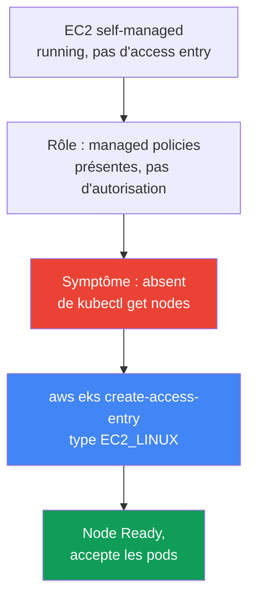
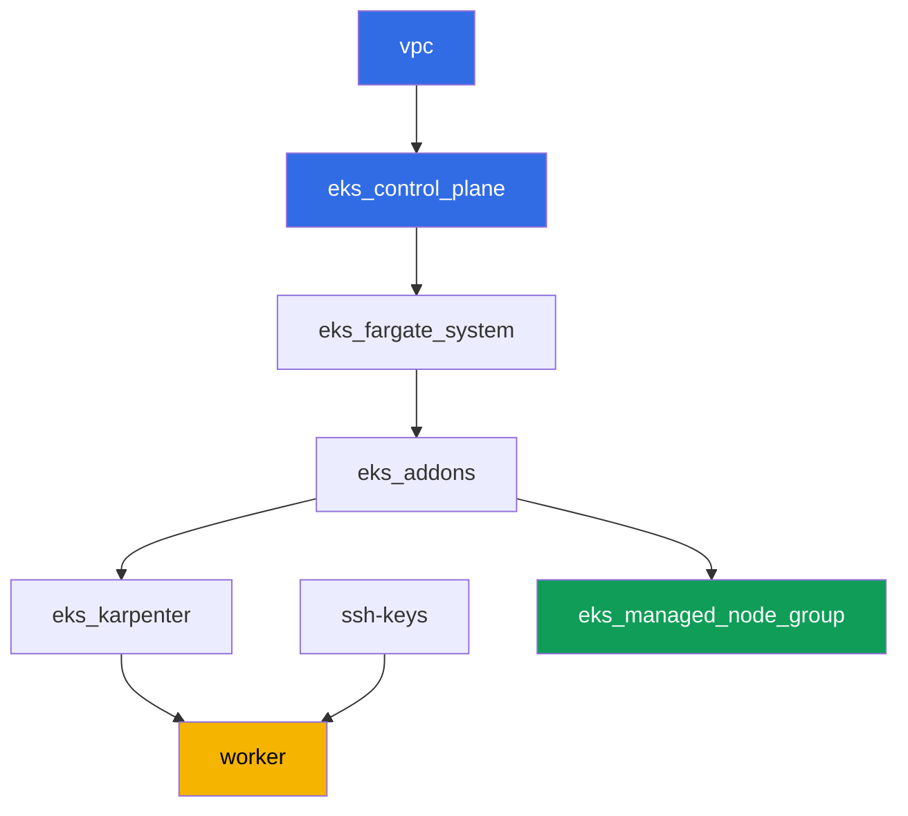

[Русская версия](README_RU.MD) · [Eng version](README.MD) · [Versión en español](README_ES.MD) · [Deutsche Version](README_DE.MD) · [ქართული ვერსია](README_GE.MD) · [繁體中文版](README_TW.MD) · [日本語版](README_JP.MD)

# Lab 119 - Dépannage : le node n'atteint pas Ready (IAM, SG, user data, kubelet)

## Description

Dans cette lab, vous traitez l'incident de lancement EKS le plus courant : une instance
EC2 démarre, mais il n'y a pas de node dans le cluster. Le sujet est un runbook de
diagnostic, pas un scénario unique avec une infrastructure durablement cassée. La
managed node group de la lab reste saine tout le temps - c'est votre référence de
normalité. Vous reproduisez le symptôme séparément : vous créez une instance EC2
self-managed avec une configuration délibérément incomplète (pas d'access entry dans le
cluster) et vous observez exactement le même `kubectl get nodes` vide alors que
l'instance est `running` dans EC2. Ensuite vous corrigez via `aws eks
create-access-entry` et vous confirmez que le node accepte réellement des pods, pas
seulement qu'il reste dans le statut `Ready`.

Les tâches sont écrites dans un style production : un énoncé court plus des critères
d'acceptation. La vérification est automatique, via la commande `check_result`.

## Objectif

Renforcer le chapitre du cours :

- [Chapitre 45. Le node n'a pas rejoint le cluster](../../course/45/ru.md) - IAM, SG,
  user data, bootstrap, kubelet, diagnostic systématique couche par couche

## Ce que nous créons

Le cluster est déjà déployé en code (comme dans la lab 101), et en plus de Karpenter il
dispose d'une managed node group saine - une référence de normalité pour la comparaison.
Vous créez un rôle de test et une instance self-managed, reproduisez le symptôme, et le
corrigez.

| Objet | Ce que c'est | Pourquoi c'est dans cette lab |
|--------|---------|-------------------|
| Namespace `eks-119` | une section du cluster pour la charge de travail de la lab | garde les objets de la lab séparés |
| Managed node group `healthy` | un node sain avec autorisation automatique | référence de normalité : `describe-nodegroup` sans issues |
| Rôle IAM de test | le rôle de l'instance self-managed | porte les trois mêmes managed policies que le rôle du node sain, mais sans access entry |
| Instance EC2 self-managed sur AL2023 | une instance avec nodeadm/NodeConfig, sans access entry | source du symptôme : `running`, mais absente de `kubectl get nodes` |
| Access entry `EC2_LINUX` | autorisation manuelle du rôle dans le cluster | corrige le symptôme, le node atteint `Ready` |
| Pod `probe` | un pod épinglé sur le node corrigé | confirme que le node accepte réellement la charge de travail |



## Infrastructure

L'environnement est déployé dans AWS (`eu-central-1`) via Terragrunt, comme dans la lab
101, plus un composant supplémentaire - une managed node group saine pour l'inventaire de
la tâche 2. L'instance EC2 self-managed des tâches 3-9 n'est PAS décrite en terraform :
l'étudiant la crée manuellement depuis la machine worker via l'AWS CLI - c'est tout
l'intérêt de cette lab.

### Modules et dépendances

| Répertoire (composant) | Module (`terraform/modules/`) | Dépend de | Ce qu'il crée |
|---------------------|-------------------------------|------------|-------------|
| `vpc` | `vpc_v3` | - | VPC `10.10.0.0/16`, subnets publics et privés dans deux AZ, NAT |
| `ssh-keys` | `ssh-keys` | - | une paire de clés SSH pour la machine worker et les nodes |
| `eks_control_plane` | `eks_v2_control_plane` | `vpc` | control plane EKS `1.36`, OIDC, security groups |
| `eks_fargate_system` | `eks_v2_fargate` | `vpc`, `eks_control_plane` | profil Fargate pour `kube-system` et `karpenter` |
| `eks_addons` | `eks_v2_addons` | `eks_control_plane`, `eks_fargate_system` | addons coredns, kube-proxy, vpc-cni, pod-identity |
| `eks_karpenter` | `eks_v2_karpenter` | `vpc`, `eks_control_plane`, `eks_addons`, `eks_fargate_system` | contrôleur Karpenter, rôle IAM du node |
| `eks_karpenter_default_vng` | `eks_v2_karpenter_vng` | `vpc`, `eks_control_plane`, `eks_karpenter` | le NodePool par défaut `default` et l'EC2NodeClass sur AL2023 |
| `eks_managed_node_group` | `eks_v2_mng_healthy` | `vpc`, `eks_control_plane`, `eks_addons` | la managed node group saine `healthy` - référence de normalité |
| `worker` | `eks_v2_work_pc` | `ssh-keys`, `vpc`, `eks_control_plane`, `eks_karpenter` | la machine worker avec kubectl, les tests et `check_result` |

Graphe de dépendances (ce qui est appliqué plus tôt est plus bas sur la flèche) :



### La managed node group comme référence de normalité

`eks_managed_node_group` (module `eks_v2_mng_healthy`) crée un rôle IAM de node séparé
avec `AmazonEKSWorkerNodePolicy`, `AmazonEC2ContainerRegistryReadOnly` et
`AmazonEKS_CNI_Policy`, et une managed node group sur ce rôle. Pour une managed node
group, EKS lui-même crée un access entry de type `EC2_LINUX` - c'est pourquoi un tel node
atteint toujours `Ready`, et `aws eks describe-nodegroup ... health.issues` dans la tâche
2 renvoie une liste vide. Karpenter (`eks_karpenter_default_vng`) dans cette lab reste
fonctionnel pour les pods système, mais les tâches sont centrées sur la managed node
group et sur l'instance self-managed, pas sur Karpenter.

Le rôle de test de la tâche 3 reçoit le même ensemble de trois managed policies, car une
seule chose doit être cassée dans cette lab - l'access entry manquant. En particulier,
`AmazonEKS_CNI_Policy` est obligatoire : l'addon `vpc-cni` dans cette lab fonctionne sans
son propre rôle IRSA (`serviceAccountRoleArn` est vide), donc `aws-node` prend ses
identifiants depuis le rôle du node. Sans cette politique, IPAM ne peut pas attribuer
d'adresse au pod, le node reste `NotReady` avec le message `container runtime network
not ready: cni plugin not initialized`, et le symptôme de la tâche 5 devient
indissociable d'une panne complètement différente.

### Permissions du worker pour le scénario self-managed

Le rôle worker (`eks_v2_work_pc/iam.tf`) pouvait déjà gérer des rôles IAM de test
(`arn:...role/*-test-*`) pour d'autres labs. Pour cette lab, des permissions ciblées ont
été ajoutées sur le même schéma `-test-` :

- `iam:AttachRolePolicy`/`DetachRolePolicy`/`ListAttachedRolePolicies` sur les rôles
  `*-test-*` - pour attacher des managed policies au rôle de test du node ;
- `iam:PassRole` sur les rôles `*-test-*` avec la condition
  `iam:PassedToService=ec2.amazonaws.com` - pour transmettre le rôle à l'instance ;
- `iam:CreateInstanceProfile`/`DeleteInstanceProfile`/`GetInstanceProfile`/
  `AddRoleToInstanceProfile`/`RemoveRoleFromInstanceProfile`/`TagInstanceProfile` sur
  l'instance profile `*-test-*` ;
- `ec2:RunInstances`/`TerminateInstances`/`CreateTags`, restreintes par le tag
  `Name=*-test-*` sur les ressources de type `instance` et `volume` (le worker a reçu
  l'image AMI, le subnet, le SG et la key-pair sans condition de tag - AWS ne supporte
  pas `RequestTag` sur ces types de ressources, voir `ExamplePolicies_EC2` dans la
  documentation AWS).

Les permissions sont additives : rien n'a été retiré des politiques existantes du
worker, de nouvelles entrées `Sid` ont été ajoutées à la politique déjà en place
`TestRoleManagementForLabs`/`SelfManagedNode*`.

## Déploiement

```bash
TASK=119 make run_eks_task
```

Le déploiement prend environ 15-20 minutes. Dans la sortie, trouvez la ligne avec la
connexion SSH à la machine worker et connectez-vous. kubectl et l'`aws` CLI y sont déjà
configurés pour le bon cluster et la bonne région.

Commandes utiles sur la machine worker :

```bash
time_left       # how much time is left in the environment
check_result    # check the solution
```

> Sécurité de l'environnement. `env.hcl` a `ssh_password_enable = true` et
> `access_cidrs = ["0.0.0.0/0"]` activés - c'est pratique pour un environnement de
> formation, mais ne doit pas être fait en production. Selon les standards du cours,
> l'accès aux machines worker est ouvert via AWS SSM Session Manager sans ports SSH
> publics exposés, et `access_cidrs` est restreint à des adresses spécifiques. Ici le SSH
> public est laissé uniquement pour la simplicité du lancement.

## Tâches

---
|        **1**        | **Namespace pour la charge de travail de la lab**                              |
| :-----------------: | :----------------------------------------------------------- |
| Que faire          | Créez un namespace nommé `eks-119`. Le pod de test de la tâche 8 est créé à l'intérieur. |
| Critères d'acceptation    | - le namespace `eks-119` existe. |
---
|        **2**        | **Inventaire : une managed node group saine comme norme**   |
| :-----------------: | :----------------------------------------------------------- |
| Que faire          | Enregistrez dans le fichier `/var/work/tests/artifacts/2/nodegroup_health.txt` la sortie de `aws eks describe-nodegroup --query 'nodegroup.health.issues'` pour la managed node group de cette lab et la sortie de `kubectl get nodes -o wide`. Assurez-vous que `health.issues` est une liste vide, et que la liste des nodes contient au moins un `Ready`. |
| Critères d'acceptation    | - le fichier n'est pas vide;<br/>- `health.issues` est vide;<br/>- le fichier contient une ligne avec le statut `Ready`. |
---
|        **3**        | **Rôle IAM de test pour l'instance self-managed**              |
| :-----------------: | :----------------------------------------------------------- |
| Que faire          | Créez un rôle IAM (nom contenant `-test-`, par exemple `eks-task119-test-node`) avec une trust policy pour `ec2.amazonaws.com`, attachez `AmazonEKSWorkerNodePolicy`, `AmazonEC2ContainerRegistryReadOnly` et `AmazonEKS_CNI_Policy`, créez un instance profile avec le même rôle. Enregistrez l'ARN du rôle dans le fichier `/var/work/tests/artifacts/3/test_role_arn.txt`. NE créez PAS d'access entry à cette étape - c'est la configuration délibérément incomplète. |
| Critères d'acceptation    | - le fichier n'est pas vide, contient l'ARN du rôle avec `test` dans le nom;<br/>- le rôle existe (`aws iam get-role`). |
---
|        **4**        | **Instance EC2 self-managed sur AL2023**                       |
| :-----------------: | :----------------------------------------------------------- |
| Que faire          | Récupérez l'AMI AL2023 optimisée EKS pour la version `1.36` via SSM (`/aws/service/eks/optimized-ami/1.36/amazon-linux-2023/x86_64/standard/recommended/image_id`). Lancez une instance EC2 sur cette AMI dans le subnet privé du cluster avec le security group des nodes, l'instance profile de la tâche 3, et un tag `Name` contenant `-test-`. Fournissez le tag dans deux sections `--tag-specifications` - à la fois pour `ResourceType=instance` et pour `ResourceType=volume` : la politique du worker autorise `RunInstances` sous condition `aws:RequestTag/Name`, et le lancement de l'instance crée aussi un volume racine, donc sans tag sur le volume le lancement est rejeté avec `UnauthorizedOperation`. Dans le user data, passez un `NodeConfig` pour `nodeadm` avec `apiServerEndpoint`, `certificateAuthority` et le service `cidr` provenant de `aws eks describe-cluster`. Enregistrez l'ID de l'instance dans le fichier `/var/work/tests/artifacts/4/instance_id.txt`. |
| Critères d'acceptation    | - le fichier n'est pas vide et contient un ID d'instance `i-...` valide. |
---
|        **5**        | **Symptôme : `running` dans EC2, mais absent de `kubectl get nodes`**   |
| :-----------------: | :----------------------------------------------------------- |
| Que faire          | Attendez 3-5 minutes après le lancement de l'instance. Enregistrez dans le fichier `/var/work/tests/artifacts/5/no_join_symptom.txt` l'état de l'instance issu de `aws ec2 describe-instances` (doit être `running`) et la sortie de `kubectl get nodes`, dans laquelle cette instance est absente. |
| Critères d'acceptation    | - le fichier n'est pas vide, mentionne l'ID de l'instance, `running` et `get nodes`. |
---
|        **6**        | **Diagnostic : ce qui manque au rôle**                        |
| :-----------------: | :----------------------------------------------------------- |
| Que faire          | Exécutez `aws eks list-access-entries` et confirmez que l'ARN du rôle de la tâche 3 est absent de la liste. Enregistrez dans le fichier `/var/work/tests/artifacts/6/why_no_access_entry.txt` une explication : le rôle a des managed policies, mais pas d'access entry, donc kubelet ne passe pas l'autorisation dans le cluster. Le texte doit contenir les mots `access entry`, `EC2_LINUX` et l'ARN du rôle lui-même. |
| Critères d'acceptation    | - le fichier n'est pas vide, contient `access entry`, `EC2_LINUX` et l'ARN du rôle. |
---
|        **7**        | **Correction : un access entry de type `EC2_LINUX`**                   |
| :-----------------: | :----------------------------------------------------------- |
| Que faire          | Exécutez `aws eks create-access-entry --cluster-name <cluster> --principal-arn <role-arn> --type EC2_LINUX`. Attendez que le node s'enregistre et passe à `Ready` (généralement 1-2 minutes). Le nom du node dans le cluster est le private DNS name de l'instance. Enregistrez le résultat dans le fichier `/var/work/tests/artifacts/7/node_ready.txt` ligne par ligne sous la forme `clé=valeur` : `node_name` (private DNS name) et `node_status` (`Ready`). |
| Critères d'acceptation    | - `aws eks describe-access-entry` pour le rôle de la tâche 3 renvoie `type=EC2_LINUX`;<br/>- le fichier `7/node_ready.txt` contient le `node_name` de l'instance corrigée et `node_status=Ready`, et tant que le node est vivant son statut réel dans le cluster est également `Ready`. |
---
|        **8**        | **Vérification : le node accepte réellement des pods**                    |
| :-----------------: | :----------------------------------------------------------- |
| Que faire          | `Ready` n'est pas une preuve que le node est fonctionnel. Dans le namespace `eks-119`, créez un Pod `probe` (image `viktoruj/ping_pong:latest`) avec un `nodeSelector` sur `kubernetes.io/hostname`, égal au private DNS name de l'instance corrigée. Attendez que le pod passe à `Running`, et enregistrez le résultat dans le fichier `/var/work/tests/artifacts/8/probe.txt` ligne par ligne sous la forme `clé=valeur` : `pod_phase` (`Running`) et `pod_node` (le même nom de node que dans la tâche 7). |
| Critères d'acceptation    | - le fichier `8/probe.txt` contient `pod_phase=Running` et `pod_node` égal au `node_name` de la tâche 7;<br/>- tant que le pod est vivant, ses `status.phase` et `spec.nodeName` réels correspondent à ceux enregistrés. |
---
|        **9**        | **Nettoyage : terminer l'instance self-managed**                |
| :-----------------: | :----------------------------------------------------------- |
| Que faire          | Cette instance EC2 ne fait pas partie de l'état terraform de la lab, `make delete_eks_task` n'y touchera pas. Terminez l'instance de la tâche 4 via `aws ec2 terminate-instances` et enregistrez le fait dans le fichier `/var/work/tests/artifacts/9/terminated.txt`. |
| Critères d'acceptation    | - le fichier n'est pas vide;<br/>- l'état de l'instance est `terminated` ou `shutting-down`, ou l'instance a déjà disparu de `describe-instances` - AWS arrête d'afficher les instances terminées après un certain temps, alors qu'une instance en cours d'exécution est toujours affichée. |

> Pourquoi les tâches 7 et 8 exigent des artefacts. Terminer l'instance emporte à la fois
> l'objet Node et le pod `probe`, et `describe-instances` pour une instance terminée
> renvoie un `PrivateDnsName` vide. En d'autres termes, après la tâche 9 il ne reste plus
> aucun état vivant, et la vérification repose sur ce que vous avez enregistré au moment
> de l'observation. C'est exactement ce que l'on fait lors des incidents : capturer les
> preuves avant qu'elles ne disparaissent.

---

## Vérification du résultat

Sur la machine worker, lancez la vérification automatique :

```bash
check_result
```

Le script exécute les tests et affiche le pourcentage de tâches terminées.

## Solution

Solution de référence : [worker/files/solutions/1_FR.MD](worker/files/solutions/1_FR.MD)

## Nettoyage

```bash
TASK=119 make delete_eks_task
```

Important : l'instance EC2 self-managed, le rôle IAM de test et l'instance profile des
tâches 3-9 ont été créés manuellement via l'AWS CLI et ne font PAS partie de l'état
terraform de cette lab. `make delete_eks_task` ne supprimera que les composants des
répertoires de la lab (VPC, cluster, managed node group, etc.). L'instance est gérée par
la tâche 9, mais le rôle et l'instance profile doivent être supprimés avant ou après le
destroy, de votre propre initiative - contrairement à l'instance, ils ne coûtent rien,
mais leur nom est statique (`eks-task119-test-node`), donc ils restent dans le compte de
façon permanente et gênent la prochaine exécution de cette même lab. L'access entry
disparaît avec le cluster, mais il doit être supprimé avant le rôle, sinon l'entrée reste
accrochée à un principal inexistant :

```bash
CLUSTER=$(aws eks list-clusters --query 'clusters[0]' --output text)
ROLE_ARN=$(cat /var/work/tests/artifacts/3/test_role_arn.txt)
aws eks delete-access-entry --cluster-name "$CLUSTER" --principal-arn "$ROLE_ARN"
aws iam remove-role-from-instance-profile --instance-profile-name eks-task119-test-node \
  --role-name eks-task119-test-node
aws iam delete-instance-profile --instance-profile-name eks-task119-test-node
for p in AmazonEKSWorkerNodePolicy AmazonEC2ContainerRegistryReadOnly AmazonEKS_CNI_Policy; do
  aws iam detach-role-policy --role-name eks-task119-test-node \
    --policy-arn arn:aws:iam::aws:policy/$p
done
aws iam delete-role --role-name eks-task119-test-node
```
