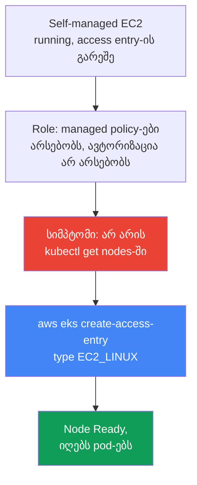
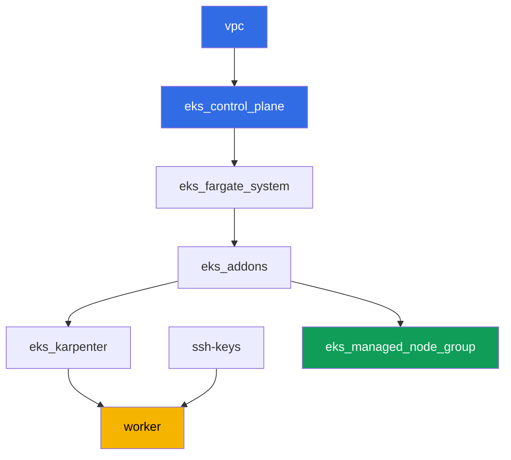

[Русская версия](README_RU.MD) · [Eng version](README.MD) · [Versión en español](README_ES.MD) · [Version française](README_FR.MD) · [Deutsche Version](README_DE.MD) · [繁體中文版](README_TW.MD) · [日本語版](README_JP.MD)

# ლაბა 119 - Troubleshooting: node არ აღწევს Ready-ს (IAM, SG, user data, kubelet)

## აღწერა

ამ ლაბაში ხედავთ EKS-ის გაშვების ყველაზე ხშირ ინციდენტს: EC2-ინსტანსი ამოდის, მაგრამ
node კლასტერში არ არის. თემა - დიაგნოსტიკური runbook-ია, არა ერთი სცენარი მკვეთრად
დამტვრეული ინფრასტრუქტურით. ლაბის managed node group მთელი დროის განმავლობაში ჯანსაღი
რჩება - ეს არის თქვენი ნორმის ნიმუში. სიმპტომს ცალკე იმეორებთ: ტოვებთ ერთ self-managed
EC2-ინსტანსს განზრახ არასრული კონფიგურაციით (access entry-ის გარეშე კლასტერში) და
ხედავთ ზუსტად იმ ცარიელ `kubectl get nodes`-ს, სანამ ინსტანსი EC2-ში `running`-ია. შემდეგ
ჩაასწორებთ `aws eks create-access-entry`-ის მეშვეობით და დაადასტურებთ, რომ node-ი
რეალურად იღებს pod-ებს, არა უბრალოდ დგება `Ready` სტატუსში.

დავალებები დაწერილია production-სტილში: მოკლე დებულება პლუს მიღების კრიტერიუმები.
შემოწმება ავტომატურია, ბრძანებით `check_result`.

## მიზანი

გავიმყაროთ კურსის თავის მასალა:

- [თავი 45. Node არ შეერთდა კლასტერს](../../course/45/ge.md) - IAM, SG, user data,
  bootstrap, kubelet, სისტემატური დიაგნოსტიკა შრეების მიხედვით

## რას ვქმნით

კლასტერი უკვე გაშლილია კოდის სახით (როგორც ლაბა 101-ში), და Karpenter-ის დამატებით მას
ჰყავს ჯანსაღი managed node group - ნორმის ნიმუში შედარებისთვის. ქმნით ტესტურ role-ს და
ერთ self-managed ინსტანსს, იმეორებთ სიმპტომს და ჩაასწორებთ.

| ობიექტი | რას წარმოადგენს | რატომ არის ამ ლაბაში |
|--------|---------|-------------------|
| Namespace `eks-119` | კლასტერის ნაწილი ლაბის დატვირთვისთვის | ლაბის ობიექტებს ცალკე ვაწესებთ |
| Managed node group `healthy` | ჯანსაღი node ავტომატური ავტორიზაციით | ნორმის ნიმუში: `describe-nodegroup` issues-ის გარეშე |
| ტესტური IAM role | self-managed ინსტანსის role | ატარებს იმავე სამ managed policy-ს, რაც ჯანსაღი node-ის role, მაგრამ access entry-ის გარეშე |
| Self-managed EC2-ინსტანსი AL2023-ზე | ინსტანსი nodeadm/NodeConfig-ით, access entry-ის გარეშე | სიმპტომის წყარო: `running`, მაგრამ არ არის `kubectl get nodes`-ში |
| Access entry `EC2_LINUX` | role-ის ხელით ავტორიზაცია კლასტერში | ჩაასწორებს სიმპტომს, node-ი აღწევს `Ready`-ს |
| Pod `probe` | pod, მიბმული ჩასწორებულ node-ზე | ადასტურებს, რომ node-ი რეალურად იღებს დატვირთვას |



## ინფრასტრუქტურა

გარემო იშლება AWS-ში (`eu-central-1`) Terragrunt-ის მეშვეობით, როგორც ლაბა 101-ში, პლუს
ერთი დამატებითი კომპონენტი - ჯანსაღი managed node group ინვენტარიზაციისთვის დავალება
2-ში. Self-managed EC2-ინსტანსი დავალებებიდან 3-9 terraform-ში აღწერილი არ არის:
სტუდენტი მას ხელით ტოვებს worker მანქანიდან AWS CLI-ის მეშვეობით - ეს არის ამ ლაბის
მთელი აზრი.

### მოდულები და დამოკიდებულებები

| დირექტორია (კომპონენტი) | მოდული (`terraform/modules/`) | დამოკიდებულია | რას ქმნის |
|---------------------|-------------------------------|------------|-------------|
| `vpc` | `vpc_v3` | - | VPC `10.10.0.0/16`, საჯარო და პრივატული subnets ორ AZ-ში, NAT |
| `ssh-keys` | `ssh-keys` | - | SSH-გასაღებების წყვილი worker მანქანისთვის და node-ებისთვის |
| `eks_control_plane` | `eks_v2_control_plane` | `vpc` | EKS control plane `1.36`, OIDC, security groups |
| `eks_fargate_system` | `eks_v2_fargate` | `vpc`, `eks_control_plane` | Fargate profile `kube-system`-ისთვის და `karpenter`-ისთვის |
| `eks_addons` | `eks_v2_addons` | `eks_control_plane`, `eks_fargate_system` | add-on-ები coredns, kube-proxy, vpc-cni, pod-identity |
| `eks_karpenter` | `eks_v2_karpenter` | `vpc`, `eks_control_plane`, `eks_addons`, `eks_fargate_system` | Karpenter კონტროლერი, node-ის IAM role |
| `eks_karpenter_default_vng` | `eks_v2_karpenter_vng` | `vpc`, `eks_control_plane`, `eks_karpenter` | ნაგულისხმევი NodePool `default` და EC2NodeClass AL2023-ზე |
| `eks_managed_node_group` | `eks_v2_mng_healthy` | `vpc`, `eks_control_plane`, `eks_addons` | ჯანსაღი managed node group `healthy` - ნორმის ნიმუში |
| `worker` | `eks_v2_work_pc` | `ssh-keys`, `vpc`, `eks_control_plane`, `eks_karpenter` | worker მანქანა kubectl-ით, ტესტებით და `check_result`-ით |

დამოკიდებულების გრაფი (რაც უფრო ადრე გამოიყენება, ისე უფრო დაბლაა ისარზე):



### Managed node group როგორც ნორმის ნიმუში

`eks_managed_node_group` (მოდული `eks_v2_mng_healthy`) ქმნის ცალკე node-ის IAM role-ს
`AmazonEKSWorkerNodePolicy`, `AmazonEC2ContainerRegistryReadOnly` და
`AmazonEKS_CNI_Policy`-ით, და managed node group-ს ამ role-ზე. Managed node group-ისთვის
EKS თავად ქმნის access entry-ს ტიპით `EC2_LINUX` - ამიტომ ასეთი node ყოველთვის აღწევს
`Ready`-ს, და `aws eks describe-nodegroup ... health.issues` დავალება 2-ში აბრუნებს
ცარიელ სიას. Karpenter (`eks_karpenter_default_vng`) ამ ლაბაში რჩება მუშა სისტემური
pod-ებისთვის, მაგრამ დავალებები ფოკუსირებულია managed node group-ზე და self-managed
ინსტანსზე, არა Karpenter-ზე.

ტესტური role დავალება 3-იდან იღებს იმავე სამ managed policy-ს, რადგან ამ ლაბაში ზუსტად
ერთი რამ უნდა იყოს დამტვრეული - access entry-ის არარსებობა. კონკრეტულად,
`AmazonEKS_CNI_Policy` სავალდებულოა: `vpc-cni` add-on ამ ლაბაში მუშაობს საკუთარი
IRSA role-ის გარეშე (`serviceAccountRoleArn` ცარიელია), ამიტომ `aws-node` credentials-ს
იღებს node-ის role-იდან. ამ policy-ის გარეშე IPAM-ს არ შეუძლია pod-ს მისცეს მისამართი,
node-ი რჩება `NotReady`-ში შეტყობინებით `container runtime network not ready: cni
plugin not initialized`, და დავალება 5-ის სიმპტომი ხდება არგანსხვავებული სულ სხვა
დანგრევისგან.

### Worker-ის უფლებები self-managed სცენარისთვის

Worker-ის role-ს (`eks_v2_work_pc/iam.tf`) უკვე შეეძლო ტესტური IAM role-ების მართვა
(`arn:...role/*-test-*`) სხვა ლაბებისთვის. ამ ლაბისთვის დამატებულია მიზანმიმართული
უფლებები იმავე `-test-` სქემის თანხმად:

- `iam:AttachRolePolicy`/`DetachRolePolicy`/`ListAttachedRolePolicies` `*-test-*`
  role-ებზე - ტესტური node role-ზე managed policy-ების დასამაგრებლად;
- `iam:PassRole` `*-test-*` role-ებზე პირობით `iam:PassedToService=ec2.amazonaws.com` -
  role-ის ინსტანსზე გადასაცემად;
- `iam:CreateInstanceProfile`/`DeleteInstanceProfile`/`GetInstanceProfile`/
  `AddRoleToInstanceProfile`/`RemoveRoleFromInstanceProfile`/`TagInstanceProfile`
  `*-test-*` instance profile-ზე;
- `ec2:RunInstances`/`TerminateInstances`/`CreateTags`, შეზღუდული ტეგით
  `Name=*-test-*` `instance` და `volume` ტიპის რესურსებზე (worker-მა AMI-ის image,
  subnet, SG და key-pair მიიღო ტეგის პირობის გარეშე - AWS არ უჭერს მხარს
  `RequestTag`-ს ამ ტიპის რესურსებზე, იხილეთ `ExamplePolicies_EC2` AWS-ის
  დოკუმენტაციაში).

უფლებები დამატებითია: worker-ის არსებული policy-დან არაფერი წაშლილა, ახალი `Sid`
ჩანაწერები დაემატა უკვე მუშა `TestRoleManagementForLabs`/`SelfManagedNode*`
policy-ს.

## გაშლა

```bash
TASK=119 make run_eks_task
```

გაშლას სჭირდება დაახლოებით 15-20 წუთი. გამონატანში იპოვეთ სტრიქონი worker მანქანასთან
SSH-კავშირით და დაუკავშირდით მას. kubectl და `aws` CLI იქ უკვე კონფიგურირებულია სწორ
კლასტერზე და რეგიონზე.

სასარგებლო ბრძანებები worker მანქანაზე:

```bash
time_left       # რამდენი დროა დარჩენილი გარემოს
check_result    # გადაწყვეტის შემოწმება
```

> სავარჯიშო სტენდის უსაფრთხოება. `env.hcl`-ში ჩართულია `ssh_password_enable = true`
> და `access_cidrs = ["0.0.0.0/0"]` - მოხერხებულია სასწავლო გარემოსთვის, მაგრამ ასე
> არ ღირს production-ში. კურსის სტანდარტების მიხედვით, worker მანქანებზე წვდომა
> იხსნება AWS SSM Session Manager-ის მეშვეობით საჯარო SSH პორტების გარეშე, ხოლო
> `access_cidrs` ვიწროვდება კონკრეტულ მისამართებზე. აქ საჯარო SSH დატანილია მხოლოდ
> გაშვების სიმარტივისთვის.

## დავალებები

---
|        **1**        | **Namespace ლაბის დატვირთვისთვის**                              |
| :-----------------: | :----------------------------------------------------------- |
| რას ვაკეთებთ          | შექმენით namespace სახელით `eks-119`. საცდელი pod დავალება 8-იდან იქმნება მის შიგნით. |
| მიღების კრიტერიუმები    | - namespace `eks-119` არსებობს. |
---
|        **2**        | **ინვენტარიზაცია: ჯანსაღი managed node group როგორც ნორმა**   |
| :-----------------: | :----------------------------------------------------------- |
| რას ვაკეთებთ          | შეინახეთ ფაილში `/var/work/tests/artifacts/2/nodegroup_health.txt` `aws eks describe-nodegroup --query 'nodegroup.health.issues'`-ის გამონატანი ამ ლაბის managed node group-ისთვის და `kubectl get nodes -o wide`-ის გამონატანი. დარწმუნდით, რომ `health.issues` ცარიელი სია არის, ხოლო node-ების სიაში არსებობს მინიმუმ ერთი `Ready`. |
| მიღების კრიტერიუმები    | - ფაილი არ არის ცარიელი;<br/>- `health.issues` ცარიელია;<br/>- ფაილში არსებობს სტრიქონი სტატუსით `Ready`. |
---
|        **3**        | **ტესტური IAM role self-managed ინსტანსისთვის**              |
| :-----------------: | :----------------------------------------------------------- |
| რას ვაკეთებთ          | შექმენით IAM role (სახელი `-test-`-ით, მაგალითად `eks-task119-test-node`) trust policy-ით `ec2.amazonaws.com`-ზე, დამაგრეთ `AmazonEKSWorkerNodePolicy`, `AmazonEC2ContainerRegistryReadOnly` და `AmazonEKS_CNI_Policy`, შექმენით instance profile იმავე role-ით. შეინახეთ role-ის ARN ფაილში `/var/work/tests/artifacts/3/test_role_arn.txt`. ამ ეტაპზე access entry არ შექმნათ - ეს არის განზრახ არასრული კონფიგურაცია. |
| მიღების კრიტერიუმები    | - ფაილი არ არის ცარიელი, შეიცავს role-ის ARN-ს `test` სახელში;<br/>- role არსებობს (`aws iam get-role`). |
---
|        **4**        | **Self-managed EC2-ინსტანსი AL2023-ზე**                       |
| :-----------------: | :----------------------------------------------------------- |
| რას ვაკეთებთ          | მიიღეთ EKS-ოპტიმიზირებული AL2023 AMI ვერსია `1.36`-ისთვის SSM-ის მეშვეობით (`/aws/service/eks/optimized-ami/1.36/amazon-linux-2023/x86_64/standard/recommended/image_id`). გაუშვით ერთი EC2-ინსტანსი ამ AMI-ზე კლასტერის პრივატულ subnet-ში node-ების security group-ით, instance profile-ით დავალება 3-იდან და `Name` ტეგით, რომელიც შეიცავს `-test-`-ს. ტეგი მიუთითეთ ორ `--tag-specifications` სექციაში - როგორც `ResourceType=instance`-ისთვის, ისე `ResourceType=volume`-ისთვის: worker-ის policy უშვებს `RunInstances`-ს `aws:RequestTag/Name` პირობით, ხოლო ინსტანსის გაშვება ასევე ქმნის root ტომს, ამიტომ ტომზე ტეგის გარეშე გაშვება უკუიგდება `UnauthorizedOperation`-ით. User data-ში გადაეცით `NodeConfig` `nodeadm`-ისთვის `apiServerEndpoint`, `certificateAuthority` და service `cidr`-ით `aws eks describe-cluster`-იდან. შეინახეთ ინსტანსის ID ფაილში `/var/work/tests/artifacts/4/instance_id.txt`. |
| მიღების კრიტერიუმები    | - ფაილი არ არის ცარიელი და შეიცავს ვალიდურ `i-...` ინსტანსის ID-ს. |
---
|        **5**        | **სიმპტომი: `running` EC2-ში, მაგრამ არ არის `kubectl get nodes`-ში**   |
| :-----------------: | :----------------------------------------------------------- |
| რას ვაკეთებთ          | დაელოდეთ 3-5 წუთი ინსტანსის გაშვების შემდეგ. შეინახეთ ფაილში `/var/work/tests/artifacts/5/no_join_symptom.txt` ინსტანსის state `aws ec2 describe-instances`-იდან (უნდა იყოს `running`) და `kubectl get nodes`-ის გამონატანი, სადაც ეს ინსტანსი არ არსებობს. |
| მიღების კრიტერიუმები    | - ფაილი არ არის ცარიელი, ახსენებს ინსტანსის ID-ს, `running`-ს და `get nodes`-ს. |
---
|        **6**        | **დიაგნოსტიკა: რას არ ჰყოფნის role-ს**                        |
| :-----------------: | :----------------------------------------------------------- |
| რას ვაკეთებთ          | გაუშვით `aws eks list-access-entries` და დარწმუნდით, რომ role-ის ARN დავალება 3-იდან სიაში არ არსებობს. შეინახეთ ფაილში `/var/work/tests/artifacts/6/why_no_access_entry.txt` განმარტება: role-ს ჰყავს managed policy-ები, მაგრამ არ აქვს access entry, ამიტომ kubelet არ გადის ავტორიზაციას კლასტერში. ტექსტში უნდა იყოს სიტყვები `access entry`, `EC2_LINUX` და თავად role-ის ARN. |
| მიღების კრიტერიუმები    | - ფაილი არ არის ცარიელი, შეიცავს `access entry`-ს, `EC2_LINUX`-ს და role-ის ARN-ს. |
---
|        **7**        | **ჩასწორება: access entry ტიპით `EC2_LINUX`**                   |
| :-----------------: | :----------------------------------------------------------- |
| რას ვაკეთებთ          | გაუშვით `aws eks create-access-entry --cluster-name <cluster> --principal-arn <role-arn> --type EC2_LINUX`. დაელოდეთ, სანამ node დაირეგისტრირდება და გადავალს `Ready`-ში (ჩვეულებრივ 1-2 წუთი). Node-ის სახელი კლასტერში - ინსტანსის private DNS name-ია. ჩაწერეთ შედეგი ფაილში `/var/work/tests/artifacts/7/node_ready.txt` სტრიქონ-სტრიქონ `key=value` სახით: `node_name` (private DNS name) და `node_status` (`Ready`). |
| მიღების კრიტერიუმები    | - `aws eks describe-access-entry` role-ისთვის დავალება 3-იდან აბრუნებს `type=EC2_LINUX`-ს;<br/>- ფაილი `7/node_ready.txt` შეიცავს ჩასწორებული ინსტანსის `node_name`-ს და `node_status=Ready`-ს, და სანამ node ცოცხალია, მისი ცოცხალი სტატუსი კლასტერშიც `Ready`-ია. |
---
|        **8**        | **გადამოწმება: node-ი რეალურად იღებს pod-ებს**                    |
| :-----------------: | :----------------------------------------------------------- |
| რას ვაკეთებთ          | `Ready` არ არის მტკიცებულება იმისა, რომ node-ი მუშაა. Namespace `eks-119`-ში შექმენით Pod `probe` (image `viktoruj/ping_pong:latest`) `nodeSelector`-ით `kubernetes.io/hostname`-ზე, ტოლი ჩასწორებული ინსტანსის private DNS name-ის. დაელოდეთ, სანამ pod გადავალს `Running`-ში, და ჩაწერეთ შედეგი ფაილში `/var/work/tests/artifacts/8/probe.txt` სტრიქონ-სტრიქონ `key=value` სახით: `pod_phase` (`Running`) და `pod_node` (იგივე node-ის სახელი, რაც დავალება 7-ში). |
| მიღების კრიტერიუმები    | - ფაილი `8/probe.txt` შეიცავს `pod_phase=Running`-ს და `pod_node`-ს, ტოლი `node_name`-ის დავალება 7-იდან;<br/>- სანამ pod ცოცხალია, მისი ცოცხალი `status.phase` და `spec.nodeName` ემთხვევა ჩაწერილს. |
---
|        **9**        | **დასუფთავება: self-managed ინსტანსის terminate**                |
| :-----------------: | :----------------------------------------------------------- |
| რას ვაკეთებთ          | ეს EC2-ინსტანსი არ შედის ლაბის terraform state-ში, `make delete_eks_task` მას არ ეხება. Terminate-ე ინსტანსი დავალება 4-იდან `aws ec2 terminate-instances`-ის მეშვეობით და შეინახეთ ფაქტი ფაილში `/var/work/tests/artifacts/9/terminated.txt`. |
| მიღების კრიტერიუმები    | - ფაილი არ არის ცარიელი;<br/>- ინსტანსის state არის `terminated` ან `shutting-down`, ან ინსტანსი უკვე არ არსებობს `describe-instances`-ში - AWS terminated ინსტანსების ჩვენებას გარკვეული დროის შემდეგ ჩერდება, ხოლო მუშა ინსტანსს ყოველთვის აჩვენებს. |

> რატომ საჭიროებს დავალება 7 და 8 არტეფაქტს. ინსტანსის terminate-მა ერთად წაიღოს Node
> ობიექტი და pod `probe`, ხოლო terminated ინსტანსისთვის `describe-instances` აბრუნებს
> ცარიელ `PrivateDnsName`-ს. სხვა სიტყვებით, დავალება 9-ის შემდეგ ცოცხალი მდგომარეობა
> უკვე არ არსებობს, და შემოწმება იმას ეყრდნობა, რაც დაკვირვების მომენტში ჩაწერეთ. ეს
> ზუსტად ის არის, რასაც ინციდენტების დროს აკეთებენ: ფიქსირებენ მტკიცებულებას, სანამ
> ის გაქრება.

---

## შედეგის შემოწმება

worker მანქანაზე გაუშვით ავტომატური შემოწმება:

```bash
check_result
```

სკრიპტი გაუშვებს ტესტებს და აჩვენებს დასრულებული დავალებების პროცენტს.

## გადაწყვეტა

ეტალონური გადაწყვეტა: [worker/files/solutions/1_GE.MD](worker/files/solutions/1_GE.MD)

## წაშლა

```bash
TASK=119 make delete_eks_task
```

მნიშვნელოვანია: self-managed EC2-ინსტანსი, ტესტური IAM role და instance profile
დავალებებიდან 3-9 შექმნილია ხელით AWS CLI-ის მეშვეობით და ᲐᲠ შედის ამ ლაბის terraform
state-ში. `make delete_eks_task` მოაშორებს მხოლოდ ლაბის დირექტორიების კომპონენტებს
(VPC, კლასტერი, managed node group და ასე შემდეგ). ინსტანსს ხურავს დავალება 9, ხოლო
role და instance profile საჭიროა მოშორება destroy-ის წინ ან შემდეგ თავადვე - ინსტანსის
საწინააღმდეგოდ, ისინი ფულს არ ხარჯავენ, მაგრამ მათი სახელი სტატიკურია
(`eks-task119-test-node`), ამიტომ ისინი აკაუნტში სამუდამოდ რჩებიან და ხელს უშლიან ამავე
ლაბის შემდეგ გაშვებას. Access entry გაქრება კლასტერთან ერთად, მაგრამ ის უნდა მოშორდეს
role-ის წინ, სხვანაირად ჩანაწერი დაკიდებული დარჩება არარსებულ principal-ზე:

```bash
CLUSTER=$(aws eks list-clusters --query 'clusters[0]' --output text)
ROLE_ARN=$(cat /var/work/tests/artifacts/3/test_role_arn.txt)
aws eks delete-access-entry --cluster-name "$CLUSTER" --principal-arn "$ROLE_ARN"
aws iam remove-role-from-instance-profile --instance-profile-name eks-task119-test-node \
  --role-name eks-task119-test-node
aws iam delete-instance-profile --instance-profile-name eks-task119-test-node
for p in AmazonEKSWorkerNodePolicy AmazonEC2ContainerRegistryReadOnly AmazonEKS_CNI_Policy; do
  aws iam detach-role-policy --role-name eks-task119-test-node \
    --policy-arn arn:aws:iam::aws:policy/$p
done
aws iam delete-role --role-name eks-task119-test-node
```
