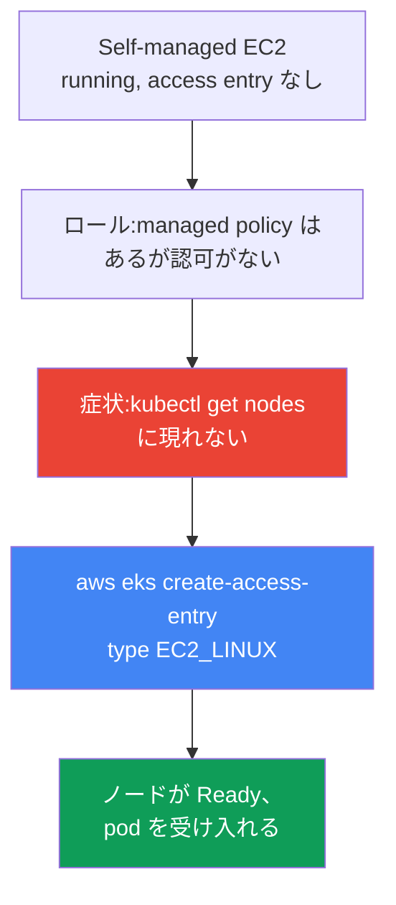
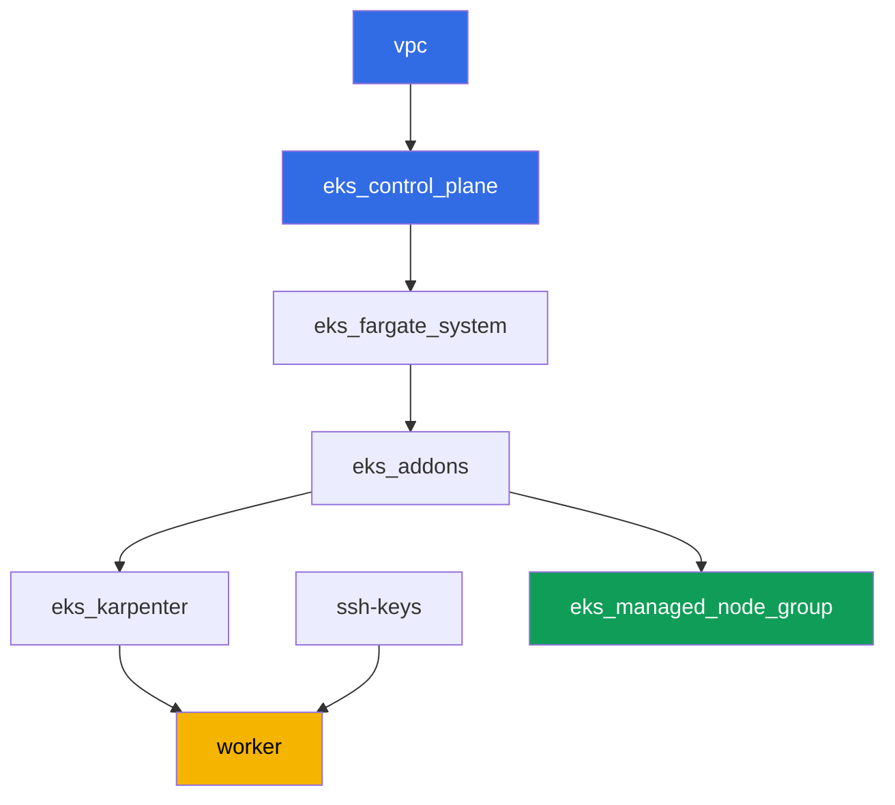

[Русская версия](README_RU.MD) · [Eng version](README.MD) · [Versión en español](README_ES.MD) · [Version française](README_FR.MD) · [Deutsche Version](README_DE.MD) · [ქართული ვერსია](README_GE.MD) · [繁體中文版](README_TW.MD)

# ラボ 119 - トラブルシューティング:ノードが Ready に到達しない(IAM、SG、user data、kubelet)

## 説明

このラボでは、EKS 起動時に最も頻繁に発生するインシデントを解き明かします:EC2 インス
タンスは立ち上がるのに、クラスタにノードが現れないというものです。テーマは診断
runbook であり、インフラを一つだけ壊した単一シナリオではありません。このラボの
managed node group は最初から最後まで健全な状態を保ちます - これがあなたの正常の基準
です。症状は別に再現します:access entry がクラスタに存在しないという、あえて不完全な
設定のまま 1 台の self-managed EC2 インスタンスを立ち上げ、EC2 上では `running` である
にもかかわらず `kubectl get nodes` が空のままという、まったく同じ症状を観察します。そ
の後 `aws eks create-access-entry` で修復し、ノードが単に `Ready` の状態にとどまってい
るだけでなく、実際に pod を受け入れることを確認します。

タスクは production スタイルで書かれています:短い課題文とアクセプタンス基準。検証は
`check_result` コマンドによって自動的に行われます。

## 目的

コースの以下の章の内容を定着させます:

- [第 45 章。ノードがクラスタに参加しなかった](../../course/45/ru.md) - IAM、SG、
  user data、bootstrap、kubelet、層ごとの体系的な診断

## 作成するもの

クラスタはすでにコードとしてデプロイされており(ラボ 101 と同様)、Karpenter に加えて
健全な managed node group があります - 比較のための正常の基準です。あなたはテスト用の
ロールと 1 台の self-managed インスタンスを作成し、症状を再現してから修復します。

| オブジェクト | 何か | このラボでの目的 |
|--------|---------|-------------------|
| Namespace `eks-119` | ラボのワークロード用のクラスタ内の区分 | ラボのオブジェクトを分離して保つ |
| Managed node group `healthy` | 自動認可を持つ健全なノード | 正常の基準:issues のない `describe-nodegroup` |
| テスト用 IAM ロール | self-managed インスタンスのロール | 健全なノードのロールと同じ 3 つの managed policy を持つが、access entry はない |
| AL2023 上の self-managed EC2 インスタンス | access entry のない、nodeadm/NodeConfig を持つインスタンス | 症状の発生源:`running` だが `kubectl get nodes` にはない |
| Access entry `EC2_LINUX` | クラスタ内でロールを手動で認可する | 症状を修復し、ノードが `Ready` に到達する |
| Pod `probe` | 修復されたノードに固定された pod | ノードが実際にワークロードを受け入れることを確認する |



## インフラストラクチャ

環境はラボ 101 と同様に、Terragrunt によって AWS(`eu-central-1`)にデプロイされ、加え
てタスク 2 のインベントリ用に健全な managed node group という追加コンポーネントが 1 つ
あります。タスク 3-9 の self-managed EC2 インスタンスは terraform には記述されていま
せん:このラボの要点そのものとして、学生がワーカーマシンから AWS CLI 経由で手動で立ち
上げます。

### モジュールと依存関係

| ディレクトリ(コンポーネント) | モジュール(`terraform/modules/`) | 依存先 | 作成されるもの |
|---------------------|-------------------------------|------------|-------------|
| `vpc` | `vpc_v3` | - | VPC `10.10.0.0/16`、2 つの AZ にある public subnet と private subnet、NAT |
| `ssh-keys` | `ssh-keys` | - | ワーカーマシンとノード用の SSH キーペア |
| `eks_control_plane` | `eks_v2_control_plane` | `vpc` | EKS control plane `1.36`、OIDC、security groups |
| `eks_fargate_system` | `eks_v2_fargate` | `vpc`、`eks_control_plane` | `kube-system` と `karpenter` 用の Fargate profile |
| `eks_addons` | `eks_v2_addons` | `eks_control_plane`、`eks_fargate_system` | coredns、kube-proxy、vpc-cni、pod-identity アドオン |
| `eks_karpenter` | `eks_v2_karpenter` | `vpc`、`eks_control_plane`、`eks_addons`、`eks_fargate_system` | Karpenter コントローラ、ノードの IAM ロール |
| `eks_karpenter_default_vng` | `eks_v2_karpenter_vng` | `vpc`、`eks_control_plane`、`eks_karpenter` | AL2023 上のデフォルト NodePool `default` と EC2NodeClass |
| `eks_managed_node_group` | `eks_v2_mng_healthy` | `vpc`、`eks_control_plane`、`eks_addons` | 健全な managed node group `healthy` - 正常の基準 |
| `worker` | `eks_v2_work_pc` | `ssh-keys`、`vpc`、`eks_control_plane`、`eks_karpenter` | kubectl、テスト、`check_result` を備えたワーカーマシン |

依存関係グラフ(先に適用されるものほど矢印の下側にある):



### 正常の基準としての managed node group

`eks_managed_node_group`(モジュール `eks_v2_mng_healthy`)は、`AmazonEKSWorkerNodePolicy`、
`AmazonEC2ContainerRegistryReadOnly`、`AmazonEKS_CNI_Policy` を持つ専用のノード IAM ロー
ルを作成し、そのロール上に managed node group を作成します。managed node group につい
ては EKS 自身が `EC2_LINUX` 型の access entry を作成します - そのため、このようなノー
ドは常に `Ready` に到達し、タスク 2 の `aws eks describe-nodegroup ... health.issues`
は空のリストを返します。このラボの Karpenter(`eks_karpenter_default_vng`)はシステム
pod のために機能したままですが、タスクは managed node group と self-managed インスタン
スに焦点を当てており、Karpenter そのものには焦点を当てていません。

タスク 3 のテスト用ロールは同じ 3 つの managed policy のセットを受け取ります。なぜな
ら、このラボで壊れているべきものはちょうど 1 つ - access entry の欠落だけだからです。
特に `AmazonEKS_CNI_Policy` は必須です:このラボの `vpc-cni` アドオンは自分専用の IRSA
ロール(`serviceAccountRoleArn` は空)なしで動作しているため、`aws-node` はノードのロー
ルから credentials を取得します。このポリシーがなければ IPAM は pod にアドレスを割り当
てられず、ノードは `container runtime network not ready: cni plugin not initialized`
というメッセージとともに永久に `NotReady` のままになり、タスク 5 の症状はまったく別の
故障と区別できなくなってしまいます。

### self-managed シナリオのためのワーカーの権限

ワーカーのロール(`eks_v2_work_pc/iam.tf`)は、他のラボ用にすでにテスト用の IAM ロール
(`arn:...role/*-test-*`)を管理できていました。このラボのために、同じ `-test-` の仕組
みの上に、狙いを絞った権限が追加されました:

- `*-test-*` ロールに対する `iam:AttachRolePolicy`/`DetachRolePolicy`/
  `ListAttachedRolePolicies` - テスト用ノードロールに managed policy をアタッチするた
  め;
- `iam:PassedToService=ec2.amazonaws.com` の条件付きで `*-test-*` ロールに対する
  `iam:PassRole` - ロールをインスタンスに渡すため;
- `*-test-*` instance profile に対する
  `iam:CreateInstanceProfile`/`DeleteInstanceProfile`/`GetInstanceProfile`/
  `AddRoleToInstanceProfile`/`RemoveRoleFromInstanceProfile`/`TagInstanceProfile`;
- `instance` と `volume` タイプのリソースに対して、タグ `Name=*-test-*` で制限された
  `ec2:RunInstances`/`TerminateInstances`/`CreateTags`(AMI イメージ、subnet、SG、
  key-pair についてはワーカーはタグ条件なしで権限を得ています - AWS はこれらのリソー
  スタイプに対して `RequestTag` をサポートしていません。AWS ドキュメントの
  `ExamplePolicies_EC2` を参照してください)。

権限は加算的です:ワーカーの既存のポリシーから何かが取り除かれたわけではなく、すでに
動作していた `TestRoleManagementForLabs`/`SelfManagedNode*` ポリシーに新しい `Sid` が
追加されました。

## デプロイ

```bash
TASK=119 make run_eks_task
```

デプロイには約 15-20 分かかります。出力の中からワーカーマシンへの SSH 接続の行を見つけ
て接続してください。そこでは kubectl と `aws` CLI がすでに正しいクラスタとリージョン用
に設定されています。

ワーカーマシン上で使える便利なコマンド:

```bash
time_left       # 環境の残り時間
check_result    # 解答の確認
```

> 検証環境のセキュリティについて。`env.hcl` では `ssh_password_enable = true` と
> `access_cidrs = ["0.0.0.0/0"]` が有効になっています - 学習用環境としては便利ですが、
> 本番環境ではこのようにしてはいけません。コースの標準によれば、ワーカーマシンへのアク
> セスは公開 SSH ポートを外に出さずに AWS SSM Session Manager を経由して開き、
> `access_cidrs` は具体的なアドレスに絞り込みます。ここでは、セットアップを簡単にする
> ためだけに公開 SSH を残しています。

## タスク

---
|        **1**        | **ラボのワークロード用の namespace**                              |
| :-----------------: | :----------------------------------------------------------- |
| やること          | `eks-119` という名前の namespace を作成してください。タスク 8 のテスト用 pod はその内側に作成されます。 |
| アクセプタンス基準    | - namespace `eks-119` が存在する。 |
---
|        **2**        | **インベントリ:正常としての健全な managed node group**   |
| :-----------------: | :----------------------------------------------------------- |
| やること          | このラボの managed node group について `aws eks describe-nodegroup --query 'nodegroup.health.issues'` の出力と `kubectl get nodes -o wide` の出力を、ファイル `/var/work/tests/artifacts/2/nodegroup_health.txt` に保存してください。`health.issues` が空のリストであり、ノードの一覧に少なくとも 1 つの `Ready` があることを確認してください。 |
| アクセプタンス基準    | - ファイルが空でない;<br/>- `health.issues` が空である;<br/>- ファイルに `Ready` ステータスの行がある。 |
---
|        **3**        | **self-managed インスタンス用のテスト IAM ロール**              |
| :-----------------: | :----------------------------------------------------------- |
| やること          | `ec2.amazonaws.com` への trust policy を持つ IAM ロール(名前に `-test-` を含む、例えば `eks-task119-test-node`)を作成し、`AmazonEKSWorkerNodePolicy`、`AmazonEC2ContainerRegistryReadOnly`、`AmazonEKS_CNI_Policy` をアタッチし、同じロールで instance profile を作成してください。ロールの ARN をファイル `/var/work/tests/artifacts/3/test_role_arn.txt` に保存してください。この段階では access entry を作成しないでください - これはあえて不完全な設定です。 |
| アクセプタンス基準    | - ファイルが空でなく、名前に `test` を含むロールの ARN を含む;<br/>- ロールが存在する(`aws iam get-role`)。 |
---
|        **4**        | **AL2023 上の self-managed EC2 インスタンス**                       |
| :-----------------: | :----------------------------------------------------------- |
| やること          | SSM(`/aws/service/eks/optimized-ami/1.36/amazon-linux-2023/x86_64/standard/recommended/image_id`)経由でバージョン `1.36` 用の EKS 最適化 AL2023 AMI を取得してください。このイメージ 1 つで、クラスタのプライベート subnet に、ノードの security group、タスク 3 の instance profile、および `-test-` を含む `Name` タグを付けて EC2 インスタンスを 1 台起動してください。このタグは `--tag-specifications` の 2 つのセクション - `ResourceType=instance` と `ResourceType=volume` の両方 - に指定してください:ワーカーのポリシーは `aws:RequestTag/Name` の条件で `RunInstances` を許可し、インスタンスの起動は同時にルートボリュームも作成するため、ボリュームにタグがなければ起動は `UnauthorizedOperation` で拒否されます。user data では、`aws eks describe-cluster` から得た `apiServerEndpoint`、`certificateAuthority`、サービス `cidr` を含む `nodeadm` 用の `NodeConfig` を渡してください。インスタンス ID をファイル `/var/work/tests/artifacts/4/instance_id.txt` に保存してください。 |
| アクセプタンス基準    | - ファイルが空でなく、有効な `i-...` 形式のインスタンス ID を含む。 |
---
|        **5**        | **症状:EC2 では `running` だが `kubectl get nodes` にはない**   |
| :-----------------: | :----------------------------------------------------------- |
| やること          | インスタンスの起動後 3-5 分待ってください。`aws ec2 describe-instances` から得たインスタンスの状態(`running` のはず)と、そのインスタンスが存在しない `kubectl get nodes` の出力を、ファイル `/var/work/tests/artifacts/5/no_join_symptom.txt` に保存してください。 |
| アクセプタンス基準    | - ファイルが空でなく、インスタンス ID、`running`、`get nodes` に言及している。 |
---
|        **6**        | **診断:ロールに何が欠けているか**                        |
| :-----------------: | :----------------------------------------------------------- |
| やること          | `aws eks list-access-entries` を実行し、タスク 3 のロールの ARN が一覧に存在しないことを確認してください。ロールには managed policy はあるが access entry がないため、kubelet がクラスタ内の認可を通過できないという説明を、ファイル `/var/work/tests/artifacts/6/why_no_access_entry.txt` に保存してください。テキストには `access entry`、`EC2_LINUX`、そしてロール自身の ARN という語を含める必要があります。 |
| アクセプタンス基準    | - ファイルが空でなく、`access entry`、`EC2_LINUX`、ロールの ARN を含む。 |
---
|        **7**        | **修復:`EC2_LINUX` 型の access entry**                   |
| :-----------------: | :----------------------------------------------------------- |
| やること          | `aws eks create-access-entry --cluster-name <cluster> --principal-arn <role-arn> --type EC2_LINUX` を実行してください。ノードが登録され `Ready` に遷移するまで待ってください(通常 1-2 分)。クラスタ内でのノードの名前はインスタンスのプライベート DNS 名です。結果を、ファイル `/var/work/tests/artifacts/7/node_ready.txt` に 1 行につき `key=value` 形式で記録してください:`node_name`(プライベート DNS 名)と `node_status`(`Ready`)。 |
| アクセプタンス基準    | - タスク 3 のロールに対する `aws eks describe-access-entry` が `type=EC2_LINUX` を返す;<br/>- ファイル `7/node_ready.txt` が、修復されたインスタンスの `node_name` と `node_status=Ready` を含み、ノードが生きている間はクラスタ内でのその生きたステータスも `Ready` である。 |
---
|        **8**        | **確認:ノードが実際に pod を受け入れる**                    |
| :-----------------: | :----------------------------------------------------------- |
| やること          | `Ready` は、そのノードが機能していることの証明にはなりません。namespace `eks-119` に、修復されたインスタンスのプライベート DNS 名と等しい `nodeSelector` を `kubernetes.io/hostname` に設定した Pod `probe`(イメージ `viktoruj/ping_pong:latest`)を作成してください。pod が `Running` に遷移するまで待ち、結果を、ファイル `/var/work/tests/artifacts/8/probe.txt` に 1 行につき `key=value` 形式で記録してください:`pod_phase`(`Running`)と `pod_node`(タスク 7 と同じノード名)。 |
| アクセプタンス基準    | - ファイル `8/probe.txt` が `pod_phase=Running` と、タスク 7 の `node_name` と等しい `pod_node` を含む;<br/>- pod が生きている間、その生きた `status.phase` と `spec.nodeName` が記録された値と一致する。 |
---
|        **9**        | **後片付け:self-managed インスタンスを終了する**                |
| :-----------------: | :----------------------------------------------------------- |
| やること          | この EC2 インスタンスはラボの terraform state には含まれておらず、`make delete_eks_task` はこれに触れません。タスク 4 のインスタンスを `aws ec2 terminate-instances` で終了させ、その事実をファイル `/var/work/tests/artifacts/9/terminated.txt` に保存してください。 |
| アクセプタンス基準    | - ファイルが空でない;<br/>- インスタンスの状態が `terminated` または `shutting-down` である、あるいはインスタンスが `describe-instances` からすでに消えている - AWS は一定時間後に終了したインスタンスを表示しなくなりますが、稼働中のインスタンスは常に表示されます。 |

> タスク 7 と 8 がアーティファクトを要求する理由。インスタンスを終了させると、Node オブ
> ジェクトと `probe` pod の両方が消え、終了したインスタンスに対する `describe-instances`
> は空の `PrivateDnsName` を返します。つまりタスク 9 の後には生きた状態はもう存在しな
> くなり、検証は観察した瞬間にあなたが記録した内容に依拠します。これはインシデントの最
> 中にまさに行われること:証拠が消える前に記録することです。

---

## 結果の確認

ワーカーマシン上で自動チェックを実行してください:

```bash
check_result
```

スクリプトはテストを実行し、完了したタスクの割合を表示します。

## 解決策

参考解答:[worker/files/solutions/1_JP.MD](worker/files/solutions/1_JP.MD)

## 削除

```bash
TASK=119 make delete_eks_task
```

重要:タスク 3-9 の self-managed EC2 インスタンス、テスト用 IAM ロール、instance
profile は AWS CLI 経由で手動で作成されたものであり、このラボの terraform state には
含まれていません。`make delete_eks_task` はラボのディレクトリに含まれるコンポーネント
(VPC、クラスタ、managed node group など)だけを削除します。インスタンスはタスク 9 で
処理されますが、ロールと instance profile は destroy の前か後に自分で削除する必要があ
ります - インスタンスとは違ってお金はかかりませんが、名前が静的(`eks-task119-test-node`)
なので、アカウントに永久に残り、このラボの次回の実行を妨げます。access entry はクラス
タと一緒に消えますが、ロールより先に削除する必要があります。そうしないと、存在しない
principal にエントリがぶら下がったまま残ってしまいます:

```bash
CLUSTER=$(aws eks list-clusters --query 'clusters[0]' --output text)
ROLE_ARN=$(cat /var/work/tests/artifacts/3/test_role_arn.txt)
aws eks delete-access-entry --cluster-name "$CLUSTER" --principal-arn "$ROLE_ARN"
aws iam remove-role-from-instance-profile --instance-profile-name eks-task119-test-node \
  --role-name eks-task119-test-node
aws iam delete-instance-profile --instance-profile-name eks-task119-test-node
for p in AmazonEKSWorkerNodePolicy AmazonEC2ContainerRegistryReadOnly AmazonEKS_CNI_Policy; do
  aws iam detach-role-policy --role-name eks-task119-test-node \
    --policy-arn arn:aws:iam::aws:policy/$p
done
aws iam delete-role --role-name eks-task119-test-node
```
