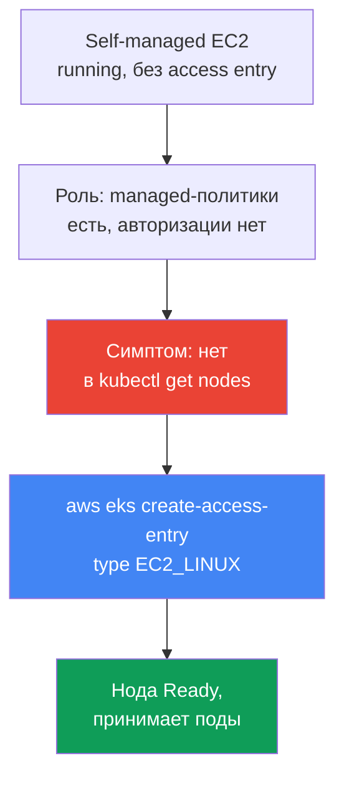
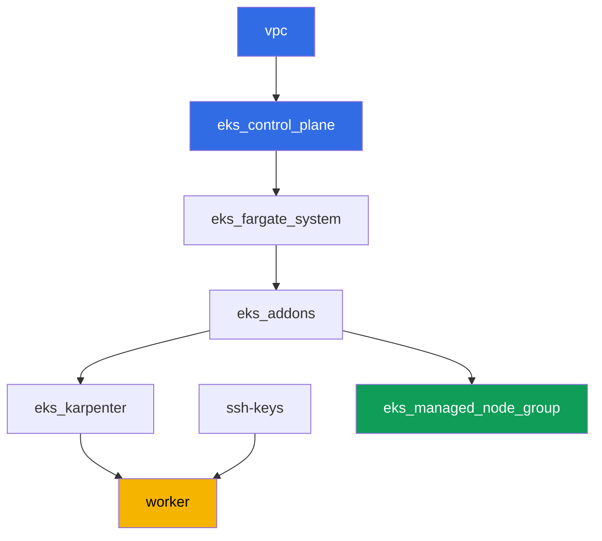

# Лаба 119 - Troubleshooting: нода не доходит до Ready (IAM, SG, user data, kubelet)

## Описание

В этой лабе вы разбираете самый частый инцидент запуска EKS: EC2-инстанс поднялся, а
нод в кластере нет. Тема - диагностический runbook, а не единственный сценарий с
жёстким сломом инфраструктуры. Managed node group лабы остаётся здоровой всё время -
это ваш образец нормы. Симптом вы воспроизводите отдельно: поднимаете один
self-managed EC2-инстанс с намеренно неполной настройкой (без access entry в кластере)
и наблюдаете тот самый пустой `kubectl get nodes` при живом `running` в EC2. Затем
чините через `aws eks create-access-entry` и убеждаетесь, что нода реально принимает
поды, а не просто висит в статусе `Ready`.

Задания в продакшн-стиле: короткая постановка плюс критерии приёмки. Проверка -
автоматическая, командой `check_result`.

## Цель

Закрепить материал главы курса:

- [Глава 45. Нода не присоединилась к кластеру](../../course/45/ru.md) - IAM, SG,
  user data, bootstrap, kubelet, систематическая диагностика по слоям

## Что мы создаём

Кластер уже развёрнут как код (как в лабе 101), и вдобавок к Karpenter в нём есть
здоровая managed node group - образец нормы для сравнения. Вы создаёте тестовую роль и
один self-managed инстанс, воспроизводите симптом и чините его.

| Объект | Что это | Зачем в этой лабе |
|--------|---------|-------------------|
| Namespace `eks-119` | раздел кластера под нагрузку лабы | держим объекты лабы отдельно |
| Managed node group `healthy` | здоровая нода с автоматической авторизацией | образец нормы: `describe-nodegroup` без issues |
| Тестовая IAM-роль | роль self-managed инстанса | несёт те же три managed-политики, что и роль здоровой ноды, но без access entry |
| Self-managed EC2-инстанс на AL2023 | инстанс с nodeadm/NodeConfig, без access entry | источник симптома: `running`, но не в `kubectl get nodes` |
| Access entry `EC2_LINUX` | ручная авторизация роли в кластере | чинит симптом, нода доходит до `Ready` |
| Pod `probe` | под, закреплённый на исправленной ноде | подтверждает, что нода реально принимает нагрузку |



## Инфраструктура

Окружение разворачивается в AWS (`eu-central-1`) через Terragrunt, как в лабе 101, плюс
один дополнительный компонент - здоровая managed node group для инвентаризации в
задании 2. Self-managed EC2-инстанс из заданий 3-9 в terraform НЕ описан: его студент
поднимает вручную с рабочей машины через AWS CLI, это и есть суть лабы.

### Модули и зависимости

| Каталог (компонент) | Модуль (`terraform/modules/`) | Зависит от | Что создаёт |
|---------------------|-------------------------------|------------|-------------|
| `vpc` | `vpc_v3` | - | VPC `10.10.0.0/16`, публичные и приватные подсети в двух AZ, NAT |
| `ssh-keys` | `ssh-keys` | - | пара SSH-ключей для рабочей машины и нод |
| `eks_control_plane` | `eks_v2_control_plane` | `vpc` | control plane EKS `1.36`, OIDC, security groups |
| `eks_fargate_system` | `eks_v2_fargate` | `vpc`, `eks_control_plane` | Fargate-профиль для `kube-system` и `karpenter` |
| `eks_addons` | `eks_v2_addons` | `eks_control_plane`, `eks_fargate_system` | аддоны coredns, kube-proxy, vpc-cni, pod-identity |
| `eks_karpenter` | `eks_v2_karpenter` | `vpc`, `eks_control_plane`, `eks_addons`, `eks_fargate_system` | контроллер Karpenter, IAM-роль нод |
| `eks_karpenter_default_vng` | `eks_v2_karpenter_vng` | `vpc`, `eks_control_plane`, `eks_karpenter` | дефолтный NodePool `default` и EC2NodeClass на AL2023 |
| `eks_managed_node_group` | `eks_v2_mng_healthy` | `vpc`, `eks_control_plane`, `eks_addons` | здоровая managed node group `healthy` - образец нормы |
| `worker` | `eks_v2_work_pc` | `ssh-keys`, `vpc`, `eks_control_plane`, `eks_karpenter` | рабочая машина с kubectl, тестами и `check_result` |

Граф зависимостей (что применяется раньше, то ниже по стрелке):



### Managed node group как образец нормы

`eks_managed_node_group` (модуль `eks_v2_mng_healthy`) создаёт отдельную IAM-роль ноды с
`AmazonEKSWorkerNodePolicy`, `AmazonEC2ContainerRegistryReadOnly` и
`AmazonEKS_CNI_Policy`, и managed node group на этой роли. Для managed node group EKS
сам создаёт access entry типа `EC2_LINUX` - поэтому такая нода всегда доходит до
`Ready`, и `aws eks describe-nodegroup ... health.issues` в задании 2 возвращает пустой
список. Karpenter (`eks_karpenter_default_vng`) в этой лабе остаётся рабочим для
системных подов, но задания сфокусированы на managed node group и на self-managed
инстансе, а не на Karpenter.

Тестовая роль из задания 3 получает тот же набор из трёх managed-политик, потому что
сломанной в этой лабе должна быть ровно одна вещь - отсутствие access entry. В частности,
`AmazonEKS_CNI_Policy` обязательна: аддон `vpc-cni` в этой лабе работает без собственной
IRSA-роли (`serviceAccountRoleArn` пустой), поэтому `aws-node` берёт креды из роли ноды.
Без этой политики IPAM не может выдать поду адрес, нода остаётся `NotReady` с сообщением
`container runtime network not ready: cni plugin not initialized`, и симптом задания 5
становится неотличим от совсем другой поломки.

### Права worker для self-managed сценария

Роль worker (`eks_v2_work_pc/iam.tf`) уже умела управлять тестовыми IAM-ролями
(`arn:...role/*-test-*`) для других лаб. Для этой лабы добавлены точечные права
поверх той же схемы с `-test-`:

- `iam:AttachRolePolicy`/`DetachRolePolicy`/`ListAttachedRolePolicies` на роли
  `*-test-*` - навесить managed-политики на тестовую роль ноды;
- `iam:PassRole` на роли `*-test-*` с условием `iam:PassedToService=ec2.amazonaws.com` -
  передать роль инстансу;
- `iam:CreateInstanceProfile`/`DeleteInstanceProfile`/`GetInstanceProfile`/
  `AddRoleToInstanceProfile`/`RemoveRoleFromInstanceProfile`/`TagInstanceProfile` на
  instance profile `*-test-*`;
- `ec2:RunInstances`/`TerminateInstances`/`CreateTags`, ограниченные тегом
  `Name=*-test-*` на ресурсах типа `instance` и `volume` (образ AMI, подсеть, SG и
  key-pair worker получил без тегового условия - AWS не поддерживает `RequestTag` на
  этих типах ресурсов, см. `ExamplePolicies_EC2` в документации AWS).

Права аддитивны: ничего из существующих политик worker не убрано, новые `Sid`
добавлены к уже работавшей политике `TestRoleManagementForLabs`/`SelfManagedNode*`.

## Развёртывание

```bash
TASK=119 make run_eks_task
```

Развёртывание занимает примерно 15-20 минут. В выводе найдите строку с SSH-подключением к
рабочей машине и подключитесь к ней. kubectl и `aws` CLI там уже настроены на нужный
кластер и регион.

Полезные команды на рабочей машине:

```bash
time_left       # сколько осталось времени окружения
check_result    # проверить решение
```

> Безопасность стенда. В `env.hcl` включены `ssh_password_enable = true` и
> `access_cidrs = ["0.0.0.0/0"]` - это удобно для учебного окружения, но так делать в
> продакшене нельзя. По стандартам курса доступ к рабочим машинам открывают через AWS SSM
> Session Manager без публичных SSH-портов наружу, а `access_cidrs` сужают до конкретных
> адресов. Здесь публичный SSH оставлен только ради простоты запуска.

## Задания

---
|        **1**        | **Namespace для нагрузки лабы**                              |
| :-----------------: | :----------------------------------------------------------- |
| Что делаем          | Создайте namespace с именем `eks-119`. Пробный под из задания 8 создаётся внутри него. |
| Критерии приёмки    | - namespace `eks-119` существует. |
---
|        **2**        | **Инвентаризация: здоровая managed node group как норма**   |
| :-----------------: | :----------------------------------------------------------- |
| Что делаем          | Сохраните в файл `/var/work/tests/artifacts/2/nodegroup_health.txt` вывод `aws eks describe-nodegroup --query 'nodegroup.health.issues'` для managed node group этой лабы и вывод `kubectl get nodes -o wide`. Убедитесь, что `health.issues` пустой список, а в списке нод есть хотя бы одна `Ready`. |
| Критерии приёмки    | - файл не пуст;<br/>- `health.issues` пустой;<br/>- в файле есть строка со статусом `Ready`. |
---
|        **3**        | **Тестовая IAM-роль для self-managed инстанса**              |
| :-----------------: | :----------------------------------------------------------- |
| Что делаем          | Создайте IAM-роль (имя с `-test-`, например `eks-task119-test-node`) с trust policy на `ec2.amazonaws.com`, навесьте `AmazonEKSWorkerNodePolicy`, `AmazonEC2ContainerRegistryReadOnly` и `AmazonEKS_CNI_Policy`, создайте instance profile с той же ролью. Сохраните ARN роли в файл `/var/work/tests/artifacts/3/test_role_arn.txt`. НЕ создавайте access entry на этом шаге - это намеренно неполная настройка. |
| Критерии приёмки    | - файл не пуст, содержит ARN роли с `test` в имени;<br/>- роль существует (`aws iam get-role`). |
---
|        **4**        | **Self-managed EC2-инстанс на AL2023**                       |
| :-----------------: | :----------------------------------------------------------- |
| Что делаем          | Получите EKS-оптимизированный AL2023 AMI для версии `1.36` через SSM (`/aws/service/eks/optimized-ami/1.36/amazon-linux-2023/x86_64/standard/recommended/image_id`). Запустите один EC2-инстанс на этом AMI в приватной подсети кластера с security group нод, instance profile из задания 3 и тегом `Name`, содержащим `-test-`. Тег укажите в двух секциях `--tag-specifications` - и для `ResourceType=instance`, и для `ResourceType=volume`: политика worker разрешает `RunInstances` по условию `aws:RequestTag/Name`, а вместе с инстансом создаётся ещё и корневой том, поэтому без тега на томе запуск отклоняется с `UnauthorizedOperation`. В user data передайте `NodeConfig` для `nodeadm` с `apiServerEndpoint`, `certificateAuthority` и service `cidr` из `aws eks describe-cluster`. Сохраните ID инстанса в файл `/var/work/tests/artifacts/4/instance_id.txt`. |
| Критерии приёмки    | - файл не пуст и содержит валидный `i-...` ID инстанса. |
---
|        **5**        | **Симптом: `running` в EC2, но нет в `kubectl get nodes`**   |
| :-----------------: | :----------------------------------------------------------- |
| Что делаем          | Подождите 3-5 минут после запуска инстанса. Сохраните в файл `/var/work/tests/artifacts/5/no_join_symptom.txt` состояние инстанса из `aws ec2 describe-instances` (должно быть `running`) и вывод `kubectl get nodes`, в котором этого инстанса нет. |
| Критерии приёмки    | - файл не пуст, упоминает ID инстанса, `running` и `get nodes`. |
---
|        **6**        | **Диагностика: чего не хватает роли**                        |
| :-----------------: | :----------------------------------------------------------- |
| Что делаем          | Выполните `aws eks list-access-entries` и убедитесь, что ARN роли из задания 3 в списке отсутствует. Сохраните в файл `/var/work/tests/artifacts/6/why_no_access_entry.txt` объяснение: у роли есть managed-политики, но нет access entry, поэтому kubelet не проходит авторизацию в кластере. В тексте должны быть слова `access entry`, `EC2_LINUX` и сам ARN роли. |
| Критерии приёмки    | - файл не пуст, содержит `access entry`, `EC2_LINUX` и ARN роли. |
---
|        **7**        | **Починка: access entry типа `EC2_LINUX`**                   |
| :-----------------: | :----------------------------------------------------------- |
| Что делаем          | Выполните `aws eks create-access-entry --cluster-name <cluster> --principal-arn <role-arn> --type EC2_LINUX`. Подождите, пока нода зарегистрируется и перейдёт в `Ready` (обычно 1-2 минуты). Имя ноды в кластере - это private DNS name инстанса. Зафиксируйте результат в файле `/var/work/tests/artifacts/7/node_ready.txt` построчно в виде `ключ=значение`: `node_name` (private DNS name) и `node_status` (`Ready`). |
| Критерии приёмки    | - `aws eks describe-access-entry` для роли из задания 3 возвращает `type=EC2_LINUX`;<br/>- файл `7/node_ready.txt` содержит `node_name` исправленного инстанса и `node_status=Ready`, и пока нода жива её живой статус в кластере тоже `Ready`. |
---
|        **8**        | **Проверка: нода реально принимает поды**                    |
| :-----------------: | :----------------------------------------------------------- |
| Что делаем          | `Ready` - не доказательство того, что нода рабочая. В namespace `eks-119` создайте Pod `probe` (образ `viktoruj/ping_pong:latest`) с `nodeSelector` по `kubernetes.io/hostname`, равным private DNS name исправленного инстанса. Дождитесь, пока под перейдёт в `Running`, и зафиксируйте результат в файле `/var/work/tests/artifacts/8/probe.txt` построчно в виде `ключ=значение`: `pod_phase` (`Running`) и `pod_node` (то же имя ноды, что в задании 7). |
| Критерии приёмки    | - файл `8/probe.txt` содержит `pod_phase=Running` и `pod_node`, равный `node_name` из задания 7;<br/>- пока под жив, его живые `status.phase` и `spec.nodeName` совпадают с записанными. |
---
|        **9**        | **Уборка: терминировать self-managed инстанс**                |
| :-----------------: | :----------------------------------------------------------- |
| Что делаем          | Этот EC2-инстанс не входит в состояние terraform лабы, `make delete_eks_task` его не тронет. Терминируйте инстанс из задания 4 через `aws ec2 terminate-instances` и сохраните факт в файл `/var/work/tests/artifacts/9/terminated.txt`. |
| Критерии приёмки    | - файл не пуст;<br/>- состояние инстанса `terminated` или `shutting-down`, либо инстанса уже нет в `describe-instances` - AWS перестаёт показывать терминированные инстансы через некоторое время, а работающий показывает всегда. |

> Почему задания 7 и 8 требуют артефактов. Терминирование инстанса уносит за собой и
> объект Node, и под `probe`, а `describe-instances` у терминированного инстанса отдаёт
> пустой `PrivateDnsName`. То есть после задания 9 живого состояния уже не существует, и
> проверка опирается на то, что вы записали в момент наблюдения. Это ровно то, что делают
> в инцидентах: фиксируют свидетельство до того, как оно пропадёт.

---

## Проверка результата

На рабочей машине запустите автоматическую проверку:

```bash
check_result
```

Скрипт прогонит тесты и покажет процент выполненных заданий.

## Решение

Эталонное решение: [worker/files/solutions/1.MD](worker/files/solutions/1.MD)

## Удаление

```bash
TASK=119 make delete_eks_task
```

Важно: self-managed EC2-инстанс, тестовая IAM-роль и instance profile из заданий 3-9
созданы вручную через AWS CLI и НЕ входят в состояние terraform этой лабы.
`make delete_eks_task` удалит только компоненты из каталогов лабы (VPC, кластер, managed
node group и так далее). Инстанс закрывает задание 9, а роль и instance profile нужно
убрать до или после destroy самостоятельно - в отличие от инстанса, они не стоят денег, но
имя у них статическое (`eks-task119-test-node`), поэтому в аккаунте они остаются насовсем
и мешают следующему запуску этой же лабы. Access entry уходит вместе с кластером, но
удалить её нужно раньше роли, иначе запись останется висеть на несуществующем принципале:

```bash
CLUSTER=$(aws eks list-clusters --query 'clusters[0]' --output text)
ROLE_ARN=$(cat /var/work/tests/artifacts/3/test_role_arn.txt)
aws eks delete-access-entry --cluster-name "$CLUSTER" --principal-arn "$ROLE_ARN"
aws iam remove-role-from-instance-profile --instance-profile-name eks-task119-test-node \
  --role-name eks-task119-test-node
aws iam delete-instance-profile --instance-profile-name eks-task119-test-node
for p in AmazonEKSWorkerNodePolicy AmazonEC2ContainerRegistryReadOnly AmazonEKS_CNI_Policy; do
  aws iam detach-role-policy --role-name eks-task119-test-node \
    --policy-arn arn:aws:iam::aws:policy/$p
done
aws iam delete-role --role-name eks-task119-test-node
```
