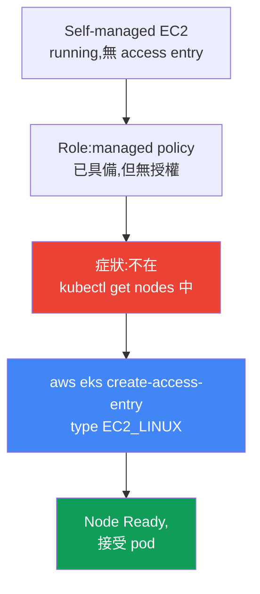
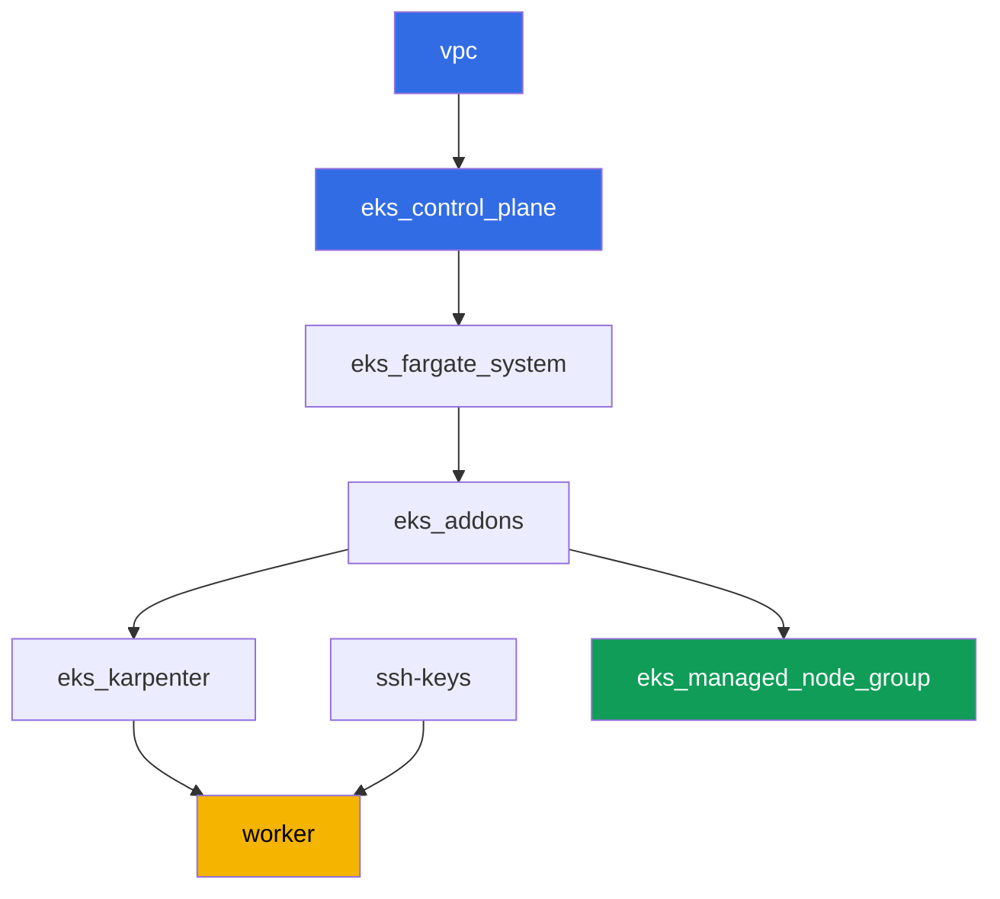

[Русская версия](README_RU.MD) · [Eng version](README.MD) · [Versión en español](README_ES.MD) · [Version française](README_FR.MD) · [Deutsche Version](README_DE.MD) · [ქართული ვერსია](README_GE.MD) · [日本語版](README_JP.MD)

# Lab 119 - Troubleshooting:節點無法進入 Ready 狀態(IAM、SG、user data、kubelet)

## 說明

在這個實驗中,你會處理 EKS 啟動時最常見的事故:EC2 instance 已經起來了,但叢集裡
卻沒有對應的 node。這個主題是一份診斷用的 runbook,而不是單一的、把基礎架構徹底
弄壞的情境。這個實驗的 managed node group 全程保持健康 - 它就是你的正常基準。你會
另外重現症狀:啟動一個刻意設定不完整的 self-managed EC2 instance(叢集裡沒有
access entry),觀察到即使該 instance 在 EC2 中的狀態是 `running`,`kubectl get
nodes` 依然是空的。接著透過 `aws eks create-access-entry` 修復它,並確認 node
確實能接受 pod,而不只是停在 `Ready` 狀態上。

任務以正式環境(production)的風格撰寫:一段簡短的說明,加上驗收標準。檢查是
自動的,透過 `check_result` 指令進行。

## 目標

鞏固課程章節的內容:

- [第 45 章。Node 沒有加入叢集](../../course/45/tw.md) - IAM、SG、
  user data、bootstrap、kubelet、按層級系統化診斷

## 我們要建立什麼

叢集已經以程式碼(code)的形式部署好(就像實驗 101 一樣),在 Karpenter 之上還有
一個健康的 managed node group - 作為比較用的正常基準。你會建立一個測試用的
role 和一個 self-managed instance,重現症狀,再修復它。

| 物件 | 是什麼 | 為什麼在這個實驗裡 |
|--------|---------|-------------------|
| Namespace `eks-119` | 用來承載這個實驗工作負載的叢集區塊 | 讓實驗的物件保持獨立 |
| Managed node group `healthy` | 具有自動授權的健康 node | 正常基準:`describe-nodegroup` 沒有 issues |
| 測試用 IAM role | self-managed instance 使用的 role | 帶有和健康 node 的 role 相同的三個 managed policy,但沒有 access entry |
| 建立在 AL2023 上的 self-managed EC2 instance | 使用 nodeadm/NodeConfig 的 instance,沒有 access entry | 症狀的來源:`running`,但不在 `kubectl get nodes` 裡 |
| Access entry `EC2_LINUX` | 在叢集中手動授權該 role | 修復症狀,node 進入 `Ready` |
| Pod `probe` | 固定排程到修復後 node 的 pod | 確認 node 真的能接受工作負載 |



## 基礎架構

這個環境透過 Terragrunt 部署在 AWS(`eu-central-1`),做法和實驗 101 相同,
再加上一個額外的元件 - 一個健康的 managed node group,用於任務 2 的盤點。
任務 3-9 中的 self-managed EC2 instance並未在 terraform 中描述:學員需要
從 worker 機器透過 AWS CLI 手動建立它 - 這正是這個實驗的重點所在。

### 模組與依賴關係

| 目錄(元件) | 模組(`terraform/modules/`) | 依賴 | 建立了什麼 |
|---------------------|-------------------------------|------------|-------------|
| `vpc` | `vpc_v3` | - | VPC `10.10.0.0/16`,兩個 AZ 中的公有與私有子網路,NAT |
| `ssh-keys` | `ssh-keys` | - | worker 機器與 node 使用的 SSH key pair |
| `eks_control_plane` | `eks_v2_control_plane` | `vpc` | EKS control plane `1.36`、OIDC、security group |
| `eks_fargate_system` | `eks_v2_fargate` | `vpc`、`eks_control_plane` | 給 `kube-system` 與 `karpenter` 使用的 Fargate profile |
| `eks_addons` | `eks_v2_addons` | `eks_control_plane`、`eks_fargate_system` | coredns、kube-proxy、vpc-cni、pod-identity 等 addon |
| `eks_karpenter` | `eks_v2_karpenter` | `vpc`、`eks_control_plane`、`eks_addons`、`eks_fargate_system` | Karpenter controller、node 的 IAM role |
| `eks_karpenter_default_vng` | `eks_v2_karpenter_vng` | `vpc`、`eks_control_plane`、`eks_karpenter` | 預設的 NodePool `default` 與建立在 AL2023 上的 EC2NodeClass |
| `eks_managed_node_group` | `eks_v2_mng_healthy` | `vpc`、`eks_control_plane`、`eks_addons` | 健康的 managed node group `healthy` - 正常基準 |
| `worker` | `eks_v2_work_pc` | `ssh-keys`、`vpc`、`eks_control_plane`、`eks_karpenter` | 具備 kubectl、測試,以及 `check_result` 的 worker 機器 |

依賴關係圖(愈早 apply 的元件,在箭頭圖中的位置愈低):



### 作為正常基準的 managed node group

`eks_managed_node_group`(模組 `eks_v2_mng_healthy`)會建立一個獨立的 node IAM
role,帶有 `AmazonEKSWorkerNodePolicy`、`AmazonEC2ContainerRegistryReadOnly` 與
`AmazonEKS_CNI_Policy`,並在這個 role 上建立一個 managed node group。對於
managed node group,EKS 本身會建立一個 `EC2_LINUX` 類型的 access entry - 這就
是為什麼這種 node 總是能進入 `Ready`,而任務 2 中的 `aws eks describe-nodegroup
... health.issues` 會回傳一個空列表。這個實驗中的 Karpenter
(`eks_karpenter_default_vng`)對系統 pod 依然保持運作,但這些任務聚焦在
managed node group 與 self-managed instance 上,而不是 Karpenter。

任務 3 的測試用 role 會取得同樣的三個 managed policy,因為這個實驗裡必須恰好只有
一件事被弄壞 - 缺少 access entry。其中 `AmazonEKS_CNI_Policy` 是必要的:這個
實驗中的 `vpc-cni` addon 沒有使用自己的 IRSA role(`serviceAccountRoleArn` 為
空),所以 `aws-node` 會從 node 的 role 取得憑證。缺少這個 policy,IPAM 就無法
分配位址給 pod,node 會停在 `NotReady`,並帶有訊息 `container runtime network
not ready: cni plugin not initialized`,任務 5 中的症狀就會變得和一個完全不同
的故障無法區分。

### self-managed 情境下 worker 的權限

worker 的 role(`eks_v2_work_pc/iam.tf`)原本就已經能管理其他實驗中的測試用
IAM role(`arn:...role/*-test-*`)。針對這個實驗,在同一套 `-test-` 命名方案上
新增了一些針對性的權限:

- 在 `*-test-*` role 上的
  `iam:AttachRolePolicy`/`DetachRolePolicy`/`ListAttachedRolePolicies` - 用於
  把 managed policy 附加到測試用的 node role 上;
- 在 `*-test-*` role 上、附帶條件
  `iam:PassedToService=ec2.amazonaws.com` 的 `iam:PassRole` - 用於把 role
  傳遞給 instance;
- 在 `*-test-*` instance profile 上的
  `iam:CreateInstanceProfile`/`DeleteInstanceProfile`/`GetInstanceProfile`/
  `AddRoleToInstanceProfile`/`RemoveRoleFromInstanceProfile`/`TagInstanceProfile`;
- `ec2:RunInstances`/`TerminateInstances`/`CreateTags`,限制在帶有標籤
  `Name=*-test-*` 的 `instance` 與 `volume` 類型資源上(AMI 映像、subnet、SG,
  以及 key-pair,worker 取得的是不帶標籤條件的權限 - AWS 在這些資源類型上不支援
  `RequestTag`,詳見 AWS 文件中的 `ExamplePolicies_EC2`)。

這些權限是新增性質的:worker 現有的 policy 中沒有移除任何東西,只是在原本就在
運作的 `TestRoleManagementForLabs`/`SelfManagedNode*` policy 中新增了 `Sid`。

## 部署

```bash
TASK=119 make run_eks_task
```

部署大約需要 15-20 分鐘。在輸出裡找到連到 worker 機器的 SSH 連線那一行,連上去。
那裡的 kubectl 和 `aws` CLI 已經設定好對應正確的叢集和地區。

worker 機器上的實用指令:

```bash
time_left       # 環境還剩多少時間
check_result    # 檢查解答
```

> 環境的安全性。`env.hcl` 中啟用了 `ssh_password_enable = true` 與
> `access_cidrs = ["0.0.0.0/0"]` - 這對訓練環境來說很方便,但正式環境中絕對
> 不能這麼做。依照課程標準,對 worker 機器的存取應該透過 AWS SSM Session
> Manager 開啟,不對外開放公開的 SSH port,`access_cidrs` 也應該縮小到特定的
> 位址範圍。這裡保留公開 SSH 只是為了方便啟動。

## 任務

---
|        **1**        | **這個實驗工作負載使用的 namespace**                              |
| :-----------------: | :----------------------------------------------------------- |
| 要做什麼          | 建立一個名為 `eks-119` 的 namespace。任務 8 的測試用 pod 會建立在裡面。 |
| 驗收標準    | - namespace `eks-119` 存在。 |
---
|        **2**        | **盤點:作為正常基準的健康 managed node group**   |
| :-----------------: | :----------------------------------------------------------- |
| 要做什麼          | 把這個實驗的 managed node group 執行 `aws eks describe-nodegroup --query 'nodegroup.health.issues'` 的輸出,以及 `kubectl get nodes -o wide` 的輸出,存到檔案 `/var/work/tests/artifacts/2/nodegroup_health.txt` 中。確認 `health.issues` 是一個空列表,並且 node 列表中至少有一個 `Ready`。 |
| 驗收標準    | - 檔案不是空的;<br/>- `health.issues` 是空的;<br/>- 檔案中有一行狀態為 `Ready`。 |
---
|        **3**        | **給 self-managed instance 使用的測試 IAM role**              |
| :-----------------: | :----------------------------------------------------------- |
| 要做什麼          | 建立一個 IAM role(名稱含 `-test-`,例如 `eks-task119-test-node`),trust policy 設為 `ec2.amazonaws.com`,附加 `AmazonEKSWorkerNodePolicy`、`AmazonEC2ContainerRegistryReadOnly` 與 `AmazonEKS_CNI_Policy`,並建立一個使用同一個 role 的 instance profile。把 role 的 ARN 存到檔案 `/var/work/tests/artifacts/3/test_role_arn.txt` 中。這個步驟不要建立 access entry - 這正是刻意設定不完整的地方。 |
| 驗收標準    | - 檔案不是空的,包含名稱中帶有 `test` 的 role ARN;<br/>- role 存在(`aws iam get-role`)。 |
---
|        **4**        | **建立在 AL2023 上的 self-managed EC2 instance**                       |
| :-----------------: | :----------------------------------------------------------- |
| 要做什麼          | 透過 SSM(`/aws/service/eks/optimized-ami/1.36/amazon-linux-2023/x86_64/standard/recommended/image_id`)取得版本 `1.36` 的 EKS-optimized AL2023 AMI。在叢集的私有子網路中,使用這個 AMI、node 的 security group、任務 3 建立的 instance profile,以及一個包含 `-test-` 的 `Name` 標籤,啟動一個 EC2 instance。標籤要同時放在兩個 `--tag-specifications` 區塊裡 - `ResourceType=instance` 和 `ResourceType=volume` 都要有:worker 的 policy 允許 `RunInstances` 是依據 `aws:RequestTag/Name` 這個條件,而啟動 instance 同時也會建立一個 root volume,所以如果 volume 上沒有標籤,啟動就會被 `UnauthorizedOperation` 拒絕。在 user data 中,傳入一個給 `nodeadm` 使用的 `NodeConfig`,裡面包含來自 `aws eks describe-cluster` 的 `apiServerEndpoint`、`certificateAuthority` 與 service `cidr`。把 instance ID 存到檔案 `/var/work/tests/artifacts/4/instance_id.txt` 中。 |
| 驗收標準    | - 檔案不是空的,且包含有效的 `i-...` instance ID。 |
---
|        **5**        | **症狀:在 EC2 中是 `running`,但不在 `kubectl get nodes` 裡**   |
| :-----------------: | :----------------------------------------------------------- |
| 要做什麼          | instance 啟動後等待 3-5 分鐘。把 `aws ec2 describe-instances` 得到的 instance 狀態(應該是 `running`),以及 `kubectl get nodes` 的輸出(這個 instance 不在其中)存到檔案 `/var/work/tests/artifacts/5/no_join_symptom.txt` 中。 |
| 驗收標準    | - 檔案不是空的,提到了 instance ID、`running` 以及 `get nodes`。 |
---
|        **6**        | **診斷:這個 role 缺了什麼**                        |
| :-----------------: | :----------------------------------------------------------- |
| 要做什麼          | 執行 `aws eks list-access-entries`,確認任務 3 建立的 role ARN 不在列表中。把說明存到檔案 `/var/work/tests/artifacts/6/why_no_access_entry.txt` 中:這個 role 有 managed policy,但沒有 access entry,所以 kubelet 在叢集中無法通過授權。文字內容中必須包含 `access entry`、`EC2_LINUX`,以及 role 自己的 ARN。 |
| 驗收標準    | - 檔案不是空的,包含 `access entry`、`EC2_LINUX` 以及該 role 的 ARN。 |
---
|        **7**        | **修復:一個 `EC2_LINUX` 類型的 access entry**                   |
| :-----------------: | :----------------------------------------------------------- |
| 要做什麼          | 執行 `aws eks create-access-entry --cluster-name <cluster> --principal-arn <role-arn> --type EC2_LINUX`。等待 node 註冊並轉換為 `Ready`(通常需要 1-2 分鐘)。這個 node 在叢集中的名稱就是該 instance 的 private DNS name。把結果逐行以 `key=value` 的形式記錄到檔案 `/var/work/tests/artifacts/7/node_ready.txt` 中:`node_name`(private DNS name)與 `node_status`(`Ready`)。 |
| 驗收標準    | - 針對任務 3 建立的 role,`aws eks describe-access-entry` 回傳 `type=EC2_LINUX`;<br/>- 檔案 `7/node_ready.txt` 包含修復後 instance 的 `node_name` 與 `node_status=Ready`,而且在 node 存活期間,它在叢集中的即時狀態也是 `Ready`。 |
---
|        **8**        | **驗證:node 確實能接受 pod**                    |
| :-----------------: | :----------------------------------------------------------- |
| 要做什麼          | `Ready` 並不能證明這個 node 是可用的。在 namespace `eks-119` 中建立一個 Pod `probe`(映像 `viktoruj/ping_pong:latest`),`nodeSelector` 設定為 `kubernetes.io/hostname`,值等於修復後 instance 的 private DNS name。等到這個 pod 轉為 `Running`,把結果逐行以 `key=value` 的形式記錄到檔案 `/var/work/tests/artifacts/8/probe.txt` 中:`pod_phase`(`Running`)與 `pod_node`(與任務 7 相同的 node 名稱)。 |
| 驗收標準    | - 檔案 `8/probe.txt` 包含 `pod_phase=Running`,且 `pod_node` 等於任務 7 中的 `node_name`;<br/>- 只要這個 pod 還存活,它即時的 `status.phase` 與 `spec.nodeName` 都要與記錄的內容一致。 |
---
|        **9**        | **清理:終止 self-managed instance**                |
| :-----------------: | :----------------------------------------------------------- |
| 要做什麼          | 這個 EC2 instance 不屬於這個實驗的 terraform state,`make delete_eks_task` 不會動到它。透過 `aws ec2 terminate-instances` 終止任務 4 建立的 instance,並把這件事記錄到檔案 `/var/work/tests/artifacts/9/terminated.txt` 中。 |
| 驗收標準    | - 檔案不是空的;<br/>- instance 的狀態是 `terminated` 或 `shutting-down`,或者這個 instance 已經從 `describe-instances` 中消失 - AWS 過一段時間後就不再顯示已終止的 instance,而正在執行中的 instance 則會一直顯示出來。 |

> 為什麼任務 7 和 8 需要留存證據。終止這個 instance 會同時帶走 Node 物件和
> `probe` pod,而對已終止的 instance 執行 `describe-instances` 會得到空的
> `PrivateDnsName`。也就是說,任務 9 之後就沒有任何即時狀態可以查了,檢查依靠
> 的是你在觀察那一刻記錄下來的內容。這正是事故處理時常做的事:在證據消失之前
> 先把它捕捉下來。

---

## 檢查結果

在 worker 機器上執行自動檢查:

```bash
check_result
```

這個腳本會執行測試,並顯示已完成任務的百分比。

## 解決方案

參考解答:[worker/files/solutions/1_TW.MD](worker/files/solutions/1_TW.MD)

## 清理

```bash
TASK=119 make delete_eks_task
```

重要:任務 3-9 中的 self-managed EC2 instance、測試用 IAM role,以及 instance
profile 都是透過 AWS CLI 手動建立的,並不屬於這個實驗的 terraform state。
`make delete_eks_task` 只會移除實驗目錄裡的元件(VPC、叢集、managed node
group 等等)。instance 由任務 9 負責處理,但 role 與 instance profile 需要在
destroy 之前或之後自行移除 - 和 instance 不同,它們不會產生費用,但名稱是固定
的(`eks-task119-test-node`),所以會永久留在帳號中,並妨礙下一次執行同一個
實驗。access entry 會隨著叢集一起消失,但必須在 role 之前先移除它,否則這條
記錄會殘留在一個不存在的 principal 上:

```bash
CLUSTER=$(aws eks list-clusters --query 'clusters[0]' --output text)
ROLE_ARN=$(cat /var/work/tests/artifacts/3/test_role_arn.txt)
aws eks delete-access-entry --cluster-name "$CLUSTER" --principal-arn "$ROLE_ARN"
aws iam remove-role-from-instance-profile --instance-profile-name eks-task119-test-node \
  --role-name eks-task119-test-node
aws iam delete-instance-profile --instance-profile-name eks-task119-test-node
for p in AmazonEKSWorkerNodePolicy AmazonEC2ContainerRegistryReadOnly AmazonEKS_CNI_Policy; do
  aws iam detach-role-policy --role-name eks-task119-test-node \
    --policy-arn arn:aws:iam::aws:policy/$p
done
aws iam delete-role --role-name eks-task119-test-node
```
