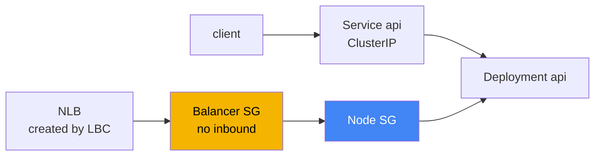
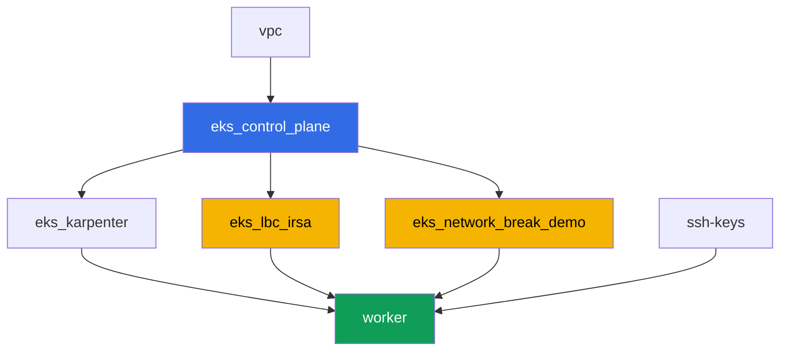

[Русская версия](README_RU.MD) · [Versión en español](README_ES.MD) · [Version française](README_FR.MD) · [Deutsche Version](README_DE.MD) · [ქართული ვერსია](README_GE.MD) · [繁體中文版](README_TW.MD) · [日本語版](README_JP.MD)

# Lab 120 - Troubleshooting: network failures and unhealthy load balancer targets

## Description

The cluster is up, nodes are `Ready`, but the network misbehaves in two different
ways: connectivity breaks in one place, and load balancer targets turn red in
another. In this lab you work through exactly one class of failure - security
group - and learn to tell it apart from DNS, which is not at fault here. There is
one deterministic failure: terraform pre-creates an empty security group with not
a single inbound rule. You attach it to a Network Load Balancer as the
balancer's own SG, watch the targets turn `unhealthy`, diagnose the cause with
AWS CLI commands, and fix it with the same tool - `aws ec2
authorize-security-group-ingress`.

Design decision. The same terraform configuration must deterministically
reproduce the failure on every lab run, so the source of the failure is exactly
one pre-created empty security group with no inbound rules. Its role in the lab
is the NLB's own security group (the Service annotation
`aws-load-balancer-security-groups`). As soon as you set your own SG on the
balancer explicitly, the AWS Load Balancer Controller stops adding the missing
inbound rule to the node SG for you - that is the same statement from chapter
46.6: "the target's SG does not let traffic from the balancer's SG through to the
check port". Pod-to-pod connectivity (tasks 1-2) in this lab works fine by
design - it serves as a contrasting example and a playground for the diagnostic
commands from chapter 46.7, while the one real failure lives in the NLB
scenario (tasks 4-6). The scenario with a pod's own SG (security groups for
pods) is the subject of a separate course lab.

Tasks are written in a production style: a short statement plus acceptance
criteria. Checking is automatic, via the `check_result` command.

## Goal

Reinforce the material from this course chapter:

- [Chapter 46. Network failures: SG, NACL, DNS, unhealthy targets](../../course/46/en.md)

## What we're creating

The cluster is already deployed as code (the same base as in lab 101), plus an
IRSA role for the AWS Load Balancer Controller and a separate "broken" security
group with no inbound rules.

| Object | What it is | Why it's in this lab |
|--------|---------|-------------------|
| Namespace `eks-120` | a cluster section for the lab's workload | keeps resources separate from system ones |
| Deployment `api` (2 replicas) | the ping_pong application, port `8080` | the target for connectivity checks and the NLB |
| Service `api` (ClusterIP) | `80 -> 8080` | baseline connectivity inside the cluster |
| Deployment `client` | busybox, `sleep` | source of requests to `api` |
| Component `eks_network_break_demo` | empty SG with no inbound rules | the failure itself (chapters 46.3, 46.6) |
| Component `eks_lbc_irsa` | IRSA role for the controller | permissions on the ELBv2 API for the Helm install |
| Service `api-lb` (LoadBalancer) | NLB with the "broken" SG as the balancer's SG | reproduces unhealthy targets (chapter 46.6) |

The resulting traffic picture:



## Infrastructure

The environment is deployed in AWS (`eu-central-1`) via Terragrunt. Each lab
directory is one component with its own `terragrunt.hcl`, which references a
shared module in `terraform/modules/` and declares dependencies through
`dependency` blocks.

### Modules and dependencies

| Directory (component) | Module (`terraform/modules/`) | Depends on | What it creates |
|---------------------|-------------------------------|------------|-------------|
| `vpc` | `vpc_v3` | - | VPC `10.10.0.0/16`, subnets in two AZs, NAT |
| `ssh-keys` | `ssh-keys` | - | an SSH key pair for the worker machine |
| `eks_control_plane` | `eks_v2_control_plane` | `vpc` | EKS control plane `1.36`, OIDC, node SG |
| `eks_fargate_system` | `eks_v2_fargate` | `vpc`, `eks_control_plane` | Fargate profile for `kube-system` and `karpenter` |
| `eks_addons` | `eks_v2_addons` | `eks_control_plane`, `eks_fargate_system` | coredns, kube-proxy, vpc-cni, pod-identity add-ons |
| `eks_karpenter` | `eks_v2_karpenter` | `vpc`, `eks_control_plane`, `eks_addons`, `eks_fargate_system` | Karpenter controller, node IAM role |
| `eks_karpenter_default_vng` | `eks_v2_karpenter_vng` | `vpc`, `eks_control_plane`, `eks_karpenter` | default NodePool on AL2023 |
| `eks_lbc_irsa` | `eks_v2_lbc_irsa` | `eks_control_plane` | IAM IRSA role for the AWS Load Balancer Controller |
| `eks_network_break_demo` | `eks_v2_network_break_demo` | `vpc`, `eks_control_plane` | empty SG with no inbound rules |
| `worker` | `eks_v2_work_pc` | `ssh-keys`, `vpc`, `eks_control_plane`, `eks_karpenter`, `eks_lbc_irsa`, `eks_network_break_demo` | worker machine with `check_result` |

The `eks_v2_network_break_demo` module creates exactly one security group with a
correct description but no inbound rules at all (only allow-all egress, so the
SG behaves predictably and doesn't confuse diagnostics of outbound traffic). The
SG name is predictably assembled from `prefix` and `app_name`:
`eks-task120-network-break-sg`. The resource itself doesn't know what it will be
attached to - that's for the student to decide per the instructions of task 4.

Dependency graph (what gets applied earlier is lower down the arrow):



The components `eks_fargate_system`, `eks_addons`, `eks_karpenter_default_vng`
are not shown on the graph to keep it under 8 nodes - they're applied in the
standard order between `eks_control_plane` and `eks_karpenter`, as in lab 101.

### Predictable resource names

`eks_network_break_demo` and `eks_lbc_irsa` assemble their names from `prefix`
and `app_name`, so the worker can find them without reading terraform output.
They're recorded in the file `~/lab120_hints.txt` on the worker machine:

| Resource | How to find it |
|--------|-----------|
| "Broken" SG | name `eks-task120-network-break-sg` |
| IRSA role for the LBC | role name `<cluster-name>-lbc-irsa` |
| Karpenter node SG | tag `karpenter.sh/discovery=<cluster-name>` |

### Where things are configured

`env.hcl` (shared environment parameters):

| Parameter | Value in the lab | What it affects |
|----------|-----------------|---------------|
| `region` | `eu-central-1` | region for all resources |
| `prefix` | `eks-task120` | prefix for resource names, including the "broken" SG |
| `stack_name` | `eks120` | used to build `env_name` - the cluster name |
| `k8_version` | `1.36.0` | kubectl version on the worker machine |

`inputs` in each component's `terragrunt.hcl`:

| File | Key settings |
|------|--------------------|
| `eks_network_break_demo/terragrunt.hcl` | the cluster's `vpc_id`, "broken" SG with no rule inputs |
| `eks_lbc_irsa/terragrunt.hcl` | `name` (cluster) and `oidc_provider_arn` for the trust policy |
| `worker/terragrunt.hcl` | `test_url`, `task_script_url` for the lab 120 files |

## Deployment

```bash
TASK=120 make run_eks_task
```

Deployment takes roughly 15-20 minutes. In the output, find the line with the
SSH connection to the worker machine and connect to it. kubectl there is
already configured for the right cluster, and the lab's resource names are in
`~/lab120_hints.txt`.

Useful commands on the worker machine:

```bash
time_left       # how much environment time is left
check_result    # check the solution
cat ~/lab120_hints.txt   # names and ARNs of the lab's resources
```

> Environment security. `env.hcl` has `ssh_password_enable = true` and
> `access_cidrs = ["0.0.0.0/0"]` enabled - convenient for a training
> environment, but this is not something to do in production. Per the course
> standards (chapters 0.2, 2, 19), access to worker machines should go through
> AWS SSM Session Manager without exposing public SSH ports, and `access_cidrs`
> should be narrowed down to specific addresses. Here public SSH is left in
> place only to keep the setup simple.

## Tasks

Block 1 (tasks 1-2) is baseline connectivity inside the cluster, which works
fine and serves as a playground for the diagnostic commands from chapter 46.7.
Block 2 (tasks 3-6) is the lab's one real failure: unhealthy targets in the NLB
caused by an SG (chapter 46.6). Block 3 (tasks 7-8) is a DNS sanity check and a
final checklist.

---
|        **1**        | **Namespace and the lab's workload**                                |
| :-----------------: | :----------------------------------------------------------- |
| What to do          | Create a namespace named `eks-120`. Inside it, create Deployment `api` (image `viktoruj/ping_pong:latest`, `2` replicas, `containerPort: 8080`, label `app: api`) and Service `api` of type `ClusterIP` (`port: 80`, `targetPort: 8080`, selector `app: api`). Create Deployment `client` (image `busybox:1.36`, command `sleep 3600`, label `app: client`). Wait until both Deployments are ready. |
| Acceptance criteria    | - namespace `eks-120` exists;<br/>- Deployment `api` (`2/2` replicas, image `ping_pong`);<br/>- Deployment `client` (`1/1`, image `busybox`);<br/>- Service `api` ClusterIP with `targetPort: 8080`. |
---
|        **2**        | **Baseline connectivity and SG diagnostics**                       |
| :-----------------: | :------------------------------------------------------------ |
| What to do          | From the `client` pod, make a request to `api` by the service's DNS name (`wget -qO- --timeout=5 http://api.eks-120.svc.cluster.local` or a curl equivalent) and save the response to `/var/work/tests/artifacts/2/connectivity.txt` - it should contain a line with the application's response. Then take the IP of one of the `api` pods and find its ENI: `aws ec2 describe-network-interfaces --filters "Name=addresses.private-ip-address,Values=<ip>" --query 'NetworkInterfaces[0].Groups'`, saving the output to `/var/work/tests/artifacts/2/api_sg.txt`. Pay attention to the filter: with VPC CNI, the pod's IP is a secondary address on the node's ENI, so searching by `private-ip-address` returns `null` - you need `addresses.private-ip-address` instead. This connectivity works fine: the node SG allows traffic between cluster pods, and SGs are stateful, so the return traffic passes on its own (chapter 46.3). |
| Acceptance criteria    | - `2/connectivity.txt` is not empty and contains `Server Name`;<br/>- `2/api_sg.txt` is not empty and contains `GroupId` and the id of the cluster's node SG. |
---
|        **3**        | **Installing the AWS Load Balancer Controller**                   |
| :-----------------: | :------------------------------------------------------------ |
| What to do          | Find the ARN of the IAM role created by terraform for the controller (role name `<cluster-name>-lbc-irsa`, available in `~/lab120_hints.txt`), and create ServiceAccount `aws-load-balancer-controller` in `kube-system` with the annotation `eks.amazonaws.com/role-arn` pointing to that role. Install the AWS Load Balancer Controller via Helm (repository `https://aws.github.io/eks-charts`, chart `aws-load-balancer-controller`) with flags `--set serviceAccount.create=false --set serviceAccount.name=aws-load-balancer-controller` and `--set clusterName=<cluster name>`. Note: in this environment `kube-system` falls under the Fargate profile, and Fargate has no IMDS, so the controller can't determine the region and VPC on its own and will fail with an error mentioning `ec2imds`. Set them explicitly: `--set region=eu-central-1` and `--set vpcId=<vpc-id>` (get the id from `aws eks describe-cluster --name <cluster> --query 'cluster.resourcesVpcConfig.vpcId'`). Wait for Deployment `aws-load-balancer-controller` to become ready. |
| Acceptance criteria    | - ServiceAccount `aws-load-balancer-controller` in `kube-system` with an annotation pointing to the `lbc-irsa` role;<br/>- Deployment `aws-load-balancer-controller` has at least one ready replica. |
---
|        **4**        | **Symptom: NLB with unhealthy targets**                          |
| :-----------------: | :------------------------------------------------------------ |
| What to do          | Find the id of the "broken" SG (name `eks-task120-network-break-sg`, available in `~/lab120_hints.txt`). Create Service `api-lb` of type `LoadBalancer` with selector `app: api`, port `80` on `targetPort: 8080`, and annotations `service.beta.kubernetes.io/aws-load-balancer-type: external`, `aws-load-balancer-nlb-target-type: ip`, `aws-load-balancer-scheme: internet-facing`, `aws-load-balancer-security-groups: <broken SG id>`. This annotation makes the "broken" SG the balancer's own SG - it has no inbound rules, so the LBC won't automatically add the missing rule for the health check. Wait for the external address, then run `aws elbv2 describe-target-health --target-group-arn <arn> --query 'TargetHealthDescriptions[].[Target.Id,TargetHealth.State,TargetHealth.Reason]'` and save the output to `/var/work/tests/artifacts/4/unhealthy.txt`. |
| Acceptance criteria    | - Service `api-lb` with the three annotations and an external address;<br/>- `4/unhealthy.txt` is not empty and contains `unhealthy`. |
---
|        **5**        | **Diagnostics: whose SG is blocking the health check**               |
| :-----------------: | :------------------------------------------------------------ |
| What to do          | Run `aws ec2 describe-security-groups --group-ids <broken SG id>` and confirm it has no inbound rules at all. Find the id of the Karpenter node SG (tag `karpenter.sh/discovery=<cluster-name>`, the command is in `~/lab120_hints.txt`) and explain in `/var/work/tests/artifacts/5/diagnosis.txt` why the health check from the NLB doesn't reach the `api` pod: the target's SG (the node SG) doesn't allow inbound traffic from the balancer's SG on the check port (chapter 46.6). The text must contain the words `security group` and `health check`. |
| Acceptance criteria    | - `5/diagnosis.txt` is not empty and contains `security group` and `health check`. |
---
|        **6**        | **Fix: authorize-security-group-ingress, targets healthy**    |
| :-----------------: | :------------------------------------------------------------ |
| What to do          | Add two rules: `aws ec2 authorize-security-group-ingress --group-id <node SG> --protocol tcp --port 8080 --source-group <broken SG>` (opens the health check and application traffic from the balancer's SG to the node SG) and `aws ec2 authorize-security-group-ingress --group-id <broken SG> --protocol tcp --port 80 --cidr 0.0.0.0/0` (opens the NLB listener for clients). Wait for `healthy` in `describe-target-health` and a successful `curl` against the NLB's external address. Save both outputs to `/var/work/tests/artifacts/6/healthy.txt`. |
| Acceptance criteria    | - `6/healthy.txt` is not empty, contains `healthy` and does not contain `FailedHealthChecks`;<br/>- the file has a line with the application's response (`Server Name`). |
---
|        **7**        | **DNS works: a contrasting check**                        |
| :-----------------: | :------------------------------------------------------------ |
| What to do          | Run `kubectl run dnstest --image=busybox:1.36 --rm -i --restart=Never -- sh -c 'nslookup kubernetes.default.svc.cluster.local; nslookup example.com'` and save the output to `/var/work/tests/artifacts/7/dns.txt`. Query the internal name by its full FQDN: the short `kubernetes.default` from busybox returns `NXDOMAIN`, because its `nslookup` doesn't append the search domains, and that response is easy to mistake for a DNS failure that isn't there. In this lab DNS is not the source of the problem - both names resolve fine, unlike the security group from tasks 4-6 (chapters 46.5, 46.7). |
| Acceptance criteria    | - `7/dns.txt` is not empty and contains `kubernetes.default` and `example.com`. |
---
|        **8**        | **Final checklist: symptom - probable cause - what to check**       |
| :-----------------: | :------------------------------------------------------------ |
| What to do          | Fill in a line for this lab's symptom per the checklist from chapter 46.7, in the file `/var/work/tests/artifacts/8/summary.txt`: what symptom was observed (`unhealthy` targets), what the probable cause is (`security group` blocking the `health check`), and which command checks it (`describe-target-health`). The text must contain the words `unhealthy`, `security group` and `health check`. |
| Acceptance criteria    | - `8/summary.txt` is not empty and contains `unhealthy`, `security group`, `health check`. |
---

## Checking the result

On the worker machine, run the automatic check:

```bash
check_result
```

The script will run the tests and show the percentage of completed tasks.

## Solution

Reference solution: [worker/files/solutions/1.MD](worker/files/solutions/1.MD)

## Deleting the cluster and resources

> **First remove what the controller created, and only then run terraform.** The
> NLB was created by the AWS Load Balancer Controller from your Service, and
> terraform doesn't know about it. If you tear down the stack without deleting
> the Service, the controller disappears along with the cluster, the NLB stays
> behind, its ENIs keep holding onto the security groups - and `destroy` hangs
> on `aws_security_group.network_break: Still destroying...` for tens of
> minutes.
>
> **The controller won't clean up the rule you added to the node SG in task 6**,
> and that's a direct consequence of the lab's scenario. The controller only
> cleans up what it owns: the NLB and the security groups it created. Here the
> frontend security group is set manually via the
> `aws-load-balancer-security-groups` annotation, and in this mode the LBC
> doesn't touch the backend security group's rules (i.e. the node SG) by
> default at all - that's exactly why the health check didn't pass. You added
> the rule by hand via the AWS CLI, it has no owner in the cluster, so you'll
> have to remove it by hand too. This matters: a reference from another
> security group prevents deleting the target one, and `destroy` would get
> stuck on it instead. If you had set
> `service.beta.kubernetes.io/aws-load-balancer-manage-backend-security-group-rules: "true"`,
> the controller itself would add and remove the rules in the node SG.

```bash
# 1. Delete the Service so the controller removes the NLB itself, and wait for the ENI to disappear
kubectl delete svc api-lb -n eks-120
SG_ID=$(grep '^broken_sg_id' ~/lab120_hints.txt | awk '{print $3}')
NODE_SG=$(grep '^node_sg_id' ~/lab120_hints.txt | awk '{print $3}')
until [ "$(aws ec2 describe-network-interfaces \
  --filters "Name=group-id,Values=${SG_ID}" --query 'length(NetworkInterfaces)' --output text)" = "0" ]; do
  echo "NLB still holds the ENI, waiting..."; sleep 15
done

# 2. Remove the rule in the node SG that references the balancer's SG
aws ec2 revoke-security-group-ingress --group-id "$NODE_SG" \
  --protocol tcp --port 8080 --source-group "$SG_ID"

# 3. Delete the lab's namespace, and only now tear down the stack
kubectl delete namespace eks-120
```

```bash
TASK=120 make delete_eks_task
```

If `destroy` still gets stuck deleting a security group, find what's holding it
and remove it:

```bash
# who's holding the SG: the ENI of an orphaned balancer
aws ec2 describe-network-interfaces --filters "Name=group-id,Values=<sg-id>" \
  --query 'NetworkInterfaces[].[NetworkInterfaceId,Description]' --output table
# an orphaned balancer can be spotted by the tags service.k8s.aws/stack and elbv2.k8s.aws/cluster
aws elbv2 delete-load-balancer --load-balancer-arn <arn>
# which security groups reference it in their rules
aws ec2 describe-security-groups --filters "Name=ip-permission.group-id,Values=<sg-id>" \
  --query 'SecurityGroups[].[GroupId,GroupName]' --output table
```
