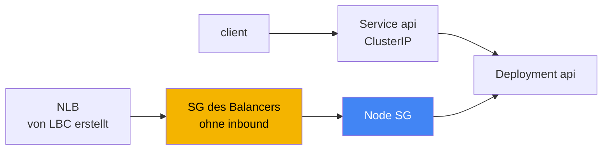
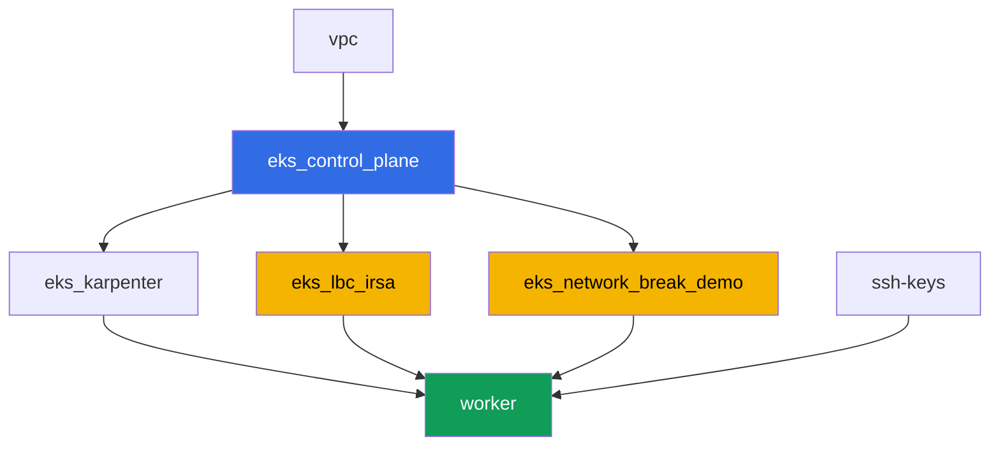

[Русская версия](README_RU.MD) · [Eng version](README.MD) · [Versión en español](README_ES.MD) · [Version française](README_FR.MD) · [ქართული ვერსია](README_GE.MD) · [繁體中文版](README_TW.MD) · [日本語版](README_JP.MD)

# Lab 120 - Troubleshooting: Netzwerkausfälle und unhealthy Load-Balancer-Targets

## Beschreibung

Der Cluster läuft, die Nodes sind `Ready`, aber das Netzwerk verhält sich auf
zwei verschiedene Arten falsch: an einer Stelle bricht die Konnektivität ab,
an anderer Stelle werden Load-Balancer-Targets rot. In dieser Lab arbeiten Sie
genau eine Fehlerklasse durch - security group - und lernen, sie von DNS zu
unterscheiden, das hier nicht die Ursache ist. Es gibt genau einen
deterministischen Fehler: Terraform legt vorab eine leere security group ohne
eine einzige inbound rule an. Sie hängen sie als eigene SG an einen Network
Load Balancer, beobachten, wie die Targets `unhealthy` werden, diagnostizieren
die Ursache mit AWS CLI Befehlen und beheben sie mit demselben Tool - `aws ec2
authorize-security-group-ingress`.

Design-Entscheidung. Dieselbe Terraform-Konfiguration muss den Fehler bei
jedem Lab-Lauf deterministisch reproduzieren, deshalb ist die Fehlerquelle
genau eine vorab erstellte leere security group ohne inbound rules. Ihre
Rolle in der Lab ist die eigene security group des NLB (die Service-Annotation
`aws-load-balancer-security-groups`). Sobald Sie dem Balancer explizit eine
eigene SG setzen, hört der AWS Load Balancer Controller auf, für Sie die
fehlende inbound rule in der Node-SG zu ergänzen - das ist genau die Aussage
aus Kapitel 46.6: "die SG des Targets lässt keinen Traffic von der SG des
Balancers zum check port durch". Pod-zu-Pod-Konnektivität (Aufgaben 1-2) in
dieser Lab funktioniert design-bedingt einwandfrei - sie dient als
Kontrastbeispiel und als Übungsfeld für die Diagnosebefehle aus Kapitel 46.7,
während der eine echte Fehler im NLB-Szenario liegt (Aufgaben 4-6). Das
Szenario mit einer eigenen SG des Pods (security groups for pods) ist Thema
einer separaten Kurs-Lab.

Die Aufgaben sind im Produktionsstil geschrieben: eine kurze Aufgabenstellung
plus Abnahmekriterien. Die Prüfung ist automatisch, über den Befehl
`check_result`.

## Ziel

Das Kapitel des Kurses vertiefen:

- [Kapitel 46. Netzwerkausfälle: SG, NACL, DNS, unhealthy targets](../../course/46/de.md)

## Was wir erstellen

Der Cluster ist bereits als Code deployt (dieselbe Basis wie in Lab 101), plus
eine IRSA-Rolle für den AWS Load Balancer Controller und eine separate
"kaputte" security group ohne inbound rules.

| Objekt | Was es ist | Warum es in dieser Lab ist |
|--------|---------|-------------------|
| Namespace `eks-120` | ein Cluster-Bereich für die Workload der Lab | hält die Objekte der Lab von den System-Objekten getrennt |
| Deployment `api` (2 Replicas) | die ping_pong-Anwendung, Port `8080` | das Target für Konnektivitätsprüfungen und den NLB |
| Service `api` (ClusterIP) | `80 -> 8080` | Baseline-Konnektivität innerhalb des Clusters |
| Deployment `client` | busybox, `sleep` | Quelle der Requests an `api` |
| Komponente `eks_network_break_demo` | leere SG ohne inbound rules | der Fehler selbst (Kapitel 46.3, 46.6) |
| Komponente `eks_lbc_irsa` | IRSA-Rolle für den Controller | Berechtigungen auf der ELBv2-API für die Helm-Installation |
| Service `api-lb` (LoadBalancer) | NLB mit der "kaputten" SG als SG des Balancers | reproduziert unhealthy targets (Kapitel 46.6) |

Das resultierende Traffic-Bild:



## Infrastruktur

Die Umgebung wird in AWS (`eu-central-1`) über Terragrunt deployt. Jedes
Lab-Verzeichnis ist eine Komponente mit eigener `terragrunt.hcl`, die auf ein
gemeinsames Modul in `terraform/modules/` verweist und Abhängigkeiten über
`dependency`-Blöcke deklariert.

### Module und Abhängigkeiten

| Verzeichnis (Komponente) | Modul (`terraform/modules/`) | Abhängig von | Was es erstellt |
|---------------------|-------------------------------|------------|-------------|
| `vpc` | `vpc_v3` | - | VPC `10.10.0.0/16`, Subnets in zwei AZs, NAT |
| `ssh-keys` | `ssh-keys` | - | ein SSH-Schlüsselpaar für die Worker-Maschine |
| `eks_control_plane` | `eks_v2_control_plane` | `vpc` | EKS control plane `1.36`, OIDC, Node-SG |
| `eks_fargate_system` | `eks_v2_fargate` | `vpc`, `eks_control_plane` | Fargate-Profil für `kube-system` und `karpenter` |
| `eks_addons` | `eks_v2_addons` | `eks_control_plane`, `eks_fargate_system` | Addons coredns, kube-proxy, vpc-cni, pod-identity |
| `eks_karpenter` | `eks_v2_karpenter` | `vpc`, `eks_control_plane`, `eks_addons`, `eks_fargate_system` | Karpenter-Controller, IAM-Rolle der Nodes |
| `eks_karpenter_default_vng` | `eks_v2_karpenter_vng` | `vpc`, `eks_control_plane`, `eks_karpenter` | Standard-NodePool auf AL2023 |
| `eks_lbc_irsa` | `eks_v2_lbc_irsa` | `eks_control_plane` | IAM-IRSA-Rolle für den AWS Load Balancer Controller |
| `eks_network_break_demo` | `eks_v2_network_break_demo` | `vpc`, `eks_control_plane` | leere SG ohne inbound rules |
| `worker` | `eks_v2_work_pc` | `ssh-keys`, `vpc`, `eks_control_plane`, `eks_karpenter`, `eks_lbc_irsa`, `eks_network_break_demo` | Worker-Maschine mit `check_result` |

Das Modul `eks_v2_network_break_demo` erstellt genau eine security group mit
korrekter Beschreibung, aber ganz ohne inbound rules (nur allow-all egress,
damit sich die SG vorhersehbar verhält und die Diagnostik des ausgehenden
Traffics nicht verwirrt). Der SG-Name wird vorhersehbar aus `prefix` und
`app_name` zusammengesetzt: `eks-task120-network-break-sg`. Die Ressource
selbst weiß nicht, wozu sie angehängt wird - das entscheidet der Student nach
der Anleitung von Aufgabe 4.

Abhängigkeitsgraph (früher angewendet bedeutet weiter unten im Pfeil):



Die Komponenten `eks_fargate_system`, `eks_addons`, `eks_karpenter_default_vng`
werden im Graphen nicht dargestellt, um ihn unter 8 Knoten zu halten - sie
werden in der Standardreihenfolge zwischen `eks_control_plane` und
`eks_karpenter` angewendet, wie in Lab 101.

### Vorhersehbare Ressourcennamen

`eks_network_break_demo` und `eks_lbc_irsa` setzen ihre Namen aus `prefix` und
`app_name` zusammen, sodass der Worker sie finden kann, ohne den
Terraform-Output zu lesen. Sie sind in der Datei `~/lab120_hints.txt` auf der
Worker-Maschine festgehalten:

| Ressource | Wie man sie findet |
|--------|-----------|
| "Kaputte" SG | Name `eks-task120-network-break-sg` |
| IRSA-Rolle für den LBC | Rollenname `<cluster-name>-lbc-irsa` |
| Karpenter Node-SG | Tag `karpenter.sh/discovery=<cluster-name>` |

### Wo die Einstellungen konfiguriert sind

`env.hcl` (gemeinsame Umgebungsparameter):

| Parameter | Wert in der Lab | Was er beeinflusst |
|----------|-----------------|---------------|
| `region` | `eu-central-1` | Region für alle Ressourcen |
| `prefix` | `eks-task120` | Präfix für Ressourcennamen, einschließlich der "kaputten" SG |
| `stack_name` | `eks120` | wird verwendet, um `env_name` zu bilden - den Cluster-Namen |
| `k8_version` | `1.36.0` | kubectl-Version auf der Worker-Maschine |

`inputs` in der `terragrunt.hcl` jeder Komponente:

| Datei | Wichtige Einstellungen |
|------|--------------------|
| `eks_network_break_demo/terragrunt.hcl` | `vpc_id` des Clusters, "kaputte" SG ohne rule-inputs |
| `eks_lbc_irsa/terragrunt.hcl` | `name` (Cluster) und `oidc_provider_arn` für die trust policy |
| `worker/terragrunt.hcl` | `test_url`, `task_script_url` für die Dateien von Lab 120 |

## Deployment

```bash
TASK=120 make run_eks_task
```

Das Deployment dauert etwa 15-20 Minuten. Finden Sie in der Ausgabe die Zeile
mit der SSH-Verbindung zur Worker-Maschine und verbinden Sie sich damit.
kubectl ist dort bereits für den richtigen Cluster konfiguriert, und die
Ressourcennamen der Lab stehen in `~/lab120_hints.txt`.

Nützliche Befehle auf der Worker-Maschine:

```bash
time_left       # wie viel Zeit in der Umgebung übrig ist
check_result    # die Lösung prüfen
cat ~/lab120_hints.txt   # Namen und ARNs der Ressourcen der Lab
```

> Sicherheit der Umgebung. In `env.hcl` sind `ssh_password_enable = true` und
> `access_cidrs = ["0.0.0.0/0"]` aktiviert - praktisch für eine Lernumgebung,
> aber so etwas gehört nicht in die Produktion. Nach den Standards des Kurses
> (Kapitel 0.2, 2, 19) sollte der Zugriff auf Worker-Maschinen über AWS SSM
> Session Manager erfolgen, ohne öffentliche SSH-Ports offenzulegen, und
> `access_cidrs` sollte auf bestimmte Adressen eingeschränkt werden. Hier
> bleibt öffentliches SSH nur bestehen, um das Setup einfach zu halten.

## Aufgaben

Block 1 (Aufgaben 1-2) ist Baseline-Konnektivität innerhalb des Clusters, die
einwandfrei funktioniert und als Übungsfeld für die Diagnosebefehle aus
Kapitel 46.7 dient. Block 2 (Aufgaben 3-6) ist der eine echte Fehler der Lab:
unhealthy targets im NLB, verursacht durch eine SG (Kapitel 46.6). Block 3
(Aufgaben 7-8) ist eine DNS-Plausibilitätsprüfung und eine abschließende
Checkliste.

---
|        **1**        | **Namespace und die Workload der Lab**                                |
| :-----------------: | :----------------------------------------------------------- |
| Was zu tun ist          | Erstellen Sie einen Namespace mit dem Namen `eks-120`. Erstellen Sie darin Deployment `api` (Image `viktoruj/ping_pong:latest`, `2` Replicas, `containerPort: 8080`, Label `app: api`) und Service `api` vom Typ `ClusterIP` (`port: 80`, `targetPort: 8080`, Selector `app: api`). Erstellen Sie Deployment `client` (Image `busybox:1.36`, Befehl `sleep 3600`, Label `app: client`). Warten Sie, bis beide Deployments ready sind. |
| Abnahmekriterien    | - Namespace `eks-120` existiert;<br/>- Deployment `api` (`2/2` Replicas, Image `ping_pong`);<br/>- Deployment `client` (`1/1`, Image `busybox`);<br/>- Service `api` ClusterIP mit `targetPort: 8080`. |
---
|        **2**        | **Baseline-Konnektivität und SG-Diagnostik**                       |
| :-----------------: | :------------------------------------------------------------ |
| Was zu tun ist          | Stellen Sie vom `client`-Pod aus eine Anfrage an `api` über den DNS-Namen des Service (`wget -qO- --timeout=5 http://api.eks-120.svc.cluster.local` oder ein curl-Äquivalent) und speichern Sie die Antwort in `/var/work/tests/artifacts/2/connectivity.txt` - sie sollte eine Zeile mit der Antwort der Anwendung enthalten. Nehmen Sie dann die IP eines der `api`-Pods und finden Sie sein ENI: `aws ec2 describe-network-interfaces --filters "Name=addresses.private-ip-address,Values=<ip>" --query 'NetworkInterfaces[0].Groups'`, und speichern Sie die Ausgabe in `/var/work/tests/artifacts/2/api_sg.txt`. Achten Sie auf den Filter: mit VPC CNI ist die IP des Pods eine sekundäre Adresse auf dem ENI der Node, deshalb liefert die Suche nach `private-ip-address` `null` - Sie benötigen stattdessen `addresses.private-ip-address`. Diese Konnektivität funktioniert einwandfrei: die Node-SG lässt Traffic zwischen Cluster-Pods zu, und SGs sind stateful, sodass der Rückverkehr von selbst durchgeht (Kapitel 46.3). |
| Abnahmekriterien    | - `2/connectivity.txt` ist nicht leer und enthält `Server Name`;<br/>- `2/api_sg.txt` ist nicht leer und enthält `GroupId` und die id der Node-SG des Clusters. |
---
|        **3**        | **Installation des AWS Load Balancer Controllers**                   |
| :-----------------: | :------------------------------------------------------------ |
| Was zu tun ist          | Finden Sie den ARN der von Terraform für den Controller erstellten IAM-Rolle (Rollenname `<cluster-name>-lbc-irsa`, verfügbar in `~/lab120_hints.txt`), und erstellen Sie ServiceAccount `aws-load-balancer-controller` in `kube-system` mit der Annotation `eks.amazonaws.com/role-arn`, die auf diese Rolle zeigt. Installieren Sie den AWS Load Balancer Controller über Helm (Repository `https://aws.github.io/eks-charts`, Chart `aws-load-balancer-controller`) mit den Flags `--set serviceAccount.create=false --set serviceAccount.name=aws-load-balancer-controller` und `--set clusterName=<cluster name>`. Hinweis: in dieser Umgebung fällt `kube-system` unter das Fargate-Profil, und Fargate hat kein IMDS, sodass der Controller Region und VPC nicht selbst bestimmen kann und mit einem Fehler abbricht, der `ec2imds` erwähnt. Setzen Sie sie explizit: `--set region=eu-central-1` und `--set vpcId=<vpc-id>` (die id erhalten Sie über `aws eks describe-cluster --name <cluster> --query 'cluster.resourcesVpcConfig.vpcId'`). Warten Sie, bis Deployment `aws-load-balancer-controller` ready ist. |
| Abnahmekriterien    | - ServiceAccount `aws-load-balancer-controller` in `kube-system` mit einer Annotation, die auf die Rolle `lbc-irsa` zeigt;<br/>- Deployment `aws-load-balancer-controller` hat mindestens eine ready Replica. |
---
|        **4**        | **Symptom: NLB mit unhealthy targets**                          |
| :-----------------: | :------------------------------------------------------------ |
| Was zu tun ist          | Finden Sie die id der "kaputten" SG (Name `eks-task120-network-break-sg`, verfügbar in `~/lab120_hints.txt`). Erstellen Sie Service `api-lb` vom Typ `LoadBalancer` mit Selector `app: api`, Port `80` auf `targetPort: 8080`, und den Annotationen `service.beta.kubernetes.io/aws-load-balancer-type: external`, `aws-load-balancer-nlb-target-type: ip`, `aws-load-balancer-scheme: internet-facing`, `aws-load-balancer-security-groups: <id der kaputten SG>`. Diese Annotation macht die "kaputte" SG zur eigenen SG des Balancers - sie hat keine inbound rules, deshalb fügt der LBC die fehlende Regel für den health check nicht automatisch hinzu. Warten Sie auf die externe Adresse, führen Sie dann `aws elbv2 describe-target-health --target-group-arn <arn> --query 'TargetHealthDescriptions[].[Target.Id,TargetHealth.State,TargetHealth.Reason]'` aus und speichern Sie die Ausgabe in `/var/work/tests/artifacts/4/unhealthy.txt`. |
| Abnahmekriterien    | - Service `api-lb` mit den drei Annotationen und einer externen Adresse;<br/>- `4/unhealthy.txt` ist nicht leer und enthält `unhealthy`. |
---
|        **5**        | **Diagnostik: welche SG den health check blockiert**               |
| :-----------------: | :------------------------------------------------------------ |
| Was zu tun ist          | Führen Sie `aws ec2 describe-security-groups --group-ids <id der kaputten SG>` aus und bestätigen Sie, dass sie überhaupt keine inbound rules hat. Finden Sie die id der Karpenter Node-SG (Tag `karpenter.sh/discovery=<cluster-name>`, der Befehl steht in `~/lab120_hints.txt`) und erklären Sie in `/var/work/tests/artifacts/5/diagnosis.txt`, warum der health check vom NLB den `api`-Pod nicht erreicht: die SG des Targets (die Node-SG) lässt keinen inbound Traffic von der SG des Balancers auf dem check port zu (Kapitel 46.6). Der Text muss die Wörter `security group` und `health check` enthalten. |
| Abnahmekriterien    | - `5/diagnosis.txt` ist nicht leer und enthält `security group` und `health check`. |
---
|        **6**        | **Fix: authorize-security-group-ingress, targets healthy**    |
| :-----------------: | :------------------------------------------------------------ |
| Was zu tun ist          | Fügen Sie zwei Regeln hinzu: `aws ec2 authorize-security-group-ingress --group-id <Node-SG> --protocol tcp --port 8080 --source-group <kaputte SG>` (öffnet den health check und den Anwendungstraffic von der SG des Balancers zur Node-SG) und `aws ec2 authorize-security-group-ingress --group-id <kaputte SG> --protocol tcp --port 80 --cidr 0.0.0.0/0` (öffnet den NLB-Listener für Clients). Warten Sie auf `healthy` in `describe-target-health` und einen erfolgreichen `curl` gegen die externe Adresse des NLB. Speichern Sie beide Ausgaben in `/var/work/tests/artifacts/6/healthy.txt`. |
| Abnahmekriterien    | - `6/healthy.txt` ist nicht leer, enthält `healthy` und enthält nicht `FailedHealthChecks`;<br/>- die Datei hat eine Zeile mit der Antwort der Anwendung (`Server Name`). |
---
|        **7**        | **DNS funktioniert: eine kontrastierende Prüfung**                        |
| :-----------------: | :------------------------------------------------------------ |
| Was zu tun ist          | Führen Sie `kubectl run dnstest --image=busybox:1.36 --rm -i --restart=Never -- sh -c 'nslookup kubernetes.default.svc.cluster.local; nslookup example.com'` aus und speichern Sie die Ausgabe in `/var/work/tests/artifacts/7/dns.txt`. Fragen Sie den internen Namen über seinen vollen FQDN ab: das kurze `kubernetes.default` von busybox liefert `NXDOMAIN`, weil sein `nslookup` die search domains nicht anhängt, und diese Antwort wird leicht mit einem DNS-Fehler verwechselt, der hier gar nicht vorliegt. In dieser Lab ist DNS nicht die Ursache des Problems - beide Namen werden einwandfrei aufgelöst, im Gegensatz zur security group aus den Aufgaben 4-6 (Kapitel 46.5, 46.7). |
| Abnahmekriterien    | - `7/dns.txt` ist nicht leer und enthält `kubernetes.default` und `example.com`. |
---
|        **8**        | **Abschließende Checkliste: Symptom - wahrscheinliche Ursache - was zu prüfen ist**       |
| :-----------------: | :------------------------------------------------------------ |
| Was zu tun ist          | Füllen Sie in der Datei `/var/work/tests/artifacts/8/summary.txt` eine Zeile für das Symptom dieser Lab gemäß der Checkliste aus Kapitel 46.7 aus: welches Symptom beobachtet wurde (`unhealthy` targets), was die wahrscheinliche Ursache ist (`security group` blockiert den `health check`), und welcher Befehl es prüft (`describe-target-health`). Der Text muss die Wörter `unhealthy`, `security group` und `health check` enthalten. |
| Abnahmekriterien    | - `8/summary.txt` ist nicht leer und enthält `unhealthy`, `security group`, `health check`. |
---

## Prüfung des Ergebnisses

Führen Sie auf der Worker-Maschine die automatische Prüfung aus:

```bash
check_result
```

Das Skript führt die Tests aus und zeigt den Prozentsatz der erledigten
Aufgaben.

## Lösung

Referenzlösung: [worker/files/solutions/1_DE.MD](worker/files/solutions/1_DE.MD)

## Löschen des Clusters und der Ressourcen

> **Entfernen Sie zuerst, was der Controller erstellt hat, und führen Sie erst
> danach Terraform aus.** Der NLB wurde vom AWS Load Balancer Controller aus
> Ihrem Service erstellt, und Terraform weiß nichts davon. Wenn Sie den Stack
> abbauen, ohne den Service zu löschen, verschwindet der Controller zusammen
> mit dem Cluster, der NLB bleibt zurück, seine ENIs halten weiterhin die
> security groups fest - und `destroy` hängt bei
> `aws_security_group.network_break: Still destroying...` für Zehner von
> Minuten.
>
> **Der Controller wird die Regel, die Sie in Aufgabe 6 zur Node-SG
> hinzugefügt haben, nicht aufräumen**, und das ist eine direkte Folge des
> Szenarios der Lab. Der Controller räumt nur auf, was ihm gehört: den NLB und
> die security groups, die er selbst erstellt hat. Hier wird die
> Frontend-security-group manuell über die Annotation
> `aws-load-balancer-security-groups` gesetzt, und in diesem Modus rührt der
> LBC standardmäßig die Regeln der Backend-security-group (also der Node-SG)
> überhaupt nicht an - genau deshalb ist der health check nicht durchgekommen.
> Sie haben die Regel per Hand über die AWS CLI hinzugefügt, sie hat keinen
> Besitzer im Cluster, also müssen Sie sie auch per Hand entfernen. Das ist
> wichtig: eine Referenz von einer anderen security group verhindert das
> Löschen der Ziel-SG, und `destroy` würde stattdessen daran hängen bleiben.
> Hätten Sie
> `service.beta.kubernetes.io/aws-load-balancer-manage-backend-security-group-rules: "true"`
> gesetzt, würde der Controller selbst die Regeln in der Node-SG hinzufügen
> und entfernen.

```bash
# 1. Service löschen, damit der Controller den NLB selbst entfernt, und warten, bis das ENI verschwindet
kubectl delete svc api-lb -n eks-120
SG_ID=$(grep '^broken_sg_id' ~/lab120_hints.txt | awk '{print $3}')
NODE_SG=$(grep '^node_sg_id' ~/lab120_hints.txt | awk '{print $3}')
until [ "$(aws ec2 describe-network-interfaces \
  --filters "Name=group-id,Values=${SG_ID}" --query 'length(NetworkInterfaces)' --output text)" = "0" ]; do
  echo "NLB hält die ENI noch, warten..."; sleep 15
done

# 2. Die Regel in der Node-SG entfernen, die auf die SG des Balancers verweist
aws ec2 revoke-security-group-ingress --group-id "$NODE_SG" \
  --protocol tcp --port 8080 --source-group "$SG_ID"

# 3. Den Namespace der Lab löschen, und erst jetzt den Stack abbauen
kubectl delete namespace eks-120
```

```bash
TASK=120 make delete_eks_task
```

Wenn `destroy` weiterhin beim Löschen einer security group hängen bleibt,
finden Sie, was sie festhält, und entfernen Sie es:

```bash
# wer die SG festhält: das ENI eines verwaisten Balancers
aws ec2 describe-network-interfaces --filters "Name=group-id,Values=<sg-id>" \
  --query 'NetworkInterfaces[].[NetworkInterfaceId,Description]' --output table
# ein verwaister Balancer lässt sich an den Tags service.k8s.aws/stack und elbv2.k8s.aws/cluster erkennen
aws elbv2 delete-load-balancer --load-balancer-arn <arn>
# welche security groups in ihren Regeln darauf verweisen
aws ec2 describe-security-groups --filters "Name=ip-permission.group-id,Values=<sg-id>" \
  --query 'SecurityGroups[].[GroupId,GroupName]' --output table
```
