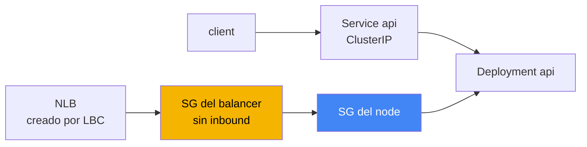
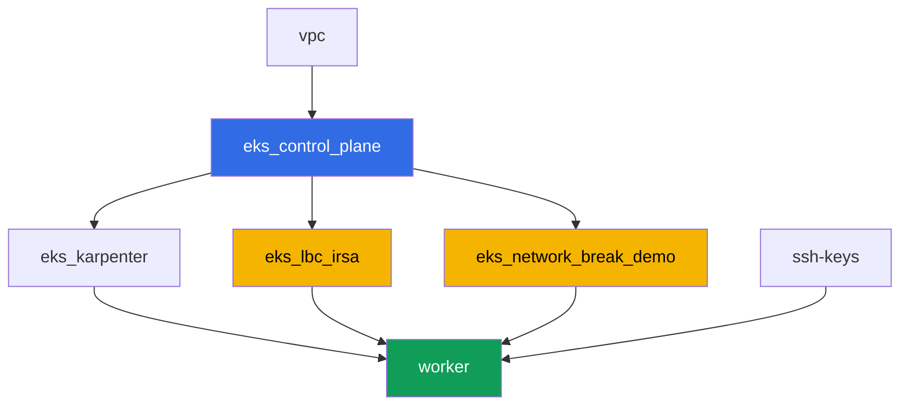

[Русская версия](README_RU.MD) · [Eng version](README.MD) · [Version française](README_FR.MD) · [Deutsche Version](README_DE.MD) · [ქართული ვერსია](README_GE.MD) · [繁體中文版](README_TW.MD) · [日本語版](README_JP.MD)

# Lab 120 - Solución de problemas: fallos de red y targets no saludables en el load balancer

## Descripción

El cluster está activo, los nodes están `Ready`, pero la red se comporta mal de dos
maneras distintas: la conectividad se rompe en un lugar, y los targets del load balancer
se ponen en rojo en otro. En esta lab trabajas exactamente una clase de fallo - security
group - y aprendes a distinguirlo del DNS, que aquí no es el culpable. Hay un fallo
determinista: terraform pre-crea un security group vacío sin una sola regla inbound. Lo
asignas a un Network Load Balancer como el SG propio del balancer, observas cómo los
targets se ponen `unhealthy`, diagnosticas la causa con comandos de la AWS CLI y lo
arreglas con la misma herramienta - `aws ec2 authorize-security-group-ingress`.

Decisión de diseño. La misma configuración de terraform debe reproducir el fallo de
forma determinista en cada ejecución de la lab, así que el origen del fallo es
exactamente un security group vacío pre-creado sin reglas inbound. Su rol en la lab es
ser el security group propio del NLB (la anotación del Service
`aws-load-balancer-security-groups`). En el momento en que asignas tu propio SG al
balancer de forma explícita, el AWS Load Balancer Controller deja de añadir por ti la
regla inbound faltante en el SG del node - esa es exactamente la afirmación del capítulo
46.6: "el SG del target no deja pasar el tráfico del SG del balancer hacia el puerto de
check". La conectividad pod-to-pod (tareas 1-2) en esta lab funciona bien por diseño -
sirve como ejemplo contrastante y como campo de práctica para los comandos de
diagnóstico del capítulo 46.7, mientras que el único fallo real vive en el escenario del
NLB (tareas 4-6). El escenario con un SG propio del pod (security groups para pods) es
el tema de otra lab del curso, por separado.

Las tareas están escritas en estilo de producción: un enunciado breve más criterios de
aceptación. La verificación es automática, mediante el comando `check_result`.

## Objetivo

Reforzar el material de este capítulo del curso:

- [Capítulo 46. Fallos de red: SG, NACL, DNS, targets no saludables](../../course/46/ru.md)

## Qué creamos

El cluster ya está desplegado como código (la misma base que en la lab 101), más un rol
IRSA para el AWS Load Balancer Controller y un security group "roto" separado sin reglas
inbound.

| Objeto | Qué es | Por qué está en esta lab |
|--------|---------|-------------------|
| Namespace `eks-120` | una sección del cluster para la carga de trabajo de la lab | mantiene los recursos separados de los del sistema |
| Deployment `api` (2 réplicas) | la aplicación ping_pong, puerto `8080` | el target para los checks de conectividad y el NLB |
| Service `api` (ClusterIP) | `80 -> 8080` | conectividad base dentro del cluster |
| Deployment `client` | busybox, `sleep` | origen de las peticiones hacia `api` |
| Componente `eks_network_break_demo` | SG vacío sin reglas inbound | el fallo mismo (capítulos 46.3, 46.6) |
| Componente `eks_lbc_irsa` | rol IRSA para el controller | permisos sobre la API de ELBv2 para la instalación con Helm |
| Service `api-lb` (LoadBalancer) | NLB con el SG "roto" como SG del balancer | reproduce los targets no saludables (capítulo 46.6) |

El diagrama resultante del tráfico:



## Infraestructura

El entorno se despliega en AWS (`eu-central-1`) mediante Terragrunt. Cada directorio de
la lab es un componente con su propio `terragrunt.hcl`, que referencia un módulo
compartido en `terraform/modules/` y declara dependencias mediante bloques `dependency`.

### Módulos y dependencias

| Directorio (componente) | Módulo (`terraform/modules/`) | Depende de | Qué crea |
|---------------------|-------------------------------|------------|-------------|
| `vpc` | `vpc_v3` | - | VPC `10.10.0.0/16`, subredes en dos AZ, NAT |
| `ssh-keys` | `ssh-keys` | - | un par de claves SSH para la máquina worker |
| `eks_control_plane` | `eks_v2_control_plane` | `vpc` | control plane de EKS `1.36`, OIDC, SG del node |
| `eks_fargate_system` | `eks_v2_fargate` | `vpc`, `eks_control_plane` | perfil Fargate para `kube-system` y `karpenter` |
| `eks_addons` | `eks_v2_addons` | `eks_control_plane`, `eks_fargate_system` | addons coredns, kube-proxy, vpc-cni, pod-identity |
| `eks_karpenter` | `eks_v2_karpenter` | `vpc`, `eks_control_plane`, `eks_addons`, `eks_fargate_system` | controller de Karpenter, rol IAM de los nodes |
| `eks_karpenter_default_vng` | `eks_v2_karpenter_vng` | `vpc`, `eks_control_plane`, `eks_karpenter` | NodePool por defecto en AL2023 |
| `eks_lbc_irsa` | `eks_v2_lbc_irsa` | `eks_control_plane` | rol IAM IRSA para el AWS Load Balancer Controller |
| `eks_network_break_demo` | `eks_v2_network_break_demo` | `vpc`, `eks_control_plane` | SG vacío sin reglas inbound |
| `worker` | `eks_v2_work_pc` | `ssh-keys`, `vpc`, `eks_control_plane`, `eks_karpenter`, `eks_lbc_irsa`, `eks_network_break_demo` | máquina worker con `check_result` |

El módulo `eks_v2_network_break_demo` crea exactamente un security group con una
descripción correcta pero sin ninguna regla inbound (solo egress allow-all, para que el
SG se comporte de forma predecible y no confunda los diagnósticos del tráfico outbound).
El nombre del SG se ensambla de forma predecible a partir de `prefix` y `app_name`:
`eks-task120-network-break-sg`. El recurso en sí no sabe a qué se conectará - eso lo
decide el estudiante siguiendo las instrucciones de la tarea 4.

Grafo de dependencias (lo que se aplica antes queda más abajo en la flecha):



Los componentes `eks_fargate_system`, `eks_addons`, `eks_karpenter_default_vng` no se
muestran en el grafo para mantenerlo por debajo de 8 nodos - se aplican en el orden
estándar entre `eks_control_plane` y `eks_karpenter`, igual que en la lab 101.

### Nombres de recursos predecibles

`eks_network_break_demo` y `eks_lbc_irsa` ensamblan sus nombres a partir de `prefix` y
`app_name`, así que el worker puede encontrarlos sin leer el output de terraform. Están
registrados en el archivo `~/lab120_hints.txt` en la máquina worker:

| Recurso | Cómo encontrarlo |
|--------|-----------|
| SG "roto" | nombre `eks-task120-network-break-sg` |
| Rol IRSA para el LBC | nombre de rol `<cluster-name>-lbc-irsa` |
| SG del node de Karpenter | tag `karpenter.sh/discovery=<cluster-name>` |

### Dónde se configura todo

`env.hcl` (parámetros compartidos del entorno):

| Parámetro | Valor en la lab | A qué afecta |
|----------|-----------------|---------------|
| `region` | `eu-central-1` | región para todos los recursos |
| `prefix` | `eks-task120` | prefijo para los nombres de recursos, incluyendo el SG "roto" |
| `stack_name` | `eks120` | se usa para construir `env_name` - el nombre del cluster |
| `k8_version` | `1.36.0` | versión de kubectl en la máquina worker |

`inputs` en el `terragrunt.hcl` de cada componente:

| Archivo | Configuraciones clave |
|------|--------------------|
| `eks_network_break_demo/terragrunt.hcl` | `vpc_id` del cluster, SG "roto" sin inputs de reglas |
| `eks_lbc_irsa/terragrunt.hcl` | `name` (cluster) y `oidc_provider_arn` para la trust policy |
| `worker/terragrunt.hcl` | `test_url`, `task_script_url` para los archivos de la lab 120 |

## Despliegue

```bash
TASK=120 make run_eks_task
```

El despliegue tarda aproximadamente 15-20 minutos. En la salida, busca la línea con la
conexión SSH a la máquina worker y conéctate a ella. kubectl ahí ya está configurado
para el cluster correcto, y los nombres de los recursos de la lab están en
`~/lab120_hints.txt`.

Comandos útiles en la máquina worker:

```bash
time_left       # cuánto tiempo queda en el entorno
check_result    # verificar la solución
cat ~/lab120_hints.txt   # nombres y ARNs de los recursos de la lab
```

> Seguridad del entorno. `env.hcl` tiene habilitados `ssh_password_enable = true` y
> `access_cidrs = ["0.0.0.0/0"]` - conveniente para un entorno de entrenamiento, pero
> esto no debe hacerse en producción. Según los estándares del curso (capítulos 0.2, 2,
> 19), el acceso a las máquinas worker debe hacerse mediante AWS SSM Session Manager sin
> exponer puertos SSH públicos, y `access_cidrs` debe restringirse a direcciones
> específicas. Aquí el SSH público se deja solo por simplicidad de la configuración.

## Tareas

El bloque 1 (tareas 1-2) es conectividad base dentro del cluster, que funciona bien y
sirve como campo de práctica para los comandos de diagnóstico del capítulo 46.7. El
bloque 2 (tareas 3-6) es el único fallo real de la lab: targets no saludables en el NLB
causados por un SG (capítulo 46.6). El bloque 3 (tareas 7-8) es una verificación de
cordura de DNS y una checklist final.

---
|        **1**        | **Namespace y la carga de trabajo de la lab**                                |
| :-----------------: | :----------------------------------------------------------- |
| Qué hacer          | Crea un namespace llamado `eks-120`. Dentro de él, crea el Deployment `api` (imagen `viktoruj/ping_pong:latest`, `2` réplicas, `containerPort: 8080`, label `app: api`) y el Service `api` de tipo `ClusterIP` (`port: 80`, `targetPort: 8080`, selector `app: api`). Crea el Deployment `client` (imagen `busybox:1.36`, comando `sleep 3600`, label `app: client`). Espera a que ambos Deployments estén listos. |
| Criterios de aceptación    | - el namespace `eks-120` existe;<br/>- Deployment `api` (`2/2` réplicas, imagen `ping_pong`);<br/>- Deployment `client` (`1/1`, imagen `busybox`);<br/>- Service `api` ClusterIP con `targetPort: 8080`. |
---
|        **2**        | **Conectividad base y diagnóstico de SG**                       |
| :-----------------: | :------------------------------------------------------------ |
| Qué hacer          | Desde el pod `client`, haz una petición a `api` por el nombre DNS del service (`wget -qO- --timeout=5 http://api.eks-120.svc.cluster.local` o el equivalente con curl) y guarda la respuesta en `/var/work/tests/artifacts/2/connectivity.txt` - debe contener una línea con la respuesta de la aplicación. Luego toma la IP de uno de los pods `api` y encuentra su ENI: `aws ec2 describe-network-interfaces --filters "Name=addresses.private-ip-address,Values=<ip>" --query 'NetworkInterfaces[0].Groups'`, guardando la salida en `/var/work/tests/artifacts/2/api_sg.txt`. Presta atención al filtro: con VPC CNI, la IP del pod es una dirección secundaria en el ENI del node, así que buscar por `private-ip-address` devuelve `null` - se necesita `addresses.private-ip-address` en su lugar. Esta conectividad funciona bien: el SG del node permite el tráfico entre pods del cluster, y los SG son stateful, así que el tráfico de retorno pasa por sí solo (capítulo 46.3). |
| Criterios de aceptación    | - `2/connectivity.txt` no está vacío y contiene `Server Name`;<br/>- `2/api_sg.txt` no está vacío y contiene `GroupId` y el id del SG del node del cluster. |
---
|        **3**        | **Instalación del AWS Load Balancer Controller**                   |
| :-----------------: | :------------------------------------------------------------ |
| Qué hacer          | Encuentra el ARN del rol IAM creado por terraform para el controller (nombre de rol `<cluster-name>-lbc-irsa`, disponible en `~/lab120_hints.txt`), y crea el ServiceAccount `aws-load-balancer-controller` en `kube-system` con la anotación `eks.amazonaws.com/role-arn` apuntando a ese rol. Instala el AWS Load Balancer Controller vía Helm (repositorio `https://aws.github.io/eks-charts`, chart `aws-load-balancer-controller`) con las flags `--set serviceAccount.create=false --set serviceAccount.name=aws-load-balancer-controller` y `--set clusterName=<cluster name>`. Nota: en este entorno `kube-system` cae bajo el perfil Fargate, y Fargate no tiene IMDS, así que el controller no puede determinar la región y la VPC por sí mismo y fallará con un error que menciona `ec2imds`. Configúralos de forma explícita: `--set region=eu-central-1` y `--set vpcId=<vpc-id>` (obtén el id de `aws eks describe-cluster --name <cluster> --query 'cluster.resourcesVpcConfig.vpcId'`). Espera a que el Deployment `aws-load-balancer-controller` esté listo. |
| Criterios de aceptación    | - ServiceAccount `aws-load-balancer-controller` en `kube-system` con una anotación apuntando al rol `lbc-irsa`;<br/>- el Deployment `aws-load-balancer-controller` tiene al menos una réplica lista. |
---
|        **4**        | **Síntoma: NLB con targets no saludables**                          |
| :-----------------: | :------------------------------------------------------------ |
| Qué hacer          | Encuentra el id del SG "roto" (nombre `eks-task120-network-break-sg`, disponible en `~/lab120_hints.txt`). Crea el Service `api-lb` de tipo `LoadBalancer` con selector `app: api`, puerto `80` sobre `targetPort: 8080`, y las anotaciones `service.beta.kubernetes.io/aws-load-balancer-type: external`, `aws-load-balancer-nlb-target-type: ip`, `aws-load-balancer-scheme: internet-facing`, `aws-load-balancer-security-groups: <id del SG roto>`. Esta anotación convierte al SG "roto" en el SG propio del balancer - no tiene reglas inbound, así que el LBC no añadirá automáticamente la regla faltante para el health check. Espera la dirección externa, luego ejecuta `aws elbv2 describe-target-health --target-group-arn <arn> --query 'TargetHealthDescriptions[].[Target.Id,TargetHealth.State,TargetHealth.Reason]'` y guarda la salida en `/var/work/tests/artifacts/4/unhealthy.txt`. |
| Criterios de aceptación    | - Service `api-lb` con las tres anotaciones y una dirección externa;<br/>- `4/unhealthy.txt` no está vacío y contiene `unhealthy`. |
---
|        **5**        | **Diagnóstico: qué SG está bloqueando el health check**               |
| :-----------------: | :------------------------------------------------------------ |
| Qué hacer          | Ejecuta `aws ec2 describe-security-groups --group-ids <id del SG roto>` y confirma que no tiene ninguna regla inbound. Encuentra el id del SG del node de Karpenter (tag `karpenter.sh/discovery=<cluster-name>`, el comando está en `~/lab120_hints.txt`) y explica en `/var/work/tests/artifacts/5/diagnosis.txt` por qué el health check del NLB no llega al pod `api`: el SG del target (el SG del node) no permite el tráfico inbound desde el SG del balancer en el puerto de check (capítulo 46.6). El texto debe contener las palabras `security group` y `health check`. |
| Criterios de aceptación    | - `5/diagnosis.txt` no está vacío y contiene `security group` y `health check`. |
---
|        **6**        | **Arreglo: authorize-security-group-ingress, targets healthy**    |
| :-----------------: | :------------------------------------------------------------ |
| Qué hacer          | Añade dos reglas: `aws ec2 authorize-security-group-ingress --group-id <SG del node> --protocol tcp --port 8080 --source-group <SG roto>` (abre el health check y el tráfico de la aplicación desde el SG del balancer hacia el SG del node) y `aws ec2 authorize-security-group-ingress --group-id <SG roto> --protocol tcp --port 80 --cidr 0.0.0.0/0` (abre el listener del NLB para los clientes). Espera a que aparezca `healthy` en `describe-target-health` y a que un `curl` contra la dirección externa del NLB tenga éxito. Guarda ambas salidas en `/var/work/tests/artifacts/6/healthy.txt`. |
| Criterios de aceptación    | - `6/healthy.txt` no está vacío, contiene `healthy` y no contiene `FailedHealthChecks`;<br/>- el archivo tiene una línea con la respuesta de la aplicación (`Server Name`). |
---
|        **7**        | **El DNS funciona: una verificación contrastante**                        |
| :-----------------: | :------------------------------------------------------------ |
| Qué hacer          | Ejecuta `kubectl run dnstest --image=busybox:1.36 --rm -i --restart=Never -- sh -c 'nslookup kubernetes.default.svc.cluster.local; nslookup example.com'` y guarda la salida en `/var/work/tests/artifacts/7/dns.txt`. Consulta el nombre interno por su FQDN completo: el nombre corto `kubernetes.default` desde busybox devuelve `NXDOMAIN`, porque su `nslookup` no añade los search domains, y esa respuesta se confunde fácilmente con un fallo de DNS que en realidad no existe. En esta lab el DNS no es el origen del problema - ambos nombres resuelven bien, a diferencia del security group de las tareas 4-6 (capítulos 46.5, 46.7). |
| Criterios de aceptación    | - `7/dns.txt` no está vacío y contiene `kubernetes.default` y `example.com`. |
---
|        **8**        | **Checklist final: síntoma - causa probable - qué verificar**       |
| :-----------------: | :------------------------------------------------------------ |
| Qué hacer          | Completa una línea para el síntoma de esta lab según la checklist del capítulo 46.7, en el archivo `/var/work/tests/artifacts/8/summary.txt`: qué síntoma se observó (targets `unhealthy`), cuál es la causa probable (`security group` bloqueando el `health check`), y qué comando lo verifica (`describe-target-health`). El texto debe contener las palabras `unhealthy`, `security group` y `health check`. |
| Criterios de aceptación    | - `8/summary.txt` no está vacío y contiene `unhealthy`, `security group`, `health check`. |
---

## Verificación del resultado

En la máquina worker, ejecuta la verificación automática:

```bash
check_result
```

El script ejecuta los tests y muestra el porcentaje de tareas completadas.

## Solución

Solución de referencia: [worker/files/solutions/1_ES.MD](worker/files/solutions/1_ES.MD)

## Eliminación del cluster y los recursos

> **Primero elimina lo que creó el controller, y solo después ejecuta terraform.** El
> NLB fue creado por el AWS Load Balancer Controller a partir de tu Service, y terraform
> no sabe nada de él. Si destruyes el stack sin eliminar el Service, el controller
> desaparece junto con el cluster, el NLB se queda ahí, sus ENIs siguen aferrados a los
> security groups - y `destroy` se cuelga en
> `aws_security_group.network_break: Still destroying...` durante decenas de minutos.
>
> **El controller no limpiará la regla que añadiste al SG del node en la tarea 6**, y eso
> es una consecuencia directa del escenario de la lab. El controller solo limpia lo que
> él mismo posee: el NLB y los security groups que creó. Aquí el security group del
> frontend se establece manualmente vía la anotación
> `aws-load-balancer-security-groups`, y en este modo el LBC no toca por defecto las
> reglas del security group del backend (es decir, el SG del node) en absoluto - por eso
> precisamente el health check no pasaba. Tú añadiste la regla a mano vía la AWS CLI,
> no tiene dueño en el cluster, así que tendrás que eliminarla a mano también. Esto
> importa: una referencia desde otro security group impide eliminar el que apunta al
> target, y `destroy` se quedaría atascado ahí en su lugar. Si hubieras establecido
> `service.beta.kubernetes.io/aws-load-balancer-manage-backend-security-group-rules: "true"`,
> el controller mismo añadiría y eliminaría las reglas en el SG del node.

```bash
# 1. Elimina el Service para que el controller elimine el NLB por sí mismo, y espera a que el ENI desaparezca
kubectl delete svc api-lb -n eks-120
SG_ID=$(grep '^broken_sg_id' ~/lab120_hints.txt | awk '{print $3}')
NODE_SG=$(grep '^node_sg_id' ~/lab120_hints.txt | awk '{print $3}')
until [ "$(aws ec2 describe-network-interfaces \
  --filters "Name=group-id,Values=${SG_ID}" --query 'length(NetworkInterfaces)' --output text)" = "0" ]; do
  echo "El NLB todavía retiene el ENI, esperando..."; sleep 15
done

# 2. Elimina la regla en el SG del node que referencia el SG del balancer
aws ec2 revoke-security-group-ingress --group-id "$NODE_SG" \
  --protocol tcp --port 8080 --source-group "$SG_ID"

# 3. Elimina el namespace de la lab, y solo ahora destruye el stack
kubectl delete namespace eks-120
```

```bash
TASK=120 make delete_eks_task
```

Si `destroy` sigue atascado eliminando un security group, encuentra qué lo retiene y
elimínalo:

```bash
# quién retiene el SG: el ENI de un balancer huérfano
aws ec2 describe-network-interfaces --filters "Name=group-id,Values=<sg-id>" \
  --query 'NetworkInterfaces[].[NetworkInterfaceId,Description]' --output table
# un balancer huérfano se identifica por los tags service.k8s.aws/stack y elbv2.k8s.aws/cluster
aws elbv2 delete-load-balancer --load-balancer-arn <arn>
# qué security groups lo referencian en sus reglas
aws ec2 describe-security-groups --filters "Name=ip-permission.group-id,Values=<sg-id>" \
  --query 'SecurityGroups[].[GroupId,GroupName]' --output table
```
