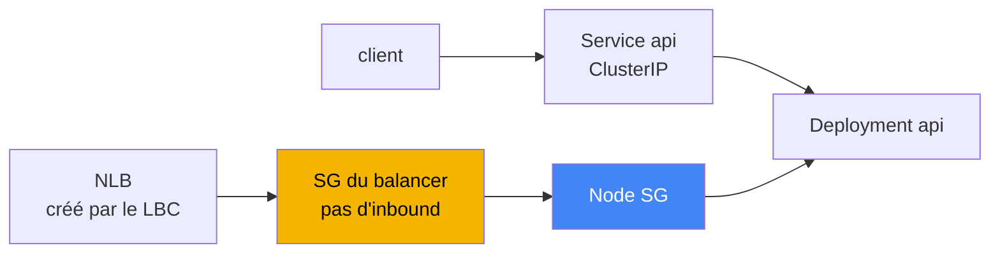
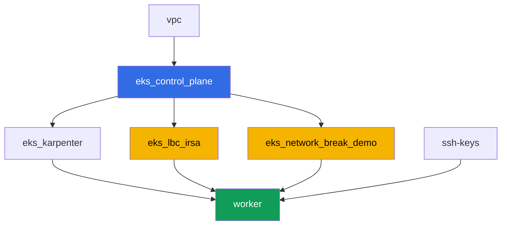

[Русская версия](README_RU.MD) · [Eng version](README.MD) · [Versión en español](README_ES.MD) · [Deutsche Version](README_DE.MD) · [ქართული ვერსია](README_GE.MD) · [繁體中文版](README_TW.MD) · [日本語版](README_JP.MD)

# Lab 120 - Dépannage : pannes réseau et targets unhealthy du load balancer

## Description

Le cluster est up, les nodes sont `Ready`, mais le réseau se comporte mal de deux
façons différentes : la connectivité casse à un endroit, et les targets du load
balancer passent au rouge à un autre. Dans cette lab, vous traitez exactement une
seule classe de panne - le security group - et vous apprenez à la distinguer du
DNS, qui n'est pas en cause ici. Il y a une panne déterministe : terraform
pré-crée un security group vide sans aucune règle inbound. Vous l'attachez à un
Network Load Balancer comme security group propre du balancer, vous observez les
targets passer à `unhealthy`, vous diagnostiquez la cause avec des commandes AWS
CLI, et vous la corrigez avec le même outil - `aws ec2
authorize-security-group-ingress`.

Décision de conception. La même configuration terraform doit reproduire la panne
de façon déterministe à chaque exécution de la lab, donc la source de la panne
est exactement un security group vide pré-créé, sans règle inbound. Son rôle
dans la lab est celui du security group propre du NLB (l'annotation Service
`aws-load-balancer-security-groups`). Dès que vous définissez explicitement
votre propre SG sur le balancer, l'AWS Load Balancer Controller arrête d'ajouter
pour vous la règle inbound manquante au node SG - c'est exactement le constat du
chapitre 46.6 : « le SG de la target ne laisse pas passer le trafic du SG du
balancer vers le port de vérification ». La connectivité pod-à-pod (tâches 1-2)
dans cette lab fonctionne bien par conception - elle sert d'exemple contrastant
et de terrain d'entraînement pour les commandes de diagnostic du chapitre 46.7,
tandis que la seule vraie panne se trouve dans le scénario NLB (tâches 4-6). Le
scénario avec un security group propre au pod (security groups pour les pods)
fait l'objet d'une lab séparée du cours.

Les tâches sont écrites dans un style production : un énoncé court plus des
critères d'acceptation. La vérification est automatique, via la commande
`check_result`.

## Objectif

Renforcer le chapitre du cours :

- [Chapitre 46. Pannes réseau : SG, NACL, DNS, targets unhealthy](../../course/46/ru.md)

## Ce que nous créons

Le cluster est déjà déployé en code (la même base que dans la lab 101), plus un
rôle IRSA pour l'AWS Load Balancer Controller et un security group « cassé »
séparé, sans règle inbound.

| Objet | Ce que c'est | Pourquoi c'est dans cette lab |
|--------|---------|-------------------|
| Namespace `eks-120` | une section du cluster pour la charge de travail de la lab | garde les objets de la lab séparés des objets système |
| Deployment `api` (2 replicas) | l'application ping_pong, port `8080` | la target des vérifications de connectivité et du NLB |
| Service `api` (ClusterIP) | `80 -> 8080` | connectivité de base dans le cluster |
| Deployment `client` | busybox, `sleep` | source des requêtes vers `api` |
| Composant `eks_network_break_demo` | SG vide sans règle inbound | la panne elle-même (chapitres 46.3, 46.6) |
| Composant `eks_lbc_irsa` | rôle IRSA pour le contrôleur | permissions sur l'API ELBv2 pour l'installation Helm |
| Service `api-lb` (LoadBalancer) | NLB avec le SG « cassé » comme SG du balancer | reproduit les targets unhealthy (chapitre 46.6) |

Le schéma de trafic résultant :



## Infrastructure

L'environnement est déployé dans AWS (`eu-central-1`) via Terragrunt. Chaque
répertoire de lab est un composant avec son propre `terragrunt.hcl`, qui
référence un module partagé dans `terraform/modules/` et déclare des
dépendances via des blocs `dependency`.

### Modules et dépendances

| Répertoire (composant) | Module (`terraform/modules/`) | Dépend de | Ce qu'il crée |
|---------------------|-------------------------------|------------|-------------|
| `vpc` | `vpc_v3` | - | VPC `10.10.0.0/16`, subnets dans deux AZ, NAT |
| `ssh-keys` | `ssh-keys` | - | une paire de clés SSH pour la machine worker |
| `eks_control_plane` | `eks_v2_control_plane` | `vpc` | control plane EKS `1.36`, OIDC, node SG |
| `eks_fargate_system` | `eks_v2_fargate` | `vpc`, `eks_control_plane` | profil Fargate pour `kube-system` et `karpenter` |
| `eks_addons` | `eks_v2_addons` | `eks_control_plane`, `eks_fargate_system` | addons coredns, kube-proxy, vpc-cni, pod-identity |
| `eks_karpenter` | `eks_v2_karpenter` | `vpc`, `eks_control_plane`, `eks_addons`, `eks_fargate_system` | contrôleur Karpenter, rôle IAM du node |
| `eks_karpenter_default_vng` | `eks_v2_karpenter_vng` | `vpc`, `eks_control_plane`, `eks_karpenter` | NodePool par défaut sur AL2023 |
| `eks_lbc_irsa` | `eks_v2_lbc_irsa` | `eks_control_plane` | rôle IAM IRSA pour l'AWS Load Balancer Controller |
| `eks_network_break_demo` | `eks_v2_network_break_demo` | `vpc`, `eks_control_plane` | SG vide sans règle inbound |
| `worker` | `eks_v2_work_pc` | `ssh-keys`, `vpc`, `eks_control_plane`, `eks_karpenter`, `eks_lbc_irsa`, `eks_network_break_demo` | machine worker avec `check_result` |

Le module `eks_v2_network_break_demo` crée exactement un security group avec une
description correcte mais sans aucune règle inbound (seulement un egress
allow-all, pour que le SG se comporte de façon prévisible et ne perturbe pas le
diagnostic du trafic sortant). Le nom du SG est assemblé de façon prévisible à
partir de `prefix` et `app_name` : `eks-task120-network-break-sg`. La ressource
elle-même ne sait pas à quoi elle sera attachée - c'est à l'étudiant de le
décider selon les instructions de la tâche 4.

Graphe de dépendances (ce qui est appliqué plus tôt est plus bas sur la flèche) :



Les composants `eks_fargate_system`, `eks_addons`, `eks_karpenter_default_vng`
ne sont pas montrés sur le graphe pour le garder sous 8 nodes - ils sont
appliqués dans l'ordre standard entre `eks_control_plane` et `eks_karpenter`,
comme dans la lab 101.

### Noms de ressources prévisibles

`eks_network_break_demo` et `eks_lbc_irsa` assemblent leurs noms à partir de
`prefix` et `app_name`, donc le worker peut les trouver sans lire la sortie
terraform. Ils sont enregistrés dans le fichier `~/lab120_hints.txt` sur la
machine worker :

| Ressource | Comment la trouver |
|--------|-----------|
| SG « cassé » | nom `eks-task120-network-break-sg` |
| Rôle IRSA pour le LBC | nom du rôle `<cluster-name>-lbc-irsa` |
| Node SG de Karpenter | tag `karpenter.sh/discovery=<cluster-name>` |

### Où les choses sont configurées

`env.hcl` (paramètres d'environnement partagés) :

| Paramètre | Valeur dans la lab | Ce que ça affecte |
|----------|-----------------|---------------|
| `region` | `eu-central-1` | région pour toutes les ressources |
| `prefix` | `eks-task120` | préfixe pour les noms de ressources, y compris le SG « cassé » |
| `stack_name` | `eks120` | utilisé pour construire `env_name` - le nom du cluster |
| `k8_version` | `1.36.0` | version de kubectl sur la machine worker |

`inputs` dans le `terragrunt.hcl` de chaque composant :

| Fichier | Paramètres clés |
|------|--------------------|
| `eks_network_break_demo/terragrunt.hcl` | le `vpc_id` du cluster, SG « cassé » sans règles en entrée |
| `eks_lbc_irsa/terragrunt.hcl` | `name` (cluster) et `oidc_provider_arn` pour la trust policy |
| `worker/terragrunt.hcl` | `test_url`, `task_script_url` pour les fichiers de la lab 120 |

## Déploiement

```bash
TASK=120 make run_eks_task
```

Le déploiement prend environ 15-20 minutes. Dans la sortie, trouvez la ligne
avec la connexion SSH à la machine worker et connectez-vous. kubectl y est
déjà configuré pour le bon cluster, et les noms de ressources de la lab sont
dans `~/lab120_hints.txt`.

Commandes utiles sur la machine worker :

```bash
time_left       # combien de temps il reste dans l'environnement
check_result    # vérifier la solution
cat ~/lab120_hints.txt   # noms et ARN des ressources de la lab
```

> Sécurité de l'environnement. `env.hcl` a `ssh_password_enable = true` et
> `access_cidrs = ["0.0.0.0/0"]` activés - pratique pour un environnement de
> formation, mais ce n'est pas quelque chose à faire en production. Selon les
> standards du cours (chapitres 0.2, 2, 19), l'accès aux machines worker doit
> passer par AWS SSM Session Manager sans exposer de ports SSH publics, et
> `access_cidrs` doit être restreint à des adresses spécifiques. Ici le SSH
> public est laissé en place uniquement pour garder la configuration simple.

## Tâches

Le bloc 1 (tâches 1-2) est la connectivité de base dans le cluster, qui
fonctionne bien et sert de terrain d'entraînement pour les commandes de
diagnostic du chapitre 46.7. Le bloc 2 (tâches 3-6) est la seule vraie panne de
la lab : des targets unhealthy dans le NLB causées par un SG (chapitre 46.6). Le
bloc 3 (tâches 7-8) est une vérification de bon sens du DNS et une checklist
finale.

---
|        **1**        | **Namespace et charge de travail de la lab**                                |
| :-----------------: | :----------------------------------------------------------- |
| Que faire          | Créez un namespace nommé `eks-120`. À l'intérieur, créez le Deployment `api` (image `viktoruj/ping_pong:latest`, `2` replicas, `containerPort: 8080`, label `app: api`) et le Service `api` de type `ClusterIP` (`port: 80`, `targetPort: 8080`, selector `app: api`). Créez le Deployment `client` (image `busybox:1.36`, commande `sleep 3600`, label `app: client`). Attendez que les deux Deployments soient prêts. |
| Critères d'acceptation    | - le namespace `eks-120` existe;<br/>- Deployment `api` (`2/2` replicas, image `ping_pong`);<br/>- Deployment `client` (`1/1`, image `busybox`);<br/>- Service `api` ClusterIP avec `targetPort: 8080`. |
---
|        **2**        | **Connectivité de base et diagnostic SG**                       |
| :-----------------: | :------------------------------------------------------------ |
| Que faire          | Depuis le pod `client`, faites une requête vers `api` par le nom DNS du service (`wget -qO- --timeout=5 http://api.eks-120.svc.cluster.local` ou un équivalent curl) et enregistrez la réponse dans `/var/work/tests/artifacts/2/connectivity.txt` - elle doit contenir une ligne avec la réponse de l'application. Ensuite, prenez l'IP d'un des pods `api` et trouvez son ENI : `aws ec2 describe-network-interfaces --filters "Name=addresses.private-ip-address,Values=<ip>" --query 'NetworkInterfaces[0].Groups'`, en enregistrant la sortie dans `/var/work/tests/artifacts/2/api_sg.txt`. Faites attention au filtre : avec VPC CNI, l'IP du pod est une adresse secondaire sur l'ENI du node, donc chercher par `private-ip-address` renvoie `null` - il faut utiliser `addresses.private-ip-address` à la place. Cette connectivité fonctionne bien : le node SG autorise le trafic entre les pods du cluster, et les SG sont stateful, donc le trafic de retour passe tout seul (chapitre 46.3). |
| Critères d'acceptation    | - `2/connectivity.txt` n'est pas vide et contient `Server Name`;<br/>- `2/api_sg.txt` n'est pas vide et contient `GroupId` et l'id du node SG du cluster. |
---
|        **3**        | **Installation de l'AWS Load Balancer Controller**                   |
| :-----------------: | :------------------------------------------------------------ |
| Que faire          | Trouvez l'ARN du rôle IAM créé par terraform pour le contrôleur (nom du rôle `<cluster-name>-lbc-irsa`, disponible dans `~/lab120_hints.txt`), et créez le ServiceAccount `aws-load-balancer-controller` dans `kube-system` avec l'annotation `eks.amazonaws.com/role-arn` pointant vers ce rôle. Installez l'AWS Load Balancer Controller via Helm (dépôt `https://aws.github.io/eks-charts`, chart `aws-load-balancer-controller`) avec les flags `--set serviceAccount.create=false --set serviceAccount.name=aws-load-balancer-controller` et `--set clusterName=<cluster name>`. Remarque : dans cet environnement `kube-system` relève du profil Fargate, et Fargate n'a pas d'IMDS, donc le contrôleur ne peut pas déterminer la région et le VPC par lui-même et échouera avec une erreur mentionnant `ec2imds`. Définissez-les explicitement : `--set region=eu-central-1` et `--set vpcId=<vpc-id>` (obtenez l'id via `aws eks describe-cluster --name <cluster> --query 'cluster.resourcesVpcConfig.vpcId'`). Attendez que le Deployment `aws-load-balancer-controller` devienne prêt. |
| Critères d'acceptation    | - ServiceAccount `aws-load-balancer-controller` dans `kube-system` avec une annotation pointant vers le rôle `lbc-irsa`;<br/>- Deployment `aws-load-balancer-controller` a au moins une replica prête. |
---
|        **4**        | **Symptôme : NLB avec des targets unhealthy**                          |
| :-----------------: | :------------------------------------------------------------ |
| Que faire          | Trouvez l'id du SG « cassé » (nom `eks-task120-network-break-sg`, disponible dans `~/lab120_hints.txt`). Créez le Service `api-lb` de type `LoadBalancer` avec le selector `app: api`, le port `80` sur `targetPort: 8080`, et les annotations `service.beta.kubernetes.io/aws-load-balancer-type: external`, `aws-load-balancer-nlb-target-type: ip`, `aws-load-balancer-scheme: internet-facing`, `aws-load-balancer-security-groups: <id du SG cassé>`. Cette annotation fait du SG « cassé » le SG propre du balancer - il n'a pas de règle inbound, donc le LBC n'ajoutera pas automatiquement la règle manquante pour le health check. Attendez l'adresse externe, puis exécutez `aws elbv2 describe-target-health --target-group-arn <arn> --query 'TargetHealthDescriptions[].[Target.Id,TargetHealth.State,TargetHealth.Reason]'` et enregistrez la sortie dans `/var/work/tests/artifacts/4/unhealthy.txt`. |
| Critères d'acceptation    | - Service `api-lb` avec les trois annotations et une adresse externe;<br/>- `4/unhealthy.txt` n'est pas vide et contient `unhealthy`. |
---
|        **5**        | **Diagnostic : quel SG bloque le health check**               |
| :-----------------: | :------------------------------------------------------------ |
| Que faire          | Exécutez `aws ec2 describe-security-groups --group-ids <id du SG cassé>` et confirmez qu'il n'a aucune règle inbound. Trouvez l'id du node SG de Karpenter (tag `karpenter.sh/discovery=<cluster-name>`, la commande est dans `~/lab120_hints.txt`) et expliquez dans `/var/work/tests/artifacts/5/diagnosis.txt` pourquoi le health check du NLB n'atteint pas le pod `api` : le SG de la target (le node SG) n'autorise pas le trafic inbound depuis le SG du balancer sur le port de vérification (chapitre 46.6). Le texte doit contenir les mots `security group` et `health check`. |
| Critères d'acceptation    | - `5/diagnosis.txt` n'est pas vide et contient `security group` et `health check`. |
---
|        **6**        | **Correction : authorize-security-group-ingress, targets healthy**    |
| :-----------------: | :------------------------------------------------------------ |
| Que faire          | Ajoutez deux règles : `aws ec2 authorize-security-group-ingress --group-id <node SG> --protocol tcp --port 8080 --source-group <SG cassé>` (ouvre le health check et le trafic applicatif depuis le SG du balancer vers le node SG) et `aws ec2 authorize-security-group-ingress --group-id <SG cassé> --protocol tcp --port 80 --cidr 0.0.0.0/0` (ouvre le listener du NLB pour les clients). Attendez `healthy` dans `describe-target-health` et un `curl` réussi contre l'adresse externe du NLB. Enregistrez les deux sorties dans `/var/work/tests/artifacts/6/healthy.txt`. |
| Critères d'acceptation    | - `6/healthy.txt` n'est pas vide, contient `healthy` et ne contient pas `FailedHealthChecks`;<br/>- le fichier a une ligne avec la réponse de l'application (`Server Name`). |
---
|        **7**        | **Le DNS fonctionne : une vérification contrastante**                        |
| :-----------------: | :------------------------------------------------------------ |
| Que faire          | Exécutez `kubectl run dnstest --image=busybox:1.36 --rm -i --restart=Never -- sh -c 'nslookup kubernetes.default.svc.cluster.local; nslookup example.com'` et enregistrez la sortie dans `/var/work/tests/artifacts/7/dns.txt`. Interrogez le nom interne par son FQDN complet : le nom court `kubernetes.default` depuis busybox renvoie `NXDOMAIN`, car son `nslookup` n'ajoute pas les search domains, et cette réponse est facile à confondre avec une panne DNS qui n'existe pas. Dans cette lab, le DNS n'est pas la source du problème - les deux noms se résolvent bien, contrairement au security group des tâches 4-6 (chapitres 46.5, 46.7). |
| Critères d'acceptation    | - `7/dns.txt` n'est pas vide et contient `kubernetes.default` et `example.com`. |
---
|        **8**        | **Checklist finale : symptôme - cause probable - quoi vérifier**       |
| :-----------------: | :------------------------------------------------------------ |
| Que faire          | Remplissez une ligne pour le symptôme de cette lab selon la checklist du chapitre 46.7, dans le fichier `/var/work/tests/artifacts/8/summary.txt` : quel symptôme a été observé (targets `unhealthy`), quelle est la cause probable (`security group` bloquant le `health check`), et quelle commande le vérifie (`describe-target-health`). Le texte doit contenir les mots `unhealthy`, `security group` et `health check`. |
| Critères d'acceptation    | - `8/summary.txt` n'est pas vide et contient `unhealthy`, `security group`, `health check`. |
---

## Vérification du résultat

Sur la machine worker, lancez la vérification automatique :

```bash
check_result
```

Le script exécute les tests et affiche le pourcentage de tâches terminées.

## Solution

Solution de référence : [worker/files/solutions/1_FR.MD](worker/files/solutions/1_FR.MD)

## Suppression du cluster et des ressources

> **Supprimez d'abord ce que le contrôleur a créé, et seulement ensuite lancez
> terraform.** Le NLB a été créé par l'AWS Load Balancer Controller à partir de
> votre Service, et terraform n'en sait rien. Si vous détruisez la stack sans
> supprimer le Service, le contrôleur disparaît avec le cluster, le NLB reste en
> place, ses ENI continuent de s'accrocher aux security groups - et `destroy`
> se bloque sur `aws_security_group.network_break: Still destroying...` pendant
> des dizaines de minutes.
>
> **Le contrôleur ne nettoiera pas la règle que vous avez ajoutée au node SG
> dans la tâche 6**, et c'est une conséquence directe du scénario de la lab. Le
> contrôleur ne nettoie que ce qu'il possède : le NLB et les security groups
> qu'il a créés. Ici le security group frontend est défini manuellement via
> l'annotation `aws-load-balancer-security-groups`, et dans ce mode le LBC ne
> touche pas du tout par défaut aux règles du security group backend (c'est-à-
> dire le node SG) - c'est exactement pourquoi le health check ne passait pas.
> Vous avez ajouté la règle à la main via l'AWS CLI, elle n'a pas de
> propriétaire dans le cluster, donc vous devrez aussi la retirer à la main.
> Ceci compte : une référence depuis un autre security group empêche de
> supprimer celui visé, et `destroy` s'y bloquerait à la place. Si vous aviez
> défini
> `service.beta.kubernetes.io/aws-load-balancer-manage-backend-security-group-rules: "true"`,
> le contrôleur ajouterait et retirerait lui-même les règles dans le node SG.

```bash
# 1. Supprimer le Service pour que le contrôleur retire lui-même le NLB, et attendre la disparition de l'ENI
kubectl delete svc api-lb -n eks-120
SG_ID=$(grep '^broken_sg_id' ~/lab120_hints.txt | awk '{print $3}')
NODE_SG=$(grep '^node_sg_id' ~/lab120_hints.txt | awk '{print $3}')
until [ "$(aws ec2 describe-network-interfaces \
  --filters "Name=group-id,Values=${SG_ID}" --query 'length(NetworkInterfaces)' --output text)" = "0" ]; do
  echo "Le NLB tient encore l'ENI, on attend..."; sleep 15
done

# 2. Retirer la règle dans le node SG qui référence le SG du balancer
aws ec2 revoke-security-group-ingress --group-id "$NODE_SG" \
  --protocol tcp --port 8080 --source-group "$SG_ID"

# 3. Supprimer le namespace de la lab, et seulement maintenant détruire la stack
kubectl delete namespace eks-120
```

```bash
TASK=120 make delete_eks_task
```

Si `destroy` reste bloqué en supprimant un security group, trouvez ce qui le
retient et retirez-le :

```bash
# qui tient le SG : l'ENI d'un balancer orphelin
aws ec2 describe-network-interfaces --filters "Name=group-id,Values=<sg-id>" \
  --query 'NetworkInterfaces[].[NetworkInterfaceId,Description]' --output table
# un balancer orphelin se repère par les tags service.k8s.aws/stack et elbv2.k8s.aws/cluster
aws elbv2 delete-load-balancer --load-balancer-arn <arn>
# quels security groups le référencent dans leurs règles
aws ec2 describe-security-groups --filters "Name=ip-permission.group-id,Values=<sg-id>" \
  --query 'SecurityGroups[].[GroupId,GroupName]' --output table
```
