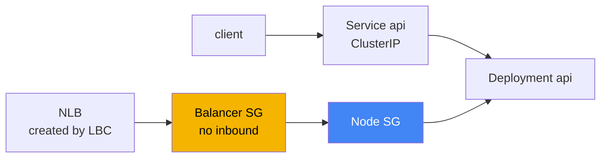
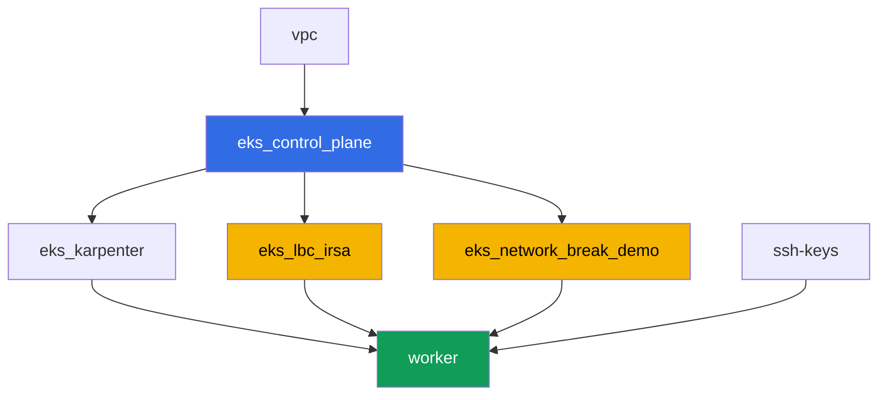

[Русская версия](README_RU.MD) · [Eng version](README.MD) · [Versión en español](README_ES.MD) · [Version française](README_FR.MD) · [Deutsche Version](README_DE.MD) · [繁體中文版](README_TW.MD) · [日本語版](README_JP.MD)

# ლაბა 120 - Troubleshooting: ქსელური სახსრები და unhealthy targets load balancer-ში

## აღწერა

კლასტერი მუშაობს, node-ები `Ready`-ია, მაგრამ ქსელი ორ სხვადასხვა გზით იჩენს ცუდად
თავს: connectivity ერთ ადგილას ტყდება, load balancer-ის targets-ები კი სხვა ადგილას
წითლდებიან. ამ ლაბაში ერთადერთ კლასის სახსარს ხედავთ - security group - და
სწავლობთ, როგორ განასხვავოთ ის DNS-სგან, რომელიც აქ დამტვრეული არ არის. ერთი
დეტერმინირებული სახსარი არსებობს: terraform წინასწარ ქმნის ცარიელ security group-ს
ერთი ინბაუნდ წესის გარეშეც. თქვენ მას ამაგრებთ Network Load Balancer-ზე როგორც
თავად balancer-ის SG, ხედავთ, როგორ ხდება targets-ები `unhealthy`, დიაგნოსტირებთ
მიზეზს AWS CLI ბრძანებებით და აწესრიგებთ იმავე ინსტრუმენტით -
`aws ec2 authorize-security-group-ingress`.

დიზაინის გადაწყვეტილება. ერთსა და იმავე terraform-კონფიგურაციას ყოველ ლაბის გაშვებაზე
დეტერმინირებულად უნდა გაამრავლოს ეს სახსარი, ამიტომ სახსრის წყარო ზუსტად ერთი
წინასწარ შექმნილი ცარიელი security group-ია ინბაუნდ წესების გარეშე. მისი როლი
ლაბაში - იყოს თავად NLB-ის security group (Service-ის ანოტაცია
`aws-load-balancer-security-groups`). როგორც კი balancer-ს თავად ანიჭებთ საკუთარ SG-ს
ცალსახად, AWS Load Balancer Controller წყვეტს დაგამატოთ node-ის SG-ში ის ინბაუნდ
წესი, რომელიც არ ჰყოფნის - ეს ზუსტად იგივე ფორმულირებაა თავი 46.6-იდან: "target-ის SG
არ უშვებს ტრაფიკს balancer-ის SG-დან შემოწმების პორტზე". Pod-to-pod connectivity
(დავალებები 1-2) ამ ლაბაში წინასწარ მოცემულია, როგორც სამუშაო - ის წარმოადგენს
საკონტრასტო მაგალითს და პლაცდარმს თავი 46.7-ის დიაგნოსტიკური ბრძანებებისთვის, ხოლო
ერთადერთი ნამდვილი სახსარი NLB-ის სცენარშია (დავალებები 4-6). სცენარი pod-ის საკუთარ
SG-ით (security groups for pods) კურსის ცალკე ლაბის თემაა.

დავალებები დაწერილია production-სტილში: მოკლე დებულება პლუს მიღების კრიტერიუმები.
შემოწმება ავტომატურია, ბრძანებით `check_result`.

## მიზანი

გავიმყაროთ კურსის თავის მასალა:

- [თავი 46. ქსელური სახსრები: SG, NACL, DNS, unhealthy targets](../../course/46/ru.md)

## რას ვქმნით

კლასტერი უკვე გაშლილია კოდის სახით (იგივე ბაზა, რაც ლაბა 101-ში), პლუს IRSA role AWS
Load Balancer Controller-ისთვის და ცალკე "დამტვრეული" security group ინბაუნდ წესების
გარეშე.

| ობიექტი | რას წარმოადგენს | რატომ არის ამ ლაბაში |
|--------|---------|-------------------|
| Namespace `eks-120` | კლასტერის ნაწილი ლაბის დატვირთვისთვის | ლაბის რესურსებს ცალკე ვაწესებთ სისტემურისგან |
| Deployment `api` (2 replica) | ping_pong აპლიკაცია, პორტი `8080` | connectivity-შემოწმებების და NLB-ის target |
| Service `api` (ClusterIP) | `80 -> 8080` | ბაზისური connectivity კლასტერის შიგნით |
| Deployment `client` | busybox, `sleep` | `api`-სთვის მოთხოვნების წყარო |
| კომპონენტი `eks_network_break_demo` | ცარიელი SG ინბაუნდ წესების გარეშე | თავად სახსარი (თავები 46.3, 46.6) |
| კომპონენტი `eks_lbc_irsa` | IRSA role კონტროლერისთვის | უფლებები ELBv2 API-ზე Helm-ინსტალაციისთვის |
| Service `api-lb` (LoadBalancer) | NLB "დამტვრეული" SG-ით, როგორც balancer-ის SG | აღწარმოებს unhealthy targets-ს (თავი 46.6) |

ტრაფიკის შედეგადი სურათი:



## ინფრასტრუქტურა

გარემო იშლება AWS-ში (`eu-central-1`) Terragrunt-ის მეშვეობით. ლაბის ყოველი
დირექტორია - ეს ერთი კომპონენტია საკუთარი `terragrunt.hcl`-ით, რომელიც მიუთითებს
საერთო მოდულზე `terraform/modules/`-ში და აცხადებს დამოკიდებულებებს `dependency`
ბლოკებით.

### მოდულები და დამოკიდებულებები

| დირექტორია (კომპონენტი) | მოდული (`terraform/modules/`) | დამოკიდებულია | რას ქმნის |
|---------------------|-------------------------------|------------|-------------|
| `vpc` | `vpc_v3` | - | VPC `10.10.0.0/16`, subnets ორ AZ-ში, NAT |
| `ssh-keys` | `ssh-keys` | - | SSH-გასაღებების წყვილი worker მანქანისთვის |
| `eks_control_plane` | `eks_v2_control_plane` | `vpc` | EKS control plane `1.36`, OIDC, node SG |
| `eks_fargate_system` | `eks_v2_fargate` | `vpc`, `eks_control_plane` | Fargate profile `kube-system`-ისთვის და `karpenter`-ისთვის |
| `eks_addons` | `eks_v2_addons` | `eks_control_plane`, `eks_fargate_system` | add-on-ები coredns, kube-proxy, vpc-cni, pod-identity |
| `eks_karpenter` | `eks_v2_karpenter` | `vpc`, `eks_control_plane`, `eks_addons`, `eks_fargate_system` | Karpenter კონტროლერი, node-ის IAM role |
| `eks_karpenter_default_vng` | `eks_v2_karpenter_vng` | `vpc`, `eks_control_plane`, `eks_karpenter` | ნაგულისხმევი NodePool AL2023-ზე |
| `eks_lbc_irsa` | `eks_v2_lbc_irsa` | `eks_control_plane` | IAM IRSA role AWS Load Balancer Controller-ისთვის |
| `eks_network_break_demo` | `eks_v2_network_break_demo` | `vpc`, `eks_control_plane` | ცარიელი SG ინბაუნდ წესების გარეშე |
| `worker` | `eks_v2_work_pc` | `ssh-keys`, `vpc`, `eks_control_plane`, `eks_karpenter`, `eks_lbc_irsa`, `eks_network_break_demo` | worker მანქანა `check_result`-ით |

მოდული `eks_v2_network_break_demo` ქმნის ზუსტად ერთ security group-ს სწორი
აღწერით, მაგრამ ინბაუნდ წესის გარეშე სულაც (მხოლოდ allow-all egress, რომ SG
პროგნოზირებადად იქცეოდეს და არ აბუჩავებდეს outbound ტრაფიკის დიაგნოსტიკას). SG-ის
სახელი პროგნოზირებადად შედგენილია `prefix`-იდან და `app_name`-იდან:
`eks-task120-network-break-sg`. თავად რესურსი არ იცის, რაზე დაამაგრებენ მას - ამას
სტუდენტი წყვეტს დავალება 4-ის ინსტრუქციის მიხედვით.

დამოკიდებულების გრაფი (რაც უფრო ადრე გამოიყენება, ისე უფრო დაბლაა ისარზე):



კომპონენტები `eks_fargate_system`, `eks_addons`, `eks_karpenter_default_vng` გრაფზე
ნაჩვენები არ არის 8 node-ის ლიმიტის შესანარჩუნებლად - ისინი გამოიყენება სტანდარტული
თანმიმდევრობით `eks_control_plane`-სა და `eks_karpenter`-ს შორის, როგორც ლაბა 101-ში.

### პროგნოზირებადი რესურსების სახელები

`eks_network_break_demo` და `eks_lbc_irsa` ქმნიან სახელებს `prefix`-იდან და
`app_name`-იდან, ამიტომ worker-ს მათი პოვნა terraform output-ის წაკითხვის გარეშე
შეუძლია. ისინი ჩაწერილია ფაილში `~/lab120_hints.txt` worker მანქანაზე:

| რესურსი | როგორ ვიპოვოთ |
|--------|-----------|
| "დამტვრეული" SG | სახელი `eks-task120-network-break-sg` |
| IRSA role LBC-ისთვის | role-ის სახელი `<cluster-name>-lbc-irsa` |
| Karpenter node SG | ტეგი `karpenter.sh/discovery=<cluster-name>` |

### სად კონფიგურირდება რა

`env.hcl` (გარემოს საერთო პარამეტრები):

| პარამეტრი | მნიშვნელობა ლაბაში | რაზე ახდენს გავლენას |
|----------|-----------------|---------------|
| `region` | `eu-central-1` | ყველა რესურსის რეგიონი |
| `prefix` | `eks-task120` | რესურსების სახელების პრეფიქსი, "დამტვრეული" SG-ის ჩათვლით |
| `stack_name` | `eks120` | გამოიყენება `env_name`-ის შედგენისთვის - კლასტერის სახელი |
| `k8_version` | `1.36.0` | kubectl-ის ვერსია worker მანქანაზე |

`inputs` ყოველი კომპონენტის `terragrunt.hcl`-ში:

| ფაილი | ძირითადი პარამეტრები |
|------|--------------------|
| `eks_network_break_demo/terragrunt.hcl` | კლასტერის `vpc_id`, "დამტვრეული" SG წესების input-ების გარეშე |
| `eks_lbc_irsa/terragrunt.hcl` | `name` (კლასტერი) და `oidc_provider_arn` trust policy-სთვის |
| `worker/terragrunt.hcl` | `test_url`, `task_script_url` ლაბა 120-ის ფაილებისთვის |

## გაშლა

```bash
TASK=120 make run_eks_task
```

გაშლას სჭირდება დაახლოებით 15-20 წუთი. გამონატანში იპოვეთ სტრიქონი worker მანქანასთან
SSH-კავშირით და დაუკავშირდით მას. kubectl იქ უკვე კონფიგურირებულია სწორ კლასტერზე, ხოლო
ლაბის რესურსების სახელები არის ფაილში `~/lab120_hints.txt`.

სასარგებლო ბრძანებები worker მანქანაზე:

```bash
time_left       # რამდენი დროა დარჩენილი გარემოს
check_result    # გადაწყვეტის შემოწმება
cat ~/lab120_hints.txt   # ლაბის რესურსების სახელები და ARN-ები
```

> სავარჯიშო სტენდის უსაფრთხოება. `env.hcl`-ში ჩართულია `ssh_password_enable = true`
> და `access_cidrs = ["0.0.0.0/0"]` - მოხერხებულია სასწავლო გარემოსთვის, მაგრამ ასე
> არ ღირს production-ში. კურსის სტანდარტების მიხედვით (თავები 0.2, 2, 19), წვდომა
> worker მანქანებზე იხსნება AWS SSM Session Manager-ის მეშვეობით საჯარო SSH პორტების
> გარეშე, ხოლო `access_cidrs` ვიწროვდება კონკრეტულ მისამართებზე. აქ საჯარო SSH
> დატანილია მხოლოდ გაშვების სიმარტივისთვის.

## დავალებები

ბლოკი 1 (დავალებები 1-2) - ბაზისური connectivity კლასტერის შიგნით, რომელიც
ჩვეულებრივად მუშაობს და წარმოადგენს პლაცდარმს თავი 46.7-ის დიაგნოსტიკური
ბრძანებებისთვის. ბლოკი 2 (დავალებები 3-6) - ლაბის ერთადერთი ნამდვილი სახსარი:
unhealthy targets NLB-ში SG-ის გამო (თავი 46.6). ბლოკი 3 (დავალებები 7-8) - DNS-ის
საკონტროლო შემოწმება და საბოლოო ჩეკლისტი.

---
|        **1**        | **Namespace და ლაბის დატვირთვა**                                |
| :-----------------: | :----------------------------------------------------------- |
| რას ვაკეთებთ          | შექმენით namespace სახელით `eks-120`. მის შიგნით შექმენით Deployment `api` (image `viktoruj/ping_pong:latest`, `2` replica, `containerPort: 8080`, label `app: api`) და Service `api` ტიპით `ClusterIP` (`port: 80`, `targetPort: 8080`, selector `app: api`). შექმენით Deployment `client` (image `busybox:1.36`, ბრძანება `sleep 3600`, label `app: client`). დაელოდეთ ორივე Deployment-ის მზადყოფნას. |
| მიღების კრიტერიუმები    | - namespace `eks-120` არსებობს;<br/>- Deployment `api` (`2/2` replica, image `ping_pong`);<br/>- Deployment `client` (`1/1`, image `busybox`);<br/>- Service `api` ClusterIP `targetPort: 8080`-ით. |
---
|        **2**        | **ბაზისური connectivity და SG-ის დიაგნოსტიკა**                       |
| :-----------------: | :------------------------------------------------------------ |
| რას ვაკეთებთ          | `client` pod-იდან გააგზავნეთ მოთხოვნა `api`-სთან service-ის DNS-სახელით (`wget -qO- --timeout=5 http://api.eks-120.svc.cluster.local` ან curl-ის ანალოგი) და შეინახეთ პასუხი ფაილში `/var/work/tests/artifacts/2/connectivity.txt` - მასში უნდა იყოს სტრიქონი აპლიკაციის პასუხით. შემდეგ აიღეთ ერთ-ერთი `api` pod-ის IP და იპოვეთ მისი ENI: `aws ec2 describe-network-interfaces --filters "Name=addresses.private-ip-address,Values=<ip>" --query 'NetworkInterfaces[0].Groups'`, გამონატანის შენახვით ფაილში `/var/work/tests/artifacts/2/api_sg.txt`. მიაქციეთ ყურადღება ფილტრს: VPC CNI-ის შემთხვევაში pod-ის IP არის მეორადი მისამართი node-ის ENI-ზე, ამიტომ ძებნა `private-ip-address`-ით აბრუნებს `null`-ს - საჭიროა `addresses.private-ip-address`. ეს connectivity ჩვეულებრივად მუშაობს: node SG უშვებს ტრაფიკს კლასტერის pod-ებს შორის, ხოლო SG-ები stateful-ია, ამიტომ საპასუხო ტრაფიკი თავად გადის (თავი 46.3). |
| მიღების კრიტერიუმები    | - `2/connectivity.txt` არ არის ცარიელი, შეიცავს `Server Name`-ს;<br/>- `2/api_sg.txt` არ არის ცარიელი, შეიცავს `GroupId`-ს და კლასტერის node SG-ის id-ს. |
---
|        **3**        | **AWS Load Balancer Controller-ის დაყენება**                   |
| :-----------------: | :------------------------------------------------------------ |
| რას ვაკეთებთ          | იპოვეთ terraform-ის მიერ კონტროლერისთვის შექმნილი IAM role-ის ARN (role-ის სახელი `<cluster-name>-lbc-irsa`, ხელმისაწვდომია `~/lab120_hints.txt`-ში), და შექმენით ServiceAccount `aws-load-balancer-controller` namespace `kube-system`-ში ანოტაციით `eks.amazonaws.com/role-arn`, რომელიც მიუთითებს ამ role-ზე. დააინსტალირეთ AWS Load Balancer Controller Helm-ის მეშვეობით (repository `https://aws.github.io/eks-charts`, chart `aws-load-balancer-controller`) ფლაგებით `--set serviceAccount.create=false --set serviceAccount.name=aws-load-balancer-controller` და `--set clusterName=<კლასტერის სახელი>`. გაითვალისწინეთ: ამ სტენდში `kube-system` მოხვდება Fargate profile-ის ქვეშ, ხოლო Fargate-ს არ აქვს IMDS, ამიტომ კონტროლერს არ შეუძლია თავად განსაზღვროს რეგიონი და VPC და ჩავარდება `ec2imds`-თან დაკავშირებული შეცდომით. მიუთითეთ ისინი ცალსახად: `--set region=eu-central-1` და `--set vpcId=<vpc-id>` (id-ს იღებთ `aws eks describe-cluster --name <cluster> --query 'cluster.resourcesVpcConfig.vpcId'`-იდან). დაელოდეთ Deployment `aws-load-balancer-controller`-ის მზადყოფნას. |
| მიღების კრიტერიუმები    | - ServiceAccount `aws-load-balancer-controller` namespace `kube-system`-ში ანოტაციით `lbc-irsa` role-ზე;<br/>- Deployment `aws-load-balancer-controller`-ს ჰყავს მინიმუმ ერთი მზა replica. |
---
|        **4**        | **სიმპტომი: NLB unhealthy targets-ით**                          |
| :-----------------: | :------------------------------------------------------------ |
| რას ვაკეთებთ          | იპოვეთ "დამტვრეული" SG-ის id (სახელი `eks-task120-network-break-sg`, ხელმისაწვდომია `~/lab120_hints.txt`-ში). შექმენით Service `api-lb` ტიპით `LoadBalancer` selector `app: api`-ით, პორტით `80` `targetPort: 8080`-ზე, და ანოტაციებით `service.beta.kubernetes.io/aws-load-balancer-type: external`, `aws-load-balancer-nlb-target-type: ip`, `aws-load-balancer-scheme: internet-facing`, `aws-load-balancer-security-groups: <დამტვრეული SG-ის id>`. ეს ანოტაცია "დამტვრეულ" SG-ს აქცევს balancer-ის საკუთარ SG-დ - მას არ აქვს ინბაუნდ წესები, ამიტომ LBC ავტომატურად არ დაამატებს ხდომილი წესს health check-ისთვის. დაელოდეთ გარეთა მისამართს, შემდეგ გაუშვით `aws elbv2 describe-target-health --target-group-arn <arn> --query 'TargetHealthDescriptions[].[Target.Id,TargetHealth.State,TargetHealth.Reason]'` და შეინახეთ გამონატანი ფაილში `/var/work/tests/artifacts/4/unhealthy.txt`. |
| მიღების კრიტერიუმები    | - Service `api-lb` სამივე ანოტაციით და გარეთა მისამართით;<br/>- `4/unhealthy.txt` არ არის ცარიელი და შეიცავს `unhealthy`-ს. |
---
|        **5**        | **დიაგნოსტიკა: ვისი SG ბლოკავს health check-ს**               |
| :-----------------: | :------------------------------------------------------------ |
| რას ვაკეთებთ          | გაუშვით `aws ec2 describe-security-groups --group-ids <დამტვრეული SG-ის id>` და დარწმუნდით, რომ მას არ აქვს ერთი ინბაუნდ წესიც. იპოვეთ Karpenter node SG-ის id (ტეგი `karpenter.sh/discovery=<cluster-name>`, ბრძანება ხელმისაწვდომია `~/lab120_hints.txt`-ში) და განმარტეთ ფაილში `/var/work/tests/artifacts/5/diagnosis.txt`, რატომ არ მიაღწევს NLB-ის health check `api` pod-ს: target-ის SG (node SG) არ უშვებს ინბაუნდ ტრაფიკს balancer-ის SG-დან შემოწმების პორტზე (თავი 46.6). ტექსტში უნდა იყოს სიტყვები `security group` და `health check`. |
| მიღების კრიტერიუმები    | - `5/diagnosis.txt` არ არის ცარიელი, შეიცავს `security group`-ს და `health check`-ს. |
---
|        **6**        | **ჩასწორება: authorize-security-group-ingress, targets healthy**    |
| :-----------------: | :------------------------------------------------------------ |
| რას ვაკეთებთ          | დამატეთ ორი წესი: `aws ec2 authorize-security-group-ingress --group-id <node SG> --protocol tcp --port 8080 --source-group <დამტვრეული SG>` (ხსნის health check-ს და აპლიკაციის ტრაფიკს balancer-ის SG-დან node SG-ისკენ) და `aws ec2 authorize-security-group-ingress --group-id <დამტვრეული SG> --protocol tcp --port 80 --cidr 0.0.0.0/0` (ხსნის NLB-ის listener-ს კლიენტებისთვის). დაელოდეთ `healthy`-ს `describe-target-health`-ში და წარმატებულ `curl`-ს NLB-ის გარეთა მისამართზე. შეინახეთ ორივე გამონატანი ფაილში `/var/work/tests/artifacts/6/healthy.txt`. |
| მიღების კრიტერიუმები    | - `6/healthy.txt` არ არის ცარიელი, შეიცავს `healthy`-ს და არ შეიცავს `FailedHealthChecks`-ს;<br/>- ფაილში არსებობს სტრიქონი აპლიკაციის პასუხით (`Server Name`). |
---
|        **7**        | **DNS მუშაობს: საკონტრასტო შემოწმება**                        |
| :-----------------: | :------------------------------------------------------------ |
| რას ვაკეთებთ          | გაუშვით `kubectl run dnstest --image=busybox:1.36 --rm -i --restart=Never -- sh -c 'nslookup kubernetes.default.svc.cluster.local; nslookup example.com'` და შეინახეთ გამონატანი ფაილში `/var/work/tests/artifacts/7/dns.txt`. შეიკითხეთ შინაგანი სახელი მისი სრული FQDN-ით: მოკლე `kubernetes.default` busybox-იდან `nslookup`-ის მეშვეობით აბრუნებს `NXDOMAIN`-ს, რადგან ეს resolver არ ამატებს ძებნის დომენებს `/etc/resolv.conf`-იდან, ისე როგორც ჩვეულებრივი კლიენტი, და ამ პასუხს ადვილად შეიცდები DNS-ის ისეთ სახსრად, რომელიც არ არსებობს. ორივე სახელი ჩვეულებრივად რეზოლვდება (`kubernetes.default.svc.cluster.local` `kubernetes` service-ის მისამართზე, `example.com` გარეთა მისამართებზე) - DNS ამ ლაბაში სახსრის წყარო არ არის (თავები 46.5, 46.7), განსხვავებით security group-ისგან დავალებებიდან 4-6. |
| მიღების კრიტერიუმები    | - `7/dns.txt` არ არის ცარიელი, შეიცავს `kubernetes.default`-ს და `example.com`-ს. |
---
|        **8**        | **საბოლოო ჩეკლისტი: სიმპტომი - სავარაუდო მიზეზი - რის შემოწმებაა საჭირო**       |
| :-----------------: | :------------------------------------------------------------ |
| რას ვაკეთებთ          | შეავსეთ თავი 46.7-ის ჩეკლისტის მიხედვით ამ ლაბის სიმპტომის სტრიქონი ფაილში `/var/work/tests/artifacts/8/summary.txt`: რომელი სიმპტომი შეინიშნებოდა (`unhealthy` targets), რომელია სავარაუდო მიზეზი (`security group` ბლოკავს `health check`-ს) და რომელი ბრძანება ამოწმებს ამას (`describe-target-health`). ტექსტში უნდა იყოს სიტყვები `unhealthy`, `security group` და `health check`. |
| მიღების კრიტერიუმები    | - `8/summary.txt` არ არის ცარიელი და შეიცავს `unhealthy`-ს, `security group`-ს, `health check`-ს. |
---

## შედეგის შემოწმება

worker მანქანაზე გაუშვით ავტომატური შემოწმება:

```bash
check_result
```

სკრიპტი გაუშვებს ტესტებს და აჩვენებს დასრულებული დავალებების პროცენტს.

## გადაწყვეტა

ეტალონური გადაწყვეტა: [worker/files/solutions/1_GE.MD](worker/files/solutions/1_GE.MD)

## კლასტერისა და რესურსების წაშლა

> **პირველად წაშალეთ ის, რაც კონტროლერმა შექმნა, და მხოლოდ შემდეგ გაუშვით terraform.**
> NLB შექმნა AWS Load Balancer Controller-მა თქვენი Service-იდან, terraform-მა მის
> შესახებ არაფერი იცის. თუ სტენდის დანგრევას დაიწყებთ Service-ის წაშლის გარეშე,
> კონტროლერი გაქრება კლასტერთან ერთად, NLB დარჩება ჩამოკიდებული, მისი ENI-ები
> გააგრძელებენ security group-ების ჩაჭერას - და `destroy` ჩამოეკიდება
> `aws_security_group.network_break: Still destroying...`-ზე ათეულ წუთს.
>
> **წესს node SG-ში დავალება 6-იდან კონტროლერი თავად არ მოაშორებს**, და ეს ამ ლაბის
> სცენარის პირდაპირი შედეგია. კონტროლერი ასუფთავებს მხოლოდ იმას, რაც თავად ეკუთვნის:
> NLB და security group-ები, რომლებიც მან შექმნა. აქ frontend security group ხელით
> არის მითითებული ანოტაციით `aws-load-balancer-security-groups`, ხოლო ამ რეჟიმში LBC
> ნაგულისხმევად საერთოდ არ ეხება backend security group-ის წესებს (ესეიგი node SG-ს)
> - ზუსტად ამის გამო health check-იც არ გადიოდა. წესი დაამატეთ ხელით AWS CLI-ის
> მეშვეობით, კლასტერში მას მფლობელი არ ჰყავს, ამიტომ მისი მოშორებაც ხელით მოგიწევთ.
> ეს მნიშვნელოვანია: მითითება სხვა security group-იდან არ აძლევს ნებას წაშალო
> სამიზნე, და `destroy` მასზეც ჩამოეკიდება. თუ დაგესვათ
> `service.beta.kubernetes.io/aws-load-balancer-manage-backend-security-group-rules: "true"`,
> node SG-ის წესებს თავად დაამატებდა და მოაშორებდა კონტროლერი.

```bash
# 1. წავშალოთ Service, რომ კონტროლერმა თავად წაშალოს NLB, და დავიცადოთ ENI-ის გაქრობა
kubectl delete svc api-lb -n eks-120
SG_ID=$(grep '^broken_sg_id' ~/lab120_hints.txt | awk '{print $3}')
NODE_SG=$(grep '^node_sg_id' ~/lab120_hints.txt | awk '{print $3}')
until [ "$(aws ec2 describe-network-interfaces \
  --filters "Name=group-id,Values=${SG_ID}" --query 'length(NetworkInterfaces)' --output text)" = "0" ]; do
  echo "NLB ჯერ კიდევ იჭერს ENI-ს, ველოდებით..."; sleep 15
done

# 2. მოვაშოროთ node SG-ში წესი, რომელიც მითითებულია balancer-ის SG-ზე
aws ec2 revoke-security-group-ingress --group-id "$NODE_SG" \
  --protocol tcp --port 8080 --source-group "$SG_ID"

# 3. წავშალოთ ლაბის namespace, და მხოლოდ ახლა დავანგრიოთ სტენდი
kubectl delete namespace eks-120
```

```bash
TASK=120 make delete_eks_task
```

თუ `destroy` ისევ ჩამოეკიდება security group-ის წაშლას, იპოვეთ, რაც მას იჭერს და
მოაშორეთ:

```bash
# ვინ იჭერს SG-ს: ჩამორთმეული balancer-ის ENI
aws ec2 describe-network-interfaces --filters "Name=group-id,Values=<sg-id>" \
  --query 'NetworkInterfaces[].[NetworkInterfaceId,Description]' --output table
# ჩამორთმეული balancer ჩანს ტეგებით service.k8s.aws/stack და elbv2.k8s.aws/cluster
aws elbv2 delete-load-balancer --load-balancer-arn <arn>
# რომელი security group-ები მითითებულია მასზე თავიანთ წესებში
aws ec2 describe-security-groups --filters "Name=ip-permission.group-id,Values=<sg-id>" \
  --query 'SecurityGroups[].[GroupId,GroupName]' --output table
```
