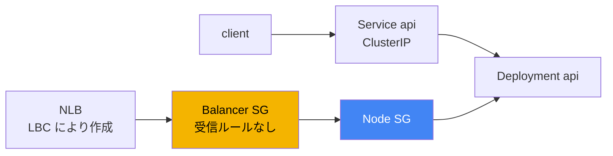
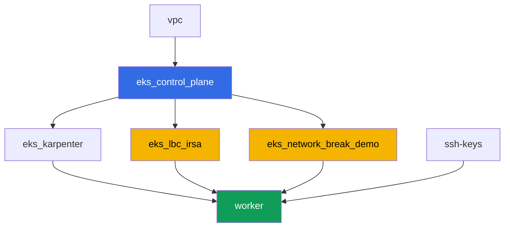

[Русская версия](README_RU.MD) · [Eng version](README.MD) · [Versión en español](README_ES.MD) · [Version française](README_FR.MD) · [Deutsche Version](README_DE.MD) · [ქართული ვერსია](README_GE.MD) · [繁體中文版](README_TW.MD)

# ラボ 120 - トラブルシューティング:ネットワーク障害と unhealthy な load balancer targets

## 説明

クラスタは起動しており、ノードは `Ready` ですが、ネットワークは 2 つの異なる形で不調
を示します:ある場所では接続性が壊れ、別の場所では load balancer の targets が赤くな
ります。このラボでは、まさに 1 種類の障害クラス - security group - に取り組み、それ
を、ここでは原因になっていない DNS と区別できるようにします。決定論的な障害は 1 つだ
け存在します:terraform が、受信ルールを一つも持たない空の security group を事前に作
成しています。これを Network Load Balancer に balancer 自身の SG としてアタッチし、
targets が `unhealthy` になる様子を観察し、AWS CLI のコマンドで原因を診断し、同じツー
ル - `aws ec2 authorize-security-group-ingress` - で修復します。

設計上の判断。同じ terraform 構成が毎回のラボ実行で決定論的に障害を再現しなければなら
ないため、障害の発生源は受信ルールのない事前作成済みの空の security group ちょうど 1
つです。このラボでのその役割は NLB 自身の security group です(Service のアノテーシ
ョン `aws-load-balancer-security-groups`)。balancer に自分の SG を明示的に設定した途
端、AWS Load Balancer Controller はノード SG への不足している受信ルールの追加を自動で
は行わなくなります - これはまさに第 46.6 章の記述と同じです:「target の SG が、check
port へ balancer の SG からのトラフィックを通過させない」。このラボでの pod 間の接続
性(タスク 1-2)は設計上正常に動作します - これは対比のための例であり、第 46.7 章の
診断コマンドのための練習台であって、唯一本物の障害は NLB のシナリオ(タスク 4-6)に存
在します。pod 自身の SG のシナリオ(security groups for pods)は、別のコースラボの主
題です。

タスクは production スタイルで書かれています:短い課題文とアクセプタンス基準。検証は
`check_result` コマンドによって自動的に行われます。

## 目的

コースの以下の章の内容を定着させます:

- [第 46 章。ネットワーク障害:SG、NACL、DNS、unhealthy な targets](../../course/46/ru.md)

## 作成するもの

クラスタはすでにコードとしてデプロイされており(ラボ 101 と同様)、加えて AWS Load
Balancer Controller 用の IRSA ロールと、受信ルールを持たない別の「壊れた」security
group があります。

| オブジェクト | 何か | このラボでの目的 |
|--------|---------|-------------------|
| Namespace `eks-120` | ラボのワークロード用のクラスタ内の区分 | ラボのリソースをシステムのものから分離して保つ |
| Deployment `api`(2 レプリカ) | ping_pong アプリケーション、port `8080` | 接続性チェックと NLB の対象 |
| Service `api`(ClusterIP) | `80 -> 8080` | クラスタ内部での基本的な接続性 |
| Deployment `client` | busybox、`sleep` | `api` へのリクエストの発生源 |
| コンポーネント `eks_network_break_demo` | 受信ルールのない空の SG | 障害そのもの(第 46.3、46.6 章) |
| コンポーネント `eks_lbc_irsa` | コントローラ用の IRSA ロール | Helm インストールのための ELBv2 API への権限 |
| Service `api-lb`(LoadBalancer) | balancer の SG として「壊れた」SG を持つ NLB | unhealthy な targets を再現する(第 46.6 章) |

結果として得られるトラフィックの図:



## インフラストラクチャ

環境は Terragrunt によって AWS(`eu-central-1`)にデプロイされています。各ラボのディ
レクトリは、独自の `terragrunt.hcl` を持つ 1 つのコンポーネントであり、`terraform/modules/`
にある共有モジュールを参照し、`dependency` ブロックを通じて依存関係を宣言します。

### モジュールと依存関係

| ディレクトリ(コンポーネント) | モジュール(`terraform/modules/`) | 依存先 | 作成されるもの |
|---------------------|-------------------------------|------------|-------------|
| `vpc` | `vpc_v3` | - | VPC `10.10.0.0/16`、2 つの AZ にある subnet、NAT |
| `ssh-keys` | `ssh-keys` | - | ワーカーマシン用の SSH キーペア |
| `eks_control_plane` | `eks_v2_control_plane` | `vpc` | EKS control plane `1.36`、OIDC、node SG |
| `eks_fargate_system` | `eks_v2_fargate` | `vpc`、`eks_control_plane` | `kube-system` と `karpenter` 用の Fargate profile |
| `eks_addons` | `eks_v2_addons` | `eks_control_plane`、`eks_fargate_system` | coredns、kube-proxy、vpc-cni、pod-identity アドオン |
| `eks_karpenter` | `eks_v2_karpenter` | `vpc`、`eks_control_plane`、`eks_addons`、`eks_fargate_system` | Karpenter コントローラ、ノードの IAM ロール |
| `eks_karpenter_default_vng` | `eks_v2_karpenter_vng` | `vpc`、`eks_control_plane`、`eks_karpenter` | AL2023 上のデフォルト NodePool |
| `eks_lbc_irsa` | `eks_v2_lbc_irsa` | `eks_control_plane` | AWS Load Balancer Controller 用の IAM IRSA ロール |
| `eks_network_break_demo` | `eks_v2_network_break_demo` | `vpc`、`eks_control_plane` | 受信ルールのない空の SG |
| `worker` | `eks_v2_work_pc` | `ssh-keys`、`vpc`、`eks_control_plane`、`eks_karpenter`、`eks_lbc_irsa`、`eks_network_break_demo` | `check_result` を備えたワーカーマシン |

`eks_v2_network_break_demo` モジュールは、正しい description を持ちながら受信ルールを
一つも持たない security group をちょうど 1 つ作成します(送信は allow-all のみで、
これにより SG の挙動が予測可能になり、送信トラフィックの診断を混乱させません)。SG 名
は `prefix` と `app_name` から予測可能な形で組み立てられます:
`eks-task120-network-break-sg`。このリソース自体は、それが何にアタッチされるかを知り
ません - それはタスク 4 の指示に従って学生が決めることです。

依存関係グラフ(先に適用されるものほど矢印の下側にある):



グラフを 8 ノード以内に収めるため、`eks_fargate_system`、`eks_addons`、
`eks_karpenter_default_vng` のコンポーネントはグラフには表示されていません - これらは
ラボ 101 と同様に、`eks_control_plane` と `eks_karpenter` の間で標準的な順序で適用され
ます。

### 予測可能なリソース名

`eks_network_break_demo` と `eks_lbc_irsa` は `prefix` と `app_name` から名前を組み立
てるため、ワーカーは terraform の出力を読まなくてもそれらを見つけられます。それらはワ
ーカーマシン上のファイル `~/lab120_hints.txt` に記録されています:

| リソース | 見つけ方 |
|--------|-----------|
| 「壊れた」SG | 名前 `eks-task120-network-break-sg` |
| LBC 用の IRSA ロール | ロール名 `<cluster-name>-lbc-irsa` |
| Karpenter ノード SG | タグ `karpenter.sh/discovery=<cluster-name>` |

### どこで設定されているか

`env.hcl`(共有の環境パラメータ):

| パラメータ | このラボでの値 | 何に影響するか |
|----------|-----------------|---------------|
| `region` | `eu-central-1` | すべてのリソースのリージョン |
| `prefix` | `eks-task120` | 「壊れた」SG を含むリソース名のプレフィックス |
| `stack_name` | `eks120` | `env_name`(クラスタ名)の構築に使われる |
| `k8_version` | `1.36.0` | ワーカーマシンの kubectl バージョン |

各コンポーネントの `terragrunt.hcl` の `inputs`:

| ファイル | 主な設定 |
|------|--------------------|
| `eks_network_break_demo/terragrunt.hcl` | クラスタの `vpc_id`、ルールなしの「壊れた」SG の入力 |
| `eks_lbc_irsa/terragrunt.hcl` | trust policy 用の `name`(クラスタ)と `oidc_provider_arn` |
| `worker/terragrunt.hcl` | ラボ 120 のファイル用の `test_url`、`task_script_url` |

## デプロイ

```bash
TASK=120 make run_eks_task
```

デプロイには約 15-20 分かかります。出力の中からワーカーマシンへの SSH 接続の行を見つけ
て接続してください。そこでは kubectl はすでに正しいクラスタ用に設定されており、ラボの
リソース名は `~/lab120_hints.txt` にあります。

ワーカーマシン上で使える便利なコマンド:

```bash
time_left       # 環境の残り時間
check_result    # 解答の確認
cat ~/lab120_hints.txt   # ラボのリソースの名前と ARN
```

> 検証環境のセキュリティについて。`env.hcl` では `ssh_password_enable = true` と
> `access_cidrs = ["0.0.0.0/0"]` が有効になっています - 学習用環境としては便利ですが、
> 本番環境ではこのようにしてはいけません。コースの標準(第 0.2、2、19 章)によれば、ワ
> ーカーマシンへのアクセスは公開 SSH ポートを外に出さずに AWS SSM Session Manager を
> 経由して開き、`access_cidrs` は具体的なアドレスに絞り込みます。ここでは、セットアッ
> プを簡単にするためだけに公開 SSH を残しています。

## タスク

ブロック 1(タスク 1-2)はクラスタ内部の基本的な接続性で、これは正常に動作し、第 46.7
章の診断コマンドのための練習台として機能します。ブロック 2(タスク 3-6)はこのラボの
唯一本物の障害です:SG が原因で NLB の targets が unhealthy になります(第 46.6 章)。
ブロック 3(タスク 7-8)は DNS の健全性チェックと最終チェックリストです。

---
|        **1**        | **namespace とラボのワークロード**                                |
| :-----------------: | :----------------------------------------------------------- |
| やること          | `eks-120` という名前の namespace を作成してください。その内側に、Deployment `api`(イメージ `viktoruj/ping_pong:latest`、`2` レプリカ、`containerPort: 8080`、ラベル `app: api`)と、`ClusterIP` 型の Service `api`(`port: 80`、`targetPort: 8080`、selector `app: api`)を作成してください。Deployment `client`(イメージ `busybox:1.36`、コマンド `sleep 3600`、ラベル `app: client`)を作成してください。両方の Deployment が ready になるまで待ってください。 |
| アクセプタンス基準    | - namespace `eks-120` が存在する;<br/>- Deployment `api`(`2/2` レプリカ、イメージ `ping_pong`);<br/>- Deployment `client`(`1/1`、イメージ `busybox`);<br/>- `targetPort: 8080` の ClusterIP Service `api`。 |
---
|        **2**        | **基本的な接続性と SG の診断**                       |
| :-----------------: | :------------------------------------------------------------ |
| やること          | `client` の pod から、service の DNS 名(`wget -qO- --timeout=5 http://api.eks-120.svc.cluster.local` または同等の curl)で `api` にリクエストを送り、その応答を `/var/work/tests/artifacts/2/connectivity.txt` に保存してください - アプリケーションの応答を含む行が含まれるはずです。次に、`api` の pod のうち 1 つの IP を取得し、その ENI を見つけてください:`aws ec2 describe-network-interfaces --filters "Name=addresses.private-ip-address,Values=<ip>" --query 'NetworkInterfaces[0].Groups'`、出力を `/var/work/tests/artifacts/2/api_sg.txt` に保存してください。フィルタに注意してください:VPC CNI では pod の IP はノードの ENI の secondary アドレスであるため、`private-ip-address` での検索は `null` を返します - 代わりに `addresses.private-ip-address` が必要です。この接続性は正常に動作します:node SG はクラスタの pod 間のトラフィックを許可しており、SG はステートフルであるため、戻りのトラフィックはそのまま通過します(第 46.3 章)。 |
| アクセプタンス基準    | - `2/connectivity.txt` が空でなく `Server Name` を含む;<br/>- `2/api_sg.txt` が空でなく `GroupId` とクラスタの node SG の id を含む。 |
---
|        **3**        | **AWS Load Balancer Controller のインストール**                   |
| :-----------------: | :------------------------------------------------------------ |
| やること          | terraform によってコントローラ用に作成された IAM ロールの ARN(ロール名 `<cluster-name>-lbc-irsa`、`~/lab120_hints.txt` にある)を見つけ、`kube-system` に ServiceAccount `aws-load-balancer-controller` を作成し、そのロールを指すアノテーション `eks.amazonaws.com/role-arn` を付けてください。Helm 経由で AWS Load Balancer Controller をインストールしてください(リポジトリ `https://aws.github.io/eks-charts`、chart `aws-load-balancer-controller`)、フラグ `--set serviceAccount.create=false --set serviceAccount.name=aws-load-balancer-controller` と `--set clusterName=<cluster name>` を付けてください。注意:この環境では `kube-system` は Fargate profile 配下にあり、Fargate には IMDS がないため、コントローラはリージョンと VPC を自分では判定できず、`ec2imds` に言及するエラーで失敗します。それらを明示的に設定してください:`--set region=eu-central-1` と `--set vpcId=<vpc-id>`(id は `aws eks describe-cluster --name <cluster> --query 'cluster.resourcesVpcConfig.vpcId'` から取得)。Deployment `aws-load-balancer-controller` が ready になるまで待ってください。 |
| アクセプタンス基準    | - `kube-system` の ServiceAccount `aws-load-balancer-controller` が `lbc-irsa` ロールを指すアノテーションを持つ;<br/>- Deployment `aws-load-balancer-controller` に少なくとも 1 つの ready なレプリカがある。 |
---
|        **4**        | **症状:unhealthy な targets を持つ NLB**                          |
| :-----------------: | :------------------------------------------------------------ |
| やること          | 「壊れた」SG の id(名前 `eks-task120-network-break-sg`、`~/lab120_hints.txt` にある)を見つけてください。selector `app: api`、port `80` を `targetPort: 8080` に、アノテーション `service.beta.kubernetes.io/aws-load-balancer-type: external`、`aws-load-balancer-nlb-target-type: ip`、`aws-load-balancer-scheme: internet-facing`、`aws-load-balancer-security-groups: <broken SG id>` を持つ、`LoadBalancer` 型の Service `api-lb` を作成してください。このアノテーションによって「壊れた」SG が balancer 自身の SG になります - 受信ルールが一つもないため、LBC は health check のために不足しているルールを自動では追加しません。外部アドレスを待ち、それから `aws elbv2 describe-target-health --target-group-arn <arn> --query 'TargetHealthDescriptions[].[Target.Id,TargetHealth.State,TargetHealth.Reason]'` を実行し、出力を `/var/work/tests/artifacts/4/unhealthy.txt` に保存してください。 |
| アクセプタンス基準    | - Service `api-lb` が 3 つのアノテーションと外部アドレスを持つ;<br/>- `4/unhealthy.txt` が空でなく `unhealthy` を含む。 |
---
|        **5**        | **診断:どの SG が health check を遮断しているか**               |
| :-----------------: | :------------------------------------------------------------ |
| やること          | `aws ec2 describe-security-groups --group-ids <broken SG id>` を実行し、受信ルールが一つもないことを確認してください。Karpenter ノード SG の id(タグ `karpenter.sh/discovery=<cluster-name>`、コマンドは `~/lab120_hints.txt` にある)を見つけ、`/var/work/tests/artifacts/5/diagnosis.txt` に、NLB からの health check が `api` の pod に到達しない理由を説明してください:target の SG(node SG)が、check port への balancer の SG からの受信トラフィックを許可していない(第 46.6 章)。テキストには `security group` と `health check` という語を含める必要があります。 |
| アクセプタンス基準    | - `5/diagnosis.txt` が空でなく `security group` と `health check` を含む。 |
---
|        **6**        | **修復:authorize-security-group-ingress、targets が healthy になる**    |
| :-----------------: | :------------------------------------------------------------ |
| やること          | 2 つのルールを追加してください:`aws ec2 authorize-security-group-ingress --group-id <node SG> --protocol tcp --port 8080 --source-group <broken SG>`(balancer の SG から node SG への health check とアプリケーショントラフィックを開く)と、`aws ec2 authorize-security-group-ingress --group-id <broken SG> --protocol tcp --port 80 --cidr 0.0.0.0/0`(クライアント向けに NLB のリスナーを開く)。`describe-target-health` で `healthy` になるまで、そして NLB の外部アドレスに対する `curl` が成功するまで待ってください。両方の出力を `/var/work/tests/artifacts/6/healthy.txt` に保存してください。 |
| アクセプタンス基準    | - `6/healthy.txt` が空でなく、`healthy` を含み、`FailedHealthChecks` を含まない;<br/>- ファイルにアプリケーションの応答の行(`Server Name`)がある。 |
---
|        **7**        | **DNS は動作する:対比としてのチェック**                        |
| :-----------------: | :------------------------------------------------------------ |
| やること          | `kubectl run dnstest --image=busybox:1.36 --rm -i --restart=Never -- sh -c 'nslookup kubernetes.default.svc.cluster.local; nslookup example.com'` を実行し、出力を `/var/work/tests/artifacts/7/dns.txt` に保存してください。内部名はその完全な FQDN で問い合わせてください:短い `kubernetes.default` を busybox から実行すると `NXDOMAIN` が返ります。これは、その `nslookup` が `/etc/resolv.conf` の search domain を追加しないためであり、この応答は、実際には存在しない DNS の障害と誤解しやすいものです。このラボでは DNS は問題の原因ではありません - 両方の名前とも正常に解決されます(タスク 4-6 の security group とは異なります、第 46.5、46.7 章)。 |
| アクセプタンス基準    | - `7/dns.txt` が空でなく `kubernetes.default` と `example.com` を含む。 |
---
|        **8**        | **最終チェックリスト:症状 - 推定原因 - 何を確認するか**       |
| :-----------------: | :------------------------------------------------------------ |
| やること          | 第 46.7 章のチェックリストに従って、このラボの症状に関する行を、ファイル `/var/work/tests/artifacts/8/summary.txt` に記入してください:どの症状が観察されたか(`unhealthy` な targets)、推定原因は何か(`health check` を遮断する `security group`)、どのコマンドで確認するか(`describe-target-health`)。テキストには `unhealthy`、`security group`、`health check` という語を含める必要があります。 |
| アクセプタンス基準    | - `8/summary.txt` が空でなく `unhealthy`、`security group`、`health check` を含む。 |
---

## 結果の確認

ワーカーマシン上で自動チェックを実行してください:

```bash
check_result
```

スクリプトはテストを実行し、完了したタスクの割合を表示します。

## 解決策

参考解答:[worker/files/solutions/1_JP.MD](worker/files/solutions/1_JP.MD)

## クラスタとリソースの削除

> **まずコントローラが作成したものを削除し、その後で terraform を実行してください。**
> NLB はあなたの Service から AWS Load Balancer Controller によって作成されたもので
> あり、terraform はそれを認識していません。Service を削除せずにスタックを解体する
> と、コントローラはクラスタと一緒に消えますが、NLB は残ったままになり、その ENI が
> security group を掴んだままになります - そして `destroy` は
> `aws_security_group.network_break: Still destroying...` のまま数十分ハングします。
>
> **コントローラは、タスク 6 で node SG に追加したルールをクリーンアップしません**、
> これはこのラボのシナリオの直接の結果です。コントローラは自分が所有しているもの、つ
> まり NLB と自分が作成した security group だけをクリーンアップします。ここではフロン
> トエンドの security group が `aws-load-balancer-security-groups` アノテーション経由
> で手動で設定されており、このモードでは LBC はデフォルトでバックエンドの security
> group(つまり node SG)のルールにまったく触れません - まさにそれが health check が
> 通らなかった理由です。あなたはそのルールを AWS CLI 経由で手作業で追加したので、それ
> はクラスタ内に所有者を持たず、手作業で削除する必要もあります。これは重要です:別の
> security group からの参照は、対象の security group の削除を妨げ、`destroy` はそこで
> 詰まってしまいます。もし
> `service.beta.kubernetes.io/aws-load-balancer-manage-backend-security-group-rules: "true"`
> を設定していたなら、コントローラ自身が node SG のルールを追加・削除していたはずで
> す。

```bash
# 1. Service を削除してコントローラ自身に NLB を削除させ、ENI が消えるまで待つ
kubectl delete svc api-lb -n eks-120
SG_ID=$(grep '^broken_sg_id' ~/lab120_hints.txt | awk '{print $3}')
NODE_SG=$(grep '^node_sg_id' ~/lab120_hints.txt | awk '{print $3}')
until [ "$(aws ec2 describe-network-interfaces \
  --filters "Name=group-id,Values=${SG_ID}" --query 'length(NetworkInterfaces)' --output text)" = "0" ]; do
  echo "NLB still holds the ENI, waiting..."; sleep 15
done

# 2. balancer の SG を参照している、node SG 内のルールを削除する
aws ec2 revoke-security-group-ingress --group-id "$NODE_SG" \
  --protocol tcp --port 8080 --source-group "$SG_ID"

# 3. ラボの namespace を削除し、ここでようやくスタックを解体する
kubectl delete namespace eks-120
```

```bash
TASK=120 make delete_eks_task
```

`destroy` が security group の削除でまだ詰まる場合は、何がそれを掴んでいるかを見つけ
て削除してください:

```bash
# 何が SG を掴んでいるか:孤立した balancer の ENI
aws ec2 describe-network-interfaces --filters "Name=group-id,Values=<sg-id>" \
  --query 'NetworkInterfaces[].[NetworkInterfaceId,Description]' --output table
# 孤立した balancer は service.k8s.aws/stack と elbv2.k8s.aws/cluster タグで見つけられる
aws elbv2 delete-load-balancer --load-balancer-arn <arn>
# どの security group がルールの中でそれを参照しているか
aws ec2 describe-security-groups --filters "Name=ip-permission.group-id,Values=<sg-id>" \
  --query 'SecurityGroups[].[GroupId,GroupName]' --output table
```
