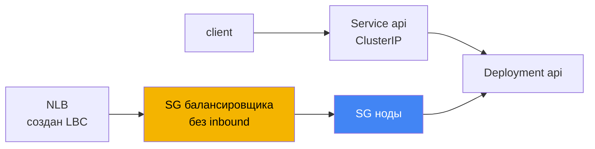
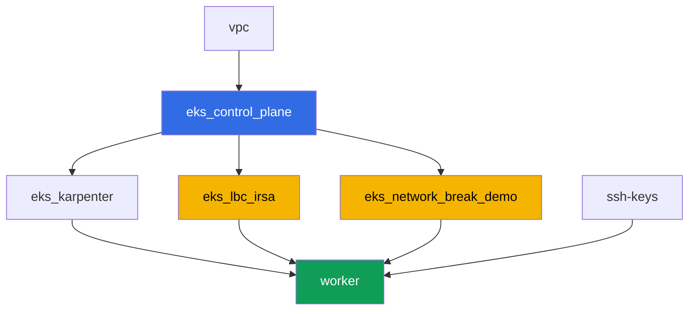

[Eng version](README.MD) · [Versión en español](README_ES.MD) · [Version française](README_FR.MD) · [Deutsche Version](README_DE.MD) · [ქართული ვერსია](README_GE.MD) · [繁體中文版](README_TW.MD) · [日本語版](README_JP.MD)

# Лаба 120 - Troubleshooting: сетевые сбои и unhealthy targets в балансировщике

## Описание

Кластер работает, ноды `Ready`, но сеть подводит по-разному: связность рвётся, а
таргеты в балансировщике краснеют. В этой лабе вы разбираете ровно один класс
сбоя - security group - и учитесь отличать его от DNS, который в этой лабе не
виноват. Поломка одна и воспроизводится детерминированно: terraform заранее создаёт
пустую security group без единого inbound-правила. Вы прикрепляете её к Network
Load Balancer как SG самого балансировщика, наблюдаете, как таргеты становятся
`unhealthy`, диагностируете причину командами AWS CLI и чините её тем же
инструментом - `aws ec2 authorize-security-group-ingress`.

Архитектурное решение. Одна и та же terraform-конфигурация должна детерминированно
воспроизводить поломку при каждом запуске лабы, поэтому источник сбоя - ровно одна
заранее созданная пустая security group без единого inbound-правила. Её роль в
лабе - security group самого NLB (аннотация `aws-load-balancer-security-groups`
Service). Как только вы задаёте свою SG балансировщику явно, AWS Load Balancer
Controller больше не добавляет за вас недостающее inbound-правило в SG нод - это
та же формулировка из главы 46.6: «SG таргета не пускает трафик от SG
балансировщика на порт проверки». Связность под-под (задания 1-2) в этой лабе
заведомо рабочая - она служит контрастным примером и площадкой для диагностических
команд из главы 46.7, а единственная настоящая поломка живёт в сценарии с NLB
(задания 4-6). Сценарий с собственной SG у пода (security groups for pods) -
предмет отдельной лабы курса.

Задания в продакшн-стиле: короткая постановка плюс критерии приёмки. Проверка -
автоматическая, командой `check_result`.

## Цель

Закрепить материал главы курса:

- [Глава 46. Сетевые сбои: SG, NACL, DNS, unhealthy targets](../../course/46/ru.md)

## Что мы создаём

Кластер развёрнут как код (база, как в лабе 101), плюс роль IRSA для AWS Load
Balancer Controller и отдельная "битая" security group без inbound-правил.

| Объект | Что это | Зачем в этой лабе |
|--------|---------|-------------------|
| Namespace `eks-120` | раздел кластера под нагрузку лабы | держим ресурсы отдельно от системных |
| Deployment `api` (2 реплики) | приложение ping_pong, порт `8080` | цель для connectivity-проверок и NLB |
| Service `api` (ClusterIP) | `80 -> 8080` | базовая связность внутри кластера |
| Deployment `client` | busybox, `sleep` | источник запросов к `api` |
| Компонент `eks_network_break_demo` | пустая SG без inbound-правил | сама поломка (глава 46.3, 46.6) |
| Компонент `eks_lbc_irsa` | роль IRSA для контроллера | права на ELBv2 API для Helm-установки |
| Service `api-lb` (LoadBalancer) | NLB с "битой" SG как SG балансировщика | воспроизводит unhealthy targets (глава 46.6) |

Итоговая картина трафика:



## Инфраструктура

Окружение разворачивается в AWS (`eu-central-1`) через Terragrunt. Каждый каталог
лабы - это один компонент со своим `terragrunt.hcl`, который ссылается на общий
модуль в `terraform/modules/` и объявляет зависимости через блоки `dependency`.

### Модули и зависимости

| Каталог (компонент) | Модуль (`terraform/modules/`) | Зависит от | Что создаёт |
|---------------------|-------------------------------|------------|-------------|
| `vpc` | `vpc_v3` | - | VPC `10.10.0.0/16`, подсети в двух AZ, NAT |
| `ssh-keys` | `ssh-keys` | - | пара SSH-ключей для рабочей машины |
| `eks_control_plane` | `eks_v2_control_plane` | `vpc` | control plane EKS `1.36`, OIDC, SG нод |
| `eks_fargate_system` | `eks_v2_fargate` | `vpc`, `eks_control_plane` | Fargate-профиль для `kube-system` и `karpenter` |
| `eks_addons` | `eks_v2_addons` | `eks_control_plane`, `eks_fargate_system` | coredns, kube-proxy, vpc-cni, pod-identity |
| `eks_karpenter` | `eks_v2_karpenter` | `vpc`, `eks_control_plane`, `eks_addons`, `eks_fargate_system` | контроллер Karpenter, IAM-роль нод |
| `eks_karpenter_default_vng` | `eks_v2_karpenter_vng` | `vpc`, `eks_control_plane`, `eks_karpenter` | дефолтный NodePool на AL2023 |
| `eks_lbc_irsa` | `eks_v2_lbc_irsa` | `eks_control_plane` | IAM-роль IRSA для AWS Load Balancer Controller |
| `eks_network_break_demo` | `eks_v2_network_break_demo` | `vpc`, `eks_control_plane` | пустая SG без inbound-правил |
| `worker` | `eks_v2_work_pc` | `ssh-keys`, `vpc`, `eks_control_plane`, `eks_karpenter`, `eks_lbc_irsa`, `eks_network_break_demo` | рабочая машина с `check_result` |

Модуль `eks_v2_network_break_demo` создаёт ровно одну security group с корректным
описанием, но без единого inbound-правила (только allow-all egress, чтобы SG вела
себя предсказуемо и не путала диагностику исходящего трафика). Имя SG предсказуемо
собрано из `prefix` и `app_name`: `eks-task120-network-break-sg`. Сам ресурс не
знает, к чему его прикрепят - это решает студент по инструкции задания 4.

Граф зависимостей (что применяется раньше, то ниже по стрелке):



Компоненты `eks_fargate_system`, `eks_addons`, `eks_karpenter_default_vng` на графе
не показаны ради лимита в 8 узлов - они применяются в стандартном порядке между
`eks_control_plane` и `eks_karpenter`, как в лабе 101.

### Предсказуемые имена ресурсов

`eks_network_break_demo` и `eks_lbc_irsa` собирают имена из `prefix` и `app_name`,
поэтому worker находит их без чтения terraform output. Они лежат в файле
`~/lab120_hints.txt` на рабочей машине:

| Ресурс | Как найти |
|--------|-----------|
| "Битая" SG | имя `eks-task120-network-break-sg` |
| Роль IRSA для LBC | имя роли `<cluster-name>-lbc-irsa` |
| SG нод Karpenter | тег `karpenter.sh/discovery=<cluster-name>` |

### Где что настраивается

`env.hcl` (общие параметры окружения):

| Параметр | Значение в лабе | На что влияет |
|----------|-----------------|---------------|
| `region` | `eu-central-1` | регион всех ресурсов |
| `prefix` | `eks-task120` | префикс имён ресурсов, включая "битую" SG |
| `stack_name` | `eks120` | из него собирается `env_name` - имя кластера |
| `k8_version` | `1.36.0` | версия kubectl на рабочей машине |

`inputs` в `terragrunt.hcl` каждого компонента:

| Файл | Ключевые настройки |
|------|--------------------|
| `eks_network_break_demo/terragrunt.hcl` | `vpc_id` кластера, "битая" SG без inputs про правила |
| `eks_lbc_irsa/terragrunt.hcl` | `name` (кластер) и `oidc_provider_arn` для trust policy |
| `worker/terragrunt.hcl` | `test_url`, `task_script_url` на файлы лабы 120 |

## Развёртывание

```bash
TASK=120 make run_eks_task
```

Развёртывание занимает примерно 15-20 минут. В выводе найдите строку с
SSH-подключением к рабочей машине и подключитесь к ней. kubectl там уже настроен
на нужный кластер, а имена ресурсов лабы - в файле `~/lab120_hints.txt`.

Полезные команды на рабочей машине:

```bash
time_left       # сколько осталось времени окружения
check_result    # проверить решение
cat ~/lab120_hints.txt   # имена и ARN ресурсов лабы
```

> Безопасность стенда. В `env.hcl` включены `ssh_password_enable = true` и
> `access_cidrs = ["0.0.0.0/0"]` - это удобно для учебного окружения, но так делать
> в продакшене нельзя. По стандартам курса (главы 0.2, 2, 19) доступ к рабочим
> машинам открывают через AWS SSM Session Manager без публичных SSH-портов наружу,
> а `access_cidrs` сужают до конкретных адресов. Здесь публичный SSH оставлен
> только ради простоты запуска.

## Задания

Блок 1 (задания 1-2) - базовая связность внутри кластера, работает штатно и служит
площадкой для диагностических команд из главы 46.7. Блок 2 (задания 3-6) -
единственная настоящая поломка лабы: unhealthy targets в NLB из-за SG (глава 46.6).
Блок 3 (задания 7-8) - контроль по DNS и итоговый чеклист.

---
|        **1**        | **Namespace и нагрузка лабы**                                |
| :-----------------: | :----------------------------------------------------------- |
| Что делаем          | Создайте namespace `eks-120`. В нём создайте Deployment `api` (образ `viktoruj/ping_pong:latest`, `2` реплики, `containerPort: 8080`, label `app: api`) и Service `api` типа `ClusterIP` (`port: 80`, `targetPort: 8080`, селектор `app: api`). Создайте Deployment `client` (образ `busybox:1.36`, команда `sleep 3600`, label `app: client`). Дождитесь готовности обоих Deployment. |
| Критерии приёмки    | - namespace `eks-120` существует;<br/>- Deployment `api` (`2/2` реплики, образ `ping_pong`);<br/>- Deployment `client` (`1/1`, образ `busybox`);<br/>- Service `api` ClusterIP с `targetPort: 8080`. |
---
|        **2**        | **Базовая связность и диагностика SG**                       |
| :-----------------: | :------------------------------------------------------------ |
| Что делаем          | Из пода `client` выполните запрос к `api` по DNS-имени сервиса (`wget -qO- --timeout=5 http://api.eks-120.svc.cluster.local` или аналог curl) и сохраните ответ в `/var/work/tests/artifacts/2/connectivity.txt` - он должен содержать строку с ответом приложения. Затем возьмите IP одного из подов `api` и найдите его ENI: `aws ec2 describe-network-interfaces --filters "Name=addresses.private-ip-address,Values=<ip>" --query 'NetworkInterfaces[0].Groups'`, сохранив вывод в `/var/work/tests/artifacts/2/api_sg.txt`. Обратите внимание на фильтр: IP пода при VPC CNI - это вторичный адрес на ENI ноды, поэтому поиск по `private-ip-address` вернёт `null`, а искать надо по `addresses.private-ip-address`. Эта связность работает штатно: SG нод разрешает трафик между подами кластера, а SG - stateful, поэтому обратный трафик проходит сам (глава 46.3). |
| Критерии приёмки    | - `2/connectivity.txt` не пуст, содержит `Server Name`;<br/>- `2/api_sg.txt` не пуст, содержит `GroupId` и id SG нод кластера. |
---
|        **3**        | **Установка AWS Load Balancer Controller**                   |
| :-----------------: | :------------------------------------------------------------ |
| Что делаем          | Найдите ARN IAM-роли, созданной terraform для контроллера (имя роли `<cluster-name>-lbc-irsa`, есть в `~/lab120_hints.txt`), и создайте ServiceAccount `aws-load-balancer-controller` в `kube-system` с аннотацией `eks.amazonaws.com/role-arn` на эту роль. Поставьте AWS Load Balancer Controller через Helm (репозиторий `https://aws.github.io/eks-charts`, чарт `aws-load-balancer-controller`) с флагами `--set serviceAccount.create=false --set serviceAccount.name=aws-load-balancer-controller` и `--set clusterName=<имя кластера>`. Внимание: `kube-system` в этом стенде попадает под Fargate-профиль, а на Fargate нет IMDS, поэтому контроллер не сможет сам определить регион и VPC и упадёт с ошибкой про `ec2imds`. Задайте их явно: `--set region=eu-central-1` и `--set vpcId=<vpc-id>` (id берётся из `aws eks describe-cluster --name <cluster> --query 'cluster.resourcesVpcConfig.vpcId'`). Дождитесь готовности Deployment `aws-load-balancer-controller`. |
| Критерии приёмки    | - ServiceAccount `aws-load-balancer-controller` в `kube-system` с аннотацией на роль `lbc-irsa`;<br/>- Deployment `aws-load-balancer-controller` имеет хотя бы одну готовую реплику. |
---
|        **4**        | **Симптом: NLB с unhealthy targets**                          |
| :-----------------: | :------------------------------------------------------------ |
| Что делаем          | Найдите id "битой" SG (имя `eks-task120-network-break-sg`, есть в `~/lab120_hints.txt`). Создайте Service `api-lb` типа `LoadBalancer` с селектором `app: api`, портом `80` на `targetPort: 8080`, и аннотациями `service.beta.kubernetes.io/aws-load-balancer-type: external`, `aws-load-balancer-nlb-target-type: ip`, `aws-load-balancer-scheme: internet-facing`, `aws-load-balancer-security-groups: <id битой SG>`. Эта аннотация делает "битую" SG собственной SG балансировщика - она без inbound-правил, поэтому LBC не добавит недостающее правило для health check автоматически. Дождитесь внешнего адреса, затем выполните `aws elbv2 describe-target-health --target-group-arn <arn> --query 'TargetHealthDescriptions[].[Target.Id,TargetHealth.State,TargetHealth.Reason]'` и сохраните вывод в `/var/work/tests/artifacts/4/unhealthy.txt`. |
| Критерии приёмки    | - Service `api-lb` с тремя аннотациями и внешним адресом;<br/>- `4/unhealthy.txt` не пуст и содержит `unhealthy`. |
---
|        **5**        | **Диагностика: чья SG не пускает health check**               |
| :-----------------: | :------------------------------------------------------------ |
| Что делаем          | Выполните `aws ec2 describe-security-groups --group-ids <id битой SG>` и убедитесь, что у неё нет ни одного inbound-правила. Найдите id SG нод Karpenter (тег `karpenter.sh/discovery=<cluster-name>`, команда есть в `~/lab120_hints.txt`) и объясните в `/var/work/tests/artifacts/5/diagnosis.txt`, почему health check от NLB не доходит до пода `api`: SG таргета (SG ноды) не разрешает входящий трафик от SG балансировщика на порт проверки (глава 46.6). В тексте должны быть слова `security group` и `health check`. |
| Критерии приёмки    | - `5/diagnosis.txt` не пуст, содержит `security group` и `health check`. |
---
|        **6**        | **Fix: authorize-security-group-ingress, targets healthy**    |
| :-----------------: | :------------------------------------------------------------ |
| Что делаем          | Добавьте два правила: `aws ec2 authorize-security-group-ingress --group-id <SG нод> --protocol tcp --port 8080 --source-group <битая SG>` (открывает health check и трафик приложения от SG балансировщика к SG нод) и `aws ec2 authorize-security-group-ingress --group-id <битая SG> --protocol tcp --port 80 --cidr 0.0.0.0/0` (открывает слушателя NLB для клиентов). Дождитесь `healthy` в `describe-target-health` и успешного `curl` на внешний адрес NLB. Сохраните оба вывода в `/var/work/tests/artifacts/6/healthy.txt`. |
| Критерии приёмки    | - `6/healthy.txt` не пуст, содержит `healthy` и не содержит `FailedHealthChecks`;<br/>- в файле есть строка с ответом приложения (`Server Name`). |
---
|        **7**        | **DNS работает: контрастная проверка**                        |
| :-----------------: | :------------------------------------------------------------ |
| Что делаем          | Выполните `kubectl run dnstest --image=busybox:1.36 --rm -i --restart=Never -- sh -c 'nslookup kubernetes.default.svc.cluster.local; nslookup example.com'` и сохраните вывод в `/var/work/tests/artifacts/7/dns.txt`. Внутреннее имя спрашивайте полным FQDN: короткое `kubernetes.default` из busybox отдаёт `NXDOMAIN`, потому что его `nslookup` не дописывает домены поиска, и такой ответ легко принять за поломку DNS, которой нет. В этой лабе DNS не является источником проблемы - оба имени резолвятся нормально, в отличие от security group из заданий 4-6 (глава 46.5, 46.7). |
| Критерии приёмки    | - `7/dns.txt` не пуст, содержит `kubernetes.default` и `example.com`. |
---
|        **8**        | **Итоговый чеклист: симптом - причина - что проверить**       |
| :-----------------: | :------------------------------------------------------------ |
| Что делаем          | Заполните по чеклисту главы 46.7 строку для симптома этой лабы в файле `/var/work/tests/artifacts/8/summary.txt`: какой симптом наблюдали (`unhealthy` таргеты), какая вероятная причина (`security group` не пускает `health check`) и какой командой это проверяется (`describe-target-health`). В тексте должны быть слова `unhealthy`, `security group` и `health check`. |
| Критерии приёмки    | - `8/summary.txt` не пуст и содержит `unhealthy`, `security group`, `health check`. |
---

## Проверка результата

На рабочей машине запустите автоматическую проверку:

```bash
check_result
```

Скрипт прогонит тесты и покажет процент выполненных заданий.

## Решение

Эталонное решение: [worker/files/solutions/1_RU.MD](worker/files/solutions/1_RU.MD)

## Удаление кластера и ресурсов

> **Сначала уберите то, что создал контроллер, и только потом запускайте terraform.** NLB
> создал AWS Load Balancer Controller по вашему Service, terraform о нём не знает. Если
> удалять стенд, не удалив Service, контроллер исчезнет вместе с кластером, NLB останется
> висеть, его ENI продолжат держать security group - и `destroy` зависнет на
> `aws_security_group.network_break: Still destroying...` на десятки минут.
>
> **Правило в SG нод из задания 6 контроллер за вами не уберёт**, и это прямое следствие
> сценария лабы. Контроллер чистит только то, чем владеет сам: NLB и security group, которые
> он создал. Здесь frontend security group задана вручную аннотацией
> `aws-load-balancer-security-groups`, а в этом режиме LBC по умолчанию вообще не трогает
> правила backend security group (то есть SG нод) - именно поэтому health check и не проходил.
> Правило вы добавили руками через AWS CLI, владельца в кластере у него нет, поэтому снимать
> его тоже придётся руками. Это важно: ссылка из чужой security group не даёт удалить целевую,
> и `destroy` встанет уже на ней. Если бы вы поставили
> `service.beta.kubernetes.io/aws-load-balancer-manage-backend-security-group-rules: "true"`,
> правила в SG нод добавлял и удалял бы сам контроллер.

```bash
# 1. Удалить Service, чтобы контроллер сам удалил NLB, и дождаться исчезновения ENI
kubectl delete svc api-lb -n eks-120
SG_ID=$(grep '^broken_sg_id' ~/lab120_hints.txt | awk '{print $3}')
NODE_SG=$(grep '^node_sg_id' ~/lab120_hints.txt | awk '{print $3}')
until [ "$(aws ec2 describe-network-interfaces \
  --filters "Name=group-id,Values=${SG_ID}" --query 'length(NetworkInterfaces)' --output text)" = "0" ]; do
  echo "NLB ещё держит ENI, ждём..."; sleep 15
done

# 2. Снять правило в SG нод, которое ссылается на SG балансировщика
aws ec2 revoke-security-group-ingress --group-id "$NODE_SG" \
  --protocol tcp --port 8080 --source-group "$SG_ID"

# 3. Удалить namespace лабы и только теперь удалять стенд
kubectl delete namespace eks-120
```

```bash
TASK=120 make delete_eks_task
```

Если `destroy` всё же зависает на удалении security group, найдите держателя и уберите его:

```bash
# кто держит SG: ENI осиротевшего балансировщика
aws ec2 describe-network-interfaces --filters "Name=group-id,Values=<sg-id>" \
  --query 'NetworkInterfaces[].[NetworkInterfaceId,Description]' --output table
# осиротевший балансировщик виден по тегам service.k8s.aws/stack и elbv2.k8s.aws/cluster
aws elbv2 delete-load-balancer --load-balancer-arn <arn>
# какие security groups ссылаются на неё правилами
aws ec2 describe-security-groups --filters "Name=ip-permission.group-id,Values=<sg-id>" \
  --query 'SecurityGroups[].[GroupId,GroupName]' --output table
```
